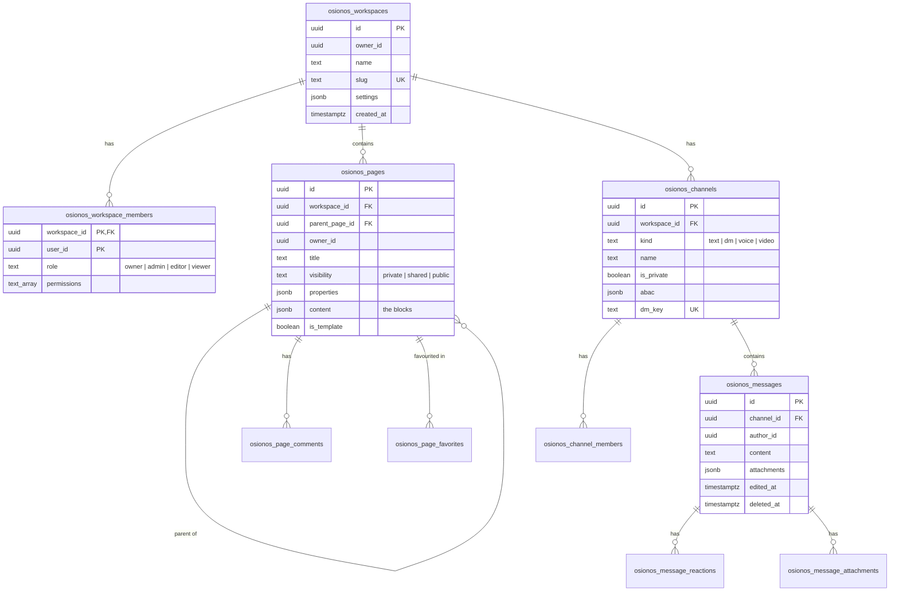

*This project has been created as part of the 42 curriculum by dlesieur, serjimen, danfern3, vjan-nie, shashemi.*

# Track Binocle — ft_transcendence

**Track Binocle** is a collaborative workspace built on top of our own self-hostable
Backend-as-a-Service. Users sign up on a public site, land in **osionos** — a Notion-style block
editor with real-time collaboration, chat and video rooms — and can connect their Gmail and
Google Calendar. Every one of those apps is served by **grobase**, a generic backend that the team
wrote in Go, Rust and TypeScript, and which contains no application-specific code.

---

## Table of contents

1. [Description](#description)
2. [Instructions](#instructions)
3. [Team Information](#team-information)
4. [Project Management](#project-management)
5. [Technical Stack](#technical-stack)
6. [Database Schema](#database-schema)
7. [Features List](#features-list)
8. [Modules](#modules)
9. [Individual Contributions](#individual-contributions)
10. [Resources](#resources)
11. [Known limitations](#known-limitations)
12. [Further documentation](#further-documentation)

---

## Description

### Goal

Almost every web project rebuilds the same backend before it can start on the product:
authentication, user management, CRUD, access control, file upload, email, logs. Our goal was to
turn that repeated work into infrastructure — **one backend, any frontend, zero per-project server
code** — and to prove it by building a real product on it.

The project therefore has two halves:

- **grobase** (roughly 70% of the work) — a Backend-as-a-Service. An application is declared in a
  JSON *contract* (its database, isolation strategy, roles, permissions and API keys); a generic
  provisioner creates everything from that file. Routes carry no domain logic: a request names the
  table it targets, and access rules are stored as data, not code.
- **The products** that run on it — a marketing and authentication site, the osionos editor, and
  mail and calendar integrations.

### Overview

| Product | Tech | What it is |
|---|---|---|
| **opposite-osiris** | Astro | Public site: landing page, sign-up / sign-in, legal pages. The entry point. |
| **osionos** | React + Vite | The block editor: pages, databases-as-blocks, real-time collaboration, chat, video rooms. **The flagship.** |
| **mail** | React + Vite | Gmail integration over Google OAuth |
| **calendar** | React + Vite | Google Calendar integration over Google OAuth |

These four products are supported by four platform services (not applications in their own
right): the **auth-gateway** (Go, sessions), the **osionos-bridge** (turns a site session into an
editor session), **Kong** (the single API gateway in front of grobase) and **LiveKit** (the WebRTC
media server for video rooms).

### Key features

- **Contract-driven backend.** A whole application — database, isolation, roles, keys, frontend
  configuration — is one JSON file. `POST /v1/tenants/me/apps` creates a new isolated application
  with its own database and scoped API key.
- **Per-request owner isolation.** The Rust data plane scopes every query to its owner on every
  request; permissions are rows (ABAC/RBAC), not `if` statements.
- **One API over many databases.** PostgreSQL, MySQL, MongoDB, Redis, SQLite, MSSQL, DynamoDB and
  even remote HTTP APIs are queried through the same envelope and the same API key.
- **Collaborative editor.** Block-based pages, a database block with table / board / calendar
  views, real-time co-editing, channels and direct messages, video rooms.
- **Single-command deployment.** `make all` builds and starts the whole stack in Docker, serves
  every frontend over trusted local HTTPS, and health-checks it.

---

## Instructions

### Prerequisites

| Requirement | Detail | Source |
|---|---|---|
| **Linux host** | Tested on Debian 13; the CA-trust step uses `sudo` + `update-ca-certificates` | `infrastructure/makes/certs.mk` |
| **Docker Engine ≥ 25** + **Compose v2** | Healthchecks use `start_interval`, which needs Docker 25. Tested with Docker 29.8. | `docker-compose.yml:10` |
| **RAM ≥ 8 GB** | Measured: the VM peaked at ~6.5 GB of 8 GB during `make all` | measured, 2026-09-30 |
| **Disk ≥ 30 GB free for Docker** | Measured on the dev VM with the stack running (`docker system df`, 2026-10-01): images 13.5 GB, build cache 9.5 GB, volumes 1.4 GB | measured |
| **GNU Make, git, curl, openssl** | Make drives everything; curl runs the health check; openssl generates the local secrets | `infrastructure/makes/app.mk`, `scripts/gen-local-env.sh:68` |
| **A GitHub SSH key** | `.gitmodules` uses `git@github.com:` URLs, so the recursive clone needs SSH access to GitHub | `.gitmodules` |
| **Google Chrome** | Current stable — the browser the project is evaluated on | |
| `certutil` (optional) | Lets `make all` import the local CA into Chrome's NSS store; otherwise import it by hand (see [Access](#access-and-the-local-ca)) | `infrastructure/makes/certs.mk:43` |

**Nothing else is installed on the host** — no Node, npm, Go or Cargo. Everything builds and runs
in containers.

`make all` asks for **one `sudo` password** the first time: it copies the local CA into the system
trust store. This is intended (`certs-trust-local` in `infrastructure/makes/certs.mk`).

**Ports bound on the host** (from `docker-compose.yml`, all on `127.0.0.1` except inside a
QEMU/VirtualBox NAT VM, where `infrastructure/scripts/detect-bind-addr.sh` binds `0.0.0.0` so the
host can reach the guest): 443, 3001, 3002, 3003, 3007 (always loopback), 4000, 4100, 4200, 4322,
4323, 7880, 7881, 8444, 8787 and UDP 50000–50060. grobase adds Kong on `127.0.0.1:8000`
(literal loopback in its `orchestrators/compose/base/gateway.yml`).

### Defense bring-up (pinned)

This is the path rehearsed on a clean machine. It checks out the release tag and does **not**
follow submodule branch tips (`SKIP_SYNC=1`, see `sync-submodules-soft` in
`infrastructure/makes/pipeline.mk`).

```bash
git clone --recursive git@github.com:Univers42/groot.git
cd groot
git checkout v1.0.0-rc2
git submodule update --init --recursive
make all SKIP_SYNC=1
```

Measured time from a cold machine: **9–17 minutes**.

No `.env` needs to be written by hand. With no vault key present, grobase generates its own
secrets into `apps/grobase/.env`, and `env-local-ensure` derives the root `./.env.local` from it,
including random `OSIONOS_*` secrets (`scripts/gen-local-env.sh`).

`make all` runs, in order (`infrastructure/makes/pipeline.mk`): submodule sync → secrets →
local TLS certificates → trust the local CA → grobase backend → derive `.env.local` → restore
data if the engines are empty → SQL migrations → frontends → health check → URL list.

### Development bring-up

```bash
git checkout develop
make all
```

Without `SKIP_SYNC=1`, `make all` first fast-forwards every submodule to the tip of its tracked
branch (`sync-submodules-soft`), so you build the newest code rather than the pinned commits.
It skips dirty submodules and never blocks the pipeline.

### Checks

| Command | What it proves |
|---|---|
| `make healthcheck` | grobase auth, bridge, osionos, website (and HTTP→HTTPS redirect), auth gateway, drawnosaurus board list (`infrastructure/makes/app.mk`) |
| `make e2e` | Playwright smoke in a pinned container against the running stack: DW3 Whiteboard tab, DW8 two browsers on one board, DW9 the board inside osionos, DW10 Mail/Calendar (`tests/e2e/README.md`) |
| `make mail-up calendar-up` | Start the opt-in Mail and Calendar apps. Without them DW10 **skips** and prints the reason; it never passes silently. |
| `make e2e-clean` | Soft-delete the `e2e-*` boards the smoke leaves behind |

### Access and the local CA

| Service | URL |
|---|---|
| opposite-osiris (start here) | `https://localhost:4322` |
| osionos editor | `https://localhost:3001` |
| Whiteboard (drawnosaurus) | `https://localhost:3007` |
| mail (opt-in) | `https://localhost:3002` |
| calendar (opt-in) | `https://localhost:3003` |
| osionos-bridge | `https://localhost:4000` |
| auth-gateway | `https://localhost:8787/api/auth` |
| grobase API (TLS edge) | `https://localhost:8444` |
| grobase API gateway (Kong, plain HTTP, loopback only) | `http://127.0.0.1:8000` |
| LiveKit | `ws://127.0.0.1:7880` |

`make showcase` prints the list of what is actually running.

Every frontend is served with a certificate from the local CA
`apps/grobase/certs/track-binocle-local-ca.pem`. `make all` trusts it in the system store and, if
`certutil` is installed, in Chrome's NSS store (`~/.pki/nssdb`). If it is not trusted, Chrome shows
a warning on each port — and the **Whiteboard tab in osionos stays blank**, because the embedded
`:3007` iframe is refused silently. Fix: import the CA in Chrome (Settings → Privacy and security →
Security → Manage certificates → Authorities → Import), or run `make certs-trust`.

### Demo

1. Open `https://localhost:4322`, create an account, and continue to osionos.
2. In osionos, open **View → Whiteboard**, click **+ New Board**, give it a title.
3. Open the same board URL in a second window and draw: the strokes appear live in the other
   window (the e2e smoke asserts within 5 s — `tests/e2e/specs/dw8-realtime.spec.ts`).

Honest limitations of this demo: board editing is **loopback-only** and has **no per-user
authorization yet** — drawnosaurus is bound to `127.0.0.1:3007` for exactly that reason
(`docker-compose.yml:27-32`). We make **no end-to-end-encryption claim**: traffic is TLS to the
local proxy, nothing more.

### Environment configuration

- Real credentials live only in git-ignored `.env*` files; the committed template is
  [`.env.example`](.env.example), which documents every key as **required**, **recommended** or
  **optional**.
- Optional integrations turn themselves off cleanly when left blank:
  - `LIVEKIT_API_KEY` / `LIVEKIT_API_SECRET` — default to a local dev value; video rooms still work.
  - `GOOGLE_CLIENT_ID` / `GOOGLE_CLIENT_SECRET` in `apps/mail/.env.local` and
    `apps/calendar/.env.local` — without them, the mail and calendar OAuth flows are disabled.
  - `SONAR_TOK`, `FLY_API_TOKEN`, `DOCKER_PAT` — CI and operations only.

### Team setup (with the vault)

Inside the team, secrets are shared through **vault42**, our zero-knowledge secret store, via the
**42ctl** CLI. A machine that holds a vault identity in `~/.config/42ctl/` pulls the whole `.env`
tree automatically during `make all` (or with `make vault42-pull-all APPLY=1`). A new identity is
created with `42ctl keys init` and enrolled with an invitation from the vault's operator.
Details: [`DATA-MIGRATION.md`](DATA-MIGRATION.md).

### Everyday commands

| Command | What it does |
|---|---|
| `make all` | Full lifecycle: certs → backend → frontends → health check → URLs |
| `make healthcheck` | Probe backend, site, editor, bridge, auth gateway and whiteboard |
| `make showcase` | Print the URL list for what is actually running |
| `make pulls` | Update all submodules |
| `make -C apps/grobase editions` | List the available backend shapes |
| `make all GROBASE_EDITION=full` | Bring up everything, including extra engines and monitoring |
| `docker compose ps` | Service status |
| `docker compose logs -f <service>` | Follow one service's logs |
| `docker compose down` | Stop the frontends (data is kept) |

**Backend editions.** `make all` starts grobase in the **`devlean`** edition
(`GROBASE_EDITION ?= devlean`, `infrastructure/makes/grobase.mk:48`; listed in grobase's
`orchestrators/makes/00-config.mk:68`): the core engines (PostgreSQL, MySQL, MongoDB, Redis,
MinIO), the full application / control / data planes and realtime — without the heavy extra
engines and without the monitoring stack. `GROBASE_EDITION=migrate` adds every snapshot engine;
`GROBASE_EDITION=full` turns everything on. Some module demonstrations need a larger edition or a
feature flag — see [Modules](#modules).

---

## Team Information

Roles as recorded in the team's working notes ([`wiki/project/03-team.md`](wiki/project/03-team.md)):

| Member | Login | Role(s) | Responsibilities |
|---|---|---|---|
| Dylan Lesieur | `dlesieur` | Product Owner · Developer | Product vision, backlog and priorities; validates completed work |
| Daniel Fernández | `danfern3` | Tech Lead · Product Owner | Architecture, stack decisions, code quality, reviews |
| Sergio Jiménez | `serjimen` | Project Manager · Developer | Frontend, secrets management, deployment |
| Vadim Jan | `vjan-nie` | Project Manager · Developer | Planning, tracking, communication, unblocking |
| | `shashemi` | Developer | Features and modules |

---

## Project Management

What the repository records:

- **Planning:** milestones (M1 hardening, M2 federation, M3 coherence, M4 observability,
  M5 security, M11 external-app integration) in
  [`archive/wiki-2026-09/todo/`](archive/wiki-2026-09/todo/).
- **Tools:** GitHub — pull requests on `Univers42/groot`, Dependabot for dependency updates
  ([`.github/dependabot.yml`](.github/dependabot.yml)), GitHub Actions for CI
  ([`.github/workflows/`](.github/workflows/)).
- **Branch model:** work lands on short-lived `feat/`, `fix/`, `docs/`, `test/` and `chore/`
  branches, merged into `develop` by pull request; `develop` is merged into `main` by pull request
  (`git log --merges --format=%s | grep 'pull request'`).
- **Code workflow:** submodule-based monorepo — changes are committed inside a submodule first,
  then the root records the new commit. Numbered **verification gates**
  (`apps/grobase/scripts/verify/run-gate-battery.sh`) are the team's definition of "done":
  grobase's CI runs named gates on pull requests and the full `--enterprise` battery, with a
  nightly schedule (grobase `.github/workflows/ci.yml`).

---

## Technical Stack

### Frontend

| Technology | Used in | Why |
|---|---|---|
| **Astro 6** + **Sass** | opposite-osiris | Mostly static marketing content: Astro ships near-zero JavaScript by default and pre-renders pages, which keeps the public site fast. |
| **React 19** + **Vite 6** + **TypeScript** | osionos, mail, calendar | A block editor is a heavily interactive UI; React's component model fits, and Vite gives fast builds. |
| **Tailwind CSS 4**, **Radix UI**, **lucide-react** | osionos | Utility-first styling framework plus accessible, unstyled primitives for menus and popovers. |
| **Zustand** | osionos | Small, explicit client state store. |
| **Zod** | osionos | Schema validation of user input on the client side. |
| **livekit-client** | osionos | WebRTC video rooms. |
| **Playwright** | osionos | End-to-end browser tests. |
| **Plain CSS** | mail, calendar | Each has a single hand-written `src/styles.css`; no framework. |

### Backend — grobase

grobase is split into **planes** — groups of responsibilities that can be sized and replaced
independently — each written in the language that suits it.

| Plane | Technology | Role | Why this language |
|---|---|---|---|
| **Control plane** | **Go** | Provisioning, tenancy, identity (`POST /v1/keys/verify` turns an API key into an identity) | Long-running, concurrent I/O; a provisioner needs to be correct and readable, not fast. |
| **Data plane** | **Rust** | Executes every query, applies per-owner scoping and ABAC locally | The hot path: predictable latency with no GC pauses, and memory safety where a bug would be a cross-tenant data leak. |
| **Realtime plane** | **Rust** | Turns data changes into events; WebSocket subscriptions | Same reasons; pluggable event bus. |
| **Application plane** | **TypeScript / NestJS** | Query and storage routers, schema, session, permissions, email, GDPR services | The original backend, progressively replaced by the Go and Rust planes. |
| **Auth** | **GoTrue** + Go **auth-gateway** | Sign-up, sign-in, sessions, email OTP | Battle-tested auth server rather than a hand-rolled one. |
| **Gateway** | **Kong** | The only public entry to the backend; key auth and rate limiting | Keeps every internal service off the public network. |
| **Media** | **LiveKit** | WebRTC SFU for video rooms | |

### Database

- **PostgreSQL** is the primary database: the control-plane registries (tenants, roles, policies,
  API keys) and all application data (see [Database Schema](#database-schema)).
  **Why:** row-level security (RLS), JSONB for block content and flexible properties, strong
  transactional guarantees, and a mature ecosystem. RLS is what makes per-owner isolation
  enforceable inside the database itself, not only in application code.
- **MySQL, MongoDB, Redis, MinIO** (object storage) run in the default edition; **SQLite, MSSQL,
  DynamoDB** and remote **HTTP** APIs are supported through the same data-plane interface. This is a
  deliberate feature of the platform (one API over many engines), not a need of osionos itself.

### Other significant technologies

- **Docker / Docker Compose** — every component runs in a container; one `make all`.
- **A local certificate authority + TLS proxy** — all frontends served over trusted HTTPS locally.
- **vault42 / 42ctl** — our own zero-knowledge secret store and CLI (separate repositories).
- **CI security scanning** — on every pull request, [`.github/workflows/mini-baas-security.yml`](.github/workflows/mini-baas-security.yml)
  runs Semgrep (SAST), `npm`/`pnpm audit`, Snyk (when a token is set) and Trivy; Dependabot
  opens dependency updates. `sonar-project.properties` and `renovate.json` are present, but no
  workflow in this repository runs them.

### Justification of the major choices

- **Why build a BaaS instead of a single backend?** Because the same backend pieces are rebuilt
  for every project. We moved everything that varies between projects — routes, schemas, access
  rules, configuration — from code into data, so a new application is a contract, not a server.
- **Why three languages?** Each plane has a different job. Go for boring, correct orchestration;
  Rust where performance and memory safety protect tenant isolation; TypeScript where it already
  existed. The data plane was migrated from TypeScript to Rust behind a per-request switch with a
  *shadow mode* (Rust computes and discards results for comparison), so the migration needed no
  downtime and could be rolled back without a deployment.
- **Why per-request isolation?** Scoping on every request (instead of per connection) means a
  pooled connection can never carry one user's permissions into another user's query.

---

## Database Schema

The schema lives in two places:

1. **Application schema** — idempotent SQL migrations in [`models/`](models/)
   (`*-migration.sql`), applied to grobase's PostgreSQL by `make all` through
   [`scripts/apply-models-migrations.sh`](scripts/apply-models-migrations.sh). That runner
   deliberately skips the files written for the auth gateway's own database (`user.sql`,
   `gdpr-migration.sql`, `auth-security-migration.sql`, `rls-hardening-migration.sql`, `seeds.sql`);
   its header explains why.
2. **Platform schema** — grobase's control-plane registries (tenants, mounts, roles, policies,
   API keys), created by grobase's own migrations, plus per-application databases created at
   runtime from each contract (e.g. `infra/config/contracts/website.schema.sql` in grobase).

### Core application tables (osionos)


```mermaid
erDiagram
    osionos_workspaces ||--o{ osionos_workspace_members : "has"
    osionos_workspaces ||--o{ osionos_pages : "contains"
    osionos_pages ||--o{ osionos_pages : "parent of"
    osionos_pages ||--o{ osionos_page_comments : "has"
    osionos_pages ||--o{ osionos_page_favorites : "favourited in"
    osionos_workspaces ||--o{ osionos_channels : "has"
    osionos_channels ||--o{ osionos_channel_members : "has"
    osionos_channels ||--o{ osionos_messages : "contains"
    osionos_messages ||--o{ osionos_message_reactions : "has"
    osionos_messages ||--o{ osionos_message_attachments : "has"

    osionos_workspaces {
        uuid id PK
        uuid owner_id
        text name
        text slug UK
        jsonb settings
        timestamptz created_at
    }
    osionos_workspace_members {
        uuid workspace_id PK,FK
        uuid user_id PK
        text role "owner | admin | editor | viewer"
        text_array permissions
    }
    osionos_pages {
        uuid id PK
        uuid workspace_id FK
        uuid parent_page_id FK
        uuid owner_id
        text title
        text visibility "private | shared | public"
        jsonb properties
        jsonb content "the blocks"
        boolean is_template
    }
    osionos_channels {
        uuid id PK
        uuid workspace_id FK
        text kind "text | dm | voice | video"
        text name
        boolean is_private
        jsonb abac
        text dm_key UK
    }
    osionos_messages {
        uuid id PK
        uuid channel_id FK
        uuid author_id
        text content
        jsonb attachments
        timestamptz edited_at
        timestamptz deleted_at
    }
```

Other table groups, by migration file:

| Area | Tables | Migration |
|---|---|---|
| Users & sessions (auth gateway DB) | `users`, `sessions`, `user_activities`, `user_tokens` | `user.sql` |
| Auth security & GDPR (auth gateway DB) | `auth_audit_events`, `gdpr_requests`, `user_consents`, `newsletter_optins` | `auth-security-migration.sql`, `gdpr-migration.sql` |
| Site ↔ editor bridge | `osionos_bridge_identities`, `osionos_bridge_audit_events` | `osionos-bridge-migration.sql` |
| Social & communities | `osionos_communities`, `osionos_community_members`, `osionos_community_channels`, `osionos_connections`, `osionos_user_blocks`, `osionos_user_reports`, `osionos_feed_*` | `osionos-communities-`, `-social-`, `-feed-engagement-migration.sql` |
| Databases-as-blocks | `osionos_object_databases`, `osionos_workspace_databases`, `osionos_app_connections` | `osionos-object-databases-`, `-workspace-databases-`, `-app-connections-migration.sql` |
| Publishing & sharing | `osionos_published_pages`, `osionos_share_rules`, `osionos_page_links` | `osionos-publish-`, `-share-rules-`, `-page-links-migration.sql` |
| Tasks & notifications | `osionos_tasks`, `osionos_notifications`, `osionos_push_subscriptions` | `osionos-tasks-`, `-push-migration.sql` |
| Mail & calendar | `mail_accounts`, `mail_messages`, `calendar_accounts`, `calendar_sources`, `calendar_event_cache` | `mail-migration.sql`, `calendar-migration.sql` |

### Platform (grobase) registries

Access control is stored as data: `roles`, `user_roles` and `resource_policies` tables, evaluated
by the SQL function `public.has_permission(...)` and mirrored by the Rust data plane's own ABAC
evaluator. Every table generated by grobase receives an `owner_id` column automatically, which is
what makes one isolation rule apply to any table.

**Two `users` tables.** `models/user.sql` defines `users.id` as `SERIAL` (integer): it belongs to
the auth gateway's database. The osionos tables reference users by `UUID`, in grobase's
PostgreSQL, where `make all` never applies `user.sql` — doing so fails on the uuid/integer
foreign-key clash (`scripts/apply-models-migrations.sh:27-38`).

---

## Features List

| Feature | Description |
|---|---|
| Sign-up / sign-in | Email and password (hashed and salted) on the public site; email OTP enabled in production with real SMTP |
| Site → editor handoff | After login, a one-time bridge session hands the user to osionos (`/api/auth/bridge/consume`) — no token in a query string |
| Legal pages | Privacy Policy, Terms of Service, Cookie Policy, Data Rights, linked from the site |
| Block editor | Pages built from blocks, nested pages, templates, covers, favourites, search |
| Database block | A block that is a database, with table / board / calendar views over any mounted data source |
| Real-time collaboration | Several users editing the same space live, over the protected `collab:<spaceId>` channel |
| Chat | Workspace channels and direct messages, reactions, mentions, attachments, read receipts |
| Video rooms | LiveKit-based video channels inside workspaces |
| Comments, sharing, publishing | Page comments, share rules, public page publishing |
| Communities & social feed | Communities, connections, feed with likes, comments and shares; blocking and reporting |
| Mail | Read Gmail inside the workspace via Google OAuth |
| Calendar | Google Calendar events via Google OAuth |
| Contract-driven provisioning | One JSON contract → isolated database, roles, keys and frontend `.env` |
| Self-serve applications | `POST /v1/tenants/me/apps` creates a new isolated app with its own database and key |
| Multi-engine data API | One API and one key over PostgreSQL, MySQL, MongoDB, SQLite, MSSQL, DynamoDB, Redis, HTTP |
| Public API | Key-authenticated, rate-limited API behind Kong, documented with OpenAPI |

---

## Modules

The subject requires **14 points** (Major = 2, Minor = 1). A module that cannot be demonstrated
live scores zero, so the confidence column is honest about where each one stands:

- **A** — works as-is in the default stack
- **B** — backend exists; needs a feature flag and a migration, no new code
- **C** — backend exists; needs a user-facing screen to be demonstrable

Only the **A** rows plus the two modules of choice — **10 points** — are demonstrable in the
default stack today, which is below the 14 required.

| # | Module | Category | Type | Pts | Conf | How it is implemented |
|---|---|---|---|--:|:--:|---|
| 1 | Public API (key, rate limit, docs, ≥5 endpoints) | Web | Major | 2 | A | Kong gateway with key auth and rate limiting; OpenAPI specs in grobase `infra/config/openapi/` |
| 2 | Backend as microservices | DevOps | Major | 2 | A | 15 compose planes (Go control, Rust data, Rust realtime, TS app, storage, auth…) talking over an internal network with HMAC-signed service calls |
| 3 | Real-time features via WebSockets | Web | Major | 2 | A | Rust realtime plane; changes published as events; protected channel namespaces (gate `m175`) |
| 4 | Real-time collaboration | Web | Minor | 1 | A | osionos live co-editing over `collab:<spaceId>` on the realtime plane |
| 5 | Advanced permissions | User management | Major | 2 | C | Roles and policies as rows, ABAC conditions; needs `PERMISSION_CONDITIONS_ENABLED` + `API_KEY_ABAC_ENABLED`, migration `063` |
| 6 | Organisation system | User management | Major | 2 | C | Organisations are **on in production**; only a management screen is missing |
| 7 | Monitoring with Prometheus + Grafana | DevOps | Major | 2 | C | Observability plane; needs `TENANT_OBS_ENABLED` **and** `DATA_PLANE_TENANT_OBS` |
| 8 | Health/status page, backups, disaster recovery | DevOps | Minor | 1 | C | `TENANT_BACKUP_ENABLED`, migration `042` |
| 9 | GDPR compliance | Data | Minor | 1 | B | Data export and hard erase: `TENANT_EXPORT_ENABLED` + `HARD_ERASE_ENABLED`; `gdpr_requests` table |
| 10 | Two-factor authentication | User management | Minor | 1 | B | TOTP (grobase `one` shape) or passkeys (`PASSKEYS_ENABLED`) |
| 11 | Remote authentication (OAuth 2.0) | User management | Minor | 1 | B | `SSO_ENABLED`, migration `053` |
| 12 | File upload and management | Web | Minor | 1 | C | Storage plane on MinIO, `STORAGE_BUCKET_SCOPE_ENABLED` |
| 13 | **Module of choice:** contract-driven application factory | Free choice | Major | 2 | A | See justification below |
| 14 | **Module of choice:** SSRF guard on the HTTP engine | Free choice | Minor | 1 | A | See justification below |

**Point calculation**

| | Points |
|---|--:|
| Catalogue modules listed (rows 1–12) | 18 |
| Modules of choice (rows 13–14) | 3 |
| **Total listed** | **21** |
| Demonstrable today (confidence A: rows 1–4, 13–14) | **10** |
| Required | 14 |

The **Multiple languages** module is not claimed: osionos lists four languages in its settings,
but switching only records a stub action (`i18n_change_stub` in osionos
`src/features/settings/SettingsCenter.tsx`); no translation resources are loaded.

### Justification — Module of choice (Major): contract-driven application factory

- **Why this module.** It is the central idea of the project: a backend with zero
  application-specific code, where an application is a declarative contract.
- **Technical challenge.** From one JSON file, a generic provisioner must create an isolated
  database, apply its schema, create roles and policies, mint scoped API keys and emit the
  frontend's `PUBLIC_*` configuration — idempotently, on every boot. The self-serve endpoint
  `POST /v1/tenants/me/apps` does it on demand, with a fresh `CREATE DATABASE` per application.
- **Value.** A new application costs a contract instead of a new server. The public site and
  vault42 are both provisioned this way in production.
- **Why it deserves a Major.** It spans the Go control plane, the Rust data plane and the
  database layer, and it comes with isolation proofs: gate `m177` proves self-serve creation, and
  gate `m176` proves one application cannot read another's data (a foreign mount resolves to zero
  rows — a 404, never a cross read).

### Justification — Module of choice (Minor): SSRF guard on the HTTP engine

- **Why this module.** The data plane can mount a remote HTTP API as if it were a database —
  which also means "let a user make our server fetch any URL", the classic SSRF hole.
- **Technical challenge.** The guard blocks loopback, private (RFC 1918), link-local — including
  the cloud metadata endpoint `169.254.169.254` — CGNAT, IPv6 ULA and link-local, IPv4-mapped
  addresses and internal hostnames, then **pins** the connection to the validated public IP so a
  later DNS rebind cannot redirect it inward.
- **Value and weight.** Small, self-contained and demonstrable in seconds (a mount pointing at
  `169.254.169.254` is refused), and it shows security judgement on a feature we chose to build.

---

## Individual Contributions

The work split is visible in the history of the root repository and of each submodule:

```bash
git shortlog -sn --all
git submodule foreach 'git shortlog -sn --all'
```

### Team-level challenges

From the project's history:

- **Migrating the data plane from TypeScript to Rust with no downtime**, using a per-request
  switch and a shadow mode that compared both implementations under real traffic.
- **Keeping eight database adapters at parity**, enforced by a conformance battery that runs every
  adapter against a real engine and checks it serves exactly what it advertises.
- **Auditing our own authorisation path** and shipping a reversible mitigation for a weakness we
  found (see [`wiki/security/03-known-weaknesses.md`](wiki/security/03-known-weaknesses.md)).

---

## Resources

### References

- Docker Compose — <https://docs.docker.com/compose/>
- PostgreSQL row-level security — <https://www.postgresql.org/docs/current/ddl-rowsecurity.html>
- Kong Gateway — <https://docs.konghq.com/gateway/latest/>
- Supabase Auth (GoTrue) — <https://github.com/supabase/auth>
- The Go Programming Language documentation — <https://go.dev/doc/>
- The Rust Programming Language — <https://doc.rust-lang.org/book/>
- NestJS — <https://docs.nestjs.com/>
- Astro — <https://docs.astro.build/>
- React — <https://react.dev/> · Vite — <https://vite.dev/> · Tailwind CSS — <https://tailwindcss.com/docs>
- LiveKit — <https://docs.livekit.io/>
- NIST SP 800-162, *Guide to Attribute Based Access Control* — <https://csrc.nist.gov/pubs/sp/800/162/final>
- OWASP SSRF Prevention Cheat Sheet — <https://cheatsheetseries.owasp.org/cheatsheets/Server_Side_Request_Forgery_Prevention_Cheat_Sheet.html>
- OWASP Top 10 — <https://owasp.org/www-project-top-ten/>
- GDPR, full text — <https://gdpr-info.eu/>

### How AI was used

This project was built with **heavy AI assistance**, and we state it plainly.

> 🚧 TODO — replace the draft below with the team's precise account. For each point, name the tool
> and say how the output was checked. Be specific: vague disclosure reads worse than precise
> disclosure, and every member must be able to explain any AI-assisted code in their area.

- **Tools:** 🚧 TODO (e.g. Claude / Claude Code — the repository carries agent configuration in
  `.claude/` and `apps/grobase/CLAUDE.md`; list any others).
- **Code generation:** 🚧 TODO — which parts (grobase planes, adapters, frontends, migrations…),
  and how much was reviewed, rewritten or discarded.
- **Documentation:** the wiki and this README were drafted and distilled with AI assistance from
  the project's own design documents and code, then checked against the repository.
- **Testing and verification:** 🚧 TODO — e.g. writing verification gates and test scripts.
- **Reviews and audits:** 🚧 TODO — e.g. security review of the authorisation path.
- **How we kept control:** every change is accepted only when its verification gate passes;
  🚧 TODO: add code-review practice and anything else the team did.

---

## Known limitations

- **No game.** All gaming-dependent modules are out of scope.
- **Expressiveness is narrow by design.** grobase has no place for custom server logic; business
  rules must be expressed as policies, schema constraints or database triggers.
- **Documented security weaknesses.** Known and declared in
  [`wiki/security/03-known-weaknesses.md`](wiki/security/03-known-weaknesses.md).
- **Several features are behind flags that are off by default** — see the confidence column in
  [Modules](#modules).
- **No interface translation.** The language setting in osionos is a stub (see [Modules](#modules)).
- **Whiteboard editing is loopback-only and has no per-user authorization yet** (see
  [Demo](#demo)).

## License

There is no `LICENSE` file at the repository root. grobase carries its own licence files inside
its submodule (`apps/grobase/LICENSE`, `apps/grobase/LICENSING.md`).

---

## Further documentation

- [`wiki/README.md`](wiki/README.md) — the documentation catalogue
- [`wiki/ONBOARDING.md`](wiki/ONBOARDING.md) — seven pages to understand the project, in order
- [`wiki/DEFENSE.md`](wiki/DEFENSE.md) — evaluation questions mapped to answers
- [`wiki/platform/`](wiki/platform/) — grobase: planes, data plane, contracts, isolation, engines
- [`wiki/security/`](wiki/security/) — security model, proofs, known weaknesses, network
- [`DATA-MIGRATION.md`](DATA-MIGRATION.md) — fresh-machine and migration runbook
- `apps/grobase/CLAUDE.md` — grobase's own authoritative technical document (inside the submodule)
