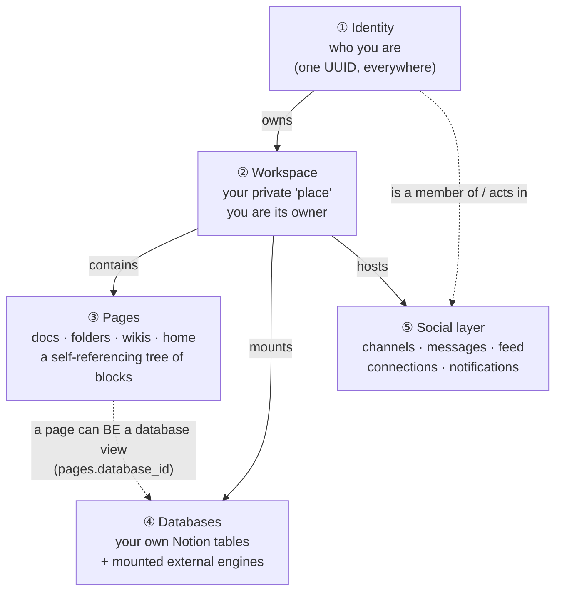
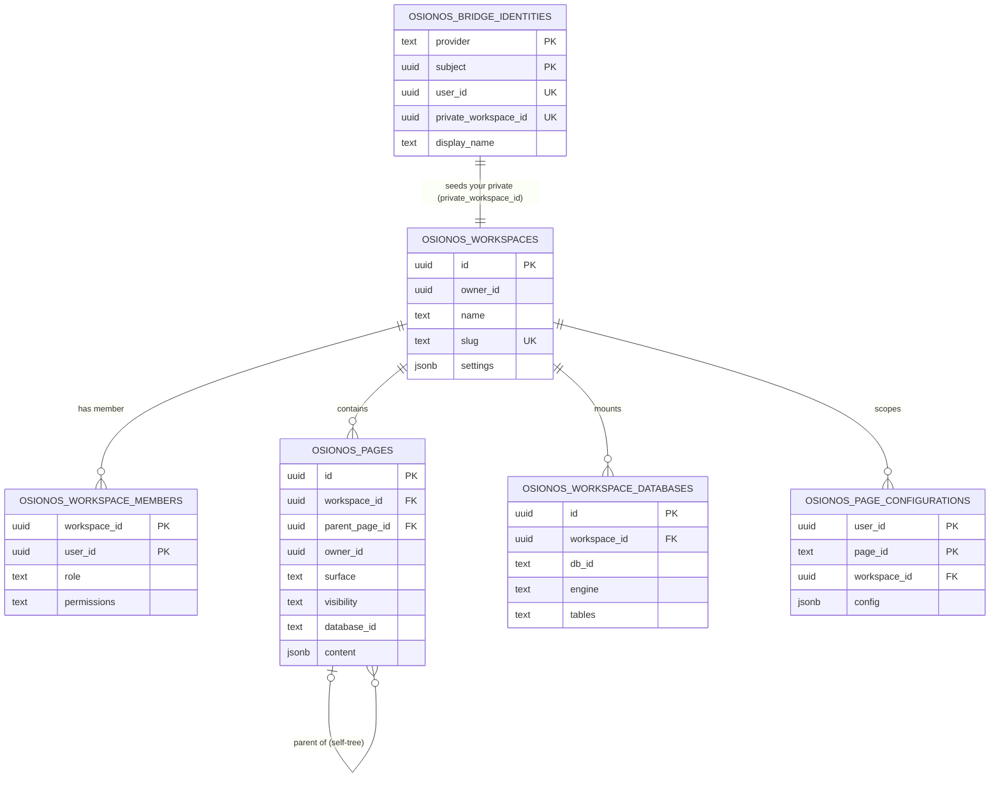
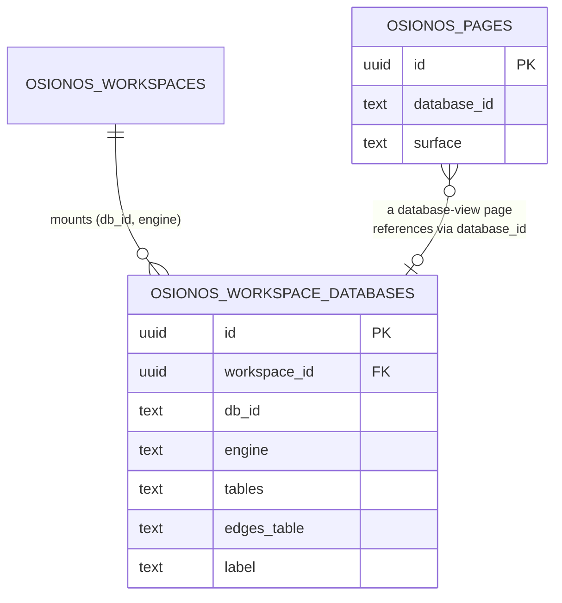
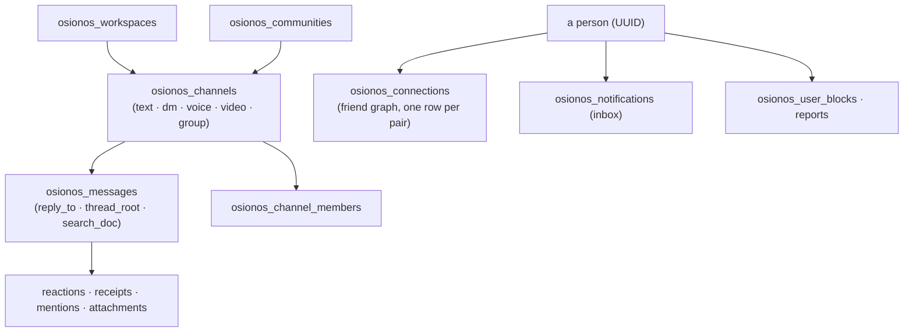

# 01 — The conceptual data model (the MCD)

> The *Modèle Conceptuel de Données* of osionos's business model: the handful of entities that matter,
> drawn the way you'd sketch them on a whiteboard, then explained in plain language with the exact
> SQL file that creates each one. Read this to understand **what exists and how it connects**; read
> [02](./02-ownership-and-provisioning.md) for how it comes to be yours, and
> [03](./03-config-tables-and-databases.md) for your own databases.

**Series:** [README](./README.md) · **01 — Conceptual data model (this file)** · [02 — Ownership & provisioning](./02-ownership-and-provisioning.md) · [03 — Config tables & databases](./03-config-tables-and-databases.md) · [04 — Persist & retrieve](./04-persist-and-retrieve.md) · [05 — Schema source map](./05-schema-source-map.md)

> The full column-by-column dictionary for every table below lives in
> [prismatica 01](../prismatica/01-conceptual-data-model.md). Here we stay at the *concept* level and
> keep the osionos story front and centre.

---

## The shape of it, in one breath

Everything in osionos hangs off **one person owning one private workspace**. Inside that workspace
live **pages** (a tree) and **databases** (your own tables). Around it sits a social layer — channels,
messages, connections — that is always scoped back to a workspace or a person. Five ideas, in order
of importance:



**The whole picture in words.** Your **identity** is a single UUID that means "you" across the entire
system — there is no id translation anywhere. That identity **owns** exactly one private
**workspace**. The workspace **contains** a tree of **pages** (a page can hold child pages, so folders
and wikis are just pages with a different `surface`), and it **mounts** zero or more **databases**.
A page can itself *be* a database view (it carries a `database_id`). Floating around the workspace is
the **social layer** — chat channels, messages, a feed, friend connections — every row of which is
tied back to a workspace or to a person by that same UUID.

> **Reference (the technical equivalent of the paragraph above):** the workspace/page/database core is
> created in [`models/osionos-bridge-migration.sql`](../../../models/osionos-bridge-migration.sql) and
> [`models/osionos-workspace-databases-migration.sql`](../../../models/osionos-workspace-databases-migration.sql);
> the social layer in [`models/osionos-chat-migration.sql`](../../../models/osionos-chat-migration.sql),
> [`models/osionos-social-migration.sql`](../../../models/osionos-social-migration.sql),
> [`models/osionos-engagement-migration.sql`](../../../models/osionos-engagement-migration.sql), and
> friends. The single-UUID identity is resolved per request by
> [`auth.uid()`](../../../models/osionos-bridge-migration.sql#L8) (the JWT `sub` claim).

---

## One id to rule them all

Before the diagrams, the single most important rule: **a person is one UUID, used as both the
`owner_id` of things they own and the `user_id` of memberships they hold.** That UUID equals the
backend identity (`auth.users.id`), and Postgres recovers it on every request from the verified JWT:

```sql
-- models/osionos-bridge-migration.sql:8
CREATE OR REPLACE FUNCTION auth.uid() RETURNS UUID AS $$
  SELECT (NULLIF(current_setting('request.jwt.claims', true), '')::jsonb->>'sub')::uuid;
$$ LANGUAGE SQL STABLE;
```

Because that one value identifies you everywhere, the social graph (`osionos_connections`,
`osionos_channel_members`, …) never has to translate ids — your `user_id` in a channel is the same
UUID as the `owner_id` of your workspace.

> **Reference:** [`auth.uid()` — `models/osionos-bridge-migration.sql:8`](../../../models/osionos-bridge-migration.sql#L8).
> The deeper "integer-vs-UUID" nuance for the legacy `users` table is documented once, in
> [prismatica 01 — "One id to rule them all"](../prismatica/01-conceptual-data-model.md) — osionos
> itself only ever sees the UUID.

---

## Domain ① + ② + ③ — Identity, workspace, and the page tree (the core MCD)

This is the heart of osionos. An **identity** maps a website account (`provider` + `subject`) to a
BaaS `user_id` and is born holding the id of the one workspace that will be yours. The **workspace**
has an owner and a set of **members** (membership is what unlocks access). **Pages** live inside the
workspace and reference themselves to form the tree.



**Reading the diagram, left to right:**

- **`osionos_bridge_identities`** is the join between "a website account" and "an osionos user". Its
  primary key is the pair `(provider, subject)` — e.g. `('prismatica', <your-uuid>)`. It is `UNIQUE`
  on `user_id` (one identity per person) **and** `UNIQUE` on `private_workspace_id` (one private
  workspace per person — this is the technical guarantee behind "your own instance"). The
  `private_workspace_id` is generated *on this row* and then reused as the workspace's `id`.
- **`osionos_workspaces`** is your place. `owner_id` is you; `slug` is a unique, human-ish handle
  (`"<name>'s osionos-xxxxxxxx"`); `settings` is free-form JSON.
- **`osionos_workspace_members`** is the access list. Its primary key is `(workspace_id, user_id)`,
  its `role` is one of `owner / admin / editor / viewer`, and — crucially — `permissions` is a
  **text array** (`{create,read,update,delete,admin}`) that the page RLS policies test with array
  overlap. You, as owner, hold all five; an invited viewer might hold only `{read}`.
- **`osionos_pages`** is every document. `workspace_id` ties it to your place; `parent_page_id` points
  at another page (so a folder is just a page with children); `surface` distinguishes
  `page / agent / home / folder` (and `wiki`, added later); `content` is the JSON array of blocks;
  and `database_id` is set when the page is actually a **database view** (the bridge into Domain ④).
- **`osionos_workspace_databases`** records which external/object **databases** your workspace mounts
  — covered in depth in [03](./03-config-tables-and-databases.md).
- **`osionos_page_configurations`** stores per-user, per-page view settings (a personal config that
  doesn't disturb other members), keyed by `(user_id, page_id)`.

> **Reference (technical, line-for-line):**
> | Concept in the prose | File:line |
> |---|---|
> | `osionos_bridge_identities` (PK, both UNIQUEs, `private_workspace_id`) | [`osionos-bridge-migration.sql:12-25`](../../../models/osionos-bridge-migration.sql#L12) |
> | `osionos_workspaces` (`owner_id`, `slug UNIQUE`) | [`osionos-bridge-migration.sql:27-36`](../../../models/osionos-bridge-migration.sql#L27) |
> | `osionos_workspace_members` (`role` CHECK, `permissions TEXT[]`, PK) | [`osionos-bridge-migration.sql:38-46`](../../../models/osionos-bridge-migration.sql#L38) |
> | `osionos_pages` (`parent_page_id` self-FK, `surface`, `database_id`, `content jsonb`) | [`osionos-bridge-migration.sql:48-69`](../../../models/osionos-bridge-migration.sql#L48) |
> | `surface` widened to add `wiki` | [`osionos-wiki-surface-migration.sql`](../../../models/osionos-wiki-surface-migration.sql) |
> | `osionos_page_configurations` (PK `(user_id, page_id)`) | [`osionos-bridge-migration.sql:78`](../../../models/osionos-bridge-migration.sql#L78) |
> | `osionos_workspace_databases` | [`osionos-workspace-databases-migration.sql:19-30`](../../../models/osionos-workspace-databases-migration.sql#L19) |

### Why membership is the whole access story

Notice there is no per-page owner check in the read path — access is decided by **membership +
permissions**. The page-SELECT policy says, in effect, *"you may read this page if you are a member of
its workspace and your permission array overlaps `{read, admin}`"*:

```sql
-- models/osionos-bridge-migration.sql:176
CREATE POLICY osionos_pages_select_member ON public.osionos_pages
  FOR SELECT TO authenticated USING (
    EXISTS (
      SELECT 1 FROM public.osionos_workspace_members member
      WHERE member.workspace_id = public.osionos_pages.workspace_id
        AND member.user_id = auth.uid()
        AND member.permissions && ARRAY['read', 'admin']::TEXT[]   -- && = array overlap
    )
  );
```

The `INSERT`, `UPDATE`, and `DELETE` policies are the same shape but test `{create,admin}`,
`{update,admin}`, `{delete,admin}` respectively. Your owner seat holds all of them, so you can do
everything in your own workspace; a guest holds a narrower array and is fenced in automatically.

> **Reference:** the four page policies at
> [`osionos-bridge-migration.sql:175-224`](../../../models/osionos-bridge-migration.sql#L175); the
> workspace "select if owner or member" policy at
> [`:161-169`](../../../models/osionos-bridge-migration.sql#L161). The full trust-boundary discussion
> (why these still matter even though the bridge uses the service role) is in
> [prismatica 04](../prismatica/04-crud-and-server-trust-boundary.md).

---

## Domain ④ — Your own databases (the "config tables")

A page can be a plain document, **or** it can be a database. When it's a database, the page carries a
`database_id`, and the workspace's mount list (`osionos_workspace_databases`) says which physical
store backs it and on which **engine**. This is the bridge from "documents" to "structured data", and
it's the subject of [03](./03-config-tables-and-databases.md):



In plain terms: **your workspace can point at real databases** — its own Postgres/MySQL/MongoDB/
SQLite/SQL Server/DynamoDB mounts — and surface their tables as Notion-style views. The `engine`
column literally holds the engine name (`"postgresql"`, `"mysql"`, `"mongodb"`, …), and `tables[]`
lists the table/collection names the workspace linked.

> **Reference:** [`osionos-workspace-databases-migration.sql:19-30`](../../../models/osionos-workspace-databases-migration.sql#L19)
> (the table), and the `pages.database_id` column at
> [`osionos-bridge-migration.sql:56`](../../../models/osionos-bridge-migration.sql#L56). Real engine
> values are seeded in [`apps/grobase/scripts/seed/live-demo-pages.py:22-37`](../../../apps/grobase/scripts/seed/live-demo-pages.py#L22)
> (`postgresql` / `mysql` / `mongodb`) and
> [`apps/grobase/scripts/seed/osionos-extra-engines.sh`](../../../apps/grobase/scripts/seed/osionos-extra-engines.sh)
> (`sqlite` / `mssql` / `dynamodb`).

---

## Domain ⑤ — The social layer (chat, feed, connections)

Around the core sits everything that makes osionos collaborative. It's a sizeable graph, so here is
the *conceptual* shape — channels belong to a workspace, messages belong to channels, and people
relate to each other and react to things. The full ER detail (every column, every CHECK) is in
[prismatica 01 — Domain 3](../prismatica/01-conceptual-data-model.md); this is the map you keep in
your head:



**What to take away:** the social layer reuses the same identity UUID and the same workspace anchor as
the core, so a message author, a channel member, and a workspace owner can all be *the same person*
without any glue. Chat media bytes live in object storage (MinIO bucket `chat`); the database only
stores the metadata row that points at the object key.

> **Reference (where each part is born):**
> | Concept | File:line |
> |---|---|
> | channels, messages, members, reactions, feed | [`osionos-chat-migration.sql:12-61`](../../../models/osionos-chat-migration.sql#L12) |
> | reads, mentions, notifications | [`osionos-engagement-migration.sql:11-86`](../../../models/osionos-engagement-migration.sql#L11) |
> | connections, receipts, blocks, reports, join-requests | [`osionos-social-migration.sql:57-149`](../../../models/osionos-social-migration.sql#L57) |
> | message attachments (metadata; bytes in MinIO) | [`osionos-media-migration.sql:11`](../../../models/osionos-media-migration.sql#L11) |
> | communities | [`osionos-communities-migration.sql:9-25`](../../../models/osionos-communities-migration.sql#L9) |
> | people directory (safe view) | [`osionos-people-directory-migration.sql:45`](../../../models/osionos-people-directory-migration.sql#L45) |

---

## How it all interconnects — the relationship cheat-sheet

One table to settle "what links to what". **Solid** = a real database foreign key; **logical** = a
link carried by a shared UUID that the bridge enforces in code (no DB-level FK).

| From | To | Kind | Carried by | Reference |
|---|---|---|---|---|
| `osionos_bridge_identities` | its private `osionos_workspaces` | logical (1:1) | `private_workspace_id` = workspace `id` | [bridge:18,386-394](../../../models/osionos-bridge-migration.sql#L18) |
| `osionos_workspace_members` | `osionos_workspaces` | **solid** FK | `workspace_id` (ON DELETE CASCADE) | [bridge:39](../../../models/osionos-bridge-migration.sql#L39) |
| `osionos_pages` | `osionos_workspaces` | **solid** FK | `workspace_id` (CASCADE) | [bridge:50](../../../models/osionos-bridge-migration.sql#L50) |
| `osionos_pages` | `osionos_pages` | **solid** self-FK | `parent_page_id` (SET NULL) | [bridge:51](../../../models/osionos-bridge-migration.sql#L51) |
| `osionos_pages` | a workspace database | logical | `database_id` (plain TEXT) | [bridge:56](../../../models/osionos-bridge-migration.sql#L56) |
| `osionos_workspace_databases` | `osionos_workspaces` | **solid** FK | `workspace_id` (CASCADE) | [wsdb:21](../../../models/osionos-workspace-databases-migration.sql#L21) |
| `osionos_channels` | `osionos_workspaces` | **solid** FK | `workspace_id` (CASCADE) | [chat:12](../../../models/osionos-chat-migration.sql#L12) |
| any `owner_id` / `user_id` | the person | logical | the identity UUID (`auth.uid()`) | [bridge:8](../../../models/osionos-bridge-migration.sql#L8) |

The "logical, no FK" links are deliberate: they let the bridge own the rules (and let the same tables
serve both the bridge path and a future direct-DB path). The trade-off — that the bridge *must*
re-check them in code — is exactly what [02](./02-ownership-and-provisioning.md) and
[prismatica 04](../prismatica/04-crud-and-server-trust-boundary.md) cover.

---

## Where to go next

- **[02 — Ownership & provisioning](./02-ownership-and-provisioning.md)** — how the 1:1 identity↔workspace
  link above is actually *created* the first time you sign in, and why it makes you the owner.
- **[03 — Config tables & databases](./03-config-tables-and-databases.md)** — Domain ④ in full,
  including the dual-engine `notion-database-sys` (both `*.sql` and MongoDB).
- **[04 — Persist & retrieve](./04-persist-and-retrieve.md)** — how a block edit becomes a row and how
  the tree is rebuilt on boot, plus every index/trigger that keeps it fast.
- **[prismatica 01](../prismatica/01-conceptual-data-model.md)** — the exhaustive column dictionary for
  every table named here.
