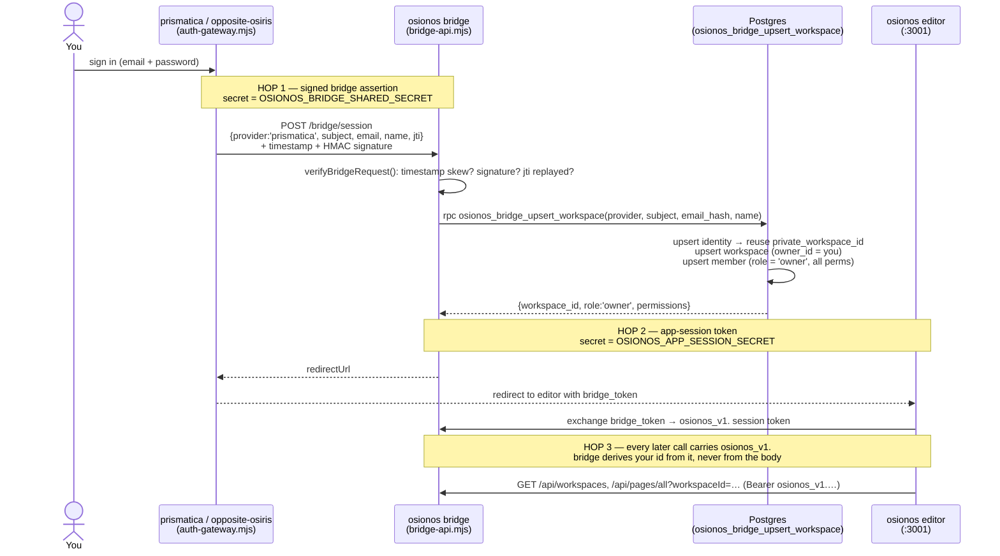
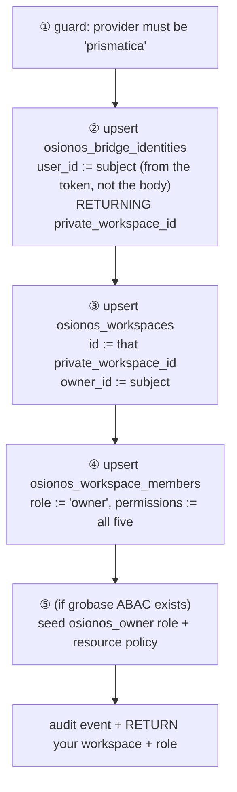

# 02 — Ownership & provisioning: how the website makes you an owner

> This is the doc the question "how does a user from the prismatica website end up owning their own
> osionos instance, with their own config tables?" is really about. The short answer: a **two-secret
> handoff** introduces you to the bridge, and **one SQL function** then creates your identity, your
> private workspace, and your owner seat — all in a single transaction. Below, the long answer, every
> step anchored to a real line.

**Series:** [README](./README.md) · [01 — Conceptual data model](./01-conceptual-data-model.md) · **02 — Ownership & provisioning (this file)** · [03 — Config tables & databases](./03-config-tables-and-databases.md) · [04 — Persist & retrieve](./04-persist-and-retrieve.md) · [05 — Schema source map](./05-schema-source-map.md)

---

## The idea in one sentence

You sign in on the website; the website vouches for you to osionos's bridge with a **signed note**;
the bridge calls one database function that **finds-or-creates everything that makes the workspace
yours** and hands back a short-lived session token that says "this person owns workspace X".



The rest of this page walks each hop.

---

## Hop 1 — the website vouches for you (the bridge assertion)

When you authenticate on opposite-osiris, its auth-gateway builds a small JSON **assertion** about
you and signs it with a secret shared *only* between the website and the bridge. The assertion says
"the prismatica user with this `subject` UUID, this email and name, is logged in", plus a `jti`
(a one-time id) so the same note can't be replayed:

```js
// apps/opposite-osiris/scripts/auth-gateway.mjs:1088 (the payload)
const payload = { provider: 'prismatica', subject, email, name: …, jti: randomUUID() };
const timestamp = String(Date.now());
// …sent with headers:
//   x-prismatica-bridge-timestamp: <timestamp>
//   x-prismatica-bridge-signature: HMAC-SHA256(secret, `${timestamp}.${stableStringify(payload)}`)
```

```js
// apps/opposite-osiris/scripts/auth-gateway.mjs:132 (the signature)
function bridgeSignature(timestamp, payload) {
  return createHmac('sha256', config.osionosBridgeSecret)
    .update(`${timestamp}.${stableStringify(payload)}`).digest('hex');
}
```

On the other side, the bridge **refuses to trust the note unless three things hold**: the timestamp is
within an allowed window (no stale notes), the HMAC matches (it was really signed with the shared
secret), and the `jti` hasn't been seen before (no replay):

```js
// apps/osionos/app/scripts/bridge-api.mjs:351 (verifyBridgeRequest — abridged)
if (!Number.isFinite(timestamp) || Math.abs(now - timestamp) > timestampSkewMs)
  throw …('timestamp is outside the allowed window', 401);
const expected = bridgeSignature(secret, String(timestampHeader), normalizedPayload);
if (!safeCompareHex(expected, signatureHeader)) throw …('signature is invalid', 401);
if (replayStore.has(normalizedPayload.jti)) throw …('replay rejected', 409);
```

The payload is also strictly validated: the provider **must** be `prismatica`, and `subject` and
`jti` must be real UUIDs, the email well-formed.

> **Reference:**
> | Step | File:line |
> |---|---|
> | website config (bridge URL + shared secret) | [`auth-gateway.mjs:67-68`](../../../apps/opposite-osiris/scripts/auth-gateway.mjs#L67) |
> | website builds + sends the signed assertion | [`auth-gateway.mjs:1088-1106`](../../../apps/opposite-osiris/scripts/auth-gateway.mjs#L1088) |
> | website HMAC helper | [`auth-gateway.mjs:132-136`](../../../apps/opposite-osiris/scripts/auth-gateway.mjs#L132) |
> | bridge verifies timestamp + signature + replay | [`bridge-api.mjs:351-370`](../../../apps/osionos/app/scripts/bridge-api.mjs#L351) |
> | bridge payload validation (`provider==='prismatica'`, UUIDs) | [`bridge-api.mjs:322-343`](../../../apps/osionos/app/scripts/bridge-api.mjs#L322) |
> | the shared secret | env `OSIONOS_BRIDGE_SHARED_SECRET` |

---

## Hop 2 — one SQL function makes you an owner

Once the note is trusted, the bridge calls a single Postgres function with the service-role key:
`osionos_bridge_upsert_workspace(provider, subject, email_hash, display_name)`. This function is the
**whole act of becoming an owner**, and it is idempotent — run it once and it *creates*; run it again
on your next login and it *finds* the same rows. It does five things in order:



Step by step, with the actual SQL:

**② Your identity (and the seed of your workspace id).** The function upserts your
`osionos_bridge_identities` row. The key line is that `user_id` is stamped from the **function
argument `p_subject`** — which the bridge took from the verified token — *never* from anything the
browser could forge. The row's `private_workspace_id` (generated once, `UNIQUE`) is read back out:

```sql
-- models/osionos-bridge-migration.sql:373
INSERT INTO public.osionos_bridge_identities (provider, subject, user_id, email_hash, display_name)
VALUES (p_provider, p_subject, p_subject, p_email_hash, v_display_name)   -- user_id := p_subject
ON CONFLICT (provider, subject) DO UPDATE SET …
RETURNING private_workspace_id INTO v_workspace_id;                        -- :386
```

**③ Your workspace.** It is inserted with `id = v_workspace_id` (so the workspace literally *is* the
id reserved on your identity row) and `owner_id = p_subject`. Its name becomes
`"<your name>'s osionos"`:

```sql
-- models/osionos-bridge-migration.sql:388-400
v_workspace_name := v_display_name || '''s osionos';
INSERT INTO public.osionos_workspaces (id, owner_id, name, slug, source, settings)
VALUES (v_workspace_id, p_subject, v_workspace_name, v_workspace_slug, 'bridge',
        jsonb_build_object('bridgeProvider', p_provider, 'role', 'owner', 'permissions', v_permissions))
ON CONFLICT (id) DO UPDATE SET …;
```

**④ Your owner seat.** A membership row is inserted with `role = 'owner'` and the full permission
array `{create, read, update, delete, admin}` — which is exactly what every page RLS policy needs to
pass (see [01 — Why membership is the whole access story](./01-conceptual-data-model.md)):

```sql
-- models/osionos-bridge-migration.sql:364, 407
v_permissions TEXT[] := ARRAY['create', 'read', 'update', 'delete', 'admin'];
INSERT INTO public.osionos_workspace_members (workspace_id, user_id, role, permissions)
VALUES (v_workspace_id, p_subject, 'owner', v_permissions)
ON CONFLICT ON CONSTRAINT osionos_workspace_members_pkey DO UPDATE SET role = 'owner', …;
```

**⑤ The backend's own access model (only if present).** If grobase's ABAC tables exist, the function
also registers an `osionos_owner` role and a resource policy scoped to this workspace — a second,
independent layer of "this is yours". It's wrapped in an existence check so osionos works fine even
without grobase:

```sql
-- models/osionos-bridge-migration.sql:414
IF to_regclass('public.roles') IS NOT NULL AND … THEN
  -- INSERT role 'osionos_owner'; link user_roles; INSERT resource_policy(owner_id = p_subject)
END IF;
```

Finally it writes an audit event and returns your `workspace_id`, `role`, and `permissions`.

> **Reference (the entire function):**
> [`models/osionos-bridge-migration.sql:346-453`](../../../models/osionos-bridge-migration.sql#L346) —
> `osionos_bridge_upsert_workspace`, `LANGUAGE plpgsql SECURITY DEFINER`. It is locked down so only the
> backend can run it: [`:455-456`](../../../models/osionos-bridge-migration.sql#L455)
> (`REVOKE … FROM PUBLIC; GRANT EXECUTE … TO service_role`). The bridge calls it from
> [`bridge-api.mjs:921-951`](../../../apps/osionos/app/scripts/bridge-api.mjs#L921)
> (`persistBridgeIdentity`), and orchestrates the whole handoff in
> [`bridge-api.mjs:1066-1093`](../../../apps/osionos/app/scripts/bridge-api.mjs#L1066)
> (`createBridgeHandoff`).

### Why this guarantees "your own instance"

Three schema facts, together, make the ownership airtight:

1. **One workspace per person** — `osionos_bridge_identities` is `UNIQUE (private_workspace_id)` and
   `UNIQUE (user_id)` ([`bridge:23-24`](../../../models/osionos-bridge-migration.sql#L23)). Two people
   can never share a private workspace, and you can never accidentally get two.
2. **The owner is recorded, not asserted** — `owner_id` and the `role='owner'` member row both come
   from `p_subject`, which the bridge lifted from the **verified** token. The browser never gets to
   say "I'm the owner".
3. **Idempotent find-or-create** — every `INSERT` is `ON CONFLICT … DO UPDATE`, so re-logging-in
   re-attaches you to the *same* workspace instead of making a new one.

---

## Hop 3 — the session token you carry afterward

With the workspace secured, the bridge mints the token the editor will use for everything else: an
`osionos_v1.` **app-session token**. It's a compact, HMAC-signed envelope (a different secret again,
`OSIONOS_APP_SESSION_SECRET`) that carries your id, the workspaces you may touch, and your role in
each:

```js
// apps/osionos/app/scripts/bridge-api.mjs:377 (the token body)
const tokenPayload = {
  iss: 'osionos-bridge', aud: 'osionos-app',
  sub: payload.subject,                                   // = your UUID
  workspace_ids: [workspace._id, …memberWorkspaces],      // what you can open
  roles: { …memberRoles, [workspace._id]: 'owner' },      // your private one is always 'owner'
  is_admin, jti, iat, exp,
};
// token string = `osionos_v1.${base64url(payload)}.${HMAC-SHA256(secret, payload)}`  (:389-391)
```

Every later request is checked by `verifyAppSessionToken`, which validates the version, the HMAC, the
`iss`/`aud`, that `sub` is a UUID, that it hasn't expired, and that it grants at least one workspace —
then returns the trustworthy `{ userId, workspaceIds, roles }` the rest of the bridge uses:

```js
// apps/osionos/app/scripts/bridge-api.mjs:394 (verifyAppSessionToken — what it returns)
return { userId: String(payload.sub), workspaceIds, roles, isAdmin, raw: payload };
```

This is why the editor never sends your identity in a request body — your identity *is* the token, and
the bridge derives `owner_id` for any write from `authContext.userId`, not from the payload (see
[04 — Persist & retrieve](./04-persist-and-retrieve.md)).

> **Reference:**
> | Step | File:line |
> |---|---|
> | mint `osionos_v1.` token | [`bridge-api.mjs:372-392`](../../../apps/osionos/app/scripts/bridge-api.mjs#L372) |
> | verify it on every call | [`bridge-api.mjs:394-438`](../../../apps/osionos/app/scripts/bridge-api.mjs#L394) |
> | token version constant | [`bridge-api.mjs:77`](../../../apps/osionos/app/scripts/bridge-api.mjs#L77) (`osionos_v1`) |
> | the secret | env `OSIONOS_APP_SESSION_SECRET` |

---

## The three secrets, side by side

The handoff deliberately uses **two different HMAC secrets** so a compromise of one hop doesn't grant
the other, plus the database service key the browser never sees:

| Secret | Guards | Who holds it |
|---|---|---|
| `OSIONOS_BRIDGE_SHARED_SECRET` | Hop 1 — website → bridge assertion | website + bridge only |
| `OSIONOS_APP_SESSION_SECRET` | Hop 2/3 — the `osionos_v1.` session token | bridge + the app verifier only |
| BaaS **service-role key** | bridge → Postgres (bypasses RLS) | the bridge only, server-side |

(These are exactly the keys the root `CLAUDE.md` lists as the three required osionos secrets, and they
are never committed — see [`wiki/security/defense/platform/secrets-management.md`](../../security/defense/platform/secrets-management.md).)

---

## What you can do with what you own

After the handoff, your owner permissions unlock the whole workspace through the RLS policies in
[01](./01-conceptual-data-model.md): create/read/update/delete pages, and — the point of the original
question — **stand up your own config tables**. How those databases are created, what engines back
them, and where their schemas live is the next doc.

→ **[03 — Config tables & your own databases](./03-config-tables-and-databases.md)**
