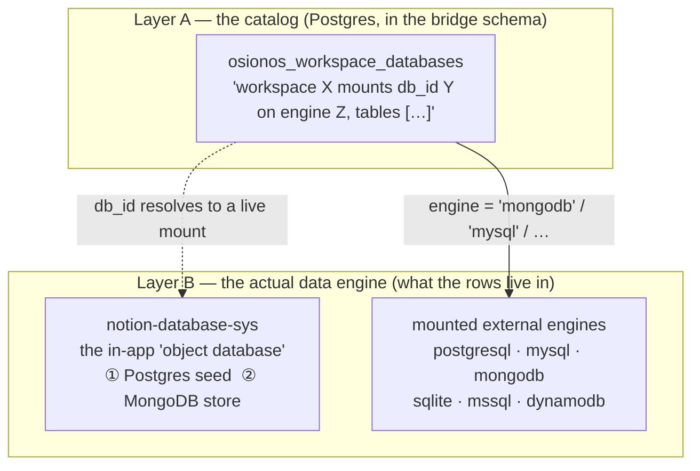
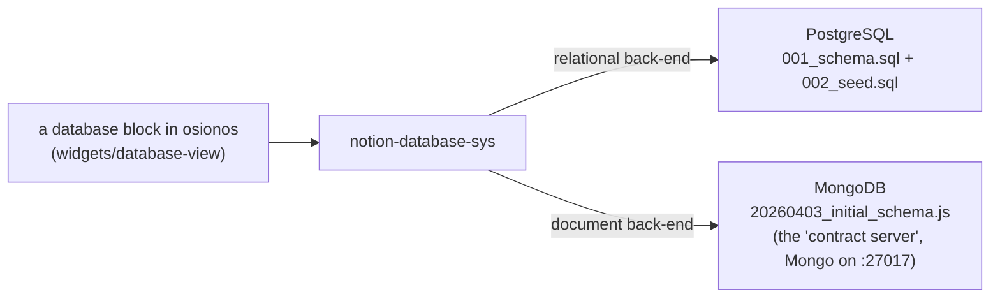

# 03 — Config tables & your own databases

> Once you own a workspace ([02](./02-ownership-and-provisioning.md)), you can build your own
> **databases** — Notion-style tables like Tasks, Contacts, an inventory — and even mount *real*
> external engines and browse them as pages. This doc answers the exact question "are these schemas
> made with **`*.sql` or MongoDB**?" The honest answer: **both, on purpose.** Here's the full map.

**Series:** [README](./README.md) · [01 — Conceptual data model](./01-conceptual-data-model.md) · [02 — Ownership & provisioning](./02-ownership-and-provisioning.md) · **03 — Config tables & databases (this file)** · [04 — Persist & retrieve](./04-persist-and-retrieve.md) · [05 — Schema source map](./05-schema-source-map.md)

---

## There are two layers, don't conflate them

"Your databases" means two different things working together:



- **Layer A — the catalog.** A small Postgres table, `osionos_workspace_databases`, that just records
  *which* databases your workspace is allowed to see. It never holds your business rows; it's the
  index of mounts.
- **Layer B — the engines.** Where the actual rows live. Two flavours: the bundled **object database**
  (`notion-database-sys`, which is itself dual-engine — Postgres **and** MongoDB), and **external
  mounts** to real database servers reached through grobase's data plane.

The rest of this doc takes them in that order.

---

## Layer A — `osionos_workspace_databases`, the mount catalog

This is the table that ties a *workspace* to the *databases* it may use. It's deliberately tiny:

```sql
-- models/osionos-workspace-databases-migration.sql:19
create table if not exists public.osionos_workspace_databases (
    id           uuid primary key default gen_random_uuid(),
    workspace_id uuid not null references public.osionos_workspaces (id) on delete cascade,
    db_id        text not null,          -- the grobase mount id (a registered database)
    engine       text,                   -- 'postgresql' | 'mysql' | 'mongodb' | 'sqlite' | 'mssql' | 'dynamodb'
    tables       text[] not null default '{}',   -- the table/collection names linked in
    edges_table  text,                   -- optional: a table holding cross-record relations
    label        text,                   -- the human name shown in the UI ("Restaurant · SQLite")
    created_at   timestamptz not null default now(),
    updated_at   timestamptz not null default now(),
    unique (workspace_id, db_id)         -- one row per (workspace, mount)
);
```

**What each column means, in plain terms:** `db_id` is a *mount* — a database that grobase has
registered and can route queries to. `engine` is which kind of database it is. `tables[]` is the set
of tables/collections you pulled into your workspace. `edges_table` lets a mount carry relations
between records. `label` is the friendly name.

**Who can see a mount?** Membership decides. The live path uses the bridge (service role), which joins
`members → workspaces → this table` before proxying any query — so you can only ever name a `db_id`
that one of your workspaces is associated with (the client never sends a raw `db_id` it made up).
There's also a defense-in-depth RLS policy for any direct connection:

```sql
-- models/osionos-workspace-databases-migration.sql:49 (authenticated SELECT — abridged)
create policy osionos_workspace_databases_select_member
  on public.osionos_workspace_databases for select to authenticated using (
    exists (select 1 from public.osionos_workspaces ws
            where ws.id = osionos_workspace_databases.workspace_id
              and (ws.owner_id = auth.uid()
                   or exists (select 1 from public.osionos_workspace_members member
                              where member.workspace_id = ws.id and member.user_id = auth.uid()))));
```

> **Reference:**
> | Concept | File:line |
> |---|---|
> | the catalog table + `unique(workspace_id, db_id)` | [`osionos-workspace-databases-migration.sql:19-30`](../../../models/osionos-workspace-databases-migration.sql#L19) |
> | the lookup index | [`:32-33`](../../../models/osionos-workspace-databases-migration.sql#L32) |
> | service-role-all + member-SELECT policies | [`:37-64`](../../../models/osionos-workspace-databases-migration.sql#L37) |
> | the design note ("the bridge derives the authorized resource set") | [`:1-15`](../../../models/osionos-workspace-databases-migration.sql#L1) |
> | the app-side mount catalog (reads `GET /api/databases`) | [`src/widgets/database-view/model/liveMountCatalog.ts`](../../../apps/osionos/app/src/widgets/database-view/model/liveMountCatalog.ts), [`allDataSources.ts`](../../../apps/osionos/app/src/widgets/database-view/model/allDataSources.ts) |

---

## Layer B① — the object database (`notion-database-sys`): *both* SQL and MongoDB

The bundled "object database" lives in the **`notion-database-sys`** submodule
([`apps/osionos/app/src/shared/notion-database-sys/`](../../../apps/osionos/app/src/shared/notion-database-sys)).
This is the engine behind a brand-new Notion table you create in the app. And it is where the
"`*.sql` or MongoDB?" question gets its real answer: **the submodule ships schema definitions for
both, because it supports both back-ends.**



### The relational schema — `*.sql`

[`src/store/dbms/relational/001_schema.sql`](../../../apps/osionos/app/src/shared/notion-database-sys/src/store/dbms/relational/001_schema.sql)
is a plain **PostgreSQL** script (its own header says *"Run via: `psql -U notion_user -d notion_db -f
001_schema.sql`"*). It defines six demo "databases" — the kind a user builds — each a real table:

| Table | What it models | Notable columns |
|---|---|---|
| `tasks` | a task tracker | `status`, `priority`, `tags TEXT[]`, `due_date`, `story_points`, `project TEXT[]` |
| `contacts` | a CRM | `company`, `stage`, `deal_value NUMERIC(12,2)`, `vip`, `projects TEXT[]` |
| `content` | a content calendar | title + status/author/publish workflow |
| `inventory` | assets | `category`, `serial_number`, `price`, `in_service`, `location` |
| `projects` | projects | `budget`, `lead`, plus relation arrays (`tasks`, `client`, `content`, …) |
| `products` | a catalog | `price`, `cost`, `rating`, `tags TEXT[]`, `featured`, `returnable` |

Every table keys on `id VARCHAR(36) PRIMARY KEY` (a UUID-as-string), uses Postgres-native `TEXT[]`
arrays for multi-value fields, `NUMERIC(12,2)` for money, and `TIMESTAMPTZ DEFAULT NOW()` for
timestamps. The companion
[`002_seed.sql`](../../../apps/osionos/app/src/shared/notion-database-sys/src/store/dbms/relational/002_seed.sql)
(362 lines) fills them with deterministic demo rows via `INSERT … ON CONFLICT (id) DO NOTHING`.

> **Reference:** the six `CREATE TABLE`s at
> [`001_schema.sql:19, 38, 58, 75, 93, 115`](../../../apps/osionos/app/src/shared/notion-database-sys/src/store/dbms/relational/001_schema.sql#L19);
> the "run via psql" note at
> [`:13-14`](../../../apps/osionos/app/src/shared/notion-database-sys/src/store/dbms/relational/001_schema.sql#L13).
> Note: this seed schema has **no secondary indexes** — it relies on the per-table primary key and the
> application adapter for further indexing (verified: zero `CREATE INDEX` in the file).

### The document schema — MongoDB

[`packages/core/migrations/20260403_initial_schema.js`](../../../apps/osionos/app/src/shared/notion-database-sys/packages/core/migrations/20260403_initial_schema.js)
is the **MongoDB** migration. (The app boots a "Mongo contract server" for this on port `27017`
during `npm run dev` — the playground's own Mongo uses `27018`.) Rather than tables, it creates the
workspace *system* collections and, importantly, their **indexes** — which is where the optimization
lives for the document store:

| Collection | Purpose | Indexes (the optimization) |
|---|---|---|
| `workspaces` | the workspace docs | `{ownerId}`; unique sparse `{domain}` |
| `users` | users | unique `{email}` |
| `workspace_members` | membership | unique `{workspaceId, userId}`; `{userId, workspaceId}` |
| `pages` | page docs | `{workspaceId, databaseId}`; `{parentPageId}`; `{workspaceId, archived}` |
| `blocks` | block docs | `{pageId, order}`; `{workspaceId, pageId}`; `{parentBlockId, order}`; sparse `{syncedBlockId}` |
| `viewconfigs` | saved views | `{databaseId, workspaceId}` |
| `userviewoverrides` | per-user view tweaks | unique `{viewId, userId}`; `{userId, workspaceId}` |
| `accessrules` | ABAC rules | `{workspaceId, resourceId, resourceType}` + two sparse variants |
| `effectivepermissions` | a permission **cache** | **TTL** `{expiresAt}` (auto-expire); unique `{userId, resourceId}` |
| `sessions` | sessions | **TTL** `{expiresAt}`; unique `{refreshToken}`; `{userId}` |

The `down` migration is careful: it only drops the workspace-system collections and **never** the
entity-data collections (`tasks`, `contacts`, …) — a nice safety detail.

> **Reference:** every `createCollection` + `createIndex` at
> [`20260403_initial_schema.js:17-74`](../../../apps/osionos/app/src/shared/notion-database-sys/packages/core/migrations/20260403_initial_schema.js#L17);
> the protective `down` at
> [`:76-87`](../../../apps/osionos/app/src/shared/notion-database-sys/packages/core/migrations/20260403_initial_schema.js#L76).
> `notion-database-sys` is a registered git submodule (per
> [`apps/osionos/app/CLAUDE.md`](../../../apps/osionos/app/CLAUDE.md)) — commit inside it first, then
> the app records the SHA.

**So: which is it, `*.sql` or MongoDB?** Both. The relational `.sql` files and the MongoDB migration
are two interchangeable back-ends of the *same* object-database abstraction. The relational path is a
Postgres script you can run with `psql`; the document path is a Mongo migration the dev server boots
automatically.

---

## How a user database is *shaped* — the schema-as-data model

Whichever back-end stores the rows, the **shape** of a user database (its columns, their types, the
relations between databases) is described in TypeScript as data — not as DDL. That's what makes
osionos databases feel like Notion: you add a property in the UI and the schema object grows; no
migration required. The core type is `DomainDatabaseSchema`:

```ts
// notion-database-sys/packages/types/src/schema.ts:49
export interface DomainDatabaseSchema {
  id: string;
  name: string;
  properties: Record<string, DomainSchemaProperty>;  // the columns, keyed by id
  titlePropertyId: string;                            // which column is the title
  workspaceId?: string;
  dataSources?: DomainDataSourceRef[];                // 'live' | 'known' | 'workspace'
  locked?: boolean;                                   // freeze schema + view edits
}
```

A single column is a `DomainSchemaProperty` — and its `type` is the Notion property vocabulary
(`title`, `select`, `multi_select`, `number`, `relation`, `formula`, `rollup`, …). Crucially,
**relations between databases are just a property type**: a `relation` property carries a
`relationConfig` pointing at another database. The workspace's own "Folders ↔ Files" databases show
this exactly — a **two-way** relation (each side mirrors the other) and a **one-way** self relation:

```ts
// apps/osionos/app/src/widgets/database-view/model/workspaceDatabaseSchema.ts:50  (Folders → Files, two-way)
{ id: FOLD.files, name: "Files", type: "relation",
  relationConfig: { databaseId: WS_FILES_DB_ID, type: "two_way", reversePropertyId: FILE.folder } }

// :77  (Files → Files, one-way "Related")
{ id: FILE.related, name: "Related", type: "relation",
  relationConfig: { databaseId: WS_FILES_DB_ID, type: "one_way" } }
```

This is how data is **interconnected** at the user level: not with SQL foreign keys, but with
declared `relation` properties the object database resolves. (The Folders/Files pair is itself
*derived from real pages* — a Folders record is a `surface='folder'` page, and the Files relation is
read from `parent_page_id` — tying Domain ④ back to the page tree of [01](./01-conceptual-data-model.md).)

> **Reference:**
> | Concept | File:line |
> |---|---|
> | `DomainDatabaseSchema` (columns, title, dataSources, lock) | [`schema.ts:49-61`](../../../apps/osionos/app/src/shared/notion-database-sys/packages/types/src/schema.ts#L49) |
> | `DomainSchemaProperty` (the column, incl. `relationConfig`) | [`schema.ts:20-34`](../../../apps/osionos/app/src/shared/notion-database-sys/packages/types/src/schema.ts#L20) |
> | data-source kinds `live`/`known`/`workspace` | [`schema.ts:38-43`](../../../apps/osionos/app/src/shared/notion-database-sys/packages/types/src/schema.ts#L38) |
> | two-way + one-way relation example | [`workspaceDatabaseSchema.ts:50-51, 77-78`](../../../apps/osionos/app/src/widgets/database-view/model/workspaceDatabaseSchema.ts#L50) |

---

## Layer B② — mounting *real* external engines

Beyond the bundled object database, a workspace can mount a **real, running database server** and
browse it as a page. This is what the `engine` column in the catalog records, and these are the
engines actually wired by the live-demo and extra-engine seeders:

| Engine | `engine` value | Where it's wired | Reached via |
|---|---|---|---|
| PostgreSQL | `postgresql` | [`live-demo-pages.py:22`](../../../apps/grobase/scripts/seed/live-demo-pages.py#L22) | grobase data-plane adapter |
| MySQL | `mysql` | [`live-demo-pages.py:31`](../../../apps/grobase/scripts/seed/live-demo-pages.py#L31) | grobase data-plane adapter |
| MongoDB | `mongodb` | [`live-demo-pages.py:37`](../../../apps/grobase/scripts/seed/live-demo-pages.py#L37) | grobase data-plane adapter |
| SQLite | `sqlite` | [`osionos-extra-engines.sh:186`](../../../apps/grobase/scripts/seed/osionos-extra-engines.sh#L186) | file-backed mount in the data-plane container |
| SQL Server | `mssql` | [`osionos-extra-engines.sh:305`](../../../apps/grobase/scripts/seed/osionos-extra-engines.sh#L305) | `mssql://…/finance` mount |
| DynamoDB | `dynamodb` | [`osionos-extra-engines.sh:375`](../../../apps/grobase/scripts/seed/osionos-extra-engines.sh#L375) | `dynamodb-local`, owner-scoped by partition key |

Each seeder registers a grobase **mount** (`db_id`), creates demo tables on that engine, then writes
a row into `osionos_workspace_databases` linking the workspace to that mount with its `engine` and
`tables[]`. The end-to-end proof that ≥3 engines really serve owner-scoped rows into one workspace
graph is the milestone gate
[`m174-osionos-multiengine.sh`](../../../apps/grobase/scripts/verify/m174-osionos-multiengine.sh).

> **Caveat (verified, not hand-waved):** these external mounts depend on the grobase **data-plane
> router** being built with the matching engine "pool". The seeders themselves warn and skip when an
> engine isn't compiled into the running router (e.g.
> [`osionos-extra-engines.sh:392`](../../../apps/grobase/scripts/seed/osionos-extra-engines.sh#L392)
> for DynamoDB needing `--features dynamodb`). So PostgreSQL/MySQL/MongoDB are the always-on trio; the
> extra three are real but opt-in. The deep architecture of the data plane lives in
> [`apps/grobase/CLAUDE.md`](../../../apps/grobase/CLAUDE.md) and
> [prismatica 02 — engine mapping](../prismatica/02-engine-mapping.md).

---

## Putting it together

When you open a database in osionos:

1. The app asks the bridge for your mounts (`GET /api/databases`), which the bridge answers only after
   the `members → workspaces → osionos_workspace_databases` join — so the list is *your* mounts.
2. You pick one. Its `engine` decides which adapter serves the rows: the bundled object database
   (Postgres or Mongo) or an external mount (one of the six engines).
3. The database's **shape** (columns + relations) is the `DomainDatabaseSchema` object, so adding a
   field or a relation is a data edit, not a migration.

That's the complete "config tables" story: a Postgres **catalog** of mounts, a dual-engine
**object database** for the rows, optional **external engines**, and a TypeScript **schema-as-data**
model that interconnects them with `relation` properties.

→ Next: **[04 — Persist & retrieve](./04-persist-and-retrieve.md)** — how every edit (page or
database row) is saved and restored, and the indexes that keep it fast.
