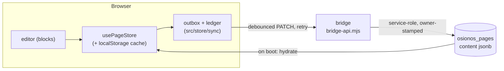
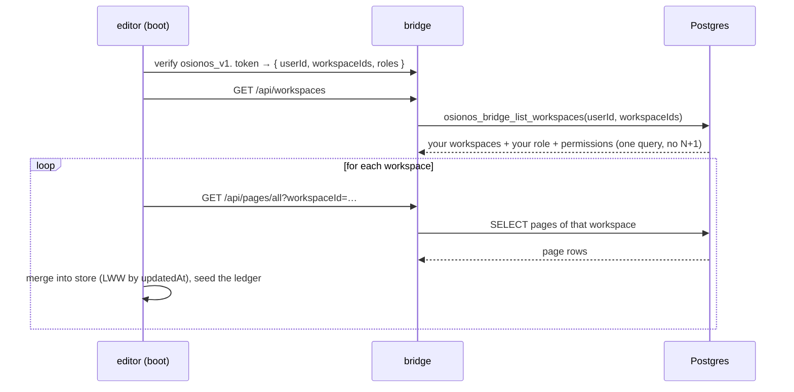

# 04 — Persist & retrieve: how an edit becomes a row, and back

> You type; a block changes; somehow it's there when you reload on another machine. This doc traces
> that round trip — the **save path** (offline-first, owner-stamped) and the **boot path** (rebuild
> your workspace from the server) — and then catalogs every index, trigger, and generated column that
> keeps it fast. As always, each claim points at a real line.

**Series:** [README](./README.md) · [01 — Conceptual data model](./01-conceptual-data-model.md) · [02 — Ownership & provisioning](./02-ownership-and-provisioning.md) · [03 — Config tables & databases](./03-config-tables-and-databases.md) · **04 — Persist & retrieve (this file)** · [05 — Schema source map](./05-schema-source-map.md)

---

## The golden rule: the server is the source of truth, the browser is a cache

osionos keeps a copy of your page tree in the browser (in a zustand store + `localStorage`), but the
**authority is Postgres**. The two are reconciled **last-write-wins by `updatedAt`**. This is why you
can edit offline and why two tabs converge instead of fighting.



> **Reference:** the cache-vs-source-of-truth contract and the sync invariants below are documented
> authoritatively in [`apps/osionos/app/CLAUDE.md`](../../../apps/osionos/app/CLAUDE.md) (the "State /
> page store" and "Data / bridge" sections). The code lives under
> [`apps/osionos/app/src/store/sync/`](../../../apps/osionos/app/src/store/sync).

---

## The save path — an edit travels to Postgres

### 1. It goes into an outbox, not straight to the network

When you edit, the change lands in the page store and is queued in a small **outbox/ledger**. A single
sync loop (`usePageSync`, mounted once at app start) **debounces ~800ms**, then flushes. The ledger
records what the server has confirmed, and it **only advances on a confirmed write** — so a dropped
request is retried, never silently lost. A transient failure **stops the whole batch** (a deliberate
anti-"429 storm" choke), and retries back off from ~15s toward ~120s.

A subtle but important safety detail: page **content is lazy**. If a page's blocks aren't loaded, the
outbox **omits `content`** (guarded by a `CONTENT_UNLOADED` sentinel in the page "stamp"), so syncing
an unloaded page can never blank out the server's copy.

> **Reference:**
> | Behaviour | Where |
> |---|---|
> | hydrate-then-outbox, mounted once, 800ms debounce, 15s→120s retry | [`src/store/sync/usePageSync.ts`](../../../apps/osionos/app/src/store/sync/usePageSync.ts) + app `CLAUDE.md` |
> | the outbox publisher (PATCH editable fields) | [`src/store/sync/pageOutbox.ts`](../../../apps/osionos/app/src/store/sync/pageOutbox.ts) |
> | ledger advances only on confirm; transient failure stops the batch | [`src/shared/sync/outboxLedger.ts`](../../../apps/osionos/app/src/shared/sync/outboxLedger.ts) + app `CLAUDE.md` |
> | `CONTENT_UNLOADED` sentinel; omit content when unloaded | app `CLAUDE.md` ("State / page store") |

### 2. The bridge stamps the owner from your token, never from the body

When the flush reaches the bridge, the bridge first **verifies your `osionos_v1.` token** (see
[02](./02-ownership-and-provisioning.md)) to get a trustworthy `authContext.userId`. On a create, the
row's `owner_id` is set **from that verified id** — the request body cannot claim a different owner:

```js
// apps/osionos/app/scripts/bridge-api.mjs:672  (inside pageCreateRowFromPayload, defined at :662)
owner_id: authContext.userId,        // server-stamped from the verified token, not from payload
```

Then the write goes to Postgres over PostgREST with the **service-role key** (which the browser never
holds). That key is attached by one helper, so every table write goes through the same trusted door:

```js
// apps/osionos/app/scripts/bridge-api.mjs:453  (baasRest — abridged)
fetch(`${config.baasUrl}/rest/v1/${path}`, {
  headers: { apikey: config.serviceKey, Authorization: `Bearer ${config.serviceKey}`, … },
  … });
```

The blocks themselves are stored as JSON in the page row:

```sql
-- models/osionos-bridge-migration.sql:61
content JSONB NOT NULL DEFAULT '[]'::jsonb
```

> **Reference:** owner-stamping `pageCreateRowFromPayload`
> [`bridge-api.mjs:662-682`](../../../apps/osionos/app/scripts/bridge-api.mjs#L662); the service-role
> writer `baasRest` [`bridge-api.mjs:453-479`](../../../apps/osionos/app/scripts/bridge-api.mjs#L453);
> `content jsonb` [`osionos-bridge-migration.sql:61`](../../../models/osionos-bridge-migration.sql#L61).
> Why the bridge re-checks ownership in code even though it bypasses RLS: this is the *trust boundary*,
> covered in [prismatica 04](../prismatica/04-crud-and-server-trust-boundary.md).

---

## The retrieve path — rebuilding your workspace on boot

When the editor loads for a signed-in user, it reconstructs everything in a fixed order:



The workspace list is resolved by a single `SECURITY DEFINER` SQL function that joins workspaces to
your memberships and returns your role + permissions in one shot (no per-workspace round trip):

```sql
-- models/osionos-bridge-migration.sql:312  osionos_bridge_list_workspaces (abridged)
SELECT w.id, w.owner_id, w.name, w.slug, w.settings, m.role, m.permissions, …
FROM public.osionos_workspaces w
JOIN public.osionos_workspace_members m ON m.workspace_id = w.id
WHERE m.user_id = p_user_id AND w.id = ANY(p_workspace_ids)
ORDER BY w.updated_at DESC;
```

Then pages are hydrated per workspace and merged into the store with the same **last-write-wins**
rule; the ledger is seeded so the just-loaded pages aren't immediately re-sent. This is the read side
of the golden rule: the server fills the cache, not the other way around.

> **Reference:**
> | Step | Where |
> |---|---|
> | verify token → `{userId, workspaceIds, roles}` | [`bridge-api.mjs:394-438`](../../../apps/osionos/app/scripts/bridge-api.mjs#L394) |
> | one-query workspace list (no N+1) | [`osionos-bridge-migration.sql:312-341`](../../../models/osionos-bridge-migration.sql#L312) |
> | hydrate pages per workspace + LWW merge + seed ledger | [`src/store/sync/hydratePages.ts`](../../../apps/osionos/app/src/store/sync/hydratePages.ts) |

---

## The optimization inventory — what keeps it fast

Everything below is in the osionos migrations and verified line-by-line. Four techniques recur:
**covering composite indexes** for the hot list queries, **partial indexes** for the "unread/template"
filters, **generated columns** so search/dedup keys are maintained by the database, and **a trigger +
an aggregate function** so counts don't become N+1 queries.

### Indexes — the core workspace/page surface

| Index | Speeds up | File:line |
|---|---|---|
| `osionos_workspaces_owner_idx (owner_id)` | "my workspaces" | [bridge:136](../../../models/osionos-bridge-migration.sql#L136) |
| `osionos_workspace_members_user_idx (user_id)` | which workspaces a user belongs to | [bridge:137](../../../models/osionos-bridge-migration.sql#L137) |
| `osionos_pages_workspace_archived_idx (workspace_id, archived_at)` | list live pages of a workspace | [bridge:138](../../../models/osionos-bridge-migration.sql#L138) |
| `osionos_pages_workspace_parent_idx (workspace_id, parent_page_id)` | children-of-page (tree walk) | [bridge:139](../../../models/osionos-bridge-migration.sql#L139) |
| `osionos_pages_workspace_updated_idx (workspace_id, updated_at DESC)` | "recently edited" | [bridge:140](../../../models/osionos-bridge-migration.sql#L140) |
| `osionos_pages_workspace_surface_idx (workspace_id, surface)` | filter by kind (folder/home/agent) | [bridge:141](../../../models/osionos-bridge-migration.sql#L141) |
| `osionos_pages_workspace_template_idx (workspace_id, is_template) WHERE is_template` | **partial** — templates only | [bridge:142](../../../models/osionos-bridge-migration.sql#L142) |
| `osionos_page_configurations_*` | per-user page config lookups | [bridge:143-144](../../../models/osionos-bridge-migration.sql#L143) |
| `osionos_workspace_databases_workspace_idx (workspace_id)` | your mounts | [wsdb:32](../../../models/osionos-workspace-databases-migration.sql#L32) |

### Indexes — chat, engagement, social

| Index | Speeds up | File:line |
|---|---|---|
| `osionos_messages_channel_created_idx (channel_id, created_at)` | message history pagination | [chat:71](../../../models/osionos-chat-migration.sql#L71) |
| `osionos_channels_workspace_idx (workspace_id, kind)` | channel list by kind | [chat:69](../../../models/osionos-chat-migration.sql#L69) |
| `osionos_notifications_inbox_idx (user_id, created_at DESC)` | your inbox feed | [eng:86](../../../models/osionos-engagement-migration.sql#L86) |
| `osionos_notifications_unread_idx (user_id) WHERE read_at IS NULL` | **partial** — unread badge | [eng:87](../../../models/osionos-engagement-migration.sql#L87) |
| `osionos_messages_thread_root_idx (thread_root_id, created_at)` | thread replies in order | [thread:11](../../../models/osionos-thread-migration.sql#L11) |
| `osionos_messages_reply_to_idx` | quote-reply lookups | [reply:8](../../../models/osionos-reply-migration.sql#L8) |
| `osionos_messages_search_gin (search_doc)` | **GIN** full-text message search | [search:12](../../../models/osionos-message-search-migration.sql#L12) |
| `osionos_identities_search_gin` / `_name_trgm` / `_username_trgm` | people directory: full-text + fuzzy | [social:32,34,36](../../../models/osionos-social-migration.sql#L32) |
| `osionos_identities_embed_hnsw (bio_embedding vector_cosine_ops)` | **HNSW** semantic profile search | [social:39](../../../models/osionos-social-migration.sql#L39) |
| `osionos_msg_attach_sha_idx` | attachment dedup by content hash | [media:35](../../../models/osionos-media-migration.sql#L35) |

### Generated columns — the database maintains the derived keys

| Column | Why | File:line |
|---|---|---|
| `osionos_messages.search_doc tsvector GENERATED … STORED` | full-text index stays in sync with `content` automatically | [search:10](../../../models/osionos-message-search-migration.sql#L10) |
| `osionos_bridge_identities.search_doc tsvector GENERATED …` (weighted name/bio/headline) | directory search without a maintenance job | [social:22](../../../models/osionos-social-migration.sql#L22) |
| `osionos_connections.pair_key TEXT GENERATED … STORED` + `UNIQUE` | one friendship row per unordered pair — dedup enforced by the DB | [social:65](../../../models/osionos-social-migration.sql#L65) |

### A trigger + an aggregate — counts without N+1

| Mechanism | Why | File:line |
|---|---|---|
| `osionos_thread_count()` + trigger `osionos_thread_count_trg` | keeps `osionos_messages.reply_count` correct on reply insert/soft-delete, so a thread list never re-counts | [thread:24-39](../../../models/osionos-thread-migration.sql#L24) |
| `osionos_unread_counts(p_user)` `SECURITY DEFINER` | one call returns unread-per-channel for a user instead of one query per channel | [eng:35](../../../models/osionos-engagement-migration.sql#L35) |

### Natural dedup via composite primary keys

Several join tables make duplicates *impossible* by design — the primary key **is** the natural
identity, so an upsert is idempotent: `osionos_channel_members (channel_id, user_id)`,
`osionos_message_reactions (message_id, user_id, emoji)`, `osionos_feed_likes (page_id, user_id)`,
`osionos_message_receipts (message_id, user_id)`, `osionos_channel_reads (user_id, channel_id)`,
`osionos_message_mentions (message_id, user_id)`, `osionos_user_blocks (blocker_id, blocked_id)`.

> **Reference:** these composite PKs are listed with file:line in
> [prismatica 01](../prismatica/01-conceptual-data-model.md) (Domain 3) and
> [prismatica 03 §3](../prismatica/03-schema-source-map.md).

---

## The two-minute mental model

- **Save:** edit → outbox (debounced, retried, ledger-confirmed) → bridge verifies your token →
  stamps `owner_id` from it → writes `osionos_pages.content` (JSON) as the service role.
- **Restore:** verify token → one query lists your workspaces with roles → hydrate each workspace's
  pages → merge into the cache by last-write-wins.
- **Fast:** composite + partial indexes for the hot lists, GIN/trigram/HNSW for search, generated
  columns for derived keys, a trigger + an aggregate to avoid N+1, composite PKs for free dedup.

→ Last stop: **[05 — Schema source map](./05-schema-source-map.md)** — the index of every file that
defines osionos's schema, and the order it loads.
