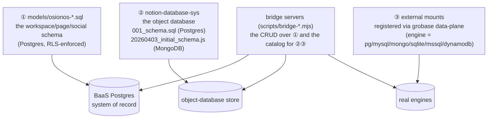

# 05 — Schema source map: where osionos's schema actually lives

> "Show me the files." This is the index of every file that *defines* osionos's data schema — the
> Postgres migrations in [`models/`](../../../models), the dual-engine `notion-database-sys` schema,
> and the bridge servers that read/write them — plus the order they load and how each is built and
> optimized. It's the osionos-focused companion to the exhaustive
> [prismatica 03 — schema source map](../prismatica/03-schema-source-map.md).

**Series:** [README](./README.md) · [01 — Conceptual data model](./01-conceptual-data-model.md) · [02 — Ownership & provisioning](./02-ownership-and-provisioning.md) · [03 — Config tables & databases](./03-config-tables-and-databases.md) · [04 — Persist & retrieve](./04-persist-and-retrieve.md) · **05 — Schema source map (this file)**

---

## The three places schema is defined

1. **The core schema** — `models/osionos-*.sql` — the workspace, pages, databases-catalog, and the
   whole social graph. This is the authoritative DDL, and it's where ownership + RLS live.
2. **The object database** — `notion-database-sys` — the engine behind a user-created Notion table,
   shipping **both** a Postgres schema and a MongoDB schema (see [03](./03-config-tables-and-databases.md)).
3. **External mounts** — real database servers registered through grobase's data plane and recorded
   in the `osionos_workspace_databases` catalog.

---

## ① The core migrations (`models/osionos-*.sql`)

Every osionos table is born in one of these. Tables **created** are in bold; files that only `ALTER`
an existing table are marked.

| File | Creates / alters | What it owns |
|---|---|---|
| [`osionos-bridge-migration.sql`](../../../models/osionos-bridge-migration.sql) | **osionos_bridge_identities, osionos_workspaces, osionos_workspace_members, osionos_pages, osionos_page_configurations, osionos_page_action_events, osionos_bridge_audit_events** | The heart: identity↔workspace, the page tree, `auth.uid()` ([:8](../../../models/osionos-bridge-migration.sql#L8)), the page RLS policies ([:175-224](../../../models/osionos-bridge-migration.sql#L175)), and the provisioning RPCs ([:312, :346](../../../models/osionos-bridge-migration.sql#L312)). |
| [`osionos-workspace-databases-migration.sql`](../../../models/osionos-workspace-databases-migration.sql) | **osionos_workspace_databases** | The mount catalog ([03](./03-config-tables-and-databases.md)). |
| [`osionos-chat-migration.sql`](../../../models/osionos-chat-migration.sql) | **osionos_channels, osionos_messages, osionos_channel_members, osionos_message_reactions, osionos_feed_comments, osionos_feed_likes** | Chat + feed core. |
| [`osionos-engagement-migration.sql`](../../../models/osionos-engagement-migration.sql) | **osionos_channel_reads, osionos_message_mentions, osionos_notifications** | Engagement + the `osionos_unread_counts()` aggregate ([:35](../../../models/osionos-engagement-migration.sql#L35)). |
| [`osionos-media-migration.sql`](../../../models/osionos-media-migration.sql) | **osionos_message_attachments** | Chat media metadata (bytes in MinIO). |
| [`osionos-social-migration.sql`](../../../models/osionos-social-migration.sql) | **osionos_connections, osionos_join_requests, osionos_message_receipts, osionos_user_blocks, osionos_user_reports, osionos_directory** (view) | Social graph, moderation, directory; the identity `search_doc`/trgm/HNSW indexes ([:22-40](../../../models/osionos-social-migration.sql#L22)). |
| [`osionos-communities-migration.sql`](../../../models/osionos-communities-migration.sql) | **osionos_communities, osionos_community_channels, osionos_community_members** | Communities. |
| [`osionos-people-directory-migration.sql`](../../../models/osionos-people-directory-migration.sql) | **osionos_people_directory** (view) | The safe People directory (never email/password). |
| [`osionos-admin-migration.sql`](../../../models/osionos-admin-migration.sql) | **osionos_profile_template_section_grants**; alters identities/pages | Admin/profile templates; adds `is_admin`. |
| [`osionos-reply-migration.sql`](../../../models/osionos-reply-migration.sql) | *alters* osionos_messages | Adds `reply_to_id` + index ([:8](../../../models/osionos-reply-migration.sql#L8)). |
| [`osionos-thread-migration.sql`](../../../models/osionos-thread-migration.sql) | *alters* osionos_messages | Adds `thread_root_id`, `reply_count`, the count trigger ([:24-39](../../../models/osionos-thread-migration.sql#L24)). |
| [`osionos-message-search-migration.sql`](../../../models/osionos-message-search-migration.sql) | *alters* osionos_messages | Adds `search_doc` (generated) + GIN index ([:10-12](../../../models/osionos-message-search-migration.sql#L10)). |
| [`osionos-folder-surface-migration.sql`](../../../models/osionos-folder-surface-migration.sql) | *alters* osionos_pages | Widens `surface` to allow `folder`. |
| [`osionos-wiki-surface-migration.sql`](../../../models/osionos-wiki-surface-migration.sql) | *alters* osionos_pages | Widens `surface` to allow `wiki`. |

Cross-cutting files that also touch osionos tables: [`rls-hardening-migration.sql`](../../../models/rls-hardening-migration.sql)
(the FORCE-RLS + grant-tightening pass) and [`auth-gateway-users-reconcile-migration.sql`](../../../models/auth-gateway-users-reconcile-migration.sql)
(bridges `auth.users` → the app `users` mirror osionos's UUIDs key on).

> **`osionos_messages` is assembled across four files.** It's created once in `osionos-chat-migration`
> and then `ALTER`ed by reply/thread/message-search. The full assembly table is in
> [prismatica 03 — "osionos_messages is assembled across four migrations"](../prismatica/03-schema-source-map.md).

### How they're built & optimized (at a glance)

- **Built additively & idempotently** — `CREATE TABLE IF NOT EXISTS`, `ADD COLUMN IF NOT EXISTS`,
  `CREATE INDEX IF NOT EXISTS`, `DROP POLICY IF EXISTS … CREATE POLICY` — so the whole set is safe to
  re-apply on every boot.
- **Optimized** with composite + partial indexes, generated columns, a trigger, and an aggregate
  function — the complete, line-cited inventory is in
  [04 — The optimization inventory](./04-persist-and-retrieve.md#the-optimization-inventory--what-keeps-it-fast).
- **Secured** with RLS keyed on `auth.uid()` and membership permission-array overlap; the bridge path
  uses the service role and re-checks in code ([02](./02-ownership-and-provisioning.md),
  [prismatica 04](../prismatica/04-crud-and-server-trust-boundary.md)).

---

## ② The object database (`notion-database-sys`)

A registered git submodule under
[`apps/osionos/app/src/shared/notion-database-sys/`](../../../apps/osionos/app/src/shared/notion-database-sys).
Its schema is defined twice, once per back-end:

| File | Engine | Defines | Optimization |
|---|---|---|---|
| [`src/store/dbms/relational/001_schema.sql`](../../../apps/osionos/app/src/shared/notion-database-sys/src/store/dbms/relational/001_schema.sql) | PostgreSQL | 6 demo databases (`tasks, contacts, content, inventory, projects, products`) — [:19,38,58,75,93,115](../../../apps/osionos/app/src/shared/notion-database-sys/src/store/dbms/relational/001_schema.sql#L19) | PK per table (`id VARCHAR(36)`); no secondary indexes (app-adapter handles them) |
| [`src/store/dbms/relational/002_seed.sql`](../../../apps/osionos/app/src/shared/notion-database-sys/src/store/dbms/relational/002_seed.sql) | PostgreSQL | deterministic seed rows | `INSERT … ON CONFLICT (id) DO NOTHING` (idempotent) |
| [`packages/core/migrations/20260403_initial_schema.js`](../../../apps/osionos/app/src/shared/notion-database-sys/packages/core/migrations/20260403_initial_schema.js) | MongoDB | 10 workspace-system collections | unique / sparse / composite / **TTL** indexes ([:17-74](../../../apps/osionos/app/src/shared/notion-database-sys/packages/core/migrations/20260403_initial_schema.js#L17)) |

The **shape** of a user database (columns + relations) is described as TypeScript data, not DDL:

| File | Defines |
|---|---|
| [`packages/types/src/schema.ts`](../../../apps/osionos/app/src/shared/notion-database-sys/packages/types/src/schema.ts) | `DomainDatabaseSchema` ([:49](../../../apps/osionos/app/src/shared/notion-database-sys/packages/types/src/schema.ts#L49)) + `DomainSchemaProperty` ([:20](../../../apps/osionos/app/src/shared/notion-database-sys/packages/types/src/schema.ts#L20)) — properties, title, data sources, relations. |
| [`src/widgets/database-view/model/workspaceDatabaseSchema.ts`](../../../apps/osionos/app/src/widgets/database-view/model/workspaceDatabaseSchema.ts) | The workspace Folders/Files databases with two-way + one-way relations ([:41-83](../../../apps/osionos/app/src/widgets/database-view/model/workspaceDatabaseSchema.ts#L41)). |

---

## ③ The bridge servers — the CRUD over the schema

The osionos app never touches Postgres directly; the **bridge** (Node, holds the service-role key)
does. The osionos-relevant servers under
[`apps/osionos/app/scripts/`](../../../apps/osionos/app/scripts):

| File | Tables it serves |
|---|---|
| [`bridge-api.mjs`](../../../apps/osionos/app/scripts/bridge-api.mjs) | identities, workspaces, members, pages, page-configurations, workspace-databases — plus the token mint/verify and the provisioning call. |
| [`bridge-chat.mjs`](../../../apps/osionos/app/scripts/bridge-chat.mjs) | channels, messages, members, reads, reactions, receipts, mentions, attachments. |
| [`bridge-graph.mjs`](../../../apps/osionos/app/scripts/bridge-graph.mjs) / [`bridge-graph-data.mjs`](../../../apps/osionos/app/scripts/bridge-graph-data.mjs) | the page graph + workspace-database records for the graph explorer. |
| [`bridge-collab.mjs`](../../../apps/osionos/app/scripts/bridge-collab.mjs), [`bridge-feed.mjs`](../../../apps/osionos/app/scripts/bridge-feed.mjs), [`bridge-social.mjs`](../../../apps/osionos/app/scripts/bridge-social.mjs), [`bridge-profile.mjs`](../../../apps/osionos/app/scripts/bridge-profile.mjs), [`bridge-notify.mjs`](../../../apps/osionos/app/scripts/bridge-notify.mjs), [`bridge-communities.mjs`](../../../apps/osionos/app/scripts/bridge-communities.mjs) | membership/sharing, feed, social graph, profiles+directory, notifications, communities. |

The full per-server table map (every `bridge-*.mjs` and the tables it touches) is
[prismatica 03 §6](../prismatica/03-schema-source-map.md).

---

## Apply order

The migrations are applied by the grobase runner
[`apps/grobase/scripts/db/apply-project-sql.sh`](../../../apps/grobase/scripts/db/apply-project-sql.sh).
The core sequence puts `osionos-bridge-migration.sql` early (identity/workspace/pages must exist before
anything references them), then the chat/engagement/social/media layers, with the
`rls-hardening-migration.sql` defense-in-depth pass after. The exact ordering, its caveats, and which
files load through a secondary glob (the surface + people-directory + workspace-databases migrations)
are documented in [prismatica 03 §2](../prismatica/03-schema-source-map.md) — that analysis applies
verbatim, since osionos and prismatica share the one Postgres instance.

> **The object database (`notion-database-sys`) loads separately** from the `models/*.sql` runner: its
> Postgres seed is run with `psql` against its own `notion_db`, and its MongoDB migration is applied by
> the contract server the app boots during `npm run dev` (Mongo on `:27017`). See
> [`apps/osionos/app/CLAUDE.md`](../../../apps/osionos/app/CLAUDE.md).

---

## Quick navigation

- **"Where is table X created?"** → ① above, or the reverse index in
  [prismatica 03 §3](../prismatica/03-schema-source-map.md).
- **"What writes table X?"** → the bridge servers in ③.
- **"Is this a `.sql` or a Mongo schema?"** → ② — both, see [03](./03-config-tables-and-databases.md).
- **"How is it kept fast / safe?"** → [04 — optimization inventory](./04-persist-and-retrieve.md#the-optimization-inventory--what-keeps-it-fast)
  and the RLS in [01](./01-conceptual-data-model.md) / [02](./02-ownership-and-provisioning.md).
