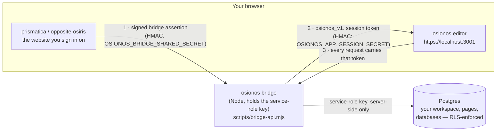

# osionos — the data model, in plain language

> osionos is a Notion-style block editor that grew into a whole workspace. This series tells the
> story of **its data**: what a "workspace" really is, how *you* end up owning your own private one
> the moment you sign in from the website, where your pages and your own little databases live, and
> how every edit travels safely from your browser down to Postgres. Friendly on top, but every claim
> is anchored to a real file and line you can open yourself.

## Read me first: what osionos actually stores

Think of osionos as three nested ideas:

1. **A workspace** — your personal "place". The website hands you exactly one when you first arrive,
   and you are its **owner**. (This is the "your own instance" part of the story.)
2. **Pages** — the documents, folders, wikis, and home screens inside that workspace. They form a
   tree (a page can contain pages), and every page is a bag of **blocks** stored as JSON.
3. **Databases** ("config tables") — the Notion-style tables you build yourself (Tasks, Contacts,
   a CRM, an inventory…). A workspace can also *mount* a real external database — Postgres, MySQL,
   MongoDB, SQLite, SQL Server, or DynamoDB — and browse it like a page.

Everything else — chat, the people directory, the social graph, notifications — hangs off those
three. The spine is always the same: **one person → one private workspace → their pages and
databases**.

## The one picture to keep in your head

osionos never talks to the database directly from your browser. A **server-side bridge** (it holds
the powerful service key you never see) stands in the middle, and the website (**prismatica /
opposite-osiris**) introduces you to it with a signed note. Two different secrets guard the two hops:

- **Hop 1** — the website proves *who you are* to the bridge with an HMAC-signed assertion
  (timestamped, replay-protected). Secret: `OSIONOS_BRIDGE_SHARED_SECRET`.
- **Hop 2** — the bridge mints you an `osionos_v1.` **app-session token** that lists the workspaces
  you may touch and your role in each. Secret: `OSIONOS_APP_SESSION_SECRET`.
- **Hop 3** — from then on the editor sends that token with every call; the bridge verifies it,
  derives *your* id from it (never from the request body), and talks to Postgres as the service role.

The full, line-by-line walk-through of this is **[02 — Ownership & provisioning](./02-ownership-and-provisioning.md)**.

## The series

| # | Doc | What it answers |
|---|-----|-----------------|
| — | [README](./README.md) | This page — the mental model and the one big picture. |
| 01 | [Conceptual data model (the MCD)](./01-conceptual-data-model.md) | The entities of osionos's business model and how they connect: identity → workspace → page tree → databases, plus the chat/social graph. The Mermaid MCD diagrams. |
| 02 | [Ownership & provisioning](./02-ownership-and-provisioning.md) | **How a website user becomes the owner of their own private osionos instance** — the two-secret handoff and the one SQL function that creates your identity, your workspace, and your owner seat in a single transaction. |
| 03 | [Config tables & your own databases](./03-config-tables-and-databases.md) | The "his own config tables" question: the workspace-database mounts, and the dual-engine `notion-database-sys` (**both `*.sql` and MongoDB**). Which engines are real, how the schemas are built, related, and optimized. |
| 04 | [Persist & retrieve](./04-persist-and-retrieve.md) | How an edit is saved (offline-first outbox/ledger, owner-stamped writes) and how your workspace is rebuilt on boot. The index/trigger/generated-column optimizations. |
| 05 | [Schema source map](./05-schema-source-map.md) | Every file that *defines* osionos's schema — the `models/osionos-*.sql` migrations and the `notion-database-sys` SQL + MongoDB migrations — with the apply order. |

## How this relates to the prismatica series

osionos and the prismatica website **write the same Postgres tables** — osionos through the trusted
bridge, prismatica through the public REST surface. So the neighbouring
**[`wiki/database/prismatica/`](../prismatica/README.md)** series already documents the *shared*
schema in full: the complete column dictionary
([prismatica 01](../prismatica/01-conceptual-data-model.md)), the engine mapping
([prismatica 02](../prismatica/02-engine-mapping.md)), the file-by-file source map
([prismatica 03](../prismatica/03-schema-source-map.md)), and the trust boundary + validation
([prismatica 04](../prismatica/04-crud-and-server-trust-boundary.md) /
[05](../prismatica/05-input-output-validation.md)).

**This series doesn't repeat that dictionary.** It tells the *osionos* half of the story — ownership,
your own databases, and the save/restore path — and links to prismatica whenever you want the full
column-level detail.

## A note on the references

Every technical claim below points at a real file with a line anchor, e.g.
[`models/osionos-bridge-migration.sql:346`](../../../models/osionos-bridge-migration.sql#L346) or
[`apps/osionos/app/scripts/bridge-api.mjs:372`](../../../apps/osionos/app/scripts/bridge-api.mjs#L372).
These resolve when you browse the repo on GitHub or in an editor that follows relative links. SQL
migrations live in [`models/`](../../../models); the bridge and the app live under
[`apps/osionos/app/`](../../../apps/osionos/app). Nothing here is invented — if a fact couldn't be
confirmed in a file, it isn't stated.
