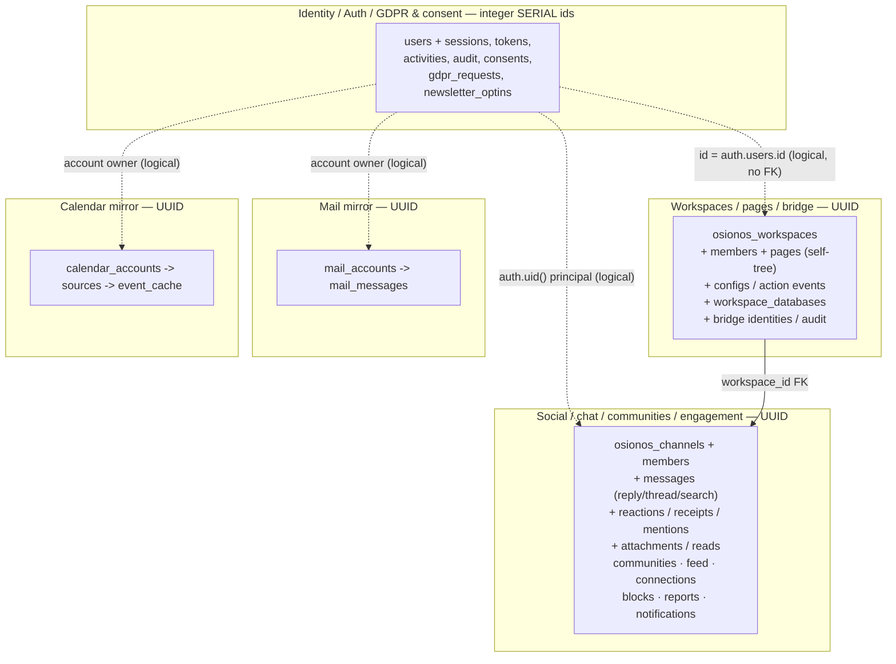
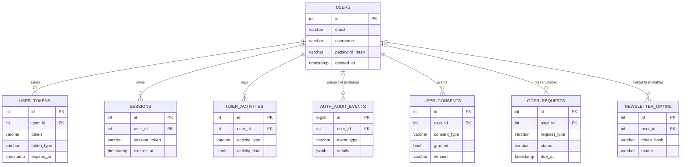
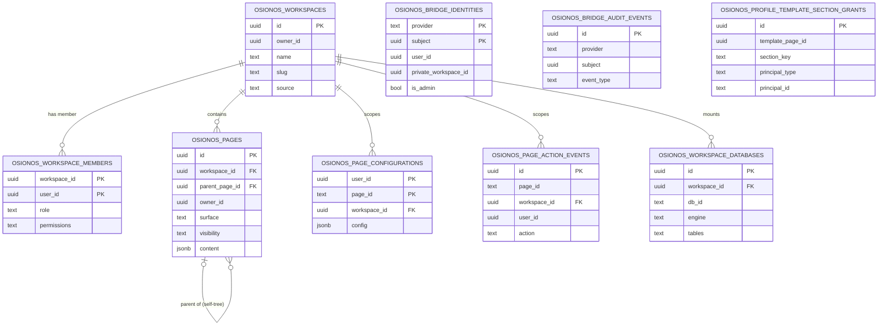
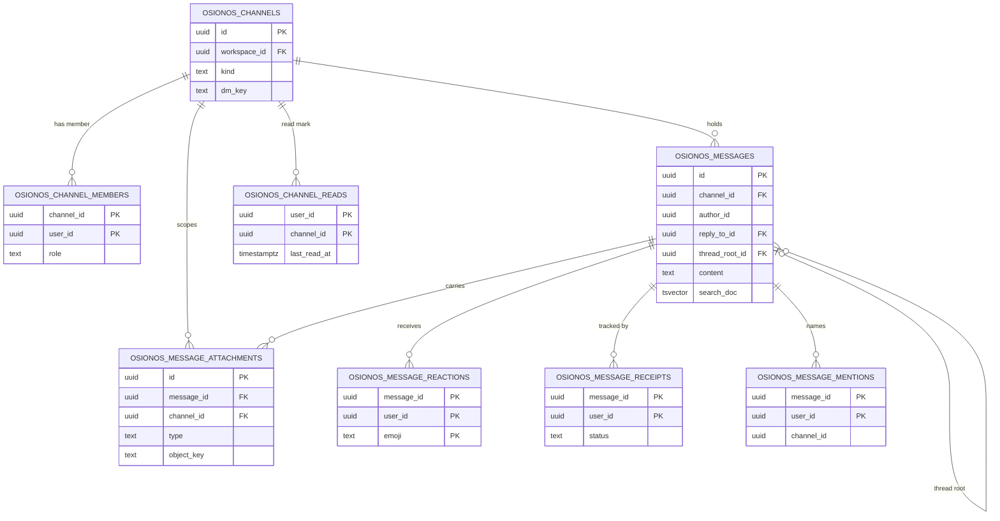
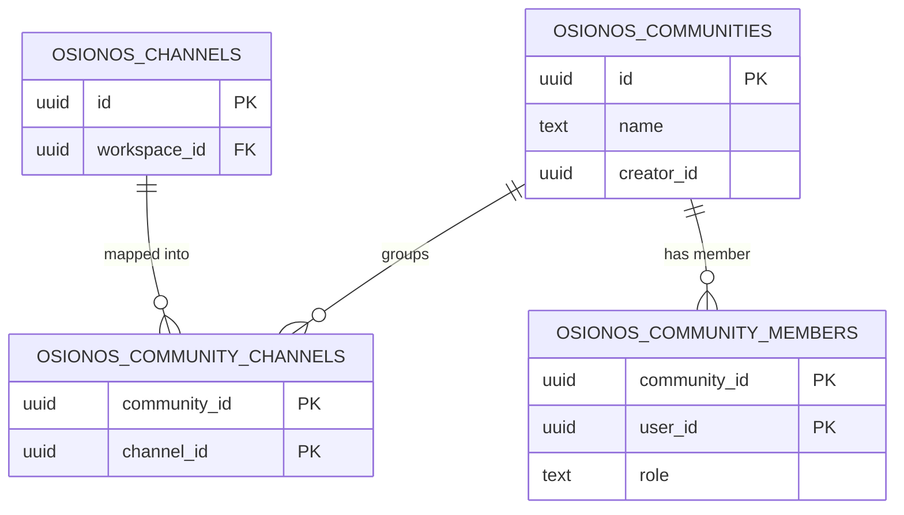
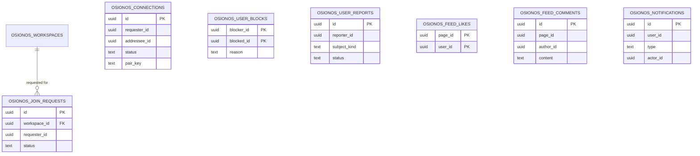
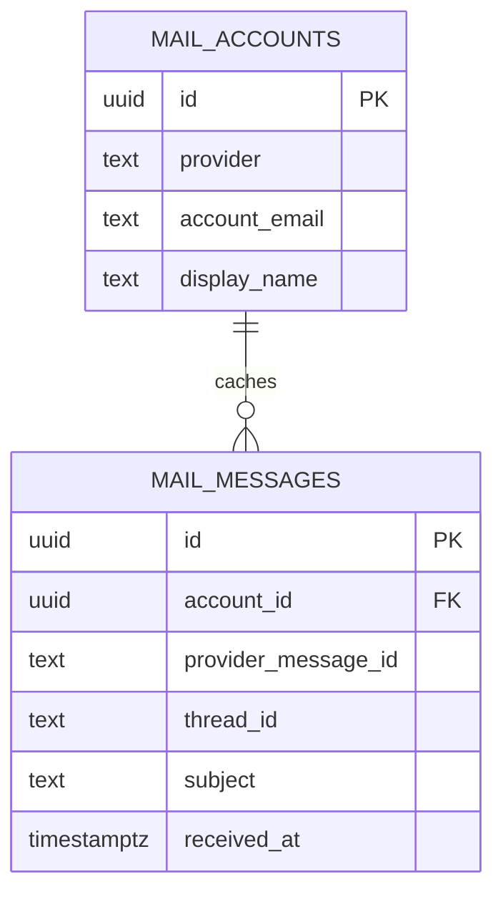
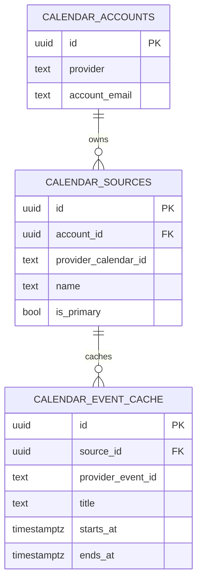

# 01 — Conceptual data model (the MCD)

> The *Modèle Conceptuel de Données* for Prismatica: every entity, its key attributes, and the relationships that bind them — read straight off the `models/*.sql` migrations, nothing invented.

This is the centerpiece of the series. [02 — engine mapping](./02-engine-mapping.md) shows how this
model projects onto each storage engine; [03 — schema source map](./03-schema-source-map.md) shows
exactly which file and runner owns each table. Here we stay conceptual: what exists, and how it
connects.

## How to read this model

**The canonical engine is Postgres.** Every entity below is a real, RLS-enforced table (or view) in a
single Postgres instance — the only system of record. No other engine hosts the identity/auth/social
model; the rest are data-plane, cache, or blob roles ([02](./02-engine-mapping.md)).

**Global ids keep entities stable.** There are two id regimes, and the seam between them is the whole
identity story:

- The **legacy identity domain** (`models/user.sql`) keys on **integer `SERIAL`** ids — `users.id` is
  an `int4` + sequence ([`models/user.sql:2`](../../../models/user.sql)). All of its satellites
  (`user_tokens`, `sessions`, `user_activities`, `auth_audit_events`, `user_consents`,
  `gdpr_requests`, `newsletter_optins`) FK back to it as `user_id INTEGER`.
- The **osionos bridge, social, mail, and calendar domains** key on **UUID** via
  `gen_random_uuid()`, and every `user_id` / `owner_id` is the **same UUID as `auth.users.id`** (the
  GoTrue identity), resolved per request from the JWT `sub` claim by
  `auth.uid()` ([`models/osionos-bridge-migration.sql:8`](../../../models/osionos-bridge-migration.sql)).
  Because that one UUID identifies a person across the *entire* social graph, no id translation is ever
  needed between `osionos_connections`, `osionos_channel_members`, `osionos_workspace_members`, and
  `public.users`.

The two regimes are reconciled in the grobase deployment: there `public.users.id` is a **UUID equal to
`auth.users.id`**, and [`models/auth-gateway-users-reconcile-migration.sql`](../../../models/auth-gateway-users-reconcile-migration.sql)
re-adds the five legacy columns (`username`, `password_hash`, `theme`, `notifications_enabled`,
`is_email_verified`) onto that UUID table so the legacy "fat" schema and the thin UUID mirror share one
table name keyed by `id = auth.users.id`. **This `id` conflict (integer in `user.sql`, UUID in the live
deployment) is the single most important nuance in the model** — it is flagged on the `users.id` row of
the dictionary below.

**Folders and wikis are not tables.** A folder and a wiki are just `osionos_pages` rows distinguished by
`surface` — the surface `CHECK` is progressively widened from `('page','agent','home')` to add
`'folder'` ([`models/osionos-folder-surface-migration.sql:12`](../../../models/osionos-folder-surface-migration.sql))
and `'wiki'` ([`models/osionos-wiki-surface-migration.sql:14`](../../../models/osionos-wiki-surface-migration.sql)).

**Type conventions.** Legacy-identity timestamps are `TIMESTAMP WITHOUT TIME ZONE`; bridge/social/mail/
calendar timestamps are `timestamptz DEFAULT now()`. Enum-like text columns are constrained by `CHECK`
(often against an `IMMUTABLE` helper function in the GDPR layer), not native Postgres `ENUM` types.

---

## The domain map

Five domains. Identity is the spine: the GoTrue/`public.users` UUID is the principal every other domain
references. Solid arrows are declared foreign keys; dashed arrows are **logical** links carried by a
shared UUID with **no DB-level FK** (the bridge enforces them in app code — see
[04](./04-crud-and-server-trust-boundary.md)).

---

## Domain 1 — Identity / Auth / GDPR & consent

The legacy "fat" account table and its satellites. Ownership in RLS is keyed on
`id = gdpr_current_user_id()` (resolved from the JWT email claim) for `users`, and
`user_id = gdpr_current_user_id()` for the satellites — derived from the verified credential, never
the request body. `auth_audit_events` and `newsletter_optins` are locked tighter (service-role / RPC
only); the details live in [04](./04-crud-and-server-trust-boundary.md).

Notes:
- `user_tokens.user_id`, `sessions.user_id`, `user_activities.user_id`, `user_consents.user_id`
  are `ON DELETE CASCADE`; `auth_audit_events.user_id`, `gdpr_requests.user_id`,
  `newsletter_optins.user_id` are `ON DELETE SET NULL` (hence the optional `|o` cardinality).
- `user_consents` is uniquely keyed on `(user_id, consent_type, version)` — one row per consent
  version, upserted via `ON CONFLICT` ([`models/gdpr-migration.sql:302`](../../../models/gdpr-migration.sql)).
- Enumerations are `CHECK`ed against helper functions: consent types =
  `terms/newsletter/analytics/marketing`; request types =
  `access/deletion/rectification/portability/restriction/objection/consent_withdrawal/newsletter`;
  newsletter statuses = `pending/confirmed/unsubscribed/expired`.

---

## Domain 2 — Workspaces, pages & the osionos bridge

A workspace (a "work") is the root container; pages form a self-referencing tree inside it. Membership
(`osionos_workspace_members.permissions[]`) decides who can reach a workspace and drives page RLS via an
array-overlap (`&&`) check per verb. **`page_id` on the config / action-event tables is deliberately
plain `TEXT`, not a FK** — the bridge migration drops any FK and re-types the column so those tables are
decoupled from `osionos_pages.id`.

Notes:
- **No DB FK** carries these conceptual links (the bridge enforces them in code):
  `osionos_bridge_identities.user_id` ↔ `public.users.id`,
  `osionos_bridge_identities.private_workspace_id` ↔ a workspace (both `UNIQUE` on the identity row),
  `osionos_workspace_members.user_id` ↔ users, and every `owner_id`. `osionos_bridge_audit_events`
  and `osionos_profile_template_section_grants` stand alone (service-role only, no FK).
- `osionos_pages.surface ∈ {page, agent, home, folder, wiki}`; `visibility ∈ {private, shared, public}`;
  `template_surface ∈ {profile, marketplace-app}`. `parent_page_id` is `ON DELETE SET NULL` (self-tree).
- `osionos_page_configurations` PK is `(user_id, page_id)`; `osionos_workspace_databases` is `UNIQUE`
  on `(workspace_id, db_id)` and is joined with members → workspaces to derive a caller's authorized
  mount set.
- A `visibility` column is added to `osionos_workspaces` later by `osionos-social-migration` (guarded by
  an `information_schema` check) with `CHECK IN ('confidential','request_to_join','public')`; the admin
  migration seeds one fixed admin workspace and sets it `confidential`.

---

## Domain 3 — Social, chat, communities & engagement

The osionos messenger graph. Split into three diagrams for legibility. Across all of these, every id is
a UUID and `user_id` is `auth.users.id` — so the social graph needs no id translation.

### 3a — Chat core

Notes:
- `osionos_channels.kind ∈ {text, dm, voice, video}`, widened to add `'group'` by
  `osionos-social-migration`; DMs use a deterministic `dm_key` (`UNIQUE`) for find-or-create.
- `osionos_messages` grows incrementally: `reply_to_id` (quote target,
  [`osionos-reply-migration.sql:6`](../../../models/osionos-reply-migration.sql)), `thread_root_id` +
  `reply_count` (flat threads, [`osionos-thread-migration.sql:9`](../../../models/osionos-thread-migration.sql),
  trigger-maintained), and a generated `search_doc tsvector`
  ([`osionos-message-search-migration.sql:9`](../../../models/osionos-message-search-migration.sql)). Both
  self-FKs are `ON DELETE SET NULL`.
- `osionos_message_attachments` is grouped under the bridge "media" schema in the source
  ([`models/osionos-media-migration.sql:11`](../../../models/osionos-media-migration.sql)) but its FKs
  point at chat tables (`message_id`, `channel_id`), so it lives here. Bytes live in MinIO (bucket
  `chat`, keyed by `sha256`); the row holds only the `object_key`.
- `osionos_message_mentions.channel_id` and `osionos_message_receipts` carry no FK on `channel_id`
  (denormalized); the mention/receipt PKs are composite.

### 3b — Communities

`osionos_community_channels` is the channel↔community join table (composite PK, both sides
`ON DELETE CASCADE`); `osionos_community_members` is the user↔community join table.

### 3c — Social graph, feed & inbox

These tables key on user/page UUIDs but declare **almost no foreign keys** — relationships are logical
(enforced by the bridge), except `osionos_join_requests.workspace_id` which FKs to `osionos_workspaces`.

Notes:
- `osionos_connections` is one row per unordered pair via a generated `pair_key` (`UNIQUE`);
  `status ∈ {pending, accepted, declined, withdrawn, blocked}`, `CHECK requester_id <> addressee_id`.
- `osionos_user_blocks` PK `(blocker_id, blocked_id)` with `CHECK blocker_id <> blocked_id`.
- `osionos_join_requests` is `UNIQUE (workspace_id, requester_id)`; `status ∈ {pending, approved, denied}`.
- `osionos_feed_likes`/`osionos_feed_comments` reference an osionos page id with **no FK**; their RLS
  `SELECT` is `USING (true)` (any authenticated user can read feed likes/comments).
- `osionos_notifications.type ∈ {mention, dm, reply, reaction, connection, system}`.

### 3d — Directory views (derived, not tables)

Two `CREATE OR REPLACE VIEW`s expose a safe People directory (never `email`/`password`):

- **`osionos_directory`** — over `osionos_bridge_identities` where `directory_opt_out = false`
  ([`models/osionos-social-migration.sql:42`](../../../models/osionos-social-migration.sql)).
- **`osionos_people_directory`** — joins `public.users` + `public.user_profiles` +
  `osionos_bridge_identities`, exposing only `username`/name/avatar/headline/last-seen/opt-out plus a
  recomputed `search_doc` ([`models/osionos-people-directory-migration.sql:45`](../../../models/osionos-people-directory-migration.sql)).

---

## Domain 4 — Mail mirror

BaaS mirror cache for the osionos Mail (Gmail) app, written by the bridge with the service role.
Locked to `service_role` (no public access).

`mail_accounts` is `UNIQUE (provider, account_email)` with `provider ∈ {gmail, outlook, imap}`;
`mail_messages` is `UNIQUE (account_id, provider_message_id)`, `ON DELETE CASCADE`, indexed on
`received_at DESC`, `thread_id`, and a GIN index on `labels`.

---

## Domain 5 — Calendar mirror

BaaS mirror cache for the osionos Calendar app. Three levels: account → source (calendar) → cached
event. Locked to `service_role` (no public access).

`calendar_accounts` is `UNIQUE (provider, account_email)` with `provider ∈ {google, outlook, caldav,
local}`; `calendar_sources` is `UNIQUE (account_id, provider_calendar_id)`; `calendar_event_cache` is
`UNIQUE (source_id, provider_event_id)`, indexed on the `(starts_at, ends_at)` range and a GIN index on
`source_payload`. All FKs are `ON DELETE CASCADE`.

---

## Entity dictionary

Every column from the fact base, with source `file:line`. Types are as defined (`int` = `SERIAL`/`int4`,
`bigint` = `BIGSERIAL`; legacy `timestamp` = `TIMESTAMP WITHOUT TIME ZONE`).

### Identity / Auth / GDPR

#### `users` — [`models/user.sql:2`](../../../models/user.sql)

| Column | Type | Null | Notes |
|---|---|---|---|
| id | int | no | PK. **`SERIAL` here, but `uuid` (= `auth.users.id`) in the grobase deployment** — the central id conflict. |
| username | varchar | yes | `VARCHAR(255) UNIQUE`; re-added as `text` on the UUID mirror by the reconcile migration. |
| email | varchar | no | `VARCHAR(255) NOT NULL UNIQUE`. |
| password_hash | varchar | no | `VARCHAR(255)`; placeholder `'managed-by-gotrue'` under GoTrue. |
| first_name | varchar | yes | `VARCHAR(255)`. |
| last_name | varchar | yes | `VARCHAR(255)`. |
| avatar_url | varchar | yes | `VARCHAR(255)`. |
| bio | text | yes | |
| theme | varchar | yes | `VARCHAR(50) DEFAULT 'light'`. |
| notifications_enabled | bool | yes | `DEFAULT TRUE`. |
| is_email_verified | bool | yes | `DEFAULT FALSE`. |
| created_at | timestamp | yes | `DEFAULT CURRENT_TIMESTAMP`. |
| updated_at | timestamp | yes | `DEFAULT CURRENT_TIMESTAMP`. |
| deletion_requested_at | timestamp | yes | Added by `gdpr-migration.sql:287`. |
| deleted_at | timestamp | yes | Soft-delete marker (`gdpr-migration.sql:288`); drives anon read policy `USING deleted_at IS NULL`. |

Uniques: `username`, `email`, plus `UNIQUE INDEX (lower(username)) WHERE username IS NOT NULL`
(reconcile migration:50).

#### `user_tokens` — [`models/user.sql:25`](../../../models/user.sql)

| Column | Type | Null | Notes |
|---|---|---|---|
| id | int | no | PK. |
| user_id | int | no | FK → `users(id)` `ON DELETE CASCADE`. |
| token | varchar | no | `VARCHAR(255) UNIQUE`. |
| token_type | varchar | no | e.g. `email_verify`, `password_reset`. |
| expires_at | timestamp | no | |
| created_at | timestamp | yes | `DEFAULT CURRENT_TIMESTAMP`. |

#### `sessions` — [`models/user.sql:35`](../../../models/user.sql)

| Column | Type | Null | Notes |
|---|---|---|---|
| id | int | no | PK. |
| user_id | int | no | FK → `users(id)` `ON DELETE CASCADE`. |
| session_token | varchar | no | `VARCHAR(255) UNIQUE`. |
| expires_at | timestamp | no | |
| created_at | timestamp | yes | `DEFAULT CURRENT_TIMESTAMP`. |

#### `user_activities` — [`models/user.sql:44`](../../../models/user.sql)

| Column | Type | Null | Notes |
|---|---|---|---|
| id | int | no | PK. |
| user_id | int | no | FK → `users(id)` `ON DELETE CASCADE`. |
| activity_type | varchar | no | `VARCHAR(255)`. |
| activity_data | jsonb | yes | `anonymise_user` strips ip/device/location/user_agent/browser/os keys. |
| created_at | timestamp | yes | `DEFAULT CURRENT_TIMESTAMP`. |

#### `auth_audit_events` — [`models/auth-security-migration.sql:9`](../../../models/auth-security-migration.sql)

| Column | Type | Null | Notes |
|---|---|---|---|
| id | bigint | no | `BIGSERIAL` PK. |
| event_type | varchar | no | `VARCHAR(64)` `CHECK` allowlist (expanded at `:46-84`). |
| user_id | int | yes | FK → `users(id)` `ON DELETE SET NULL`. |
| email | varchar | yes | stored lowercased. |
| ip_address | varchar | yes | from `x-forwarded-for` / `x-real-ip`. |
| user_agent | varchar | yes | `VARCHAR(1024)`. |
| details | jsonb | no | `DEFAULT '{}'::jsonb`. |
| created_at | timestamp | no | `DEFAULT CURRENT_TIMESTAMP`. |

RLS: `USING (false)` blocks even authenticated `SELECT`; written via `SECURITY DEFINER`
`auth_record_audit_event()`, service-role only.

#### `user_consents` — [`models/gdpr-migration.sql:290`](../../../models/gdpr-migration.sql)

| Column | Type | Null | Notes |
|---|---|---|---|
| id | int | no | PK. |
| user_id | int | no | FK → `users(id)` `ON DELETE CASCADE`. |
| consent_type | varchar | no | `CHECK` ∈ `terms/newsletter/analytics/marketing`. |
| granted | bool | no | `DEFAULT FALSE`. |
| granted_at | timestamp | no | `DEFAULT CURRENT_TIMESTAMP`. |
| withdrawn_at | timestamp | yes | |
| ip_at_consent | varchar | yes | |
| user_agent_at_consent | varchar | yes | `VARCHAR(1024)`. |
| version | varchar | no | policy version; part of unique key. |
| created_at | timestamp | no | `DEFAULT CURRENT_TIMESTAMP`. |
| updated_at | timestamp | no | `DEFAULT CURRENT_TIMESTAMP`. |

Unique: `(user_id, consent_type, version)` — ON CONFLICT upsert target (`:302`).

#### `gdpr_requests` — [`models/gdpr-migration.sql:305`](../../../models/gdpr-migration.sql)

| Column | Type | Null | Notes |
|---|---|---|---|
| id | int | no | PK. |
| user_id | int | yes | FK → `users(id)` `ON DELETE SET NULL`. |
| email | varchar | yes | |
| request_type | varchar | no | `CHECK` against `gdpr_allowed_request_types()`. |
| status | varchar | no | `DEFAULT 'received'`. |
| details | jsonb | no | `DEFAULT '{}'::jsonb`. |
| requested_at | timestamp | no | `DEFAULT CURRENT_TIMESTAMP`. |
| due_at | timestamp | no | `DEFAULT now() + 30 days`. |
| completed_at | timestamp | yes | |

`anon` + `authenticated` may `INSERT`; only `authenticated` may `SELECT` own rows.

#### `newsletter_optins` — [`models/gdpr-migration.sql:317`](../../../models/gdpr-migration.sql)

| Column | Type | Null | Notes |
|---|---|---|---|
| id | int | no | PK. |
| email | varchar | no | |
| user_id | int | yes | FK → `users(id)` `ON DELETE SET NULL`. |
| token_hash | varchar | no | `VARCHAR(128) UNIQUE` (sha256 hex). |
| status | varchar | no | `CHECK` ∈ `pending/confirmed/unsubscribed/expired`. |
| version | varchar | no | `DEFAULT '1.0.0'`. |
| requested_at | timestamp | no | `DEFAULT CURRENT_TIMESTAMP`. |
| expires_at | timestamp | no | `DEFAULT now() + 24 hours`. |
| confirmed_at | timestamp | yes | |
| unsubscribed_at | timestamp | yes | |
| ip_at_request | varchar | yes | |
| user_agent_at_request | varchar | yes | `VARCHAR(1024)`. |

RLS enabled with **zero policies** + `REVOKE ALL` → fully locked to `SECURITY DEFINER` RPCs /
service-role. Non-unique index on `(lower(email))` (`:332`).

### Workspaces / pages / bridge

#### `osionos_bridge_identities` — [`models/osionos-bridge-migration.sql:12`](../../../models/osionos-bridge-migration.sql)

| Column | Type | Null | Notes |
|---|---|---|---|
| provider | text | no | PK part. |
| subject | uuid | no | PK part. |
| user_id | uuid | no | `UNIQUE`; the BaaS user id (= `auth.users.id`). No DB FK. |
| email_hash | text | no | |
| display_name | text | no | |
| private_workspace_id | uuid | no | `UNIQUE`, `DEFAULT gen_random_uuid()`. |
| created_at | timestamptz | no | `DEFAULT now()`. |
| updated_at | timestamptz | no | `DEFAULT now()`. |
| last_seen_at | timestamptz | no | `DEFAULT now()` (presence). |
| is_admin | bool | no | `DEFAULT false`; added by `osionos-admin-migration.sql:15`. |

PK `(provider, subject)`. Heavily ALTERed elsewhere (adds `profile jsonb`, `notify_token`, `username`,
`directory_opt_out`, `bio_embedding`, `search_doc`).

#### `osionos_workspaces` — [`models/osionos-bridge-migration.sql:27`](../../../models/osionos-bridge-migration.sql)

| Column | Type | Null | Notes |
|---|---|---|---|
| id | uuid | no | PK, `DEFAULT gen_random_uuid()`. |
| owner_id | uuid | no | the workspace owner (no DB FK). |
| name | text | no | |
| slug | text | no | `UNIQUE`. |
| source | text | no | `DEFAULT 'bridge'`. |
| settings | jsonb | no | `DEFAULT '{}'::jsonb`. |
| created_at | timestamptz | no | `DEFAULT now()`. |
| updated_at | timestamptz | no | `DEFAULT now()`. |

A `visibility text` column is added later by `osionos-social-migration` (`CHECK IN
('confidential','request_to_join','public')`).

#### `osionos_workspace_members` — [`models/osionos-bridge-migration.sql:38`](../../../models/osionos-bridge-migration.sql)

| Column | Type | Null | Notes |
|---|---|---|---|
| workspace_id | uuid | no | PK part; FK → `osionos_workspaces(id)` `ON DELETE CASCADE`. |
| user_id | uuid | no | PK part. |
| role | text | no | `CHECK` ∈ `owner/admin/editor/viewer`. |
| permissions | text | no | `TEXT[] DEFAULT ARRAY['read']`; drives page RLS via `&&`. |
| created_at | timestamptz | no | `DEFAULT now()`. |
| updated_at | timestamptz | no | `DEFAULT now()`. |

#### `osionos_pages` — [`models/osionos-bridge-migration.sql:48`](../../../models/osionos-bridge-migration.sql)

| Column | Type | Null | Notes |
|---|---|---|---|
| id | uuid | no | PK, `DEFAULT gen_random_uuid()`. |
| workspace_id | uuid | no | FK → `osionos_workspaces(id)` `ON DELETE CASCADE`. |
| parent_page_id | uuid | yes | self-FK → `osionos_pages(id)` `ON DELETE SET NULL`. |
| owner_id | uuid | yes | server-stamped from credential. |
| title | text | no | `DEFAULT 'Untitled'`. |
| icon | text | yes | |
| cover | text | yes | |
| database_id | text | yes | |
| surface | text | yes | `CHECK` ∈ `page/agent/home/folder/wiki` (widened across migrations). |
| visibility | text | no | `DEFAULT 'private'`, `CHECK` ∈ `private/shared/public`. |
| collaborators | jsonb | no | `DEFAULT '[]'::jsonb`. |
| properties | jsonb | no | `DEFAULT '[]'::jsonb`. |
| content | jsonb | no | `DEFAULT '[]'::jsonb` (block content). |
| is_template | bool | no | `DEFAULT false`. |
| is_default_template | bool | no | `DEFAULT false`. |
| recurrence | jsonb | yes | |
| template_surface | text | yes | `CHECK` ∈ `profile/marketplace-app`. |
| archived_at | timestamptz | yes | |
| created_at | timestamptz | no | `DEFAULT now()`. |
| updated_at | timestamptz | no | `DEFAULT now()`. |

#### `osionos_page_configurations` — [`models/osionos-bridge-migration.sql:78`](../../../models/osionos-bridge-migration.sql)

| Column | Type | Null | Notes |
|---|---|---|---|
| page_id | text | no | PK part. **Plain `TEXT`, not a FK** (FK dropped, re-typed at `:98-122`). |
| workspace_id | uuid | no | FK → `osionos_workspaces(id)` `ON DELETE CASCADE`. |
| user_id | uuid | no | PK part. |
| config | jsonb | no | `DEFAULT '{}'::jsonb`. |
| created_at | timestamptz | no | `DEFAULT now()`. |
| updated_at | timestamptz | no | `DEFAULT now()`. |

PK `(user_id, page_id)`.

#### `osionos_page_action_events` — [`models/osionos-bridge-migration.sql:88`](../../../models/osionos-bridge-migration.sql)

| Column | Type | Null | Notes |
|---|---|---|---|
| id | uuid | no | PK, `DEFAULT gen_random_uuid()`. |
| page_id | text | no | **Plain `TEXT`, not a FK** (`:124-125`). |
| workspace_id | uuid | no | FK → `osionos_workspaces(id)` `ON DELETE CASCADE`. |
| user_id | uuid | no | |
| action | text | no | |
| payload | jsonb | no | `DEFAULT '{}'::jsonb`. |
| created_at | timestamptz | no | `DEFAULT now()`. |

#### `osionos_bridge_audit_events` — [`models/osionos-bridge-migration.sql:127`](../../../models/osionos-bridge-migration.sql)

| Column | Type | Null | Notes |
|---|---|---|---|
| id | uuid | no | PK, `DEFAULT gen_random_uuid()`. |
| provider | text | no | |
| subject | uuid | no | |
| event_type | text | no | |
| details | jsonb | no | `DEFAULT '{}'::jsonb`. |
| created_at | timestamptz | no | `DEFAULT now()`. |

Service-role only (no authenticated grant).

#### `osionos_profile_template_section_grants` — [`models/osionos-admin-migration.sql:60`](../../../models/osionos-admin-migration.sql)

| Column | Type | Null | Notes |
|---|---|---|---|
| id | uuid | no | PK, `DEFAULT gen_random_uuid()`. |
| template_page_id | uuid | no | |
| section_key | text | no | |
| principal_type | text | no | `CHECK` ∈ `user/role`. |
| principal_id | text | no | |
| can_write | bool | no | `DEFAULT true`. |
| created_by | uuid | no | |
| created_at | timestamptz | no | `DEFAULT now()`. |

Unique: `(template_page_id, section_key, principal_type, principal_id)`. Service-role only.

#### `osionos_workspace_databases` — [`models/osionos-workspace-databases-migration.sql:19`](../../../models/osionos-workspace-databases-migration.sql)

| Column | Type | Null | Notes |
|---|---|---|---|
| id | uuid | no | PK, `DEFAULT gen_random_uuid()`. |
| workspace_id | uuid | no | FK → `osionos_workspaces(id)` `ON DELETE CASCADE`. |
| db_id | text | no | grobase database mount id. |
| engine | text | yes | |
| tables | text | no | `TEXT[] DEFAULT '{}'`. |
| edges_table | text | yes | |
| label | text | yes | |
| created_at | timestamptz | no | `DEFAULT now()`. |
| updated_at | timestamptz | no | `DEFAULT now()`. |

Unique: `(workspace_id, db_id)`.

### Social / chat / communities / engagement

#### `osionos_channels` — [`models/osionos-chat-migration.sql:12`](../../../models/osionos-chat-migration.sql)

| Column | Type | Null | Notes |
|---|---|---|---|
| id | uuid | no | PK, `DEFAULT gen_random_uuid()`. |
| workspace_id | uuid | no | FK → `osionos_workspaces(id)` `ON DELETE CASCADE`. |
| kind | text | no | `DEFAULT 'text'`, `CHECK` ∈ `text/dm/voice/video` (+`group` later). |
| name | text | no | `DEFAULT 'general'`. |
| topic | text | yes | |
| created_by | uuid | yes | |
| is_private | bool | no | `DEFAULT false`. |
| abac | jsonb | no | `DEFAULT '{}'::jsonb`. |
| dm_key | text | yes | `UNIQUE`; deterministic DM key. |
| created_at | timestamptz | no | `DEFAULT now()`. |
| updated_at | timestamptz | no | `DEFAULT now()`. |
| avatar | text | yes | added by social migration (group chats). |
| description | text | yes | added by social migration (group chats). |

#### `osionos_channel_members` — [`models/osionos-chat-migration.sql:27`](../../../models/osionos-chat-migration.sql)

| Column | Type | Null | Notes |
|---|---|---|---|
| channel_id | uuid | no | PK part; FK → `osionos_channels(id)` `ON DELETE CASCADE`. |
| user_id | uuid | no | PK part. |
| role | text | no | `DEFAULT 'member'`; social migration adds `CHECK ∈ owner/admin/member` (NOT VALID). |
| joined_at | timestamptz | no | `DEFAULT now()`. |

#### `osionos_messages` — [`models/osionos-chat-migration.sql:35`](../../../models/osionos-chat-migration.sql)

| Column | Type | Null | Notes |
|---|---|---|---|
| id | uuid | no | PK, `DEFAULT gen_random_uuid()`. |
| channel_id | uuid | no | FK → `osionos_channels(id)` `ON DELETE CASCADE`. |
| author_id | uuid | no | |
| content | text | no | `DEFAULT ''`. |
| attachments | jsonb | no | `DEFAULT '[]'::jsonb`. |
| created_at | timestamptz | no | `DEFAULT now()`. |
| edited_at | timestamptz | yes | |
| deleted_at | timestamptz | yes | soft-delete marker. |
| reply_to_id | uuid | yes | self-FK `ON DELETE SET NULL` (quote target); `osionos-reply-migration.sql:6`. |
| thread_root_id | uuid | yes | self-FK `ON DELETE SET NULL` (thread root); `osionos-thread-migration.sql:9`. |
| reply_count | int | no | `DEFAULT 0`, trigger-maintained; `osionos-thread-migration.sql:10`. |
| search_doc | tsvector | yes | `GENERATED ... to_tsvector('english', content) STORED`; `osionos-message-search-migration.sql:9`. |

#### `osionos_message_reactions` — [`models/osionos-chat-migration.sql:46`](../../../models/osionos-chat-migration.sql)

| Column | Type | Null | Notes |
|---|---|---|---|
| message_id | uuid | no | PK part; FK → `osionos_messages(id)` `ON DELETE CASCADE`. |
| user_id | uuid | no | PK part. |
| emoji | text | no | PK part (multiple distinct emojis per user). |
| created_at | timestamptz | no | `DEFAULT now()`. |

#### `osionos_message_receipts` — [`models/osionos-social-migration.sql:99`](../../../models/osionos-social-migration.sql)

| Column | Type | Null | Notes |
|---|---|---|---|
| message_id | uuid | no | PK part; FK → `osionos_messages(id)` `ON DELETE CASCADE`. |
| user_id | uuid | no | PK part. |
| status | text | no | `DEFAULT 'delivered'`, `CHECK` ∈ `delivered/seen`. |
| delivered_at | timestamptz | no | `DEFAULT now()`. |
| seen_at | timestamptz | yes | |

#### `osionos_message_mentions` — [`models/osionos-engagement-migration.sql:54`](../../../models/osionos-engagement-migration.sql)

| Column | Type | Null | Notes |
|---|---|---|---|
| message_id | uuid | no | PK part; FK → `osionos_messages(id)` `ON DELETE CASCADE`. |
| user_id | uuid | no | PK part. |
| channel_id | uuid | no | denormalized, no FK. |
| created_at | timestamptz | no | `DEFAULT now()`. |

#### `osionos_message_attachments` — [`models/osionos-media-migration.sql:11`](../../../models/osionos-media-migration.sql)

| Column | Type | Null | Notes |
|---|---|---|---|
| id | uuid | no | PK, `DEFAULT gen_random_uuid()`. |
| message_id | uuid | no | FK → `osionos_messages(id)` `ON DELETE CASCADE`. |
| channel_id | uuid | no | FK → `osionos_channels(id)` `ON DELETE CASCADE`. |
| owner_id | uuid | no | the author. |
| type | text | no | `CHECK` ∈ `image/video/audio/file/url`. |
| bucket | text | no | `DEFAULT 'chat'`. |
| object_key | text | yes | `'{sha256}.{ext}'` in MinIO; NULL for `url`. |
| sha256 | text | yes | content hash (dedup key). |
| url | text | yes | external link (`type='url'`). |
| display_name | text | no | `DEFAULT ''`. |
| size | bigint | no | `DEFAULT 0`. |
| content_type | text | no | `DEFAULT 'application/octet-stream'`. |
| metadata | jsonb | no | `DEFAULT '{}'::jsonb`. |
| created_at | timestamptz | no | `DEFAULT now()`. |

Unique: `(message_id, object_key)`.

#### `osionos_channel_reads` — [`models/osionos-engagement-migration.sql:11`](../../../models/osionos-engagement-migration.sql)

| Column | Type | Null | Notes |
|---|---|---|---|
| user_id | uuid | no | PK part. |
| channel_id | uuid | no | PK part; FK → `osionos_channels(id)` `ON DELETE CASCADE`. |
| last_read_at | timestamptz | no | `DEFAULT now()`. |
| last_read_message_id | uuid | yes | |

#### `osionos_notifications` — [`models/osionos-engagement-migration.sql:75`](../../../models/osionos-engagement-migration.sql)

| Column | Type | Null | Notes |
|---|---|---|---|
| id | uuid | no | PK, `DEFAULT gen_random_uuid()`. |
| user_id | uuid | no | |
| type | text | no | `CHECK` ∈ `mention/dm/reply/reaction/connection/system`. |
| actor_id | uuid | yes | |
| channel_id | uuid | yes | no FK. |
| message_id | uuid | yes | no FK. |
| preview | text | yes | |
| read_at | timestamptz | yes | |
| created_at | timestamptz | no | `DEFAULT now()`. |

#### `osionos_communities` — [`models/osionos-communities-migration.sql:9`](../../../models/osionos-communities-migration.sql)

| Column | Type | Null | Notes |
|---|---|---|---|
| id | uuid | no | PK, `DEFAULT gen_random_uuid()`. |
| name | text | no | `DEFAULT 'Community'`. |
| avatar | text | yes | |
| description | text | yes | |
| creator_id | uuid | no | |
| created_at | timestamptz | no | `DEFAULT now()`. |

#### `osionos_community_channels` — [`models/osionos-communities-migration.sql:18`](../../../models/osionos-communities-migration.sql)

| Column | Type | Null | Notes |
|---|---|---|---|
| community_id | uuid | no | PK part; FK → `osionos_communities(id)` `ON DELETE CASCADE`. |
| channel_id | uuid | no | PK part; FK → `osionos_channels(id)` `ON DELETE CASCADE`. |
| created_at | timestamptz | no | `DEFAULT now()`. |

#### `osionos_community_members` — [`models/osionos-communities-migration.sql:25`](../../../models/osionos-communities-migration.sql)

| Column | Type | Null | Notes |
|---|---|---|---|
| community_id | uuid | no | PK part; FK → `osionos_communities(id)` `ON DELETE CASCADE`. |
| user_id | uuid | no | PK part. |
| role | text | no | `DEFAULT 'member'`. |
| joined_at | timestamptz | no | `DEFAULT now()`. |

#### `osionos_connections` — [`models/osionos-social-migration.sql:57`](../../../models/osionos-social-migration.sql)

| Column | Type | Null | Notes |
|---|---|---|---|
| id | uuid | no | PK, `DEFAULT gen_random_uuid()`. |
| requester_id | uuid | no | `CHECK requester_id <> addressee_id`. |
| addressee_id | uuid | no | |
| status | text | no | `DEFAULT 'pending'`, `CHECK` ∈ `pending/accepted/declined/withdrawn/blocked`. |
| intro_message | text | yes | |
| source | text | no | `DEFAULT 'manual'`, `CHECK` ∈ `manual/colleague`. |
| pair_key | text | no | `GENERATED ... STORED` (sorted pair); `UNIQUE`. |
| created_at | timestamptz | no | `DEFAULT now()`. |
| responded_at | timestamptz | yes | |

#### `osionos_user_blocks` — [`models/osionos-social-migration.sql:113`](../../../models/osionos-social-migration.sql)

| Column | Type | Null | Notes |
|---|---|---|---|
| blocker_id | uuid | no | PK part; `CHECK blocker_id <> blocked_id`. |
| blocked_id | uuid | no | PK part. |
| reason | text | yes | |
| created_at | timestamptz | no | `DEFAULT now()`. |

#### `osionos_user_reports` — [`models/osionos-social-migration.sql:124`](../../../models/osionos-social-migration.sql)

| Column | Type | Null | Notes |
|---|---|---|---|
| id | uuid | no | PK, `DEFAULT gen_random_uuid()`. |
| reporter_id | uuid | no | |
| subject_user_id | uuid | yes | |
| subject_kind | text | no | `DEFAULT 'user'`, `CHECK` ∈ `user/message/channel/workspace`. |
| subject_id | text | yes | |
| category | text | no | `DEFAULT 'other'`. |
| details | text | yes | |
| status | text | no | `DEFAULT 'open'`, `CHECK` ∈ `open/reviewing/resolved/dismissed`. |
| created_at | timestamptz | no | `DEFAULT now()`. |

#### `osionos_join_requests` — [`models/osionos-social-migration.sql:149`](../../../models/osionos-social-migration.sql)

| Column | Type | Null | Notes |
|---|---|---|---|
| id | uuid | no | PK, `DEFAULT gen_random_uuid()`. |
| workspace_id | uuid | no | FK → `osionos_workspaces(id)` `ON DELETE CASCADE`. |
| requester_id | uuid | no | |
| message | text | yes | |
| status | text | no | `DEFAULT 'pending'`, `CHECK` ∈ `pending/approved/denied`. |
| decided_by | uuid | yes | |
| created_at | timestamptz | no | `DEFAULT now()`. |
| decided_at | timestamptz | yes | |

Unique: `(workspace_id, requester_id)`.

#### `osionos_feed_likes` — [`models/osionos-chat-migration.sql:54`](../../../models/osionos-chat-migration.sql)

| Column | Type | Null | Notes |
|---|---|---|---|
| page_id | uuid | no | PK part; no FK (an osionos page id). |
| user_id | uuid | no | PK part. |
| created_at | timestamptz | no | `DEFAULT now()`. |

#### `osionos_feed_comments` — [`models/osionos-chat-migration.sql:61`](../../../models/osionos-chat-migration.sql)

| Column | Type | Null | Notes |
|---|---|---|---|
| id | uuid | no | PK, `DEFAULT gen_random_uuid()`. |
| page_id | uuid | no | no FK (an osionos page id). |
| author_id | uuid | no | |
| content | text | no | |
| created_at | timestamptz | no | `DEFAULT now()`. |

#### `osionos_directory` (VIEW) — [`models/osionos-social-migration.sql:42`](../../../models/osionos-social-migration.sql)

Derived view over `osionos_bridge_identities` where `directory_opt_out = false`. Columns:
`user_id`, `display_name`, `username`, `bio`, `headline`, `avatar`, `last_seen_at`, `directory_opt_out`.
`GRANT SELECT` to `authenticated`, `service_role`.

#### `osionos_people_directory` (VIEW) — [`models/osionos-people-directory-migration.sql:45`](../../../models/osionos-people-directory-migration.sql)

Authoritative People directory joining `public.users` + `public.user_profiles` +
`osionos_bridge_identities`; exposes only safe fields. Columns: `user_id`, `display_name`, `username`,
`profile` (jsonb), `last_seen_at`, `directory_opt_out`, `search_doc` (tsvector). Never `email`/`password`.

### Mail

#### `mail_accounts` — [`models/mail-migration.sql:7`](../../../models/mail-migration.sql)

| Column | Type | Null | Notes |
|---|---|---|---|
| id | uuid | no | PK, `DEFAULT gen_random_uuid()`. |
| provider | text | no | `CHECK` ∈ `gmail/outlook/imap`. |
| account_email | text | no | |
| display_name | text | no | `DEFAULT ''`. |
| last_seen_at | timestamptz | no | `DEFAULT now()`. |
| created_at | timestamptz | no | `DEFAULT now()`. |
| updated_at | timestamptz | no | `DEFAULT now()`. |

Unique: `(provider, account_email)`.

#### `mail_messages` — [`models/mail-migration.sql:18`](../../../models/mail-migration.sql)

| Column | Type | Null | Notes |
|---|---|---|---|
| id | uuid | no | PK, `DEFAULT gen_random_uuid()`. |
| account_id | uuid | no | FK → `mail_accounts(id)` `ON DELETE CASCADE`. |
| provider_message_id | text | no | |
| thread_id | text | no | `DEFAULT ''` (indexed). |
| subject | text | no | `DEFAULT ''`. |
| from_name | text | no | `DEFAULT ''`. |
| from_email | text | no | `DEFAULT ''`. |
| to_addrs | jsonb | no | `DEFAULT '[]'::jsonb`. |
| cc_addrs | jsonb | no | `DEFAULT '[]'::jsonb`. |
| bcc_addrs | jsonb | no | `DEFAULT '[]'::jsonb`. |
| snippet | text | no | `DEFAULT ''`. |
| mailbox | text | no | `DEFAULT ''`. |
| labels | jsonb | no | `DEFAULT '[]'::jsonb` (GIN indexed). |
| category | text | no | `DEFAULT ''`. |
| priority | text | no | `DEFAULT 'normal'`. |
| is_unread | bool | no | `DEFAULT false`. |
| is_starred | bool | no | `DEFAULT false`. |
| is_important | bool | no | `DEFAULT false`. |
| is_sent | bool | no | `DEFAULT false`. |
| is_archived | bool | no | `DEFAULT false`. |
| has_attachments | bool | no | `DEFAULT false`. |
| received_at | timestamptz | no | indexed `received_at DESC`. |
| source_payload | jsonb | no | `DEFAULT '{}'::jsonb` (raw provider payload). |
| created_at | timestamptz | no | `DEFAULT now()`. |
| updated_at | timestamptz | no | `DEFAULT now()`. |

Unique: `(account_id, provider_message_id)`.

### Calendar

#### `calendar_accounts` — [`models/calendar-migration.sql:8`](../../../models/calendar-migration.sql)

| Column | Type | Null | Notes |
|---|---|---|---|
| id | uuid | no | PK, `DEFAULT gen_random_uuid()`. |
| provider | text | no | `CHECK` ∈ `google/outlook/caldav/local`. |
| account_email | text | no | |
| display_name | text | no | `DEFAULT ''`. |
| metadata | jsonb | no | `DEFAULT '{}'::jsonb`. |
| created_at | timestamptz | no | `DEFAULT now()`. |
| updated_at | timestamptz | no | `DEFAULT now()`. |
| last_seen_at | timestamptz | no | `DEFAULT now()`. |

Unique: `(provider, account_email)`. Requires `pgcrypto` (created at top of migration).

#### `calendar_sources` — [`models/calendar-migration.sql:20`](../../../models/calendar-migration.sql)

| Column | Type | Null | Notes |
|---|---|---|---|
| id | uuid | no | PK, `DEFAULT gen_random_uuid()`. |
| account_id | uuid | no | FK → `calendar_accounts(id)` `ON DELETE CASCADE`. |
| provider_calendar_id | text | no | |
| name | text | no | |
| color | text | no | `DEFAULT '#de5550'`. |
| timezone | text | no | `DEFAULT 'UTC'`. |
| is_visible | bool | no | `DEFAULT true`. |
| is_primary | bool | no | `DEFAULT false`. |
| access_role | text | no | `DEFAULT ''`. |
| metadata | jsonb | no | `DEFAULT '{}'::jsonb`. |
| created_at | timestamptz | no | `DEFAULT now()`. |
| updated_at | timestamptz | no | `DEFAULT now()`. |

Unique: `(account_id, provider_calendar_id)`.

#### `calendar_event_cache` — [`models/calendar-migration.sql:36`](../../../models/calendar-migration.sql)

| Column | Type | Null | Notes |
|---|---|---|---|
| id | uuid | no | PK, `DEFAULT gen_random_uuid()`. |
| source_id | uuid | no | FK → `calendar_sources(id)` `ON DELETE CASCADE`. |
| provider_event_id | text | no | |
| title | text | no | |
| description | text | no | `DEFAULT ''`. |
| location | text | no | `DEFAULT ''`. |
| starts_at | timestamptz | no | indexed range `(starts_at, ends_at)`. |
| ends_at | timestamptz | no | |
| all_day | bool | no | `DEFAULT false`. |
| status | text | no | `DEFAULT 'confirmed'`, `CHECK` ∈ `confirmed/tentative/cancelled`. |
| visibility | text | no | `DEFAULT 'default'`, `CHECK` ∈ `default/public/private`. |
| busy_status | text | no | `DEFAULT 'busy'`, `CHECK` ∈ `busy/free`. |
| attendees | jsonb | no | `DEFAULT '[]'::jsonb`. |
| conferencing | jsonb | no | `DEFAULT '{}'::jsonb`. |
| recurrence | text | no | `DEFAULT 'none'`. |
| source_payload | jsonb | no | `DEFAULT '{}'::jsonb` (GIN indexed). |
| created_at | timestamptz | no | `DEFAULT now()`. |
| updated_at | timestamptz | no | `DEFAULT now()`. |

Unique: `(source_id, provider_event_id)`.

---

## Where to go next

- **[02 — engine mapping](./02-engine-mapping.md)** — how each entity above projects onto Postgres
  (literal) vs the other engines (conceptual / vendor-only).
- **[03 — schema source map](./03-schema-source-map.md)** — the migration files, CRUD bridge servers,
  client SDK, runners/seeds, and the authoritative apply order.
- **[04 — CRUD & the server trust boundary](./04-crud-and-server-trust-boundary.md)** — how ownership
  derived from the credential (`gdpr_current_user_id()` / `auth.uid()`) is enforced on both the
  RLS path and the service-role bridge path.
- **[05 — input / output validation](./05-input-output-validation.md)** — the guards in front of every
  write and read, from bridge sanitizers to DB `CHECK`/`WITH CHECK`.
