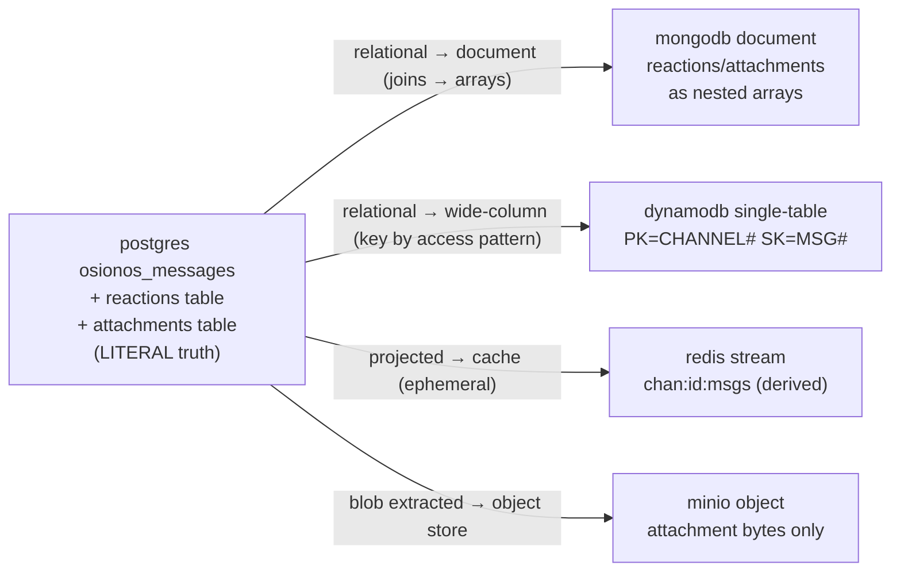
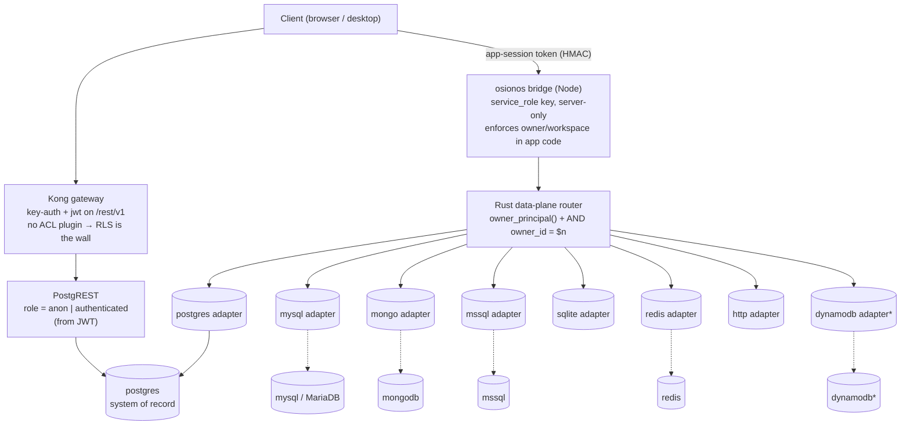

# 02 · Engine Mapping — one model, eight engines

> How the single Prismatica conceptual model is *showcased* across all eight platform engines — and the honest line between where the model **literally lives** (Postgres) and where it is **conceptually illustrated** (everything else).

**Series:** [README](./README.md) · [01 Conceptual model](./01-conceptual-data-model.md) · **02 Engine mapping** · [03 Schema source map](./03-schema-source-map.md) · [04 CRUD & trust boundary](./04-crud-and-server-trust-boundary.md) · [05 Input/output validation](./05-input-output-validation.md)

---

## TL;DR — read this before the snippets below

- **Postgres is the system of record, full stop.** The Prismatica identity / auth / social model (`users`, `sessions`, `osionos_workspaces`, `osionos_pages`, `osionos_channels`, `osionos_messages`, mail, calendar, GDPR) exists as **real, RLS-enforced relational tables only in Postgres** — verified at [`models/user.sql:2`](../../../models/user.sql) (`CREATE TABLE ... users`) and [`models/osionos-chat-migration.sql:35`](../../../models/osionos-chat-migration.sql) (`CREATE TABLE public.osionos_messages`).
- **The `users` / auth model does NOT exist in any other engine.** Do not read the snippets below as "there is a `users` table in Redis / MinIO" — there is not. The other engines play **data-plane alternative / cache / document / object-store** roles.
- The mappings shown for MySQL, MSSQL, CockroachDB, MongoDB, DynamoDB, Redis and MinIO are **faithful illustrations of how each paradigm *would* model the entity** — only the Postgres row is the live source of truth, except where a *vendor* app literally re-homed its own (non-Prismatica) tables onto an engine (noted inline).

---

## (a) The eight engines at a glance

| Engine | Paradigm | Role in the platform | Canonical for | Evidence file |
|---|---|---|---|---|
| **postgres** | Relational (SQL) | System of record; hosts gotrue (auth), PostgREST (REST surface), the RLS-enforced app schema; one of two realtime change producers | **The entire Prismatica model** — users, sessions, workspaces, pages, channels, messages, mail, calendar, GDPR | [`wiki/database-cli/postgres/README.md`](../../database-cli/postgres/README.md) |
| **mysql** | Relational (SQL, MariaDB 11.4) | Per-tenant relational alternative; home of vendor external-DB mounts (HamBooking, vite-gourmand m24 mount). Served by the Rust `mysql` adapter | — (conceptual for the Prismatica model; literal only for vendor mounts) | [`wiki/database-cli/mysql/README.md`](../../database-cli/mysql/README.md) |
| **mssql** | Relational (T-SQL, SQL Server 2022) | Per-tenant relational alternative; parity / snapshot engine. Served by the Rust `mssql` adapter | — (conceptual / showcase only) | [`wiki/database-cli/mssql/README.md`](../../database-cli/mssql/README.md) |
| **cockroachdb** | Distributed relational (Postgres-wire, v24.3.5) | Horizontal-scale relational alternative; **no dedicated adapter — driven through the `postgres` adapter** because it speaks the PG protocol. Snapshot engine | — (conceptual / showcase only) | [`wiki/database-cli/cockroachdb/README.md`](../../database-cli/cockroachdb/README.md) |
| **mongodb** | Document store (MongoDB 7.0) | Live-DB plane; second realtime change producer. Vendor apps literally home document data here (hypertube). Served by the Rust `mongo` adapter | — (conceptual for the model; literal for vendor data, e.g. hypertube) | [`wiki/database-cli/mongodb/README.md`](../../database-cli/mongodb/README.md) |
| **dynamodb** | Wide-column / key-value NoSQL (DynamoDB Local) | **Opt-in** — a Rust cargo feature OFF by default. hypertube `watch_state` is literally homed here. Served by the `dynamodb` adapter when built in | — (conceptual; literal for hypertube watch_state) | [`wiki/database-cli/dynamodb/README.md`](../../database-cli/dynamodb/README.md) |
| **redis** | In-memory data-structure store (Redis 7.2, 384 MB, volatile-lru) | Cache, rate-limiter, session/token store (`ratelimit-redis` default feature). **Not a system of record.** Served by the `redis` adapter | — (canonical for nothing — everything is reconstructable from Postgres) | [`wiki/database-cli/redis/README.md`](../../database-cli/redis/README.md) |
| **minio** | S3-compatible object/media store | Blob storage (avatars, uploads, attachments). **No query adapter** — reached via the storage-router / S3 path. Snapshot / storage engine | — (canonical for blob *bytes* only; the row + object key stay in Postgres) | [`wiki/database-cli/minio/README.md`](../../database-cli/minio/README.md) |

> The eight Rust *query* adapters are `postgres / mysql / mongo / mssql / sqlite / redis / http / dynamodb`. Note the asymmetry above: **cockroachdb** rides the `postgres` wire adapter (no adapter of its own), and **minio** has **no query adapter at all** (S3 / storage-router path).

---

## (b) The same entities, mapped to each paradigm

Three representative entities — `users` (identity), `osionos_pages` (the Notion-like tree), `osionos_messages` (chat) — shown in each storage shape. **Only the Postgres form is live truth; the rest are how the paradigm *would* express it.**

### Entity 1 — `users` (identity / auth)

**Relational — LITERAL, Postgres ([`models/user.sql:2`](../../../models/user.sql)).** Also the *only* engine that hosts auth: gotrue's `auth.users` is mirrored into `public.users`; there is **no `users` table on any other engine.**

```sql
-- postgres (literal source of truth) — models/user.sql:2
CREATE TABLE IF NOT EXISTS users (
  id            SERIAL PRIMARY KEY,          -- legacy fat schema; uuid in the grobase mirror
  username      VARCHAR(255) UNIQUE,
  email         VARCHAR(255) NOT NULL UNIQUE,
  password_hash VARCHAR(255) NOT NULL,       -- 'managed-by-gotrue' under gotrue
  theme         VARCHAR(50) DEFAULT 'light',
  created_at    TIMESTAMP DEFAULT CURRENT_TIMESTAMP
);
```

> ⚠️ **id story.** There are two reconciled definitions of `public.users`: the legacy SERIAL-integer "fat" table ([`models/user.sql:2`](../../../models/user.sql)) and the grobase UUID mirror that is 1:1 with `auth.users` ([`models/auth-gateway-users-reconcile-migration.sql`](../../../models/auth-gateway-users-reconcile-migration.sql)). The reconcile migration re-adds the legacy columns onto the UUID table `IF NOT EXISTS` so both schemas share one table name keyed by `id = auth.users.id`. See [01 Conceptual model](./01-conceptual-data-model.md) for the full reconciliation story.

**Relational alternatives (mysql / mssql / cockroachdb) — CONCEPTUAL.** Same shape, different dialect. CockroachDB is wire-compatible so the DDL is near copy-paste; MySQL/MSSQL have **no native RLS**, so owner-scoping moves into the data-plane adapter (`owner_id` predicate) rather than a policy:

```sql
-- cockroachdb (conceptual; near-identical to postgres, prefers gen_random_uuid())
CREATE TABLE users (
  id    UUID PRIMARY KEY DEFAULT gen_random_uuid(),  -- vs SERIAL
  email STRING NOT NULL UNIQUE
);  -- default isolation is SERIALIZABLE → clients must retry 40001
```

**Document / KV / object — `users` is NOT modeled here.** Redis holds *derived* session/token projections (a `session:{token}` hash with TTL), never the identity row. MinIO holds an avatar *blob*, not the user. There is deliberately no `users` collection in Mongo/Dynamo for the Prismatica model.

```redis
# redis — a SESSION projection (ephemeral, reconstructable from Postgres), NOT the user row
HSET session:sess_tok_abc user_id 7 expires_at 2026-07-01T12:00:00Z
EXPIRE session:sess_tok_abc 3600
```

---

### Entity 2 — `osionos_pages` (Notion-like block tree)

**Relational — LITERAL, Postgres ([`models/osionos-bridge-migration.sql:48`](../../../models/osionos-bridge-migration.sql)).** A self-referencing tree (`parent_page_id`) with JSONB `content` / `properties` / `collaborators`, a `surface` enum and `visibility`.

```sql
-- postgres (literal) — models/osionos-bridge-migration.sql:48
CREATE TABLE IF NOT EXISTS public.osionos_pages (
  id             uuid PRIMARY KEY DEFAULT gen_random_uuid(),
  workspace_id   uuid NOT NULL REFERENCES osionos_workspaces(id) ON DELETE CASCADE,
  parent_page_id uuid REFERENCES osionos_pages(id) ON DELETE SET NULL,  -- self-tree
  owner_id       uuid,
  title          text NOT NULL DEFAULT 'Untitled',
  surface        text CHECK (surface IS NULL OR surface IN ('page','agent','home','folder','wiki')),
  visibility     text NOT NULL DEFAULT 'private' CHECK (visibility IN ('private','shared','public')),
  content        jsonb NOT NULL DEFAULT '[]'::jsonb,   -- block array
  created_at     timestamptz NOT NULL DEFAULT now()
);
```

> A **folder** and a **wiki** are *not* separate tables — they are `osionos_pages` rows with `surface='folder'` / `surface='wiki'`. The folder/wiki migrations only widen the `osionos_pages_surface_check` CHECK ([`models/osionos-folder-surface-migration.sql`](../../../models/osionos-folder-surface-migration.sql), [`models/osionos-wiki-surface-migration.sql`](../../../models/osionos-wiki-surface-migration.sql)); neither contains a `CREATE TABLE`.

**Document (mongodb) — CONCEPTUAL.** The JSONB columns are already document-shaped, so a page collapses naturally into one document; the self-reference stays a field:

```json
// mongodb (conceptual) — collection: osionos_pages
{
  "_id": "5c1f…",
  "workspace_id": "0a4d…",
  "parent_page_id": "9b22…",
  "owner_id": "7e10…",
  "title": "Roadmap",
  "surface": "wiki",
  "visibility": "shared",
  "content": [ { "type": "heading", "text": "Q3" }, { "type": "todo", "done": false } ]
}
```

**Object (minio) — CONCEPTUAL split.** A page's *cover image* bytes would be an object; the page row in Postgres keeps only the object key:

```text
# minio (conceptual) — bytes only; canonical row stays in Postgres
bucket: media   object: pages/{workspace_id}/{page_id}/cover.jpg
# Postgres osionos_pages.cover holds the key/URL pointing here
```

---

### Entity 3 — `osionos_messages` (chat)

**Relational — LITERAL, Postgres ([`models/osionos-chat-migration.sql:35`](../../../models/osionos-chat-migration.sql)).** Reactions and attachments are **separate join tables** (`osionos_message_reactions`, `osionos_message_attachments`); a message gains threading (`thread_root_id`, `reply_count`) and full-text (`search_doc`) columns through later migrations.

```sql
-- postgres (literal) — models/osionos-chat-migration.sql:35
CREATE TABLE IF NOT EXISTS public.osionos_messages (
  id           uuid PRIMARY KEY DEFAULT gen_random_uuid(),
  channel_id   uuid NOT NULL REFERENCES osionos_channels(id) ON DELETE CASCADE,
  author_id    uuid NOT NULL,
  content      text NOT NULL DEFAULT '',
  attachments  jsonb NOT NULL DEFAULT '[]'::jsonb,
  created_at   timestamptz NOT NULL DEFAULT now(),
  deleted_at   timestamptz,                 -- soft-delete
  search_doc   tsvector                     -- GENERATED, added by message-search migration
);
-- reactions live in their OWN table: models/osionos-chat-migration.sql:46
-- attachments metadata in:        models/osionos-media-migration.sql:11
```

**Relational alternative (mysql) — CONCEPTUAL, no RLS.** Same columns, but ownership is enforced by the adapter stamping/filtering `owner_id`, not by a policy:

```sql
-- mysql / MariaDB (conceptual) — no native RLS; owner-scoping is adapter-side
CREATE TABLE osionos_messages (
  id         BIGINT PRIMARY KEY AUTO_INCREMENT,
  channel_id BIGINT,
  author_id  BIGINT,
  body       LONGTEXT,
  created_at DATETIME
);
```

**Document (mongodb) — CONCEPTUAL.** The reaction/attachment join tables fold into nested arrays on the message document:

```json
// mongodb (conceptual) — collection: osionos_messages
{
  "_id": "m_91…", "channel_id": "c_42…", "author_id": "u_07…",
  "content": "ship it 🚀",
  "reactions":   [ { "user_id": "u_08", "emoji": "🚀" } ],   // was a join table
  "attachments": [ { "type": "image", "object_key": "chat/…/x.jpg" } ],
  "created_at": "2026-06-28T10:00:00Z"
}
```

**Wide-column (dynamodb) — CONCEPTUAL, single-table.** Keyed by access pattern: partition by channel, sort by message, GSI on author. One `Query` returns a channel's whole timeline; anything cross-partition needs a GSI or a costly `Scan`:

```text
# dynamodb (conceptual) — single table, key = access pattern
PK = CHANNEL#<channel_id>     (HASH)
SK = MSG#<message_id>         (RANGE)
GSI1 = AUTHOR#<author_id>     → "all messages by user"
attrs: content, created_at, deleted_at
```

**KV (redis) — CONCEPTUAL, ephemeral projection.** A message is never *persisted* here; only a derived recent-feed projection with no durability guarantee:

```redis
# redis — a channel's recent feed as a Stream (derived; truth is Postgres)
XADD chan:c_42:msgs '*' author u_07 content "ship it"
```

**Object (minio) — CONCEPTUAL split.** A message *attachment's bytes* are an object; the canonical `osionos_message_attachments` row in Postgres ([`models/osionos-media-migration.sql:11`](../../../models/osionos-media-migration.sql)) holds the `bucket` + `object_key` (`'{sha256}.{ext}'`, MinIO bucket `chat`) that point at it:

```text
# minio — attachment bytes only
bucket: chat   object: {owner_id}/{sha256}.jpg
# Postgres osionos_message_attachments.object_key references this; sha256 is the dedup key
```

#### How one message fans out across paradigms



---

## (c) The data-plane path: client → Kong → Rust router → adapters

Browser-direct traffic reaches Postgres through Kong + PostgREST as `anon`/`authenticated` (RLS is the wall). The osionos bridge and the grobase planes hold the service role and route engine-agnostic queries through the Rust data-plane router, which dispatches to one of the query adapters.



> `*` **dynamodb** is opt-in (cargo feature OFF by default). **cockroachdb** is reached *through* the `postgres` adapter (PG-wire compatible) and so is not a separate box. **minio** is omitted from the adapter fan-out on purpose: it has **no query adapter** — media flows over the storage-router / S3 path, not the data-plane SQL adapters.

The wire surface is configured for the public schema where all Prismatica tables live: `PGRST_DB_SCHEMAS=public` ([`apps/grobase/orchestrators/compose/docker-compose.track-binocle.yml`](../../../apps/grobase/orchestrators/compose/docker-compose.track-binocle.yml)).

---

## (d) Honest callout — canonical vs conceptual

| Claim | Verdict | Why |
|---|---|---|
| Postgres hosts the live `users` / `osionos_pages` / `osionos_messages` tables | ✅ **Literal** | `CREATE TABLE` at [`models/user.sql:2`](../../../models/user.sql), [`models/osionos-bridge-migration.sql:48`](../../../models/osionos-bridge-migration.sql), [`models/osionos-chat-migration.sql:35`](../../../models/osionos-chat-migration.sql); fronted by gotrue + PostgREST |
| There is a `users` table in MySQL / MSSQL / CockroachDB | 🟡 **Conceptual** | Showcase of engine-agnostic provisioning; the *auth* model is never homed off Postgres |
| There is a `users` table / collection in Redis, MongoDB, DynamoDB, MinIO | ❌ **False — do not claim it** | Redis = ephemeral session/cache projections; Mongo/Dynamo hold *vendor* data (hypertube), not Prismatica auth; MinIO stores blobs |
| `osionos_messages` as a Mongo doc / Dynamo item / Redis stream / MinIO object | 🟡 **Conceptual illustration** | Faithful per-paradigm modeling, but only the Postgres row is the source of truth |
| MySQL/MariaDB and MongoDB hold real data today | ✅ **Literal — but vendor, not Prismatica** | HamBooking / vite-gourmand on MySQL/MariaDB; hypertube catalog/comments/profiles on Mongo and `watch_state` on DynamoDB |
| Redis is canonical for some entity | ❌ **Never** | Everything in Redis is reconstructable from Postgres by design |
| MinIO is canonical for an entity | ❌ **Only for bytes** | The blob lives in MinIO; the canonical *row* + `object_key` stay in Postgres ([`models/osionos-media-migration.sql:11`](../../../models/osionos-media-migration.sql)) |

**One-line mental model:** *Postgres is the truth; the other seven engines are how the same idea looks when you change the storage paradigm — alternative relational (mysql/mssql/cockroach), document (mongo/dynamo), cache (redis), or object store (minio) — and only Postgres enforces ownership with RLS; everywhere else it is the data-plane adapter's `owner_id` predicate.*

---

**Next:** [03 Schema source map →](./03-schema-source-map.md) — which migration file creates which table, and the authoritative apply order.
