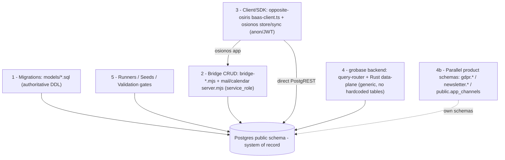
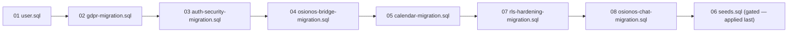

# Prismatica Schema Source Map

> The authoritative index of **every file that defines, reads, writes, seeds, or guards** the Prismatica data model — what each file touches, where the table is born, and the order it all loads.

**Series:** [README](./README.md) · [01 — Conceptual Data Model](./01-conceptual-data-model.md) · [02 — Engine Mapping](./02-engine-mapping.md) · **03 — Schema Source Map (this file)** · [04 — CRUD & Server Trust Boundary](./04-crud-and-server-trust-boundary.md) · [05 — Input/Output Validation](./05-input-output-validation.md)

> File links use repo-relative paths with line anchors (`#L<n>`), e.g. [`models/user.sql:2`](../../../models/user.sql#L2). They resolve when viewing the repo on GitHub or in an editor that follows relative links.

---

## Table of contents

1. [The five layers (overview)](#1--the-five-layers)
2. [Apply order — the migration runner](#2--apply-order--the-migration-runner)
3. [Where every table is born (reverse index)](#3--where-every-table-is-born-reverse-index)
4. [Migrations, per file (forward index)](#4--migrations-per-file-forward-index)
5. [Tables defined elsewhere (not in `models/`)](#5--tables-defined-elsewhere-not-in-models)
6. [Bridge CRUD servers (osionos)](#6--bridge-crud-servers-osionos)
7. [Mail & Calendar bridges](#7--mail--calendar-bridges)
8. [Client / SDK layer](#8--client--sdk-layer)
9. [osionos React app data layer](#9--osionos-react-app-data-layer)
10. [grobase backend services](#10--grobase-backend-services)
11. [Seeds](#11--seeds)
12. [RLS / hardening](#12--rls--hardening)
13. [Validation gates & tests](#13--validation-gates--tests)
14. [Runners & config](#14--runners--config)
15. [How to navigate](#15--how-to-navigate)

---

## 1 — The five layers

The Prismatica model lives across five layers, in dependency order. The DDL is authoritative; everything else is access to it.

| Layer | What it is | Where it lives |
|---|---|---|
| **1. Migrations** | Authoritative DDL — `CREATE TABLE`, CHECK/FK/UNIQUE, RLS policies | [`models/*.sql`](../../../models) |
| **2. Bridge CRUD** | The de-facto read/write access patterns over PostgREST/query-router, running as `service_role` | [`apps/osionos/app/scripts/bridge-*.mjs`](../../../apps/osionos/app/scripts), `apps/{mail,calendar}/bridge/server.mjs` |
| **3. Client / SDK** | Browser-side typed clients hitting the `anon`/`authenticated` REST surface | [`apps/opposite-osiris/src/lib`](../../../apps/opposite-osiris/src/lib), osionos `src/store/sync/*` |
| **4. grobase backend** | Generic query-router + Rust data-plane (no hardcoded table names), plus parallel product schemas | [`apps/grobase/src`](../../../apps/grobase/src) |
| **5. Runners / Seeds / Gates** | Migration apply order, demo seeders, verification gates | [`apps/grobase/scripts/db`](../../../apps/grobase/scripts/db), [`tools/seeds`](../../../tools/seeds), `apps/opposite-osiris/scripts/verify-*.mjs` |

---

## 2 — Apply order — the migration runner

[`apps/grobase/scripts/db/apply-project-sql.sh`](../../../apps/grobase/scripts/db/apply-project-sql.sh) is the **migration runner** and the authoritative apply order. It applies the root-app `models/*.sql` into the BaaS Postgres in numbered sequence:

> **Execution order ≠ filename order.** The runner applies `06-seeds.sql` **last**, after `07-rls-hardening` and `08-osionos-chat`, and only when the `${marker}_seeds` row is absent (`apply-project-sql.sh:69` rls-hardening, `:73` chat, `:76-82` the gated seeds block). The flowchart above is in *runtime* order; the file *numbers* (06 < 07 < 08) do not reflect it.

> **⚠ Flagged gap — confirmed in the fact base.** The runner's numbered list does **not** include [`models/mail-migration.sql`](../../../models/mail-migration.sql) nor the many osionos **surface** migrations (engagement, media, communities, social, admin, thread, reply, message-search, folder, wiki, people-directory, workspace-databases). Those are applied via a separate path (a glob or secondary runner). Treat the 8-step list as the *core* apply order, not the complete one.

Two related runners/probes:

| File | Role |
|---|---|
| [`apps/grobase/scripts/db/reset-database.mjs`](../../../apps/grobase/scripts/db/reset-database.mjs) | DB reset / re-migrate: drops/recreates and re-applies `models/*.sql` (touches `users`, `sessions`). |
| [`scripts/restore-if-empty.sh`](../../../scripts/restore-if-empty.sh) | Fail-safe snapshot restore: loads the demo snapshot only when primaries are empty; the emptiness probe checks `osionos_pages`. |
| [`apps/grobase/orchestrators/compose/docker-compose.track-binocle.yml`](../../../apps/grobase/orchestrators/compose/docker-compose.track-binocle.yml) | Sets `PGRST_DB_SCHEMAS=public` + the `anon` role — PostgREST exposes the `public` schema where **all** Prismatica tables live (the wire surface bridges/clients hit). |

---

## 3 — Where every table is born (reverse index)

Each table/view, the file and line of its `CREATE TABLE`/`CREATE VIEW`, and its domain. Every `public.*` table below is created in `models/*.sql`.

### Identity / Auth / GDPR & consent

| Table | Born at | Notes |
|---|---|---|
| `users` | [`models/user.sql:2`](../../../models/user.sql#L2) | Canonical legacy "fat" account table — `id SERIAL` (integer). GDPR soft-delete columns added in `gdpr-migration.sql`; legacy columns re-added onto the grobase uuid mirror in the reconcile migration. **See [§5 id conflict](#5--tables-defined-elsewhere-not-in-models).** |
| `user_tokens` | [`models/user.sql:25`](../../../models/user.sql#L25) | Email-verify / password-reset / magic-link tokens. `user_id INTEGER REFERENCES users(id)`. |
| `sessions` | [`models/user.sql:35`](../../../models/user.sql#L35) | Server-side (non-JWT) session records. |
| `user_activities` | [`models/user.sql:44`](../../../models/user.sql#L44) | Activity/audit log (`activity_type` + JSONB `activity_data`). |
| `auth_audit_events` | [`models/auth-security-migration.sql:9`](../../../models/auth-security-migration.sql#L9) | `BIGSERIAL` PK. `event_type` CHECK-allowlist expanded at [`:46-84`](../../../models/auth-security-migration.sql#L46). RLS denies all public SELECT; `service_role` only. |
| `user_consents` | [`models/gdpr-migration.sql:290`](../../../models/gdpr-migration.sql#L290) | Consent evidence ledger. UNIQUE `(user_id, consent_type, version)` at [`:302`](../../../models/gdpr-migration.sql#L302). |
| `gdpr_requests` | [`models/gdpr-migration.sql:305`](../../../models/gdpr-migration.sql#L305) | Data-subject request ledger; `due_at` defaults to +30 days. |
| `newsletter_optins` | [`models/gdpr-migration.sql:317`](../../../models/gdpr-migration.sql#L317) | Double-opt-in token ledger. RLS enabled but **zero policies** → locked to SECURITY DEFINER RPCs / `service_role`. |

### Workspaces / pages / bridge identities (osionos bridge schema)

| Table | Born at | Notes |
|---|---|---|
| `osionos_bridge_identities` | [`models/osionos-bridge-migration.sql:12`](../../../models/osionos-bridge-migration.sql#L12) | provider+subject → user_id + private workspace. `is_admin` added additively by [`osionos-admin-migration.sql:15`](../../../models/osionos-admin-migration.sql#L15). |
| `osionos_workspaces` | [`models/osionos-bridge-migration.sql:27`](../../../models/osionos-bridge-migration.sql#L27) | Root container; `slug UNIQUE`. `visibility` column added later by `osionos-social-migration.sql` (guarded). |
| `osionos_workspace_members` | [`models/osionos-bridge-migration.sql:38`](../../../models/osionos-bridge-migration.sql#L38) | `permissions TEXT[]` drives page RLS via `&&` overlap. |
| `osionos_pages` | [`models/osionos-bridge-migration.sql:48`](../../../models/osionos-bridge-migration.sql#L48) | Notion-like tree. `surface` CHECK widened by [`osionos-folder-surface-migration.sql:12`](../../../models/osionos-folder-surface-migration.sql#L12) ('folder') and [`osionos-wiki-surface-migration.sql:14`](../../../models/osionos-wiki-surface-migration.sql#L14) ('wiki'). |
| `osionos_page_configurations` | [`models/osionos-bridge-migration.sql:78`](../../../models/osionos-bridge-migration.sql#L78) | Per-user per-page config. `page_id` is plain TEXT (FK dropped at `:98-119`, re-typed at `:121-122`). |
| `osionos_page_action_events` | [`models/osionos-bridge-migration.sql:88`](../../../models/osionos-bridge-migration.sql#L88) | Append-only action log. `page_id` TEXT (re-typed at `:124-125`). |
| `osionos_bridge_audit_events` | [`models/osionos-bridge-migration.sql:127`](../../../models/osionos-bridge-migration.sql#L127) | Append-only audit; `service_role`-only (no authenticated grant). |
| `osionos_workspace_databases` | [`models/osionos-workspace-databases-migration.sql:19`](../../../models/osionos-workspace-databases-migration.sql#L19) | Which grobase DB mounts a workspace links to. UNIQUE `(workspace_id, db_id)`. |
| `osionos_profile_template_section_grants` | [`models/osionos-admin-migration.sql:60`](../../../models/osionos-admin-migration.sql#L60) | Per-section template write-grants; `service_role`-only. |
| `osionos_message_attachments` | [`models/osionos-media-migration.sql:11`](../../../models/osionos-media-migration.sql#L11) | Messenger media metadata (bytes in MinIO bucket `chat`). FKs to messages/channels. |

### Social / chat / communities / engagement

| Table | Born at | Notes |
|---|---|---|
| `osionos_channels` | [`models/osionos-chat-migration.sql:12`](../../../models/osionos-chat-migration.sql#L12) | `kind` CHECK widened to allow `'group'` by [`osionos-social-migration.sql:83-86`](../../../models/osionos-social-migration.sql#L83); `avatar`/`description` added at `:87-89`. |
| `osionos_channel_members` | [`models/osionos-chat-migration.sql:27`](../../../models/osionos-chat-migration.sql#L27) | Composite PK `(channel_id, user_id)`. |
| `osionos_messages` | [`models/osionos-chat-migration.sql:35`](../../../models/osionos-chat-migration.sql#L35) | Columns added incrementally — see [the messages assembly note](#osionos_messages-is-assembled-across-four-migrations). |
| `osionos_message_reactions` | [`models/osionos-chat-migration.sql:46`](../../../models/osionos-chat-migration.sql#L46) | Composite PK `(message_id, user_id, emoji)`. |
| `osionos_feed_likes` | [`models/osionos-chat-migration.sql:54`](../../../models/osionos-chat-migration.sql#L54) | `page_id` is an osionos page id, **no FK**. SELECT policy `USING (true)`. |
| `osionos_feed_comments` | [`models/osionos-chat-migration.sql:61`](../../../models/osionos-chat-migration.sql#L61) | `page_id` no FK. SELECT policy `USING (true)`. |
| `osionos_communities` | [`models/osionos-communities-migration.sql:9`](../../../models/osionos-communities-migration.sql#L9) | Discord-style channel groupings. |
| `osionos_community_channels` | [`models/osionos-communities-migration.sql:18`](../../../models/osionos-communities-migration.sql#L18) | Join table, composite PK `(community_id, channel_id)`. |
| `osionos_community_members` | [`models/osionos-communities-migration.sql:25`](../../../models/osionos-communities-migration.sql#L25) | Composite PK `(community_id, user_id)`. |
| `osionos_channel_reads` | [`models/osionos-engagement-migration.sql:11`](../../../models/osionos-engagement-migration.sql#L11) | High-water read mark; composite PK `(user_id, channel_id)`. |
| `osionos_message_mentions` | [`models/osionos-engagement-migration.sql:54`](../../../models/osionos-engagement-migration.sql#L54) | @mentions; composite PK `(message_id, user_id)`. |
| `osionos_notifications` | [`models/osionos-engagement-migration.sql:75`](../../../models/osionos-engagement-migration.sql#L75) | Per-user inbox. |
| `osionos_connections` | [`models/osionos-social-migration.sql:57`](../../../models/osionos-social-migration.sql#L57) | LinkedIn-style; generated `pair_key UNIQUE`. |
| `osionos_message_receipts` | [`models/osionos-social-migration.sql:99`](../../../models/osionos-social-migration.sql#L99) | Delivered/seen receipts; composite PK `(message_id, user_id)`. |
| `osionos_user_blocks` | [`models/osionos-social-migration.sql:113`](../../../models/osionos-social-migration.sql#L113) | Composite PK `(blocker_id, blocked_id)`. |
| `osionos_user_reports` | [`models/osionos-social-migration.sql:124`](../../../models/osionos-social-migration.sql#L124) | Abuse reports with moderation status. |
| `osionos_join_requests` | [`models/osionos-social-migration.sql:149`](../../../models/osionos-social-migration.sql#L149) | UNIQUE `(workspace_id, requester_id)`. |
| `osionos_directory` *(VIEW)* | [`models/osionos-social-migration.sql:42`](../../../models/osionos-social-migration.sql#L42) | View over `osionos_bridge_identities` filtered `directory_opt_out = false`. |
| `osionos_people_directory` *(VIEW)* | [`models/osionos-people-directory-migration.sql:45`](../../../models/osionos-people-directory-migration.sql#L45) | View joining `users` + `user_profiles` + `osionos_bridge_identities`; exposes only safe fields. |

### Mail / Calendar (BaaS mirror tables)

| Table | Born at | Notes |
|---|---|---|
| `mail_accounts` | [`models/mail-migration.sql:7`](../../../models/mail-migration.sql#L7) | Provider account identity. `no_public_access` SELECT targets `anon, authenticated`. |
| `mail_messages` | [`models/mail-migration.sql:18`](../../../models/mail-migration.sql#L18) | Message cache; GIN index on `labels`, `received_at DESC` index. |
| `calendar_accounts` | [`models/calendar-migration.sql:8`](../../../models/calendar-migration.sql#L8) | Requires `pgcrypto` (created at top of migration, line 6). `no_public_access` targets only `authenticated`. |
| `calendar_sources` | [`models/calendar-migration.sql:20`](../../../models/calendar-migration.sql#L20) | Individual calendars per account. |
| `calendar_event_cache` | [`models/calendar-migration.sql:36`](../../../models/calendar-migration.sql#L36) | Event cache; GIN index on `source_payload`, range index `(starts_at, ends_at)`. |

#### `osionos_messages` is assembled across four migrations

The single `osionos_messages` table is created once and then **altered** by three more files — none of which contains a `CREATE TABLE`:

| Migration | Adds | Line |
|---|---|---|
| `osionos-chat-migration.sql` | base table (id, channel_id, author_id, content, attachments, …, `deleted_at`) | [`:35`](../../../models/osionos-chat-migration.sql#L35) |
| `osionos-reply-migration.sql` | `reply_to_id` (uuid, FK self ON DELETE SET NULL) + index | [`:5-6`](../../../models/osionos-reply-migration.sql#L5) |
| `osionos-thread-migration.sql` | `thread_root_id` (FK self), `reply_count int` + trigger `osionos_thread_count_trg` | [`:8-10`](../../../models/osionos-thread-migration.sql#L8) |
| `osionos-message-search-migration.sql` | `search_doc tsvector` (GENERATED) + GIN index `osionos_messages_search_gin` | [`:8-10`](../../../models/osionos-message-search-migration.sql#L8) |

---

## 4 — Migrations, per file (forward index)

Every file in [`models/`](../../../models). Tables created appear in **bold**; tables only altered are plain.

| File | Kind | Tables touched | What it does |
|---|---|---|---|
| [`models/user.sql`](../../../models/user.sql) | DDL | **users, sessions, user_activities, user_tokens** | Root identity migration. The foundation all other identity migrations FK into. |
| [`models/gdpr-migration.sql`](../../../models/gdpr-migration.sql) | DDL + RLS | **gdpr_requests, newsletter_optins, user_consents**; users, sessions, user_activities, user_tokens | GDPR/consent tables; adds soft-delete columns + RLS/grants to the identity tables. Owns the `gdpr_*` SECURITY DEFINER RPCs and the `gdpr_current_user_id()` helper. |
| [`models/auth-security-migration.sql`](../../../models/auth-security-migration.sql) | DDL | **auth_audit_events**; users | Auth hardening: audit log + security columns; expands the `event_type` CHECK allowlist at `:46-84`. |
| [`models/auth-gateway-users-reconcile-migration.sql`](../../../models/auth-gateway-users-reconcile-migration.sql) | DDL (ALTER) | users, osionos_bridge_identities, user_profiles | **No CREATE TABLE for users.** ALTERs the live grobase uuid `public.users` mirror — re-adds 5 legacy columns IF NOT EXISTS; adds `user_profiles_user_id_uidx` (`:55`); installs `handle_new_user()` / `users_reconcile_email()` triggers. Bridges `auth.users` → app `users`. |
| [`models/osionos-bridge-migration.sql`](../../../models/osionos-bridge-migration.sql) | DDL + RLS | **osionos_workspaces, osionos_pages, osionos_workspace_members, osionos_page_configurations, osionos_page_action_events, osionos_bridge_identities, osionos_bridge_audit_events** | The central editor schema. Defines `auth.uid()` (`:8`), the ABAC page policies, and the `osionos_bridge_*` provisioning RPCs (service_role-only). |
| [`models/osionos-workspace-databases-migration.sql`](../../../models/osionos-workspace-databases-migration.sql) | DDL | **osionos_workspace_databases**; osionos_workspaces | Notion-style database-block mounts keyed to workspaces. |
| [`models/osionos-chat-migration.sql`](../../../models/osionos-chat-migration.sql) | DDL | **osionos_channels, osionos_messages, osionos_channel_members, osionos_message_reactions, osionos_feed_comments, osionos_feed_likes** | Chat/feed core. |
| [`models/osionos-engagement-migration.sql`](../../../models/osionos-engagement-migration.sql) | DDL | **osionos_channel_reads, osionos_message_mentions, osionos_notifications** | Engagement layer + `osionos_unread_counts()` SECDEF fn (`:35`). |
| [`models/osionos-media-migration.sql`](../../../models/osionos-media-migration.sql) | DDL | **osionos_message_attachments** | Chat media metadata. |
| [`models/osionos-communities-migration.sql`](../../../models/osionos-communities-migration.sql) | DDL | **osionos_communities, osionos_community_channels, osionos_community_members** | Communities. |
| [`models/osionos-social-migration.sql`](../../../models/osionos-social-migration.sql) | DDL + ALTER | **osionos_connections, osionos_join_requests, osionos_message_receipts, osionos_user_blocks, osionos_user_reports**, **osionos_directory** (VIEW); also widens `osionos_channels.kind`, adds `osionos_workspaces.visibility`, heavily ALTERs `osionos_bridge_identities` | Social graph + moderation. |
| [`models/osionos-admin-migration.sql`](../../../models/osionos-admin-migration.sql) | DDL + ALTER | **osionos_profile_template_section_grants**; osionos_pages, osionos_bridge_identities | Admin/profile templates; adds `is_admin`; seeds a fixed admin workspace row. |
| [`models/osionos-thread-migration.sql`](../../../models/osionos-thread-migration.sql) | ALTER | osionos_messages | Adds `thread_root_id` + `reply_count` + count trigger. |
| [`models/osionos-reply-migration.sql`](../../../models/osionos-reply-migration.sql) | ALTER | osionos_messages | Adds `reply_to_id`. |
| [`models/osionos-message-search-migration.sql`](../../../models/osionos-message-search-migration.sql) | ALTER | osionos_messages | Adds `search_doc` tsvector + GIN index. |
| [`models/osionos-folder-surface-migration.sql`](../../../models/osionos-folder-surface-migration.sql) | ALTER | osionos_pages | Widens `surface` CHECK to allow `'folder'` (no new table). |
| [`models/osionos-wiki-surface-migration.sql`](../../../models/osionos-wiki-surface-migration.sql) | ALTER | osionos_pages | Widens `surface` CHECK to allow `'wiki'` (no new table). |
| [`models/osionos-people-directory-migration.sql`](../../../models/osionos-people-directory-migration.sql) | VIEW | **osionos_people_directory** (VIEW) | Authoritative People directory view (safe fields only). |
| [`models/calendar-migration.sql`](../../../models/calendar-migration.sql) | DDL + RLS | **calendar_accounts, calendar_sources, calendar_event_cache** | Calendar app schema (Google OAuth + event cache). Creates `pgcrypto`. |
| [`models/mail-migration.sql`](../../../models/mail-migration.sql) | DDL + RLS | **mail_accounts, mail_messages** | Mail app schema. Header notes it was modeled on calendar but **added** the `service_role` policies calendar "originally missed." |
| [`models/rls-hardening-migration.sql`](../../../models/rls-hardening-migration.sql) | RLS | users + osionos bridge tables + GDPR tables + internal tables | The single authoritative RLS-hardening pass — see [§12](#12--rls--hardening). |
| [`models/seeds.sql`](../../../models/seeds.sql) | seed | (inserts into users, user_tokens, sessions, user_activities) | Baseline demo rows; loaded as `06-seeds.sql`. Creates one `CREATE TEMP TABLE seed_constants` (`:4`, dropped at `:139`). No base-table DDL. |

> **Surface and folder/wiki "tables" do not exist.** A folder is an `osionos_pages` row with `surface='folder'`; a wiki is `surface='wiki'`. The two surface migrations only DROP+ADD the `osionos_pages_surface_check` constraint — neither contains a `CREATE TABLE`.

---

## 5 — Tables defined elsewhere (not in `models/`)

These names appear in policies, joins, FKs, or triggers but are **not created** in any `models/*.sql`:

| Name | Where it really lives | How it shows up here |
|---|---|---|
| `auth.users` | gotrue (Supabase) `auth` schema — never created in these files | Only **read**: backfill `SELECT … FROM auth.users` ([`auth-gateway-users-reconcile-migration.sql:148,156`](../../../models/auth-gateway-users-reconcile-migration.sql#L148)); `handle_new_user` trigger fires on it. |
| `public.user_profiles` | Canonical `CREATE TABLE` is in the grobase nested repo (`apps/grobase/…`) | Referenced only: unique index added at [`auth-gateway-users-reconcile-migration.sql:55`](../../../models/auth-gateway-users-reconcile-migration.sql#L55); joined by `osionos_people_directory`; `handle_new_user` inserts into it. |
| `gdpr.user_consent`, `gdpr.data_deletion_request` | grobase **parallel** product schema | grobase Nest/Go GDPR services — **not** the root-app `public.user_consents`/`gdpr_requests`. |
| `newsletter.subscriber`, `newsletter.send_log` | grobase **parallel** product schema | grobase Nest/Go newsletter services — **not** `public.newsletter_optins`. |
| `public.app_channels` | grobase control-plane tenancy | `appchannels` Go service — adjacent to but separate from the osionos model. |
| grobase ABAC tables (`roles`, `user_roles`, `resource_policies`) | grobase control plane | The bridge upsert RPC seeds an `osionos_owner` role/policy *if those tables exist*. |

### ⚠ The critical `users` id story — integer vs uuid

There are **two conflicting definitions of `public.users`** keyed by one name:

1. [`models/user.sql:2`](../../../models/user.sql#L2) defines the **legacy "fat"** table with `id SERIAL` (**integer**). Every identity-domain FK (`user_tokens`, `sessions`, `user_activities`, `auth_audit_events`, `user_consents`, `gdpr_requests`, `newsletter_optins`) uses `user_id INTEGER REFERENCES users(id)`, and `gdpr_current_user_id()` returns **INTEGER**, resolving the row by email from the JWT.
2. [`models/auth-gateway-users-reconcile-migration.sql`](../../../models/auth-gateway-users-reconcile-migration.sql) does **not** create `users` — it ALTERs the live grobase deployment where `public.users.id` is a **uuid** equal to `auth.users.id` (the thin profile mirror). It re-adds the 5 legacy columns IF NOT EXISTS so the pull-only opposite-osiris auth-gateway (coded against the fat schema) stops 400-ing on `column users.username does not exist`.

So in a fresh grobase stack, `users.id` is a uuid; in the standalone legacy schema it is an integer. This reconciliation is why the same table name is shared, keyed by `id = auth.users.id`, so osionos RLS stays valid.

---

## 6 — Bridge CRUD servers (osionos)

The osionos persistence layer. These Node servers hold the `service_role` key and are the **de-facto CRUD access patterns** for the `osionos_*` tables over PostgREST / query-router. They live in [`apps/osionos/app/scripts/`](../../../apps/osionos/app/scripts).

| File | Tables touched | What it does |
|---|---|---|
| [`bridge-api.mjs`](../../../apps/osionos/app/scripts/bridge-api.mjs) | osionos_workspaces, osionos_pages, osionos_workspace_members, osionos_workspace_databases, osionos_page_configurations, osionos_page_action_events, osionos_bridge_identities, users, sessions | **Router/entrypoint.** Mounts all `bridge-*` modules; exposes `osionos_describe_app` + page CRUD RPCs, identity upsert, workspace list/upsert. |
| [`bridge-chat.mjs`](../../../apps/osionos/app/scripts/bridge-chat.mjs) | osionos_channels, osionos_messages, osionos_channel_members, osionos_channel_reads, osionos_message_reactions, osionos_message_receipts, osionos_message_mentions, osionos_message_attachments, osionos_user_blocks, osionos_workspace_members, osionos_bridge_identities, users | Chat CRUD: channels, messages, membership, reads/receipts, reactions, mentions, attachments, block enforcement; computes `osionos_unread_counts`. |
| [`bridge-chat-media.mjs`](../../../apps/osionos/app/scripts/bridge-chat-media.mjs) | osionos_message_attachments | Chat media CRUD: upload/list attachments. |
| [`bridge-chat-search.mjs`](../../../apps/osionos/app/scripts/bridge-chat-search.mjs) | osionos_channels, osionos_messages | Chat full-text search. |
| [`bridge-chat-threads.mjs`](../../../apps/osionos/app/scripts/bridge-chat-threads.mjs) | osionos_messages, osionos_message_reactions, osionos_message_mentions, osionos_message_attachments | Thread/reply CRUD over messages + child tables. |
| [`bridge-collab.mjs`](../../../apps/osionos/app/scripts/bridge-collab.mjs) | osionos_workspaces, osionos_workspace_members, osionos_pages, osionos_join_requests | Collaboration: membership, page sharing, join requests. |
| [`bridge-communities.mjs`](../../../apps/osionos/app/scripts/bridge-communities.mjs) | osionos_communities, osionos_community_channels, osionos_community_members, osionos_channels | Communities CRUD. |
| [`bridge-feed.mjs`](../../../apps/osionos/app/scripts/bridge-feed.mjs) | osionos_feed_comments, osionos_feed_likes, osionos_pages | Social feed CRUD: comments + likes. |
| [`bridge-graph-data.mjs`](../../../apps/osionos/app/scripts/bridge-graph-data.mjs) | osionos_workspace_databases | Workspace-database records for the graph explorer (record-limited reads). |
| [`bridge-graph.mjs`](../../../apps/osionos/app/scripts/bridge-graph.mjs) | osionos_pages | Builds the page-graph (backlinks/relations). |
| [`bridge-notify.mjs`](../../../apps/osionos/app/scripts/bridge-notify.mjs) | osionos_notifications, osionos_bridge_identities | Notifications CRUD; resolves recipients via identities. |
| [`bridge-profile.mjs`](../../../apps/osionos/app/scripts/bridge-profile.mjs) | osionos_bridge_identities, osionos_people_directory, osionos_workspace_members, users | Profile CRUD + people directory; embedder integration for search. |
| [`bridge-records.mjs`](../../../apps/osionos/app/scripts/bridge-records.mjs) | osionos_pages | Generic page-record CRUD. |
| [`bridge-rtc.mjs`](../../../apps/osionos/app/scripts/bridge-rtc.mjs) | osionos_channels, osionos_workspace_members | WebRTC/LiveKit room-token issuance gated on channel membership. |
| [`bridge-social-core.mjs`](../../../apps/osionos/app/scripts/bridge-social-core.mjs) | osionos_connections, osionos_user_blocks, osionos_notifications, osionos_people_directory, osionos_workspace_members, osionos_bridge_identities | Shared social-graph helpers (connections, blocks, directory) + the `rest()` service-key fetch + sanitization primitives. |
| [`bridge-social.mjs`](../../../apps/osionos/app/scripts/bridge-social.mjs) | osionos_connections, osionos_user_blocks, osionos_user_reports, osionos_people_directory, users | Social CRUD endpoints: connect/block/report; directory listing. |
| [`bridge-agent.mjs`](../../../apps/osionos/app/scripts/bridge-agent.mjs) | osionos_pages, osionos_workspaces, osionos_workspace_members | AI-agent bridge: reads/writes pages within a workspace on behalf of the model. |

**`bridge-api.mjs` internal anchors** (load-bearing for navigation; trust-boundary mechanics are covered in [04 — CRUD & Server Trust Boundary](./04-crud-and-server-trust-boundary.md)):

| Anchor | Line | Role |
|---|---|---|
| `config.serviceKey` / `publicApiKey` | [`:155-156`](../../../apps/osionos/app/scripts/bridge-api.mjs#L155) | Service-role key read from env, never shipped to the browser. |
| `verifyAppSessionToken` | [`:394-438`](../../../apps/osionos/app/scripts/bridge-api.mjs#L394) | HMAC-verifies the `osionos_v1.` session token; `userId` from signed `sub`. |
| `baasRest` | [`:453-467`](../../../apps/osionos/app/scripts/bridge-api.mjs#L453) | Stamps the service-role key as `apikey` + `Bearer` on every PostgREST call. |
| owner-stamping (`pageCreateRowFromPayload`) | [`:662-682`](../../../apps/osionos/app/scripts/bridge-api.mjs#L662) | `owner_id = authContext.userId` — never from the request body. |
| `requireWorkspaceAccess` | [`:761-792`](../../../apps/osionos/app/scripts/bridge-api.mjs#L761) | Workspace membership/permission gate before any mutation. |

> **Write-only sinks.** `osionos_bridge_audit_events` and `osionos_page_action_events` have no dedicated bridge module — they are written inside `bridge-api` via RPC/triggers. Bridge modules with **no** data-model tables (`bridge-connector`/`oauth`/`perms`/`ratelimit`/`storage-core`) are excluded as not part of the schema map.

---

## 7 — Mail & Calendar bridges

These apps run their own bridge servers (Google OAuth + sync over PostgREST), separate from the osionos bridge.

| File | Tables touched | What it does |
|---|---|---|
| [`apps/mail/bridge/server.mjs`](../../../apps/mail/bridge/server.mjs) | mail_accounts, mail_messages | Google OAuth + sync into the mail mirror; list/detail endpoints. |
| [`apps/calendar/bridge/server.mjs`](../../../apps/calendar/bridge/server.mjs) | calendar_accounts, calendar_sources, calendar_event_cache | Google OAuth, source management, event-cache sync. |

---

## 8 — Client / SDK layer

Browser-side / dev-server access to the `public` schema via the `anon` + GoTrue-JWT REST surface.

| File | Tables touched | What it does |
|---|---|---|
| [`apps/opposite-osiris/src/lib/baas-client.ts`](../../../apps/opposite-osiris/src/lib/baas-client.ts) | users | The primary Prismatica client SDK (PostgREST `.from()` + GoTrue). `fetchSeededUsers` reads `public.users`. Constructed with the **anon key only** + optional per-user access token; `persistSession:false`. |
| [`apps/opposite-osiris/src/lib/baas-config.ts`](../../../apps/opposite-osiris/src/lib/baas-config.ts) | — | BaaS endpoint/key config (Kong/PostgREST/GoTrue URLs, anon key). Exposes only `PUBLIC_BAAS_URL` + `PUBLIC_BAAS_ANON_KEY`. |
| [`apps/opposite-osiris/src/lib/auth-config.ts`](../../../apps/opposite-osiris/src/lib/auth-config.ts) | — | Session/cookie/gateway settings for the auth flow. |
| [`apps/opposite-osiris/scripts/auth-gateway.mjs`](../../../apps/opposite-osiris/scripts/auth-gateway.mjs) | users, sessions | opposite-osiris auth-gateway dev server: session/identity handling. |

> **Dead code note.** The osionos React app's `src/shared/api/baas-client.ts` is inactive (`VITE_BAAS_ENABLED=false`). The active read-side client is `opposite-osiris/src/lib/baas-client.ts`; the osionos app reaches data through the **bridge**, not directly.

---

## 9 — osionos React app data layer

The osionos editor consumes `osionos_pages` / `osionos_workspace_databases` / `osionos_workspace_members` **through the bridge** (not direct DB). A representative set (more UI files merely render these):

| File | Tables touched | What it does |
|---|---|---|
| [`src/store/sync/hydratePages.ts`](../../../apps/osionos/app/src/store/sync/hydratePages.ts) | osionos_pages | Hydrates the local page store from `osionos_pages`. |
| [`src/store/sync/pageOutbox.ts`](../../../apps/osionos/app/src/store/sync/pageOutbox.ts) | osionos_pages | Flushes local page edits to `osionos_pages`. |
| [`src/store/sync/usePageSync.ts`](../../../apps/osionos/app/src/store/sync/usePageSync.ts) | osionos_pages | Page-sync hook coordinating hydrate/outbox. |
| [`src/entities/page/model/types.ts`](../../../apps/osionos/app/src/entities/page/model/types.ts) | osionos_pages | TypeScript types mirroring the `osionos_pages` row shape. |
| [`src/features/second-brain/baas/pageGraphSource.ts`](../../../apps/osionos/app/src/features/second-brain/baas/pageGraphSource.ts) | osionos_pages | Page-graph data source (relations from the bridge). |
| [`src/widgets/database-view/model/workspaceDatabaseState.ts`](../../../apps/osionos/app/src/widgets/database-view/model/workspaceDatabaseState.ts) | osionos_workspace_databases | State for workspace-database views. |
| [`src/widgets/database-view/model/allDataSources.ts`](../../../apps/osionos/app/src/widgets/database-view/model/allDataSources.ts) | osionos_workspace_databases | Registry of workspace-database data sources. |
| [`src/features/settings/people/groupsSource.ts`](../../../apps/osionos/app/src/features/settings/people/groupsSource.ts) | osionos_workspace_members | Groups/people data source over membership. |
| [`src/features/settings/people/guestsSource.ts`](../../../apps/osionos/app/src/features/settings/people/guestsSource.ts) | osionos_workspace_members | Guests data source over membership. |

*(All paths above are under `apps/osionos/app/`.)*

---

## 10 — grobase backend services

**Critical distinction.** The grobase data plane is **generic** — it hardcodes no Prismatica table names. Separately, grobase ships its own product features on **different schemas** (`gdpr.*`, `newsletter.*`, `public.app_channels`) that are *not* the root-app `public.*` tables.

### Generic (executes whatever query it is given)

| File | Touches | What it does |
|---|---|---|
| [`apps/grobase/src/apps/query-router/src/query/schema.service.ts`](../../../apps/grobase/src/apps/query-router/src/query/schema.service.ts) | (none hardcoded) | `information_schema` introspection + describe; serves any `public` table incl. all Prismatica tables. |
| [`apps/grobase/src/apps/query-router/src/graph/graph.types.ts`](../../../apps/grobase/src/apps/query-router/src/graph/graph.types.ts) | osionos_pages, osionos_workspace_databases *(comments only)* | Type contract kept in lockstep with the osionos client graph model. No SQL. |
| [`apps/grobase/src/data-plane-router`](../../../apps/grobase/src/data-plane-router) | (none hardcoded) | Rust data-plane (crates: core/server/pool): generic query execution + pooling. |

### Parallel product schemas (NOT the root-app tables)

| File | Schema | What it does |
|---|---|---|
| [`apps/grobase/src/apps/gdpr-service/src/consent/consent.service.ts`](../../../apps/grobase/src/apps/gdpr-service/src/consent/consent.service.ts) | `gdpr.user_consent` | Nest GDPR consent service (own schema, auto-created via adminQuery). |
| [`apps/grobase/src/apps/newsletter-service/src/subscription/subscription.service.ts`](../../../apps/grobase/src/apps/newsletter-service/src/subscription/subscription.service.ts) | `newsletter.subscriber` | Nest newsletter subscribe/confirm. |
| [`apps/grobase/src/apps/newsletter-service/src/campaign/campaign.service.ts`](../../../apps/grobase/src/apps/newsletter-service/src/campaign/campaign.service.ts) | `newsletter.subscriber`, `newsletter.send_log` | Nest campaign send + send-log. |
| [`apps/grobase/src/control-plane/internal/orchestrator/gdprsvc/store_consent.go`](../../../apps/grobase/src/control-plane/internal/orchestrator/gdprsvc/store_consent.go) | `gdpr.user_consent` | Go control-plane consent store. |
| [`apps/grobase/src/control-plane/internal/orchestrator/gdprsvc/store.go`](../../../apps/grobase/src/control-plane/internal/orchestrator/gdprsvc/store.go) | `gdpr.data_deletion_request` | Go deletion-request CRUD + `pg_policies` RLS checks. |
| [`apps/grobase/src/control-plane/internal/orchestrator/newslettersvc/store_queries.go`](../../../apps/grobase/src/control-plane/internal/orchestrator/newslettersvc/store_queries.go) | `newsletter.subscriber`, `newsletter.send_log` | Go newsletter query definitions. |
| [`apps/grobase/src/control-plane/internal/orchestrator/newslettersvc/store.go`](../../../apps/grobase/src/control-plane/internal/orchestrator/newslettersvc/store.go) | `newsletter.subscriber`, `newsletter.send_log` | Go newsletter store implementation. |
| [`apps/grobase/src/control-plane/internal/appchannels/service.go`](../../../apps/grobase/src/control-plane/internal/appchannels/service.go) | `public.app_channels` | Tenant app-channel mounts (tenancy, separate from osionos). |
| [`apps/grobase/src/control-plane/internal/appchannels/models.go`](../../../apps/grobase/src/control-plane/internal/appchannels/models.go) | `public.app_channels` | Models for the app-channels service. |

---

## 11 — Seeds

Demo data inserted into pre-existing tables (seeders define no base-table DDL).

### Baseline SQL

| File | Tables touched | What it does |
|---|---|---|
| [`models/seeds.sql`](../../../models/seeds.sql) | users, user_tokens, sessions, user_activities | 10 demo users + tokens/sessions/activities, loaded as `06-seeds.sql`. |

### Python seeders ([`tools/seeds/`](../../../tools/seeds))

| File | Tables touched | What it does |
|---|---|---|
| [`tools/seeds/seed_agency.py`](../../../tools/seeds/seed_agency.py) | (orchestrator) | Agency-sim seeder: orchestrates people/workspace/content for the 20-employee org. |
| [`tools/seeds/seed_arch.py`](../../../tools/seeds/seed_arch.py) | users, sessions, osionos_pages | Architecture-demo seeder. |
| [`tools/seeds/seed_content.py`](../../../tools/seeds/seed_content.py) | osionos_pages | Generic page-content seeder. |
| [`tools/seeds/seed_wiki.py`](../../../tools/seeds/seed_wiki.py) | osionos_pages | Wiki content seeder. |
| [`tools/seeds/seed_wiki_content.py`](../../../tools/seeds/seed_wiki_content.py) | osionos_pages, sessions | Wiki-content seeder (pages + session context). |
| [`tools/seeds/seed_academy.py`](../../../tools/seeds/seed_academy.py) | osionos_pages | Academy-demo page seeder. |
| [`tools/seeds/seed_agency_wiki.py`](../../../tools/seeds/seed_agency_wiki.py) | osionos_pages, osionos_channels, osionos_channel_members, osionos_messages, osionos_message_reactions, osionos_feed_comments, osionos_feed_likes, users, sessions | Agency wiki + full chat/feed graph. |
| [`tools/seeds/seed_delivery_wiki.py`](../../../tools/seeds/seed_delivery_wiki.py) | osionos_pages | Delivery-team wiki seeder. |
| [`tools/seeds/seed_gallery_media.py`](../../../tools/seeds/seed_gallery_media.py) | osionos_pages | Gallery media seeder (cover/media blocks). |
| [`tools/seeds/seed_gourmand_content.py`](../../../tools/seeds/seed_gourmand_content.py) | osionos_pages, osionos_channels, osionos_channel_members, osionos_messages | Vite & Gourmand content + chat. |

### Shell provisioners & SQL seeds

| File | Tables touched | What it does |
|---|---|---|
| [`tools/seeds/seed_agency_people.sh`](../../../tools/seeds/seed_agency_people.sh) | users, osionos_workspaces, osionos_workspace_members | Agency people via `osionos_bridge_upsert_workspace` RPC. |
| [`tools/seeds/seed_gourmand_people.sh`](../../../tools/seeds/seed_gourmand_people.sh) | users, osionos_workspaces, osionos_workspace_members | Gourmand staff via bridge upsert RPC. |
| [`tools/seeds/seed_agency_chat.sql`](../../../tools/seeds/seed_agency_chat.sql) | osionos_channels, osionos_channel_members, osionos_messages, osionos_message_reactions, osionos_feed_comments, osionos_feed_likes | Agency chat/feed graph. |
| [`tools/seeds/backfill_covers.sql`](../../../tools/seeds/backfill_covers.sql) | osionos_pages | Backfill page cover images. |
| [`tools/seeds/seed_academy.sql`](../../../tools/seeds/seed_academy.sql) | osionos_pages | Academy page seed. |
| [`tools/seeds/seed_agency_wiki.sql`](../../../tools/seeds/seed_agency_wiki.sql) | osionos_pages | Agency wiki page seed. |
| [`tools/seeds/seed_arch.sql`](../../../tools/seeds/seed_arch.sql) | osionos_pages | Architecture page seed. |
| [`tools/seeds/seed_content.sql`](../../../tools/seeds/seed_content.sql) | osionos_pages | Generic content page seed. |
| [`tools/seeds/seed_gallery_media.sql`](../../../tools/seeds/seed_gallery_media.sql) | osionos_pages | Gallery media page seed. |

### grobase live-demo seeders ([`apps/grobase/scripts/seed/`](../../../apps/grobase/scripts/seed))

| File | Tables touched | What it does |
|---|---|---|
| [`analytics-dashboards.py`](../../../apps/grobase/scripts/seed/analytics-dashboards.py) | osionos_pages | Analytics dashboard pages. |
| [`live-demo-pages.py`](../../../apps/grobase/scripts/seed/live-demo-pages.py) | osionos_pages | Live-demo pages. |
| [`osionos-collaborators.sh`](../../../apps/grobase/scripts/seed/osionos-collaborators.sh) | users, osionos_workspaces, osionos_workspace_members, osionos_workspace_databases | Collaborator users + membership/databases. |
| [`seed-live-demo.sh`](../../../apps/grobase/scripts/seed/seed-live-demo.sh) | users, osionos_workspaces, osionos_workspace_members, osionos_pages | Top-level live-demo orchestrator (pg+mysql+mongo). |
| [`osionos-extra-engines.sh`](../../../apps/grobase/scripts/seed/osionos-extra-engines.sh) | osionos_workspace_databases | Workspace databases across extra data-plane engines. |
| [`tools/seeds/seed_agency.py`](../../../tools/seeds/seed_agency.py) *(also above)* | orchestrator | Full agency-sim foundation. |

---

## 12 — RLS / hardening

[`models/rls-hardening-migration.sql`](../../../models/rls-hardening-migration.sql) is the **single authoritative RLS-policy pass** over all root-app tables. It is idempotent (every block guarded by `IF to_regclass(...) IS NOT NULL`), safe to re-run on every startup, and runs after the base schema + inline column grants. Its mental model (header): the Kong anon apikey is public by design and there is **no Kong ACL plugin on `/rest/v1`**, so Postgres RLS + grants are the **only** data wall.

| Finding | Lines | What it does |
|---|---|---|
| F1/F2 | [`:27-68`](../../../models/rls-hardening-migration.sql#L27) | `REVOKE EXECUTE … FROM PUBLIC` on sensitive SECDEF functions (a plain `REVOKE FROM anon` would not strip the inherited PUBLIC grant), then per-function re-grants per role. |
| F3/F4 | [`:73-86`](../../../models/rls-hardening-migration.sql#L73) | Internal tables `schema_registry` + `track_binocle_runtime_migrations` → REVOKE anon/authenticated, ENABLE + FORCE RLS, `service_role`-only policy. |
| F7 default privileges | [`:92-93`](../../../models/rls-hardening-migration.sql#L92) | `ALTER DEFAULT PRIVILEGES … REVOKE` so future tables are not auto-opened. |
| F7 grant hygiene | [`:99-126`](../../../models/rls-hardening-migration.sql#L99) | Revoke anon entirely; re-grant `authenticated` only the verbs each table's policies use. |
| F6 | [`:131-150`](../../../models/rls-hardening-migration.sql#L131) | `tenant_databases` scoped per row on `tenant_id = current_tenant_id()` (only if the table + `current_tenant_id()` exist). |
| F5 | [`:156-162`](../../../models/rls-hardening-migration.sql#L156) | `users`: `REVOKE SELECT FROM anon`, then column-scoped `GRANT SELECT (id, username, avatar_url, is_email_verified) TO anon` — caps anon enumeration to non-PII. |
| FORCE RLS | [`:169-183`](../../../models/rls-hardening-migration.sql#L169) | `ALTER TABLE … FORCE ROW LEVEL SECURITY` on every policy-protected table (so even owners are bound). **Note:** `mail_accounts`/`mail_messages` are *not* in the FORCE list — their migration only ENABLEs RLS. |

> **Where RLS is born vs. hardened.** Most table policies are created in their own migrations (`gdpr-migration.sql:780-837`, `osionos-bridge-migration.sql`, the chat/social/mail/calendar files). `rls-hardening-migration.sql` is the *defense-in-depth* pass that FORCEs RLS and tightens grants on top of them. The full policy table per entity and the trust model is in [04 — CRUD & Server Trust Boundary](./04-crud-and-server-trust-boundary.md) and [05 — Input/Output Validation](./05-input-output-validation.md).

---

## 13 — Validation gates & tests

### Schema / seed / security gates ([`apps/opposite-osiris/scripts/`](../../../apps/opposite-osiris/scripts))

| File | Tables touched | What it asserts |
|---|---|---|
| [`verify-schema.mjs`](../../../apps/opposite-osiris/scripts/verify-schema.mjs) | users | Probes PostgREST `from('users')` — confirms the `public` schema is reachable/shaped; **negative leak assert**: selecting `password_hash` must return 0 rows. |
| [`verify-seeds.mjs`](../../../apps/opposite-osiris/scripts/verify-seeds.mjs) | users | Confirms seeded users exist via PostgREST. |
| [`verify-newsletter-flow.mjs`](../../../apps/opposite-osiris/scripts/verify-newsletter-flow.mjs) | users | End-to-end newsletter subscribe/confirm. |
| [`scripts/security/06-sensitive-data.mjs`](../../../apps/opposite-osiris/scripts/security/06-sensitive-data.mjs) | users, sessions, user_tokens | Asserts sensitive columns are not leaked via the public API. |
| [`scripts/security/09-gdpr.mjs`](../../../apps/opposite-osiris/scripts/security/09-gdpr.mjs) | user_consents, user_activities, users | Validates consent/activity records + erasure behavior. |

### grobase milestone gates ([`apps/grobase/scripts/verify/`](../../../apps/grobase/scripts/verify))

| File | Tables touched | What it asserts |
|---|---|---|
| [`m23-agency-foundation.sh`](../../../apps/grobase/scripts/verify/m23-agency-foundation.sh) | users, osionos_workspace_members, osionos_bridge_identities | People/workspace membership seeded correctly. |
| [`m23-agency-platform.sh`](../../../apps/grobase/scripts/verify/m23-agency-platform.sh) | osionos_channels, osionos_feed_comments, sessions | Chat/feed surfaces for the agency sim. |
| [`m24-gourmand.sh`](../../../apps/grobase/scripts/verify/m24-gourmand.sh) | osionos_pages, osionos_channels, osionos_workspace_members | Content/membership for the restaurant sim. |
| [`m174-osionos-multiengine.sh`](../../../apps/grobase/scripts/verify/m174-osionos-multiengine.sh) | osionos_workspace_databases | Workspace databases across multiple data-plane engines. |
| [`m174-osionos-extra-engines.sh`](../../../apps/grobase/scripts/verify/m174-osionos-extra-engines.sh) | osionos_workspace_databases | Extra-engine workspace-database mounts. |

### Bridge tests ([`apps/osionos/app`](../../../apps/osionos/app))

| File | Tables touched | What it does |
|---|---|---|
| [`scripts/bridge-rtc.test.mjs`](../../../apps/osionos/app/scripts/bridge-rtc.test.mjs) | osionos_workspace_members | Unit test: membership-gated RTC token issuance. |
| [`tests/bridge/bridge-api.test.mjs`](../../../apps/osionos/app/tests/bridge/bridge-api.test.mjs) | osionos_pages, osionos_workspaces | Bridge API integration: page/workspace RPC behavior. |
| [`tests/bridge/collab-rtc.test.mjs`](../../../apps/osionos/app/tests/bridge/collab-rtc.test.mjs) | osionos_workspace_members, osionos_channels | Collab + RTC integration over membership/channels. |

---

## 14 — Runners & config

| File | Role |
|---|---|
| [`apps/grobase/scripts/db/apply-project-sql.sh`](../../../apps/grobase/scripts/db/apply-project-sql.sh) | Migration runner — authoritative apply order ([§2](#2--apply-order--the-migration-runner)). |
| [`apps/grobase/scripts/db/reset-database.mjs`](../../../apps/grobase/scripts/db/reset-database.mjs) | DB reset / re-migrate. |
| [`scripts/restore-if-empty.sh`](../../../scripts/restore-if-empty.sh) | Fail-safe snapshot restore (emptiness probe = `osionos_pages`). |
| [`apps/grobase/orchestrators/compose/docker-compose.track-binocle.yml`](../../../apps/grobase/orchestrators/compose/docker-compose.track-binocle.yml) | `PGRST_DB_SCHEMAS=public` + `anon` role — the PostgREST wire surface. |

---

## 15 — How to navigate

**"Where is table X created?"** → Start at [§3 reverse index](#3--where-every-table-is-born-reverse-index). Every `public.*` table maps to one `models/*.sql:LINE`. If a column was added later, the per-column note (or [§4 forward index](#4--migrations-per-file-forward-index)) names the ALTER migration.

**"What writes table X?"** → Bridge servers in [§6](#6--bridge-crud-servers-osionos) (osionos) or [§7](#7--mail--calendar-bridges) (mail/calendar) hold the `service_role` key and own all writes. Seeders in [§11](#11--seeds) write demo rows. The browser never writes directly except through the `anon`/`authenticated` REST surface in [§8](#8--client--sdk-layer).

**"Is X in the root-app schema or grobase's own?"** → If the table is `gdpr.*`, `newsletter.*`, or `public.app_channels`, it is a **parallel** grobase product schema ([§5](#5--tables-defined-elsewhere-not-in-models) + [§10](#10--grobase-backend-services)), *not* the root-app `public.*` model. `auth.users` and `public.user_profiles` are created in gotrue / the grobase nested repo, not in `models/`.

**"Why does `users.id` look different in two places?"** → The integer-vs-uuid reconciliation in [§5](#5--the-critical-users-id-story--integer-vs-uuid). `user.sql` = legacy integer fat table; the reconcile migration ALTERs the grobase uuid mirror.

**"Who guards the data?"** → RLS is the only wall on the `anon`/`authenticated` path ([§12](#12--rls--hardening)); on the bridge path RLS is bypassed (service_role) and the bridge re-implements the checks in app code. The full enforcement model is in [04 — CRUD & Server Trust Boundary](./04-crud-and-server-trust-boundary.md) and [05 — Input/Output Validation](./05-input-output-validation.md).

**Caveat to trust.** The apply-order list in [§2](#2--apply-order--the-migration-runner) is the *core* sequence; `mail-migration.sql` and the osionos surface migrations load via a separate path. Confirm the actual runner output before assuming a migration ran.
