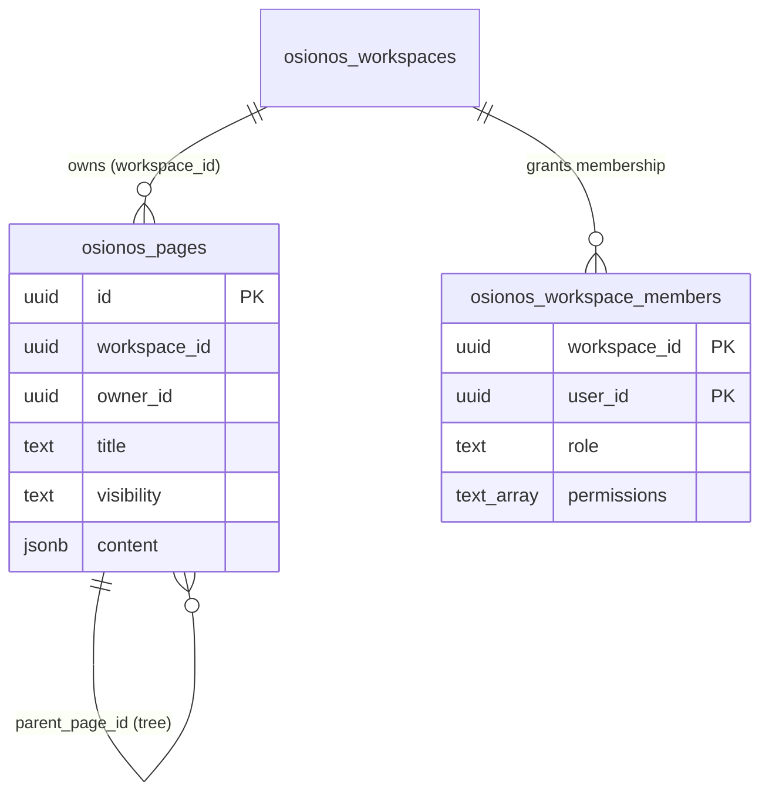
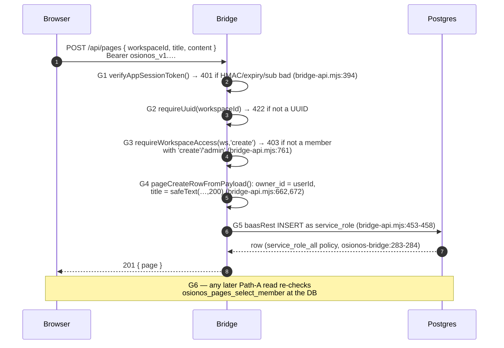

# CRUD and the Server Trust Boundary

> How every read and write in Prismatica is constrained so the data wall holds whether the attacker drives the **client** (a forged token, a leaked anon key, a tampered request body) or reaches the **server** path (the bridge that holds the service-role key). The answer is layered: Postgres Row-Level Security is the floor, the bridge re-implements the same checks in app code because it bypasses RLS, and the data plane stamps the owner a third time.

Series: [README](./README.md) · [01 Conceptual model](./01-conceptual-data-model.md) · [02 Engine mapping](./02-engine-mapping.md) · [03 Schema source map](./03-schema-source-map.md) · **04 CRUD & trust boundary** · [05 Input/output validation](./05-input-output-validation.md)

---

## The one sentence to internalize

The threat model is stated in the hardening migration itself: **the Kong anon apikey is public by design, and there is deliberately no Kong ACL plugin on `/rest/v1`, so Postgres RLS + grants are the only data wall** (`models/rls-hardening-migration.sql` header; route config at `apps/grobase/infra/docker/services/kong/conf/kong.yml:179-196`). Everything below exists to make that wall hold from both sides.

There are **two enforcement paths** to the same tables:

| Path | Who talks | DB role | What enforces ownership |
|------|-----------|---------|--------------------------|
| **A — Browser-direct** | opposite-osiris / osionos realtime → Kong → PostgREST | `anon` or `authenticated` | RLS `USING` / `WITH CHECK` policies keyed to `gdpr_current_user_id()` / `auth.uid()` |
| **B — Bridge** | browser → osionos bridge (Node) → PostgREST | `service_role` (`bypassrls`) | **App code in the bridge**, because RLS is bypassed on this path |

Path A trusts the database. Path B trusts the bridge, so the bridge has to earn that trust by re-doing the database's job. Both derive the owner from the **credential**, never from the request body — the rule from [`.claude/rules/api-convention.md`](../../../.claude/rules/api-convention.md): *"derive the owner from the credential, not the request body."*

---

## 1. The RLS role matrix

Three Postgres roles carry every request. The role is chosen by the gateway from the token (Path A) or is fixed at `service_role` (Path B).

| Role | How it is assigned | Can read | Can write | Notable hard limits |
|------|--------------------|----------|-----------|---------------------|
| **`anon`** | PostgREST default when there is no valid JWT (`PGRST_DB_ANON_ROLE: anon`, `apps/grobase/orchestrators/compose/docker-compose.track-binocle.yml:152`) | Public, **column-scoped** SELECT on `users` only — `id, username, avatar_url, is_email_verified` (`models/rls-hardening-migration.sql:159-160`); rows further filtered by `deleted_at IS NULL` (`models/gdpr-migration.sql:791`) | INSERT into `gdpr_requests`; EXECUTE the public GDPR opt-in/withdraw/submit RPCs | No PII (no `email`/`bio`/`password_hash`); no bridge, internal, or mirror tables |
| **`authenticated`** | PostgREST maps it from the GoTrue JWT `role` claim, verified with `JWT_SECRET` (`docker-compose.track-binocle.yml:148-154`) | Own `users` row via `id = gdpr_current_user_id()` (`models/gdpr-migration.sql:793`); own consents/sessions/tokens/activities/gdpr_requests; osionos pages gated by a workspace-member permission array | Column-scoped UPDATE of own `users` row (never `email`/`password_hash`); osionos page CRUD gated per verb; own `user_consents` (`models/gdpr-migration.sql:800`) | `USING` limits which rows are visible; `WITH CHECK` forbids writing a row off the caller |
| **`service_role`** | Held only by servers (the bridge + grobase planes); the `baas-admin` ACL consumer in Kong | Everything — holds `bypassrls` and the only `FOR ALL USING(true) WITH CHECK(true)` policy on each table (`models/osionos-bridge-migration.sql:283-284`) | Everything; sole EXECUTE on provisioning SECURITY DEFINER RPCs (`models/osionos-bridge-migration.sql:343-344`) | **Never present in the browser** — so app-level checks must substitute for RLS on this path |

Two defense-in-depth facts make the matrix airtight:

- **`FORCE ROW LEVEL SECURITY`**, not just `ENABLE` — applied in a loop over every policy-protected table (`models/rls-hardening-migration.sql:80,180`). `FORCE` makes policies bind even the table owner, so no ordinary role escapes them; only `bypassrls` roles (`postgres`, `service_role`) skip them.
- **`ALTER DEFAULT PRIVILEGES ... REVOKE`** for `anon, authenticated` (`models/rls-hardening-migration.sql:92`) so a *future* table is not silently world-open the moment it is created.

---

## 2. `USING` (read-guard) vs `WITH CHECK` (write-guard)

A Postgres policy has two independent clauses, and conflating them is the classic RLS bug:

- **`USING`** is the **read-guard**: it decides which *existing* rows a `SELECT`, `UPDATE`, or `DELETE` is even allowed to see. Rows that fail `USING` are invisible — they are silently filtered, not errored.
- **`WITH CHECK`** is the **write-guard**: it validates the *new* row produced by an `INSERT` or `UPDATE`. A write whose resulting row fails `WITH CHECK` is rejected outright.

You need both on an `UPDATE`: `USING` stops you from touching someone else's row, and `WITH CHECK` stops you from *moving your own row to someone else*.

Real example — the `users` self-service policies (`models/gdpr-migration.sql:793-795`):

```sql
-- read-guard only: a user may SELECT exactly their own row
CREATE POLICY users_authenticated_own_read ON users
  FOR SELECT TO authenticated
  USING (id = gdpr_current_user_id());

-- read-guard AND write-guard: may UPDATE own row, and the result must stay own row
CREATE POLICY users_authenticated_own_update ON users
  FOR UPDATE TO authenticated
  USING (id = gdpr_current_user_id())          -- which rows I can touch
  WITH CHECK (id = gdpr_current_user_id());     -- what the row may become
```

The owner key is `gdpr_current_user_id()` (`models/gdpr-migration.sql:376`), which resolves the caller from the verified token, not from anything the client sent:

```sql
-- gdpr_current_user_id() → looks up id by the JWT email claim
SELECT id FROM users
WHERE email = gdpr_current_email()      -- gdpr-migration.sql:360
  AND deleted_at IS NULL LIMIT 1;
-- gdpr_current_email() = current_setting('request.jwt.claim.email', ...)
```

So even if the request body carries `{"id": 1, "email": "victim@x"}`, the policy ignores the body entirely — the row key comes from `request.jwt.claims`. A forged `id` cannot widen access because it is never read.

The osionos bridge tables use the same two-clause discipline but key off a UUID instead of an email. `auth.uid()` is defined as the JWT `sub` claim (`models/osionos-bridge-migration.sql:8-9`):

```sql
CREATE OR REPLACE FUNCTION auth.uid() RETURNS UUID AS $$
  SELECT (NULLIF(current_setting('request.jwt.claims', true), '')::jsonb->>'sub')::uuid;
$$ ...;
```

> Grants are the **coarse** gate, RLS is the **fine** gate. `anon`'s SELECT on `users` is narrowed to four non-PII columns by a column-level `GRANT` (`models/rls-hardening-migration.sql:160`); `authenticated`'s UPDATE grant is column-scoped so even a row that passes `WITH CHECK` still cannot rewrite `email`/`password_hash`.

---

## 3. The trust boundary — the bridge holds the key, the browser never does

The single most important secret is the **service-role key** (Postgres `bypassrls`). It lives only in server processes. The bridge reads it from env into `config.serviceKey` (`apps/osionos/app/scripts/bridge-api.mjs:156`) and the browser receives only the **public anon key** plus, after login, an opaque per-user token.

```mermaid
sequenceDiagram
    autonumber
    participant B as Browser (osionos editor)
    participant Br as Bridge (Node, holds service-role key)
    participant PR as PostgREST (/rest/v1)
    participant DB as Postgres (RLS / FORCE)

    Note over B,Br: Browser carries only the anon key + an opaque<br/>osionos_v1.PAYLOAD.SIG app-session token
    B->>Br: POST /api/pages { workspaceId, title, content }<br/>Authorization: Bearer osionos_v1.…
    Br->>Br: verifyAppSessionToken() — HMAC-SHA256<br/>(bridge-api.mjs:394); userId = signed sub claim
    Br->>Br: requireWorkspaceAccess() — membership +<br/>permission check (bridge-api.mjs:761) → else 403
    Br->>Br: pageCreateRowFromPayload() — owner_id =<br/>authContext.userId, NOT the body (bridge-api.mjs:672)
    Br->>PR: POST osionos_pages (apikey + Bearer = service-role)<br/>(baasRest, bridge-api.mjs:453-458)
    Note over PR,DB: service_role → bypassrls → RLS is skipped on THIS path
    PR->>DB: INSERT … owner_id = [verified userId]
    DB->>DB: service_role_all policy USING(true) WITH CHECK(true)<br/>(osionos-bridge-migration.sql:283-284)
    DB-->>Br: row
    Br-->>B: 201 { page }  (service key never serialized into the response)
```

The browser-direct path (opposite-osiris, realtime) never touches the service key — it goes through Kong with the anon key and an optional GoTrue JWT, and **RLS is the only wall**:

```mermaid
sequenceDiagram
    autonumber
    participant B as Browser (opposite-osiris)
    participant K as Kong (/rest/v1)
    participant PR as PostgREST
    participant DB as Postgres (RLS / FORCE)

    B->>K: GET /rest/v1/users?select=id,username,email<br/>apikey: ANON  [+ Bearer GoTrue-JWT]
    K->>K: key-auth (apikey) + jwt plugin; no/invalid JWT<br/>→ anonymous consumer (kong.yml:179-196)
    K->>PR: forward (role = JWT role claim, else anon)
    PR->>DB: SELECT with request.jwt.claims populated
    DB->>DB: RLS USING (id = gdpr_current_user_id())<br/>or anon USING (deleted_at IS NULL) + column GRANT
    DB-->>B: only rows + columns the role may see
```

Because the bridge talks to the DB **as `service_role`, RLS is bypassed on Path B** — so the bridge must reconstruct, in application code, exactly the checks RLS would have applied. That reconstruction is steps 2–4 in the first diagram, and it is the heart of why the server side cannot be turned against the data:

| Bridge guard | What it does | Evidence |
|--------------|--------------|----------|
| `verifyAppSessionToken()` | Re-verifies the `osionos_v1.<payload>.<sig>` HMAC with the server-only `OSIONOS_APP_SESSION_SECRET`, checks expiry/audience, requires a UUID `sub`; the returned `userId` is the trusted principal | `apps/osionos/app/scripts/bridge-api.mjs:394` |
| `requireWorkspaceAccess()` | Token must be scoped to the workspace, or `osionos_workspace_members` must grant the requested permission; deny on any miss → 403 | `apps/osionos/app/scripts/bridge-api.mjs:761` |
| `requirePageOwnership()` | Per-row check: row `owner_id === userId`, or workspace owner/admin, or explicit collaborator role; else 403 | `apps/osionos/app/scripts/bridge-api.mjs:736` |
| `baasRest()` | Stamps `apikey` + `Authorization: Bearer` with `config.serviceKey` on every outbound call; the key is never put in a browser response | `apps/osionos/app/scripts/bridge-api.mjs:453-458` |

The browser-side client makes the asymmetry concrete: opposite-osiris constructs the SDK with **only** the anon key and an optional per-user access token, and `persistSession: false` so nothing is stored (`apps/opposite-osiris/src/lib/baas-client.ts:22-33`). There is no client code path that can read the service-role key — a leaked anon key grants nothing beyond what the `anon` RLS policies and column grants already allow.

---

## 4. Per-request owner-scoping — owner from the credential, never the body

The api-convention rule ([`.claude/rules/api-convention.md`](../../../.claude/rules/api-convention.md)) — *"No cross-owner access by construction — derive the owner from the credential, not the request body"* — is implemented in **three independent places**, so defeating one still leaves two:

1. **SQL policies.** Every `USING`/`WITH CHECK` keys off `gdpr_current_user_id()` or `auth.uid()`, both read from `request.jwt.claims` (`models/gdpr-migration.sql:376`, `models/osionos-bridge-migration.sql:8-9`). The body is never consulted.

2. **Bridge owner-stamping.** On create, `owner_id` is set from the verified token, ignoring any client-supplied owner:

   ```js
   // apps/osionos/app/scripts/bridge-api.mjs:662,672
   function pageCreateRowFromPayload(payload, authContext) {
     const row = {
       workspace_id: requireUuid(payload.workspaceId, 'workspaceId'),
       owner_id: authContext.userId,   // ← from the signed sub claim, NOT payload
       title: safeText(payload.title, 200) || 'Untitled',
       // …
     };
     return row;
   }
   ```

3. **Data plane (Rust) — a third belt.** When grobase executes a query, `RequestIdentity::owner_principal()` is the single source of truth for the owner (`user_id ?? tenant_id`), built from the verified credential (`apps/grobase/src/data-plane-router/crates/data-plane-core/src/identity.rs:49`). The Postgres adapter then **strips `owner_id` out of client-supplied data and re-injects it**, and appends a parameterised predicate for owner-scoped mounts:

   ```rust
   // crud_build.rs:40 — owner_id removed from client data so it cannot be forged
   .filter(|(k, _)| k.as_str() != "owner_id")
   // crud_build.rs:49 — AND owner_id = $n on reads/updates/deletes
   fn owner_predicate(owner: Option<&str>, params: &mut Vec<BoxedParam>) -> DataPlaneResult<String> { … }
   ```

   The same `owner_principal()` routes through every engine adapter (postgres/mysql/mongo/mssql/sqlite/redis/dynamodb), so the rule holds even on engines that have **no** native RLS.

The control plane closes the loop for direct Go→Postgres traffic: `TenantTx` opens a transaction and `set_config`s `app.current_user_id` + `request.jwt.claims` *transaction-locally* from the JWT `sub`, so the very same RLS policies that gate PostgREST stay enforced — owner scope is per-request, never pool state (`apps/grobase/src/control-plane/internal/pg/postgres_tenant.go:27,37`).

> Admin/owner-scope bypasses exist (`is_admin()` at `identity.rs:61`, `DATA_PLANE_ADMIN_BYPASS`) but are **flag-gated OFF by default**, so the safe behavior is the unflagged default — a missing flag means the old, scoped behavior.

---

## 5. CRUD walkthrough — `osionos_pages` end to end

`osionos_pages` is the central editor entity (`models/osionos-bridge-migration.sql:48`). It is the clearest illustration because it has a **distinct policy per verb**, each gated by a different entry in the workspace member's `permissions[]` array, matched with the `&&` (array-overlap) operator. Note: `'admin'` *inside* `permissions[]` is a capability, distinct from `role = 'admin'`.

### 5.1 The four authenticated policies (defense-in-depth for Path A)

```sql
-- SELECT — needs 'read' or 'admin'  (osionos-bridge-migration.sql:176)
CREATE POLICY osionos_pages_select_member ON public.osionos_pages
  FOR SELECT TO authenticated USING (
    EXISTS (SELECT 1 FROM osionos_workspace_members member
      WHERE member.workspace_id = osionos_pages.workspace_id
        AND member.user_id = auth.uid()
        AND member.permissions && ARRAY['read','admin']::TEXT[]));

-- INSERT — needs 'create' or 'admin'  (osionos-bridge-migration.sql:187-188)
CREATE POLICY osionos_pages_insert_member ON public.osionos_pages
  FOR INSERT TO authenticated WITH CHECK (
    EXISTS (SELECT 1 FROM osionos_workspace_members member
      WHERE member.workspace_id = public.osionos_pages.workspace_id
        AND member.user_id = auth.uid()
        AND member.permissions && ARRAY['create','admin']::TEXT[]));

-- UPDATE — needs 'update' or 'admin', on BOTH clauses  (osionos-bridge-migration.sql:198)
CREATE POLICY osionos_pages_update_member ON public.osionos_pages
  FOR UPDATE TO authenticated
  USING (EXISTS (… member.permissions && ARRAY['update','admin']::TEXT[]))
  WITH CHECK (EXISTS (… member.permissions && ARRAY['update','admin']::TEXT[]));

-- DELETE — needs 'delete' or 'admin'  (osionos-bridge-migration.sql:216)
CREATE POLICY osionos_pages_delete_member ON public.osionos_pages
  FOR DELETE TO authenticated USING (
    EXISTS (… member.permissions && ARRAY['delete','admin']::TEXT[]));
```

The `INSERT` policy is `WITH CHECK`-only (there is no existing row to read), and `UPDATE` mirrors the same predicate in `USING` **and** `WITH CHECK` so a row can never be written into a workspace the caller lacks write permission on. `service_role` gets the single blanket policy `FOR ALL USING(true) WITH CHECK(true)` (`models/osionos-bridge-migration.sql:283-284`).



### 5.2 The request path (Path B — bridge create)

A page create from the editor passes **five** gates before a row lands, then RLS would catch it a sixth time on any direct read:



| Gate | Guard | Failure | Source |
|------|-------|---------|--------|
| G1 | App-session HMAC + `sub` is the only identity | 401 | `bridge-api.mjs:394` |
| G2 | `workspaceId` shape | 422 | `bridge-api.mjs` (`requireUuid`) |
| G3 | Workspace membership + `create`/`admin` permission | 403 | `bridge-api.mjs:761` |
| G4 | `owner_id` server-stamped; title length-clamped | — (sanitize) | `bridge-api.mjs:672` |
| G5 | Service-role call; RLS bypassed *on this path only* | — | `bridge-api.mjs:453-458` |
| G6 | RLS `osionos_pages_select_member` on any direct read | row invisible | `osionos-bridge-migration.sql:176` |

For **update/delete**, the bridge adds `requirePageOwnership()` (`bridge-api.mjs:736`): the row's `owner_id` must equal the caller, or the caller must be workspace owner/admin, or an explicit page collaborator — otherwise 403. This is the app-code mirror of the `update_member` / `delete_member` policies, run because the bridge is `service_role` and RLS would not stop it.

> The DB-level enum domains are the final backstop regardless of which layer wrote the row: `visibility` is `CHECK (visibility IN ('private','shared','public'))` and `surface` is `CHECK (... IN ('page','agent','home','folder','wiki'))` (`models/osionos-bridge-migration.sql:48`). The `workspace_id` FK `ON DELETE CASCADE` and the self-referencing `parent_page_id ON DELETE SET NULL` keep the tree referentially intact.

---

## Why CRUD here cannot be compromised from either side

- **Forge a request body** → ignored. Owner is `gdpr_current_user_id()`/`auth.uid()` (DB), `authContext.userId` (bridge), `owner_principal()` (data plane) — three layers, none read the body for ownership.
- **Steal the anon key** → it is public by design; `anon` sees four non-PII `users` columns and nothing else (`rls-hardening:160`). No bridge, internal, or mirror table is reachable.
- **Steal a GoTrue JWT** → you become `authenticated`, but `USING`/`WITH CHECK` still pin every row to *that* user; you cannot read or write another owner's rows.
- **Compromise the client app entirely** → it never holds the service-role key (`baas-client.ts:22-33`); the worst it can do is replay the user's own authenticated scope.
- **Reach the bridge** → the bridge holds the service key, but it re-verifies the HMAC token, checks workspace membership and per-row ownership, and server-stamps the owner before any query — so a hijacked request still cannot widen scope.
- **Hit a non-Postgres engine** (mysql/mssql/mongo/…) → no native RLS there, but the Rust adapter strips and re-injects `owner_id` and appends `AND owner_id = $n` for every owner-scoped mount (`crud_build.rs:40,49`).

Each path is independently sufficient; together they are defense-in-depth, not a single point of failure.

---

## See also

- [03 — Schema source map](./03-schema-source-map.md): which migration file owns each table and the authoritative apply order.
- [05 — Input/output validation](./05-input-output-validation.md): the body-parsing, allowlist, HMAC/replay, and column-allowlist layers that complement these access-control guards.
- [`.claude/rules/api-convention.md`](../../../.claude/rules/api-convention.md): the auth/access-control rule this file implements.
- `models/rls-hardening-migration.sql`: the single authoritative RLS-hardening pass (FORCE RLS, REVOKE-from-PUBLIC, default-privilege lockdown).
