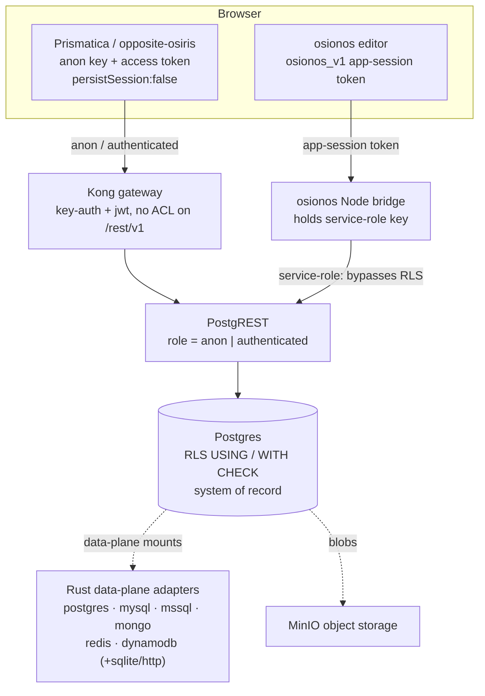

# Prismatica — data model, CRUD, and the server trust boundary

> The schema is the contract. This series reads the Prismatica data model first, then derives every CRUD treatment and I/O guard from it — so the server can't be talked into doing the wrong thing.

## What Prismatica is

**Prismatica** is the project/BaaS brand whose front door is **opposite-osiris** — the Astro
marketing + auth site (`https://localhost:4322`) that signs users up, logs them in, and runs the
newsletter/consent flows. It does this by talking **directly to the BaaS gateway** with the
`@grobase/js` SDK rather than through a private backend of its own. The client is constructed with
**only the public anon key plus an optional per-user access token**, and **never persists the
session** — see `createPublicBaasClient` in
[`apps/opposite-osiris/src/lib/baas-client.ts`](../../../apps/opposite-osiris/src/lib/baas-client.ts)
(`persistSession: false`, endpoints/keys from
[`apps/opposite-osiris/src/lib/baas-config.ts`](../../../apps/opposite-osiris/src/lib/baas-config.ts)).
Reads land at Postgres as the `anon`/`authenticated` role and are governed entirely by Row-Level
Security; for example `fetchSeededUsers` selects only `id,username,email` from `public.users`.

The same model is also reached the heavier way: the **osionos editor** persists through a server-side
**Node bridge** that holds the service-role key and talks PostgREST on the app's behalf
([`apps/osionos/app/scripts/bridge-api.mjs`](../../../apps/osionos/app/scripts/bridge-api.mjs)).
Prismatica is the *thin, public* path; the bridge is the *trusted, server-side* path. Both write the
**same Postgres tables** — the only system of record (see [02 — engine mapping](./02-engine-mapping.md)).

## The philosophy: acknowledge the schema first

We treat the database schema and its specifications as the **primary source of truth**, not an
afterthought: we read the tables, columns, CHECK domains, foreign keys, and RLS policies first, and
only then derive the CRUD treatments and the input/output validation that sit in front of them. Because
ownership is derived from the **verified credential** — `gdpr_current_user_id()` resolved from the JWT
email claim ([`models/gdpr-migration.sql`](../../../models/gdpr-migration.sql)) and `auth.uid()` from
the JWT `sub` claim ([`models/osionos-bridge-migration.sql:8`](../../../models/osionos-bridge-migration.sql))
— and never from a request body, the server components cannot be compromised by a forged id: a passing
`USING`/`WITH CHECK` clause is the final wall, and the column-scoped grants keep PII (`email`,
`password_hash`) out of the public surface even when a row passes RLS
([`models/rls-hardening-migration.sql:156-162`](../../../models/rls-hardening-migration.sql)).

## The series

| # | Doc | What it covers |
|---|-----|----------------|
| — | [README](./README.md) | This landing page: what Prismatica is, the philosophy, navigation, and the at-a-glance layer map. |
| 01 | [Conceptual data model](./01-conceptual-data-model.md) | The entities and their relationships — identity/auth/GDPR, the osionos workspace/page/bridge model, the social/chat graph, and the mail/calendar mirrors. |
| 02 | [Engine mapping](./02-engine-mapping.md) | How the conceptual model maps onto each engine. Postgres is the literal system of record; mysql/mssql/cockroachdb/mongodb/dynamodb/redis/minio are conceptual or vendor-only — honest about literal vs illustrative. |
| 03 | [Schema source map](./03-schema-source-map.md) | Where each table actually lives: the `models/*.sql` migrations, the bridge CRUD servers, the client SDK, the runners/seeds, and the apply order. |
| 04 | [CRUD & the server trust boundary](./04-crud-and-server-trust-boundary.md) | The two enforcement paths (anon/authenticated RLS vs bridge-as-service-role) and how owner-scoping is reconstructed in app code where RLS is bypassed. |
| 05 | [Input / output validation](./05-input-output-validation.md) | Validation from client UX down to DB constraints: bridge sanitizers, the HMAC identity allowlist, RLS `WITH CHECK` write-guards, and read-side column allowlists. |

## At a glance — the layers

The same data has **two** read/write paths into one Postgres instance. The browser never holds the
service-role key.

Path **A** (Prismatica) reaches the database as `anon`/`authenticated`, so **RLS policies are the only
wall** ([`models/rls-hardening-migration.sql`](../../../models/rls-hardening-migration.sql) header:
the anon apikey is public by design and there is no Kong ACL on `/rest/v1`). Path **B** (bridge)
reaches the database **as `service_role`, which bypasses RLS**, so the bridge re-implements the same
checks in app code — HMAC-verify the token, derive `userId` from the signed `sub`, gate on workspace
membership/permissions, and **server-stamp `owner_id` from the credential** on every write
([`apps/osionos/app/scripts/bridge-api.mjs`](../../../apps/osionos/app/scripts/bridge-api.mjs)).
[04](./04-crud-and-server-trust-boundary.md) follows both paths end to end.
