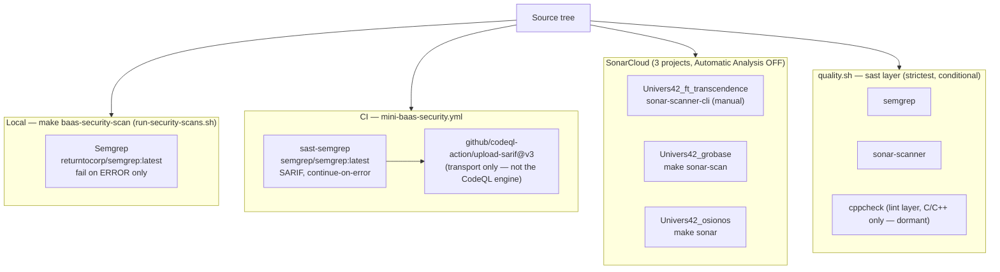

# 02 · Static Analysis & Code-Quality Engines

> The semantic layer of the quality bar: tools that reason about code *meaning* — taint flows, security smells, bugs, complexity, duplication — rather than style (which lives in [01 · Format, Lint & Types](./01-format-lint-types.md)). This file covers **Semgrep**, the **three SonarCloud projects**, **cppcheck**, and the confirmed-absent **CodeQL**.

Part of the 9-part tooling wiki — see the [index](./README.md). Siblings:
[01 format/lint/types](./01-format-lint-types.md) ·
[03 supply-chain & secrets](./03-supply-chain-and-secrets.md) ·
[04 DAST & pentest](./04-dast-and-pentest.md) ·
[05 testing](./05-testing-frameworks.md) ·
[06 web-quality & a11y](./06-web-quality-and-accessibility.md) ·
[07 governance scripts](./07-governance-and-safety-scripts.md) ·
[08 orchestration & gates](./08-orchestration-and-verification-gates.md).

---

## At a glance

| Tool | Layer | Purpose | Active here? |
|------|-------|---------|--------------|
| **Semgrep** | SAST | OWASP-Top-Ten taint, insecure TS/JS/Node patterns, Dockerfile misconfig | Yes — local (`make baas-security-scan`) + CI (advisory) + `quality.sh` |
| **SonarCloud — root** | SAST / code-quality | Bugs, smells, hotspots, complexity, duplication over product code (~88k LOC) | Yes — manual via `sonar-scanner-cli` (no make target) |
| **SonarCloud — grobase** | SAST / code-quality | Same, scoped to the BaaS backend (Go/TS/Rust + Python helpers) + coverage | Yes — `make -C apps/grobase sonar-scan` |
| **SonarCloud — osionos** | SAST / code-quality | Same, scoped to the React/Vite block editor | Yes — `make -C apps/osionos/app sonar` |
| **cppcheck** | lint (static analysis) | C/C++ undefined behavior, resource/memory issues, dead code | Configured but **dormant** — no first-party C/C++ |
| **CodeQL** | SAST | GitHub semantic SAST engine | **Absent as an analyzer** — only `upload-sarif` transport is used |

---

## Where these run in the pipeline

SAST runs **after** format/lint/types and **alongside** the supply-chain layer. The static engines need no live stack (unlike [DAST](./04-dast-and-pentest.md)).



---

## 1. Semgrep — SAST taint analysis

**What it catches:** OWASP-Top-Ten taint flows, insecure TypeScript/JS/Node patterns, and Dockerfile misconfigurations across the whole monorepo tree.

| | |
|---|---|
| **Layer** | SAST |
| **Scope** | Whole monorepo (TS/JS/Node + Dockerfiles). Excludes `node_modules`, `dist`, `.next`, `coverage`, `.venv`, `playwright-report`, `test-results`, `vendor`, plus paths in `.semgrepignore`. |
| **Rulesets** | `p/owasp-top-ten` · `p/typescript` · `p/dockerfile` · `p/nodejs` · `p/javascript` (same 5 in local and CI) |

### Config

| Path | What it is |
|------|-----------|
| `.semgrepignore` | Repo-root ignore list (honored by the orchestrator runs) |
| `apps/grobase/scripts/security/run-security-scans.sh:81` / `:83` | Local orchestrator invocation (image, configs, severity) |
| `infrastructure/makes/baas-verify.mk:246` | `make baas-security-scan` target |
| `.github/workflows/mini-baas-security.yml:28` / `:50` | CI `sast-semgrep` job (SARIF) |
| `.claude/tools/quality.sh:123` | `quality.sh` sast-layer gate |

### Run

```bash
# Local — via the security orchestrator (Docker)
make baas-security-scan
make baas-security-scan SECURITY_ONLY=semgrep
bash apps/grobase/scripts/security/run-security-scans.sh --only=semgrep

# As part of the unified strict gate
bash /home/dlesieur/Documents/groot/.claude/tools/quality.sh
```

### Notes / gotchas

- **Local image** `returntocorp/semgrep:latest`, flags `--severity=ERROR --severity=WARNING`. The verdict **fails only on ERROR** findings (WARNING is advisory). JSON report at `artifacts/security/semgrep.json`.
- **CI image** `semgrep/semgrep:latest` with the *same 5 configs*, but emits **SARIF** and is `continue-on-error: true` — **advisory, never blocks**. SARIF is pushed to the GitHub Security tab via `github/codeql-action/upload-sarif@v3` (see [CodeQL](#5-codeql--absent-as-an-analyzer)).
- `.semgrepignore` intentionally excludes the two dev TLS reverse-proxy `nginx.conf` files (`infrastructure/tls` and `infrastructure/scripts/tls`) because GitHub code-scanning surfaces in-source `nosemgrep` suppressions as open alerts.
- The `.claude/tools/quality.sh` `sast` layer also runs Semgrep (strictest mode) when any code language is detected and the binary resolves.

---

## 2. SonarCloud — three separate projects

> **Do not conflate the three.** Each has a *distinct project key*, its own `sonar-project.properties`, and its own invocation. All share org `univers42`, host `sonarcloud.io`, and **Automatic Analysis is OFF** — so analysis must be pushed directly via `sonar-scanner-cli`; **no git push triggers it**.

| Project | Key | Config | Invocation | Token var |
|---------|-----|--------|-----------|-----------|
| Root monorepo | `Univers42_ft_transcendence` | `sonar-project.properties:2`/`:11`/`:22` | docker `sonar-scanner-cli` (no make target) | `SONAR_TOK` in `.env.local` |
| grobase backend | `Univers42_grobase` | `apps/grobase/sonar-project.properties:2`/`:7`/`:16` | `make -C apps/grobase sonar-scan` | `SONAR_TOKEN` / `TOK_SONARCLOUD` |
| osionos editor | `Univers42_osionos` | `apps/osionos/app/sonar-project.properties:1`/`:13` | `make -C apps/osionos/app sonar` | `SONAR_TOKEN` |

### 2a. Root monorepo — `Univers42_ft_transcendence`

**What it catches:** bugs, code smells, security hotspots, complexity, and duplication across the hand-maintained product code (~88k LOC).

| | |
|---|---|
| **Scope** | Owned source: `js,ts,mjs,astro,css,html,sql,yml,yaml,md`. Excludes `node_modules`, `.git`, `.vscode`, `coverage`, `vendor`, `wiki` (Docusaurus-generated), `sandbox`, `apps/prismatica`, `dist`, `build`, `.astro`, `*.map`, `*.min.{js,css}`. Coverage excluded entirely (`sonar.coverage.exclusions=**/*`). |
| **Config** | `sonar-project.properties:2`/`:11`/`:22`; token presence at `.env.local`; docs at `QUALITY-SECURITY-TOOLING.md:107`; gate wiring at `.claude/tools/quality.sh:124` |

```bash
docker run --rm -e SONAR_TOKEN="$SONAR_TOK" -e SONAR_HOST_URL=https://sonarcloud.io \
  -v "$PWD:/usr/src" sonarsource/sonar-scanner-cli \
  -Dsonar.projectKey=Univers42_ft_transcendence -Dsonar.organization=univers42
```

- There is **no root make target** for Sonar — the docker `sonarsource/sonar-scanner-cli` command above is the canonical invocation (per `QUALITY-SECURITY-TOOLING.md`).
- `SONAR_TOK` is present in `.env.local` (value redacted; presence confirmed).
- `.claude/tools/quality.sh` wires a `sast` sonarcloud gate that triggers when `sonar-project.properties` exists **and** a `sonar-scanner` binary resolves.
- **Not** part of any GitHub workflow in this repo (absent from `mini-baas-security.yml`, grobase `ci.yml`, and `nightly-proof.yml`).

### 2b. grobase backend — `Univers42_grobase`

**What it catches:** static analysis scoped to the BaaS backend (Go/TS/Rust planes + Python helpers), with jest+deno coverage feeding the analysis.

| | |
|---|---|
| **Scope** | Sources `infra/docker/services`, `scripts`, `infra/config`, `src/apps`, `src/libs` (`js,ts,sh,sql,yml,yaml,py`). Excludes verify/bench/security/seed/env/vault/certs/db/ci/ops/test/lib script families, migrations, Dockerfiles, lockfiles, and the vendored `realtime-agnostic` workspace; only `scripts/*.py` stay in scope. |
| **Config** | `apps/grobase/sonar-project.properties:2`/`:7`/`:16`; `apps/grobase/orchestrators/makes/70-langtiers.mk:37`/`:50` |

```bash
make -C apps/grobase sonar-scan       # depends on sonar-coverage
make -C apps/grobase sonar-coverage   # regenerate jest + deno lcov first
bash apps/grobase/scripts/ops/sonar-fetch-issues.sh
```

- Separate nested git repository with its own config + make targets. `make sonar-scan` depends on `sonar-coverage` (regenerates jest lcov for `src/` + deno lcov for `functions-runtime`, path-rewritten to project-relative).
- Token resolved from `SONAR_TOKEN` or `TOK_SONARCLOUD`, falling back to `.env` / `../.env`; runs `sonarsource/sonar-scanner-cli:latest` in Docker.
- Has a coverage profile + an `S1313` hardcoded-IP suppression scoped to `*.spec.ts` test fixtures only.

### 2c. osionos editor — `Univers42_osionos`

**What it catches:** static analysis scoped to the osionos React/Vite block-editor frontend (TypeScript).

| | |
|---|---|
| **Scope** | Sources `src/`, tests `tests/`. Excludes `vendor`, `node_modules`, `build`, `dist`, `coverage`, `.vite`, `playwright-report`, `test-results`, `audit`, `docker`, `scripts`, `markengine`, CSS/SCSS, `seedUsers.json`. Coverage excluded entirely. SCM disabled (`sonar.scm.disabled=true`). |
| **Config** | `apps/osionos/app/sonar-project.properties:1`/`:13`; `apps/osionos/app/Makefile:116` |

```bash
make -C apps/osionos/app sonar
```

- The `make sonar` target **prefers SonarCloud** (`SONAR_HOST_URL` default `https://sonarcloud.io`) when `SONAR_TOKEN` is set, else falls back to a local `playground_sonar` SonarQube container at `localhost:9000`. Uses `sonarsource/sonar-scanner-cli` in Docker.

---

## 3. cppcheck — C/C++ static analysis (dormant)

**What it catches:** C/C++ warning- and style-level defects (undefined behavior, resource/memory issues, dead code).

| | |
|---|---|
| **Layer** | lint (static analysis) |
| **Scope** | Conditional — runs **only** when C/C++ source is detected by `facts.sh` (`$C=1`). |
| **Config** | `.claude/tools/quality.sh:75` / `:116`; detection in `.claude/tools/facts.sh` |
| **Invocation** | `cppcheck --error-exitcode=1 --enable=warning,style --quiet .` |

```bash
bash /home/dlesieur/Documents/groot/.claude/tools/quality.sh   # fires only if C/C++ detected
```

- Wired generically into the `quality.sh` lint layer, gated on C/C++ detection. The monorepo's product code is TS/Go/Rust (three planes), so there is effectively **no first-party C/C++** to scan — C exists only under `vendor/born2root` (excluded from product gates).
- **Dormant** for this repo's own code; not referenced by any Makefile fragment or GitHub workflow.

---

## 4. (reserved)

---

## 5. CodeQL — absent as an analyzer

> Listed here to **record the confirmed absence**: CodeQL-the-engine is **not configured** anywhere, despite the `codeql-action` name appearing in a workflow.

| | |
|---|---|
| **Scope** | None — the CodeQL analysis engine is not run on any code in this repo. |
| **Config** | `.github/workflows/mini-baas-security.yml:60` / `:183` / `:286` |
| **Run commands** | None |

- Searched every workflow under `.github/` and `apps/grobase/.github/`: there is **no** `codeql-action/init`, `codeql-action/analyze`, or `codeql-action/autobuild` step anywhere.
- The **only** usage is `github/codeql-action/upload-sarif@v3`, which merely **transports** the Semgrep and Trivy SARIF results into the GitHub Security / code-scanning tab. If you want semantic SAST coverage today, that is **Semgrep + SonarCloud**, not CodeQL.

---

## Cross-category pointers

- The **non-semantic** linters/formatters/type-checkers (ESLint, Stylelint, html-validate, `astro check`, `tsc`, gofumpt/clippy/rustfmt, ShellCheck) live in [01 · Format, Lint & Types](./01-format-lint-types.md).
- **Trivy, npm/pnpm/cargo-audit, govulncheck, OSV, Snyk, Checkov, TruffleHog, gitleaks** are SCA/secrets, not SAST → [03 · Supply-chain & Secrets](./03-supply-chain-and-secrets.md).
- **ZAP, Nuclei, sqlmap** are dynamic (live-stack) scanners → [04 · DAST & Pentest](./04-dast-and-pentest.md).
- The one-command strict aggregator (`.claude/tools/quality.sh`, `/quality`) that orchestrates the `sast` layer → [07 · Governance & Safety Scripts](./07-governance-and-safety-scripts.md).
- The CI workflow that runs `sast-semgrep` and uploads SARIF (`mini-baas-security.yml`) → [08 · Orchestration & Verification Gates](./08-orchestration-and-verification-gates.md).
