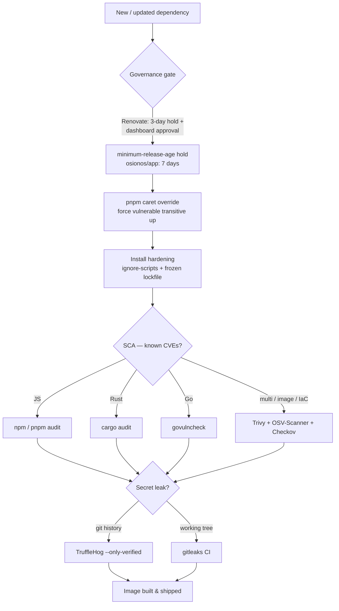

# 03 — Supply-Chain & Secrets

> How `ft_transcendence` stops a poisoned dependency or a leaked credential from ever reaching a running container: dependency CVE scanning (SCA), secret scanning, and install-time dependency governance — every tool, its config, its run command, and its scope.

Part of the [tooling wiki](./README.md). Siblings:
[01 — Format/Lint/Types](./01-format-lint-types.md) ·
[02 — SAST & Code Quality](./02-sast-and-code-quality.md) ·
**03 — Supply-Chain & Secrets** ·
[04 — DAST & Pentest](./04-dast-and-pentest.md) ·
[05 — Testing](./05-testing-frameworks.md) ·
[06 — Web Quality & A11y](./06-web-quality-and-accessibility.md) ·
[07 — Governance & Safety Scripts](./07-governance-and-safety-scripts.md) ·
[08 — Orchestration & Verification Gates](./08-orchestration-and-verification-gates.md)

---

## The hardening story, end to end

Supply-chain defense here is layered: a dependency must survive *governance* (will we even
accept this version?), *install hardening* (no arbitrary code at install), and *continuous
SCA + secret scanning* (no known CVE, no leaked credential) before it ships in an image.

Two root make targets drive the *local* runs (both shell into Docker images — no host
toolchain needed):

| Target | Fragment | Runs |
|--------|----------|------|
| `make baas-security-scan` | `infrastructure/makes/baas-verify.mk:246` → `apps/grobase/scripts/security/run-security-scans.sh` | Semgrep (SAST) + **npm/pnpm audit** + **Trivy fs/image** + **TruffleHog** |
| `make baas-security-audit` | `infrastructure/makes/baas-verify.mk:260` → `apps/grobase/scripts/security/audit/run-audit.sh` | **OSV** + **Trivy/Checkov IaC** + Nuclei/sqlmap (DAST) |

Rust + Go SCA lives in a separate grobase-only target:
`make -C apps/grobase audit-deps` (`apps/grobase/orchestrators/makes/20-stack.mk:150`).

The most complete wiring is the CI gatekeeper `.github/workflows/mini-baas-security.yml`
— see [08 — Orchestration & Verification Gates](./08-orchestration-and-verification-gates.md).

---

## SCA — dependency / image CVE scanning

| Tool | Purpose | Config (`path:line`) | Run command | Scope |
|------|---------|----------------------|-------------|-------|
| **Trivy** | FS + runtime-image CVEs; (config mode) IaC misconfig | `.trivyignore`; `apps/grobase/.trivyignore`; `apps/grobase/scripts/security/run-security-scans.sh:173`; `apps/grobase/scripts/security/audit/iac-scan.sh:44`; `.github/workflows/mini-baas-security.yml:144` | `make baas-security-scan SECURITY_ONLY=trivy` · `make baas-security-scan SECURITY_TRIVY_SEVERITY=HIGH,CRITICAL` · `make baas-security-audit AUDIT_ONLY=iac` | grobase repo tree (fs, `--ignore-unfixed`, HIGH/CRITICAL) + images `^mini-baas\|^grobase\|^dlesieur/realtime` + IaC |
| **npm / pnpm audit** | Lockfile CVE scan per workspace, matching each PM | `apps/grobase/scripts/security/run-security-scans.sh:128`; `.github/workflows/mini-baas-security.yml:67`; `QUALITY-SECURITY-TOOLING.md:51` | `make baas-security-scan SECURITY_ONLY=npm-audit` · `make baas-security-scan SECURITY_FAIL_LEVEL=high` · `docker exec track-binocle-opposite-osiris-1 sh -lc 'cd /workspace/apps/opposite-osiris && pnpm audit --prod'` | grobase `src` + `sdks/js` (npm); frontends per-repo (pnpm: opposite-osiris, osionos/app; npm: mail, calendar) |
| **cargo audit** | RustSec advisory scan of the Rust workspaces | `apps/grobase/scripts/security/audit-deps.sh:59`; `.github/workflows/mini-baas-security.yml:291`; `apps/grobase/orchestrators/makes/20-stack.mk:150` | `make -C apps/grobase audit-deps` · `make -C apps/grobase test-deps` · `bash apps/grobase/scripts/security/audit-deps.sh` | `src/data-plane-router` (+ `realtime-agnostic` in CI) |
| **govulncheck** | Reachability-based Go vuln scan (flags only *called* vulns) | `apps/grobase/scripts/security/audit-deps.sh:70`; `apps/grobase/orchestrators/makes/20-stack.mk:150` | `make -C apps/grobase audit-deps` · `bash apps/grobase/scripts/security/audit-deps.sh` | Go control plane `src/control-plane` (go 1.25) |
| **OSV-Scanner** | Google OSV.dev multi-ecosystem lockfile scan | `apps/grobase/scripts/security/audit/osv-scan.sh:41`; `apps/grobase/scripts/security/audit/run-audit.sh:138`; `infrastructure/makes/baas-verify.mk:260` | `make baas-security-audit AUDIT_ONLY=osv` · `make baas-security-audit AUDIT_FAIL_LEVEL=HIGH` | *Intended:* grobase Node/Go/Rust lockfiles — **STALE PATHS, likely no-op** (see below) |
| **Snyk** | SaaS dependency + license CVE scan | `.github/workflows/mini-baas-security.yml:111`; `QUALITY-SECURITY-TOOLING.md:84` | `snyk test --all-projects --severity-threshold=high` (CI only; needs `SNYK_TOKEN`) | CI-only; **dormant** (no local token — npm/pnpm audit + Semgrep cover the same ground) |
| **Checkov** | Policy-as-code IaC/Helm/Compose misconfig (defence-in-depth alongside Trivy config) | `apps/grobase/scripts/security/audit/iac-scan.sh:45` | `make baas-security-audit AUDIT_ONLY=iac` · `make baas-security-audit AUDIT_SKIP=checkov` | grobase IaC/Helm/Compose (`bridgecrew/checkov:latest`) |

All scanners run as their official Docker images — `aquasec/trivy:latest`,
`ghcr.io/google/osv-scanner:latest`, `bridgecrew/checkov:latest`, and (for npm/pnpm)
`node:20-alpine`/`node:22-alpine`. The host needs only Docker.

`pip-audit` is *not* a configured project tool; it appears only in the repo-wide
[`quality.sh`](./07-governance-and-safety-scripts.md) audit layer (`.claude/tools/quality.sh`),
which would fire `pip-audit` / `osv-scanner -r` / `trivy fs --exit-code 1` / `cargo-audit`
/ `govulncheck` only where the binary resolves. There is no first-party Python application
code to audit (the grobase Python SDK is OpenAPI-generated).

### Detail notes per SCA tool

**Trivy** — fs scan honors the grobase-root `apps/grobase/.trivyignore` and skips
`node_modules,dist,.git,coverage,playwright-report,vendor,target,build`. The image half
**no-ops with a warning if no `mini-baas`/`grobase` images are on the host** (run
`make backend-up` first); `SKIP_BUILD=1` skips the image half. Default severity
`HIGH,CRITICAL` (`SECURITY_TRIVY_SEVERITY`), `--ignore-unfixed` set.

- **Two `.trivyignore` files, different scopes:** the **root** `.trivyignore` carries a
  single desktop GHSA (`glib GHSA-wrw7-89jp-8q8g`); `apps/grobase/.trivyignore` carries the
  Vault 1.21.4 CVEs, the WAF/ModSecurity CVEs, and `rustls-webpki GHSA-82j2-j2ch-gfr8`.
  The fs/image scans honor the **grobase** file.

**cargo audit** ignores **6 transitive advisories accepted-with-remediation** so a *new*
advisory still fails the gate: `RUSTSEC-2026-0098/0099/0104` (rustls-webpki via tiberius),
`RUSTSEC-2025-0134` (rustls-pemfile), `RUSTSEC-2026-0002` (lru via mysql_async),
`RUSTSEC-2026-0097` (rand 0.7). The webpki advisory is mirrored in `apps/grobase/.trivyignore`
(`GHSA-82j2-j2ch-gfr8`) and the CI cargo-audit step. There is **no `baas-*` root wrapper** —
invoke via grobase's own Makefile.

**govulncheck** is bundled with cargo audit in the same `audit-deps.sh` and the single
`audit-deps` make target. Blocking in CI.

**OSV-Scanner — stale, treat as no-op today.** `osv-scan.sh` hardcodes the *pre-flatten*
layout (`BAAS_DIR=apps/baas/mini-baas-infra`, `go/control-plane/go.mod`,
`docker/services/data-plane-router/Cargo.lock`) and `run-audit.sh`'s `REPO_ROOT` climbs six
levels (resolving above the repo). Those lockfile paths **do not exist** in the lean layout
(`src/control-plane/go.mod`, `src/data-plane-router/Cargo.lock`). Until the paths are fixed,
**cargo-audit + govulncheck (`audit-deps.sh`) are the trustworthy Rust/Go SCA coverage**, and
the CI jobs use the correct `apps/grobase/...` paths. By contrast `run-security-scans.sh` (the
`baas-security-scan` path) **does** use the correct lean dirs (`src`, `sdks/js`) — it is current.

**Snyk** self-skips when `SNYK_TOKEN` is absent; treat as CI-conditional and currently dormant.

**Checkov** is reached only through `run-audit.sh`'s `iac` step, which sits downstream of the
same stale-path wiring noted for OSV-Scanner — verify it actually finds files when you run it.

---

## Secret scanning

| Tool | Purpose | Config (`path:line`) | Run command | Scope |
|------|---------|----------------------|-------------|-------|
| **TruffleHog** | Secret scan of **git history** (verified-only) | `apps/grobase/scripts/security/run-security-scans.sh:280`; `.github/workflows/mini-baas-security.yml:223` | `make baas-security-scan SECURITY_ONLY=trufflehog` · `make baas-security-scan SECURITY_SKIP=trufflehog` | Git history + working tree of the grobase repo (`trufflesecurity/trufflehog:latest`) |
| **gitleaks** | Regex/entropy secret scan of the **working tree** | `apps/grobase/.gitleaks.toml`; `.github/workflows/mini-baas-security.yml:250` | `gitleaks detect --no-git --source apps/grobase --config apps/grobase/.gitleaks.toml --redact --exit-code 1` *(CI form — no make target)* | `apps/grobase` working tree only |

The two are complementary: **TruffleHog walks git history**, **gitleaks scans the tree** —
together they catch a credential whether it is committed-and-removed or sitting uncommitted.

- **TruffleHog** counts only `--only-verified` findings as failures (a verified count `> 0`
  fails the gate). It is the **only** secret scanner wired into `make baas-security-scan`.
- **gitleaks is CONFIGURED but CI-only.** It has **no Makefile wrapper** and is **not** in
  `baas-security-scan` — it runs only in `mini-baas-security.yml` (blocking, uploads SARIF).
  Its `apps/grobase/.gitleaks.toml` extends the default ruleset (`useDefault=true`) and
  allowlists gitignored/generated paths (`.env*`, `artifacts`, `certs`, `playground`, `vendor`,
  lockfiles, seed data, test fixtures) plus documented placeholder regexes so the gate stays
  meaningful. There is **no root-level `.gitleaks.toml`** — config lives at the grobase root.

---

## Dependency governance & install hardening

This is the *front* of the supply chain — refusing or delaying a bad version before it is
ever installed, and forbidding arbitrary code at install time.

| Tool / control | Purpose | Config (`path:line`) | Run / enforcement | Scope |
|----------------|---------|----------------------|-------------------|-------|
| **Renovate** | Automated update PRs with a release-age delay + dashboard approval | `renovate.json:8` (`minimumReleaseAge: 3 days`); `renovate.json:9` (`rangeStrategy: bump`); `renovate.json:10` (`dependencyDashboardApproval: true`); `renovate.json:11` (grouped npm/pnpm + docker `packageRules`) | Runs as the Renovate/mend.io GitHub app — **no make target** | Root repo, all PMs (npm, pnpm, dockerfile, docker-compose) |
| **minimum-release-age hold** | Refuse to install a newly published version until it has aged (lets malicious uploads be caught/unpublished) | `apps/osionos/app/.npmrc:1` (`minimum-release-age=10080` = 7 days); `apps/osionos/app/pnpm-workspace.yaml:12` (`minimumReleaseAge: 10080`); `apps/osionos/app/.npmrc:2-4` (`verify-store-integrity`, `strict-store-pkg-content-check`, `prefer-frozen-lockfile`); `renovate.json:8` (3 days, Renovate side) | Enforced at `pnpm`/`npm install` time inside Docker | **Strongest hold (7-day) only on `osionos/app`**; Renovate applies a looser 3-day hold repo-wide |
| **pnpm overrides (selector + caret form)** | Force a vulnerable transitive up to a fixed version reliably | `apps/osionos/app/package.json:90` (`"qs@<6.15.2": "^6.15.2"`); `apps/opposite-osiris/package.json:77` (`"yaml@<2.8.3": "^2.9.0"`); `apps/opposite-osiris/package.json:73` (top-level npm-style override `devalue ^5.8.1`); `apps/osionos/app/package.json:82` (`pnpm.onlyBuiltDependencies` allowlist, 5 entries); `QUALITY-SECURITY-TOOLING.md:62` | `docker run --rm -v "$PWD:/repo" -w /repo/apps/<app> node:22-alpine sh -lc 'corepack enable && corepack prepare pnpm@11.5.1 --activate && pnpm install --lockfile-only'` | pnpm apps only (`osionos/app`, `opposite-osiris`) |

### How these three controls fit together

**Renovate** proposes the update (grouped `js dependencies` and `docker images` batches),
holds it 3 days, and parks it behind the dependency dashboard
(`dependencyDashboardApproval: true`) so nothing merges unreviewed. It coexists with
Dependabot (which covers only the root repo's GitHub Actions — see
[08](./08-orchestration-and-verification-gates.md)).

**minimum-release-age** is the install-time backstop, and it is **not uniform** — a known
gotcha:

- Full **7-day (10080-minute)** hold lives only in `apps/osionos/app` (both `.npmrc` and the
  otherwise-empty `pnpm-workspace.yaml`).
- `apps/opposite-osiris/.npmrc`, `apps/mail/.npmrc`, `apps/calendar/.npmrc`, and
  `apps/grobase/src/.npmrc` set `ignore-scripts` / `engine-strict` / `audit=false` but **no
  release-age hold**.
- There is **no root `.npmrc`**.

Consequence: in `osionos/app` a brand-new patch is held back for a week — which is exactly
why a `pnpm` override may not rewrite a deep transitive *until that patch ages in*.

**pnpm overrides** use the **selector + caret** form (`"pkg@<x": "^x"`), confirmed live in
two places (`qs@<6.15.2 → ^6.15.2` in osionos/app, `yaml@<2.8.3 → ^2.9.0` in opposite-osiris).
An open `>=` range or an npm-style top-level override is **not reliably honored** by pnpm — use
the caret form. After editing, regenerate the lockfile with the `pnpm install --lockfile-only`
command above.

Two complementary install-time hardenings reinforce these:

- **`ignore-scripts=true` across all `.npmrc` files** — no arbitrary `postinstall` code runs
  on install.
- **`pnpm.onlyBuiltDependencies` allowlist** (`osionos/app`: `@tailwindcss/oxide`, `esbuild`,
  `playwright`, `protobufjs`, `sass-embedded`) — a dep that needs a native build but is **off
  the list silently won't build**. Add legitimately build-requiring deps here.

The CI workflow `supply-chain.yml` proves these settings hold: it runs `npm ci --ignore-scripts`
and `pnpm install --frozen-lockfile --prefer-offline --ignore-scripts` across the frontend apps
(detail in [08 — Orchestration & Verification Gates](./08-orchestration-and-verification-gates.md)).

---

## Gotchas at a glance

- **OSV-Scanner & the `baas-security-audit` IaC steps run on stale, pre-flatten paths** —
  likely no-op today. Trust cargo-audit + govulncheck (`make -C apps/grobase audit-deps`) and
  the CI jobs for Rust/Go SCA.
- **gitleaks is CI-only** (no make target); `make baas-security-scan`'s secret scanner is
  **TruffleHog only**.
- **Snyk is dormant locally** (no `SNYK_TOKEN`) — covered by npm/pnpm audit + Semgrep.
- **The 7-day release-age hold is osionos/app-only**; everywhere else there is no hold, only
  `ignore-scripts`. A new transitive patch may not land in osionos/app until it ages.
- **pnpm overrides must use the `pkg@<x: ^x` selector+caret form** — a bare `>=` range is not
  reliably honored.
- **Trivy's image scan no-ops without images on the host** — run `make backend-up` first.
- **Two `.trivyignore` files** (root vs `apps/grobase`); the fs/image scans honor the grobase one.

---

### See also

- [02 — SAST & Code Quality](./02-sast-and-code-quality.md) — Semgrep/SonarCloud (Semgrep
  co-runs in `make baas-security-scan` but is SAST, not SCA).
- [04 — DAST & Pentest](./04-dast-and-pentest.md) — Nuclei/sqlmap/ZAP, the dynamic half of
  `make baas-security-audit`.
- [07 — Governance & Safety Scripts](./07-governance-and-safety-scripts.md) — `.claude/tools/quality.sh`
  audit layer (`npm audit`, `cargo-audit`, `govulncheck`, `pip-audit`, `osv-scanner`, `trivy fs`).
- [08 — Orchestration & Verification Gates](./08-orchestration-and-verification-gates.md) —
  `mini-baas-security.yml`, `supply-chain.yml`, Dependabot, Renovate CI wiring.
