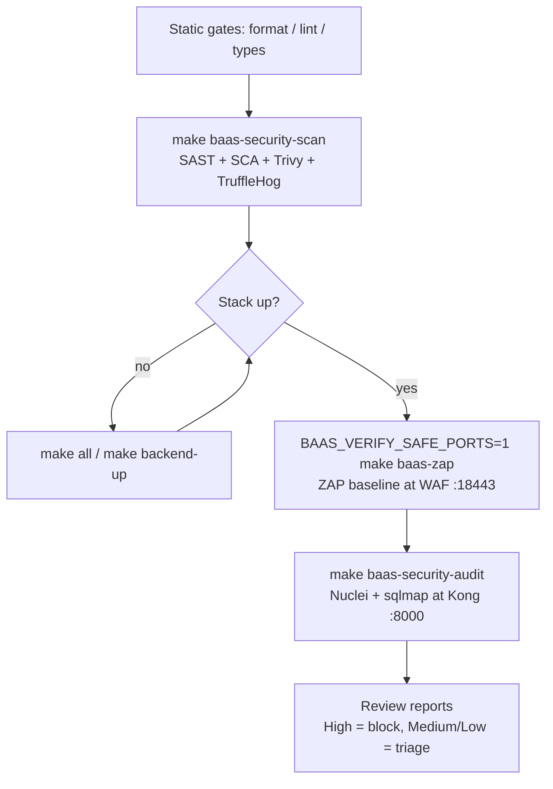

# 04 — DAST & Penetration Testing

Dynamic, black-box security testing fired at a **live, running** stack: OWASP ZAP (baseline web scan), Nuclei (template DAST), and sqlmap (SQL-injection pentest). These probe the deployed HTTP(S) edge — they never read source.

> Part of the [tooling wiki](./README.md). Static analysis of the same code lives in [02 — SAST & code quality](./02-sast-and-code-quality.md); dependency/secret scanning in [03 — supply chain & secrets](./03-supply-chain-and-secrets.md).

---

## Authorized use only

These tools send live attack traffic (injection payloads, CVE probes, fuzzed requests) at a target. **Run them only against infrastructure you own and control — the local dev stack on `127.0.0.1`.** Never point them at a host you are not explicitly authorized to test.

- All three default to a **loopback** target (`https://127.0.0.1:18443`, `http://127.0.0.1:8000`) and ship with **gentle** flags (rate limits, low risk levels, passive-only baseline) so a dev run does not overwhelm the stack.
- A clean scan **bounds known classes of finding** — it is *not* proof of security. The audit scripts state this directly (the "HUMAN-ATOMS" honesty note in `run-audit.sh`). Treat green as "no known issue in scope," not "secure."
- These are the **last** layer of the security pipeline: they need a target that is already up and serving.

---

## At a glance

| Tool | Purpose | Config (path:line) | Run command | Scope (target) |
|------|---------|--------------------|-------------|----------------|
| **OWASP ZAP** (`zap-baseline.py`) | Baseline passive web scan; fails on High-risk alerts | `infrastructure/makes/baas-verify.mk:254`, `:257`; `apps/grobase/scripts/verify/zap-baseline.sh:27`, `:44` | `BAAS_VERIFY_SAFE_PORTS=1 make baas-zap` | Live HTTPS edge — WAF in front of Kong (`https://127.0.0.1:${WAF_HTTPS_PORT:-18443}`) |
| **Nuclei** (ProjectDiscovery) | Template-based DAST sweep for known CVEs / misconfig / exposures | `infrastructure/makes/baas-verify.mk:260`; `apps/grobase/scripts/security/audit/nuclei-scan.sh:45`, `:92` | `make baas-security-audit AUDIT_ONLY=nuclei` | Live Kong gateway (`http://127.0.0.1:8000`) |
| **sqlmap** | Automated SQL-injection pentest (boolean/time/error/union) | `infrastructure/makes/baas-verify.mk:260`; `apps/grobase/scripts/security/audit/sqlmap-scan.sh:100`, `:112` | `make baas-security-audit AUDIT_ONLY=sqlmap` | Live data-plane query API (`POST ${TARGET}/query/v1/${SQLMAP_DBID}/tables/${SQLMAP_TABLE}`) |
| **Audit orchestrator** (`run-audit.sh`) | Sequences the dynamic scanners, runs each only when its target responds | `infrastructure/makes/baas-verify.mk:260`, `:263`; `apps/grobase/scripts/security/audit/run-audit.sh:138`, `:142`, `:150` | `make baas-security-audit` | Live gateway (`TARGET_URL`) + site (`SITE_URL`) |

All scanners run as their **official Docker image with `--network host`** — the host needs only `docker`, no native install. This follows the repo's Docker-first rule.

---

## Prerequisites — the stack must be up

DAST has nothing to scan unless the stack is running. Each script **curl-probes its target first** and exits cleanly if it is down, so a missing stack is a no-op, not a crash — but also not a real scan.

1. **Bring the stack up** (see [08 — orchestration & verification gates](./08-orchestration-and-verification-gates.md)):
   ```bash
   make all                  # full trusted-HTTPS stack
   # or just the backend:
   make backend-up
   ```
2. **For ZAP, set safe ports.** `make baas-zap` defaults to `WAF_HTTPS_PORT=18443` to match the `BAAS_VERIFY_SAFE_PORTS=1` host-port remap (`baas-verify.mk:48`). Without safe ports the WAF listens on `8443`, so you must pass the target explicitly:
   ```bash
   BAAS_VERIFY_SAFE_PORTS=1 make baas-zap                                  # uses :18443
   bash apps/grobase/scripts/verify/zap-baseline.sh https://127.0.0.1:8443 # non-safe-ports
   ```
3. **For sqlmap, supply an API key** for an authenticated probe (otherwise it warns and most requests just `401`):
   ```bash
   TARGET_URL=http://127.0.0.1:8000 BAAS_API_KEY=mbk_... \
     bash apps/grobase/scripts/security/audit/sqlmap-scan.sh
   ```

Probe behaviour, by entry point:

| Path | If target down |
|------|----------------|
| `make baas-zap` → `zap-baseline.sh` | Pre-probes with curl, **exits 2** (unreachable) — `zap-baseline.sh:27` |
| `make baas-security-audit` → `run-audit.sh` (Nuclei) | `run-audit.sh:142` curl-probes and **SKIPS** as a clean no-op (records "target down", not a failure) |
| `make baas-security-audit` → `run-audit.sh` (sqlmap) | `run-audit.sh:150` curl-probes and **SKIPS** as a clean no-op |
| Standalone `nuclei-scan.sh` / `sqlmap-scan.sh` | **exit 2** if the target does not respond |

---

## OWASP ZAP — baseline web scan

**What it does:** runs the ZAP baseline (passive) scan against the live HTTPS edge — the WAF that fronts Kong — and fails the gate on any **High**-risk alert.

| Aspect | Detail |
|--------|--------|
| Image | `zaproxy/zap-stable:latest` (`--network host`) |
| Default target | `https://127.0.0.1:${WAF_HTTPS_PORT:-18443}` (the WAF) |
| Flags | `-I` (do **not** fail on warnings — info/low/medium are non-blocking), `-m 2` (2-min passive wait), `-d` (debug) |
| Policy | **No custom ZAP policy/rules file** — uses ZAP defaults |
| Gate logic | `zap-baseline.sh:63-84`: `jq` counts `riskcode>=3` (High) → **exit 1**; Medium → warn only; reports `zap-baseline.{json,html,md}` |

**Invocations** (from the catalog):
```bash
BAAS_VERIFY_SAFE_PORTS=1 make baas-zap                                   # make wrapper, safe-ports
WAF_HTTPS_PORT=18443 bash apps/grobase/scripts/verify/zap-baseline.sh    # script, explicit port
bash apps/grobase/scripts/verify/zap-baseline.sh https://127.0.0.1:18443 # script, explicit target
```

**Safety caveat:** baseline is passive — it crawls and observes; it does not actively attack. The `-I` flag means only High alerts block, so a green ZAP run still leaves medium findings to review in the report.

---

## Nuclei — template-based DAST

**What it does:** sweeps the live Kong gateway with the ProjectDiscovery community template corpus (known CVEs, misconfigurations, exposures), gated by severity.

| Aspect | Detail |
|--------|--------|
| Image | `projectdiscovery/nuclei:latest` (`--network host`); override via `NUCLEI_IMAGE` |
| Default target | `http://127.0.0.1:8000` (Kong gateway, `TARGET_URL`) |
| Rate limit | `-rate-limit` defaults to `NUCLEI_RATE=50` req/s (`nuclei-scan.sh:48`) |
| Flags | `-duc` (skip template auto-update), `-nc`, `-jsonl` |
| Templates | Upstream community templates, auto-fetched and cached in `artifacts-dir/nuclei-templates` — **no custom template/config file** |
| Severity gate | Derived from `AUDIT_FAIL_LEVEL` (default `HIGH` → `critical,high`; `nuclei-scan.sh:77-83`); any finding at/above level → **exit 1** |

**Invocations:**
```bash
make baas-security-audit AUDIT_ONLY=nuclei
make baas-security-audit                                   # nuclei + sqlmap (+ file-based steps)
TARGET_URL=http://127.0.0.1:8000 bash apps/grobase/scripts/security/audit/nuclei-scan.sh
```

**Safety caveat:** the 50 req/s rate limit keeps the sweep gentle. Tighten the severity surface with `AUDIT_FAIL_LEVEL` (e.g. `AUDIT_FAIL_LEVEL=HIGH`) if a broad community-template run is too noisy.

---

## sqlmap — SQL-injection pentest

**What it does:** fires boolean / time / error / union SQLi probes at the live data-plane CRUD API to confirm no parameter is injectable. It probes both the JSON list-op **filter param** and the **path table segment**.

| Aspect | Detail |
|--------|--------|
| Image | `googlesky/sqlmap:latest` (`--network host`) — upstream ships no image; this is the de-facto mirror |
| Target | `POST ${TARGET}/query/v1/${SQLMAP_DBID}/tables/${SQLMAP_TABLE}` (defaults `dbid=demo`, `table=items`) |
| Tuning | `--level=2 --risk=1` (via `SQLMAP_LEVEL` / `SQLMAP_RISK`), `--batch` (non-interactive), `--random-agent` |
| Auth | Set `BAAS_API_KEY` (sent as `x-api-key`); without it sqlmap warns and most probes just `401` (`sqlmap-scan.sh:107`) |
| Config | **No config file** — tuned via env knobs only |
| Verdict | Log grep: `is vulnerable` / `injectable` → **exit 1**; `not injectable` → exit 0; otherwise inconclusive → exit 0 |

**Invocations:**
```bash
make baas-security-audit AUDIT_ONLY=sqlmap
make baas-security-audit
TARGET_URL=http://127.0.0.1:8000 BAAS_API_KEY=mbk_... \
  bash apps/grobase/scripts/security/audit/sqlmap-scan.sh
```

**Safety caveat:** `--level=2 --risk=1` are deliberately low — the probe is confirmatory, not exhaustive. It complements the in-repo hand-built injection corpus (>=115 vectors); see the stale-path note below for where that corpus actually lives.

---

## Orchestrator — `make baas-security-audit`

`make baas-security-audit` is the CLAUDE.md-named entry point for the dynamic scanners. It runs `apps/grobase/scripts/security/audit/run-audit.sh`, which sequences the URL-based scanners (Nuclei, sqlmap) — running each **only when its live target responds** — alongside file-based steps that belong to other layers.

| Knob | Effect |
|------|--------|
| `AUDIT_ONLY=` | Comma list of steps to run: `osv,iac,nuclei,sqlmap,web-privacy` |
| `AUDIT_SKIP=` | Comma list of steps to skip |
| `AUDIT_FAIL_LEVEL` | Severity threshold (default `HIGH`) forwarded to Nuclei's gate |
| `TARGET_URL` | Gateway target (default `http://127.0.0.1:8000`) |
| `SITE_URL` | Site target for the web-privacy step (default `http://127.0.0.1:4325`) |
| `AUDIT_ARTIFACTS_DIR` | Report output directory |

```bash
make baas-security-audit
make baas-security-audit AUDIT_ONLY=nuclei,sqlmap
make baas-security-audit AUDIT_SKIP=sqlmap AUDIT_FAIL_LEVEL=HIGH TARGET_URL=http://127.0.0.1:8000
```

**Exit semantics:** exit 0 only when every scanner that *ran* is clean; a URL scanner that no-ops because its target is down does **not** count as a failure.

> Scope note: `run-audit.sh` also runs OSV (SCA — see [03](./03-supply-chain-and-secrets.md)), Trivy/Checkov IaC (misconfig — see [02](./02-sast-and-code-quality.md)/[03](./03-supply-chain-and-secrets.md)), and a `web-privacy-scan.sh` (GDPR/web-quality — see [06](./06-web-quality-and-accessibility.md)). Those are not DAST/pentest; only Nuclei and sqlmap are.

---

## When to run / order

DAST is the **last** security layer because it needs a running target. Static gates (format/lint/types, SAST, SCA, secrets) run on source first and cheaply; dynamic scans come after the stack is up and serving.



Recommended local sequence:

1. `make baas-security-scan` — the static security battery (SAST/SCA/secrets). See [02](./02-sast-and-code-quality.md) and [03](./03-supply-chain-and-secrets.md).
2. `make all` (or `make backend-up`) — bring the stack up so DAST has a target.
3. `BAAS_VERIFY_SAFE_PORTS=1 make baas-zap` — ZAP baseline against the WAF.
4. `make baas-security-audit` — Nuclei + sqlmap against the gateway.

---

## Gotchas & caveats

| Gotcha | Detail |
|--------|--------|
| **Stale artifact paths** | All three scripts were authored for the standalone grobase layout (`apps/baas/mini-baas-infra`, which no longer exists). `zap-baseline.sh` writes reports under `apps/grobase/apps/baas/mini-baas-infra/artifacts/security`; `run-audit.sh` computes `REPO_ROOT` six levels up and lands artifacts *outside* the repo (`~/Documents/.../artifacts/security-audit`). **The scans still work** — they hit the live target over `--network host` regardless of where reports are written; only the report location is odd. |
| **sqlmap corpus note** | `sqlmap-scan.sh` references a stale corpus path (`apps/baas/mini-baas-infra/postman/corpus/_gen-injection-security.mjs`); the real corpus lives at `apps/grobase/infra/config/postman/corpus/_gen-injection-security.mjs`. The script prints a **non-fatal** "corpus not found" — it does not abort. |
| **ZAP `-I` flag** | Only **High** alerts block; medium and below are advisory. A green run still has a report worth reading. |
| **No custom policies** | None of the three carry a custom policy/template/config file — ZAP uses defaults, Nuclei uses upstream community templates, sqlmap is env-tuned only. |
| **WAF port** | Without `BAAS_VERIFY_SAFE_PORTS=1` the WAF is on `8443`, not `18443`; pass the target explicitly. `BAAS_VERIFY_NO_WAF=1` scales the WAF to 0 for the verify gates. |

---

## CI

The dynamic ZAP scan is **opt-in** in CI — the `mini-baas-security.yml` security gatekeeper runs SAST/SCA/secrets on every PR, but the `dast-zap` job (which stands up the stack and runs ZAP) only fires on explicit dispatch:

```bash
gh workflow run mini-baas-security.yml -f run_dast=true
```

See [08 — orchestration & verification gates](./08-orchestration-and-verification-gates.md) for the full CI workflow matrix.

---

## See also

- [README](./README.md) — tooling wiki index
- [01 — format, lint, types](./01-format-lint-types.md)
- [02 — SAST & code quality](./02-sast-and-code-quality.md)
- [03 — supply chain & secrets](./03-supply-chain-and-secrets.md)
- [05 — testing frameworks](./05-testing-frameworks.md)
- [06 — web quality & accessibility](./06-web-quality-and-accessibility.md)
- [07 — governance & safety scripts](./07-governance-and-safety-scripts.md)
- [08 — orchestration & verification gates](./08-orchestration-and-verification-gates.md)
