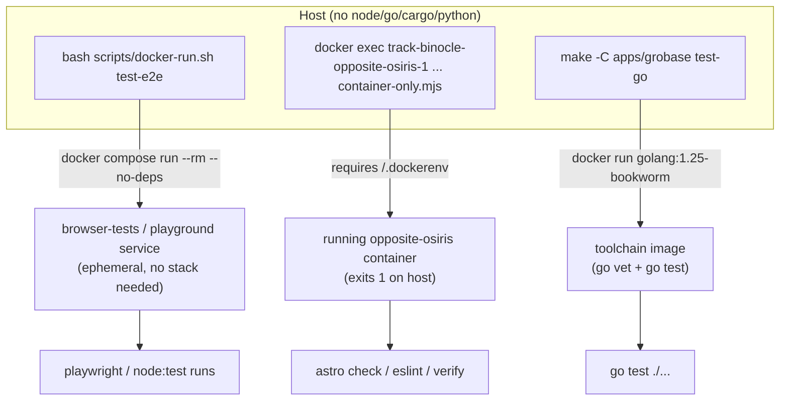

# 05 · Testing Frameworks & Runners

> The per-language test runners (Playwright, `node:test`, Jest, `go test`, `cargo test`, pytest) and the two Docker harnesses that run them all without a host toolchain.

Every runner here executes **inside Docker** — there is no host `node`/`go`/`cargo`/`python`. Two harness shapes front the whole category: osionos's `docker-run.sh` *spins up* an ephemeral container, while opposite-osiris's `container-only.mjs` *dispatches into the already-running* container. The grobase backend wraps its runners behind `make -C apps/grobase <target>` (Go/Rust/Node/Python images).

Sibling pages: [README](./README.md) · [01 format/lint/types](./01-format-lint-types.md) · [02 SAST](./02-sast-and-code-quality.md) · [03 supply-chain](./03-supply-chain-and-secrets.md) · [04 DAST](./04-dast-and-pentest.md) · **05 testing (this page)** · [06 web-quality/a11y](./06-web-quality-and-accessibility.md) · [07 governance scripts](./07-governance-and-safety-scripts.md) · [08 orchestration gates](./08-orchestration-and-verification-gates.md)

---

## At a glance — runner per surface

| Surface | Runner | File convention | Entry point |
|---|---|---|---|
| osionos editor (e2e) | Playwright | `tests/e2e/**/*.spec.mjs` | `bash scripts/docker-run.sh test-e2e` |
| osionos canvas (unit) | `node:test` (TS strip) | `tests/canvas/*.test.ts` | `bash scripts/docker-run.sh test-canvas` |
| osionos bridge (unit) | `node:test` | `tests/bridge/*.test.mjs` | `bash scripts/docker-run.sh test-bridge` |
| grobase JS SDK (unit) | `node:test` | `tests/*.test.mjs` | `npm test` (in `sdks/js`) |
| grobase NestJS apps/libs | Jest | `*.spec.ts` | `make -C apps/grobase test-nestjs` |
| grobase Go control plane | `go test` (stdlib) | `*_test.go` | `make -C apps/grobase test-go` |
| grobase Rust data plane | `cargo test` | crate `tests/` + inline | `make -C apps/grobase rust-data-plane-test` |
| grobase Rust realtime | `cargo test` | crate `tests/` + inline | `make -C apps/grobase rust-realtime-test` |
| grobase Python SDK | pytest | generated stubs | `cd apps/grobase/sdks/python && tox` |
| grobase marketing site | Playwright | `e2e/` | `make grobase-e2e` |
| whole-stack sims | Playwright (library) | `scripts/*-simulation.mjs` | `make playground` / `agency-sim` / `gourmand-sim` |
| grobase phase/integration | bash + python | `scripts/test/phase/*` | `make -C apps/grobase test-smoke` |

---

## The two harness patterns



- **`docker-run.sh` (osionos)** — self-dockerizing: on the host (no `/.dockerenv`, `OSIONOS_IN_DOCKER!=1`) it runs `docker compose -f docker-compose.base.yml -f docker-compose.dev.yml run --rm --no-deps <service> ...`, then re-execs itself inside. Works with **no stack running**.
- **`container-only.mjs` (opposite-osiris)** — a guard that requires `/.dockerenv` or `TRACK_BINOCLE_IN_DOCKER=1`; on the host it **exits 1**. It only dispatches into the **already-running** container.

---

## Playwright

### osionos editor (browser e2e)

| Field | Value |
|---|---|
| Purpose | Offline browser e2e for the block editor against a self-spawned Vite server |
| Config | `apps/osionos/app/playwright.config.ts:33`, `:34`; `apps/osionos/app/scripts/docker-run.sh:32`, `:79`; `apps/osionos/app/package.json:10` |
| Scope | osionos React/Vite editor; specs are `.mjs` under `tests/e2e/{functional,smoke,persistence,visual}` plus top-level graph-engine-audit / visual / semantic-zoom + markdown-import-benchmark specs |

Run commands:

```bash
cd apps/osionos/app && bash scripts/docker-run.sh test-e2e          # full suite
cd apps/osionos/app && bash scripts/docker-run.sh test-e2e-smoke    # fast smoke subset
cd apps/osionos/app && bash scripts/docker-run.sh test-e2e-serial   # serialized
# SINGLE test — trailing args pass straight through to Playwright:
cd apps/osionos/app && bash scripts/docker-run.sh test-e2e tests/e2e/functional/<file>.spec.mjs -g "case name"
npm run test:e2e -- -g "pattern"                                    # inside container
```

Key behaviors (from `playwright.config.ts`): its own `webServer` spawns Vite on **:3004** in `--mode test` with `VITE_API_URL= / VITE_ALLOW_OFFLINE_MODE=true / VITE_REQUIRE_BRIDGE_SESSION=false` — **not** the :3001 dev server. Defaults: `workers 1`, `fullyParallel false`, `retries 0`, 30s timeout; reporters list+html+junit. Runs in the `browser-tests` compose service (separate `node_modules` volume from `playground`). Env overrides: `PLAYWRIGHT_PORT`, `PLAYWRIGHT_BASE_URL`, `TEST_WORKERS`, `PLAYWRIGHT_REUSE_EXISTING_SERVER`.

### grobase marketing site (e2e)

| Field | Value |
|---|---|
| Purpose | Story-spine / scroll-morph / Big-Bang / latch / reduced-motion / no-JS / CSP / keyboard e2e against a prod preview |
| Config | `apps/grobase/vendor/grobase-website/playwright.config.ts:11`, `:27`; `apps/grobase/vendor/grobase-website/package.json:25`; `infrastructure/makes/grobase.mk:20` |
| Scope | grobase marketing site (`apps/grobase/vendor/grobase-website`), `testDir ./e2e`; webServer builds the PROD bundle |

```bash
make grobase-e2e
```

`make grobase-e2e` builds the `grobase-site-audit` image then runs `docker compose --profile grobase run --rm grobase-site-audit npm run test:e2e` (= `node scripts/container-only.mjs playwright test` against the audit image's system Chromium). `@playwright/test ^1.61.0` is a devDep there. Separate from the backend; the site is served via `make grobase-up` on :4324.

### Whole-stack simulation harnesses (Playwright *library*, not config-driven)

| Field | Value |
|---|---|
| Purpose | End-to-end org / user-flow simulations driving the **real running stack** (throwaway account creation, bridge handoff, agency org sim, gourmand staff e2e) |
| Config | `infrastructure/makes/playground.mk:2`; `infrastructure/makes/agency.mk:41`; `infrastructure/makes/gourmand.mk:41`; `docker-compose.yml:427`, `:468`; `apps/osionos/app/scripts/playground-simulation.mjs`; `apps/osionos/app/scripts/agency-simulation.mjs` |
| Scope | osionos + grobase backend together; drivers at `apps/osionos/app/scripts/{playground-simulation,agency-simulation,gourmand-staff-verification}.mjs` |

```bash
make playground     # Docker Playwright flow; opens VS Code viewer for results
make agency-sim     # 20-employee org simulation (needs agency-all first)
make gourmand-sim   # restaurant staff e2e against the live mount (needs gourmand-all first)
```

These are Playwright-**library** driver scripts (`node scripts/*.mjs`), **not** `playwright.config`-based suites. Run via `docker compose --profile testing run --rm <service>` (built from `apps/osionos/app/docker/services/browser-tests/Dockerfile`, command `node scripts/<sim>.mjs`). `gourmand-sim` reuses the `playground-simulation` service running `scripts/gourmand-staff-verification.mjs`. Require the stack up (`make all`) plus the `agency-all` / `gourmand-all` foundation first.

---

## Unit runners

### `node:test` (osionos canvas, osionos bridge, grobase JS SDK)

| Surface | Purpose | Config | Run command | Scope |
|---|---|---|---|---|
| osionos canvas | Block model / serialization / transaction units, TS stripped on the fly | `apps/osionos/app/scripts/docker-run.sh:35`; `apps/osionos/app/package.json:23` | `cd apps/osionos/app && bash scripts/docker-run.sh test-canvas` | ~30+ `*.test.ts` under `tests/canvas/` (canvas-model, chart-engine, live-*, block-combinations…) |
| osionos bridge | Website→editor auth-handoff, bridge API/chat/mentions/ratelimit/rtc | `apps/osionos/app/scripts/docker-run.sh:37`; `apps/osionos/app/package.json:25` | `cd apps/osionos/app && bash scripts/docker-run.sh test-bridge` | `*.test.mjs` under `tests/bridge/` (bridge-api, bridge-chat-media, bridge-mentions, bridge-ratelimit, collab-rtc) |
| grobase JS SDK | Units for `@grobase/js` (account/auth/rest/schema/storage/realtime/graphql/http-hardening/cli) | `apps/grobase/sdks/js/package.json:53` | `cd apps/grobase/sdks/js && npm run build && npm test` | ~10 `*.test.mjs` under `tests/` |

Single-test forms:

```bash
# osionos canvas — runs node --experimental-strip-types --test in the `playground` service
cd apps/osionos/app && bash scripts/docker-run.sh test-canvas tests/canvas/<file>.test.ts
# osionos bridge — plain node --test in the `playground` service
cd apps/osionos/app && bash scripts/docker-run.sh test-bridge tests/bridge/<file>.test.mjs
# grobase JS SDK — native node:test filters
cd apps/grobase/sdks/js && node --test tests/<name>.test.mjs
cd apps/grobase/sdks/js && node --test --test-name-pattern='<re>' tests/*.test.mjs
```

Notes: osionos canvas runs `node --experimental-strip-types --experimental-loader ./tests/canvas/ts-extension-loader.mjs --test tests/canvas/*.test.ts` in the `playground` compose service (not `browser-tests`). The SDK script is literally `"test": "node --test tests/*.test.mjs"` — **explicitly not** jest/vitest; it is part of grobase's `make test-sdk`.

### Jest — grobase NestJS apps/libs

| Field | Value |
|---|---|
| Purpose | Units for the TypeScript NestJS application plane (query-router proxy/graph/query/dto, schema/analytics/log/mongo-api services, common libs) |
| Config | `apps/grobase/orchestrators/makes/40-tests.mk:41`; `apps/grobase/Makefile:39` |
| Scope | `apps/grobase/src/apps` + `apps/grobase/src/libs` — 16 spec files (12 under `src/apps`, 4 under `src/libs/common`) |

```bash
make -C apps/grobase nestjs-ci    # tsc --noEmit + eslint + jest --passWithNoTests
make -C apps/grobase test-nestjs
# SINGLE test:
docker run --rm -v "$PWD/apps/grobase/src":/app -w /app -v mini-baas-src-node-modules:/app/node_modules \
  node:20-alpine npx jest <spec> -t '<case>'
```

Jest is the **existing-project** runner here (per the canonical TS row: Jest for existing projects). `make nestjs-ci` = `tsc --noEmit` + eslint + `jest --passWithNoTests`.

### `go test` — Go control plane

| Field | Value |
|---|---|
| Purpose | Unit/fuzz tests for the Go control plane (tenants, trust, provision, packages, telemetryexport…), `go vet` first |
| Config | `apps/grobase/Makefile:39`; `apps/grobase/orchestrators/makes/40-tests.mk:36`, `:38` |
| Scope | `apps/grobase/src/control-plane` — 92 `*_test.go` files (incl. `validate_fuzz_test.go`, `keys_security_test.go`) |

```bash
make -C apps/grobase go-control-plane-check   # go vet ./... && go test ./...
make -C apps/grobase test-go
make -C apps/grobase test-unit
# SINGLE test (from src/control-plane/):
cd apps/grobase/src/control-plane && docker run --rm -v "$PWD":/src -w /src \
  golang:1.25-bookworm go test ./internal/<pkg> -run TestX -v
```

> **`-race` gotcha:** the whole-suite wrapper runs `go vet ./... && go test ./...` in `golang:1.25-bookworm` — it does **not** pass `-race`. The `go test -race ./...` in [`.claude/rules/refactor-go.md`](../../.claude/rules/refactor-go.md) is the aspirational standard, not what the make wrapper actually runs. To match the standard, add `-race` manually to the `docker run` form. Style: stdlib `testing`, table-driven.

### `cargo test` — Rust data plane & realtime (two workspaces)

| Surface | Purpose | Config | Run command | Scope |
|---|---|---|---|---|
| Data plane | Units for planner, plan, pool capability/credential | `apps/grobase/orchestrators/makes/40-tests.mk:39`; `apps/grobase/orchestrators/makes/70-langtiers.mk:78`; `apps/grobase/Makefile:39` | `make -C apps/grobase rust-data-plane-test` | `apps/grobase/src/data-plane-router` — crates data-plane-core/pool/server, engine-conformance |
| Realtime | Units for the vendored 10-crate event-bus / IRC-bridge workspace | `apps/grobase/orchestrators/makes/40-tests.mk:40`; `apps/grobase/orchestrators/makes/70-langtiers.mk:130`; `apps/grobase/infra/docker/services/realtime/realtime-agnostic/Makefile:56` | `make -C apps/grobase rust-realtime-test` | `apps/grobase/infra/docker/services/realtime/realtime-agnostic` (separate workspace) |

```bash
make -C apps/grobase rust-data-plane-test    # cargo test --workspace via CARGO_DPR image
make -C apps/grobase conformance             # m27 engine-conformance gate
# SINGLE test (build the toolchain image first):
make -C apps/grobase _rust-toolchain && cargo test -p data-plane-core <name>
cargo test -p realtime-core <name>
```

Built-in `cargo test`. Engine integration is the m27 conformance gate (`cargo test -p engine-conformance`); the m18/m24 verify gates also invoke targeted `cargo test -p ...` runs.

### pytest — grobase Python SDK

| Field | Value |
|---|---|
| Purpose | Test runner configured for the OpenAPI-generated Python SDK, with coverage |
| Config | `apps/grobase/sdks/python/tox.ini:9`; `apps/grobase/sdks/python/pyproject.toml:27`, `:28` |
| Scope | `apps/grobase/sdks/python` — the only pytest config in the repo |

```bash
cd apps/grobase/sdks/python && tox
cd apps/grobase/sdks/python && pytest --cov=grobase
```

> **Caveat:** the polyglot SDKs are OpenAPI-generated and their generated `test/` stubs have empty `pass` bodies — the **real gate is the compile/build** (`make -C apps/grobase test-sdk` → `scripts/verify/m58-sdks-compile.sh`), not pytest. pytest is configured (pytest-cov declared) but exercises near-empty generated tests.

### grobase phase smoke / integration

| Field | Value |
|---|---|
| Purpose | Integration smoke tests (bash + python) exercising each backend phase against the **live stack**, plus the milestone verify gates |
| Config | `apps/grobase/orchestrators/makes/40-tests.mk:13`, `:21`, `:27`, `:44` |
| Scope | `apps/grobase/scripts/test/phase/phase*-*.{sh,py}`; `postgres-mvp-flow.sh` |

```bash
make -C apps/grobase test-smoke
make -C apps/grobase test-phase3
make -C apps/grobase test-postgres
make -C apps/grobase test-all      # unit + (if stack up) smoke/postman/edge/waf/conformance
make -C apps/grobase tests         # full 14-kind matrix
```

Mixed shell/python integration scripts (no single framework). `make tests` runs the full matrix: `test-go test-rust-data test-rust-realtime test-nestjs test-sdk` + lint/deps/scan/conformance/scripts/postman/waf/gates/sonar/bench. Verify gates live at `apps/grobase/scripts/verify/m*-*.sh` (run via `make verify-m<NN>`) — see [08 orchestration gates](./08-orchestration-and-verification-gates.md).

---

## The self-dockerizing harnesses

### `docker-run.sh` — osionos

| Field | Value |
|---|---|
| Purpose | Single entry point that self-dockerizes every osionos build/lint/typecheck/test target |
| Config | `apps/osionos/app/scripts/docker-run.sh:23`, `:47`, `:56` |
| Scope | osionos (`apps/osionos/app`); all `package.json` scripts (except `lighthouse`) delegate here |

```bash
cd apps/osionos/app && bash scripts/docker-run.sh test-e2e
cd apps/osionos/app && bash scripts/docker-run.sh test-canvas
cd apps/osionos/app && bash scripts/docker-run.sh test-bridge
cd apps/osionos/app && bash scripts/docker-run.sh quality
```

On the host (no `/.dockerenv` and `OSIONOS_IN_DOCKER!=1`) it runs `docker compose -f docker-compose.base.yml -f docker-compose.dev.yml run --rm --no-deps <service> ...`, picking **`playground`** (build/typecheck/lint/quality/canvas/bridge) vs **`browser-tests`** (e2e/doctor/bench); inside the container the same script execs the real tool. `test-doctor` (`node tests/test-env-doctor.mjs`) validates the Playwright env before running it. No host node needed.

### `container-only.mjs` — opposite-osiris

| Field | Value |
|---|---|
| Purpose | Guard/dispatcher that refuses to run on the host and execs the requested tool inside the **running** opposite-osiris container |
| Config | `apps/opposite-osiris/scripts/container-only.mjs:19`, `:31` |
| Scope | opposite-osiris (`apps/opposite-osiris`) — Astro marketing/auth site |

```bash
docker exec track-binocle-opposite-osiris-1 sh -lc \
  'cd /workspace/apps/opposite-osiris && node scripts/container-only.mjs astro check'
docker exec track-binocle-opposite-osiris-1 sh -lc \
  'cd /workspace/apps/opposite-osiris && node scripts/container-only.mjs eslint .'
```

> **opposite-osiris has NO test framework.** There is no `playwright.config`, no vitest/jest, no `test:e2e`. Its `test:*` npm scripts (`test:security`, `test:smtp`, `test:email`, `test:templates`, `test:newsletter`, `test:delivery`, `test:ux`) are operational **verify** scripts (`node scripts/verify-*.mjs` / `security/run-all.mjs`), not a unit/e2e runner. `container-only.mjs` requires `/.dockerenv` or `TRACK_BINOCLE_IN_DOCKER=1`, else exits 1 — unlike osionos's `docker-run.sh`, it expects an already-running container and never spins one up.

---

## Canonical-framework cross-reference

From [`.claude/rules/test-frameworks.md`](../../.claude/rules/test-frameworks.md) — canonical default first, then what this repo actually runs:

| Lang | Canonical default(s) | Used here | Match? |
|---|---|---|---|
| **Go** | `testing` (stdlib, table-driven) + testify; E2E `httptest`/testcontainers-go | `go test` stdlib, table-driven (92 `*_test.go`) | ✅ canonical (no testify in catalog; no `-race` in the make wrapper) |
| **Rust** | built-in `cargo test` (+ rstest); integration `tests/`, doctests | `cargo test --workspace` × 2 workspaces | ✅ canonical |
| **TS / JS** | Vitest (new) / **Jest (existing)**; `node:test` zero-dep; E2E **Playwright (preferred)** | Jest (grobase NestJS), `node:test` (osionos canvas/bridge, JS SDK), Playwright (osionos + site + sims) | ✅ Jest-for-existing + node:test + Playwright; **Vitest not used anywhere** |
| **Python** | **pytest (default)**, unittest; E2E Playwright-python/Selenium | pytest (grobase Python SDK only; generated stubs) | ✅ pytest, but tests are empty stubs |
| **Shell** | **Bats-core** (bash), shUnit2, ShellSpec | plain bash scripts under `apps/grobase/scripts/{test,verify}/` | ⚠️ **Bats not configured** — `facts.sh` only lists "bats" as a detection keyword |
| **C / C++** | Unity/Criterion/CMocka; GoogleTest/Catch2 | — | n/a — product code is TS/Go/Rust (C only under `vendor/born2root`) |

### What the spec asks for but is **not** present

The file spec mentions `vitest`/`bats`/`go test -race` — be precise about what actually exists:

| Asked | Reality |
|---|---|
| **vitest** | Not used anywhere. TS units are Jest (NestJS) + `node:test` (osionos/SDK). |
| **bats** | Not configured. Zero `*.bats` files; the only reference is the `facts.sh` detection keyword list. Shell tests are plain bash under `apps/grobase/scripts/`. |
| **go test -race** | The make wrapper runs `go vet ./... && go test ./...` **without** `-race`; `-race` is the rule's standard, runnable only by adding it to the `docker run` form. |
| Playwright on opposite-osiris | None — opposite-osiris has no test framework at all (see above). |
| mail / calendar tests | None — only `typecheck` + `build` (no unit suite). See [01 format/lint/types](./01-format-lint-types.md). |

---

## Package managers per surface (match the lockfile)

| Surface | Package manager |
|---|---|
| osionos/app, opposite-osiris, grobase-website | pnpm |
| grobase `sdks/js`, mail, calendar, grobase `src` (NestJS) | npm |
| grobase `sdks/python` | Poetry / tox |

Container naming: root frontends are `track-binocle-<service>-1` (e.g. `track-binocle-opposite-osiris-1`); the grobase backend is the separate `mini-baas` compose project (`mini-baas-*` containers).

---

## See also

- [07 governance & safety scripts](./07-governance-and-safety-scripts.md) — `.claude/tools/facts.sh` is the framework **detector**; `quality.sh --with-tests` adds `go test -race` / `cargo test` / `npm test` / pytest.
- [08 orchestration & verification gates](./08-orchestration-and-verification-gates.md) — `make -C apps/grobase tests`, the M1–M180 verify gates, and the CI workflows (`baas-ci.yml`) that compile + unit-test the planes.
- [README](./README.md) — index of all nine tooling pages.
