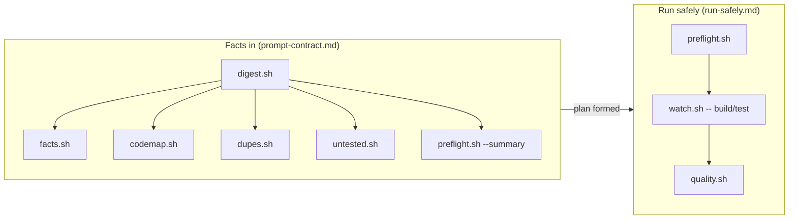

# 07 — Governance & Safety Scripts

> The repo's meta-tooling under `.claude/tools/*.sh` — eight bash scripts plus a shared library that gather facts before you act, run commands without hanging, and aggregate every strict gate into one verdict. They are mandated by the `.claude/rules/*.md`, which is what makes the other gates self-enforcing.

These tools are **not** part of the Docker-first build matrix. They are pure bash + coreutils (using `rg` / `jq` / `git` when present, degrading gracefully), language-agnostic, run at repo root, and are invoked **directly** — there is **no `make` target** for any of them and they are **absent from `QUALITY-SECURITY-TOOLING.md`**. They are governance scaffolding: the rules below cite them by name, so an agent that follows the rules runs them automatically.

Related pages: [README](./README.md) · [01 format/lint/types](./01-format-lint-types.md) · [02 SAST](./02-sast-and-code-quality.md) · [03 supply-chain](./03-supply-chain-and-secrets.md) · [04 DAST](./04-dast-and-pentest.md) · [05 testing](./05-testing-frameworks.md) · [06 web-quality/a11y](./06-web-quality-and-accessibility.md) · [08 orchestration & verify gates](./08-orchestration-and-verification-gates.md)

---

## The two disciplines these scripts enforce

| Discipline | Rule that mandates it | Tools | One-line shape |
|---|---|---|---|
| **Facts in** — orient before you plan | [`prompt-contract.md`](../../.claude/rules/prompt-contract.md), `test-frameworks.md` | `digest.sh` · `facts.sh` · `codemap.sh` · `dupes.sh` · `untested.sh` | Decide from tool output, not a guess about the tree |
| **Run safely** — verify first, never hang | [`run-safely.md`](../../.claude/rules/run-safely.md), `quality-bar.md` | `preflight.sh` → `watch.sh` → `quality.sh` | Check config → run under a watchdog → strict gate |



---

## Catalog

| Tool | Purpose | Config (path:line) | Run command | Scope |
|---|---|---|---|---|
| `preflight.sh` | Verify env (`.env` keys vs `.env.example`, credential vars, toolchain presence) **before** any build | `.claude/tools/preflight.sh:1` · `.claude/rules/run-safely.md:13` | `.claude/tools/preflight.sh` · `.claude/tools/preflight.sh --summary` | Repo root |
| `watch.sh` | Run a command under a watchdog with hard + idle timeouts so a hang is killed | `.claude/tools/watch.sh:1` · `run-safely.md:20` · `.claude/AGENTS.md:50` | `.claude/tools/watch.sh --idle 60 -- make build` · `.claude/tools/watch.sh --timeout 300 --idle 120 -- <cmd>` | Any single build/test/install/migrate/deploy command |
| `quality.sh` | Run every strict gate (format→lint→types→sast→audit) and aggregate PASS/FAIL/SKIP; verify-only | `.claude/tools/quality.sh:1` · `quality-bar.md:1` · `.claude/commands/quality.md:14` | `.claude/tools/quality.sh` · `--summary` · `--no-audit` · `--with-tests` · `/quality` | All languages auto-detected |
| `facts.sh` | Cache toolchain facts: languages, build/test/lint commands, Docker presence, gates present/absent, test framework(s) | `.claude/tools/facts.sh:1` · `test-frameworks.md:9` · `prompt-contract.md:14` | `.claude/tools/facts.sh` · `--summary` · `--refresh` | Whole repo |
| `digest.sh` | One-command start-of-task briefing — composes the `--summary` of facts/preflight/codemap/untested/dupes | `.claude/tools/digest.sh:1` · `prompt-contract.md:14` · `.claude/AGENTS.md:24` | `.claude/tools/digest.sh` · `--refresh` | Whole repo (delegates) |
| `codemap.sh` | Queryable index of source files (lang, loc, regex symbol count, has-test?, path) | `.claude/tools/codemap.sh:1` · `prompt-contract.md:16` · `library-first.md:32` | `.claude/tools/codemap.sh` · `--summary` · `--refresh` | Every tracked source file (tests excluded) |
| `dupes.sh` | Find repeated code blocks (sliding window of normalized lines) — extraction candidates | `.claude/tools/dupes.sh:1` · `library-first.md:31` | `.claude/tools/dupes.sh` · `--summary` · `--window N` · `--refresh` | Every tracked source file |
| `untested.sh` | List source files with no test naming their stem — the TDD worklist | `.claude/tools/untested.sh:1` · `.claude/tools/README.md:15` | `.claude/tools/untested.sh` · `--summary` · `--refresh` | Every tracked source file |
| `lib/common.sh` | Shared library sourced by the others: probes, `repo_root`, `emit_cached`, file inventory, classification | `.claude/tools/lib/common.sh:1` · `.claude/tools/README.md:35` | `. .claude/tools/lib/common.sh` (sourced, never executed) | Sourced by all tools **except** `watch.sh` |

---

## Exit-code semantics

These scripts communicate by exit code — treat the code as a fact to act on, not noise.

| Tool | `0` | `1` | `124` | `2` |
|---|---|---|---|---|
| `preflight.sh` | ready to build | required config missing (`MISS>0`) | — | unknown arg |
| `watch.sh` | command's own clean exit code (passthrough) | command's own non-zero exit | **watchdog KILLED it** (hard timeout OR idle hang) | usage / unknown flag |
| `quality.sh` | no gate FAILED (skips are **not** failures) | at least one gate FAILED | — | unknown arg |
| `facts.sh` / `digest.sh` / `codemap.sh` / `dupes.sh` / `untested.sh` | success | — | — | unknown arg (`set -euo pipefail`) |

> **`watch.sh` exit 124 is load-bearing.** Per `run-safely.md`, a watchdog kill is "a fact to act on: the command hung or overran. Diagnose it; don't blindly re-run." Liveness is output-based — `watch.sh` watches the log file mtime; if nothing is written for `--idle` seconds the process group is killed even though the wall clock is fine. For a genuinely silent long task, raise `--idle` or pass `--idle 0`.

---

## Run-safely: `preflight` → `watch` → `quality`

[`run-safely.md`](../../.claude/rules/run-safely.md) names the order explicitly: *"`preflight` → fix config → build/test under `watch` → `quality.sh` gate. Verifying late is the same as not verifying."*

### 1. `preflight.sh` — verify before you build

Probes the manifests (`go.mod` / `Cargo.toml` / `package.json` / `Makefile`) for the toolchain it expects (`go` / `cargo` / `node` / `make`), then diffs the first of `.env.example` / `.sample` / `.template` / `.dist` against `.env` plus the exported environment. A var counts as satisfied if it is exported-and-non-empty **or** present-with-value in `.env`.

- **Never prints secret values.** It reports key names and set/unset only. Credential keys (matched by the `KEY|SECRET|TOKEN|PASSWORD|PASSWD|CREDENTIAL|PRIVATE` regex) are counted and flagged separately.
- Uses `set +e` internally so a missing var is *data*, not a script abort. A required-but-unset var is a **blocker** (exit 1), not a warning.

```bash
.claude/tools/preflight.sh            # full report; exit 1 if MISS>0
.claude/tools/preflight.sh --summary  # the line digest.sh embeds
```

### 2. `watch.sh` — never wait forever

Wrap **every** build, test, install, migration, or deploy. Defaults: `--timeout 300` (hard cap, `0` disables) and `--idle 120` (kill after N seconds with no output, `0` disables). It spawns the command via `setsid` in a new session and kills the whole **process group** (SIGTERM, 2s grace, then SIGKILL), streaming output live with `tail -f --pid`.

```bash
.claude/tools/watch.sh --idle 60 -- make build
.claude/tools/watch.sh --timeout 300 --idle 120 -- <command> [args...]
```

> `watch.sh` is the **one** tool that does **not** source `lib/common.sh` — it is self-contained. Never wrap an interactive prompt with it (the idle timer would kill a waiting REPL).

### 3. `quality.sh` — the strict gate

The static half of "done" (the dynamic half is the project's test suites — see [05 testing](./05-testing-frameworks.md)). It auto-detects each language from manifests/extensions and runs only the relevant gates, in canonical order **format → lint → types → sast → audit** (and tests with `--with-tests`), aggregating PASS/FAIL/SKIP. It is **verify-only — it never writes or auto-fixes.**

- Resolves CLIs from repo-local `node_modules/.bin` first, then global `PATH`; bounds network/SAST gates with `timeout 180`.
- Uses `set -uo pipefail` (not `-e`) so a failing gate is **recorded**, not fatal — the run completes and reports every gate.
- **Strictest flags by design:** `prettier --check`, `eslint . --max-warnings 0`, `tsc --noEmit`, `gofmt -l`, `golangci-lint run`, `clippy --all-targets --all-features -- -D warnings`, `rustfmt --check`, `ruff format --check` / `check`, `shellcheck`, `shfmt -d`, `clang-format --dry-run -Werror`, `cppcheck --error-exitcode=1`, `semgrep --error`, `sonar-scanner`, `npm audit --audit-level=high`, `cargo-audit`, `govulncheck`, `pip-audit`, `osv-scanner -r`, `trivy fs --exit-code 1`.
- **`--with-tests`** adds `make test` / `go test -race` / `cargo test` / `npm test` / `pytest`.
- **Skipped ≠ passed.** A gate whose tool is not installed records SKIP — `quality-bar.md` treats that as *uncovered surface*, not green.

```bash
.claude/tools/quality.sh             # full strict gate
.claude/tools/quality.sh --summary   # condensed
.claude/tools/quality.sh --no-audit  # skip the supply-chain layer
.claude/tools/quality.sh --with-tests
/quality                             # the command at .claude/commands/quality.md:14 execs the script
```

> **Repo caveat (from the catalog):** `quality.sh`'s `golangci-lint`, `clippy`, and `ruff` gates only fire if those binaries resolve. In **this** repo Go linting is actually `go vet` + `gofmt -l` (no `.golangci.*` exists), so the `golangci-lint` row **SKIPs**; `ruff` is configured only under `vendor/QA`, not the product apps. See [01 format/lint/types](./01-format-lint-types.md) for what each language's real gate is, and [02 SAST](./02-sast-and-code-quality.md) for the `semgrep` / `sonar-scanner` layer.

---

## Prompt-contract: facts in, evidence out

[`prompt-contract.md`](../../.claude/rules/prompt-contract.md) mandates running `digest.sh` (or the relevant tool) **before forming a plan** — *"Decide from the digest, not from a guess about the tree."* `.claude/AGENTS.md:24` repeats it: run `digest.sh` before hand-reading a tree.

### `digest.sh` — the start-of-task briefing

Composes the `--summary` views of `facts.sh`, `preflight.sh` (a non-zero exit here is treated as *findings*, not a failure), `codemap.sh`, `untested.sh`, and `dupes.sh` into one situational-awareness report. `--refresh` is passed through to the sub-tools.

### `facts.sh` — the toolchain detector

`test-frameworks.md:9` names `facts.sh` as **the** framework detector — run it (or read the manifest) before writing a test. It reads `Makefile` targets, `package.json` scripts (via `jq`), `go.mod` / `Cargo.toml`, and `pyproject.toml` / `requirements.txt`, and scans sources for framework signatures (go-test/testify/ginkgo/gomock, cargo-test/proptest/quickcheck/criterion/rstest/insta/mockall, vitest/jest/mocha/ava/cypress/fast-check/playwright, pytest/hypothesis/nox, bats, gtest/catch2/doctest/criterion/unity/cmocka). Cited by `prompt-contract.md` / `AGENTS.md` for "how do I build/test/lint".

### `codemap.sh` — read by query, not by slurp

A per-file table (lang, loc, regex symbol count, has-test?, path) so you navigate by query instead of re-reading the tree. `library-first.md:32` cites it for "where a symbol already lives before you add another"; `prompt-contract.md:16` for "read by query."

### `dupes.sh` — extraction candidates

Sliding window of normalized lines (default `WINDOW=6`, tunable via `--window`), hashed and counted, busiest blocks first with count + first-seen location + sample. Trivial lines (<5 chars or pure punctuation) are skipped. `library-first.md:31`: each repeated block is an extraction candidate — pull into the library, test once, reuse.

### `untested.sh` — the TDD worklist

Lists source files where no test file's name contains their stem. Feeds the TDD red step (`agents/builder.md`, the `write-test` skill).

> **Heuristic honesty (marked "ponytail" in the scripts):** `codemap.sh` symbol counts are **regex, not AST**; `dupes.sh` finds **copy-paste, not semantic clones**; `untested.sh` is **existence-coverage** (a test names the stem), **not line coverage**. Treat all three as navigation pointers — for real coverage, run the suite's coverage target (see [05 testing](./05-testing-frameworks.md)).

---

## Caching & the shared library

`facts.sh`, `codemap.sh`, `dupes.sh`, and `untested.sh` (and `digest.sh` transitively) cache to `.claude/cache/*.md` via `emit_cached` in `lib/common.sh`. The cache is **fingerprinted to git HEAD + `git status --porcelain`** (an hourly bucket for non-git trees) and rebuilt when stale; `--refresh` (or `REFRESH=1`) forces a rebuild.

`lib/common.sh` is the project library the tools stay thin glue over (dogfooding [`library-first.md`](../../.claude/rules/library-first.md)): capability probes, `repo_root`, fingerprinted `emit_cached`, gitignore-aware file inventory (`list_files` uses `git ls-files`, else a pruned `find` excluding `node_modules`/`target`/`vendor`/`dist`/`build`), language/test/code classification, `loc`, and regex symbol extraction. It runs `set -euo pipefail`. It is **sourced, never executed**, by every tool **except `watch.sh`**.

> The cache lives under `.claude/cache/` and is gitignored by `.claude/.gitignore` (`cache/`). Note `.claude` is **itself a git submodule** (`Univers42/claude-deal-with-the-devil`), so edits to any tool or rule here are a submodule edit — commit inside `.claude` first, then let the root record the new SHA.

---

## How these make the other gates self-enforcing

The format/lint/types ([01](./01-format-lint-types.md)), SAST ([02](./02-sast-and-code-quality.md)), supply-chain ([03](./03-supply-chain-and-secrets.md)), DAST ([04](./04-dast-and-pentest.md)), and testing ([05](./05-testing-frameworks.md)) tools each have their own config and `make` wiring — but nothing forces an agent to *run* them. The rules close that loop by naming these meta-tools:

| Rule (`alwaysApply`) | What it mandates |
|---|---|
| [`run-safely.md`](../../.claude/rules/run-safely.md) | `preflight` → build under `watch` → `quality` order |
| [`prompt-contract.md`](../../.claude/rules/prompt-contract.md) | `digest` / `facts` / `codemap` before a plan; evidence (command + output) in the result |
| [`quality-bar.md`](../../.claude/rules/quality-bar.md) | `quality.sh` is the static half of "done" |
| `test-frameworks.md` | `facts.sh` is the framework detector |
| `library-first.md` | `dupes.sh` / `codemap.sh` find redundancy with tools, not eyes |

`quality.sh` is additionally surfaced as the `/quality` command (`.claude/commands/quality.md:14` execs `.claude/tools/quality.sh $ARGUMENTS`). There is **no `make quality`** target — the strict all-layer gate is this script, not the Makefile. For the build/CI orchestration that *does* live in `make` (and the milestone verify gates), see [08 orchestration & verification gates](./08-orchestration-and-verification-gates.md).
