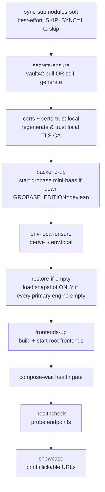
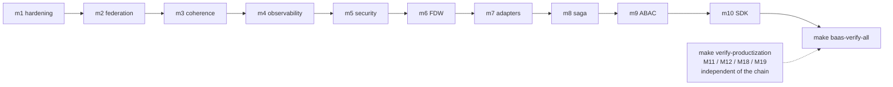
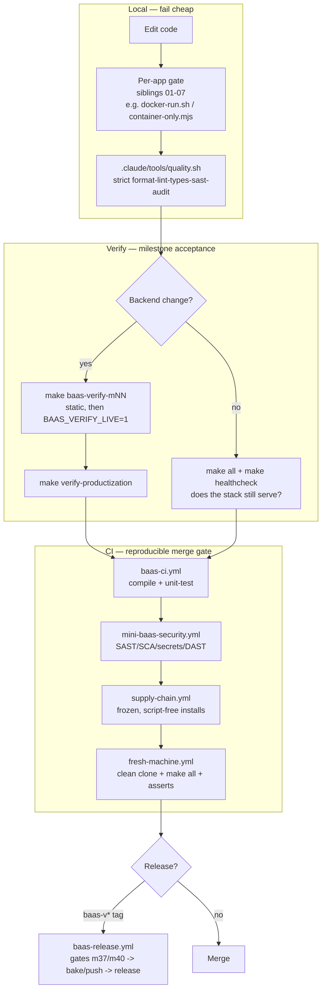

# Orchestration & Verification Gates

> How the monorepo builds, brings itself up, and proves itself: the Make system, Docker Compose / buildx bake, the grobase milestone verify gates, and the GitHub Actions CI battery — and how a change flows from a local gate through milestone verification into CI.

Part of the [tooling wiki](./README.md). Siblings:
[01 format/lint/types](./01-format-lint-types.md) ·
[02 SAST & code quality](./02-sast-and-code-quality.md) ·
[03 supply-chain & secrets](./03-supply-chain-and-secrets.md) ·
[04 DAST & pentest](./04-dast-and-pentest.md) ·
[05 testing frameworks](./05-testing-frameworks.md) ·
[06 web quality & a11y](./06-web-quality-and-accessibility.md) ·
[07 governance & safety scripts](./07-governance-and-safety-scripts.md) ·
**08 orchestration & verification gates** (this file).

---

## The shape of it

There are three orchestration layers, and they are deliberately separate:

| Layer | Authority | What it owns | What it is NOT |
|-------|-----------|--------------|----------------|
| **Build / bring-up** | GNU Make (`Makefile` + `infrastructure/makes/*.mk`) + Docker Compose / buildx bake | Reconstituting a whole machine, building images, starting services, health-gating | A test of correctness |
| **Verification gates** | `apps/grobase/scripts/verify/m*.sh`, wrapped by `make baas-verify-*` | Milestone acceptance — does the backend actually satisfy a spec (hardening, tenancy, ABAC, …) | A linter/formatter (those are siblings 01–07) |
| **CI** | `.github/workflows/*.yml` (+ `apps/grobase/.github/`) | Re-running build + verify + security in a clean, reproducible runner on every PR/tag | A local convenience — it is the merge gate |

Two architectural facts drive everything below:

1. **The root Makefile is the only sanctioned entry point.** It is a thin coordinator that `include`s ~33 fragments and encodes correct ordering, env-file wiring, and edition selection. Don't hand-roll `docker compose`.
2. **The backend is a separate compose project.** grobase is the standalone `mini-baas` project (containers `mini-baas-*`); the root pipeline owns only the frontends (containers `track-binocle-<service>-1`) and joins the backend over an external Docker network. The root `frontends-up` must never re-up backend services.

> Note: there is **no `make quality` target** — the strict all-layer quality gate is the project tool `.claude/tools/quality.sh` (run via the `/quality` skill), covered in [07 governance & safety scripts](./07-governance-and-safety-scripts.md), not the Make system.

---

## 1. Build & bring-up orchestration

### Tools

| Tool | Purpose | Config (path:line) | Run command | Scope |
|------|---------|--------------------|-------------|-------|
| **GNU Make** | Single coordinator: thin root `Makefile` `include()`s ~33 `.mk` fragments, encoding ordering, env wiring, edition selection | `Makefile:18-49`, `infrastructure/makes/common.mk:145` | `make help` · `make all` · `make showcase` | Whole monorepo (frontends + backend coordination) |
| **`make all` pipeline** | From-zero self-provisioning lifecycle | `infrastructure/makes/pipeline.mk:5`, `infrastructure/makes/grobase.mk:44`, `:56` | `make all` · `make all GROBASE_EDITION=full` · `SKIP_SYNC=1 make all` | Whole-machine bring-up (root frontends + external `mini-baas`) |
| **Docker Compose (root frontends)** | Defines/runs the frontend service graph that joins the external `mini-baas` network; lean HTTP overlay | `docker-compose.yml`, `docker-compose.local.yml`, `infrastructure/makes/compose.mk:49`, `:72` | `make up` · `docker compose up -d --build <service>` · `make local` | Root frontends only |
| **docker buildx bake** | Parallel BuildKit image builds of frontend targets, optional registry cache | `docker-bake.hcl`, `infrastructure/makes/docker-build.mk:17`, `:2`, `infrastructure/makes/common.mk:24` | `make compose-build` · `docker buildx bake --file docker-bake.hcl default` | Frontend images (backend bakes live in `apps/grobase/docker-bake.hcl`) |
| **compose-wait health gate** | Polls every long-running service for healthy/running and every init job for clean exit-0; fails on unhealthy/dead or timeout | `infrastructure/makes/compose.mk:14`, `infrastructure/makes/common.mk:35`, `:40` | `make compose-wait` | Root compose services |
| **`make healthcheck`** | Post-bring-up probe of backend, website, editor, bridge, auth gateway endpoints | `infrastructure/makes/app.mk:53`, `:69` | `make healthcheck` · `make showcase` | Running root + grobase stack endpoints |

### `make all` — what the lifecycle actually runs

```
all: sync-submodules-soft secrets-ensure certs certs-trust-local \
     backend-up env-local-ensure restore-if-empty frontends-up \
     healthcheck showcase
```

It reconstitutes a whole machine and is idempotent / re-runnable:



- `backend-up` **starts** the grobase stack if down — the default edition is `devlean` (`infrastructure/makes/grobase.mk:42`). `make all GROBASE_EDITION=full` brings up everything.
- `restore-if-empty` (`scripts/restore-if-empty.sh`) is fail-safe: it loads the snapshot only when every primary engine is confirmed empty.
- `make local` / `up-local` (`infrastructure/makes/compose.mk:72`) is the lean HTTP-only edition (no TLS proxy, no `mini-baas`/mail/calendar/website).

### compose-wait — the build's health contract

`compose-wait` distinguishes three service classes (default timeout `COMPOSE_WAIT_TIMEOUT=300s`, `common.mk:35`):

| Class | Requirement |
|-------|-------------|
| `COMPOSE_HEALTHY_SERVICES` | Must report **healthy** |
| `COMPOSE_RUNNING_SERVICES` | Must be **running** |
| `COMPOSE_COMPLETED_SERVICES` | Init jobs must **exit 0** |

It is wired into both `up` and `frontends-up`, so a stuck or unhealthy service fails the bring-up rather than leaving a half-started stack.

### buildx bake details

`compose-build` depends on `buildx-setup` (`docker-build.mk:2`), which provisions a `docker-container` builder (`$(BUILDX_BUILDER)`, default `default`, image `moby/buildkit:buildx-stable-1`; `common.mk:16-17`) with bootstrap timeout/kill guards. Bake group/targets default in `common.mk:24-26`; registry layer cache is via `REGISTRY_CACHE_PREFIX` (`--cache-from`/`--cache-to type=registry`). `docker-prefetch-images` (`docker-build.mk:31`) pre-pulls public base images from mirrors with retry/timeout.

> Stale bake target: `docker-bake.hcl`'s `vault` target points at `./apps/baas/mini-baas-infra/docker/services/vault`, a path that no longer exists post-extraction. It is legacy/dead and is not in the default build group.

> **Broken dev-server targets:** `make grobase-up` / `grobase-logs` / `grobase-down` (`infrastructure/makes/grobase.mk:1-12`) — intended to serve the grobase marketing site at `http://127.0.0.1:4324` — run `docker compose --profile grobase up/logs/stop grobase-site`, but **`grobase-site` is only a bake target** (`docker-bake.hcl:83`), not a compose service in any compose file, so they fail with "no such service". The audit gates `make grobase-audit` / `grobase-e2e` are **unaffected** — they use the real `grobase-site-audit` compose service (`docker-compose.yml:516`); see [06](./06-web-quality-and-accessibility.md).

---

## 2. Verification gates — milestone acceptance

These are not linters. Each gate proves the backend satisfies a milestone spec. **The `make` targets are thin wrappers — the `apps/grobase/scripts/verify/m*.sh` scripts are the single source of truth.**

### Tools

| Tool | Purpose | Config (path:line) | Run command | Scope |
|------|---------|--------------------|-------------|-------|
| **M1–M10 chain** | Chained acceptance gates: M1 hardening, M2 federation, M3 coherence, M4 observability, M5 security, M6 FDW, M7 adapters, M8 saga, M9 ABAC, M10 SDK — each depends on the prior | `infrastructure/makes/baas-verify.mk:132`, `:172`, `apps/grobase/scripts/verify/m1-hardening.sh:14` | `make baas-verify-m1` · `BAAS_VERIFY_LIVE=1 make baas-verify-m1` · `make baas-verify-all` | grobase mini-baas (control/adapter/data planes) |
| **Higher-milestone gates (m11–m180)** | Glob-resolved generic runner: `make baas-verify-mNN` → `scripts/verify/m<NN>-*.sh` — a new script is runnable with no per-target edit | `infrastructure/makes/baas-verify.mk:191`, `:198` | `make baas-verify-m94` · `make baas-verify-m103` | grobase backend (cloud/enterprise milestones) |
| **verify-productization (M11/M12/M18/M19)** | Independent aggregate: trust-boundary, tenancy isolation, Rust data-plane scaffold (`cargo check`), Go control-plane scaffold (`go vet`/`test`) | `infrastructure/makes/baas-verify.mk:227`, `apps/grobase/scripts/verify/m11-trust-boundary.sh`, `m19-go-control-plane.sh` | `make verify-productization` · `make verify-trust-boundary` · `make verify-tenancy` · `make verify-rust-data-plane` · `make verify-go-control-plane` | grobase trust boundary, tenancy, Rust DP, Go CP |
| **Security-scan orchestration** | DAST/pentest + static security suites (Semgrep/Trivy/TruffleHog/ZAP/Nuclei/sqlmap) — itemized in siblings 02–04 | `infrastructure/makes/baas-verify.mk:246` (scan), `:254` (zap), `:260` (audit) | `make baas-security-scan` · `BAAS_VERIFY_SAFE_PORTS=1 make baas-zap` · `make baas-security-audit` | Repo + grobase backend |

### Static vs live

By default the milestone gates are **static** (no running stack). Add runtime probes with environment flags:

| Flag | Effect |
|------|--------|
| `BAAS_VERIFY_LIVE=1` | Adds runtime probes — compose health, `/docs-json` curl, `audit_log` count |
| `BAAS_VERIFY_SAFE_PORTS=1` | Remaps host ports to `15000+` (and the WAF HTTPS port to `18443`, matched by `make baas-zap`) |
| `BAAS_VERIFY_NO_WAF=1` | Scales the WAF to 0 |
| `BAAS_VERIFY_FULL` | Adds observability/analytics profiles |

`baas-up` / `baas-down` (`baas-verify.mk:100`/`:115`) bring the stack up `--wait` for live gates.

### Scale

There are **165 verify scripts** under `apps/grobase/scripts/verify/` spanning m1 → ~m180 (e.g. m94 cloud-funnel — explicit target at `baas-verify.mk:198`; m100 telemetry, m103 orgs-rbac, m107 passkeys, m110 sso-oidc, m111 scim, m146 movieverse, m155 savanna-security). Release-gate scripts `m37-nano.sh` and `m40-one.sh` feed `baas-release.yml`.



> Stale-comment caveat: `m1-hardening.sh`'s header still references the old `apps/baas/mini-baas-infra` path, but the script's actual `COMPOSE_FILE` resolves to the current `apps/grobase` dir.

---

## 3. CI — the merge gate

All workflows check out submodules over HTTPS (`SUBMODULES_TOKEN`) and run toolchains inside official Docker images (Docker-first, no host toolchain drift).

### Workflows

| Workflow | Purpose | Config (path:line) | Trigger / run | Scope |
|----------|---------|--------------------|---------------|-------|
| **baas-ci.yml** | Pre-merge proof the pinned grobase commit's Go CP + both Rust planes compile + unit-test, plus static config parity & Prometheus rule validity | `.github/workflows/baas-ci.yml:27` | PR/push touching `apps/grobase`; `gh workflow run baas-ci.yml` | apps/grobase (Go CP, Rust DP + realtime, static config) |
| **mini-baas-security.yml** | Per-PR/main security battery: SAST + SCA + container + secret + opt-in DAST, aggregated into one gate | `.github/workflows/mini-baas-security.yml:26`, `:442` | PR/main; `gh workflow run mini-baas-security.yml -f run_dast=true` | Repo + grobase backend |
| **supply-chain.yml** | Every JS lockfile installs cleanly frozen and script-free | `.github/workflows/supply-chain.yml:17` | PR/push to main; `gh workflow run supply-chain.yml` | mail, calendar, osionos/app (npm) + osionos/app, opposite-osiris (pnpm) |
| **fresh-machine.yml** | THE migration test — clean runner does `git clone --recursive` + `make all` + asserts all 6 engines restored and every core container healthy | `.github/workflows/fresh-machine.yml:35` | push to main (infra/scripts/Makefile/compose/grobase) or dispatch; `gh workflow run fresh-machine.yml -f grobase_edition=full` | Whole stack end-to-end on a clean machine |
| **colleague-docker-pipeline.yml** | Manual full `make all` with Vault-OIDC secrets + GHCR build cache (heaviest pipeline) | `.github/workflows/colleague-docker-pipeline.yml:19` | `workflow_dispatch` only (90m) | Whole stack with Vault-backed env |
| **baas-release.yml** | Tag-driven release: gates → bake+push 16 images → binocle images/binaries → GitHub Release → post-publish health probe | `.github/workflows/baas-release.yml:37` | `baas-v[SEMVER]` tags; `git tag baas-v1.0.0 && git push origin baas-v1.0.0` | grobase release artifacts |
| **baas-cli-publish.yml** | Build + smoke-test + pack `@mini-baas/js`; publish to npm only on `baas-cli-v*` tag or manual `dry_run=false` | `.github/workflows/baas-cli-publish.yml:45` | `baas-cli-v*` tag or dispatch; `gh workflow run baas-cli-publish.yml -f dry_run=false` | apps/grobase/sdks/js |
| **Dependabot** | Automated update PRs for the superproject's **GitHub Actions only** (app deps live in submodules) | `.github/dependabot.yml:14` | weekly, max 5 PRs | Root repo github-actions ecosystem |
| **Renovate** | Alternative updater: supply-chain release-age delay + grouped npm/pnpm + docker batching behind a dashboard | `renovate.json:1` | bot / dashboard-approved PRs | npm/pnpm + docker managers across the repo |

### Notable CI internals

- **baas-ci.yml** has 4 jobs: `go` (golang:1.25-bookworm `go vet ./... && go test ./...`), `rust-data-plane` and `rust-realtime` (rust:1-bookworm `cargo test --workspace`), and `static` (packages.json parity via jq diff; `promtool check config`; advisory `shellcheck -S error scripts/verify/m*.sh`).
- **mini-baas-security.yml** is the most complete security wiring: `sast-semgrep` (SARIF, advisory), `sca-npm-audit` (matrix `apps/grobase/src` + `sdks/js`, **blocking** `--audit-level=high`), `sca-snyk` (gated on `SNYK_TOKEN`, PR-only, advisory), `container-trivy` (fs+image SARIF), `secret-trufflehog` (`--only-verified`), `secret-gitleaks` (**blocking**, `.gitleaks.toml`), `sca-cargo-audit` (**blocking**, 2 Rust workspaces), `sca-govulncheck` (**blocking**, Go CP), `dast-zap` (opt-in `run_dast=true`). The `security-gate` job aggregates `needs` results. Itemized per scanner in [02](./02-sast-and-code-quality.md), [03](./03-supply-chain-and-secrets.md), [04](./04-dast-and-pentest.md).
- **supply-chain.yml**: `npm-frozen-installs` runs `npm ci --ignore-scripts` per dir; `pnpm-frozen-installs` runs `pnpm install --frozen-lockfile --prefer-offline --ignore-scripts` (pnpm pinned 10.32.1 via corepack).
- **fresh-machine.yml**: single `clone-and-make-all` job (timeout 120m), places the vault identity from `VAULT42_KEYSTORE_B64`/`CONTRACT_B64`, runs `make all`, then asserts postgres / mysql / mongo / mssql / dynamodb / minio all non-zero, then loops up to 180s asserting no unhealthy core containers.
- **baas-release.yml**: `gates` job builds binocle-nano/one then runs `scripts/verify/m37-nano.sh` + `m40-one.sh` — **the release blocks on these milestone gates**.

> CI discrepancies to know: `colleague-docker-pipeline.yml` still uses the retired HashiCorp-Vault OIDC path (`TRACK_BINOCLE_VAULT_*`); CLAUDE.md states Vault is retired in favour of vault42, so that secret-fetch may be stale. **CodeQL-the-engine is not run** anywhere — only `github/codeql-action/upload-sarif@v3` is used, purely to publish Semgrep/Trivy SARIF (see [02](./02-sast-and-code-quality.md)).

---

## How a change flows: local → milestone → CI

The discipline is to fail cheap and early. The same checks run at three escalating fidelities.



1. **Local, per-app first.** Run the app's own scoped gate ([01 format/lint/types](./01-format-lint-types.md), [05 testing](./05-testing-frameworks.md)) inside Docker, then the strict aggregate `.claude/tools/quality.sh` ([07](./07-governance-and-safety-scripts.md)). These mirror the CI scanners but run on your tree.
2. **Verify the milestone.** For a backend change, run the relevant `make baas-verify-mNN` static, then with `BAAS_VERIFY_LIVE=1` against a live stack; run `make verify-productization` for trust-boundary/tenancy/plane scaffolds. For a frontend change, `make all` + `make healthcheck` proves the stack still serves.
3. **CI re-runs it clean.** `baas-ci.yml` recompiles and unit-tests in pinned containers; `mini-baas-security.yml` re-runs the security battery (blocking on npm-audit/gitleaks/cargo-audit/govulncheck); `supply-chain.yml` proves frozen installs; `fresh-machine.yml` proves the whole `make all` lifecycle from a clean clone — the same pipeline you ran locally, now adversarially reproduced.
4. **Release** (tag only): `baas-release.yml` blocks on the `m37-nano`/`m40-one` milestone gates before baking and publishing.

The invariant: a check you can run locally is the same check CI enforces. Local gates make CI green predictable; CI makes "works on my machine" reproducible.
