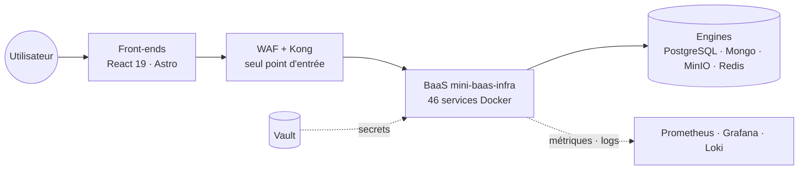
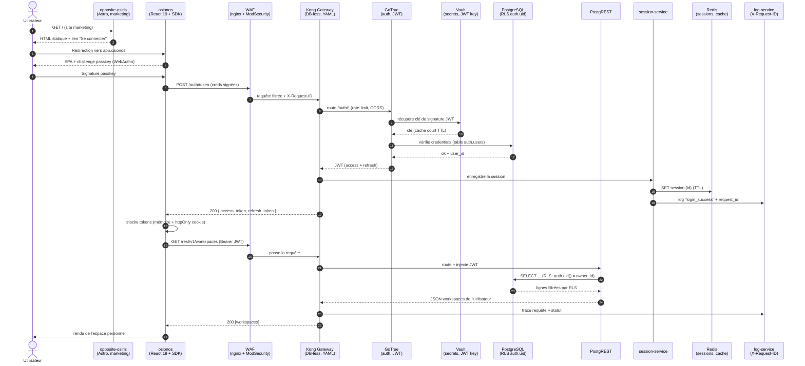
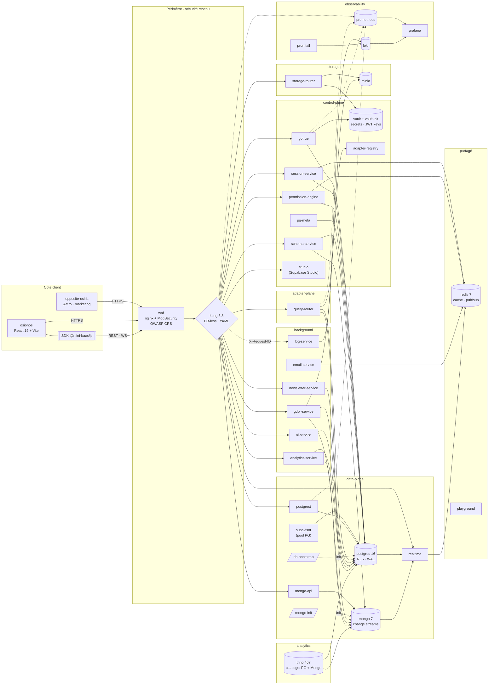
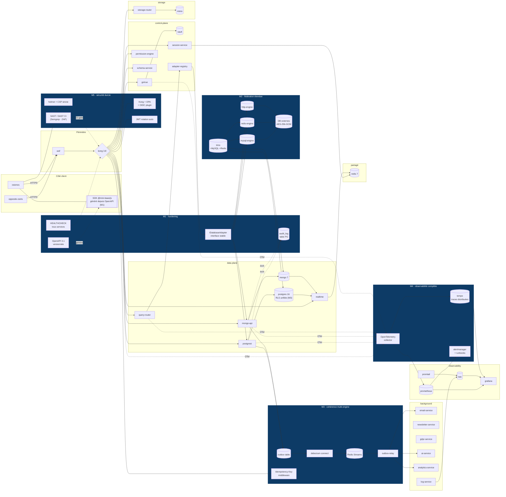
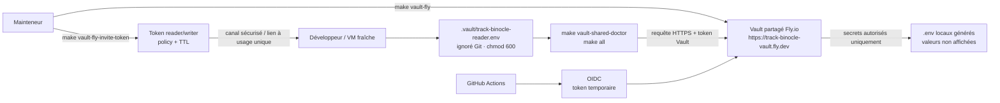
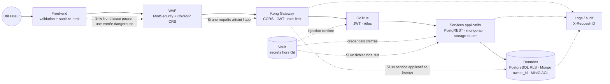

# Osionos - Dossier Projet

> Osionos a été pensé à l'image d'une fourmilière : organisée, structurée, et animée par une volonté collective d'atteindre un objectif commun. Lorsqu'on regarde en accéléré une vidéo d'une galerie souterraine, on voit les fourmis se déplacer rapidement, transporter des matériaux, communiquer entre elles. L'architecture de ces galeries est complexe, avec des tunnels et des chambres interconnectés qui permettent un déplacement fluide et un stockage efficace des ressources. Un constat s'impose : les fourmis exploitent les ressources de leur environnement pour construire leur habitat. La fourmilière est un écosystème vivant qui s'adapte en permanence à ses conditions. De la même manière, avec mes collègues, nous avons réalisé que créer une application aujourd'hui demande de plus en plus de ressources et de données — et que maintenir cet écosystème implique inévitablement de faire appel à davantage de ressources humaines ou d'IA. Osionos est une plateforme qui cherche à rendre cet équilibre visible, sous une forme accessible et user-friendly.

> Linus Torvalds, créateur de Linux, avait besoin d'un outil de gestion de version pour piloter son propre projet — c'est ainsi que Git est né. De la même manière, nous avons voulu créer un side project suffisamment puissant pour accompagner nos futurs projets.

## Vue d'ensemble

Le projet Osionos est né d'une frustration : nous n'avions pas trouvé d'outil de dashboarding à la fois complet, rapide et agréable à utiliser — quelque chose dans l'esprit de Notion, mais mieux adapté à nos besoins. Outil après outil, nous nous heurtions aux mêmes limitations : manque de personnalisation, performances insuffisantes, intégrations trop rigides. Nous avons donc décidé de créer notre propre solution. Nous sommes pleinement conscients que c'est un projet long terme.

## Usage de l'IA

L'IA est aujourd'hui un élément incontournable dans les projets modernes, et Osionos ne fait pas exception. Nous l'avons intégrée de manière stratégique pour améliorer l'expérience développeur et enrichir notre apprentissage : génération de code, débogage, compréhension de problèmes complexes, documentation normalisée, et analyse critique de l'avancement du projet.

### Les différents profils d'usage

Avant d'entrer dans le détail, voici les différents profils d'usage de l'IA que nous avons identifiés et expérimentés.

| Profil | Origine | Description |
|---|---|---|
| Vibe coder | Andrej Karpathy, 2025 | Délègue entièrement à l'IA, sans lire l'output — il "vibe" avec le résultat |
| AI-augmented developer | GitHub / Stack Overflow surveys | Utilise l'IA comme couche de productivité tout en gardant la maîtrise et la compréhension du code |
| Prompt engineer | Écosystème OpenAI | Spécialiste de la formulation de prompts précis pour obtenir des outputs de qualité — une discipline à part entière |
| Agentic developer / AI orchestrator | Émergent (2024-2025) | Conçoit et supervise des pipelines d'agents IA autonomes multi-étapes ; pense en workflows, pas en complétions individuelles |
| LLM engineer | Communauté ML | Construit au-dessus des LLM (fine-tuning, RAG, evals, inférence) — distinct de l'usage d'un LLM pour écrire du code applicatif |
| No-code / AI-native builder | Communauté produit | Assemble des applications entièrement en langage naturel et outils visuels, sans code traditionnel (Replit Agent, Lovable, etc.) |
| Reviewer / Human-in-the-loop | Communauté DevSecOps | Traite chaque suggestion de l'IA comme une pull request non vérifiée — rien n'est mergé sans audit humain |

Comme nous n'avions aucune idée de ce que nous faisions au départ — et que c'était la première fois que nous devions mener un projet aussi personnalisé — la route a été complexe. Nous avons donc tout testé. Voici nos conclusions.

#### Vibe coding

L'un des pièges dans lequel sont tombés des millions de développeurs juniors est ce que j'appellerais le "vibe coding non intentionnel". La communauté développeur le voit d'un mauvais œil, et à raison : c'est un peu comme posséder une Tesla, activer le pilote automatique, et regarder passivement la route défiler. Jusqu'au moment où quelque chose se passe mal — et là, le temps de réaction est trop lent.

Notre équipe de cinq s'est prêtée à l'expérience pour vraiment comprendre ses limites. Voici ce que nous avons constaté :

1. **Rapidité sans direction.** Le vibe coding génère du code vite, mais sans cap réel. L'output est souvent de mauvaise qualité, le refactoring est inévitable, et la dette technique s'accumule rapidement. Un projet de cette envergure ne peut pas tenir sur cette base.
2. **Des cas d'usage valables malgré tout.** Pour esquisser des idées d'architecture ou amorcer une réflexion, ça peut être utile. Nous l'avons utilisé pour explorer plusieurs pistes de conception — les résultats n'étaient pas convaincants, mais ça a permis de déblayer le terrain rapidement.
3. **Même les grands professionnels l'utilisent ponctuellement.** Le professeur David J. Malan de Harvard l'a mentionné dans une interview, notamment pour la génération de tests unitaires. Preuve que cet outil a sa place, dans un cadre délimité.

En résumé : le vibe coding est un outil, pas un état d'esprit permanent. Bien utilisé — sur des tâches légères et ciblées — il peut faire gagner des heures. Le piège est de l'appliquer là où la rigueur est indispensable.

#### Prompt engineering

Nous avons également testé le prompt engineering pour générer du code de meilleure qualité. Nous avons suivi les recommandations de la communauté : few-shot learning, chaînes de raisonnement, structuration précise des consignes. Résultat : c'est un outil puissant, mais qui demande du temps pour être maîtrisé. La qualité de l'output est directement corrélée à la qualité du prompt.

Quelques ressources qui nous ont été utiles :
- https://www.ibm.com/fr-fr/think/prompt-engineering
- https://www.ibm.com/fr-fr/think/topics/prompt-optimization
- https://www.promptingguide.ai/fr

#### AI assisted / style Copilot

GitHub Copilot est l'exemple emblématique de l'assistance à la programmation : suggestions en temps réel, intégration dans l'éditeur, utile pour les tâches répétitives. Mais il ne remplace pas la compréhension du code — chaque suggestion doit être lue et validée.

Nous avons exploré différents modèles selon les contextes. Le site [Artificial Analysis](https://artificialanalysis.ai/models) publie des benchmarks quotidiens sur les principaux modèles — une référence utile pour choisir le bon outil selon les besoins du moment. Nous avons notamment constaté des différences significatives entre les modèles en termes de vitesse, de coût et de qualité du code produit. Il n'existe pas de modèle universel : chaque situation appelle un choix différent.

#### Developer agentic

Le developer agentic — ou AI orchestrator — est un profil qui va au-delà des assistants classiques. Il conçoit et supervise des pipelines d'agents IA autonomes : une IA génère du code, une autre en vérifie la qualité, une troisième le déploie si les tests passent. On ne pense plus en complétions individuelles, mais en workflows.

C'est un profil exigeant, mais nous avons dû nous en approcher lorsque l'équipe s'est réduite à deux personnes. Nous avons mis en place des agents spécialisés — un pour tester, un pour résoudre les problèmes identifiés — sous supervision constante.

Andrej Karpathy décrit bien ce changement de paradigme : *"on n'écrit plus du code directement 99% du temps. On orchestre des agents IA pour faire le travail, et on se concentre sur la supervision et l'optimisation de ces pipelines."*

Limite principale : le coût en crédits IA est très élevé, ce qui a rapidement freiné notre utilisation à grande échelle.

#### No-code / AI-native builder

Des outils comme Lovable, Replit Agent ou Figma AI permettent de construire des applications entièrement en langage naturel, sans code traditionnel. Nous les avons testés pendant plusieurs semaines. Ils sont puissants pour prototyper rapidement, mais leurs limites sont bien réelles :

- Peu flexibles sur les projets complexes
- Code généré souvent non maintenable
- Dette technique très élevée à long terme
- Lents sur les projets de grande envergure
- Coûteux en crédits IA

#### Reviewer / Human-in-the-loop

Ce profil traite chaque suggestion de l'IA comme une pull request non vérifiée : rien n'est intégré sans audit humain. C'est une approche prudente et efficace pour maintenir la qualité du code tout en profitant de l'assistance de l'IA.

Des expériences dans des communautés comme GitHub ont montré les limites de l'automatisation complète : les suggestions pouvaient être hors sujet, trop génériques, ou saturer les PR — générant de la friction et de la dette technique plutôt que du gain.

---

## Notre philosophie : apprendre avec l'IA sans sacrifier la compréhension

Ce projet est né dans un contexte particulier. Nous sommes une génération qui n'a pas eu le choix de se confronter à l'IA — elle s'est imposée dans nos pratiques, dans nos outils, dans le marché du travail. Ignorer cela aurait été se mettre délibérément en retard.

Mais nous avons voulu être honnêtes avec nous-mêmes sur un point essentiel : **utiliser l'IA ne signifie pas comprendre moins**. Ce projet en est, nous l'espérons, la démonstration.

Nous avons intentionnellement testé tous les profils d'usage décrits ci-dessus — non pas pour trouver la solution de facilité, mais pour comprendre concrètement ce que chacun apporte et ce qu'il coûte. Nous avons touché aux limites du vibe coding, mesuré les gains du prompt engineering, expérimenté l'orchestration d'agents. À chaque fois, nous avons lu ce que l'IA produisait, questionné ses choix, corrigé ses erreurs, et appris de ses approximations.

L'IA nous a souvent obligés à aller plus loin dans notre compréhension qu'un simple cours ne l'aurait fait. Comprendre pourquoi un output est mauvais, c'est comprendre ce que le bon aurait dû être.

Nous tenons à être transparents sur ce sujet parce que nous savons que l'usage de l'IA dans les projets scolaires est un sujet sensible. Notre intention n'a jamais été de contourner l'apprentissage — elle a été de l'aborder différemment, dans une ère où ces outils font déjà partie du quotidien professionnel. Ce projet représente pour nous autant un apprentissage du code qu'un apprentissage de la posture à adopter face à l'IA : curiosité, esprit critique, et responsabilité.

---

## Remerciements

Ce projet n'aurait pas existé sans les personnes qui l'ont porté, dans les moments difficiles comme dans les bons.

Un grand merci à mon équipe pour avoir tenu dans la durée, pour avoir accepté de tester des approches incertaines, et pour avoir continué d'apprendre même quand la route était longue. Chacun a apporté quelque chose d'essentiel — une idée, une solution, une présence dans les moments où on doutait.

Merci à l'école 42, qui nous a appris que l'autonomie et la débrouillardise sont des compétences à part entière. Ce projet en est le reflet.

Merci aux communautés open source, aux auteurs de documentation, aux développeurs qui partagent leurs retours d'expérience en ligne — vous êtes une ressource invisible mais indispensable.

Et enfin, merci à ceux qui liront ce document avec l'œil ouvert et la curiosité de comprendre ce qu'on a vraiment cherché à faire ici.

## CHAPITRE 1 : synthèse des compétences mobilisées

Osionos est un workspace collaboratif de type Notion (pages, blocs, bases de données, agents) qui s'appuie sur un écosystème de services internes assemblés en parallèle. La vue minimale ci-dessous suffit pour situer les compétences mobilisées dans ce chapitre ; le diagramme complet, plan par plan, est donné au [chapitre 2 « Vue d'ensemble des connexions entre services »](#vue-densemble-des-connexions-entre-services-état-actuel).

Les compétences mobilisées s'inscrivent dans le référentiel CDA — *Concepteur Développeur d'Applications* — sur les deux activités-types front et back. Le « back » ici n'est **pas** une API Express classique : c'est une infrastructure assemblée à partir de briques production-ready, configurées, durcies et orchestrées par Docker Compose. La justification détaillée de chaque choix est au chapitre 2.

### Activité-type 1 : développer la partie front-end d'une application web sécurisée

Côté front, l'enjeu n'était pas d'écrire le plus de lignes de React possible, mais de tenir une promesse simple : **un utilisateur ouvre Osionos, et tout répond instantanément, même sur une page qui contient un millier de blocs**. Tout part de là — le choix du framework, l'organisation du code, l'accessibilité, jusqu'aux tokens SCSS. Ce que nous avons fait, et avec quoi :

| Compétence CDA | Ce que ça veut dire chez nous | Outils / preuves dans le repo |
|---|---|---|
| **Maquetter une interface** | Penser desktop d'abord (Osionos est un outil de travail dense, pas un feed mobile), traiter l'accessibilité comme une contrainte de design et pas un audit final | Wireframes Figma, design tokens SCSS [`_brand-tokens.scss`](../apps/opposite-osiris/src/styles/abstracts/_brand-tokens.scss), `<dialog>` natif avec focus trap, régions `aria-live`, contraste vérifié |
| **Intégrer des interfaces statiques** | Deux frontends, deux outils choisis pour leur job réel : Astro pour le marketing (HTML statique, SEO), React pour l'app (interactivité dense) | [`apps/opposite-osiris/`](../apps/opposite-osiris/) en Astro 6 + SCSS modulaire ; [`apps/osionos/`](../apps/osionos/) en React 19 + Vite + organisation Feature-Sliced Design |
| **Développer la partie dynamique** | Stores granulaires sans cérémonie Redux, formulaires validés avant tout aller-retour réseau, virtualisation des longues listes | Zustand 5 (`usePageStore`, `useDatabaseStore`), `@tanstack/react-virtual`, SDK `@mini-baas/js`, flux GoTrue (email + magic link + WebAuthn via `@simplewebauthn/browser`) |
| **Sécuriser le front** | Aucune entrée utilisateur n'est rendue sans passer par un sanitizer ; les politiques CSP, SVG et média sont vérifiées par scripts en CI | `sanitize-html`, [`svg-security.mjs`](../apps/opposite-osiris/scripts/svg-security.mjs), [`media-security.mjs`](../apps/opposite-osiris/scripts/media-security.mjs), [`verify-csp.mjs`](../apps/opposite-osiris/scripts/verify-csp.mjs) |

Le fil rouge : **pas de magie côté client**. Chaque comportement non trivial (validation, virtualisation, accès SDK) est traçable dans un fichier précis, testable et lisible par un humain.

### Activité-type 2 : développer la partie back-end d'une application web sécurisée

Côté back, le pari assumé est de **ne pas réécrire ce qui existe déjà** : la communauté open source a produit des briques (PostgREST, GoTrue, Kong, Vault) plus sûres et plus rapides que ce qu'on aurait pu produire en quelques mois. Notre travail a été de les **assembler, durcir, orchestrer**, et de combler les trous avec une poignée de micro-services NestJS sur mesure.

| Compétence CDA | Ce que ça veut dire chez nous | Outils / preuves dans le repo |
|---|---|---|
| **Modéliser et gérer la base de données** | Schéma PostgreSQL avec contraintes + index + RLS pour rendre la sécurité inviolable depuis l'app ; MongoDB pour le semi-structuré avec `owner_id` automatique | [`models/user.sql`](../models/user.sql), [`models/auth-security-migration.sql`](../models/auth-security-migration.sql), [`models/gdpr-migration.sql`](../models/gdpr-migration.sql), service `mongo-api` |
| **Développer les composants d'accès aux données** | Pas d'ORM : PostgREST génère l'API REST depuis le schéma → zéro glue, zéro injection SQL ; pour Mongo, façade NestJS dédiée | `postgrest` 12.2.3, `mongo-api` (NestJS), `adapter-registry` qui chiffre les credentials externes en AES-256-GCM (scrypt) |
| **Développer les composants métier** | La logique vit là où c'est le plus sûr : autorisation/propriété dans la base (RLS + PL/pgSQL), coordination événementielle dans des services dédiés | Politiques RLS PG, `email-service` (templates `account-created`, `password-reset`…), `realtime-agnostic` (WebSocket Rust), `storage-router` (URLs présignées MinIO) |
| **Sécuriser la stack** | Défense en profondeur : WAF en amont, secrets jamais dans Git, certificats locaux proches prod, audit en cours d'extension | WAF nginx + ModSecurity + OWASP CRS, [HashiCorp Vault](https://www.vaultproject.io/) + [`vault-env.mjs`](../apps/baas/scripts/vault-env.mjs), `generate-localhost-cert.sh`, `trust-localhost-cert.sh` |
| **Déployer et documenter** | Une commande `make` doit suffire à tout monter, qu'on soit un nouvel arrivant ou la CI ; chaque décision a une note écrite | Docker Compose + profils (`extras`, `observability`, `track-binocle`), `docker-bake.hcl`, [`infrastructure/makes/`](../infrastructure/makes/), images sur GHCR + Docker Hub, [`wiki/ARCHITECTURE.md`](ARCHITECTURE.md), [`wiki/vault-security-model.md`](vault-security-model.md) |

Le fil rouge ici : **le moindre privilège est encodé au plus bas niveau possible**. Quand PostgreSQL peut refuser une lecture grâce à RLS, on ne fait pas de `if (user.id === resource.owner)` en TypeScript — on laisse la base décider. C'est cette discipline qui rend la stack défendable face à un audit, pas l'accumulation de couches applicatives.

### Compétences transverses

Au-delà des deux activités-types, le projet a mobilisé des compétences peu visibles mais structurantes :

| Domaine | Ce qu'on a mis en place | Pourquoi c'était nécessaire |
|---|---|---|
| **Observabilité** | Prometheus (métriques), Grafana (dashboards), Loki + Promtail (logs) | Rendre la stack auditable plutôt qu'opaque — un service muet est un service qu'on ne peut pas exploiter en confiance |
| **Tests** | Playwright (E2E osionos), Newman/Postman (contrats API), scripts CTF maison ([`scripts/security/ctf/`](../apps/opposite-osiris/scripts/security/ctf/)), suite 16 phases côté BaaS | Un filet de sécurité avant chaque merge ; sans cela, refactorer une stack à 46 services devient suicidaire |
| **Gestion de version et release** | Monorepo, conventions de branche, versionnage sémantique des images (`mini-baas/*:0.0.1`), tags Git alignés sur les releases d'images | Pouvoir revenir en arrière proprement, et tracer ce qui tourne en prod à chaque instant |
| **Posture vis-à-vis de l'IA** | Usage assumé et tracé de l'assistance IA, lecture critique du code produit comme règle | Apprendre vite sans déléguer la compréhension — voir la section *Usage de l'IA* en début de dossier |

## CHAPTITRE 2: Présentation du projet
### Présentation de l'entreprise et du service
j'ai effectué mon projet d'application dans le contexte de l'école 42, originellement appelé "ft_transcendence". Un projet qui a évolyé pour devenir "Osionos", une plateforme de dashboarding collaboratif. L'objectif était de créer un outil à la fois complet, rapide et agréable à utiliser, en s'inspirant de Notion mais avec une personnalisation, performances et scalabilité plus poussé. Permettant de travailler avec de vrai données.

C'est un travail de Groupe, j'ai donc décider de former mon équipe en Février 2026. Durant cette phase de formation d'équipe, nous avons défini les rôles et responsabilités de chacun, ainsi que les objectifs à atteindre pour le projet. Nous avons également établi une communication régulière en pratiquand les méthodes agiles. On a particulièrement utilisé Scrumban étant un concept hybride entre Scrum et Kanban, qui nous a permis de bénéficier de la structure de Scrum tout en conservant la flexibilité de Kanban.
Mon expérience s'est déroulé dans un environnement exigeant, marqué par la necessité d'adhérer strictement aux méthodologies de développement et aux normes de sécurité d'un grand groupe.

### Cahier des charges du projet:
#### a. contexte et objectifs
Le projet Osionos a été initié pour pallier les lourdeurs d'un processsus de création de dashboard. Cette frustration a été le moteur de notre volonté de créer une plateforme qui rendrait la création de dashboard plus rapide, plus flexible et plus agréable à utiliser. Comme on l'a dit auparavant, cette plateforme fonctionne comme une fourmilière. En terme de vision pure, on voyait ce projet plus comme une sorte de red sociale géante fait pour le travail. Collaboratif. Il faut imaginer un espace de travail où les utilisateurs ppourront travailler dans un espace public et un espace privée. L'espace public permettra d'accepter un traffic plus ou moins dense de changement de laisser gérer l'administrateur..

voici quelques examples de fonctionnalités que nous avons imaginé pour Osionos:
- **Pages et blocs** : les utilisateurs peuvent créer des pages et les remplir avec des blocs de contenu (texte, images, tableaux, etc.) pour construire leur dashboard.
- **dashboarding** : à l'aide de `/dashboard` ou `/layout` ou bien encore directemetn depuis le `/database`, les utilisateurs peuvent créer des vues personnalisées de leurs données, avec des filtres, des tris, et des options de visualisation avancées. L'idée ici est que l'on veut pouvoir dans le temps proposer aux gens des formes préétablis mais s'ils veulent pourront ajouter les leurs à travers le code ou même au travers de plugins
- **home**: c'est le dashboard d'accueil, entièrement personnalisable, où les utilisateurs peuvent épingler leurs pages et bases de données préférées pour un accès rapide. L'idée est que ce dashboard d'accueil puisse être partagé entre les membres d'un même workspace, pour créer une sorte de point de ralliement commun. On va aussi s'inspirer de ce qu'Obsidian a fait avec son "graph view" pour proposer une visualisation de l'ensemble des pages et de leurs interconnexions. Pour faire les nodes et les edges on ce basera sur la librairie d3.js, qui est très puissante pour ce genre de visualisation. Comme dans linux tout est une archive... Dans notre système tout est une donnée. Chaque donnée peut prendre des formes distintes (page, bloc, base de données, etc.) et être reliée à d'autres données. L'idée est que le graph view puisse représenter visuellement ces connexions, pour aider les utilisateurs à naviguer dans leur espace de travail et à découvrir des relations entre leurs données.
- **bases de données** : les utilisateurs devraient pouvoir connecter leurs bases de données (PostgreSQL, MongoDB, etc.) à Osionos pour visualiser et interagir avec leurs données en temps réel. L'idée est que les utilisateurs puissent créer des vues personnalisées de leurs données, avec des filtres, des tris, et des options de visualisation avancées. On veut aussi permettre aux utilisateurs de créer des dashboards à partir de ces données, pour suivre les indicateurs clés de performance (KPI) et prendre des décisions éclairées.
- **note**: bien sure ce système est plus ou moins facile de reproduire ce que font notion. La difficulté réside plus dans l'infrastructure que dans la fonctionnalité en elle même.
- **wiki**: ici le constat et que notion est beaucoup trop lent. Ne peut pas charger de longue page. Obsidian est plus rapide mais n'est pensé que pour faire des notes. L'aspect général d'Obsidian reste très austère, très bon outil pour un usage professionnelle mais trop spécifique. Donc on a eu l'idée de gérer en infrastructure une manière que l'on peut avoir une database statique et une database dynamique. Vscode est sruremnt l'un des outils graphiques les plus rapides et les plus polyvalent mais pas adapté pour tous. L'avantage que j'y vois c'est que l'on peut casiment tout faire avec le clavier et réduire les frictions liés à l'usage de la souris. Donc le wiki sera basé sur toutes ces frictions. Le but c'est que ca soit beacuoup plus rapide que Notion, plus agréable à utiliser qu'Obsidian, et plus accessible que Vscode. Tout en utilisant de vrai donné et en laissant les users faire le choix d'écrire en brut ou convertir directemetn les valeurs dans notre propre markdown en bloc ou en inline.

##### Objectifs

Le projet Osionos poursuivait trois objectifs majeurs et distincts, chacun rattaché à un profil utilisateur précis et à un problème mesuré dans les outils existants (Notion, Obsidian, VS Code, Confluence).

1. **Pour l'utilisateur final — unifier la note, la base de données et le dashboard dans un espace de travail rapide et pilotable au clavier.** Il fallait que la même page puisse contenir du texte libre, une vue tabulaire connectée à une vraie base, un graphe de liens, et un dashboard de KPI, sans changer d'outil ni attendre qu'une page de mille blocs se charge. La cible chiffrée : ouvrir n'importe quelle page en moins d'une seconde, peu importe sa taille.

2. **Pour l'administrateur de workspace — disposer d'un contrôle fin et auditable sur l'espace partagé.** Le Planificateur d'un workspace devait pouvoir définir qui voit quoi (public / privé / partagé), gérer les rôles, brancher *ses propres* bases de données externes (PostgreSQL, MongoDB, plus tard MySQL et HTTP), et retrouver dans un journal d'audit toute opération critique. Aucun secret en clair, aucune action sans trace.

3. **Pour l'équipe projet — consolider la fiabilité générale en centralisant l'authentification, les permissions, l'audit et l'observabilité de toute la plateforme.** Plutôt que ré-écrire dix couches de sécurité, on s'est appuyé sur des briques éprouvées (GoTrue pour les JWT, PostgREST pour la RLS, Vault pour les secrets, Kong pour l'ingress) assemblées et durcies — chaque service tournant en non-root, dans son container, derrière une seule passerelle.

Chaque choix technique décrit dans la section suivante a été validé non seulement pour sa capacité à délivrer ces trois objectifs, mais également pour sa **résilience** (capacité à survivre à la panne d'un voisin) et sa **sécurité par construction** (pas de vérification applicative quand la base peut le faire elle-même).

##### Architecture de la solution et choix techniques

Avant d'expliquer ce que nous avons construit, il faut dire d'où on est partis. Au début du projet, on avait une feuille blanche et une intuition : "on veut faire un Notion, mais qui sait parler à n'importe quelle base de données, sans rien casser quand on change d'avis sur l'infrastructure". C'est cette intuition qui a piloté chaque décision technique. À chaque carrefour, on a choisi l'option qui gardait deux portes ouvertes : celle de l'expérimentation rapide pour l'équipe, et celle d'une éventuelle mise en production sérieuse.

Le reste de cette section décrit, dimension par dimension, *ce que nous avons choisi* et surtout *pourquoi nous en sommes arrivés là* — y compris les chemins que nous avons abandonnés en cours de route.

###### Côté back-end

**a. Micro-services, tout en Docker**

Notre premier réflexe a été le plus classique : un monolithe Node/Express avec une base PostgreSQL. C'est ce qu'on connaissait, c'est ce qu'on voit dans 90 % des tutos. On a tenu deux semaines. Le problème est apparu très vite : dès qu'on a voulu ajouter MongoDB pour les blocs flexibles d'Osionos, puis Redis pour le cache, puis MinIO pour les fichiers, le monolithe a commencé à ressembler à un sac de nœuds où chaque dépendance tirait sur les autres. Un bug dans la couche fichiers faisait tomber l'auth. Un redémarrage pour ajouter une variable d'environnement coupait toute l'app.

On a fait marche arrière et on a posé une règle simple : **chaque responsabilité a son container, chaque container a son Dockerfile, et personne ne tourne en root**. À partir de là, la stack a commencé à se dessiner naturellement — une brique pour l'auth (GoTrue), une pour la base relationnelle (PostgreSQL), une pour les documents (MongoDB), une pour le cache (Redis), une pour les fichiers (MinIO), une pour la passerelle (Kong), et une série de micro-services NestJS pour la logique qui nous appartient en propre (mongo-api, query-router, storage-router, permission-engine, gdpr-service, etc.). Chaque service est isolé, redémarrable indépendamment, et pinné par version ou par digest SHA — pas de surprise à la prochaine mise à jour upstream.

Le déclic, c'était de comprendre que **ne pas réécrire ce qui existe déjà** est en soi une compétence. On n'allait pas refaire un PostgREST ou un GoTrue qui sont meilleurs que ce qu'on aurait pu produire en deux mois. On les a assemblés et durcis.

**b. Fédération de données**

La vraie ambition d'Osionos, c'est de laisser un utilisateur connecter *sa* base de données, qu'elle soit PostgreSQL, MongoDB, MySQL ou autre, et de naviguer dedans comme s'il s'agissait d'une page Notion. Au début on a tenté l'approche naïve : un connecteur par engine, codé en dur dans le front. Ça marchait pour un, douloureux pour deux, intenable pour trois.

On s'est rendu compte qu'on était en train de réinventer un problème connu : c'est exactement ce que résolvent les **moteurs de fédération SQL**. On a évalué Presto, Trino, Apache Drill, et même quelques options propriétaires. On a retenu **Trino** pour deux raisons : il est open source, et il sait lire PostgreSQL et MongoDB *avec la même syntaxe SQL*, ce qui ouvre la voie à des requêtes qui joignent les deux mondes — quelque chose qui aurait demandé des semaines de glue code chez nous.

Mais Trino, c'est un moteur **analytique**, pas transactionnel. Pour les opérations métier classiques (créer un bloc, modifier une page), on avait besoin d'un chemin court et sécurisé. On a donc construit un service maison, le **query-router**, qui prend une description abstraite de requête (`list`, `insert`, `update`, etc.) et la traduit vers le bon engine via des adapters spécialisés. La beauté de l'approche, c'est qu'**ajouter un nouvel engine ne demande qu'un nouvel adapter** — pas de refonte du reste.

**c. Cohérence multi-engine**

Très vite, une question gênante s'est posée : si l'utilisateur écrit dans PostgreSQL et qu'on veut répercuter cette écriture dans MongoDB (par exemple pour mettre à jour une vue dénormalisée), comment on s'assure que les deux restent synchronisés ? La réponse intuitive — "on fait les deux écritures dans la même transaction" — est physiquement impossible dès qu'on traverse deux moteurs différents. C'est un théorème, pas un manque d'effort.

On a regardé comment les grandes plateformes résolvent ce problème. **Supabase, Hasura, AWS** appliquent toutes la même recette : le **pattern outbox**. L'écriture applicative se fait dans une seule base (la "source de vérité"), avec en plus une ligne dans une table d'événements. Un service relais lit ces événements et les rejoue vers les autres systèmes — Mongo, Elasticsearch, webhook externe, etc. On perd l'atomicité immédiate, mais on gagne la **cohérence éventuelle garantie**, plus l'audit et le replay gratuits.

C'est ce qu'on est en train de poser dans la stack, en s'appuyant sur Redis (déjà présent) comme bus d'événements via Redis Streams — pas besoin d'ajouter Kafka. Le choix est volontairement frugal : pas d'infrastructure supplémentaire si on peut s'en passer.

**d. API unifiée et SDK client**

Une plateforme qui expose dix services différents avec dix conventions différentes est ingérable. On voulait que le développeur front (nous-mêmes, en l'occurrence) n'ait qu'**une seule façon** de parler au back, peu importe ce qui se passe en coulisse.

On a regardé les API qu'on aimait utiliser : Supabase, Firebase, PocketBase. Le point commun, c'est un SDK qui ressemble à `client.from('table').select().eq(...)` — proche du SQL, mais portable, typé, et indépendant de l'engine. On a repris cette idée et on l'a câblée à notre query-router. Le résultat, c'est notre SDK `@mini-baas/js`, qui est consommé par les deux frontends d'Osionos sans qu'ils aient à se soucier de savoir si la donnée vient de PostgreSQL, de Mongo ou d'une base externe enregistrée par l'utilisateur.

Côté gateway, on a choisi **Kong en mode déclaratif YAML**, sans base de données. C'est plus rigide qu'un Kong classique, mais ça veut dire que toute la configuration d'ingress vit dans Git, donc reviewable et reproductible. Un nouveau route ne se déploie pas par un clic dans une UI, il passe par une pull request — c'est exactement la garantie qu'on cherchait.

**e. Sécurité et observabilité intégrées**

Deux principes directeurs ont émergé. Sur la sécurité, le **moindre privilège est posé au plus bas niveau possible** : elle ne vit pas dans des `if` dispersés dans le code, elle vit dans la base via les politiques RLS de PostgreSQL. Même si toute la couche applicative était contournée, PostgreSQL refuserait la lecture. Sur les secrets, on a très vite quitté les `.env` versionnés au profit de **HashiCorp Vault** dès qu'on a commencé à manipuler des credentials de bases externes — un `.env` en git était un risque inacceptable.

Sur l'observabilité, l'équipe a passé suffisamment de nuits à débugger en aveugle pour en faire une priorité. **Prometheus + Grafana + Loki + Promtail** sont en place aujourd'hui ; les traces distribuées (OpenTelemetry + Tempo) sont planifiées en M4 — l'architecture est déjà câblée pour les accueillir.

Le détail des couches de défense et des outils est consolidé plus bas dans la section [Stratégie de sécurisation](#stratégie-de-sécurisation).

**f. Outillage de développement et de déploiement**

Une stack à 46 containers devient incompréhensible sans bons outils. On a investi délibérément dans l'outillage **dès le départ**, en suivant trois principes : **tout est dans Docker Compose** (un nouveau dev fait `make baas-up` et a la stack en deux minutes), **tout est testable en local** (seize scripts de tests phasés validant auth, RLS, isolation, storage, realtime, etc.), **tout est reproductible** (`docker-bake.hcl` multi-arch, digests pinnés, migrations idempotentes).

On a délibérément résisté à Kubernetes : tant que la stack tient sur une machine en Docker Compose, on garde la complexité minimale. La liste complète des outils est dans la section [Outillage de développement](#outillage-de-développement).

**g. Auditabilité et traçabilité**

Le dernier choix qui structure tout le back est moins glamour mais peut-être le plus important : **tout ce qui se passe dans la plateforme doit pouvoir être expliqué après coup**. Chaque requête HTTP reçoit un `X-Request-ID` à l'entrée de Kong, propagé jusqu'à la base. Chaque migration est numérotée et tracée. La table `audit_log` (qui garde acteur, action, ressource, payload) est en cours de généralisation à toutes les écritures (jalon M1) — combinée aux logs Loki, elle donne une plateforme où *« que s'est-il passé à 14h32 hier pour l'utilisateur X ? »* devient une question à une minute, pas à une journée.

Cette discipline de la trace est une discipline de **respect du futur de l'équipe** : on sait qu'on oubliera, et on construit la mémoire de la plateforme pendant qu'on a encore le contexte en tête.

###### Côté front-end

Le front a été pensé avec une logique différente du back, parce que la contrainte n'est pas la même : sur le front, l'ennemi numéro un n'est pas la cohérence des données, c'est la **friction de l'utilisateur**. Une page qui met une seconde de trop à répondre, c'est un utilisateur perdu. Une interface qu'on ne comprend pas, c'est un projet abandonné.

**Deux frontends, deux philosophies**

On s'est retrouvés très tôt à avoir besoin de deux choses très différentes : (1) un site **marketing** rapide à charger, bien référencé, sobre, qui présente Osionos au monde — c'est `opposite-osiris` ; (2) une **application produit** dense, interactive, en quasi temps réel, qui ressemble à un IDE plus qu'à un site — c'est `osionos`. Vouloir résoudre les deux avec la même stack aurait été une erreur.

Pour le marketing, on a choisi **Astro**. La raison est simple : Astro produit du HTML statique par défaut et ne sert du JavaScript que quand c'est strictement nécessaire (le fameux "islands architecture"). Pour un site dont l'objectif est de charger vite et d'être bien indexé par les moteurs de recherche, c'est le choix le plus rationnel disponible aujourd'hui. On a accepté de ne pas avoir l'écosystème React pour ça — et c'était la bonne décision.

Pour l'application produit, on est partis sur **React 19 + Vite**. React parce que c'est ce que l'équipe maîtrise, qu'on trouve facilement de la doc et que l'écosystème (tanstack, simplewebauthn, etc.) est sans rival. Vite parce qu'après avoir souffert sur Webpack et Create-React-App dans d'autres projets, on n'avait plus envie d'attendre trente secondes à chaque sauvegarde. Vite démarre en une seconde et recompile en moins de cent millisecondes — c'est non négociable quand on développe une UI complexe.

**Pourquoi pas Next.js**

La question est revenue trois fois pendant la conception : "et si on faisait tout en Next.js, marketing et app, dans un seul projet ?". On a creusé, et on a écarté. Trois raisons :

1. Next.js force une certaine vision du rendu (SSR / RSC) qui complique l'intégration avec notre BaaS auto-hébergé. On voulait un client qui parle à *notre* gateway, pas un framework qui présuppose Vercel.
2. Le coût d'apprentissage des React Server Components nous semblait disproportionné par rapport au gain pour une équipe de cinq devenue deux.
3. Séparer marketing (statique) et app (SPA) nous donne deux pipelines de build plus simples, deux scopes mentaux clairs, et la possibilité d'itérer sur l'un sans casser l'autre.

**State management : Zustand plutôt que Redux**

On a tenté Redux Toolkit au début. C'est puissant, mais c'est aussi trois fichiers à toucher pour ajouter un champ à un store. À l'échelle d'Osionos (des dizaines d'états : page courante, bloc en édition, filtres, vues, sélection multiple, etc.), la friction devenait insupportable. On a migré vers **Zustand**, qui tient en une fonction par store et qui colle au modèle mental de React. On a payé ce choix par l'obligation de discipliner nos sélecteurs (React 19 est strict sur les snapshots stables) — mais c'est un compromis que l'équipe a accepté.

**Architecture en Feature-Sliced Design**

Quand on a réalisé qu'on allait dépasser cent composants, on a posé une architecture explicite : **Feature-Sliced Design**. C'est une convention publique qui range le code en couches (`entities`, `features`, `widgets`, `pages`, `app`) avec des règles strictes sur qui a le droit d'importer qui. Le bénéfice s'est vu immédiatement : on ne se demande plus *où* mettre un nouveau composant, la convention répond. Et un nouveau membre de l'équipe sait lire la structure sans qu'on ait à lui expliquer.

**Le SDK comme contrat**

Le front ne parle jamais directement à PostgreSQL ou à Mongo. Il parle à notre SDK `@mini-baas/js`, qui parle à Kong, qui dispatche vers le bon service. C'est volontaire : ça veut dire que **changer le back ne casse pas le front**, tant que le contrat SDK reste stable. Cette indirection a un coût (une couche supplémentaire à maintenir), mais elle nous a déjà sauvés deux fois : une fois quand on a basculé de Supabase hébergé vers notre BaaS auto-hébergé, et une fois quand on a refondu le format des sessions.

**Accessibilité et performance perçue**

Deux choses qu'on a traitées dès le départ et pas en fin de projet : l'accessibilité et la performance perçue. On a appris en cours de route qu'**ajouter l'accessibilité à la fin coûte dix fois plus cher que de la penser dès le départ** — et que la même chose vaut pour la performance. Les techniques concrètes (virtualisation, code splitting, suspense, tokens ARIA, focus trap) sont décrites dans la section [Performance et qualité du code](#performance-et-qualité-du-code).

---

En résumé, l'architecture d'Osionos n'a pas été conçue d'un seul jet sur un tableau blanc. Elle s'est construite par accumulation de décisions, chacune prise en réaction à un mur réel qu'on a rencontré. C'est probablement ce qui en fait sa cohérence : il n'y a quasiment aucune couche qu'on n'aurait pas pu justifier par un problème concret qu'on a vécu.

###### Synthèse des choix de stack

Plutôt que de dérouler un catalogue, le plus simple est de raconter la stack par grandes familles, parce que chaque famille répond à une question précise qu'on s'est posée au démarrage.

Côté **interfaces utilisateur**, on a séparé le site qui présente Osionos et l'application qu'on utilise. Le site marketing est en **Astro**, parce qu'il doit charger vite et bien se référencer ; l'application est en **React 19 + Vite**, parce que c'est ce qui nous permet de tenir un éditeur dense sans devenir lent. Entre les deux, on partage un **SDK interne `@mini-baas/js`** : c'est lui qui parle au back, et c'est lui qui garantit qu'on peut changer une brique côté serveur sans casser le front. L'état côté navigateur passe par **Zustand**, l'organisation du code par **Feature-Sliced Design**, et l'authentification sans mot de passe par **WebAuthn**.

Côté **cœur du BaaS**, on a assumé de ne pas réécrire ce qui existe déjà : **Kong** comme seul point d'entrée, **GoTrue** pour l'authentification, **PostgREST** pour exposer PostgreSQL en REST avec la RLS comme garde-fou final, et **PostgreSQL** comme source de vérité. À côté, **MongoDB** sert pour les blocs semi-structurés, avec une façade maison `mongo-api` qui injecte automatiquement le propriétaire depuis le JWT. **Redis** sert de cache et de futur bus d'événements. **MinIO** stocke les fichiers, et notre `storage-router` génère des URLs présignées pour que les uploads ne traversent jamais nos services.

Autour, on a écrit une **poignée de services NestJS** qui portent la logique qui nous appartient : `query-router` pour dispatcher les requêtes vers le bon moteur, `permission-engine` pour centraliser les règles, `session-service` pour le cycle de vie des sessions, `schema-service` pour l'introspection multi-moteur, `gdpr-service` pour l'export et l'anonymisation, plus quelques services utilitaires (logs, mail, newsletter, IA, analytique). **Trino** vient se brancher en lecture sur PostgreSQL et MongoDB pour permettre des requêtes analytiques cross-moteur sans casser le chemin transactionnel.

Enfin, la **sécurité et l'exploitation** s'appuient sur un **WAF nginx + ModSecurity** en amont de Kong, **HashiCorp Vault** pour les secrets, le **chiffrement AES-256-GCM** pour les credentials de bases externes, et **Prometheus, Grafana, Loki, Promtail** pour l'observabilité. Tout est **orchestré en Docker Compose**, buildé via `docker-bake.hcl`, publié sur GHCR et Docker Hub avec digests pinnés, et validé par une suite de tests système en seize phases avant tout merge.

Les tableaux ci-dessous servent surtout de référence rapide ; ils ne sont pas censés se lire en entier d'un coup.

*Front-ends et SDK*

| Brique | Rôle |
|---|---|
| Astro 6 | Site marketing statique, SEO |
| React 19 + Vite 6 | Application produit interactive |
| Zustand 5 | État côté navigateur, sans boilerplate |
| Feature-Sliced Design | Organisation du code par couches |
| `@mini-baas/js` | Contrat stable front ↔ back |
| `@simplewebauthn/browser` | Login passkey FIDO2 |

*Cœur du BaaS*

| Brique | Rôle |
|---|---|
| Kong 3.8 (DB-less) | Seul point d'entrée, routes, JWT, rate-limit, CORS |
| GoTrue 2.188 | Authentification, JWT, sessions |
| PostgREST 12 | REST automatique sur PostgreSQL avec RLS |
| PostgreSQL 16 | Source de vérité, RLS, migrations |
| MongoDB 7 + `mongo-api` | Blocs semi-structurés, `owner_id` depuis le JWT |
| Redis 7 | Cache, sessions, futur bus d'événements |
| MinIO + `storage-router` | Fichiers, URLs présignées, ACL |
| `realtime-agnostic` (Rust) | WebSocket, WAL PG + change streams Mongo |
| `query-router`, `permission-engine`, `session-service`, `schema-service`, `gdpr-service`, etc. | Services NestJS internes |
| Trino 467 | Requêtes analytiques cross-moteur |

*Sécurité, exploitation, qualité*

| Brique | Rôle |
|---|---|
| WAF nginx + ModSecurity + OWASP CRS | Filtrage HTTP en amont de Kong |
| HashiCorp Vault | Stockage chiffré des secrets |
| AES-256-GCM + scrypt | Chiffrement des credentials de bases externes |
| Prometheus, Grafana, Loki, Promtail | Métriques, logs, dashboards |
| Docker Compose + `docker-bake.hcl` | Orchestration locale, build multi-arch |
| GHCR + Docker Hub | Distribution des images, digests pinnés |
| Suite 16 phases | Tests système avant merge |

###### Scène de connexion : du clic au session token

Le schéma ci-dessous suit *un* utilisateur qui ouvre le site marketing `opposite-osiris`, clique sur "Se connecter", arrive sur `osionos`, s'authentifie, et reçoit la session qui lui ouvre son espace de travail. Chaque flèche est une interaction réelle ; chaque service intervient à un moment précis pour une raison précise.

**Lecture du schéma** : l'utilisateur ne parle jamais directement à une base. Tout passe par **WAF → Kong**, qui est le seul point d'entrée. Kong attribue un `X-Request-ID` dès la première requête, propagé jusqu'à PostgreSQL et tracé par `log-service`. **GoTrue** valide les credentials, signe un JWT avec une clé fournie par **Vault** (jamais en clair dans un `.env`). **session-service** matérialise la session dans **Redis** pour permettre la révocation immédiate. Sur la requête métier qui suit, le JWT est rejoué : **PostgREST** le passe à **PostgreSQL**, qui applique automatiquement la **RLS** (`auth.uid() = owner_id`) — la sécurité finale est dans la base, pas dans le code applicatif.

###### Vue d'ensemble des connexions entre services (état actuel)

Le schéma ci-dessous reflète l'état réel du `docker-compose.yml` de [mini-baas-infra](../apps/baas/mini-baas-infra/docker-compose.yml) au moment de la rédaction. Les services sont regroupés par **plan d'exécution** (Compose profiles) : `control-plane`, `data-plane`, `adapter-plane`, `background`, `storage`, `analytics`, `observability`.

**Comment lire ce schéma** :

1. **Côté client** — deux frontends indépendants partagent le SDK `@mini-baas/js`. Aucun appel direct à la donnée depuis le navigateur.
2. **Périmètre réseau** — toute requête traverse `waf` (filtrage OWASP CRS) puis `kong` (routage, JWT, rate-limit, CORS). Seul point d'entrée public.
3. **`control-plane`** — gouvernance : `gotrue`, `vault`, `session-service`, `permission-engine`, `schema-service`, `pg-meta`, `adapter-registry`, `studio`.
4. **`data-plane`** — engines et leurs façades : `postgres` derrière `postgrest`, `mongo` derrière `mongo-api`, `realtime` qui écoute WAL + change streams, `supavisor` qui pool PG.
5. **`adapter-plane`** — `query-router` consulte `adapter-registry` pour dispatcher CRUD vers le bon engine.
6. **`storage`** — `storage-router` parle à `minio` et chiffre les credentials via Vault.
7. **`background`** — services à durée de vie longue : `email-service`, `newsletter-service`, `gdpr-service`, `ai-service`, `analytics-service`, `log-service`.
8. **`analytics`** — `trino` avec catalogs PG + Mongo, pour requêtes analytiques cross-engine.
9. **`observability`** — `prometheus`, `grafana`, `loki`, `promtail`. **Les traces distribuées (Tempo/OTel) ne sont pas encore en place**, voir la cible 10/10 ci-dessous.

La règle de circulation reste la même : **les flèches descendent toujours du moins privilégié vers le plus privilégié**. Le client ne connaît que Kong, Kong ne connaît que les services applicatifs, les services applicatifs ne connaissent que leur engine. Une compromission d'un étage ne propage pas au suivant sans franchir une nouvelle barrière (JWT, RLS, ACL MinIO, secret Vault).

###### Cible 10/10 — à quoi ressemblera l'infrastructure une fois les milestones M1-M5 livrées

Le schéma ci-dessous représente l'**état cible** une fois les cinq jalons décrits dans [wiki/todo/README.md](todo/README.md) réalisés. Les nouveautés par rapport à l'état actuel sont regroupées dans les sous-graphes `M1` à `M5`. Tout ce qui apparaît en dehors de ces blocs existe déjà aujourd'hui.

**Ce que les milestones ajoutent concrètement** :

| Jalon | Apport sur le schéma | Pourquoi c'est nécessaire pour passer à 10/10 |
|---|---|---|
| **M1 · hardening** | `HEALTHCHECK` sur tous les services, interface `IDatabaseAdapter`, spec OpenAPI 3.1 versionnée, table `audit_log` PG | Rendre la stack auto-décrite (Compose ne tolère plus de service muet) et tracer chaque écriture |
| **M2 · fédération étendue** | `mysql-engine`, `redis-engine`, `http-engine` + catalogs Trino correspondants, registre de DB externes chiffrées | Tenir la promesse "connecte n'importe quelle base", pas seulement PG + Mongo |
| **M3 · cohérence multi-engine** | Table `outbox`, `debezium connect`, `Redis Streams` comme bus, `outbox-relay`, middleware `Idempotency-Key` | Garantir la cohérence éventuelle entre engines sans rouler de transaction distribuée |
| **M4 · observabilité complète** | Collecteur **OpenTelemetry**, **Tempo** pour les traces distribuées, **Alertmanager** + runbooks | Pouvoir suivre une requête de bout en bout (Tempo absent aujourd'hui) et être alerté avant l'utilisateur |
| **M5 · sécurité durcie** | Plugins Kong **OPA** + **OIDC**, **helmet** + CSP stricte côté front, **rotation JWT** automatique, **SAST/DAST** en CI (Semgrep + ZAP) | Passer d'une sécurité par défaut acceptable à une sécurité par construction auditée |

Les briques **déjà présentes** (gateway, auth, RLS, Vault, observabilité partielle, fédération PG/Mongo, Trino, GDPR, audit applicatif léger) ne sont pas remplacées : elles sont **complétées et durcies**. Aucun jalon ne demande de réécriture, seulement des ajouts ciblés — c'est ce qui rend le chemin vers 10/10 réaliste à effectif constant.

##### Outillage de développement

À effectif réduit — cinq au départ, deux à la fin — on n'avait pas le luxe de jongler avec dix chaînes d'outils différentes. On a donc tout fait passer par le même socle, en s'imposant une règle simple : si une commande ne s'exécute pas pareil sur ma machine, sur celle d'un coéquipier et dans la CI, c'est qu'elle n'est pas finie.

Le socle commun, c'est **Docker Compose**. Toute la stack — front, BaaS, observabilité, outils — démarre depuis le même `docker-compose.yml`, avec des builds multi-architecture orchestrés par `docker-bake.hcl` et publiés sur GHCR et Docker Hub avec des digests SHA pinnés (jamais de tag flottant). Par-dessus, un **Makefile** sert de façade unique : `make baas-up`, `make baas-test`, `make osionos-dev`, `make certs-doctor`. Un nouveau membre n'a pas besoin de connaître chaque service pour être productif, il a besoin de connaître les cibles `make`.

Les outils applicatifs sont volontairement homogènes en **TypeScript**. Le front produit utilise React 19 + Vite 6, parce qu'on voulait du HMR quasi instantané et des tests end-to-end fiables avec Playwright. Le site marketing utilise Astro 6, parce qu'il doit charger vite et bien se référencer. Les micro-services métier sont en NestJS, parce que le format module/contrôleur/service donnait un cadre clair sans imposer une architecture trop lourde. Les dépendances sont gérées en `pnpm` avec workspaces, ce qui nous évite de recompiler dix fois la même chose en CI.

La qualité statique passe par **ESLint, Prettier et SonarQube** sur tous les paquets TypeScript, et **Renovate** ouvre des PR de mise à jour groupées chaque semaine pour qu'on ne se laisse pas distancer par les versions. La qualité dynamique passe par une **suite de tests système organisée en seize phases** (sous [apps/baas/mini-baas-infra/scripts/](../apps/baas/mini-baas-infra/scripts/)) qui valide bout à bout l'authentification, la RLS, l'isolation par utilisateur, le cycle de vie des JWT, le storage, le realtime, le rate-limit et le CORS. La règle est simple : pas de merge sur `main` sans `make baas-test` vert.

##### Stratégie de sécurisation

La sécurité d'Osionos n'a pas été ajoutée à la fin comme un vernis ; elle est posée par couches successives, avec une règle constante : si l'une cède, la suivante doit encore tenir. C'est ce qu'on appelle la défense en profondeur, et concrètement ça donne quatre paliers.

Le premier palier est **en périphérie**. Un WAF nginx équipé de ModSecurity et des règles OWASP CRS examine chaque requête avant même qu'elle n'atteigne nos services : injections SQL, XSS connues, scanners agressifs et anomalies de protocole sont filtrés en amont. Juste derrière, Kong porte le rate-limit, le CORS, la validation des JWT et la propagation d'un `X-Request-ID` qu'on retrouve jusque dans les logs de la base.

Le deuxième palier concerne **l'identité**. C'est GoTrue qui émet les JWT, avec une clé de signature stockée dans HashiCorp Vault — jamais dans un `.env` versionné. Les mots de passe sont hachés côté GoTrue, et nous avons aussi câblé la WebAuthn (passkeys) sur le site marketing pour offrir une voie sans mot de passe. Quand un utilisateur connecte sa propre base de données externe, ses credentials sont chiffrés au repos en AES-256-GCM avec dérivation scrypt, parce qu'on considère qu'une fuite locale ne doit jamais suffire à compromettre des accès tiers.

Le troisième palier vit **dans les données elles-mêmes**. Côté PostgreSQL, ce sont les politiques RLS qui ont le dernier mot : tant que `auth.uid() = owner_id` n'est pas satisfait, la base refuse de servir une ligne, même si toute la couche applicative était contournée. Côté MongoDB, c'est le service `mongo-api` qui injecte automatiquement `owner_id` à chaque écriture depuis le JWT. Et toutes les requêtes SQL passent soit par PostgREST, soit par des requêtes paramétrées, ce qui rend l'injection SQL structurellement impossible plutôt que simplement « non observée ».

Le dernier palier est **côté front**. Toute entrée utilisateur est validée et passée à `sanitize-html` avant rendu, ce qui neutralise les XSS classiques. Les tokens d'accès vivent en mémoire et dans un cookie `httpOnly` `SameSite=Strict`, ce qui protège des CSRF sur les routes mutantes. L'accessibilité (RGAA) est traitée dès le design — sémantique HTML, contraste, focus visible, navigation clavier complète — et la conformité RGPD est portée par le `gdpr-service`, qui expose réellement les endpoints d'export, d'anonymisation et de suppression, plutôt que d'être un simple sticker dans le pied de page.

Le tout est complété, sans bruit, par les revues de code obligatoires sur GitHub, le scan continu des dépendances via Renovate, et la portion isolation/auth de la suite de tests système qui rejoue régulièrement les scénarios d'attaque les plus courants.

##### Performance et qualité du code

La performance d'Osionos n'est pas un sujet abstrait : un workspace réel peut contenir des milliers de blocs, et il faut que la page reste fluide même dans ce cas. La règle qu'on s'est donnée est qu'aucune page ne doit ramer parce qu'elle est devenue sérieuse.

Le premier levier, c'est la **virtualisation**. Les longues listes — blocs d'une page, lignes d'une vue base de données — passent par `@tanstack/react-virtual`, qui ne rend dans le DOM que ce qui est réellement visible. On peut ainsi faire défiler des milliers d'éléments sans perte de fluidité. Côté serveur, PostgREST porte la pagination via les en-têtes `Range`, ce qui évite de tout télécharger pour n'afficher qu'une fenêtre.

Le deuxième levier, c'est le **cache et la latence**. Redis sert de cache de sessions et de résultats fréquents pour éviter d'aller cogner PostgreSQL à chaque requête. Les uploads de fichiers ne traversent jamais nos services applicatifs : MinIO génère des URLs présignées et le client uploade directement, ce qui retire un goulot d'étranglement potentiel.

Le troisième levier, c'est le **chargement différé**. Vite découpe le bundle par route, React 19 et Suspense reportent les sections non critiques, et le site marketing en Astro charge zéro JavaScript par défaut. Un visiteur qui arrive sur une page produit n'a pas à payer le coût de toute l'application avant de pouvoir lire.

Côté qualité de code, on s'est appuyé sur des **conventions explicites** plutôt que sur la discipline individuelle. Le front suit Feature-Sliced Design avec des règles d'import strictes entre couches, le BaaS est découpé en micro-services NestJS par domaine, et tout passe par le SDK `@mini-baas/js` qui sert de contrat stable entre les deux mondes. La documentation reste vivante — ce wiki, les `README.md` par service, les diagrammes Mermaid — et les commentaires sont concentrés là où le « pourquoi » n'est pas lisible dans le code : RLS, chiffrement, dispatch du `query-router`. Le reste est censé se lire seul.

Enfin, la veille n'est pas laissée au hasard : Renovate ouvre chaque semaine des PR de mise à jour groupées, la CI rejoue la suite de tests système avant tout merge, et les images Docker sont pinnées par digest plutôt que par tag flottant, pour qu'aucune mise à jour upstream ne change silencieusement notre comportement en production.

#### b. Public cible et profils utilisateurs
Osionos peut toucher beaucoup de monde, et c'est justement sa force autant que son risque. Si on dit que l'outil est fait pour tout le monde, on ne cible plus personne. J'ai donc préféré distinguer les publics par **niveau d'usage** : ceux qui consomment l'information, ceux qui construisent l'espace de travail, et ceux qui administrent la plateforme.

| Profil | Besoin principal | Pourquoi Osionos les concerne |
|---|---|---|
| **Utilisateur final** | Écrire, consulter, organiser et retrouver rapidement l'information | Il veut un espace plus rapide qu'un wiki lourd, plus structuré qu'un dossier de fichiers, et plus agréable qu'un outil trop technique |
| **Builder / power-user** | Créer des pages, des bases, des vues, des dashboards et des automatisations | Il veut transformer ses données en outil de travail sans repartir de zéro à chaque projet |
| **Équipe projet / startup** | Construire vite un espace commun pour suivre un produit, un MVP ou une organisation interne | Elle veut avancer sans perdre du temps dans l'infrastructure, tout en gardant une base évolutive |
| **Analyste / profil data** | Connecter plusieurs sources de données et produire des vues exploitables | Il veut arrêter de copier-coller des exports entre outils et travailler sur des données réelles |
| **Administrateur de workspace** | Gérer les membres, les rôles, les espaces publics/privés et les permissions | Il doit garder le contrôle sans bloquer la collaboration |
| **Équipe technique** | Brancher des bases existantes, surveiller la stack, sécuriser les accès | Elle veut une plateforme auto-hébergeable, observable, et assez claire pour être maintenue dans le temps |

La cible principale n'est donc pas "tout Internet". La cible réelle, c'est une équipe ou une organisation qui a déjà trop de données dispersées, trop d'outils séparés, et qui veut une station de travail commune pour écrire, visualiser, connecter et piloter ces données.

#### c. Fonctionnalités attendues

Les fonctionnalités attendues ont été formulées sous forme de cas d'usage, parce que cela oblige à rester concret : *qui veut faire quoi, et pourquoi ?* Plutôt qu'une liste exhaustive, voici comment elles se regroupent par profil d'utilisateur.

**L'utilisateur final** veut d'abord centraliser son travail au lieu de l'éparpiller entre cinq outils. Il veut créer une page avec du texte, des blocs, des images et des tableaux, et il veut surtout qu'elle reste fluide quand elle devient longue — un outil de productivité perd tout son intérêt s'il ralentit dès que le contenu devient sérieux. Il veut aussi pouvoir naviguer au clavier, retrouver vite une information ancienne, et retrouver sa session sans se reconnecter en permanence ni risquer d'exposer ses données à un autre utilisateur. Le vrai gain de productivité vient souvent de la réduction des petites frictions répétées toute la journée.

**Le builder et l'analyste data** ont une autre attente : transformer leurs données sans devoir écrire de SQL ni monter une application complète. Le builder veut créer une base de données visuelle depuis l'interface, puis exposer la même source sous forme de tableau, de dashboard, de graphe ou de vue filtrée — parce qu'une donnée n'a pas toujours la même valeur selon la manière dont on la regarde. L'analyste, lui, veut brancher une base PostgreSQL ou MongoDB existante et travailler avec les *vraies* données du projet, pas avec des exports copiés à la main.

**L'équipe projet et son administrateur** ont besoin d'un point de ralliement commun. Ils veulent partager un dashboard d'accueil dans un workspace pour suivre l'avancement, les priorités et les documents importants. Ils veulent aussi pouvoir séparer espaces publics, privés et partagés, et gérer des rôles et droits d'accès — parce que toutes les informations n'ont pas le même niveau de visibilité, et qu'une plateforme collaborative devient dangereuse si tout le monde peut tout lire ou tout modifier.

**L'équipe technique et le responsable conformité**, enfin, attendent que la plateforme soit défendable. Toutes les requêtes doivent passer par une gateway unique, qui sert de point de contrôle clair pour l'authentification, les logs, le CORS et le rate-limit. Les logs, les métriques et les traces d'erreur doivent être consultables, parce qu'une stack composée de nombreux services devient impossible à maintenir si elle reste opaque. Et le responsable conformité doit pouvoir exporter, anonymiser ou supprimer les données d'un utilisateur — parce que le respect du RGPD doit être prévu dans le produit, pas traité comme une tâche manuelle après coup.

Ces attentes peuvent paraître larges, mais elles suivent toutes la même logique : **réduire la distance entre une donnée brute et une décision utile**. Osionos ne cherche pas seulement à stocker des informations ; il cherche à les rendre consultables, reliables, sécurisées et actionnables.

#### d. Minimum Viable Product (MVP)

Pour Osionos, le MVP ne doit pas être une version miniature de tous les rêves du projet. Il doit plutôt répondre à une question simple : **est-ce qu'une équipe peut utiliser Osionos comme espace de travail réel pour créer des pages, connecter des données, produire une vue utile, et le faire dans un cadre sécurisé ?**

Dans l'idéal, le MVP d'Osionos serait donc une version volontairement réduite, mais complète sur un flux principal : **un utilisateur crée un workspace, écrit une page, connecte une source de données, construit une vue, la partage avec son équipe, et tout reste protégé par l'authentification et les permissions**.

| Bloc du MVP | Fonctionnalités minimales attendues | Critère de réussite |
|---|---|---|
| **Authentification et session** | Inscription, connexion, déconnexion, session persistante, récupération du profil utilisateur | Un utilisateur peut revenir dans son espace sans perdre sa session, et ne peut jamais accéder aux données d'un autre utilisateur |
| **Workspace collaboratif** | Création d'un workspace, invitation ou ajout de membres, distinction entre espace privé et espace partagé | Une petite équipe peut se créer un espace commun et y organiser son travail |
| **Pages et blocs** | Création, édition, suppression et réorganisation de blocs simples : texte, titre, liste, image, tableau léger | Une page peut remplacer un document de suivi classique sans devenir lente ni confuse |
| **Base de données interne** | Création d'une base simple depuis l'interface : colonnes, lignes, types de base, filtres et tris | Un utilisateur non technique peut structurer des données sans écrire directement de SQL |
| **Connexion à une source réelle** | Connexion à PostgreSQL ou MongoDB via le BaaS, lecture sécurisée des données, affichage dans une vue Osionos | La promesse centrale est démontrée : Osionos travaille avec de vraies données, pas seulement avec des données fictives internes |
| **Dashboard d'accueil** | Une page `home` personnalisable avec liens, vues épinglées et indicateurs simples | L'équipe dispose d'un point de ralliement commun pour suivre ce qui compte |
| **Recherche et navigation** | Recherche dans les pages, accès rapide aux espaces récents, navigation clavier minimale | L'utilisateur retrouve vite l'information sans fouiller manuellement dans toute l'arborescence |
| **Sécurité minimale sérieuse** | JWT GoTrue, RLS PostgreSQL, `owner_id` côté Mongo, passage obligatoire par Kong, secrets dans Vault | Le MVP n'est pas seulement fonctionnel : il est défendable techniquement et juridiquement |
| **Observabilité minimale** | Logs applicatifs, métriques Prometheus, dashboard Grafana simple, erreurs visibles | L'équipe peut comprendre pourquoi quelque chose casse sans deviner à l'aveugle |
| **Déploiement reproductible** | Docker Compose, Makefile, migrations idempotentes, seed de démonstration | N'importe quel membre de l'équipe peut lancer le MVP localement et retrouver le même état de départ |

Le MVP idéal ne chercherait donc pas à concurrencer immédiatement Notion, Obsidian, Retool et Supabase en même temps. Il chercherait à prouver une seule chose, mais vraiment : **on peut créer un espace de travail rapide, collaboratif et sécurisé, capable de transformer des données réelles en pages, vues et dashboards utilisables**.

Ce qui doit rester **hors MVP** pour ne pas perdre le projet : marketplace de plugins, moteur d'automatisation complet, IA avancée, support de tous les moteurs de bases de données, graph view très poussé, édition collaborative temps réel façon Google Docs, mobile app native, et architecture 10/10 complète (outbox, Debezium, OTel/Tempo, OPA, SAST/DAST). Ces éléments sont importants, mais ils appartiennent aux perspectives d'évolution, pas à la première version prouvable.

La bonne définition du MVP est donc : **le plus petit Osionos capable d'être utilisé par une vraie petite équipe pendant une semaine sans devoir retourner sur cinq outils différents**.

#### e. Perspectives d'évolution

Une fois le MVP stabilisé, les perspectives d'évolution d'Osionos se divisent en deux grandes familles : **faire grandir le produit** (ce que les utilisateurs voient directement) et **durcir la plateforme** (ce qui rend le produit fiable, sécurisé et maintenable à long terme). L'idée n'est pas d'ajouter des fonctionnalités pour faire joli, mais de faire évoluer Osionos sans perdre la promesse initiale : un espace de travail rapide, connecté à de vraies données, et assez solide pour être utilisé en équipe.

| Axe d'évolution | Ce que cela apporterait | Pourquoi ce n'est pas dans le MVP |
|---|---|---|
| **Marketplace de plugins** | Permettre à des utilisateurs ou développeurs d'ajouter leurs propres blocs, vues, connecteurs ou automatisations | Cela demande un modèle de permissions, une sandbox, une validation de sécurité et une gouvernance communautaire : trop large pour une première version |
| **Moteur d'automatisation complet** | Créer des règles du type "quand une ligne change, envoyer un email", "quand une page est publiée, notifier un channel", etc. | L'automatisation nécessite un moteur d'événements fiable, des retries, de l'idempotence et une interface de configuration claire |
| **IA avancée** | Résumer une page, générer une vue, suggérer un dashboard, interroger les données en langage naturel | L'IA n'a de valeur que si les données, les permissions et l'audit sont déjà propres ; sinon elle amplifie le désordre |
| **Support multi-engine étendu** | Ajouter MySQL, Redis, HTTP APIs, puis d'autres moteurs via `query-router` et `adapter-registry` | Le MVP doit prouver PostgreSQL + MongoDB avant d'étendre la promesse à "n'importe quelle base" |
| **Graph view avancé** | Visualiser les relations entre pages, blocs, bases, tags, membres et sources de données comme une carte vivante du workspace | La version simple peut attendre ; un graphe vraiment utile demande un modèle de liens propre et une UX très travaillée |
| **Édition collaborative temps réel** | Éditer une même page à plusieurs, façon Google Docs, avec curseurs, présence et résolution de conflits | C'est un sujet complexe : CRDT/OT, conflits réseau, historique, performance. À ne pas mélanger avec la première preuve produit |
| **Application mobile native** | Accès plus confortable sur téléphone, notifications push, consultation hors bureau | Osionos est d'abord un outil dense et desktop-first ; le mobile viendra quand le cœur produit sera stable |
| **Architecture 10/10** | Outbox, Debezium, OpenTelemetry/Tempo, OPA, SAST/DAST, rotation JWT, hardening complet | Ce sont des chantiers de robustesse indispensables pour une vraie production, mais ils doivent venir après le MVP démontrable |

###### Roadmap d'évolution proposée

La suite logique serait de faire évoluer Osionos par paliers, en évitant le piège du "tout en même temps".

1. **Palier 1 — stabiliser le produit de base.** Finaliser le cycle workspace → page → base → dashboard → partage. À ce stade, le produit doit être utilisable par une petite équipe sans accompagnement direct des développeurs.
2. **Palier 2 — ouvrir les données.** Étendre les connecteurs au-delà de PostgreSQL et MongoDB (MySQL, Redis, API HTTP), générer le SDK depuis une spec OpenAPI, et rendre le `query-router` vraiment extensible par adapters.
3. **Palier 3 — rendre les événements fiables.** Ajouter le pattern outbox, Debezium et Redis Streams pour synchroniser les écritures entre moteurs sans transaction distribuée. C'est le socle du futur moteur d'automatisation.
4. **Palier 4 — rendre la plateforme observable.** Ajouter OpenTelemetry, Tempo, Alertmanager et des runbooks. L'objectif : suivre une requête de bout en bout et être alerté avant que l'utilisateur ne découvre la panne.
5. **Palier 5 — durcir la sécurité.** Ajouter OPA/OIDC côté Kong, rotation automatique des JWT, SAST/DAST en CI, CSP stricte et contrôles de dépendances renforcés. À ce stade, la plateforme commence à ressembler à un produit exploitable sérieusement.
6. **Palier 6 — enrichir l'expérience utilisateur.** Une fois le socle fiable, ajouter graph view avancé, automatisations visuelles, IA assistée, plugins et éventuellement mobile natif.

###### Vision long terme

À long terme, Osionos pourrait devenir une sorte de **poste de travail universel pour les données d'une équipe** : un endroit où l'on écrit, où l'on connecte des bases, où l'on visualise, où l'on automatise, et où l'on peut demander de l'aide à une IA sans quitter son contexte de travail.

La vision n'est pas seulement de refaire Notion. Notion gère très bien la page. Obsidian gère très bien la note locale. Retool gère très bien l'interface métier. Supabase gère très bien le backend applicatif. L'ambition d'Osionos est de chercher l'intersection : **une interface de travail lisible pour l'humain, branchée sur de vraies données, avec une infrastructure que l'équipe peut comprendre et posséder**.

Le risque principal de cette évolution est évident : vouloir tout faire et finir par ne rien finir. C'est pour cela que la roadmap doit rester stricte : chaque nouvelle capacité doit soit améliorer l'usage réel d'une équipe, soit renforcer la fiabilité de la plateforme. Si elle ne fait ni l'un ni l'autre, elle doit attendre.

### les contraintes

Le développement d'Osionos a été encadré par des contraintes fortes, à la fois scolaires, techniques, de sécurité et de qualité. Ce n'était pas un projet que l'on pouvait simplement lancer avec `npm install` sur une machine personnelle et corriger au feeling. L'environnement de travail ressemblait beaucoup à l'esprit des projets **Born2beroot / Inception** : une machine virtuelle stricte, une exposition réseau limitée, des services isolés, et une règle simple : **tout ce qui tourne doit être reproductible dans Docker**.

#### a. Contraintes d'environnement : VM stricte, Docker partout, zéro dépendance locale

La contrainte la plus structurante était l'environnement d'exécution. Le repo documente explicitement que la stack doit passer par **Docker Compose uniquement** : il ne faut pas installer les dépendances applicatives sur l'hôte, ni démarrer le website ou Osionos avec des scripts locaux `npm`, `pnpm` ou `node`. Le fichier [README.md](../README.md) indique que le `docker-compose.yml` racine est la source de vérité pour le backend, le site marketing, l'application Osionos et les bridges.

En pratique, le développement se faisait dans une VM `b2b` sous VirtualBox, avec Docker à l'intérieur de la VM et parfois le navigateur sur la machine hôte. Cela a créé une vraie contrainte réseau : le chemin complet devenait `navigateur hôte -> localhost hôte -> NAT VirtualBox -> VM -> ports Docker -> proxy HTTPS -> container`. Le document [wiki/host-browser-https-pipeline.md](host-browser-https-pipeline.md) explique ce pipeline en détail. Une stack verte dans Docker ne suffisait pas : il fallait aussi que les ports soient publiés sur `0.0.0.0`, que le certificat local soit reconnu par le navigateur, et que l'utilisateur n'ouvre pas un port VS Code transféré au hasard à la place du port Compose canonique.

Cette contrainte nous a forcés à automatiser beaucoup de choses : génération des certificats locaux, import de la CA dans les stores système et navigateur, vérification des ports, `make all` comme pipeline principal, et `container-only.mjs` côté `opposite-osiris` pour empêcher l'exécution hors container.

#### b. Contraintes de sécurité : données sensibles, secrets, RGPD

Même si Osionos n'est pas une application de planning terrain comme l'exemple GeoTask, elle manipule quand même des données sensibles : comptes utilisateurs, sessions, workspaces privés, rôles, bases de données externes branchées par l'utilisateur, chaînes de connexion, fichiers, logs et traces d'activité. La contrainte n'était donc pas seulement de protéger un formulaire de login, mais de protéger un **écosystème de données**.

Concrètement, plusieurs obligations se sont imposées. L'**authentification** devait être solide : GoTrue prend en charge l'inscription, la connexion, le hachage des mots de passe et l'émission de JWT, avec une séparation claire entre les rôles `anon`, `authenticated` et `service_role`. L'**isolation des données** ne pouvait pas reposer sur la bonne volonté du code applicatif : c'est PostgreSQL qui décide, via la RLS (`auth.uid() = owner_id`), et c'est MongoDB qui reçoit systématiquement un `owner_id` injecté par `mongo-api` depuis le JWT. Les **secrets** n'ont jamais leur place dans Git : ils vivent dans HashiCorp Vault et sont injectés au runtime ; les credentials de bases externes que les utilisateurs branchent sont chiffrés au repos en AES-256-GCM avec dérivation scrypt. Enfin, la **protection en entrée** combine WAF nginx, ModSecurity et OWASP CRS en amont de Kong, avec CORS strict, rate-limit et contrôle des en-têtes, pendant que le **front** valide et passe à `sanitize-html` toute entrée utilisateur avant rendu. Le **RGPD** n'est pas traité comme une tâche administrative post-projet : le `gdpr-service` expose réellement les endpoints d'export, d'anonymisation et de suppression, avec une logique de minimisation et de traçabilité.

Une contrainte spécifique concernait la **récupération partagée des secrets**. Au début, chaque machine génère ses propres `.env` locaux, et c'est suffisant pour travailler seul. Mais dès qu'on a voulu démarrer la stack sur la machine d'un coéquipier ou dans une VM fraîche, on a réalisé le problème : on n'avait pas le droit d'envoyer les vraies clés JWT, les credentials OAuth ou les secrets SMTP par message, et on ne pouvait pas non plus les versionner. Il fallait un moyen de partager les mêmes valeurs sensibles sans jamais les exposer en clair.

La solution repose sur deux usages de **HashiCorp Vault**. En local, Vault tourne dans Docker Compose via le profil `secrets` et reste accessible derrière le proxy HTTPS local `https://localhost:18200` ; les containers lui parlent directement sur le réseau Docker interne. Pour le partage équipe, on a déployé une instance partagée sur **Fly.io**, exposée à l'adresse HTTPS `https://track-binocle-vault.fly.dev` via `make vault-fly`. Cette instance ne sert pas à héberger l'application — elle sert uniquement de **point d'accès aux secrets partagés**.

Le parcours type ressemble à ceci : un mainteneur génère un token avec `make vault-fly-invite-token VAULT_TEAM_ROLE=reader`, choisit éventuellement une durée de vie courte, et transmet ce token via un canal sécurisé à usage unique (typiquement OneTimeSecret). Le développeur place le fichier ignoré `.vault/track-binocle-reader.env` dans son clone, le passe en `chmod 600`, lance `make vault-shared-doctor` pour vérifier le câblage sans afficher de valeurs, puis simplement `make all` : le Makefile contacte Vault en HTTPS, récupère les variables autorisées par la policy associée au token, et génère les `.env` locaux dans les bons sous-dossiers. Si quelqu'un essaie de partager un token `localhost`, le Makefile refuse (sauf dérogation explicite pour du test sur la même machine), parce qu'un tel token ne prouve rien sur une autre VM. Côté CI, GitHub Actions ne stocke jamais de token Vault statique : la pipeline s'authentifie par OIDC et reçoit un token temporaire ne valant que le temps d'un run.

La philosophie d'ensemble reste la même : un secret peut être récupéré, mais seulement avec un token valide, privé, limité par une policy, éventuellement expirant, et jamais versionné. C'est dans cette logique que s'inscrit la règle plus large : ne jamais faire reposer la sécurité sur une seule couche. Si le front se trompe, le gateway doit encore filtrer. Si un service applicatif se trompe, PostgreSQL doit encore refuser. Si un fichier local fuit, il ne doit pas contenir de secret en clair.

Ce schéma montre la logique de **défense en profondeur** : aucune couche n'est considérée comme suffisante seule. Le front réduit le risque, le WAF filtre, Kong contrôle l'entrée, GoTrue porte l'identité, les services appliquent les règles métier, et la base garde le dernier mot sur l'accès réel aux données.

#### c. Contraintes d'architecture : pas une API Express classique

Une autre contrainte structurante était de ne pas réduire Osionos à une stack `React / Node.js / PostgreSQL`. Le projet utilise bien React et PostgreSQL, mais derrière le front il y a un assemblage : Kong, GoTrue, PostgREST, PostgreSQL, MongoDB, Redis, MinIO, Vault, Trino, plus plusieurs micro-services NestJS qui portent la logique métier. Cet assemblage impose une discipline assez stricte.

La première règle, c'est que **tout trafic public passe par WAF puis Kong**. Aucun front ne parle directement à une base ; chaque moteur de données a sa façade contrôlée (PostgREST, `mongo-api`, `storage-router`), et c'est cette façade qui porte l'authentification et l'isolation. La deuxième règle, c'est que **chaque service doit pouvoir vivre séparément** : isolé dans son container, configurable par variables d'environnement, et redémarrable sans interrompre le reste de la plateforme. La troisième règle, c'est que **la configuration du gateway doit être lisible dans Git** : Kong tourne en mode DB-less avec sa configuration en YAML versionné, donc toute modification de routes ou de plugins passe par une revue de code, pas par une UI cliquable. Enfin, la stack doit pouvoir **démarrer localement sans dépendre d'un cloud externe** : un développeur sur sa VM doit avoir exactement la même plateforme qu'en CI.

Cette contrainte a complexifié le projet — il aurait été plus rapide de tout coller dans un Express monolithique — mais c'est aussi ce qui en fait la cohérence. On n'a pas construit juste une application, on a construit une petite plateforme, et chaque service peut être justifié par un problème concret qu'on a rencontré.

#### d. Contraintes qualité côté front-end

Côté front, la contrainte était double : produire une interface réellement riche, mais sans sacrifier la maintenabilité. Osionos est un outil dense, avec des pages, des blocs, du drag and drop, des menus contextuels, des dashboards et beaucoup d'interactions clavier. Le moindre détail UX cassé peut rendre l'outil pénible à utiliser, et il devient vite impossible à réparer si on n'a pas mis en place de garde-fous dès le départ.

Notre garde-fou est donc une chaîne de contrôles qui tourne avant chaque merge, et qui passe entièrement dans Docker via [apps/osionos/app/scripts/docker-run.sh](../apps/osionos/app/scripts/docker-run.sh). TypeScript bloque les erreurs de type avec `tsc --noEmit`. ESLint est configuré avec `--max-warnings=0`, donc on ne tolère aucun warning. Playwright joue les scénarios end-to-end utilisateur, des tests canvas vérifient les comportements de blocs et le parsing du markdown, des tests bridge valident la liaison entre Osionos et le BaaS, et un ensemble de tests UX/browser couvre le focus management, le drag and drop, l'inline toolbar, les menus, l'indentation, le paste, les assets et le context menu. Enfin, un doctor vérifie que l'environnement de test est correct avant de faire confiance aux résultats — parce qu'un test qui passe dans un environnement cassé ne prouve rien.

La règle qui ressort de tout ça est constante : **la qualité front ne dépend pas de la machine du développeur**. Si le pipeline ne tourne pas pareil chez moi, chez un coéquipier et en CI, on considère que le pipeline n'est pas finalisé.

#### e. Contraintes qualité côté back-end et infrastructure

Côté BaaS, on ne pouvait pas se contenter de tests unitaires classiques, parce que la majeure partie du risque ne vit pas dans une fonction isolée — elle vit dans l'**intégration entre services**. Quand Kong, GoTrue, PostgREST, PostgreSQL, MongoDB, Redis, Vault, MinIO et le realtime doivent collaborer pour qu'un utilisateur lise simplement sa propre page, le risque est dans les coutures, pas dans les briques.

On a donc mis en place une CI locale dédiée, dans [apps/baas/mini-baas-infra/scripts/run-ci-local.sh](../apps/baas/mini-baas-infra/scripts/run-ci-local.sh), qui vérifie d'abord les prérequis (Docker, Docker Compose, Make, curl), valide la syntaxe Bash de tous les scripts et passe ShellCheck quand il est disponible. Elle nettoie ensuite entièrement l'état Compose pour ne pas hériter d'un ancien volume, génère un `.env` déterministe, démarre la stack, joue le `db-bootstrap`, vérifie la santé de la gateway sur `/auth/v1/health`, puis exécute `make tests`.

Ce `make tests` du mini-BaaS enchaîne les scripts `phase*-*.sh` / `phase*-*.py` dans l'ordre, et chaque phase couvre un risque précis : smoke tests, authentification, accès DB authentifié, isolation utilisateur, méthodes HTTP, codes d'erreur, cycle de vie des tokens, storage, mutations complexes, realtime WebSocket, rate-limit, CORS, Mongo MVP, flux d'auth complet. À côté, SonarCloud est configuré via [sonar-project.properties](../sonar-project.properties), et `vendor/QA` joue le rôle de registre de tests : il catalogue les scripts existants et stocke leurs résultats.

La contrainte qualité back ne se résumait donc pas à « les routes répondent ». Elle était plus exigeante : **la plateforme doit pouvoir être détruite, reconstruite, testée et expliquée**, sans intervention manuelle fragile entre les étapes.

#### f. Contraintes de méthode et de planning

Le projet a démarré avec une équipe de cinq personnes, puis s'est progressivement resserré. Cela a imposé une priorisation forte : tout ne pouvait pas être terminé en même temps. Nous avons donc travaillé avec une logique Scrumban : assez de structure pour garder un cap, assez de flexibilité pour absorber les imprévus.

Cette contrainte explique la séparation entre :

- le **MVP**, qui doit prouver le flux principal ;
- les **perspectives d'évolution**, qui contiennent les ambitions fortes mais non indispensables à la première preuve ;
- la **roadmap 10/10**, qui sert à durcir la plateforme sans prétendre que tout est déjà terminé.

Le vrai risque n'était pas seulement technique : c'était de vouloir faire Notion, Supabase, Retool, Obsidian et Grafana en même temps. La contrainte de qualité nous a donc obligés à réduire le périmètre, documenter les arbitrages et assumer ce qui restait hors MVP.

#### g. Contrainte de centralisation : un monorepo devenu studio multi-apps

Une contrainte qu'on n'avait pas anticipée au démarrage est apparue très vite : à effectif réduit, on n'avait tout simplement pas les moyens de maintenir cinq dépôts Git indépendants, cinq pipelines CI distincts, cinq systèmes de versions, cinq backlogs séparés. À chaque fois qu'on essayait de découper proprement (un dépôt pour le BaaS, un pour `osionos`, un pour `opposite-osiris`, un pour le SDK, un pour les outils internes), on perdait plus de temps à synchroniser les versions et à rejouer les contrats inter-services qu'à avancer sur le produit.

On a donc pris une décision pragmatique : **transformer ce dépôt en studio de travail unique**. Tout vit ici — le BaaS, les deux frontends, le SDK, la documentation, les outils, les scripts d'infrastructure — et chaque application sort progressivement du monorepo quand elle devient assez stable pour vivre seule. Concrètement, le studio nous donne un `make` unique qui sait builder, tester et publier chaque app, un seul `pnpm-workspace.yaml` qui partage les dépendances, et un seul historique Git où l'on peut suivre une refonte de bout en bout. Le coût, c'est un dépôt qui paraît énorme au premier coup d'œil ; le bénéfice, c'est qu'à deux personnes on tient encore une plateforme à plusieurs services sans s'épuiser sur la plomberie.

L'idée n'est pas que tout reste à jamais dans ce monorepo. C'est plutôt un **incubateur** : une app grandit ici jusqu'au moment où la sortir devient moins risqué que la garder. `mini-baas-infra` est déjà en bonne voie d'extraction propre (images publiées, tags Git alignés sur les releases), et le SDK `@mini-baas/js` est conçu pour pouvoir être publié séparément le jour où le contrat sera stable. En attendant, le studio fait office d'**atelier partagé**.

### Environnement humain et technique
#### a. Environnement humain et méthodologie

Le projet a été réalisé dans le cadre de l'école 42, à partir du sujet `ft_transcendence`, puis progressivement transformé en Osionos. L'équipe s'est constituée début 2026 autour de cinq étudiants de 42, avec des profils volontairement complémentaires : pilotage produit, architecture, développement front, développement back, infrastructure, et QA. Chacun avait un rôle principal et un rôle secondaire, pour qu'aucune fonction critique du projet ne dépende d'une seule personne en cas d'absence.

| Login 42 | Nom | Rôle principal | Rôle secondaire | GitHub | Spécialisation |
|---|---|---|---|---|---|
| `dlesieur` | Dylan Lesieur | ALL | ALL | [@LESdylan](https://github.com/LESdylan) | Auth, OAuth 2.0, pilotage produit, dossier |
| `danfern3` | Daniel Fernández | PO | PM | [@danielfdez17](https://github.com/danielfdez17) | Game engine, WebSockets |
| `serjimen` | Sergio Jiménez | PM | TL | [@DJSurgeon](https://github.com/DJSurgeon) | Architecture back-end, CI |
| `rstancu` | Roxana Stancu | TL | PM | [@esettes](https://github.com/esettes) | Front-end, design system SCSS |
| `vjan-nie` | Vadim Jan Nieto | TL | ALL | [@vjan-nie](https://github.com/vjan-nie) | Base de données, Prisma, Docker |

Dans les faits, j'ai porté une partie importante du rôle de **product owner / manager de projet** — cadrage de la vision, priorisation du MVP, arbitrage entre les fonctionnalités, écriture du dossier et coordination avec les contraintes techniques posées par les profils architecture. **Vadim** et **Roxana** ont beaucoup pesé sur les exigences d'architecture et de qualité, notamment sur la séparation des services, la sécurité, la reproductibilité et la stratégie de tests. **Sergio** a porté l'architecture back-end et la CI, et **Daniel** a travaillé sur les fondations temps réel (WebSockets, moteur de jeu) qui ont nourri par la suite la brique `realtime` du BaaS.

La méthode de travail s'est rapprochée d'un **Scrumban** : backlog et priorisation comme en Scrum, exécution plus souple comme en Kanban. On tenait des plannings courts au début de chaque cycle, on suivait l'avancement sur un board Kanban, et on s'autorisait à réordonner sans cérémonie quand la réalité technique nous le demandait. Ce choix était adapté au contexte : beaucoup d'inconnues techniques, une équipe qui apprend en avançant, et un périmètre qui devait rester maîtrisable malgré l'ambition du produit.

Côté outils, on a délibérément séparé la communication temps réel et le suivi de projet. Pour la **communication**, on utilisait **Discord** comme socle principal (voix + salons écrits par sujet), **WhatsApp** pour les échanges rapides et hors-sujet, et **Slack** pour certains canaux plus formels. Pour le **suivi du projet**, on est passé directement par **GitHub Projects** sur l'organisation [Univers42](https://github.com/orgs/Univers42/projects/6) : board Kanban, issues liées aux PR, milestones, le tout au même endroit que le code.

On avait aussi essayé **Notion** au démarrage pour la documentation, et on l'a finalement abandonné : ça créait deux sources de vérité (Notion d'un côté, le repo de l'autre), et au moindre changement d'architecture la doc Notion devenait fausse en silence. On a donc tout rapatrié dans ce wiki, à côté du code, pour que les PR puissent corriger la doc dans le même geste que le code qu'elles modifient.

Côté contrôle de version, on a travaillé en **Git + GitHub avec un modèle proche de Git Flow** : une branche `main` protégée qui représente l'état stable, une branche d'intégration `develop`, des branches `feature/*` pour les nouveautés, `fix/*` pour les correctifs et `release/*` pour les préparations de version. Sur GitHub, on avait activé des **règles de protection de branche** sur `main` (et plus tard sur `develop`) : pas de push direct, une **pull request obligatoire** avec au moins une revue de code approuvée, et la CI verte comme condition de merge. Pour garder un historique lisible, on s'était également imposés des **commits au format Conventional Commits**, contrôlés par des **hooks Git locaux** (`commit-msg`, `pre-commit`) qui refusaient les messages non conformes et lançaient un `lint` rapide avant le commit. Ce dispositif a tourné pendant plusieurs mois et il fonctionnait correctement — il a fini par être **allégé** quand l'équipe s'est resserrée à deux personnes, non pas parce qu'il était inefficace, mais parce qu'à deux on perdait plus de temps à attendre la revue formelle qu'à corriger un commit mal formaté. On a gardé les hooks, on a gardé la PR sur `main`, et on a accepté d'être plus pragmatiques sur les autres branches.

#### b. Environnement technique

L'environnement technique peut se résumer en une phrase : **un poste Linux, Docker comme unique runtime, VS Code comme éditeur, et Make comme interface de pilotage**. Le détail compte, parce que c'est cette homogénéité qui permet à chaque membre de l'équipe d'avoir exactement la même plateforme, indépendamment de sa machine personnelle.

Côté **poste de travail**, on s'est appuyés sur l'écosystème Linux dans toute sa diversité. La VM de référence est une VM `b2b` sous VirtualBox (dans l'esprit Born2beroot), mais en pratique les membres de l'équipe ont fait tourner la stack sur **Ubuntu, Debian, Kali Linux et Arch Linux** sans rencontrer de problème bloquant. C'est précisément ce qu'on cherchait : tant que Docker, Docker Compose et Make sont disponibles, le reste de la stack ne fait pas la différence. L'éditeur principal était **VS Code**, avec quelques extensions partagées (ESLint, Prettier, Docker, GitLens, Mermaid Preview) pour que la revue de code se fasse dans le même cadre que l'écriture.

Côté **piles applicatives**, on a quatre piles distinctes mais cohérentes, qu'il vaut mieux détailler séparément.

*Front application (`osionos`)* — React 19, Vite 6, TypeScript strict, Zustand 5 pour l'état, `@tanstack/react-virtual` pour la virtualisation, Playwright pour les tests end-to-end, ESLint + Prettier, le tout buildé et testé via [apps/osionos/app/scripts/docker-run.sh](../apps/osionos/app/scripts/docker-run.sh) dans un container.

*Front marketing (`opposite-osiris`)* — Astro 6, TypeScript, SCSS, `@simplewebauthn/browser` pour les passkeys, `sanitize-html` côté contenu, et un garde-fou `container-only.mjs` qui refuse purement et simplement l'exécution si on tente de lancer le projet hors Docker.

*BaaS et services applicatifs* — Kong 3.8 (DB-less, YAML versionné) comme passerelle, GoTrue 2.188 pour l'auth, PostgREST 12 sur PostgreSQL, NestJS pour les services internes (`mongo-api`, `query-router`, `storage-router`, `permission-engine`, `session-service`, `schema-service`, `gdpr-service`, `log-service`, `email-service`, `newsletter-service`, `ai-service`, `analytics-service`), `realtime-agnostic` en Rust pour le WebSocket, MinIO derrière `storage-router`, et Trino 467 pour la fédération analytique.

*Bases de données et stockage* — PostgreSQL 16 comme source de vérité (avec RLS, migrations idempotentes et seeds de démonstration), MongoDB 7 pour les blocs semi-structurés avec injection d'`owner_id` par `mongo-api`, Redis 7 pour le cache et les sessions, MinIO pour les fichiers, HashiCorp Vault pour les secrets, et un proxy HTTPS local pour que le navigateur hôte puisse parler aux containers en TLS sans erreur de certificat.

Le tableau ci-dessous sert de résumé visuel, pas de catalogue.

| Couche | Pile retenue | Contrainte associée |
|---|---|---|
| **Poste de travail** | Ubuntu, Debian, Kali, Arch ; VM `b2b` VirtualBox de référence | Linux uniquement, l'OS exact ne doit jamais bloquer un développeur |
| **Éditeur** | VS Code + extensions partagées (ESLint, Prettier, Docker, GitLens) | Revue de code et écriture dans le même cadre |
| **Runtime applicatif** | Docker + Docker Compose racine | Zéro dépendance applicative installée directement sur l'hôte |
| **Orchestration** | Makefile (`make all`, `make playground`, `make healthcheck`), profils Compose | Une commande doit reconstruire et vérifier la stack |
| **Front app** | React 19, Vite 6, TypeScript, Zustand 5, Playwright | Tous les scripts passent par `docker-run.sh` |
| **Front marketing** | Astro 6, TypeScript, SCSS, `container-only.mjs` | Exécution refusée hors container |
| **BaaS** | Kong, GoTrue, PostgREST, NestJS, `realtime-agnostic` (Rust), Trino | Architecture multi-services, aucun accès direct navigateur → base |
| **Bases & stockage** | PostgreSQL 16, MongoDB 7, Redis 7, MinIO, Vault | Source de vérité côté PG, `owner_id` côté Mongo, secrets hors Git |
| **Sécurité locale** | HTTPS local, CA projet, WAF, Vault, `.env` générés | Reproduire un environnement proche production sans exposer les secrets |
| **Versionnement** | Git + GitHub, modèle Git Flow, PR + revue, hooks `commit-msg` / `pre-commit` | Historique lisible, branches stables protégées |
| **Qualité** | ESLint, TypeScript, Playwright, tests canvas/bridge, smoke tests BaaS, ShellCheck, SonarCloud, QA registry | Pas de merge fiable sans pipeline vérifiable |

Le point le plus important est que l'environnement n'est pas pensé pour le confort individuel du développeur, mais pour la **reproductibilité collective**. Si une commande fonctionne uniquement sur ma machine, elle ne compte pas comme une vraie solution.

#### c. Environnements de déploiement

Contrairement à un projet client classique — par exemple un projet livré à un grand compte avec trois environnements canoniques (développement local, recette interne, production client) — Osionos n'a pas de client final qui héberge l'application sur ses propres serveurs. Le projet est avant tout un **dossier RNCP/CDA + une plateforme auto-hébergée** ; la « production » au sens strict n'existe pas encore. Cela ne nous a pas dispensés d'organiser nos environnements proprement, mais en les adaptant à notre réalité.

Concrètement, on travaille sur trois environnements imbriqués. Le premier, le plus utilisé, est l'environnement **local de développement** : la stack complète tourne en Docker Compose sur la machine ou la VM de chaque développeur, avec des `.env` générés soit à partir du Vault local, soit à partir du Vault partagé sur Fly.io pour les secrets communs. C'est dans cet environnement qu'on écrit du code, qu'on lance les tests Playwright et la suite seize phases, et qu'on rejoue les scénarios CTF. Aucune variable sensible n'est jamais commitée.

Le deuxième environnement est un environnement de **recette / intégration**, qui correspond aux exécutions de la **CI GitHub Actions** et à ce que produit `make ci-run-local` (qui rejoue exactement ce que fait la CI, mais sur une machine de développeur). Il sert à valider qu'une PR est réellement intégrable : reset complet de l'état Compose, génération de `.env` déterministes, `db-bootstrap`, santé de la gateway, puis suite de tests système. Aucune donnée réelle d'utilisateur n'y vit ; les seeds sont des données de démonstration anonymisées. C'est ici qu'on attrape les casses d'intégration avant qu'elles ne touchent `main`.

Le troisième environnement est ce qu'on appelle pour l'instant le **bac de démonstration interne** — une stack identique à la stack locale, mais démarrée sur la VM commune de l'équipe à partir des **images Docker pinnées** publiées sur GHCR et Docker Hub. Il sert aux démonstrations, aux tests d'acceptation manuels, et aux vérifications de bout en bout d'un scénario utilisateur complet (inscription, création de workspace, connexion d'une base externe, partage). À ce stade, les sauvegardes restent simples : snapshot du volume PostgreSQL et export `mongodump` à la demande, parce qu'il n'y a pas encore d'utilisateurs réels à protéger. Le jour où une vraie production sera mise en place pour des utilisateurs externes, ce bac de démonstration sera promu en environnement de pré-production, et la production proprement dite recevra ses propres rituels (snapshots planifiés, retention, restore drills, alerting Prometheus complet).

| Environnement | Ce qu'il contient | Ce qu'on y vérifie | Données |
|---|---|---|---|
| **Local / dev** | Stack complète en Docker Compose sur poste ou VM `b2b` | Écriture de code, tests E2E Playwright, tests CTF front, debug | Données de développement, seeds locaux |
| **CI / recette** | Même stack rejouée par GitHub Actions ou `make ci-run-local` | `db-bootstrap`, santé gateway, suite 16 phases, ShellCheck, Sonar | Données générées par les seeds, aucune donnée réelle |
| **Démo interne** | Images Docker pinnées (GHCR + Docker Hub), VM commune de l'équipe | Tests d'acceptation manuels, scénario utilisateur complet | Données d'exemple anonymisées |

La différence par rapport au modèle « local + recette + prod client » classique est donc surtout une question de périmètre : on n'a pas (encore) de prod client, mais on a un environnement qui *jouerait* le rôle de pré-production si on devait en avoir une demain. Les mécanismes de sécurité (secrets dans Vault, RLS PostgreSQL, isolation `owner_id` Mongo, images pinnées par digest) sont déjà câblés pour ce scénario, ce qui évite d'avoir à tout refaire le jour où cette étape arrivera.

### Objectifs de qualité

Les objectifs qualité ont été définis à partir des contraintes ci-dessus. Ils ne sont pas seulement esthétiques : ils servent à éviter qu'une plateforme aussi distribuée devienne impossible à maintenir.

| Objectif qualité | Moyen de contrôle | Résultat attendu |
|---|---|---|
| **Reproductibilité** | Docker Compose, Makefile, `.env` générés, Vault, migrations idempotentes | Un nouvel environnement peut être reconstruit sans procédure manuelle fragile |
| **Sécurité** | WAF, Kong, JWT, RLS, `owner_id`, Vault, AES-256-GCM, scripts security/CTF | Aucune donnée utilisateur accessible sans identité et permission valides |
| **Qualité front** | TypeScript, ESLint `--max-warnings=0`, Playwright, tests canvas, tests browser/UX | L'interface reste stable malgré la richesse des interactions |
| **Qualité back** | `run-ci-local.sh`, `make tests`, phases BaaS, healthchecks, ShellCheck | Les services critiques sont testés comme système complet, pas seulement comme fichiers isolés |
| **Observabilité** | Prometheus, Grafana, Loki, Promtail, `X-Request-ID` | Une erreur doit pouvoir être suivie depuis la gateway jusqu'au service concerné |
| **Maintenabilité** | Feature-Sliced Design, micro-services par responsabilité, documentation Mermaid et README | Un nouveau membre peut comprendre où intervenir sans casser toute la stack |
| **Conformité** | RGPD, `gdpr-service`, data map, export/anonymisation/suppression | Les données personnelles ont un cycle de vie maîtrisé |
| **Performance** | Virtualisation front, cache Redis, pagination PostgREST, Playwright/perf notes | Les longues pages et les vues de données restent utilisables |

L'objectif global peut se résumer ainsi : **faire une application ambitieuse, mais vérifiable**. Chaque choix devait laisser une trace : un test, un script, une règle de lint, une documentation, ou un diagramme. C'est cette discipline qui permet de défendre le projet techniquement devant un jury, mais aussi de le reprendre plus tard sans repartir de zéro.

## CHAPITRE 3: Les ŕealisations personnelles, front-end
### Maquette de l'application et schémas
#### Conception "desktop first" et wireframes
#### Charte graphique
### Schéma d'enchainement des maquettes
### Captures d'écran des interfaces utilisateur
### Extraits de code, interfaces utilisateur statiques (REACT /SCSS)
#### a. Organisation minimale du projet front-end
#### b. Extrait de code 1, page de connexion (statique et accessible)
### Extraits de code, partie dynamique
#### a. Authentification: le formulaire de connexion dynamique
#### b. Récupéreation des données : la liste des interventions
#### c. Actions métier critique: Mise à jour du statut d'intervention
## CHAPITRE 4. Les réalisations personnelles, back-end
### Architecture de l'API et modèle de données
#### a. Architecture de l'API RESTful
#### b. Schéma conceptuel de données (SCD): entité-association
#### c. Schéma physique de données (SPD) et script SQL
#### d. extrait du script SQL de création (init.sql)
### Extrait de code, structure et sécurité de l'API
#### a. choix techniques (contexte et logique)
#### b. Extrait 1: Contrôle d'ownership règle d'habilitation critique
#### c. Extrait 2: Mise à jour du statut et validation métier
### Extrait de codes de composants d'accès aux données (DAO)
#### a. Choix techniques contexte et logique
#### b. Extrait 1: Récupération des missions d'un technicien
#### c. Extrait 2: Mise à jour du statut de mission
#### d. Prépration au déploiement
## CHAPITRE 5. Eléments de sécurité de l'application
### Authentification et gestion des rôles
### Validation des entrées et protection contre les injections
### Protections front-end et API
### Protections contre XSS et CSRF
### Conformité RGPD
## CHAPITRE 6. Jeu d'essai
## CHAPITRE 7. Veille technologique et sécurité
### Source de veille utilisées
### Vulnérabilités identifiées dans l'écosystème
### Faille potentielles et corrections à apporter
### Conclusion
## CHAPITRE 8. Conclusion
## Annexes