# Osionos - Dossier Projet

> [!note] Note au lecteur — avant de commencer
> Deux noms apparaissent tout au long de ce dossier, et c'est important de pas les confondre :
> - **Osionos** — c'est le nom de **l'application**, la plateforme principale (équivalent Notion-like, là où on travaille avec les pages, blocs, bases de données, dashboards).
> - **Prismatica** — c'est le nom de **la page web publique** : le site marketing / vitrine qui présente Osionos au monde extérieur. C'est l'enveloppe, pas le moteur.
>
> En résumé : si on parle de l'app, c'est **Osionos** ; si on parle du site, c'est **Prismatica**.
>
> **Pour les visuels** : les captures d'écran et diagrammes intégrés dans ce PDF sont en résolution réduite pour des questions de poids. Les **versions haute définition** ainsi que les images sources sont disponibles dans le repository GitHub : [`Univers42/ft_transcendence`](https://github.com/Univers42/ft_transcendence.git) sous `wiki/assets/`. Les liens cliquables dans le PDF renvoient directement vers ces fichiers.

> Osionos a été pensé à l'image d'une fourmilière : organisée, structurée, et animée par une volonté collective d'atteindre un objectif commun. Lorsqu'on regarde en accéléré une vidéo d'une galerie souterraine, on voit les fourmis se déplacer rapidement, transporter des matériaux, communiquer entre elles. L'architecture de ces galeries est complexe, avec des tunnels et des chambres interconnectés qui permettent un déplacement fluide et un stockage efficace des ressources. Un constat s'impose : les fourmis exploitent les ressources de leur environnement pour construire leur habitat. La fourmilière est un écosystème vivant qui s'adapte en permanence à ses conditions. Avec les collègues, on s'est rendu compte que créer une application aujourd'hui demande de plus en plus de ressources et de données — et que maintenir cet écosystème implique inévitablement de faire appel à davantage de ressources humaines ou d'IA. Osionos est une plateforme qui cherche à rendre cet équilibre visible, sous une forme accessible et user-friendly.

> Linus Torvalds, créateur de Linux, avait besoin d'un outil de gestion de version pour piloter son propre projet — c'est ainsi que Git est né. De la même manière, nous avons voulu créer un side project suffisamment puissant pour accompagner nos futurs projets.

## Vue d'ensemble

Le projet Osionos est né d'une frustration : on cherchait un outil de dashboarding vraiment complet, rapide et agréable à utiliser — un truc genre Notion, mais mieux adapté à nos besoins. Outil après outil, nous nous heurtions aux mêmes limitations : manque de personnalisation, performances insuffisantes, intégrations trop rigides. On a décidé de créer notre propre solution. Nous sommes pleinement conscients que c'est un projet long terme.

## Usage de l'IA

L'IA est aujourd'hui un élément incontournable dans les projets modernes, et Osionos ne fait pas exception. Nous l'avons intégrée de manière stratégique pour améliorer l'expérience développeur et enrichir notre apprentissage : génération de code, débogage, compréhension de problèmes complexes, documentation normalisée, et analyse critique de l'avancement du projet.

### Les différents profils d'usage

Avant d'entrer dans le détail, voici les différents profils d'usage de l'IA que nous avons identifiés et expérimentés.

| Profil | Origine | Description |
|---|---|---|
| Vibe coder | Andrej Karpathy, 2025 | Délègue entièrement à l'IA, sans lire l'output — il "vibe" avec le résultat |
| AI-augmented developer | GitHub / Stack Overflow surveys | Utilise l'IA comme couche de productivité tout en gardant la maîtrise et la compréhension du code |
| Prompt engineer | Écosystème OpenAI | Spécialiste de la formulation de prompts précis pour obtenir des outputs de qualité — une discipline à part entière |
| Agentic developer / AI orchestrator | Émergent (2024-2025) | Conçoit et supervise des pipelines d'agents IA autonomes multi-étapes ; pense en workflows, pas en complétions individuelles |
| LLM engineer | Communauté ML | Construit au-dessus des LLM (fine-tuning, RAG, evals, inférence) — distinct de l'usage d'un LLM pour écrire du code applicatif |
| No-code / AI-native builder | Communauté produit | Assemble des applications entièrement en langage naturel et outils visuels, sans code traditionnel (Replit Agent, Lovable, etc.) |
| Reviewer / Human-in-the-loop | Communauté DevSecOps | Traite chaque suggestion de l'IA comme une pull request non vérifiée — rien n'est mergé sans audit humain |

Comme nous n'avions aucune idée de ce que nous faisions au départ — et que c'était la première fois que nous devions mener un projet aussi personnalisé — la route a été complexe. Nous avons donc tout testé. Voici nos conclusions.

#### Vibe coding

L'un des pièges dans lequel sont tombés des millions de développeurs juniors est ce que j'appellerais le "vibe coding non intentionnel". La communauté développeur le voit d'un mauvais œil, et à raison : c'est genre posséder une Tesla, activer le pilote auto et regarder passivement. Jusqu'au moment où quelque chose se passe mal — et là, le temps de réaction est trop lent.

Notre équipe de cinq s'est prêtée à l'expérience pour vraiment comprendre ses limites. Voici ce que nous avons constaté :

1. **Rapidité sans direction.** Le vibe coding génère du code vite, mais sans cap réel. L'output est souvent de mauvaise qualité, le refactoring est inévitable, et la dette technique s'accumule rapidement. Un projet de cette envergure ne peut pas tenir sur cette base.
2. **Des cas d'usage valables malgré tout.** Pour esquisser des idées d'architecture ou amorcer une réflexion, ça peut être utile. Nous l'avons utilisé pour explorer plusieurs pistes de conception — les résultats n'étaient pas convaincants, mais ça a permis de déblayer le terrain rapidement.
3. **Même les grands professionnels l'utilisent ponctuellement.** Le professeur David J. Malan de Harvard l'a mentionné dans une interview, notamment pour la génération de tests unitaires. Preuve que cet outil a sa place, dans un cadre délimité.

Le vibe coding est un outil, pas un état d'esprit permanent. Bien utilisé — sur des tâches légères et ciblées — il peut faire gagner des heures. Le piège est de l'appliquer là où la rigueur est indispensable.

#### Prompt engineering

Nous avons également testé le prompt engineering pour générer du code de meilleure qualité. Nous avons suivi les recommandations de la communauté : few-shot learning, chaînes de raisonnement, structuration précise des consignes. Résultat : c'est un outil puissant, mais qui demande du temps pour être maîtrisé. La qualité de l'output est directement corrélée à la qualité du prompt.

Quelques ressources qui nous ont été utiles :
- https://www.ibm.com/fr-fr/think/prompt-engineering
- https://www.ibm.com/fr-fr/think/topics/prompt-optimization
- https://www.promptingguide.ai/fr

#### AI assisted / style Copilot

GitHub Copilot est l'exemple emblématique de l'assistance à la programmation : suggestions en temps réel, intégration dans l'éditeur, utile pour les tâches répétitives. Mais il ne remplace pas la compréhension du code — chaque suggestion doit être lue et validée.

On a exploré différents modèles selon les contextes. Le site [Artificial Analysis](https://artificialanalysis.ai/models) publie des benchmarks quotidiens sur les principaux modèles — une référence utile pour choisir le bon outil selon les besoins du moment. Nous avons notamment constaté des différences significatives entre les modèles en termes de vitesse, de coût et de qualité du code produit. Y a pas de modèle parfait — c'est contexte par contexte.

#### Developer agentic

Le developer agentic — ou AI orchestrator — est un profil qui va au-delà des assistants classiques. Il conçoit et supervise des pipelines d'agents IA autonomes : une IA génère du code, une autre en vérifie la qualité, une troisième le déploie si les tests passent. On ne pense plus en complétions individuelles, mais en workflows.

C'est un profil exigeant, mais on a dû nous en approcher lorsque l'équipe s'est réduite à deux personnes. On a mis en place des agents spécialisés — un pour tester, un pour résoudre les problèmes identifiés — sous supervision constante.

Andrej Karpathy décrit bien ce changement de paradigme : *"on n'écrit plus du code directement 99% du temps. On orchestre des agents IA pour faire le travail, et on se concentre sur la supervision et l'optimisation de ces pipelines."*

Limite principale : le coût en crédits IA est très élevé, ce qui a rapidement freiné notre utilisation à grande échelle.

#### No-code / AI-native builder

Des outils comme Lovable, Replit Agent ou Figma AI permettent de construire des applications entièrement en langage naturel, sans code traditionnel. Nous les avons testés pendant plusieurs semaines. Ils sont puissants pour prototyper rapidement, mais leurs limites sont bien réelles :

- Peu flexibles sur les projets complexes
- Code généré souvent non maintenable
- Dette technique très élevée à long terme
- Lents sur les projets de grande envergure
- Coûteux en crédits IA

#### Reviewer / Human-in-the-loop

Ce profil traite chaque suggestion de l'IA comme une pull request non vérifiée : rien n'est intégré sans audit humain. C'est une approche prudente et efficace pour maintenir la qualité du code tout en profitant de l'assistance de l'IA.

Des expériences dans des communautés comme GitHub ont montré les limites de l'automatisation complète : les suggestions pouvaient être hors sujet, trop génériques, ou saturer les PR — générant de la friction et de la dette technique plutôt que du gain.

---

## Ma philosophie : apprendre avec l'IA sans sacrifier la compréhension

Ce projet est né dans un contexte particulier. Je fais partie d'une génération qui n'a pas eu le choix de se confronter à l'IA — elle s'est imposée dans mes pratiques, dans mes outils, dans le marché du travail. L'ignorer aurait été se mettre délibérément en retard.

Mais j'ai voulu être honnête avec moi-même sur un point essentiel : **utiliser l'IA ne signifie pas comprendre moins**. Ce projet en est, je l'espère, la démonstration.

On a volontairement testé tous les profils d'usage décrits ci-dessus — non pas pour trouver la solution de facilité, mais pour comprendre concrètement ce que chacun apporte et ce qu'il coûte. Nous avons touché aux limites du vibe coding, mesuré les gains du prompt engineering, expérimenté l'orchestration d'agents. À chaque fois, nous avons lu ce que l'IA produisait, questionné ses choix, corrigé ses erreurs, et appris de ses approximations.

L'IA m'a souvent obligé à aller plus loin dans ma compréhension qu'un simple cours ne l'aurait fait. Comprendre pourquoi un output est mauvais, c'est comprendre ce que le bon aurait dû être.

Je veux être honnête là-dessus parce que je sais que l'usage de l'IA dans les projets scolaires est un sujet sensible. Mon intention n'a jamais été de contourner l'apprentissage — c'était de l'aborder différemment, dans une époque où ces outils font déjà partie du quotidien professionnel. Pour moi, ce projet c'est autant un apprentissage du code qu'un apprentissage de la posture à adopter face à l'IA : curiosité, esprit critique, responsabilité.

---

## Remerciements

Ce projet n'aurait pas existé sans les personnes qui l'ont porté, dans les moments difficiles comme dans les bons.

Un grand merci à mon équipe pour avoir tenu dans la durée, pour avoir accepté de tester des approches incertaines, et pour avoir continué d'apprendre même quand la route était longue. Chacun a apporté quelque chose d'essentiel — une idée, une solution, une présence dans les moments où on doutait.

Merci à l'école 42, qui nous a appris que l'autonomie et la débrouillardise sont des compétences à part entière. Ce projet en est le reflet.

Merci aux communautés open source, aux auteurs de documentation, aux développeurs qui partagent leurs retours d'expérience en ligne — vous êtes une ressource invisible mais indispensable.

Et enfin, merci à ceux qui liront ce document avec l'œil ouvert et la curiosité de comprendre ce qu'on a vraiment cherché à faire ici.


## CHAPITRE 1 : synthèse des compétences mobilisées

Osionos est un workspace collaboratif de type Notion (pages, blocs, bases de données, agents) qui s'appuie sur un écosystème de services internes assemblés en parallèle. La vue minimale ci-dessous suffit pour situer les compétences mobilisées dans ce chapitre ; le diagramme complet, plan par plan, est donné au [chapitre 2 « Vue d'ensemble des connexions entre services »](#vue-densemble-des-connexions-entre-services-état-actuel).


Les compétences mobilisées s'inscrivent dans le référentiel CDA — *Concepteur Développeur d'Applications* — sur les deux activités-types front et back. Le « back » ici n'est **pas** une API Express classique : c'est une infrastructure assemblée à partir de briques production-ready, configurées, durcies et orchestrées par Docker Compose. La justification détaillée de chaque choix est au chapitre 2.

### Activité-type 1 : développer la partie front-end d'une application web sécurisée

Côté front, l'enjeu n'était pas d'écrire le plus de lignes de React possible, mais de tenir une promesse simple : **un utilisateur ouvre Osionos, et tout répond instantanément, même sur une page qui contient un millier de blocs**. Tout part de là — le choix du framework, l'organisation du code, l'accessibilité, jusqu'aux tokens SCSS. Ce que nous avons fait, et avec quoi :

| Compétence CDA | Ce que ça veut dire chez nous | Outils / preuves dans le repo |
|---|---|---|
| **Maquetter une interface** | Penser desktop d'abord (Osionos est un outil de travail dense, pas un feed mobile), traiter l'accessibilité comme une contrainte de design et pas un audit final | Wireframes Figma, design tokens SCSS [`_brand-tokens.scss`](../apps/opposite-osiris/src/styles/abstracts/_brand-tokens.scss), `<dialog>` natif avec focus trap, régions `aria-live`, contraste vérifié |
| **Intégrer des interfaces statiques** | Deux frontends, deux outils choisis pour leur job réel : Astro pour le marketing (HTML statique, SEO), React pour l'app (interactivité dense) | [`apps/opposite-osiris/`](../apps/opposite-osiris/) en Astro 6 + SCSS modulaire ; [`apps/osionos/`](../apps/osionos/) en React 19 + Vite + organisation Feature-Sliced Design |
| **Développer la partie dynamique** | Stores granulaires sans cérémonie Redux, formulaires validés avant tout aller-retour réseau, virtualisation des longues listes | Zustand 5 (`usePageStore`, `useDatabaseStore`), `@tanstack/react-virtual`, SDK `@mini-baas/js`, flux GoTrue (email + magic link + WebAuthn via `@simplewebauthn/browser`) |
| **Sécuriser le front** | Les surfaces HTML sont traitées selon leur contexte : `sanitize-html` côté site marketing, échappement HTML + `sanitizeUrl()` dans le moteur Markdown de l'app, scripts dédiés pour SVG, médias et CSP | `sanitize-html`, [`svg-security.mjs`](../apps/opposite-osiris/src/lib/svg-security.mjs), [`media-security.mjs`](../apps/opposite-osiris/src/lib/media-security.mjs), [`verify-csp.mjs`](../apps/opposite-osiris/scripts/verify-csp.mjs), `markengine` |

Le fil rouge : **pas de magie côté client**. Chaque comportement non trivial (validation, virtualisation, accès SDK) est traçable dans un fichier précis, testable et lisible par un humain.

### Activité-type 2 : développer la partie back-end d'une application web sécurisée

Côté back, le pari assumé est de **ne pas réécrire ce qui existe déjà** : la communauté open source a produit des briques (PostgREST, GoTrue, Kong, Vault) plus sûres et plus rapides que ce qu'on aurait pu produire en quelques mois. Notre travail a été de les **assembler, durcir, orchestrer**, et de combler les trous avec une poignée de micro-services NestJS sur mesure.

| Compétence CDA | Ce que ça veut dire chez nous | Outils / preuves dans le repo |
|---|---|---|
| **Modéliser et gérer la base de données** | Schéma PostgreSQL avec contraintes + index + RLS pour rendre la sécurité inviolable depuis l'app ; MongoDB pour le semi-structuré avec `owner_id` automatique | [`models/user.sql`](../models/user.sql), [`models/auth-security-migration.sql`](../models/auth-security-migration.sql), [`models/gdpr-migration.sql`](../models/gdpr-migration.sql), service `mongo-api` |
| **Développer les composants d'accès aux données** | Pas d'ORM : PostgREST génère l'API REST depuis le schéma → zéro glue, zéro injection SQL ; pour Mongo, façade NestJS dédiée | `postgrest` 12.2.3, `mongo-api` (NestJS), `adapter-registry` qui chiffre les credentials externes en AES-256-GCM (scrypt) |
| **Développer les composants métier** | La logique vit là où c'est le plus sûr : autorisation/propriété dans la base (RLS + PL/pgSQL), coordination événementielle dans des services dédiés | Politiques RLS PG, `email-service` (templates `account-created`, `password-reset`…), `realtime-agnostic` (WebSocket Rust), `storage-router` (URLs présignées MinIO) |
| **Sécuriser la stack** | Défense en profondeur : WAF en amont, secrets jamais dans Git, certificats locaux proches prod, audit en cours d'extension | WAF nginx + ModSecurity + OWASP CRS, [HashiCorp Vault](https://www.vaultproject.io/) + [`vault-env.mjs`](../apps/baas/scripts/vault-env.mjs), `generate-localhost-cert.sh`, `trust-localhost-cert.sh` |
| **Déployer et documenter** | Une commande `make` doit suffire à tout monter, qu'on soit un nouvel arrivant ou la CI ; chaque décision a une note écrite | Docker Compose + profils (`control-plane`, `data-plane`, `observability`, `extras`), `docker-bake.hcl`, [`infrastructure/makes/`](../infrastructure/makes/), images sur GHCR + Docker Hub, [`wiki/ARCHITECTURE.md`](ARCHITECTURE.md), [`wiki/vault-security-model.md`](vault-security-model.md) |

Le fil rouge ici : **le moindre privilège est encodé au plus bas niveau possible**. Quand PostgreSQL peut refuser une lecture grâce à RLS, on ne fait pas de `if (user.id === resource.owner)` en TypeScript — on laisse la base décider. C'est cette discipline qui rend la stack défendable face à un audit, pas l'accumulation de couches applicatives.

### Compétences transverses

Au-delà des deux activités-types, le projet a mobilisé des compétences peu visibles mais structurantes :

| Domaine | Ce qu'on a mis en place | Pourquoi c'était nécessaire |
|---|---|---|
| **Observabilité** | Prometheus (métriques), Grafana (dashboards), Loki + Promtail (logs) | Rendre la stack auditable plutôt qu'opaque — un service muet est un service qu'on ne peut pas exploiter en confiance |
| **Tests** | Playwright (E2E osionos), Newman/Postman (contrats API), scripts CTF maison ([`scripts/security/ctf/`](../apps/opposite-osiris/scripts/security/ctf/)), suite BaaS en 16 phases (15 scripts shell + 1 phase Python) | Un filet de sécurité avant chaque merge ; sans cela, refactorer une stack à 50 services devient suicidaire |
| **Gestion de version et release** | Monorepo, conventions de branche, versionnage sémantique des images (`mini-baas/*:0.0.1`), tags Git alignés sur les releases d'images | Pouvoir revenir en arrière proprement, et tracer ce qui tourne en prod à chaque instant |
| **Posture vis-à-vis de l'IA** | Usage assumé et tracé de l'assistance IA, lecture critique du code produit comme règle | Apprendre vite sans déléguer la compréhension — voir la section *Usage de l'IA* en début de dossier |

## CHAPTITRE 2: Présentation du projet
### Présentation de l'entreprise et du service
j'ai effectué mon projet d'application dans le contexte de l'école 42, originellement appelé "ft_transcendence". Un projet qui a évolyé pour devenir "Osionos", une plateforme de dashboarding collaboratif. L'objectif était de créer un outil à la fois complet, rapide et agréable à utiliser, en s'inspirant de Notion mais avec une personnalisation, performances et scalabilité plus poussé. Permettant de travailler avec de vrai données.

C'est un travail de Groupe, j'ai donc décider de former mon équipe en Février 2026. Durant cette phase de formation d'équipe, nous avons défini les rôles et responsabilités de chacun, ainsi que les objectifs à atteindre pour le projet. Nous avons également établi une communication régulière en pratiquand les méthodes agiles. On a particulièrement utilisé Scrumban étant un concept hybride entre Scrum et Kanban, qui nous a permis de bénéficier de la structure de Scrum tout en conservant la flexibilité de Kanban.
Mon expérience s'est déroulé dans un environnement exigeant, marqué par la necessité d'adhérer strictement aux méthodologies de développement et aux normes de sécurité d'un grand groupe.

### Cahier des charges du projet:
#### a. contexte et objectifs
Le projet Osionos a été initié pour pallier les lourdeurs d'un processsus de création de dashboard. Cette frustration a été le moteur de notre volonté de créer une plateforme qui rendrait la création de dashboard plus rapide, plus flexible et plus agréable à utiliser. Comme on l'a dit auparavant, cette plateforme fonctionne comme une fourmilière. En terme de vision pure, on voyait ce projet plus comme une sorte de red sociale géante fait pour le travail. Collaboratif. Il faut imaginer un espace de travail où les utilisateurs ppourront travailler dans un espace public et un espace privée. L'espace public permettra d'accepter un traffic plus ou moins dense de changement de laisser gérer l'administrateur..

voici quelques examples de fonctionnalités que nous avons imaginé pour Osionos:
- **Pages et blocs** : les utilisateurs peuvent créer des pages et les remplir avec des blocs de contenu (texte, images, tableaux, etc.) pour construire leur dashboard.
- **dashboarding** : à l'aide de `/dashboard` ou `/layout` ou bien encore directemetn depuis le `/database`, les utilisateurs peuvent créer des vues personnalisées de leurs données, avec des filtres, des tris, et des options de visualisation avancées. L'idée ici est que l'on veut pouvoir dans le temps proposer aux gens des formes préétablis mais s'ils veulent pourront ajouter les leurs à travers le code ou même au travers de plugins
- **home**: c'est le dashboard d'accueil, entièrement personnalisable, où les utilisateurs peuvent épingler leurs pages et bases de données préférées pour un accès rapide. L'idée est que ce dashboard d'accueil puisse être partagé entre les membres d'un même workspace, pour créer une sorte de point de ralliement commun. On va aussi s'inspirer de ce qu'Obsidian a fait avec son "graph view" pour proposer une visualisation de l'ensemble des pages et de leurs interconnexions. Pour faire les nodes et les edges on ce basera sur la librairie d3.js, qui est très puissante pour ce genre de visualisation. Comme dans linux tout est une archive... Dans notre système tout est une donnée. Chaque donnée peut prendre des formes distintes (page, bloc, base de données, etc.) et être reliée à d'autres données. L'idée est que le graph view puisse représenter visuellement ces connexions, pour aider les utilisateurs à naviguer dans leur espace de travail et à découvrir des relations entre leurs données.
- **bases de données** : les utilisateurs devraient pouvoir connecter leurs bases de données (PostgreSQL, MongoDB, etc.) à Osionos pour visualiser et interagir avec leurs données en temps réel. L'idée est que les utilisateurs puissent créer des vues personnalisées de leurs données, avec des filtres, des tris, et des options de visualisation avancées. On veut aussi permettre aux utilisateurs de créer des dashboards à partir de ces données, pour suivre les indicateurs clés de performance (KPI) et prendre des décisions éclairées.
- **note**: bien sure ce système est plus ou moins facile de reproduire ce que font notion. La difficulté réside plus dans l'infrastructure que dans la fonctionnalité en elle même.
- **wiki**: ici le constat et que notion est beaucoup trop lent. Ne peut pas charger de longue page. Obsidian est plus rapide mais n'est pensé que pour faire des notes. L'aspect général d'Obsidian reste très austère, très bon outil pour un usage professionnelle mais trop spécifique. Donc on a eu l'idée de gérer en infrastructure une manière que l'on peut avoir une database statique et une database dynamique. Vscode est sruremnt l'un des outils graphiques les plus rapides et les plus polyvalent mais pas adapté pour tous. L'avantage que j'y vois c'est que l'on peut casiment tout faire avec le clavier et réduire les frictions liés à l'usage de la souris. Donc le wiki sera basé sur toutes ces frictions. Le but c'est que ca soit beacuoup plus rapide que Notion, plus agréable à utiliser qu'Obsidian, et plus accessible que Vscode. Tout en utilisant de vrai donné et en laissant les users faire le choix d'écrire en brut ou convertir directemetn les valeurs dans notre propre markdown en bloc ou en inline.

##### Objectifs

Le projet Osionos poursuivait trois objectifs majeurs et distincts, chacun rattaché à un profil utilisateur précis et à un problème mesuré dans les outils existants (Notion, Obsidian, VS Code, Confluence).

1. **Pour l'utilisateur final — unifier la note, la base de données et le dashboard dans un espace de travail rapide et pilotable au clavier.** Il fallait que la même page puisse contenir du texte libre, une vue tabulaire connectée à une vraie base, un graphe de liens, et un dashboard de KPI, sans changer d'outil ni attendre qu'une page de mille blocs se charge. La cible chiffrée : ouvrir n'importe quelle page en moins d'une seconde, peu importe sa taille.

2. **Pour l'administrateur de workspace — disposer d'un contrôle fin et auditable sur l'espace partagé.** Le Planificateur d'un workspace devait pouvoir définir qui voit quoi (public / privé / partagé), gérer les rôles, brancher *ses propres* bases de données externes (PostgreSQL, MongoDB, plus tard MySQL et HTTP), et retrouver dans un journal d'audit toute opération critique. Aucun secret en clair, aucune action sans trace.

3. **Pour l'équipe projet — consolider la fiabilité générale en centralisant l'authentification, les permissions, l'audit et l'observabilité de toute la plateforme.** Plutôt que ré-écrire dix couches de sécurité, on s'est appuyé sur des briques éprouvées (GoTrue pour les JWT, PostgREST pour la RLS, Vault pour les secrets, Kong pour l'ingress) assemblées et durcies. Les services applicatifs que nous construisons tournent avec un utilisateur non-root, et le flux public passe par une passerelle unique.

Chaque choix technique décrit dans la section suivante a été validé non seulement pour sa capacité à délivrer ces trois objectifs, mais également pour sa **résilience** (capacité à survivre à la panne d'un voisin) et sa **sécurité par construction** (pas de vérification applicative quand la base peut le faire elle-même).

##### Architecture de la solution et choix techniques

Avant d'expliquer ce que nous avons construit, il faut dire d'où on est partis. Au début du projet, on avait une feuille blanche et une intuition : "on veut faire un Notion, mais qui sait parler à n'importe quelle base de données, sans rien casser quand on change d'avis sur l'infrastructure". C'est cette intuition qui a piloté chaque décision technique. À chaque carrefour, on a choisi l'option qui gardait deux portes ouvertes : celle de l'expérimentation rapide pour l'équipe, et celle d'une éventuelle mise en production sérieuse.

Le reste de cette section décrit, dimension par dimension, *ce que nous avons choisi* et surtout *pourquoi nous en sommes arrivés là* — y compris les chemins que nous avons abandonnés en cours de route.

###### Côté back-end

**a. Micro-services, tout en Docker**

Notre premier réflexe a été le plus classique : un monolithe Node/Express avec une base PostgreSQL. C'est ce qu'on connaissait, c'est ce qu'on voit dans 90 % des tutos. On a tenu deux semaines. Le problème est apparu très vite : dès qu'on a voulu ajouter MongoDB pour les blocs flexibles d'Osionos, puis Redis pour le cache, puis MinIO pour les fichiers, le monolithe a commencé à ressembler à un sac de nœuds où chaque dépendance tirait sur les autres. Un bug dans la couche fichiers faisait tomber l'auth. Un redémarrage pour ajouter une variable d'environnement coupait toute l'app.

On a fait marche arrière et on a posé une règle simple : **chaque responsabilité a son container, et les services applicatifs que nous construisons ont un Dockerfile reproductible avec un utilisateur non-root**. À partir de là, la stack a commencé à se dessiner naturellement — une brique pour l'auth (GoTrue), une pour la base relationnelle (PostgreSQL), une pour les documents (MongoDB), une pour le cache (Redis), une pour les fichiers (MinIO), une pour la passerelle (Kong), et une série de micro-services NestJS pour la logique qui nous appartient en propre (mongo-api, query-router, storage-router, permission-engine, gdpr-service, etc.). Chaque service est isolé et redémarrable indépendamment. Les images sont versionnées autant que possible ; un tag flottant identifié (`realtime-agnostic:latest`) reste une dette de release à corriger avant une vraie production.

Le déclic, c'était de comprendre que **ne pas réécrire ce qui existe déjà** est en soi une compétence. On n'allait pas refaire un PostgREST ou un GoTrue qui sont meilleurs que ce qu'on aurait pu produire en deux mois. On les a assemblés et durcis.

**b. Fédération de données**

La vraie ambition d'Osionos, c'est de laisser un utilisateur connecter *sa* base de données, qu'elle soit PostgreSQL, MongoDB, MySQL ou autre, et de naviguer dedans comme s'il s'agissait d'une page Notion. Au début on a tenté l'approche naïve : un connecteur par engine, codé en dur dans le front. Ça marchait pour un, douloureux pour deux, intenable pour trois.

On s'est rendu compte qu'on était en train de réinventer un problème connu : c'est exactement ce que résolvent les **moteurs de fédération SQL**. On a évalué Presto, Trino, Apache Drill, et même quelques options propriétaires. On a retenu **Trino** pour deux raisons : il est open source, et il sait lire PostgreSQL et MongoDB *avec la même syntaxe SQL*, ce qui ouvre la voie à des requêtes qui joignent les deux mondes — quelque chose qui aurait demandé des semaines de glue code chez nous.

Mais Trino, c'est un moteur **analytique**, pas transactionnel. Pour les opérations métier classiques (créer un bloc, modifier une page), on avait besoin d'un chemin court et sécurisé. On a donc construit un service maison, le **query-router**, qui prend une description abstraite de requête (`list`, `insert`, `update`, etc.) et la traduit vers le bon engine via des adapters spécialisés. La beauté de l'approche, c'est qu'**ajouter un nouvel engine ne demande qu'un nouvel adapter** — pas de refonte du reste. Ce dispatcher a depuis été **réécrit en Rust** (`data-plane-router-rust`, `DATA_PLANE_ROUTER_PRODUCT_MODE=enabled`) : il sert aujourd'hui le chemin de production `/data/v1`, tandis que le `query-router` NestJS d'origine reste branché en *shadow/legacy* le temps de prouver la parité — fidèle à notre discipline shadow→parity→cutover.

**c. Cohérence multi-engine**

Très vite, une question gênante s'est posée : si l'utilisateur écrit dans PostgreSQL et qu'on veut répercuter cette écriture dans MongoDB (par exemple pour mettre à jour une vue dénormalisée), comment on s'assure que les deux restent synchronisés ? La réponse intuitive — "on fait les deux écritures dans la même transaction" — est physiquement impossible dès qu'on traverse deux moteurs différents. C'est un théorème, pas un manque d'effort.

On a regardé comment les grandes plateformes résolvent ce problème. **Supabase, Hasura, AWS** appliquent toutes la même recette : le **pattern outbox**. L'écriture applicative se fait dans une seule base (la "source de vérité"), avec en plus une ligne dans une table d'événements. Un service relais lit ces événements et les rejoue vers les autres systèmes — Mongo, Elasticsearch, webhook externe, etc. On perd l'atomicité immédiate, mais on gagne la **cohérence éventuelle garantie**, plus l'audit et le replay gratuits.

C'est ce qu'on a retenu pour le jalon M3 de la roadmap, en s'appuyant sur Redis (déjà présent) comme futur bus d'événements via Redis Streams — pas besoin d'ajouter Kafka tant que l'échelle du projet ne l'impose pas. Aujourd'hui, Redis sert surtout au cache applicatif du plan de données ; le relais outbox (`outbox-relay`) et le connecteur `debezium` sont désormais câblés dans la stack et tournent en *shadow* — il reste à généraliser le projecteur vers Mongo avant de couper.

**d. API unifiée et SDK client**

Une plateforme qui expose dix services différents avec dix conventions différentes est ingérable. On voulait que le développeur front (nous-mêmes, en l'occurrence) n'ait qu'**une seule façon** de parler au back, peu importe ce qui se passe en coulisse.

On a regardé les API qu'on aimait utiliser : Supabase, Firebase, PocketBase. Le point commun, c'est un SDK qui ressemble à `client.from('table').select().eq(...)` — proche du SQL, mais portable, typé, et indépendant de l'engine. On a repris cette idée et on l'a câblée à notre query-router. Le résultat, c'est notre SDK `@mini-baas/js`, qui est consommé par les deux frontends d'Osionos sans qu'ils aient à se soucier de savoir si la donnée vient de PostgreSQL, de Mongo ou d'une base externe enregistrée par l'utilisateur.

Côté gateway, on a choisi **Kong en mode déclaratif YAML**, sans base de données. C'est plus rigide qu'un Kong classique, mais ça veut dire que toute la configuration d'ingress vit dans Git, donc reviewable et reproductible. Un nouveau route ne se déploie pas par un clic dans une UI, il passe par une pull request — c'est exactement la garantie qu'on cherchait.

**e. Sécurité et observabilité intégrées**

Deux principes directeurs ont émergé. Sur la sécurité, le **moindre privilège est posé au plus bas niveau possible** : elle ne vit pas dans des `if` dispersés dans le code, elle vit dans la base via les politiques RLS de PostgreSQL. Même si toute la couche applicative était contournée, PostgreSQL refuserait la lecture. Sur les secrets, on a très vite quitté les `.env` versionnés au profit de **HashiCorp Vault** dès qu'on a commencé à manipuler des credentials de bases externes — un `.env` en git était un risque inacceptable.

Sur l'observabilité, l'équipe a passé suffisamment de nuits à débugger en aveugle pour en faire une priorité. **Prometheus + Grafana + Loki + Promtail** sont en place aujourd'hui ; les traces distribuées (OpenTelemetry + Tempo) sont planifiées en M4 — l'architecture est déjà câblée pour les accueillir.

Le détail des couches de défense et des outils est consolidé plus bas dans la section [Stratégie de sécurisation](#stratégie-de-sécurisation).

**f. Outillage de développement et de déploiement**

Une stack à 50 services Docker devient incompréhensible sans bons outils. On a investi délibérément dans l'outillage **dès le départ**, en suivant trois principes : **tout est dans Docker Compose** (un nouveau dev fait `make baas-up` et retrouve la même topologie), **tout est testable en local** (16 phases de tests, dont 15 scripts shell et une phase Python, validant auth, RLS, isolation, storage, realtime, etc.), **tout est reproductible** (`docker-bake.hcl` multi-arch, migrations idempotentes, images tracées par version quand elles sont publiées).

On a délibérément résisté à Kubernetes : tant que la stack tient sur une machine en Docker Compose, on garde la complexité minimale. La liste complète des outils est dans la section [Outillage de développement](#outillage-de-développement).

**g. Auditabilité et traçabilité**

Le dernier choix qui structure tout le back est moins glamour mais peut-être le plus important : **tout ce qui se passe dans la plateforme doit pouvoir être expliqué après coup**. Chaque requête HTTP reçoit un `X-Request-ID` à l'entrée de Kong, propagé jusqu'à la base. Chaque migration est numérotée et tracée. La table `audit_log` (qui garde acteur, action, ressource, payload) est en cours de généralisation à toutes les écritures (jalon M1) — combinée aux logs Loki, elle donne une plateforme où *« que s'est-il passé à 14h32 hier pour l'utilisateur X ? »* devient une question à une minute, pas à une journée.

Cette discipline de la trace est une discipline de **respect du futur de l'équipe** : on sait qu'on oubliera, et on construit la mémoire de la plateforme pendant qu'on a encore le contexte en tête.

###### Côté front-end

Le front a été pensé avec une logique différente du back, parce que la contrainte n'est pas la même : sur le front, l'ennemi numéro un n'est pas la cohérence des données, c'est la **friction de l'utilisateur**. Une page qui met une seconde de trop à répondre, c'est un utilisateur perdu. Une interface qu'on ne comprend pas, c'est un projet abandonné.

**Deux frontends, deux philosophies**

On s'est retrouvés très tôt à avoir besoin de deux choses très différentes : (1) un site **marketing** rapide à charger, bien référencé, sobre, qui présente Osionos au monde — c'est `opposite-osiris` ; (2) une **application produit** dense, interactive, en quasi temps réel, qui ressemble à un IDE plus qu'à un site — c'est `osionos`. Vouloir résoudre les deux avec la même stack aurait été une erreur.

Pour le marketing, on a choisi **Astro**. La raison est simple : Astro produit du HTML statique par défaut et ne sert du JavaScript que quand c'est strictement nécessaire (le fameux "islands architecture"). Pour un site dont l'objectif est de charger vite et d'être bien indexé par les moteurs de recherche, c'est le choix le plus rationnel disponible aujourd'hui. On a accepté de ne pas avoir l'écosystème React pour ça — et c'était la bonne décision.

Pour l'application produit, on est partis sur **React 19 + Vite**. React parce que c'est ce que l'équipe maîtrise, qu'on trouve facilement de la doc et que l'écosystème (tanstack, simplewebauthn, etc.) est sans rival. Vite parce qu'après avoir souffert sur Webpack et Create-React-App dans d'autres projets, on n'avait plus envie d'attendre trente secondes à chaque sauvegarde. Vite démarre en une seconde et recompile en moins de cent millisecondes — c'est non négociable quand on développe une UI complexe.

**Pourquoi pas Next.js**

La question est revenue trois fois pendant la conception : "et si on faisait tout en Next.js, marketing et app, dans un seul projet ?". On a creusé, et on a écarté. Trois raisons :

1. Next.js force une certaine vision du rendu (SSR / RSC) qui complique l'intégration avec notre BaaS auto-hébergé. On voulait un client qui parle à *notre* gateway, pas un framework qui présuppose Vercel.
2. Le coût d'apprentissage des React Server Components nous semblait disproportionné par rapport au gain pour une équipe de cinq devenue deux.
3. Séparer marketing (statique) et app (SPA) nous donne deux pipelines de build plus simples, deux scopes mentaux clairs, et la possibilité d'itérer sur l'un sans casser l'autre.

**State management : Zustand plutôt que Redux**

On a tenté Redux Toolkit au début. C'est puissant, mais c'est aussi trois fichiers à toucher pour ajouter un champ à un store. À l'échelle d'Osionos (des dizaines d'états : page courante, bloc en édition, filtres, vues, sélection multiple, etc.), la friction devenait insupportable. On a migré vers **Zustand**, qui tient en une fonction par store et qui colle au modèle mental de React. On a payé ce choix par l'obligation de discipliner nos sélecteurs (React 19 est strict sur les snapshots stables) — mais c'est un compromis que l'équipe a accepté.

**Architecture en Feature-Sliced Design**

Quand on a réalisé qu'on allait dépasser cent composants, on a posé une architecture explicite : **Feature-Sliced Design**. C'est une convention publique qui range le code en couches (`entities`, `features`, `widgets`, `pages`, `app`) avec des règles strictes sur qui a le droit d'importer qui. Le bénéfice s'est vu immédiatement : on ne se demande plus *où* mettre un nouveau composant, la convention répond. Et un nouveau membre de l'équipe sait lire la structure sans qu'on ait à lui expliquer.

**Le SDK comme contrat**

Le front ne parle jamais directement à PostgreSQL ou à Mongo. Il parle à notre SDK `@mini-baas/js`, qui parle à Kong, qui dispatche vers le bon service. C'est volontaire : ça veut dire que **changer le back ne casse pas le front**, tant que le contrat SDK reste stable. Cette indirection a un coût (une couche supplémentaire à maintenir), mais elle nous a déjà sauvés deux fois : une fois quand on a basculé de Supabase hébergé vers notre BaaS auto-hébergé, et une fois quand on a refondu le format des sessions.

**Accessibilité et performance perçue**

Deux choses qu'on a traitées dès le départ et pas en fin de projet : l'accessibilité et la performance perçue. On a appris en cours de route qu'**ajouter l'accessibilité à la fin coûte dix fois plus cher que de la penser dès le départ** — et que la même chose vaut pour la performance. Les techniques concrètes (virtualisation, code splitting, suspense, tokens ARIA, focus trap) sont décrites dans la section [Performance et qualité du code](#performance-et-qualité-du-code).

---

En résumé, l'architecture d'Osionos n'a pas été conçue d'un seul jet sur un tableau blanc. Elle s'est construite par accumulation de décisions, chacune prise en réaction à un mur réel qu'on a rencontré. C'est probablement ce qui en fait sa cohérence : il n'y a quasiment aucune couche qu'on n'aurait pas pu justifier par un problème concret qu'on a vécu.

###### Synthèse des choix de stack

Plutôt que de dérouler un catalogue, le plus simple est de raconter la stack par grandes familles, parce que chaque famille répond à une question précise qu'on s'est posée au démarrage.

Côté **interfaces utilisateur**, on a séparé le site qui présente Osionos et l'application qu'on utilise. Le site marketing est en **Astro**, parce qu'il doit charger vite et bien se référencer ; l'application est en **React 19 + Vite**, parce que c'est ce qui nous permet de tenir un éditeur dense sans devenir lent. Entre les deux, on partage un **SDK interne `@mini-baas/js`** : c'est lui qui parle au back, et c'est lui qui garantit qu'on peut changer une brique côté serveur sans casser le front. L'état côté navigateur passe par **Zustand**, l'organisation du code par **Feature-Sliced Design**, et l'authentification sans mot de passe par **WebAuthn**.

Côté **cœur du BaaS**, on a assumé de ne pas réécrire ce qui existe déjà : **Kong** comme seul point d'entrée, **GoTrue** pour l'authentification, **PostgREST** pour exposer PostgreSQL en REST avec la RLS comme garde-fou final, et **PostgreSQL** comme source de vérité. À côté, **MongoDB** sert pour les blocs semi-structurés, avec une façade maison `mongo-api` qui injecte automatiquement le propriétaire depuis le JWT. **Redis** sert de cache et de futur bus d'événements. **MinIO** stocke les fichiers, et notre `storage-router` génère des URLs présignées pour que les uploads ne traversent jamais nos services.

Autour, on a écrit une **poignée de services NestJS** qui portent la logique qui nous appartient : `query-router` pour dispatcher les requêtes vers le bon moteur, `permission-engine` pour centraliser les règles, `session-service` pour le cycle de vie des sessions, `schema-service` pour l'introspection multi-moteur, `gdpr-service` pour l'export et l'anonymisation, plus quelques services utilitaires (logs, mail, newsletter, IA, analytique). **Trino** vient se brancher en lecture sur PostgreSQL et MongoDB pour permettre des requêtes analytiques cross-moteur sans casser le chemin transactionnel.

Enfin, la **sécurité et l'exploitation** s'appuient sur un **WAF nginx + ModSecurity** en amont de Kong, **HashiCorp Vault** pour récupérer ou générer les secrets hors Git, le **chiffrement AES-256-GCM** pour les credentials de bases externes, et **Prometheus, Grafana, Loki, Promtail** pour l'observabilité. Tout est **orchestré en Docker Compose**, buildé via `docker-bake.hcl`, publié sur GHCR et Docker Hub avec des tags de version, et couvert par une suite de tests système organisée par phases 1 à 16 avant les merges importants.

Les tableaux ci-dessous servent surtout de référence rapide ; ils ne sont pas censés se lire en entier d'un coup.

*Front-ends et SDK*

| Brique | Rôle |
|---|---|
| Astro 6 | Site marketing statique, SEO |
| React 19 + Vite 6 | Application produit interactive |
| Zustand 5 | État côté navigateur, sans boilerplate |
| Feature-Sliced Design | Organisation du code par couches |
| `@mini-baas/js` | Contrat stable front ↔ back |
| `@simplewebauthn/browser` | Login passkey FIDO2 |

*Cœur du BaaS*

| Brique | Rôle |
|---|---|
| Kong 3.8 (DB-less) | Seul point d'entrée, routes, JWT, rate-limit, CORS |
| GoTrue 2.188 | Authentification, JWT, sessions |
| PostgREST 12 | REST automatique sur PostgreSQL avec RLS |
| PostgreSQL 16 | Source de vérité, RLS, migrations |
| MongoDB 7 + `mongo-api` | Blocs semi-structurés, `owner_id` depuis le JWT |
| Redis 7 | Cache du `query-router`, pub/sub et futur bus d'événements |
| MinIO + `storage-router` | Fichiers, URLs présignées, ACL |
| `realtime-agnostic` (Rust) | WebSocket, WAL PG + change streams Mongo |
| `data-plane-router-rust` (Rust) | Plan de données : exécution CRUD multi-moteur sur `/data/v1` (cutover live, `PRODUCT_MODE=enabled`) |
| `query-router`, `permission-engine`, `session-service`, `schema-service`, `gdpr-service`, etc. | Services NestJS internes (le `query-router` est désormais le chemin legacy derrière le plan de données Rust) |
| `adapter-registry-go`, `tenant-control`, `orchestrator`, `webhook-dispatcher` (Go) | Plan de contrôle : registre d'adapters, provisioning des tenants, consolidation des orchestrateurs, webhooks (en *shadow*) |
| MySQL 8.4 · MariaDB 11 · CockroachDB · MSSQL 2022 | Moteurs additionnels au-delà de PG + Mongo (profils `data-plane` / `engines-extra`) |
| Trino 467 | Requêtes analytiques cross-moteur |

*Sécurité, exploitation, qualité*

| Brique | Rôle |
|---|---|
| WAF nginx + ModSecurity + OWASP CRS | Filtrage HTTP en amont de Kong |
| HashiCorp Vault | Stockage chiffré des secrets |
| AES-256-GCM + scrypt | Chiffrement des credentials de bases externes |
| Prometheus, Grafana, Loki, Promtail | Métriques, logs, dashboards |
| Docker Compose + `docker-bake.hcl` | Orchestration locale, build multi-arch |
| GHCR + Docker Hub | Distribution des images avec tags de version ; pinning par digest à terminer avant production stricte |
| Suite BaaS phasée | Tests système : phases 1 à 16, avec 15 scripts shell et une phase Python |

###### Scène de connexion : du clic au session token

Le schéma ci-dessous suit *un* utilisateur qui ouvre le site marketing `opposite-osiris`, clique sur "Se connecter", arrive sur `osionos`, s'authentifie, et reçoit la session qui lui ouvre son espace de travail. Chaque flèche est une interaction réelle ; chaque service intervient à un moment précis pour une raison précise.

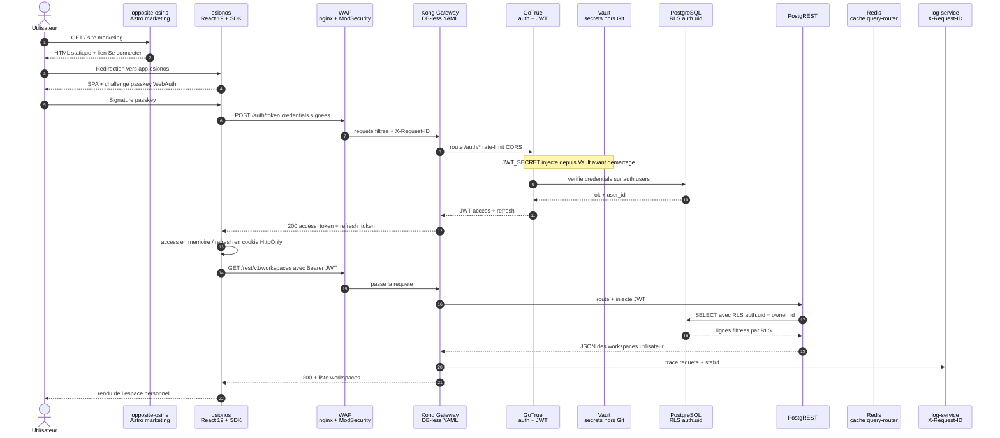

**Lecture du schéma** : l'utilisateur ne parle jamais directement à une base. Le flux public passe par **WAF → Kong**, qui attribue un `X-Request-ID` et applique les contrôles d'entrée. **GoTrue** valide les credentials et signe un JWT avec un `JWT_SECRET` fourni par l'environnement, lui-même généré ou récupéré par les scripts Vault/Makefile hors Git. Le refresh token est protégé côté gateway applicative par un cookie `HttpOnly; Secure; SameSite=Lax`. Le `session-service` existe bien, mais il persiste ses sessions dans PostgreSQL (`session.user_sessions`).

Redis est utilisé pour le cache du `query-router` et comme base du futur bus d'événements. Sur la requête métier qui suit, le JWT est rejoué : **PostgREST** le passe à **PostgreSQL**, qui applique automatiquement la **RLS** (`auth.uid() = owner_id`) — la sécurité finale est dans la base, pas dans le code applicatif.

###### Vue d'ensemble des connexions entre services (état actuel)

Le schéma ci-dessous reflète l'état réel du `docker-compose.yml` de [mini-baas-infra](../apps/baas/mini-baas-infra/docker-compose.yml) au moment de la rédaction. Les services sont regroupés par **plan d'exécution** (≈17 Compose profiles) ; les principaux sont `control-plane`, `data-plane`, `adapter-plane`, `go-control-plane`, `rust-data-plane`, `storage`, `analytics`, `background`, `observability`, `functions` et `backups` (plus `engines-extra`, `extras`, `ops`, `studio`, `playground`, `realtime`).

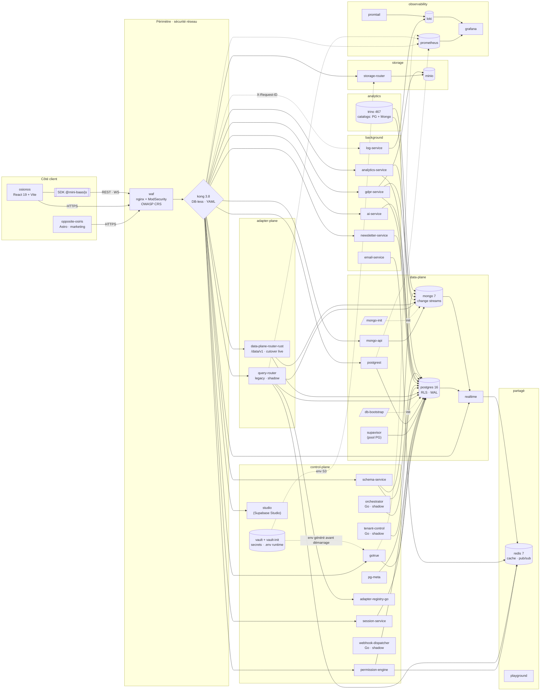

**Comment lire ce schéma** :

1. **Côté client** — deux frontends indépendants partagent le SDK `@mini-baas/js`. Aucun appel direct à la donnée depuis le navigateur.
2. **Périmètre réseau** — toute requête traverse `waf` (filtrage OWASP CRS) puis `kong` (routage, JWT, rate-limit, CORS). Seul point d'entrée public.
3. **`control-plane`** — gouvernance : `gotrue`, `vault`, `session-service`, `permission-engine`, `schema-service`, `pg-meta`, `studio`, plus un **plan de contrôle Go** (`adapter-registry-go`, `tenant-control`, `webhook-dispatcher`, `orchestrator`) qui tourne en *shadow* aux côtés des services NestJS qu'il porte progressivement.
4. **`data-plane`** — engines et leurs façades : `postgres` derrière `postgrest`, `mongo` derrière `mongo-api`, `realtime` qui écoute WAL + change streams, `supavisor` qui pool PG.
5. **`adapter-plane`** — le `query-router` (NestJS, legacy) et surtout le **`data-plane-router-rust`** (Rust, en cutover live sur `/data/v1`) consultent l'`adapter-registry` pour dispatcher le CRUD vers le bon engine.
6. **`storage`** — `storage-router` parle à `minio` avec des credentials S3 injectés par environnement ; le chiffrement des credentials de bases externes est porté par `adapter-registry`.
7. **`background`** — services à durée de vie longue : `email-service`, `newsletter-service`, `gdpr-service`, `ai-service`, `analytics-service`, `log-service`.
8. **`analytics`** — `trino` avec catalogs PG + Mongo, pour requêtes analytiques cross-engine.
9. **`observability`** — `prometheus`, `grafana`, `loki`, `promtail`. **Les traces distribuées (Tempo/OTel) ne sont pas encore en place**, voir la cible 10/10 ci-dessous.

La règle de circulation reste la même : **les flèches descendent toujours du moins privilégié vers le plus privilégié**. Le client ne connaît que Kong, Kong ne connaît que les services applicatifs, les services applicatifs ne connaissent que leur engine. Une compromission d'un étage ne propage pas au suivant sans franchir une nouvelle barrière (JWT, RLS, ACL MinIO, secret injecté depuis Vault ou variable d'environnement dédiée).

###### Cible 10/10 — à quoi ressemblera l'infrastructure une fois les milestones M1-M5 livrées

Le schéma ci-dessous représente l'**état cible** une fois les cinq jalons décrits dans [wiki/todo/README.md](todo/README.md) réalisés. Les nouveautés par rapport à l'état actuel sont regroupées dans les sous-graphes `M1` à `M5`. Tout ce qui apparaît en dehors de ces blocs existe déjà aujourd'hui.

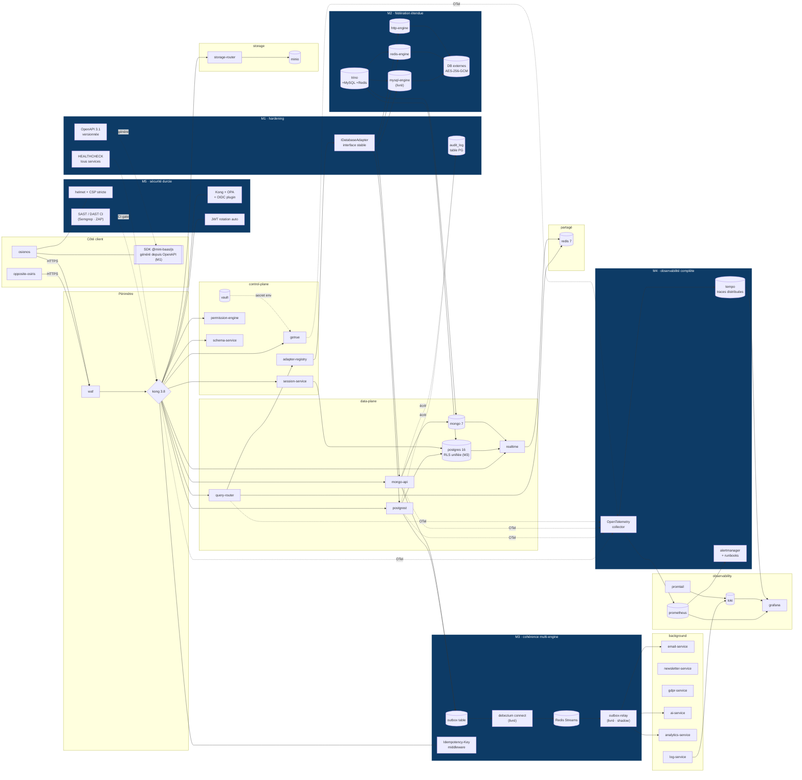

**Ce que les milestones ajoutent concrètement** :

| Jalon | Apport sur le schéma | Pourquoi c'est nécessaire pour passer à 10/10 |
|---|---|---|
| **M1 · hardening** | `HEALTHCHECK` sur tous les services, interface `IDatabaseAdapter`, spec OpenAPI 3.1 versionnée, table `audit_log` PG | Rendre la stack auto-décrite (Compose ne tolère plus de service muet) et tracer chaque écriture |
| **M2 · fédération étendue** | `mysql-engine` **(livré ; MariaDB, CockroachDB, MSSQL également présents)**, `redis-engine`, `http-engine` + catalogs Trino correspondants, registre de DB externes chiffrées | Tenir la promesse "connecte n'importe quelle base", pas seulement PG + Mongo |
| **M3 · cohérence multi-engine** | Table `outbox`, `debezium connect` **(livré)**, `Redis Streams` comme bus, `outbox-relay` **(livré · shadow)**, middleware `Idempotency-Key` | Garantir la cohérence éventuelle entre engines sans rouler de transaction distribuée |
| **M4 · observabilité complète** | Collecteur **OpenTelemetry**, **Tempo** pour les traces distribuées, **Alertmanager** + runbooks | Pouvoir suivre une requête de bout en bout (Tempo absent aujourd'hui) et être alerté avant l'utilisateur |
| **M5 · sécurité durcie** | Plugins Kong **OPA** + **OIDC**, **helmet** + CSP stricte côté front, **rotation JWT** automatique, **SAST/DAST** en CI (Semgrep + ZAP) | Passer d'une sécurité par défaut acceptable à une sécurité par construction auditée |

Les briques **déjà présentes** (gateway, auth, RLS, Vault, observabilité partielle, fédération PG/Mongo/MySQL, Trino, GDPR, audit applicatif léger) ne sont pas remplacées : elles sont **complétées et durcies**. Aucun jalon ne demande de réécriture, seulement des ajouts ciblés — c'est ce qui rend le chemin vers 10/10 réaliste à effectif constant.

##### Outillage de développement

À effectif réduit — cinq au départ, deux à la fin — on n'avait pas le luxe de jongler avec dix chaînes d'outils différentes. On a donc tout fait passer par le même socle, en s'imposant une règle simple : si une commande ne s'exécute pas pareil sur ma machine, sur celle d'un coéquipier et dans la CI, c'est qu'elle n'est pas finie.

Le socle commun, c'est **Docker Compose**. Toute la stack — front, BaaS, observabilité, outils — démarre depuis le même `docker-compose.yml`, avec des builds multi-architecture orchestrés par `docker-bake.hcl` et publiés sur GHCR et Docker Hub avec des tags de version. Le pinning strict par digest reste une cible de hardening : la stack contient encore un tag flottant `realtime-agnostic:latest`, identifié comme dette avant production. Par-dessus, un **Makefile** sert de façade unique : `make baas-up`, `make baas-test`, `make osionos-dev`, `make certs-doctor`. Un nouveau membre n'a pas besoin de connaître chaque service pour être productif, il a besoin de connaître les cibles `make`.

Les outils applicatifs sont volontairement homogènes en **TypeScript**. Le front produit utilise React 19 + Vite 6, parce qu'on voulait du HMR quasi instantané et des tests end-to-end fiables avec Playwright. Le site marketing utilise Astro 6, parce qu'il doit charger vite et bien se référencer. Les micro-services métier sont en NestJS, parce que le format module/contrôleur/service donnait un cadre clair sans imposer une architecture trop lourde. Les dépendances sont gérées en `pnpm` avec workspaces, ce qui nous évite de recompiler dix fois la même chose en CI.

La qualité statique passe par **ESLint** et **SonarQube/SonarCloud** selon les paquets, avec Prettier configuré au moins sur le workspace BaaS NestJS. **Dependabot** est configuré en rythme hebdomadaire et **Renovate** maintient un dashboard de mises à jour groupées et différées. La qualité dynamique passe par une **suite de tests système organisée par phases 1 à 16** (sous [apps/baas/mini-baas-infra/scripts/](../apps/baas/mini-baas-infra/scripts/)) qui valide bout à bout l'authentification, la RLS, l'isolation par utilisateur, le cycle de vie des JWT, le storage, le realtime, le rate-limit et le CORS. La règle projet est de faire tourner `make baas-test` avant les merges importants ; la CI BaaS rejoue aujourd'hui un sous-ensemble critique des phases.

##### Stratégie de sécurisation

La sécurité d'Osionos n'a pas été ajoutée à la fin comme un vernis ; elle est posée par couches successives, avec une règle constante : si l'une cède, la suivante doit encore tenir. C'est ce qu'on appelle la défense en profondeur, et concrètement ça donne quatre paliers.

Le premier palier est **en périphérie**. Un WAF nginx équipé de ModSecurity et des règles OWASP CRS examine chaque requête avant même qu'elle n'atteigne nos services : injections SQL, XSS connues, scanners agressifs et anomalies de protocole sont filtrés en amont. Juste derrière, Kong porte le rate-limit, le CORS, la validation des JWT et la propagation d'un `X-Request-ID` qu'on retrouve jusque dans les logs de la base.

Le deuxième palier concerne **l'identité**. C'est GoTrue qui émet les JWT, avec une clé de signature fournie par l'environnement runtime et récupérée ou générée par le workflow Vault/Makefile — jamais par un `.env` versionné. Les mots de passe sont hachés côté GoTrue, et nous avons aussi câblé la WebAuthn (passkeys) sur le site marketing pour offrir une voie sans mot de passe. Quand un utilisateur connecte sa propre base de données externe, ses credentials sont chiffrés au repos en AES-256-GCM avec dérivation scrypt, parce qu'on considère qu'une fuite locale ne doit jamais suffire à compromettre des accès tiers.

Le troisième palier vit **dans les données elles-mêmes**. Côté PostgreSQL, ce sont les politiques RLS qui ont le dernier mot : tant que `auth.uid() = owner_id` n'est pas satisfait, la base refuse de servir une ligne, même si toute la couche applicative était contournée. Côté MongoDB, c'est le service `mongo-api` qui injecte automatiquement `owner_id` à chaque écriture depuis le JWT. Et toutes les requêtes SQL passent soit par PostgREST, soit par des requêtes paramétrées, ce qui rend l'injection SQL structurellement impossible plutôt que simplement « non observée ».

Le dernier palier est **côté front**. Les entrées utilisateur ne sont pas rendues brutes : le site marketing utilise `sanitize-html` là où il accepte du HTML, et l'application Osionos échappe le HTML dans `markengine` avec un filtrage des URLs (`sanitizeUrl`). L'access token vit en mémoire pour les appels `Authorization: Bearer`, tandis que le refresh token est stocké dans un cookie `HttpOnly; Secure; SameSite=Lax` côté auth-gateway. L'accessibilité (RGAA) est traitée dès le design — sémantique HTML, contraste, focus visible, navigation clavier complète — et la conformité RGPD est portée par le `gdpr-service`, qui expose réellement les endpoints d'export, d'anonymisation et de suppression, plutôt que d'être un simple sticker dans le pied de page.

Le tout est complété, sans bruit, par les revues de code obligatoires sur GitHub, le scan continu des dépendances via Renovate, et la portion isolation/auth de la suite de tests système qui rejoue régulièrement les scénarios d'attaque les plus courants.

##### Performance et qualité du code

La performance d'Osionos n'est pas un sujet abstrait : un workspace réel peut contenir des milliers de blocs, et il faut que la page reste fluide même dans ce cas. La règle qu'on s'est donnée est qu'aucune page ne doit ramer parce qu'elle est devenue sérieuse.

Le premier levier, c'est la **virtualisation**. Les longues listes — blocs d'une page, lignes d'une vue base de données — passent par `@tanstack/react-virtual`, qui ne rend dans le DOM que ce qui est réellement visible. On peut ainsi faire défiler des milliers d'éléments sans perte de fluidité. Côté serveur, PostgREST porte la pagination via les en-têtes `Range`, ce qui évite de tout télécharger pour n'afficher qu'une fenêtre.

Le deuxième levier, c'est le **cache et la latence**. Redis sert au cache du `query-router` et prépare le futur bus d'événements ; les sessions applicatives qui passent par `session-service` sont persistées en PostgreSQL. Les uploads de fichiers ne traversent jamais nos services applicatifs : MinIO génère des URLs présignées et le client uploade directement, ce qui retire un goulot d'étranglement potentiel.

Le troisième levier, c'est le **chargement différé**. Vite découpe le bundle par route, React 19 et Suspense reportent les sections non critiques, et le site marketing en Astro charge zéro JavaScript par défaut. Un visiteur qui arrive sur une page produit n'a pas à payer le coût de toute l'application avant de pouvoir lire.

Côté qualité de code, on s'est appuyé sur des **conventions explicites** plutôt que sur la discipline individuelle. Le front suit Feature-Sliced Design avec des règles d'import strictes entre couches, le BaaS est découpé en micro-services NestJS par domaine, et tout passe par le SDK `@mini-baas/js` qui sert de contrat stable entre les deux mondes. La documentation reste vivante — ce wiki, les `README.md` par service, les diagrammes Mermaid — et les commentaires sont concentrés là où le « pourquoi » n'est pas lisible dans le code : RLS, chiffrement, dispatch du `query-router`. Le reste est censé se lire seul.

Enfin, la veille n'est pas laissée au hasard : Dependabot et Renovate rendent les mises à jour visibles et reviewables, la CI rejoue les contrôles critiques, et les images Docker sont progressivement stabilisées par tags de version puis par digest lorsque le pipeline de release le permet. Le tag flottant restant sur `realtime-agnostic` est explicitement traité comme une dette de hardening.

#### b. Public cible et profils utilisateurs
Osionos peut toucher beaucoup de monde, et c'est justement sa force autant que son risque. Si on dit que l'outil est fait pour tout le monde, on ne cible plus personne. J'ai donc préféré distinguer les publics par **niveau d'usage** : ceux qui consomment l'information, ceux qui construisent l'espace de travail, et ceux qui administrent la plateforme.

| Profil | Besoin principal | Pourquoi Osionos les concerne |
|---|---|---|
| **Utilisateur final** | Écrire, consulter, organiser et retrouver rapidement l'information | Il veut un espace plus rapide qu'un wiki lourd, plus structuré qu'un dossier de fichiers, et plus agréable qu'un outil trop technique |
| **Builder / power-user** | Créer des pages, des bases, des vues, des dashboards et des automatisations | Il veut transformer ses données en outil de travail sans repartir de zéro à chaque projet |
| **Équipe projet / startup** | Construire vite un espace commun pour suivre un produit, un MVP ou une organisation interne | Elle veut avancer sans perdre du temps dans l'infrastructure, tout en gardant une base évolutive |
| **Analyste / profil data** | Connecter plusieurs sources de données et produire des vues exploitables | Il veut arrêter de copier-coller des exports entre outils et travailler sur des données réelles |
| **Administrateur de workspace** | Gérer les membres, les rôles, les espaces publics/privés et les permissions | Il doit garder le contrôle sans bloquer la collaboration |
| **Équipe technique** | Brancher des bases existantes, surveiller la stack, sécuriser les accès | Elle veut une plateforme auto-hébergeable, observable, et assez claire pour être maintenue dans le temps |

La cible principale n'est donc pas "tout Internet". La cible réelle, c'est une équipe ou une organisation qui a déjà trop de données dispersées, trop d'outils séparés, et qui veut une station de travail commune pour écrire, visualiser, connecter et piloter ces données.

#### c. Fonctionnalités attendues

Les fonctionnalités attendues ont été formulées sous forme de cas d'usage, parce que cela oblige à rester concret : *qui veut faire quoi, et pourquoi ?* Plutôt qu'une liste exhaustive, voici comment elles se regroupent par profil d'utilisateur.

**L'utilisateur final** veut d'abord centraliser son travail au lieu de l'éparpiller entre cinq outils. Il veut créer une page avec du texte, des blocs, des images et des tableaux, et il veut surtout qu'elle reste fluide quand elle devient longue — un outil de productivité perd tout son intérêt s'il ralentit dès que le contenu devient sérieux. Il veut aussi pouvoir naviguer au clavier, retrouver vite une information ancienne, et retrouver sa session sans se reconnecter en permanence ni risquer d'exposer ses données à un autre utilisateur. Le vrai gain de productivité vient souvent de la réduction des petites frictions répétées toute la journée.

**Le builder et l'analyste data** ont une autre attente : transformer leurs données sans devoir écrire de SQL ni monter une application complète. Le builder veut créer une base de données visuelle depuis l'interface, puis exposer la même source sous forme de tableau, de dashboard, de graphe ou de vue filtrée — parce qu'une donnée n'a pas toujours la même valeur selon la manière dont on la regarde. L'analyste, lui, veut brancher une base PostgreSQL ou MongoDB existante et travailler avec les *vraies* données du projet, pas avec des exports copiés à la main.

**L'équipe projet et son administrateur** ont besoin d'un point de ralliement commun. Ils veulent partager un dashboard d'accueil dans un workspace pour suivre l'avancement, les priorités et les documents importants. Ils veulent aussi pouvoir séparer espaces publics, privés et partagés, et gérer des rôles et droits d'accès — parce que toutes les informations n'ont pas le même niveau de visibilité, et qu'une plateforme collaborative devient dangereuse si tout le monde peut tout lire ou tout modifier.

**L'équipe technique et le responsable conformité**, enfin, attendent que la plateforme soit défendable. Toutes les requêtes doivent passer par une gateway unique, qui sert de point de contrôle clair pour l'authentification, les logs, le CORS et le rate-limit. Les logs, les métriques et les traces d'erreur doivent être consultables, parce qu'une stack composée de nombreux services devient impossible à maintenir si elle reste opaque. Et le responsable conformité doit pouvoir exporter, anonymiser ou supprimer les données d'un utilisateur — parce que le respect du RGPD doit être prévu dans le produit, pas traité comme une tâche manuelle après coup.

Ces attentes peuvent paraître larges, mais elles suivent toutes la même logique : **réduire la distance entre une donnée brute et une décision utile**. Osionos ne cherche pas seulement à stocker des informations ; il cherche à les rendre consultables, reliables, sécurisées et actionnables.


#### d. Minimum Viable Product (MVP)

Pour Osionos, le MVP ne doit pas être une version miniature de tous les rêves du projet. Il doit plutôt répondre à une question simple : **est-ce qu'une équipe peut utiliser Osionos comme espace de travail réel pour créer des pages, connecter des données, produire une vue utile, et le faire dans un cadre sécurisé ?**

Dans l'idéal, le MVP d'Osionos serait donc une version volontairement réduite, mais complète sur un flux principal : **un utilisateur crée un workspace, écrit une page, connecte une source de données, construit une vue, la partage avec son équipe, et tout reste protégé par l'authentification et les permissions**.

| Bloc du MVP | Fonctionnalités minimales attendues | Critère de réussite |
|---|---|---|
| **Authentification et session** | Inscription, connexion, déconnexion, session persistante, récupération du profil utilisateur | Un utilisateur peut revenir dans son espace sans perdre sa session, et ne peut jamais accéder aux données d'un autre utilisateur |
| **Workspace collaboratif** | Création d'un workspace, invitation ou ajout de membres, distinction entre espace privé et espace partagé | Une petite équipe peut se créer un espace commun et y organiser son travail |
| **Pages et blocs** | Création, édition, suppression et réorganisation de blocs simples : texte, titre, liste, image, tableau léger | Une page peut remplacer un document de suivi classique sans devenir lente ni confuse |
| **Base de données interne** | Création d'une base simple depuis l'interface : colonnes, lignes, types de base, filtres et tris | Un utilisateur non technique peut structurer des données sans écrire directement de SQL |
| **Connexion à une source réelle** | Connexion à PostgreSQL ou MongoDB via le BaaS, lecture sécurisée des données, affichage dans une vue Osionos | La promesse centrale est démontrée : Osionos travaille avec de vraies données, pas seulement avec des données fictives internes |
| **Dashboard d'accueil** | Une page `home` personnalisable avec liens, vues épinglées et indicateurs simples | L'équipe dispose d'un point de ralliement commun pour suivre ce qui compte |
| **Recherche et navigation** | Recherche dans les pages, accès rapide aux espaces récents, navigation clavier minimale | L'utilisateur retrouve vite l'information sans fouiller manuellement dans toute l'arborescence |
| **Sécurité minimale sérieuse** | JWT GoTrue, RLS PostgreSQL, `owner_id` côté Mongo, passage obligatoire par Kong, secrets dans Vault | Le MVP n'est pas seulement fonctionnel : il est défendable techniquement et juridiquement |
| **Observabilité minimale** | Logs applicatifs, métriques Prometheus, dashboard Grafana simple, erreurs visibles | L'équipe peut comprendre pourquoi quelque chose casse sans deviner à l'aveugle |
| **Déploiement reproductible** | Docker Compose, Makefile, migrations idempotentes, seed de démonstration | N'importe quel membre de l'équipe peut lancer le MVP localement et retrouver le même état de départ |

Le MVP idéal ne chercherait donc pas à concurrencer immédiatement Notion, Obsidian, Retool et Supabase en même temps. Il chercherait à prouver une seule chose, mais vraiment : **on peut créer un espace de travail rapide, collaboratif et sécurisé, capable de transformer des données réelles en pages, vues et dashboards utilisables**.

Ce qui doit rester **hors MVP** pour ne pas perdre le projet : marketplace de plugins, moteur d'automatisation complet, IA avancée, support de tous les moteurs de bases de données, graph view très poussé, édition collaborative temps réel façon Google Docs, mobile app native, et architecture 10/10 complète (outbox, Debezium, OTel/Tempo, OPA, SAST/DAST). Ces éléments sont importants, mais ils appartiennent aux perspectives d'évolution, pas à la première version prouvable.

La bonne définition du MVP est donc : **le plus petit Osionos capable d'être utilisé par une vraie petite équipe pendant une semaine sans devoir retourner sur cinq outils différents**.

#### e. Perspectives d'évolution

Une fois le MVP stabilisé, les perspectives d'évolution d'Osionos se divisent en deux grandes familles : **faire grandir le produit** (ce que les utilisateurs voient directement) et **durcir la plateforme** (ce qui rend le produit fiable, sécurisé et maintenable à long terme). L'idée n'est pas d'ajouter des fonctionnalités pour faire joli, mais de faire évoluer Osionos sans perdre la promesse initiale : un espace de travail rapide, connecté à de vraies données, et assez solide pour être utilisé en équipe.

| Axe d'évolution | Ce que cela apporterait | Pourquoi ce n'est pas dans le MVP |
|---|---|---|
| **Marketplace de plugins** | Permettre à des utilisateurs ou développeurs d'ajouter leurs propres blocs, vues, connecteurs ou automatisations | Cela demande un modèle de permissions, une sandbox, une validation de sécurité et une gouvernance communautaire : trop large pour une première version |
| **Moteur d'automatisation complet** | Créer des règles du type "quand une ligne change, envoyer un email", "quand une page est publiée, notifier un channel", etc. | L'automatisation nécessite un moteur d'événements fiable, des retries, de l'idempotence et une interface de configuration claire |
| **IA avancée** | Résumer une page, générer une vue, suggérer un dashboard, interroger les données en langage naturel | L'IA n'a de valeur que si les données, les permissions et l'audit sont déjà propres ; sinon elle amplifie le désordre |
| **Support multi-engine étendu** | Ajouter MySQL, Redis, HTTP APIs, puis d'autres moteurs via `query-router` et `adapter-registry` | Le MVP doit prouver PostgreSQL + MongoDB avant d'étendre la promesse à "n'importe quelle base" |
| **Graph view avancé** | Visualiser les relations entre pages, blocs, bases, tags, membres et sources de données comme une carte vivante du workspace | La version simple peut attendre ; un graphe vraiment utile demande un modèle de liens propre et une UX très travaillée |
| **Édition collaborative temps réel** | Éditer une même page à plusieurs, façon Google Docs, avec curseurs, présence et résolution de conflits | C'est un sujet complexe : CRDT/OT, conflits réseau, historique, performance. À ne pas mélanger avec la première preuve produit |
| **Application mobile native** | Accès plus confortable sur téléphone, notifications push, consultation hors bureau | Osionos est d'abord un outil dense et desktop-first ; le mobile viendra quand le cœur produit sera stable |
| **Architecture 10/10** | Outbox, Debezium, OpenTelemetry/Tempo, OPA, SAST/DAST, rotation JWT, hardening complet | Ce sont des chantiers de robustesse indispensables pour une vraie production, mais ils doivent venir après le MVP démontrable |

###### Roadmap d'évolution proposée

La suite logique serait de faire évoluer Osionos par paliers, en évitant le piège du "tout en même temps".

1. **Palier 1 — stabiliser le produit de base.** Finaliser le cycle workspace → page → base → dashboard → partage. À ce stade, le produit doit être utilisable par une petite équipe sans accompagnement direct des développeurs.
2. **Palier 2 — ouvrir les données.** Étendre les connecteurs au-delà de PostgreSQL et MongoDB (MySQL, Redis, API HTTP), générer le SDK depuis une spec OpenAPI, et rendre le `query-router` vraiment extensible par adapters.
3. **Palier 3 — rendre les événements fiables.** Ajouter le pattern outbox, Debezium et Redis Streams pour synchroniser les écritures entre moteurs sans transaction distribuée. C'est le socle du futur moteur d'automatisation.
4. **Palier 4 — rendre la plateforme observable.** Ajouter OpenTelemetry, Tempo, Alertmanager et des runbooks. L'objectif : suivre une requête de bout en bout et être alerté avant que l'utilisateur ne découvre la panne.
5. **Palier 5 — durcir la sécurité.** Ajouter OPA/OIDC côté Kong, rotation automatique des JWT, SAST/DAST en CI, CSP stricte et contrôles de dépendances renforcés. À ce stade, la plateforme commence à ressembler à un produit exploitable sérieusement.
6. **Palier 6 — enrichir l'expérience utilisateur.** Une fois le socle fiable, ajouter graph view avancé, automatisations visuelles, IA assistée, plugins et éventuellement mobile natif.

###### Vision long terme

À long terme, Osionos pourrait devenir une sorte de **poste de travail universel pour les données d'une équipe** : un endroit où l'on écrit, où l'on connecte des bases, où l'on visualise, où l'on automatise, et où l'on peut demander de l'aide à une IA sans quitter son contexte de travail.

La vision n'est pas seulement de refaire Notion. Notion gère très bien la page. Obsidian gère très bien la note locale. Retool gère très bien l'interface métier. Supabase gère très bien le backend applicatif. L'ambition d'Osionos est de chercher l'intersection : **une interface de travail lisible pour l'humain, branchée sur de vraies données, avec une infrastructure que l'équipe peut comprendre et posséder**.

Le risque principal de cette évolution est évident : vouloir tout faire et finir par ne rien finir. C'est pour cela que la roadmap doit rester stricte : chaque nouvelle capacité doit soit améliorer l'usage réel d'une équipe, soit renforcer la fiabilité de la plateforme. Si elle ne fait ni l'un ni l'autre, elle doit attendre.

### les contraintes

Le développement d'Osionos a été encadré par des contraintes fortes, à la fois scolaires, techniques, de sécurité et de qualité. Ce n'était pas un projet que l'on pouvait simplement lancer avec `npm install` sur une machine personnelle et corriger au feeling. L'environnement de travail s'inspire directement de l'esprit des projets **Born2beroot / Inception** de 42 : une machine virtuelle stricte, une exposition réseau limitée, des services isolés, et une règle simple — **tout ce qui tourne doit être reproductible**.

La **reproductibilité** n'était pas un "nice to have" : c'était la condition pour que le projet survive au passage d'une machine à l'autre, d'un OS à l'autre, et au jour de l'évaluation. C'est pour ça qu'on a poussé l'idée jusqu'au bout : la VM de référence elle-même est versionnée dans un repo dédié, **[`Univers42/born2root`](https://github.com/Univers42/born2root.git)**. Ce repo permet de regénérer, depuis zéro, une VM moderne et durcie (Debian + Docker + pare-feu + utilisateurs + SSH) qui sert ensuite de socle pour cloner et lancer `ft_transcendence` / Osionos. C'est une vraie **inception** : une VM reproductible qui héberge une stack Docker reproductible.

#### a. Contraintes d'environnement : VM stricte, Docker partout, zéro dépendance locale

La contrainte la plus structurante était l'environnement d'exécution. Le repo documente explicitement que la stack doit passer par **Docker Compose uniquement** : il ne faut pas installer les dépendances applicatives sur l'hôte, ni démarrer le website ou Osionos avec des scripts locaux `npm`, `pnpm` ou `node`. Le fichier [README.md](../README.md) indique que le `docker-compose.yml` racine est la source de vérité pour le backend, le site marketing, l'application Osionos et les bridges.

En pratique, le développement se faisait dans une VM `b2b` sous VirtualBox — la VM construite à partir du repo [`Univers42/born2root`](https://github.com/Univers42/born2root.git) — avec Docker à l'intérieur de la VM et parfois le navigateur sur la machine hôte. Cela a créé une vraie contrainte réseau : le chemin complet devenait `navigateur hôte -> localhost hôte -> NAT VirtualBox -> VM -> ports Docker -> proxy HTTPS -> container`. Le document [wiki/host-browser-https-pipeline.md](host-browser-https-pipeline.md) explique ce pipeline en détail. Une stack verte dans Docker ne suffisait pas : il fallait aussi que les ports soient publiés sur `0.0.0.0`, que le certificat local soit reconnu par le navigateur, et que l'utilisateur n'ouvre pas un port VS Code transféré au hasard à la place du port Compose canonique.

Cette contrainte nous a forcés à automatiser beaucoup de choses : génération des certificats locaux, import de la CA dans les stores système et navigateur, vérification des ports, `make all` comme pipeline principal, et `container-only.mjs` côté `opposite-osiris` pour empêcher l'exécution hors container.

#### b. Contraintes de sécurité : données sensibles, secrets, RGPD

Même si Osionos n'est pas une application de planning terrain comme l'exemple GeoTask, elle manipule quand même des données sensibles : comptes utilisateurs, sessions, workspaces privés, rôles, bases de données externes branchées par l'utilisateur, chaînes de connexion, fichiers, logs et traces d'activité. La contrainte n'était donc pas seulement de protéger un formulaire de login, mais de protéger un **écosystème de données**.

Concrètement, plusieurs obligations se sont imposées. L'**authentification** devait être solide : GoTrue prend en charge l'inscription, la connexion, le hachage des mots de passe et l'émission de JWT, avec une séparation claire entre les rôles `anon`, `authenticated` et `service_role`. L'**isolation des données** ne pouvait pas reposer sur la bonne volonté du code applicatif : c'est PostgreSQL qui décide, via la RLS (`auth.uid() = owner_id`), et c'est MongoDB qui reçoit systématiquement un `owner_id` injecté par `mongo-api` depuis le JWT. Les **secrets** n'ont jamais leur place dans Git : ils sont générés ou récupérés via HashiCorp Vault, puis injectés aux services par l'environnement runtime ; les credentials de bases externes que les utilisateurs branchent sont chiffrés au repos en AES-256-GCM avec dérivation scrypt. Enfin, la **protection en entrée** combine WAF nginx, ModSecurity et OWASP CRS en amont de Kong, avec CORS strict, rate-limit et contrôle des en-têtes, pendant que le **front** applique `sanitize-html` sur les surfaces concernées du site marketing et un échappement HTML/URL dans le moteur Markdown de l'app. Le **RGPD** n'est pas traité comme une tâche administrative post-projet : le `gdpr-service` expose réellement les endpoints d'export, d'anonymisation et de suppression, avec une logique de minimisation et de traçabilité.

Une contrainte spécifique concernait la **récupération partagée des secrets**. Au début, chaque machine génère ses propres `.env` locaux, et c'est suffisant pour travailler seul. Mais dès qu'on a voulu démarrer la stack sur la machine d'un coéquipier ou dans une VM fraîche, on a réalisé le problème : on n'avait pas le droit d'envoyer les vraies clés JWT, les credentials OAuth ou les secrets SMTP par message, et on ne pouvait pas non plus les versionner. Il fallait un moyen de partager les mêmes valeurs sensibles sans jamais les exposer en clair.

La solution repose sur deux usages de **HashiCorp Vault**. En local, Vault tourne dans le `docker-compose.yml` racine via le profil `secrets` et reste accessible derrière le proxy HTTPS local `https://localhost:18200` ; les scripts et certains containers de bootstrap lui parlent sur le réseau Docker interne (`http://vault:8200`). Pour le partage équipe, on a déployé une instance partagée sur **Fly.io**, exposée à l'adresse HTTPS `https://track-binocle-vault.fly.dev` via `make vault-fly`. Cette instance ne sert pas à héberger l'application — elle sert uniquement de **point d'accès aux secrets partagés**.

Le parcours type ressemble à ceci : un mainteneur génère un token avec `make vault-fly-invite-token VAULT_TEAM_ROLE=reader`, choisit éventuellement une durée de vie courte, et transmet ce token via un canal sécurisé à usage unique (typiquement OneTimeSecret). Le développeur place le fichier ignoré `.vault/track-binocle-reader.env` dans son clone, le passe en `chmod 600`, lance `make vault-shared-doctor` pour vérifier le câblage sans afficher de valeurs, puis simplement `make all` : le Makefile contacte Vault en HTTPS, récupère les variables autorisées par la policy associée au token, et génère les `.env` locaux dans les bons sous-dossiers. Si quelqu'un essaie de partager un token `localhost`, le Makefile refuse (sauf dérogation explicite pour du test sur la même machine), parce qu'un tel token ne prouve rien sur une autre VM. Côté CI, GitHub Actions ne stocke jamais de token Vault statique : la pipeline s'authentifie par OIDC et reçoit un token temporaire ne valant que le temps d'un run.

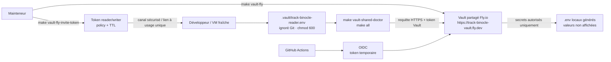

La philosophie d'ensemble reste la même : un secret peut être récupéré, mais seulement avec un token valide, privé, limité par une policy, éventuellement expirant, et jamais versionné. C'est dans cette logique que s'inscrit la règle plus large : ne jamais faire reposer la sécurité sur une seule couche. Si le front se trompe, le gateway doit encore filtrer. Si un service applicatif se trompe, PostgreSQL doit encore refuser. Si un fichier local fuit, il ne doit pas contenir de secret en clair.

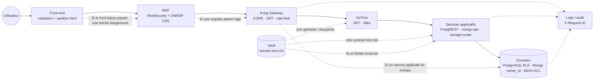

Ce schéma montre la logique de **défense en profondeur** : aucune couche n'est considérée comme suffisante seule. Le front réduit le risque, le WAF filtre, Kong contrôle l'entrée, GoTrue porte l'identité, les services appliquent les règles métier, et la base garde le dernier mot sur l'accès réel aux données.

#### c. Contraintes d'architecture : pas une API Express classique

Une autre contrainte structurante était de ne pas réduire Osionos à une stack `React / Node.js / PostgreSQL`. Le projet utilise bien React et PostgreSQL, mais derrière le front il y a un assemblage : Kong, GoTrue, PostgREST, PostgreSQL, MongoDB, Redis, MinIO, Vault, Trino, plus plusieurs micro-services NestJS qui portent la logique métier. Cet assemblage impose une discipline assez stricte.

La première règle, c'est que **tout trafic public passe par WAF puis Kong**. Aucun front ne parle directement à une base ; chaque moteur de données a sa façade contrôlée (PostgREST, `mongo-api`, `storage-router`), et c'est cette façade qui porte l'authentification et l'isolation. La deuxième règle, c'est que **chaque service doit pouvoir vivre séparément** : isolé dans son container, configurable par variables d'environnement, et redémarrable sans interrompre le reste de la plateforme. La troisième règle, c'est que **la configuration du gateway doit être lisible dans Git** : Kong tourne en mode DB-less avec sa configuration en YAML versionné, donc toute modification de routes ou de plugins passe par une revue de code, pas par une UI cliquable. Enfin, la stack doit pouvoir **démarrer localement sans dépendre d'un cloud externe** : un développeur sur sa VM doit avoir exactement la même plateforme qu'en CI.

Cette contrainte a complexifié le projet — il aurait été plus rapide de tout coller dans un Express monolithique — mais c'est aussi ce qui en fait la cohérence. On n'a pas construit juste une application, on a construit une petite plateforme, et chaque service peut être justifié par un problème concret qu'on a rencontré.

#### d. Contraintes qualité côté front-end

Côté front, la contrainte était double : produire une interface réellement riche, mais sans sacrifier la maintenabilité. Osionos est un outil dense, avec des pages, des blocs, du drag and drop, des menus contextuels, des dashboards et beaucoup d'interactions clavier. Le moindre détail UX cassé peut rendre l'outil pénible à utiliser, et il devient vite impossible à réparer si on n'a pas mis en place de garde-fous dès le départ.

Notre garde-fou est donc une chaîne de contrôles qui tourne avant chaque merge, et qui passe entièrement dans Docker via [apps/osionos/app/scripts/docker-run.sh](../apps/osionos/app/scripts/docker-run.sh). TypeScript bloque les erreurs de type avec `tsc --noEmit`. ESLint est configuré avec `--max-warnings=0`, donc on ne tolère aucun warning. Playwright joue les scénarios end-to-end utilisateur, des tests canvas vérifient les comportements de blocs et le parsing du markdown, des tests bridge valident la liaison entre Osionos et le BaaS, et un ensemble de tests UX/browser couvre le focus management, le drag and drop, l'inline toolbar, les menus, l'indentation, le paste, les assets et le context menu. Enfin, un doctor vérifie que l'environnement de test est correct avant de faire confiance aux résultats — parce qu'un test qui passe dans un environnement cassé ne prouve rien.

La règle qui ressort de tout ça est constante : **la qualité front ne dépend pas de la machine du développeur**. Si le pipeline ne tourne pas pareil chez moi, chez un coéquipier et en CI, on considère que le pipeline n'est pas finalisé.

#### e. Contraintes qualité côté back-end et infrastructure

Côté BaaS, on ne pouvait pas se contenter de tests unitaires classiques, parce que la majeure partie du risque ne vit pas dans une fonction isolée — elle vit dans l'**intégration entre services**. Quand Kong, GoTrue, PostgREST, PostgreSQL, MongoDB, Redis, Vault, MinIO et le realtime doivent collaborer pour qu'un utilisateur lise simplement sa propre page, le risque est dans les coutures, pas dans les briques.

On a donc mis en place une CI locale dédiée, dans [apps/baas/mini-baas-infra/scripts/run-ci-local.sh](../apps/baas/mini-baas-infra/scripts/run-ci-local.sh), qui vérifie d'abord les prérequis (Docker, Docker Compose, Make, curl), valide la syntaxe Bash de tous les scripts et passe ShellCheck quand il est disponible. Elle nettoie ensuite entièrement l'état Compose pour ne pas hériter d'un ancien volume, génère un `.env` déterministe, démarre la stack, joue le `db-bootstrap`, vérifie la santé de la gateway sur `/auth/v1/health`, puis exécute `make tests`.

Ce `make tests` du mini-BaaS enchaîne les scripts `phase*-*.sh` / `phase*-*.py` dans l'ordre, et chaque phase couvre un risque précis : smoke tests, authentification, accès DB authentifié, isolation utilisateur, méthodes HTTP, codes d'erreur, cycle de vie des tokens, storage, mutations complexes, realtime WebSocket, rate-limit, CORS, Mongo MVP, flux d'auth complet. À côté, SonarCloud est configuré via [sonar-project.properties](../sonar-project.properties), et `vendor/QA` joue le rôle de registre de tests : il catalogue les scripts existants et stocke leurs résultats.

La contrainte qualité back ne se résumait donc pas à « les routes répondent ». Elle était plus exigeante : **la plateforme doit pouvoir être détruite, reconstruite, testée et expliquée**, sans intervention manuelle fragile entre les étapes.

#### f. Contraintes de méthode et de planning

Le projet a démarré avec une équipe de cinq personnes, puis s'est progressivement resserré. Cela a imposé une priorisation forte : tout ne pouvait pas être terminé en même temps. Nous avons donc travaillé avec une logique Scrumban : assez de structure pour garder un cap, assez de flexibilité pour absorber les imprévus.

Cette contrainte explique la séparation entre :

- le **MVP**, qui doit prouver le flux principal ;
- les **perspectives d'évolution**, qui contiennent les ambitions fortes mais non indispensables à la première preuve ;
- la **roadmap 10/10**, qui sert à durcir la plateforme sans prétendre que tout est déjà terminé.

Le vrai risque n'était pas seulement technique : c'était de vouloir faire Notion, Supabase, Retool, Obsidian et Grafana en même temps. La contrainte de qualité nous a donc obligés à réduire le périmètre, documenter les arbitrages et assumer ce qui restait hors MVP.

#### g. Contrainte de centralisation : un monorepo devenu studio multi-apps

Une contrainte qu'on n'avait pas anticipée au démarrage est apparue très vite : à effectif réduit, on n'avait tout simplement pas les moyens de maintenir cinq dépôts Git indépendants, cinq pipelines CI distincts, cinq systèmes de versions, cinq backlogs séparés. À chaque fois qu'on essayait de découper proprement (un dépôt pour le BaaS, un pour `osionos`, un pour `opposite-osiris`, un pour le SDK, un pour les outils internes), on perdait plus de temps à synchroniser les versions et à rejouer les contrats inter-services qu'à avancer sur le produit.

On a donc pris une décision pragmatique : **transformer ce dépôt en studio de travail unique**. Tout vit ici — le BaaS, les deux frontends, le SDK, la documentation, les outils, les scripts d'infrastructure — et chaque application sort progressivement du monorepo quand elle devient assez stable pour vivre seule. Concrètement, le studio nous donne un `make` unique qui sait builder, tester et publier chaque app, un seul `pnpm-workspace.yaml` qui partage les dépendances, et un seul historique Git où l'on peut suivre une refonte de bout en bout. Le coût, c'est un dépôt qui paraît énorme au premier coup d'œil ; le bénéfice, c'est qu'à deux personnes on tient encore une plateforme à plusieurs services sans s'épuiser sur la plomberie.

L'idée n'est pas que tout reste à jamais dans ce monorepo. C'est plutôt un **incubateur** : une app grandit ici jusqu'au moment où la sortir devient moins risqué que la garder. `mini-baas-infra` est déjà en bonne voie d'extraction propre (images publiées, tags Git alignés sur les releases), et le SDK `@mini-baas/js` est conçu pour pouvoir être publié séparément le jour où le contrat sera stable. En attendant, le studio fait office d'**atelier partagé**.

### Environnement humain et technique
#### a. Environnement humain et méthodologie

Le projet a été réalisé dans le cadre de l'école 42, à partir du sujet `ft_transcendence`, puis progressivement transformé en Osionos. L'équipe s'est constituée début 2026 autour de cinq étudiants de 42, avec des profils volontairement complémentaires : pilotage produit, architecture, développement front, développement back, infrastructure, et QA. Chacun avait un rôle principal et un rôle secondaire, pour qu'aucune fonction critique du projet ne dépende d'une seule personne en cas d'absence.

| Login 42 | Nom | Rôle principal | Rôle secondaire | GitHub | Spécialisation |
|---|---|---|---|---|---|
| `dlesieur` | Dylan Lesieur | ALL | ALL | [@LESdylan](https://github.com/LESdylan) | Auth, OAuth 2.0, pilotage produit, dossier |
| `danfern3` | Daniel Fernández | PO | PM | [@danielfdez17](https://github.com/danielfdez17) | Game engine, WebSockets |
| `serjimen` | Sergio Jiménez | PM | TL | [@DJSurgeon](https://github.com/DJSurgeon) | Architecture back-end, CI |
| `rstancu` | Roxana Stancu | TL | PM | [@esettes](https://github.com/esettes) | Front-end, design system SCSS |
| `vjan-nie` | Vadim Jan Nieto | TL | ALL | [@vjan-nie](https://github.com/vjan-nie) | Base de données, Prisma, Docker |

Dans les faits, j'ai porté une partie importante du rôle de **product owner / manager de projet** — cadrage de la vision, priorisation du MVP, arbitrage entre les fonctionnalités, écriture du dossier et coordination avec les contraintes techniques posées par les profils architecture. **Vadim** et **Roxana** ont beaucoup pesé sur les exigences d'architecture et de qualité, notamment sur la séparation des services, la sécurité, la reproductibilité et la stratégie de tests. **Sergio** a porté l'architecture back-end et la CI, et **Daniel** a travaillé sur les fondations temps réel (WebSockets, moteur de jeu) qui ont nourri par la suite la brique `realtime` du BaaS.

La méthode de travail s'est rapprochée d'un **Scrumban** : backlog et priorisation comme en Scrum, exécution plus souple comme en Kanban. On tenait des plannings courts au début de chaque cycle, on suivait l'avancement sur un board Kanban, et on s'autorisait à réordonner sans cérémonie quand la réalité technique nous le demandait. Ce choix était adapté au contexte : beaucoup d'inconnues techniques, une équipe qui apprend en avançant, et un périmètre qui devait rester maîtrisable malgré l'ambition du produit.

Côté outils, on a délibérément séparé la communication temps réel et le suivi de projet. Pour la **communication**, on utilisait **Discord** comme socle principal (voix + salons écrits par sujet), **WhatsApp** pour les échanges rapides et hors-sujet, et **Slack** pour certains canaux plus formels. Pour le **suivi du projet**, on est passé directement par **GitHub Projects** sur l'organisation [Univers42](https://github.com/orgs/Univers42/projects/6) : board Kanban, issues liées aux PR, milestones, le tout au même endroit que le code.

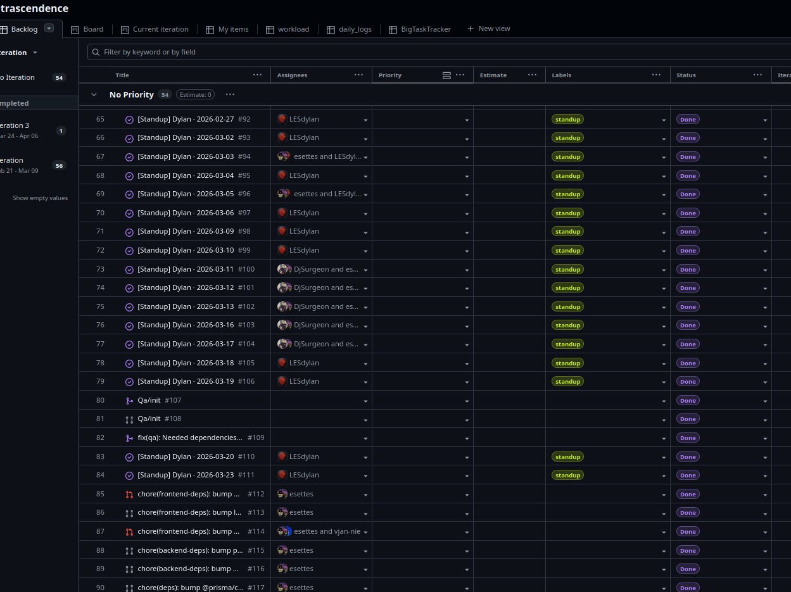

*Le rendu détaillé du board (colonnes, milestones, issues) est repris en grand format dans la section [Annexes — fig.9](#annexes) à la fin du dossier.*

On avait aussi essayé **Notion** au démarrage pour la documentation, et on l'a finalement abandonné : ça créait deux sources de vérité (Notion d'un côté, le repo de l'autre), et au moindre changement d'architecture la doc Notion devenait fausse en silence. On a donc tout rapatrié dans ce wiki, à côté du code, pour que les PR puissent corriger la doc dans le même geste que le code qu'elles modifient.

Côté contrôle de version, on a travaillé en **Git + GitHub avec un modèle proche de Git Flow** : une branche `main` protégée qui représente l'état stable, une branche d'intégration `develop`, des branches `feature/*` pour les nouveautés, `fix/*` pour les correctifs et `release/*` pour les préparations de version. Sur GitHub, on avait activé des **règles de protection de branche** sur `main` (et plus tard sur `develop`) : pas de push direct, une **pull request obligatoire** avec au moins une revue de code approuvée, et la CI verte comme condition de merge. Pour garder un historique lisible, on s'était également imposés des **commits au format Conventional Commits**, contrôlés par des **hooks Git locaux** (`commit-msg`, `pre-commit`) qui refusaient les messages non conformes et lançaient un `lint` rapide avant le commit. Ce dispositif a tourné pendant plusieurs mois et il fonctionnait correctement — il a fini par être **allégé** quand l'équipe s'est resserrée à deux personnes, non pas parce qu'il était inefficace, mais parce qu'à deux on perdait plus de temps à attendre la revue formelle qu'à corriger un commit mal formaté. On a gardé les hooks, on a gardé la PR sur `main`, et on a accepté d'être plus pragmatiques sur les autres branches.

#### b. Environnement technique

L'environnement technique peut se résumer en une phrase : **un poste Linux, Docker comme unique runtime, VS Code comme éditeur, et Make comme interface de pilotage**. Le détail compte, parce que c'est cette homogénéité qui permet à chaque membre de l'équipe d'avoir exactement la même plateforme, indépendamment de sa machine personnelle.

Côté **poste de travail**, on s'est appuyés sur l'écosystème Linux dans toute sa diversité. La VM de référence est une VM `b2b` sous VirtualBox générée depuis [`Univers42/born2root`](https://github.com/Univers42/born2root.git) (dans l'esprit Born2beroot), mais en pratique les membres de l'équipe ont fait tourner la stack sur **Ubuntu, Debian, Kali Linux et Arch Linux** sans rencontrer de problème bloquant. C'est précisément ce qu'on cherchait : tant que Docker, Docker Compose et Make sont disponibles, le reste de la stack ne fait pas la différence. L'éditeur principal était **VS Code**, avec quelques extensions partagées (ESLint, Prettier, Docker, GitLens, Mermaid Preview) pour que la revue de code se fasse dans le même cadre que l'écriture.

Côté **piles applicatives**, on a quatre piles distinctes mais cohérentes, qu'il vaut mieux détailler séparément.

*Front application (`osionos`)* — React 19, Vite 6, TypeScript strict, Zustand 5 pour l'état, `@tanstack/react-virtual` pour la virtualisation, Playwright pour les tests end-to-end, ESLint + Prettier, le tout buildé et testé via [apps/osionos/app/scripts/docker-run.sh](../apps/osionos/app/scripts/docker-run.sh) dans un container.

*Front marketing (`opposite-osiris`)* — Astro 6, TypeScript, SCSS, `@simplewebauthn/browser` pour les passkeys, `sanitize-html` côté contenu, et un garde-fou `container-only.mjs` qui refuse purement et simplement l'exécution si on tente de lancer le projet hors Docker.

*BaaS et services applicatifs* — Kong 3.8 (DB-less, YAML versionné) comme passerelle, GoTrue 2.188 pour l'auth, PostgREST 12 sur PostgreSQL, NestJS pour les services internes (`mongo-api`, `query-router`, `storage-router`, `permission-engine`, `session-service`, `schema-service`, `gdpr-service`, `log-service`, `email-service`, `newsletter-service`, `ai-service`, `analytics-service`), `realtime-agnostic` en Rust pour le WebSocket, MinIO derrière `storage-router`, et Trino 467 pour la fédération analytique.

*Bases de données et stockage* — PostgreSQL 16 comme source de vérité (avec RLS, migrations idempotentes et seeds de démonstration), MongoDB 7 pour les blocs semi-structurés avec injection d'`owner_id` par `mongo-api`, Redis 7 pour le cache du `query-router` et le futur bus d'événements, MinIO pour les fichiers, HashiCorp Vault pour les secrets, et un proxy HTTPS local pour que le navigateur hôte puisse parler aux containers en TLS sans erreur de certificat. Les sessions du `session-service` sont persistées en PostgreSQL.

Le tableau ci-dessous sert de résumé visuel, pas de catalogue.

| Couche | Pile retenue | Contrainte associée |
|---|---|---|
| **Poste de travail** | Ubuntu, Debian, Kali, Arch ; VM `b2b` VirtualBox de référence | Linux uniquement, l'OS exact ne doit jamais bloquer un développeur |
| **Éditeur** | VS Code + extensions partagées (ESLint, Prettier, Docker, GitLens) | Revue de code et écriture dans le même cadre |
| **Runtime applicatif** | Docker + Docker Compose racine | Zéro dépendance applicative installée directement sur l'hôte |
| **Orchestration** | Makefile (`make all`, `make playground`, `make healthcheck`), profils Compose | Une commande doit reconstruire et vérifier la stack |
| **Front app** | React 19, Vite 6, TypeScript, Zustand 5, Playwright | Tous les scripts passent par `docker-run.sh` |
| **Front marketing** | Astro 6, TypeScript, SCSS, `container-only.mjs` | Exécution refusée hors container |
| **BaaS** | Kong, GoTrue, PostgREST, NestJS, `realtime-agnostic` (Rust), Trino | Architecture multi-services, aucun accès direct navigateur → base |
| **Bases & stockage** | PostgreSQL 16, MongoDB 7, Redis 7, MinIO, Vault | Source de vérité côté PG, `owner_id` côté Mongo, secrets hors Git |
| **Sécurité locale** | HTTPS local, CA projet, WAF, Vault, `.env` générés | Reproduire un environnement proche production sans exposer les secrets |
| **Versionnement** | Git + GitHub, modèle Git Flow, PR + revue, hooks `commit-msg` / `pre-commit` | Historique lisible, branches stables protégées |
| **Qualité** | ESLint, TypeScript, Playwright, tests canvas/bridge, smoke tests BaaS, ShellCheck, SonarCloud, QA registry | Pas de merge fiable sans pipeline vérifiable |

Le point le plus important est que l'environnement n'est pas pensé pour le confort individuel du développeur, mais pour la **reproductibilité collective**. Si une commande fonctionne uniquement sur ma machine, elle ne compte pas comme une vraie solution.

#### c. Environnements de déploiement

Contrairement à un projet client classique — par exemple un projet livré à un grand compte avec trois environnements canoniques (développement local, recette interne, production client) — Osionos n'a pas de client final qui héberge l'application sur ses propres serveurs. Le projet est avant tout un **dossier RNCP/CDA + une plateforme auto-hébergée** ; la « production » au sens strict n'existe pas encore. Cela ne nous a pas dispensés d'organiser nos environnements proprement, mais en les adaptant à notre réalité.

Concrètement, on travaille sur trois environnements imbriqués. Le premier, le plus utilisé, est l'environnement **local de développement** : la stack complète tourne en Docker Compose sur la machine ou la VM de chaque développeur, avec des `.env` générés soit à partir du Vault local, soit à partir du Vault partagé sur Fly.io pour les secrets communs. C'est dans cet environnement qu'on écrit du code, qu'on lance les tests Playwright, la suite BaaS phasée (phases 1 à 16, dont une phase Python) et les scénarios CTF. Aucune variable sensible n'est censée être commitée.

Le deuxième environnement est un environnement de **recette / intégration**, qui correspond aux exécutions de la **CI GitHub Actions** et à ce que produit `make ci-run-local` (qui rejoue exactement ce que fait la CI, mais sur une machine de développeur). Il sert à valider qu'une PR est réellement intégrable : reset complet de l'état Compose, génération de `.env` déterministes, `db-bootstrap`, santé de la gateway, puis suite de tests système. Aucune donnée réelle d'utilisateur n'y vit ; les seeds sont des données de démonstration anonymisées. C'est ici qu'on attrape les casses d'intégration avant qu'elles ne touchent `main`.

Le troisième environnement est ce qu'on appelle pour l'instant le **bac de démonstration interne** — une stack identique à la stack locale, mais démarrée sur la VM commune de l'équipe à partir des **images Docker versionnées quand elles sont publiées** sur GHCR et Docker Hub. Il sert aux démonstrations, aux tests d'acceptation manuels, et aux vérifications de bout en bout d'un scénario utilisateur complet (inscription, création de workspace, connexion d'une base externe, partage). À ce stade, les sauvegardes restent simples : snapshot du volume PostgreSQL et export `mongodump` à la demande, parce qu'il n'y a pas encore d'utilisateurs réels à protéger. Le jour où une vraie production sera mise en place pour des utilisateurs externes, ce bac de démonstration sera promu en environnement de pré-production, et la production proprement dite recevra ses propres rituels (snapshots planifiés, retention, restore drills, alerting Prometheus complet).

| Environnement | Ce qu'il contient | Ce qu'on y vérifie | Données |
|---|---|---|---|
| **Local / dev** | Stack complète en Docker Compose sur poste ou VM `b2b` | Écriture de code, tests E2E Playwright, tests CTF front, debug | Données de développement, seeds locaux |
| **CI / recette** | Même stack rejouée par GitHub Actions ou localement via `make all` / cibles CI | `db-bootstrap`, santé gateway, sous-ensemble critique des phases BaaS en CI, ShellCheck, Sonar sur les paquets concernés | Données générées par les seeds, aucune donnée réelle |
| **Démo interne** | Images Docker versionnées quand disponibles (GHCR + Docker Hub), VM commune de l'équipe | Tests d'acceptation manuels, scénario utilisateur complet | Données d'exemple anonymisées |

La différence par rapport au modèle « local + recette + prod client » classique est donc surtout une question de périmètre : on n'a pas (encore) de prod client, mais on a un environnement qui *jouerait* le rôle de pré-production si on devait en avoir une demain. Les mécanismes de sécurité (secrets récupérés via Vault, RLS PostgreSQL, isolation `owner_id` Mongo, images publiables avec tags de version et pinning à finaliser) sont déjà câblés pour ce scénario, ce qui évite d'avoir à tout refaire le jour où cette étape arrivera.

### Objectifs de qualité

Les objectifs qualité ont été définis à partir des contraintes ci-dessus. Ils ne sont pas seulement esthétiques : ils servent à éviter qu'une plateforme aussi distribuée devienne impossible à maintenir.

| Objectif qualité | Moyen de contrôle | Résultat attendu |
|---|---|---|
| **Reproductibilité** | Docker Compose, Makefile, `.env` générés, Vault, migrations idempotentes | Un nouvel environnement peut être reconstruit sans procédure manuelle fragile |
| **Sécurité** | WAF, Kong, JWT, RLS, `owner_id`, Vault, AES-256-GCM, scripts security/CTF | Aucune donnée utilisateur accessible sans identité et permission valides |
| **Qualité front** | TypeScript, ESLint `--max-warnings=0`, Playwright, tests canvas, tests browser/UX | L'interface reste stable malgré la richesse des interactions |
| **Qualité back** | `run-ci-local.sh`, `make tests`, phases BaaS, healthchecks, ShellCheck | Les services critiques sont testés comme système complet, pas seulement comme fichiers isolés |
| **Observabilité** | Prometheus, Grafana, Loki, Promtail, `X-Request-ID` | Une erreur doit pouvoir être suivie depuis la gateway jusqu'au service concerné |
| **Maintenabilité** | Feature-Sliced Design, micro-services par responsabilité, documentation Mermaid et README | Un nouveau membre peut comprendre où intervenir sans casser toute la stack |
| **Conformité** | RGPD, `gdpr-service`, data map, export/anonymisation/suppression | Les données personnelles ont un cycle de vie maîtrisé |
| **Performance** | Virtualisation front, cache Redis, pagination PostgREST, Playwright/perf notes | Les longues pages et les vues de données restent utilisables |

L'objectif global peut se résumer ainsi : **faire une application ambitieuse, mais vérifiable**. Chaque choix devait laisser une trace : un test, un script, une règle de lint, une documentation, ou un diagramme. C'est cette discipline qui permet de défendre le projet techniquement devant un jury, mais aussi de le reprendre plus tard sans repartir de zéro.

## CHAPITRE 3: Les ŕealisations personnelles, front-end
### Maquette de l'application et schémas
#### a. Conception "desktop first"
Avant de débuter à coder, Sergio était le spécialist en front-end de l'équipe. Je travaillais en étroite collaboration avec lui pour définir les DoD(Definition of Done) de chaque composant, et pour m'assurer que les choix d'implémentation respectaient les exigences de qualité. Nous avons adopté une approche "desktop first", non pas parce qu'on voulait aller à contre-courant des tendances actuelles, mais parce que notre cible principale était des utilisateurs professionnels qui utiliseraient Osionos sur des postes de travail. Cette approche nous a permis de nous concentrer sur une expérience riche et fonctionnelle, sans être limités par les contraintes d'un design mobile dès le départ. Nous avons cependant veillé à ce que le design soit responsive, pour que l'application reste accessible sur différents types d'appareils.


Avec vadim, nous avons créer les maquettes pour les écrans suivants (voir fig.5 à fig.8)
Les maquettes, bien que compliqué au départ à apprendre, nous permet de sauver du temps au long terme si l'on se rend compte que les choix d'implémentation ne respectent pas les exigences de qualité.

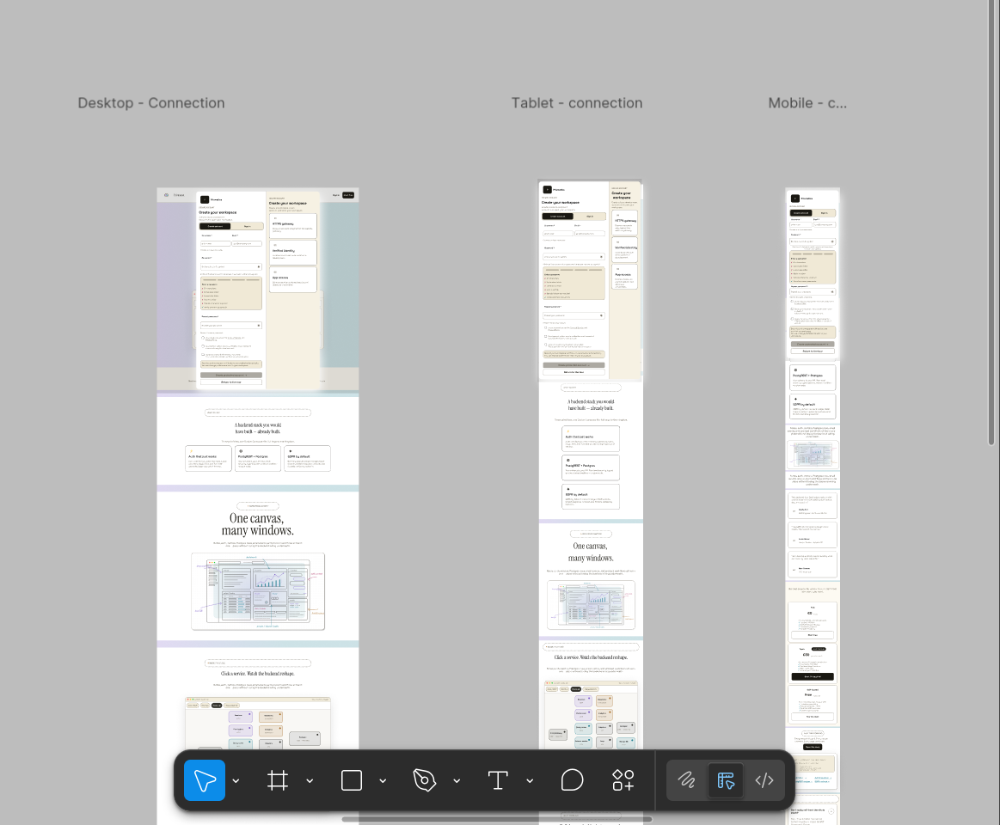
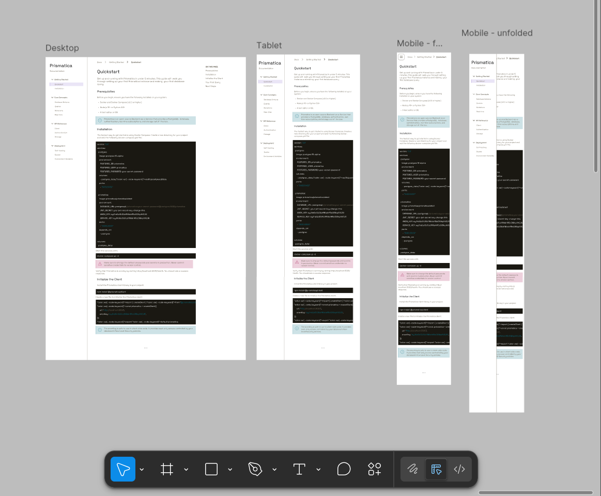
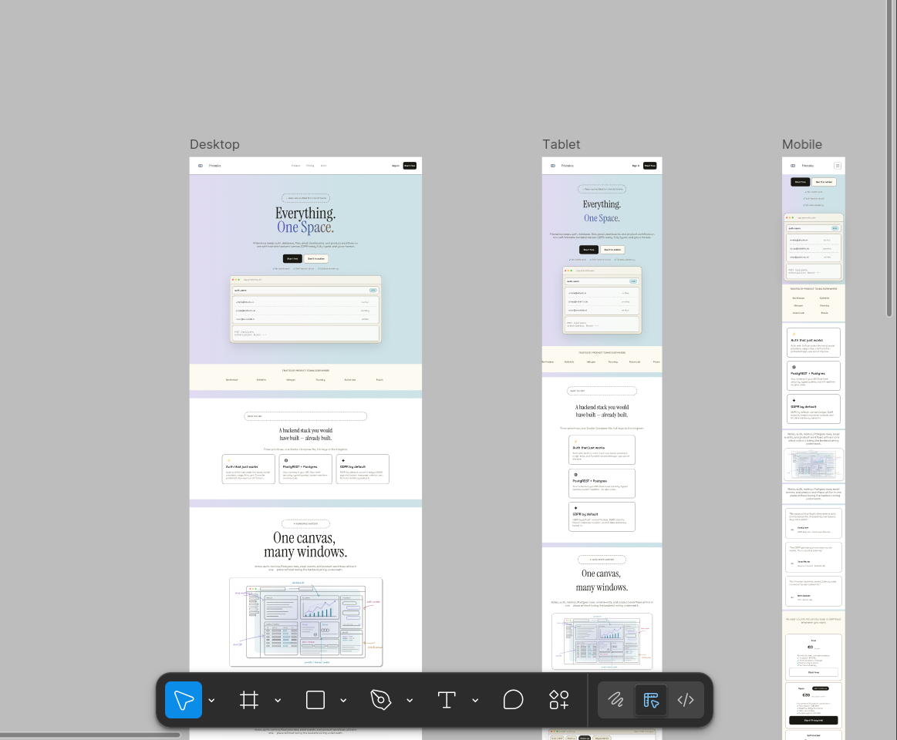

#### Charte graphique
afin d'assurer une identité visuelle cohérente et consistante avec les standards de l'application, nous avons défini une charte graphique claire. Le choix des couleurs et de la typographie a été guidé par deux impératifs. Le respect de l'accessibilité et la nécessité d'une bonne lisibilité pour les users qui liront à la fois webpage et l'interface utilisateur de l'application.


Comme l'on peut le voir, sur lightouse, on a des très bon résultats avec un contraste de 7.5:1 pour les textes normaux et 4.5:1 pour les titres, ce qui dépasse largement les recommandations WCAG 2.1 pour l'accessibilité.
avec un score de 100/100 en accessibilité.


### Captures d'écran des interfaces utilisateur

**Vue Calendrier** — agenda intégré pour les pages de type date/planification, avec navigation mensuelle et gestion des blocs de contenu liés à chaque entrée.


**Dashboard d'accueil** — première chose qu'on voit en ouvrant l'app : un tableau de bord personnalisable avec des widgets créés à la volée depuis la page d'accueil. C'est ici que l'utilisateur configure son espace de travail.


**Diagramme entité-relation** — schéma de la base de données conçu sur Miro en amont du développement. Il a servi de référence tout au long du projet pour structurer les relations entre pages, blocs, workspaces et utilisateurs.


**Rendu base de données** — vue tabulaire d'une database Osionos, proche du rendu Notion. Chaque colonne est un champ configurable, chaque ligne un enregistrement lié à une page.


**Dossier projet traduit en japonais** — démonstration de la fonctionnalité de traduction intégrée : ce dossier a été traduit automatiquement en japonais depuis notre système de notation interne. Une feature qu'on n'avait pas prévue au départ et qu'on a glissée parce qu'on pouvait.


**Espace mail** — module de messagerie intégré à l'espace de travail, accessible directement depuis la sidebar. Permet de gérer les communications sans quitter l'app.


**Portail de connexion** — page d'authentification avec login 42 OAuth2. L'accès est sécurisé, les tokens sont gérés côté BaaS via GoTrue, et les secrets nécessaires au runtime sont générés ou récupérés via Vault plutôt que versionnés.


**Second Brain** — vue "note libre" inspirée du concept de second cerveau numérique. Un espace sans structure imposée où l'utilisateur peut penser et organiser librement avec les blocs Osionos.


---

### Optimisations front-end et résultats mesurés

Sur Osionos, la performance front n'est pas un bonus : l'application affiche des pages longues, des blocs imbriqués, des bases de données visuelles, un graphe de connaissances, des menus contextuels et des panneaux de réglages. Sans stratégie explicite, l'interface deviendrait lente avant même que l'utilisateur ait construit un vrai workspace.

J'ai donc travaillé sur quatre axes : **ne pas rendre ce qui n'est pas visible**, **ne pas recalculer ce qui n'a pas changé**, **ne pas écrire au backend à chaque frappe**, et **ne pas charger les bibliothèques lourdes tant qu'elles ne sont pas nécessaires**. Les optimisations ci-dessous sont tirées du code actuel, pas d'une intention théorique.

#### Virtualisation des blocs longs

Le renderer lecture seule utilise `@tanstack/react-virtual` dans [apps/osionos/app/src/widgets/page-renderer/ui/PageBlocksRenderer.tsx](../apps/osionos/app/src/widgets/page-renderer/ui/PageBlocksRenderer.tsx). La virtualisation ne s'active pas tout de suite : elle démarre seulement au-dessus du seuil défini dans [apps/osionos/app/src/entities/block/model/blockVirtualization.ts](../apps/osionos/app/src/entities/block/model/blockVirtualization.ts), pour éviter de complexifier le rendu des petites pages.

```tsx
// apps/osionos/app/src/widgets/page-renderer/ui/PageBlocksRenderer.tsx
const renderMeta = useMemo(() => createRootBlockRenderMeta(blocks), [blocks]);
const shouldVirtualize = blocks.length >= ROOT_BLOCK_VIRTUALIZATION_THRESHOLD;
const virtualizer = useVirtualizer({
  count: shouldVirtualize ? renderMeta.length : 0,
  getScrollElement: () => scrollElement,
  estimateSize: (index) => estimateBlockHeight(renderMeta[index]?.block ?? blocks[0]),
  getItemKey: (index) => renderMeta[index]?.block.id ?? index,
  overscan: ROOT_BLOCK_VIRTUALIZATION_OVERSCAN,
  scrollMargin,
});
```

Le même composant mesure le décalage réel avec un `ResizeObserver`, parce qu'une page Osionos n'a pas des lignes de hauteur fixe : un bloc peut être un paragraphe, une image, une base inline ou une table.

#### Cache et mémoïsation du rendu Markdown

Le rendu des blocs est coûteux parce qu'un même texte passe par le moteur Markdown interne (`markengine`). Pour éviter de parser plusieurs fois le même contenu, [apps/osionos/app/src/entities/block/ui/ReadOnlyBlock.tsx](../apps/osionos/app/src/entities/block/ui/ReadOnlyBlock.tsx) utilise un cache LRU simple, limité à 2000 entrées.

```tsx
// apps/osionos/app/src/entities/block/ui/ReadOnlyBlock.tsx
const INLINE_MARKDOWN_CACHE_LIMIT = 2000;
const inlineMarkdownCache = new Map<string, React.ReactNode>();

function renderCachedInlineMarkdown(content: string): React.ReactNode {
  const cached = inlineMarkdownCache.get(content);
  if (cached !== undefined) {
    inlineMarkdownCache.delete(content);
    inlineMarkdownCache.set(content, cached);
    return cached;
  }

  const rendered = timed("renderInlineToReact", () => renderInlineToReact(content, {
    internalLinkRenderer: renderInternalPageLink,
  }));
  inlineMarkdownCache.set(content, rendered);

  if (inlineMarkdownCache.size > INLINE_MARKDOWN_CACHE_LIMIT) {
    const oldestKey = inlineMarkdownCache.keys().next().value;
    if (oldestKey !== undefined) inlineMarkdownCache.delete(oldestKey);
  }

  return rendered;
}
```

Le composant final est aussi protégé par `React.memo`, avec une comparaison ciblée sur le bloc, son index et sa profondeur. L'objectif n'est pas de mettre `memo` partout, mais de protéger les nœuds très nombreux.

```tsx
// apps/osionos/app/src/entities/block/ui/ReadOnlyBlock.tsx
function areReadOnlyBlockPropsEqual(previous: BlockProps, next: BlockProps): boolean {
  return (
    previous.block === next.block &&
    previous.index === next.index &&
    (previous.bulletDepth ?? 0) === (next.bulletDepth ?? 0) &&
    (previous.numberedDepth ?? 0) === (next.numberedDepth ?? 0)
  );
}

export const ReadOnlyBlock = React.memo(ReadOnlyBlockImpl, areReadOnlyBlockPropsEqual);
```

#### Sauvegarde différée et appels asynchrones

Chaque frappe dans l'éditeur ne déclenche pas une requête réseau. La persistance ne part plus en *fire-and-forget* à chaque frappe : elle passe désormais par un **outbox** côté store ([apps/osionos/app/src/store/sync/usePageSync.ts](../apps/osionos/app/src/store/sync/usePageSync.ts)), qui s'abonne au page store, écrit chaque changement via le bridge **avec retry**, et n'avance son ledger qu'après confirmation — donc une édition faite hors-ligne n'est jamais perdue. Les anciennes fonctions de [pageStore.persistence.ts](../apps/osionos/app/src/store/pageStore.persistence.ts) sont conservées en no-op pour préserver leurs points d'appel ; les paramètres suivent une logique de persistance analogue via [settingsStoreUtils.ts](../apps/osionos/app/src/store/settings/settingsStoreUtils.ts).

```ts
// apps/osionos/app/src/store/pageStore.persistence.ts
// Page persistence now flows through the BaaS OUTBOX (src/store/sync/usePageSync):
// it subscribes to the page store, writes each change through the bridge WITH retry,
// and only advances its ledger on confirm — so an offline edit is never lost.

/** No-op: block content is persisted by the outbox (see usePageSync). */
export function debouncePersistContent(_pageId: string) {
  // No-op: usePageSync's store subscription detects the edit and persists it with retry.
}
```

La traduction de page montre aussi une pratique de performance : chaque bloc est traduit de manière asynchrone, avec un cache de promesses pour éviter de traduire deux fois le même texte dans la même opération. C'est dans [apps/osionos/app/src/services/page-actions/index.ts](../apps/osionos/app/src/services/page-actions/index.ts).

```ts
// apps/osionos/app/src/services/page-actions/index.ts
const cacheKey = `${targetLocale}\u0000${text}`;
const cached = cache.get(cacheKey);
if (cached) return cached;

const promise = (async () => {
  for (const translator of [
    () => translateWithConfiguredEndpoint(text, targetLocale, jwt),
    () => translateWithGooglePublicEndpoint(text, targetLocale),
    () => translateWithMyMemory(text, targetLocale),
  ]) {
    try {
      const translated = await translator();
      if (translated && !looksLikePrefixTranslation(translated, targetLocale)) {
        return translated;
      }
    } catch {
      // Try the next translation provider.
    }
  }

  return text;
})();
```

#### Chargement différé ciblé

Le lazy loading existe, mais il faut être précis : **Mermaid** est bien chargé dynamiquement par [apps/osionos/app/src/shared/ui/molecules/MermaidDiagram/MermaidDiagram.tsx](../apps/osionos/app/src/shared/ui/molecules/MermaidDiagram/MermaidDiagram.tsx), et le sous-système de base de données embarqué (`notion-database-sys`) utilise `React.lazy` dans son composant `object_database.tsx` pour `DatabaseBlock`, `BlockHandle` et `PageModal`. Et **KaTeX** est lui aussi chargé dynamiquement : [apps/osionos/app/src/shared/lib/math/katexRuntime.ts](../apps/osionos/app/src/shared/lib/math/katexRuntime.ts) ne charge katex et sa feuille de style (~580 KiB) qu'au premier rendu d'équation, via `import('katex')`, pour le garder hors du chunk critique de l'éditeur.

```tsx
// apps/osionos/app/src/shared/ui/molecules/MermaidDiagram/MermaidDiagram.tsx
let mermaidInitialized = false;
let mermaidPromise: Promise<typeof import("mermaid").default> | null = null;

function loadMermaid() {
  mermaidPromise ??= import("mermaid").then((module) => module.default);
  return mermaidPromise;
}

async function ensureMermaidInitialized() {
  const mermaid = await loadMermaid();
  if (mermaidInitialized) return mermaid;
  mermaid.initialize({
    startOnLoad: false,
    securityLevel: "strict",
    theme: "default",
  });
  mermaidInitialized = true;
  return mermaid;
}
```

#### Mesure de performance en développement

La performance est instrumentée par [apps/osionos/app/src/shared/lib/perf/measure.ts](../apps/osionos/app/src/shared/lib/perf/measure.ts) et branchée dès le root React dans [apps/osionos/app/src/app/main.tsx](../apps/osionos/app/src/app/main.tsx). En dev, tout span supérieur à 4 ms émet un warning `[perf]`, ce qui force à voir les petits coûts qui s'accumulent.

```tsx
// apps/osionos/app/src/app/main.tsx
createRoot(root).render(
  <StrictMode>
    <Profiler id="App" onRender={recordReactCommit}>
      <App />
    </Profiler>
  </StrictMode>,
);
```

```ts
// apps/osionos/app/src/shared/lib/perf/measure.ts
const WARN_THRESHOLD_MS = 4;

function warnIfSlow(name: string, durationMs: number) {
  if (durationMs > WARN_THRESHOLD_MS) {
    console.warn(`[perf] ${name}: ${durationMs.toFixed(1)}ms`);
  }
}
```

#### Astuces de performance : parallélisme, déduplication, cache

Au-delà de la virtualisation et du lazy loading, plusieurs micro-optimisations récurrentes pèsent sur la fluidité perçue. Aucune n'est théorique : chacune est en place dans le code.

**1. Paralléliser les I/O indépendants.** Quand deux appels ne dépendent pas l'un de l'autre, on ne les attend pas en série — on les lance ensemble avec `Promise.all`, et la latence totale devient celle du plus lent au lieu de la somme des deux.

```ts
// apps/osionos/app/src/features/settings/permissions/usePolicyMatrix.ts
const [roleRows, policyRows, roster] = await Promise.all([
  fetchRoles(), fetchPolicies(), fetchPeople(),
]);
```

Le même motif sert en *fan-out* sur une collection : on hydrate en parallèle les pages de tous les workspaces ([App.tsx](../apps/osionos/app/src/app/App.tsx)), on introspecte le schéma de chaque mount en parallèle ([liveMountTables.ts](../apps/osionos/app/src/widgets/database-view/model/liveMountTables.ts)), et quand une source peut échouer sans bloquer les autres, on bascule sur `Promise.allSettled` ([useBaasGraph.ts](../apps/osionos/app/src/widgets/graph-explorer/useBaasGraph.ts)).

**2. Charger les bibliothèques lourdes en parallèle et à la demande.** Le runtime KaTeX charge le JS *et* sa feuille de style ensemble, au premier rendu d'équation et hors du chunk critique ([katexRuntime.ts](../apps/osionos/app/src/shared/lib/math/katexRuntime.ts) : `Promise.all([import("katex"), import("katex/dist/katex.min.css")])`) ; l'écran 2FA importe `qrcode` *pendant* que la requête d'enrôlement est déjà en vol ([SettingsCenter.tsx](../apps/osionos/app/src/features/settings/SettingsCenter.tsx)).

**3. Mémoïser la promesse, pas seulement le résultat.** Pour dédupliquer le travail asynchrone concurrent, on met en cache la *promesse en cours* : deux appels identiques rapprochés partagent le même vol réseau. C'est le cas de la traduction de blocs ([page-actions/index.ts](../apps/osionos/app/src/services/page-actions/index.ts) — un même texte n'est jamais traduit deux fois) et des GET de l'api-client ([client.ts](../apps/osionos/app/src/shared/api/client.ts) : `inflightGets`), doublés d'un cache de schéma de 60 s côté live mounts.

**4. Plafonner la concurrence.** L'api-client borne le nombre de requêtes en vol (`MAX_CONCURRENT_REQUESTS = 6`, [client.ts](../apps/osionos/app/src/shared/api/client.ts)) : une vue qui réclame trente pages les draine poliment au lieu de noyer le backend — c'est la correction du *thundering-herd* qui déclenchait des rafales de 429/502.

**5. Cache LRU pour le rendu pur coûteux.** Le rendu du markdown inline d'un bloc est mémoïsé dans un cache LRU borné (`INLINE_MARKDOWN_CACHE_LIMIT = 2000`, [ReadOnlyBlock.tsx](../apps/osionos/app/src/entities/block/ui/ReadOnlyBlock.tsx)) : re-rendre un bloc ne re-parse jamais son markdown, et les entrées les plus anciennes sont évincées quand le cache déborde.

#### Build, bundle et SEO

L'application privée `osionos` est une SPA Vite : elle n'est pas pensée pour le référencement public. Son [index.html](../apps/osionos/app/index.html) garde les bases nécessaires (`lang`, `viewport`, `title`), mais la stratégie SEO du produit est portée par le site Astro `opposite-osiris`, qui rend du HTML statique et définit les balises `description`, `color-scheme`, favicon et preconnect dans [apps/opposite-osiris/src/layouts/Layout.astro](../apps/opposite-osiris/src/layouts/Layout.astro) ; la CSP stricte de production est, elle, générée par `security.csp` d'Astro (voir [astro.config.mjs](../apps/opposite-osiris/astro.config.mjs)).

```astro
<!-- apps/opposite-osiris/src/layouts/Layout.astro -->
<meta name="viewport" content="width=device-width, initial-scale=1.0" />
<meta name="color-scheme" content="light dark" />
<meta name="description" content={description} />
{isDev && <meta http-equiv="Content-Security-Policy" content={developmentCsp} />}
<link rel="preconnect" href="https://fonts.googleapis.com" />
<link rel="preconnect" href="https://fonts.gstatic.com" crossorigin />
<title>{title}</title>
```

La capture Lighthouse disponible dans le dossier a été réalisée sur `https://localhost:4322/`, donc sur le site marketing Prismatica, pas sur l'app privée. Elle montre : **Performance 85**, **Accessibilité 100**, **Best Practices 96**, **SEO 100**, avec **FCP 1,6 s**, **LCP 1,8 s**, **Total Blocking Time 0 ms** et **CLS 0**.


Ces résultats confirment deux choix : le marketing est bien sur Astro pour le SEO et la performance perçue, tandis que l'application privée React/Vite assume une logique différente, centrée sur l'interaction riche, la persistance locale et la productivité.

### Extraits de code, interfaces utilisateur statiques (React / SCSS)

#### a. Organisation minimale du projet front-end

Le front d'Osionos n'est pas organisé comme une simple collection de composants React. Il suit une organisation proche de **Feature-Sliced Design** : les éléments métier vivent dans `entities`, les interactions dans `features`, les assemblages visibles dans `widgets`, l'orchestration dans `app`, et les composants réutilisables dans `shared`.

| Dossier | Rôle dans Osionos | Exemples vérifiés |
|---|---|---|
| [apps/osionos/app/src/app](../apps/osionos/app/src/app/) | Point d'entrée, styles globaux, shell principal | `main.tsx`, `App.tsx`, tokens CSS |
| [apps/osionos/app/src/entities](../apps/osionos/app/src/entities/) | Objets métier affichables | `page`, `block`, `user` |
| [apps/osionos/app/src/features](../apps/osionos/app/src/features/) | Interactions utilisateur | auth, block editor, page management, slash commands, settings |
| [apps/osionos/app/src/widgets](../apps/osionos/app/src/widgets/) | Zones UI composées | sidebar, page renderer, database view, channel messages, graph explorer |
| [apps/osionos/app/src/shared](../apps/osionos/app/src/shared/) | API client, hooks, primitives UI, config, perf | `api/client.ts`, `Modal.tsx`, `Dropdown.tsx`, `measure.ts` |
| [apps/osionos/app/src/store](../apps/osionos/app/src/store/) | Stores Zustand et persistance | pages, database, settings |
| [apps/osionos/app/src/services](../apps/osionos/app/src/services/) | Actions applicatives hors composant | page actions, realtime messages |

Le point d'entrée est volontairement très fin. Il monte React 19, active le `StrictMode`, branche le `Profiler`, puis laisse `App.tsx` assembler le shell.

```tsx
// apps/osionos/app/src/app/main.tsx
import { Profiler, StrictMode } from "react";
import { createRoot } from "react-dom/client";
import App from "./App.tsx";
import { recordReactCommit } from '@/shared/lib/perf/measure';
import './styles/global.css';

const root = document.getElementById("root");
if (root) {
  createRoot(root).render(
    <StrictMode>
      <Profiler id="App" onRender={recordReactCommit}>
        <App />
      </Profiler>
    </StrictMode>,
  );
}
```

`App.tsx` est le shell applicatif : il initialise la session, applique le thème, choisit entre le mode debug, l'écran de handoff Prismatica, puis le layout principal avec sidebar, contenu, settings et notifications.

```tsx
// apps/osionos/app/src/app/App.tsx
return (
  <div
    data-testid="app-shell"
    className="relative flex h-screen w-screen overflow-hidden bg-[var(--osio-bg-page)]"
  >
    <Sidebar
      onOpenSettings={() => setSettingsOpen(true)}
      onOpenHome={() =>
        usePageStore.setState({
          activePage: null,
          showTrash: false,
          navigationPath: [],
        })
      }
      onOpenTrash={() =>
        usePageStore.setState({
          activePage: null,
          showTrash: true,
          navigationPath: [],
        })
      }
    />

    <SidebarTrigger />
    <main className="flex-1 flex min-w-0 overflow-hidden relative">
      <MainContent />
    </main>

    <WorkspaceThemePanel />
    {settingsOpen && <SettingsCenter initialTab="general" onClose={() => setSettingsOpen(false)} />}
    <ToastViewport />
  </div>
);
```

La pile front est visible dans [apps/osionos/app/package.json](../apps/osionos/app/package.json) : React 19, Vite 6, TypeScript, Zustand, Playwright, lucide-react, `@tanstack/react-virtual`, Mermaid, KaTeX, Leaflet, **ECharts** et Recharts (graphiques), `d3-force` (graphe), `livekit-client` (visio temps réel), `i18next` (i18n) et `@simplewebauthn/browser` (WebAuthn). Les scripts passent tous par `scripts/docker-run.sh`, ce qui force le même environnement de build et de test pour tout le monde.

```json
// apps/osionos/app/package.json
{
  "scripts": {
    "build": "bash scripts/docker-run.sh build",
    "typecheck": "bash scripts/docker-run.sh typecheck",
    "lint": "bash scripts/docker-run.sh lint",
    "test:e2e": "bash scripts/docker-run.sh test-e2e",
    "test:canvas": "bash scripts/docker-run.sh test-canvas",
    "test:bridge": "bash scripts/docker-run.sh test-bridge",
    "test:quality": "bash scripts/docker-run.sh quality"
  }
}
```

#### b. Extrait de code 1 : portail de connexion statique et accessible

Le portail de connexion visible dans les captures ne vit pas directement dans la SPA privée `osionos`. Il est rendu côté **Astro** dans `opposite-osiris`, parce que cette partie doit être rapide, indexable et accessible avant même que l'utilisateur n'ouvre son workspace. C'est un choix important : la page publique est statique et SEO-friendly ; l'application React privée commence après le handoff sécurisé.

Le composant [apps/opposite-osiris/src/components/ui/Portal.astro](../apps/opposite-osiris/src/components/ui/Portal.astro) montre cette attention à l'accessibilité : `dialog`, titre lié par `aria-labelledby`, labels associés aux champs, messages `aria-live`, boutons nommés, consentements explicites et zone anti-abus Turnstile.

```astro
<!-- apps/opposite-osiris/src/components/ui/Portal.astro -->
<dialog
  id="portal"
  class={`portal portal--${quick ? 'quick' : 'start'}`}
  aria-labelledby="portal-title"
  data-default-mode={quick ? 'connect' : 'start'}
>
  <h2 id="portal-title" class="visually-hidden">Prismatica workspace portal</h2>
  <button class="portal__close" type="button" aria-label="Close portal" data-close-portal>×</button>

  <section class="portal__panel portal__panel--login" aria-label="Secure connection panel">
    <form class="portal-login" novalidate>
      <label for="portal-email">Email <span aria-hidden="true">*</span></label>
      <input id="portal-email" name="email" type="email" autocomplete="email" inputmode="email" required />
      <p id="portal-email-inline-error" class="field-validation-message" aria-live="polite">
        We verify the email format before sending it.
      </p>

      <div class="turnstile-box" data-turnstile-widget aria-label="Anti-abuse verification"></div>
      <output id="portal-error-msg" class="portal-error" role="status" aria-live="polite" aria-atomic="true"></output>
    </form>
  </section>
</dialog>
```

La validation côté client est portée par [apps/opposite-osiris/src/hooks/useAuth.ts](../apps/opposite-osiris/src/hooks/useAuth.ts). Elle vérifie l'email, la complexité du mot de passe, le token anti-abus, puis appelle la gateway avec `credentials: 'include'` et un retry contrôlé sur les réponses `429`.

```ts
// apps/opposite-osiris/src/hooks/useAuth.ts
export const RFC_5322_EMAIL_REGEX = new RegExp(String.raw`^${EMAIL_LOCAL_PART}@(?:${EMAIL_DOMAIN_LABEL}\.)+[A-Za-z]{2,63}$`);
export const STRONG_PASSWORD_REGEX = /^(?=.*[a-z])(?=.*[A-Z])(?=.*\d)(?=.*[^A-Za-z0-9]).{8,}$/;

function validationMessage(request: AuthRequest, mode: AuthMode): string | null {
  if (!validateEmail(request.email)) return 'Use a valid email address.';
  if (mode === 'register' && !validatePassword(request.password)) {
    return 'Password must be at least 8 characters and include uppercase, lowercase, number, and symbol.';
  }
  if (mode === 'login' && request.password.length === 0) return 'Enter your password.';
  if (!request.turnstileToken) return 'Complete the anti-abuse check.';
  return null;
}
```

L'accessibilité n'est pas limitée au portail. Dans l'application React, les primitives communes portent aussi des comportements clavier : [apps/osionos/app/src/shared/ui/primitives/Modal.tsx](../apps/osionos/app/src/shared/ui/primitives/Modal.tsx) gère `role="dialog"`, `aria-modal`, `Escape`, le focus initial, le focus trap et la restauration du focus ; [apps/osionos/app/src/shared/ui/primitives/Dropdown.tsx](../apps/osionos/app/src/shared/ui/primitives/Dropdown.tsx) implémente `combobox` / `listbox` avec navigation clavier.

```tsx
// apps/osionos/app/src/shared/ui/primitives/Modal.tsx
<div
  ref={dialogRef}
  role="dialog"
  aria-modal="true"
  aria-labelledby={title ? titleId : undefined}
  aria-describedby={description ? descriptionId : undefined}
  tabIndex={-1}
>
  {title ? <h2 id={titleId} className="sr-only">{title}</h2> : null}
  {description ? <p id={descriptionId} className="sr-only">{description}</p> : null}
  {children}
</div>
```

Enfin, le responsive design repose sur des tokens CSS et des valeurs fluides plutôt que sur une pile de breakpoints. [apps/osionos/app/src/pages/notion-page/ui/notionPage.css](../apps/osionos/app/src/pages/notion-page/ui/notionPage.css) utilise `clamp()` pour garder une lecture confortable sur petits et grands écrans.

```css
/* apps/osionos/app/src/pages/notion-page/ui/notionPage.css */
.osionos-page-header,
.osionos-page-properties,
.osionos-page-body {
  max-width: var(--page-content-max-width, 900px);
  width: 100%;
  min-width: 0;
  margin-left: auto;
  margin-right: auto;
  padding-left: var(--page-content-padding-inline, clamp(16px, 11%, 96px));
  padding-right: var(--page-content-padding-inline, clamp(16px, 11%, 96px));
}
```

### Extraits de code, partie dynamique

#### a. Authentification : session Prismatica, bridge sécurisé et fallback offline

L'authentification côté Osionos ne se résume pas à un formulaire React. Le flux réel est en deux temps : le site Astro (`opposite-osiris`) authentifie l'utilisateur, puis l'application `osionos` consomme une session de bridge signée. Si aucun bridge n'est disponible et que le mode offline est autorisé, l'application démarre avec des données seedées pour permettre le développement local.

Dans [apps/osionos/app/src/features/auth/model/userStore.helpers.ts](../apps/osionos/app/src/features/auth/model/userStore.helpers.ts), le token de bridge est lu depuis l'URL, envoyé à l'API, puis retiré immédiatement de la barre d'adresse pour éviter qu'il reste dans l'historique visible.

```ts
// apps/osionos/app/src/features/auth/model/userStore.helpers.ts
export async function consumeBridgeSessionFromLocation(): Promise<BridgeSessionImport | null> {
  const token = bridgeTokenFromLocation();
  if (!token || !API_BASE) return null;
  const response = await fetch(`${API_BASE}/api/auth/bridge/consume`, {
    method: 'POST',
    headers: { Accept: 'application/json', 'Content-Type': 'application/json' },
    credentials: 'include',
    body: JSON.stringify({ token }),
  });
  if (!response.ok) throw new Error('Bridge session could not be imported.');
  const payload = await response.json() as BridgeSessionImport;
  clearBridgeTokenFromLocation();
  return payload;
}
```

Le store Zustand [apps/osionos/app/src/features/auth/model/useUserStore.ts](../apps/osionos/app/src/features/auth/model/useUserStore.ts) centralise l'état utilisateur, les sessions, les workspaces actifs et le fallback offline. Il contient un garde-fou contre le double appel de `init()` en `StrictMode`, ce qui est indispensable avec React 19.

```ts
// apps/osionos/app/src/features/auth/model/useUserStore.ts
let _initInProgress = false;

export const useUserStore = create<UserStore>((set, get) => ({
  personas: uniquePersonas([...INITIAL_PERSONAS.map(p => ({ ...p })), ...readPersistedPersonas()]),
  sessions: {},
  activeUserId: '',
  initialized: false,
  loading: false,
  error: null,

  init: async () => {
    if (get().initialized || _initInProgress) return;
    _initInProgress = true;
    set({ loading: true, error: null });

    try {
      set(await resolveInitialState());
    } catch {
      set(bridgeOnlyMode() ? bridgeSessionRequiredState() : offlineState());
    } finally {
      _initInProgress = false;
    }
  },
}));
```

Le client API commun [apps/osionos/app/src/shared/api/client.ts](../apps/osionos/app/src/shared/api/client.ts) ajoute le JWT seulement quand il existe et transforme les erreurs HTTP en `ApiError` typées. C'est une petite couche, mais elle évite que chaque composant reconstruise sa propre logique `fetch`.

```ts
// apps/osionos/app/src/shared/api/client.ts
async function request<T>(method: string, path: string, body?: unknown, jwt?: string): Promise<T> {
  if (!API_BASE) throw new Error("VITE_API_URL is not configured.");

  const headers: Record<string, string> = { 'Content-Type': 'application/json' };
  if (jwt) headers['Authorization'] = `Bearer ${jwt}`;

  const res = await fetch(`${API_BASE}${path}`, {
    method,
    headers,
    body: body == null ? undefined : JSON.stringify(body),
  });

  if (!res.ok) {
    const errorBody = await res.json().catch(() => null) as ApiErrorBody | null;
    throw new ApiError(errorBody?.error ?? errorBody?.message ?? `${method} ${path} → ${res.status} ${res.statusText}`, res.status);
  }
  if (res.status === 204) return undefined as T;
  return res.json() as Promise<T>;
}
```

#### b. Récupération des données : workspaces, pages et contenu complet

Côté produit, la récupération dynamique porte sur les **workspaces**, les **pages** et le **contenu complet d'une page**. C'est le flux central d'Osionos : l'utilisateur ouvre un espace, choisit une page, puis l'application charge seulement ce qui est nécessaire pour afficher ou éditer cette page.

Dans [apps/osionos/app/src/store/pageStore.actions.ts](../apps/osionos/app/src/store/pageStore.actions.ts), `fetchPages` vérifie d'abord le JWT utilisable par l'API pages, puis le contexte d'accès courant. Si l'utilisateur n'appartient pas au workspace demandé, la requête ne part même pas. Cette vérification front n'est pas la sécurité finale (elle reste côté BaaS/RLS), mais elle évite une mauvaise UX et réduit les appels inutiles.

```ts
// apps/osionos/app/src/store/pageStore.actions.ts
export function createFetchPages(set: SetFn, get: GetFn) {
  return async (workspaceId: string, jwt: string) => {
    const pageJwt = pageApiJwtFromSessionToken(jwt);
    if (!pageJwt) return;
    const context = getCurrentPageAccessContext();
    if (context && !context.workspaceIds.includes(workspaceId)) return;
    if (get().loadingIds.has(workspaceId)) return;
    set((s) => ({ loadingIds: new Set([...s.loadingIds, workspaceId]) }));
    try {
      const data = await api.get<PageEntry[]>(
        `/api/pages/all?workspaceId=${workspaceId}`,
        pageJwt,
      );
      set((s) => ({
        ...derivePageState({
          ...s.pages,
          [workspaceId]: mergeWorkspacePages(s.pages[workspaceId], data),
        }, s.pageIdsByWorkspace),
        loadingIds: new Set([...s.loadingIds].filter((id) => id !== workspaceId)),
      }));
      savePagesCache(get().pages, workspaceId);
    } catch {
      set((s) => ({ loadingIds: new Set([...s.loadingIds].filter((id) => id !== workspaceId)) }));
    }
  };
}
```

Le contenu complet d'une page est chargé à la demande. [apps/osionos/app/src/widgets/page-renderer/ui/MainContent.tsx](../apps/osionos/app/src/widgets/page-renderer/ui/MainContent.tsx) ne fetch que si la page active est une vraie page, que le JWT existe et que le contenu n'est pas déjà dans le store.

```tsx
// apps/osionos/app/src/widgets/page-renderer/ui/MainContent.tsx
useEffect(() => {
  if (!activePage || activePage?.kind !== "page" || !jwt) return;
  const page = pageById(activePage.id);
  if (!page) {
    fetchPageContent(activePage.id, jwt);
  }
}, [activePage, jwt, pageById, fetchPageContent]);
```

La fonction appelée côté store vérifie ensuite que la page existe, que l'utilisateur peut la lire, puis fusionne les champs revenus de l'API dans l'état local.

```ts
// apps/osionos/app/src/store/pageStore.actions.ts
export function createFetchPageContent(set: SetFn, get: GetFn) {
  return async (pageId: string, jwt: string) => {
    const pageJwt = pageApiJwtFromSessionToken(jwt);
    if (!pageJwt || !isPersistedPageId(pageId)) return;
    const page = get().pageById(pageId);
    const context = getCurrentPageAccessContext();
    if (!page || !canReadPage(page, context)) return;
    try {
      const fullPage = await api.get<PageEntry>(`/api/pages/${pageId}`, pageJwt);
      if (!fullPage) return;
      set((s) => ({
        ...derivePageState(updatePageInState(s.pages, pageId, (p) => ({
          ...p,
          content: fullPage.content ?? p.content,
          title: fullPage.title ?? p.title,
          icon: fullPage.icon ?? p.icon,
          cover: fullPage.cover ?? p.cover,
          updatedAt: fullPage.updatedAt ?? p.updatedAt,
        })), s.pageIdsByWorkspace),
      }));
      savePagesCache(get().pages, page.workspaceId);
    } catch (err) {
      console.warn("[pageStore] fetchPageContent failed:", pageId, err);
    }
  };
}
```

#### c. Actions métier critiques : archiver, supprimer, verrouiller, traduire, restaurer

Dans Osionos, les actions métier critiques sont : **archiver une page**, **supprimer une page**, **dupliquer une page**, **changer ses permissions implicites**, **verrouiller l'édition**, **traduire son contenu**, ou **restaurer une version**. Ce sont des actions visibles par l'utilisateur, mais elles modifient aussi l'état local, la persistance et parfois les descendants d'une page.

Avant d'exécuter une action dangereuse, [apps/osionos/app/src/features/page-management/ui/PageOptionsMenu.tsx](../apps/osionos/app/src/features/page-management/ui/PageOptionsMenu.tsx) vérifie le contexte d'accès local via `canDeletePage` ou `canDuplicatePage`, puis appelle le store. Cette vérification ne remplace pas le backend ; elle protège l'interface et évite de proposer des actions incohérentes.

```tsx
// apps/osionos/app/src/features/page-management/ui/PageOptionsMenu.tsx
const handleDuplicateClick = async (e: React.MouseEvent) => {
  e.stopPropagation();
  setIsMenuOpen(false);
  if (!workspaceId) return;
  if (!currentPage || !canDuplicatePage(currentPage, getCurrentPageAccessContext())) return;

  try {
    await duplicatePage(pageId, workspaceId);
  } catch (err) {
    console.error("[PageOptionsMenu] Failed to duplicate page", err);
  }
};

const handleConfirmDelete = async () => {
  if (!workspaceId) return;
  if (!currentPage || !canDeletePage(currentPage, getCurrentPageAccessContext())) return;
  await deletePage(pageId, workspaceId, jwt ?? "");
  redirectIfAffectedPageChanged();
};
```

Les règles d'accès front sont centralisées dans [apps/osionos/app/src/shared/lib/auth/pageAccess.ts](../apps/osionos/app/src/shared/lib/auth/pageAccess.ts), au lieu d'être recopiées dans chaque composant.

```ts
// apps/osionos/app/src/shared/lib/auth/pageAccess.ts
export function canReadPage(page: PageEntry, context: PageAccessContext | null): boolean {
  if (!context || !hasWorkspaceAccess(page, context)) return false;

  const visibility = normalizePageVisibility(page.visibility);
  if (visibility === "public") return true;
  if (visibility === "shared") return true;
  if (page.ownerId && page.ownerId === context.userId) return true;
  if (isLegacyPage(page)) return true;

  return getCollaboratorRole(page, context.userId) !== null;
}

export function canEditPage(page: PageEntry, context: PageAccessContext | null): boolean {
  if (!context || !hasWorkspaceAccess(page, context)) return false;
  if (context.sharedWorkspaceIds.includes(page.workspaceId)) return true;
  if (page.ownerId && page.ownerId === context.userId) return true;
  if (isLegacyPage(page)) return true;
  const collaboratorRole = getCollaboratorRole(page, context.userId);
  return collaboratorRole === "editor" || collaboratorRole === "owner";
}
```

L'archivage montre bien la logique métier : on patch le backend quand un JWT existe, puis on met à jour localement la page et tous ses descendants, en nettoyant aussi les pages récentes. C'est dans [apps/osionos/app/src/store/pageStore.actions.ts](../apps/osionos/app/src/store/pageStore.actions.ts).

```ts
// apps/osionos/app/src/store/pageStore.actions.ts
export function createArchivePage(set: SetFn, get: GetFn) {
  return async (pageId: string, workspaceId: string, jwt: string) => {
    const page = get().pageById(pageId);
    const context = getCurrentPageAccessContext();
    if (!page || !canDeletePage(page, context)) return;

    const archivedAt = new Date().toISOString();
    const pageJwt = pageApiJwtFromSessionToken(jwt);

    if (pageJwt && isPersistedPageId(pageId)) {
      try {
        await api.patch(`/api/pages/${pageId}`, { archivedAt }, pageJwt);
      } catch {
        /* silent */
      }
    }

    set((s) => {
      const wsPages = s.pages[workspaceId] ?? [];
      const descendantIds = getAllDescendantIds(wsPages, pageId);
      const archivedIds = new Set([pageId, ...descendantIds]);
      const newRecents = s.recents.filter((r) => !archivedIds.has(r.id));
      const pages = {
        ...s.pages,
        [workspaceId]: wsPages.map((p) => archivedIds.has(p._id) ? { ...p, archivedAt } : p),
      };
      return { ...derivePageState(pages, s.pageIdsByWorkspace), recents: newRecents };
    });
    savePagesCache(get().pages, workspaceId);
  };
}
```

Les actions de page plus avancées sont regroupées dans [apps/osionos/app/src/entities/page/model/usePageActions.ts](../apps/osionos/app/src/entities/page/model/usePageActions.ts). Ce hook gère le compteur de mots, les versions automatiques, la traduction, l'import/export, les notifications, le mode présentation et le verrouillage de page.

```tsx
// apps/osionos/app/src/entities/page/model/usePageActions.ts
const toggleLock = useCallback(
  () => updatePageSetting(
    { locked: !config.locked },
    'lock_page',
    config.locked ? 'Page unlocked' : 'Page locked',
  ),
  [config.locked, updatePageSetting],
);

const translate = useCallback(async (targetLocale = translateLocale) => {
  if (!page || !pageId) return;
  const label = translationLabel(targetLocale);
  await snapshot(`Before translation to ${label}`);
  const translated = await translatePage(page, jwt ?? undefined, targetLocale);
  if (translated.title) updatePageTitle(pageId, translated.title);
  if (translated.content) updatePageContent(pageId, translated.content);
  await logAction('translate', `Page translated to ${label}`, { targetLocale });
}, [jwt, logAction, page, pageId, snapshot, translateLocale, updatePageContent, updatePageTitle]);
```

### Accessibilité, sécurité front et qualité mesurable

#### Accessibilité intégrée aux composants

L'accessibilité est visible à plusieurs niveaux du code : un lien d'évitement sur la page Astro, des boutons nommés, des tabs avec `aria-selected`, des breadcrumbs avec `aria-current`, un éditeur `contentEditable` annoncé comme textbox multiligne, et des modales avec focus trap.

```astro
<!-- skip-link : src/layouts/Layout.astro · announcer + main : src/pages/index.astro -->
<a href="#main-content" class="skip-link">Skip to main content</a>
<div aria-live="polite" aria-atomic="true" class="visually-hidden" id="global-announcer"></div>
<main id="main-content" class="swipe-stack" data-swipe-stack>
  ...
</main>
```

```tsx
// apps/osionos/app/src/widgets/sidebar/ui/SidebarTopNav.tsx
<div role="tablist" aria-label="Sidebar navigation">
  {tabs.map((tab) => (
    <button
      key={tab.id}
      type="button"
      role="tab"
      aria-selected={tab.active}
      aria-label={tab.label}
      title={tab.label}
    >
      <span className="flex shrink-0 items-center opacity-80">{tab.icon}</span>
      <span className={tab.active ? 'ml-1.5 truncate' : 'sr-only'}>{tab.label}</span>
    </button>
  ))}
</div>
```

```tsx
// apps/osionos/app/src/components/blocks/EditableContent.tsx
<div
  ref={ref}
  role="textbox"
  aria-multiline="true"
  tabIndex={0}
  contentEditable
  suppressContentEditableWarning
  spellCheck
  data-placeholder={hasFocus ? placeholder : ""}
  onInput={handleInput}
  onKeyDown={handleKeyDown}
  onPaste={handlePaste}
/>
```

#### Sécurité côté rendu et navigation

Le front ne doit jamais être présenté comme la couche finale de sécurité : la vraie barrière reste côté BaaS (Kong, JWT, PostgREST, RLS, `owner_id`). En revanche, le front réduit le risque dès le rendu. Le moteur Markdown échappe le texte HTML, filtre les schémas d'URL dangereux et ajoute `rel="noopener noreferrer"` sur les liens externes.

```ts
// apps/osionos/app/src/shared/lib/markengine/renderCore.ts
export function escapeHtml(value: string): string {
  return value.replaceAll(HTML_ESCAPE_PATTERN, (char) => HTML_ESCAPE_MAP[char]);
}

export function sanitizeUrl(value: string): string {
  const normalized = stripUrlControlAndSpaceChars(value.trim());
  const schemeMatch = /^([a-z][a-z\d+.-]*):/i.exec(normalized);
  if (!schemeMatch) return value.trim();

  const scheme = schemeMatch[1].toLowerCase();
  if (scheme === "http" || scheme === "https" || scheme === "mailto" || scheme === "tel") {
    return value.trim();
  }

  return "";
}
```

```ts
// apps/osionos/app/src/shared/lib/markengine/markdown/renderers/inlineHtml.ts
function renderLink(node: Extract<InlineNode, { type: "link" }>, options: ResolvedInlineHtmlOptions): string {
  const href = sanitizeUrl(node.href);
  const attrs = [
    `href="${esc(href || "#")}"`,
    options.externalLinks && isExternalUrl(href) ? 'target="_blank" rel="noopener noreferrer"' : "",
  ].filter(Boolean).join(" ");
  return `<a ${attrs}>${renderChildren(node.children, options)}</a>`;
}
```

Le composant de coloration syntaxique [apps/osionos/app/src/shared/ui/molecules/CodeSyntaxHighlight/CodeSyntaxHighlight.tsx](../apps/osionos/app/src/shared/ui/molecules/CodeSyntaxHighlight/CodeSyntaxHighlight.tsx) utilise `dangerouslySetInnerHTML`, mais seulement après échappement manuel pour les langages inconnus et après `highlight.js` pour les langages enregistrés.

```tsx
// apps/osionos/app/src/shared/ui/molecules/CodeSyntaxHighlight/CodeSyntaxHighlight.tsx
function escapeHtml(value: string) {
  return value
    .replaceAll("&", "&amp;")
    .replaceAll("<", "&lt;")
    .replaceAll(">", "&gt;")
    .replaceAll('"', "&quot;");
}

if (!hljs.getLanguage(normalized)) {
  return escapeHtml(code);
}
```

Enfin, le site public Astro applique une CSP stricte en production via `security.csp` dans [apps/opposite-osiris/astro.config.mjs](../apps/opposite-osiris/astro.config.mjs) — Astro auto-hashe les `<script>` qu'il émet — avec `object-src 'none'`, `base-uri 'self'`, Trusted Types et `require-trusted-types-for 'script'`.

```js
// apps/opposite-osiris/astro.config.mjs — security.csp.directives
"default-src 'self'",
"base-uri 'self'",
"object-src 'none'",
"form-action 'self'",
"connect-src 'self' https:",
"trusted-types prismatica-static-markup",
"require-trusted-types-for 'script'",
// scriptDirective : 'self' + https://challenges.cloudflare.com (scripts auto-hashés par Astro)
```

#### Résumé de ce que montre le front

Ce chapitre front montre donc plusieurs choses concrètes que j'ai réalisées ou intégrées : une architecture React modulaire, un portail d'accès statique accessible côté Astro, une session bridge sécurisée entre Prismatica et Osionos, des stores Zustand avec fallback offline, une récupération de pages asynchrone, des actions métier protégées, une virtualisation des longues pages, un outbox de persistance résistant au hors-ligne, un moteur Markdown instrumenté, et une séparation claire entre **SEO public** (Astro) et **application privée riche** (React/Vite).

## CHAPITRE 4. Les réalisations personnelles, back-end
Ce chapitre présente la partie serveur que j'ai réellement construite ou intégrée. Le back-end n'est pas un seul serveur monolithique : c'est une plateforme composée de briques spécialisées. **Kong** joue le rôle de passerelle, **GoTrue** gère l'authentification, **PostgREST** expose PostgreSQL en REST, **MongoDB** sert les données documentaires, **MinIO** stocke les fichiers, **realtime-agnostic** diffuse les changements, et les services **NestJS** portent la logique que nous maîtrisons directement : `mongo-api`, `query-router`, `adapter-registry`, `schema-service`, `permission-engine`, `storage-router`, `session-service`, `gdpr-service`, `log-service`, `email-service`, `newsletter-service`, `analytics-service` et `ai-service`. Au-delà de ces services NestJS, le back-end s'est doté d'un **plan de données Rust** (`data-plane-router-rust`, en cutover live sur `/data/v1`) qui exécute le CRUD multi-moteur, et d'un **plan de contrôle Go** (`adapter-registry`, `tenant-control`, `orchestrator`, `webhook-dispatcher`) en *shadow* — `adapter-registry` est d'ailleurs désormais le service **Go**, son équivalent TypeScript ayant été retiré après preuve de parité.

La logique générale est simple : **le navigateur ne connaît que des API HTTP**, et les services internes ne se parlent pas par import de code, mais par **réseau Docker**, avec des URLs de service (`http://adapter-registry-go:3021`, `http://permission-engine:3050`, `mongo:27017`, `postgres:5432`) et des jetons internes quand il faut franchir une limite de confiance.

### Architecture de l'API et modèle de données

#### a. Architecture de l'API RESTful

Une API RESTful expose des **ressources** (`users`, `posts`, `databases`, `schemas`, `collections`, `pages`) et laisse les verbes HTTP exprimer l'intention : `GET` pour lire, `POST` pour créer ou déclencher une opération, `PATCH` pour modifier partiellement, `DELETE` pour supprimer. Elle est aussi **stateless** : chaque requête porte son identité dans un JWT, une clé API ou un token de service ; le serveur n'a pas besoin de garder une session applicative en mémoire pour comprendre la requête.

Dans notre projet, l'API est RESTful dans son usage concret : les routes sont structurées par ressources, les services NestJS utilisent des contrôleurs HTTP, PostgREST expose directement les tables PostgreSQL sous `/rest/v1`, et Kong applique les mêmes couches transverses à l'entrée. On reste pragmatique sur un point : toute l'API n'est pas une implémentation REST "académique" avec stratégie HTTP cache complète ; les caches vérifiés sont surtout applicatifs (`query-router` avec TTL local/Redis, cache front, et persistance locale côté Osionos). Mais la séparation client/serveur, l'absence d'état de session serveur et l'usage uniforme des ressources HTTP sont bien là.

| Entrée publique | Service interne | Ressource principale | Rôle |
| --- | --- | --- | --- |
| `/auth/v1/*` | GoTrue | utilisateurs, sessions, OAuth | inscription, connexion, JWT |
| `/rest/v1/<table>` | PostgREST | tables PostgreSQL | CRUD REST protégé par RLS |
| `/mongo/v1/collections/:name/documents` | `mongo-api` | collections MongoDB | CRUD document owner-scoped |
| `/admin/v1/databases` | `adapter-registry` | bases enregistrées | stockage chiffré des connexions |
| `/query/v1/query/:dbId/tables/:table` | `query-router` | table ou collection distante | exécution normalisée multi-moteur |
| `/schemas/v1/schemas` | `schema-service` | table ou collection créée | DDL contrôlé et enregistré |
| `/permissions/v1/permissions/check` | `permission-engine` | rôles et politiques ABAC | décision d'autorisation |
| `/storage/v1/sign/:bucket/*` | `storage-router` | objet MinIO/S3 | URL présignée avec préfixe utilisateur |
| `/realtime/v1` | `realtime-agnostic` | évènements DB | WebSocket / CDC |

Le flux d'une requête ressemble à ceci :

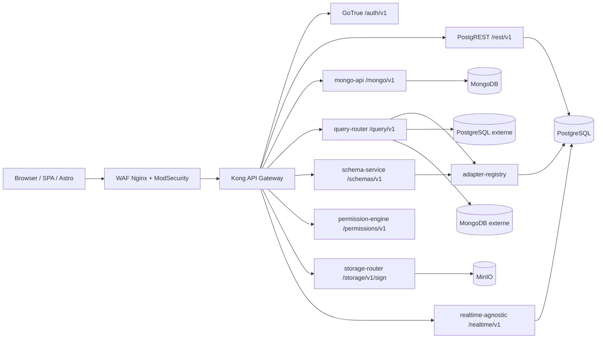

Kong est aussi le point où l'identité devient exploitable par les services internes. La configuration [kong.yml](../apps/baas/mini-baas-infra/docker/services/kong/conf/kong.yml) vérifie les JWT, applique `key-auth`, le rate limiting, les limites de payload, CORS, les headers de sécurité, puis injecte des headers de confiance (`X-User-Id`, `X-User-Email`, `X-User-Role`). Les services NestJS ne revalident donc pas chacun le JWT : ils lisent l'identité déjà validée par la passerelle.

```yaml
# apps/baas/mini-baas-infra/docker/services/kong/conf/kong.yml
- name: rest
  url: http://postgrest:3000
  routes:
    - name: rest-routes
      paths: [/rest/v1]
      strip_path: true
      plugins:
        - name: key-auth
        - name: jwt
          config:
            header_names: [authorization]
            key_claim_name: iss
            claims_to_verify: [exp]
        - name: rate-limiting
          config:
            minute: 180
            hour: 5000
```

> Cet extrait est **représentatif** : le `kong.yml` réel fait aujourd'hui ~875 lignes et déclare **34 services routés**. Au-delà de `/rest/v1`, il route le plan de données Rust (`/data/v1` → `data-plane-router-rust`, cutover live), le plan de contrôle Go (`/admin/v1/{provision,tenants,keys,webhooks,migrate,rotate}`), `/functions/v1`, `/sql` (Trino) et `/studio`.

#### b. Schéma conceptuel de données

La difficulté du projet, c'est qu'il n'y a pas une seule base de données. Il y a un **socle relationnel** pour l'identité, les rôles, les permissions, les registres et les données structurées ; il y a un **modèle Osionos** orienté workspace/pages ; et il y a un **plan document / multi-engine** pour les collections dynamiques et les bases enregistrées par l'utilisateur.

Le premier schéma représente le cœur BaaS : les utilisateurs, les contenus de démonstration, les rôles, les politiques, les bases enregistrées, les schémas créés et les objets de stockage.

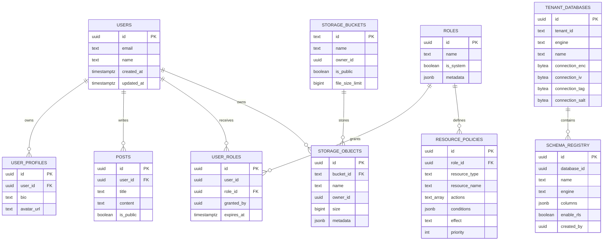

Le second schéma est celui utilisé par le profil `track-binocle` / Prismatica / opposite-osiris. Il est volontairement relationnel : un compte possède des tokens temporaires, des sessions, des activités, des consentements et des demandes RGPD. Les fichiers qui définissent ce modèle sont [models/user.sql](../models/user.sql), [models/auth-security-migration.sql](../models/auth-security-migration.sql) et [models/gdpr-migration.sql](../models/gdpr-migration.sql).

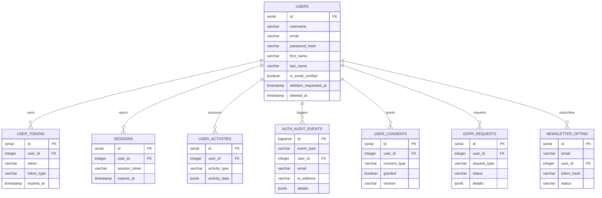

Le troisième schéma décrit la partie Osionos. Le navigateur manipule des pages et des workspaces ; le backend conserve la correspondance durable entre l'identité Prismatica, le workspace privé, les pages, les configurations par utilisateur et les évènements d'action. Cette partie est définie dans [models/osionos-bridge-migration.sql](../models/osionos-bridge-migration.sql).

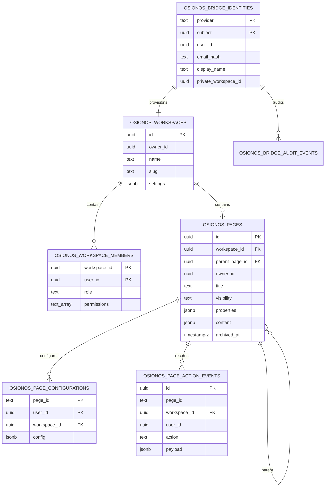

Enfin, le plan MongoDB est plus souple : il ne cherche pas à figer toutes les formes de documents à l'avance. Les collections créées par `schema-service` reçoivent un validateur JSON Schema, un index sur `owner_id`, et les opérations de `mongo-api` ou `query-router` injectent ou filtrent systématiquement par propriétaire.

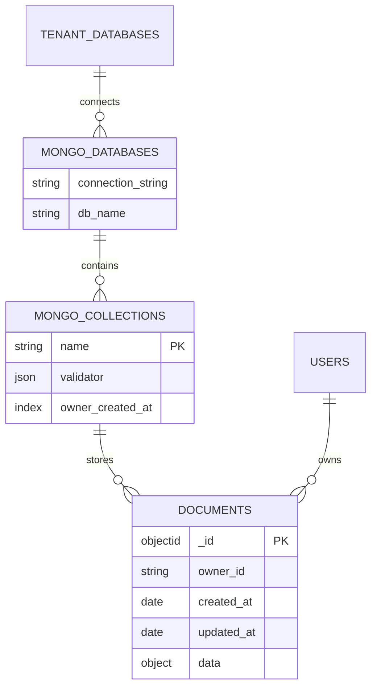

#### c. Schéma physique de données (SPD) et scripts SQL

Le modèle physique est matérialisé par deux familles de scripts.

La première famille est le socle BaaS dans [apps/baas/mini-baas-infra/scripts/migrations/postgresql](../apps/baas/mini-baas-infra/scripts/migrations/postgresql) : création de `auth.uid()`, tables système, RLS, registre d'adapters, ABAC, stockage et triggers realtime.

```sql
-- apps/baas/mini-baas-infra/scripts/migrations/postgresql/001_initial_schema.sql
CREATE OR REPLACE FUNCTION auth.uid() RETURNS UUID AS $$
  SELECT (current_setting('request.jwt.claims', true)::jsonb->>'sub')::uuid;
$$ LANGUAGE SQL STABLE;

CREATE TABLE IF NOT EXISTS public.posts (
  id UUID PRIMARY KEY DEFAULT gen_random_uuid(),
  user_id UUID NOT NULL REFERENCES public.users(id) ON DELETE CASCADE,
  title TEXT NOT NULL,
  content TEXT,
  is_public BOOLEAN DEFAULT false,
  created_at TIMESTAMPTZ DEFAULT now(),
  updated_at TIMESTAMPTZ DEFAULT now()
);

ALTER TABLE public.posts ENABLE ROW LEVEL SECURITY;

CREATE POLICY posts_select ON public.posts
  FOR SELECT USING (is_public OR auth.uid()::text = user_id::text);
```

Le registre des bases externes est un point sensible : il contient les chaînes de connexion vers des bases utilisateur. Le stockage physique ne garde pas la chaîne en clair ; il conserve le ciphertext, l'IV, le tag GCM et le sel.

```sql
-- apps/baas/mini-baas-infra/scripts/migrations/postgresql/004_add_adapter_registry.sql
CREATE TABLE IF NOT EXISTS public.tenant_databases (
  id               UUID PRIMARY KEY DEFAULT gen_random_uuid(),
  tenant_id        UUID NOT NULL,
  engine           TEXT NOT NULL CHECK (engine IN ('postgresql','mongodb','mysql','redis','sqlite')),
  name             TEXT NOT NULL,
  connection_enc   BYTEA NOT NULL,
  connection_iv    BYTEA NOT NULL,
  connection_tag   BYTEA NOT NULL,
  created_at       TIMESTAMPTZ DEFAULT now(),
  last_healthy_at  TIMESTAMPTZ,
  UNIQUE(tenant_id, name)
);

ALTER TABLE public.tenant_databases ENABLE ROW LEVEL SECURITY;

CREATE POLICY tenant_databases_owner_crud ON public.tenant_databases
  FOR ALL USING (auth.uid()::text = tenant_id::text)
  WITH CHECK (auth.uid()::text = tenant_id::text);
```

Le modèle de permissions est physique lui aussi. Les rôles et les politiques sont en base, et `permission-engine` appelle la fonction SQL `has_permission()` pour prendre une décision reproductible.

```sql
-- apps/baas/mini-baas-infra/scripts/migrations/postgresql/007_permissions_system.sql
CREATE TABLE IF NOT EXISTS public.resource_policies (
  id             UUID PRIMARY KEY DEFAULT gen_random_uuid(),
  role_id        UUID NOT NULL REFERENCES public.roles(id) ON DELETE CASCADE,
  resource_type  TEXT NOT NULL,
  resource_name  TEXT NOT NULL,
  actions        TEXT[] NOT NULL DEFAULT ARRAY['select'],
  conditions     JSONB DEFAULT '{}'::jsonb,
  effect         TEXT NOT NULL DEFAULT 'allow' CHECK (effect IN ('allow', 'deny')),
  priority       INTEGER DEFAULT 0
);

CREATE OR REPLACE FUNCTION public.has_permission(
  p_user_id UUID,
  p_resource_type TEXT,
  p_resource_name TEXT,
  p_action TEXT
) RETURNS BOOLEAN AS $fn$
DECLARE
  pol RECORD;
  found BOOLEAN := false;
BEGIN
  FOR pol IN
    SELECT rp.effect, rp.conditions
    FROM public.resource_policies rp
    JOIN public.user_roles ur ON ur.role_id = rp.role_id
    WHERE ur.user_id = p_user_id
      AND (rp.resource_type = p_resource_type OR rp.resource_type = '*')
      AND (rp.resource_name = p_resource_name OR rp.resource_name = '*')
      AND p_action = ANY(rp.actions)
    ORDER BY rp.priority DESC, rp.effect ASC
  LOOP
    IF pol.effect = 'deny' THEN
      RETURN false;
    END IF;
    found := true;
  END LOOP;

  RETURN found;
END;
$fn$ LANGUAGE plpgsql STABLE SECURITY DEFINER;
```

La deuxième famille de scripts est spécifique aux applications : [models/user.sql](../models/user.sql) pour le modèle utilisateur relationnel, [models/auth-security-migration.sql](../models/auth-security-migration.sql) pour l'audit d'authentification, [models/gdpr-migration.sql](../models/gdpr-migration.sql) pour les consentements et demandes RGPD, et [models/osionos-bridge-migration.sql](../models/osionos-bridge-migration.sql) pour les workspaces/pages Osionos.

```sql
-- models/osionos-bridge-migration.sql
CREATE TABLE IF NOT EXISTS public.osionos_pages (
  id UUID PRIMARY KEY DEFAULT gen_random_uuid(),
  workspace_id UUID NOT NULL REFERENCES public.osionos_workspaces(id) ON DELETE CASCADE,
  parent_page_id UUID REFERENCES public.osionos_pages(id) ON DELETE SET NULL,
  owner_id UUID,
  title TEXT NOT NULL DEFAULT 'Untitled',
  visibility TEXT NOT NULL DEFAULT 'private' CHECK (visibility IN ('private', 'shared', 'public')),
  collaborators JSONB NOT NULL DEFAULT '[]'::jsonb,
  properties JSONB NOT NULL DEFAULT '[]'::jsonb,
  content JSONB NOT NULL DEFAULT '[]'::jsonb,
  archived_at TIMESTAMPTZ,
  created_at TIMESTAMPTZ NOT NULL DEFAULT now(),
  updated_at TIMESTAMPTZ NOT NULL DEFAULT now()
);

ALTER TABLE public.osionos_pages ENABLE ROW LEVEL SECURITY;

CREATE POLICY osionos_pages_update_member ON public.osionos_pages
  FOR UPDATE TO authenticated USING (
    EXISTS (
      SELECT 1 FROM public.osionos_workspace_members member
      WHERE member.workspace_id = public.osionos_pages.workspace_id
        AND member.user_id = auth.uid()
        AND member.permissions && ARRAY['update', 'admin']::TEXT[]
    )
  );
```

#### d. Extrait du script SQL de création et cohérence

La cohérence des données est assurée à plusieurs niveaux, pas seulement par le code applicatif.

1. Les clés étrangères évitent les données orphelines (`ON DELETE CASCADE` pour profils, tokens, sessions, pages enfant de workspace).
2. Les contraintes `CHECK` limitent les états possibles (`visibility`, `role`, `engine`, `effect`).
3. Les index matérialisent les requêtes critiques (`workspace_id`, `parent_page_id`, `updated_at`, `owner_id`).
4. La RLS impose l'isolation même si une route applicative se trompe.
5. Les triggers realtime installés globalement permettent de propager les changements sans écrire un trigger à la main pour chaque future table.

L'extrait suivant montre ce dernier point : la migration [012_realtime_triggers_all_tables.sql](../apps/baas/mini-baas-infra/scripts/migrations/postgresql/012_realtime_triggers_all_tables.sql) installe automatiquement un trigger `AFTER INSERT OR UPDATE OR DELETE` sur les tables existantes et futures.

```sql
CREATE OR REPLACE FUNCTION public.realtime_notify()
RETURNS TRIGGER AS $fn$
DECLARE
  payload JSON;
BEGIN
  payload := json_build_object(
    'table',     TG_TABLE_NAME,
    'schema',    TG_TABLE_SCHEMA,
    'operation', TG_OP,
    'data',      CASE WHEN TG_OP = 'DELETE' THEN row_to_json(OLD) ELSE row_to_json(NEW) END,
    'old_data',  CASE WHEN TG_OP = 'UPDATE' THEN row_to_json(OLD) ELSE NULL END
  );

  PERFORM pg_notify('realtime_events', payload::text);
  RETURN COALESCE(NEW, OLD);
END;
$fn$ LANGUAGE plpgsql SECURITY DEFINER;

CREATE EVENT TRIGGER realtime_auto_trigger_on_create
  ON ddl_command_end
  WHEN TAG IN ('CREATE TABLE')
  EXECUTE FUNCTION public.realtime_auto_trigger();
```

Côté diffusion, le plan realtime (Rust) applique l'optimisation symétrique : quand un évènement part vers des centaines d'abonnés WebSocket, on ne le sérialise **qu'une seule fois**. L'`EventEnvelope` mémoïse son fragment JSON dans un `Arc<OnceLock<String>>` ([envelope.rs](../apps/baas/mini-baas-infra/docker/services/realtime/realtime-agnostic/crates/realtime-core/src/types/envelope.rs) — `rendered_payload_json()`), partagé par tous les abonnés via le clone de l'`Arc` ; chaque connexion n'échappe plus que son propre `sub_id` avant d'écrire la trame. Le résultat est byte-identique à une re-sérialisation par connexion (test de non-régression dans [writer.rs](../apps/baas/mini-baas-infra/docker/services/realtime/realtime-agnostic/crates/realtime-gateway/src/ws_handler/writer.rs)), pour une fraction du coût CPU sous forte charge.

### Extrait de code, structure et sécurité de l'API

#### a. Choix techniques, contexte et logique

NestJS a été choisi pour les services qui demandent une logique applicative claire : validation DTO, injection de dépendances, contrôleurs REST, guards, Swagger, logs structurés et healthchecks. Les services partagent des librairies internes (`@mini-baas/common`, `@mini-baas/database`) mais restent déployables séparément grâce au Dockerfile multi-app.

Le bootstrap d'un service comme `query-router` montre la structure commune : validation stricte, filtre d'erreurs homogène, correlation-id, Swagger, arrêt propre.

```ts
// apps/baas/mini-baas-infra/src/apps/query-router/src/main.ts
async function bootstrap() {
  const app = await NestFactory.create(AppModule, { bufferLogs: true });

  app.useLogger(app.get(PinoLogger));
  app.useGlobalPipes(createValidationPipe());
  app.useGlobalFilters(new AllExceptionsFilter());
  app.useGlobalInterceptors(new CorrelationIdInterceptor());
  app.enableShutdownHooks();

  const swaggerConfig = new DocumentBuilder()
    .setTitle('Query Router')
    .setDescription('Universal data plane — routes queries to registered databases')
    .setVersion('2.0.0')
    .build();

  const config = app.get(ConfigService);
  const port = config.get<number>('PORT', 4001);

  await app.listen(port);
}
```

La validation est volontairement stricte. Un champ non attendu dans un DTO déclenche une erreur `400` au lieu d'être silencieusement accepté.

```ts
// apps/baas/mini-baas-infra/src/libs/common/src/pipes/validation.pipe.ts
export function createValidationPipe(): NestValidationPipe {
  return new NestValidationPipe({
    whitelist: true,
    forbidNonWhitelisted: true,
    transform: true,
    transformOptions: { enableImplicitConversion: true },
  });
}
```

L'identité utilisateur est fournie par Kong puis lue par `AuthGuard`.

```ts
// apps/baas/mini-baas-infra/src/libs/common/src/guards/auth.guard.ts
@Injectable()
export class AuthGuard implements CanActivate {
  canActivate(context: ExecutionContext): boolean {
    const req = context.switchToHttp().getRequest<Request>();

    const userId = req.headers['x-user-id'] as string | undefined;
    const email = req.headers['x-user-email'] as string | undefined;
    const role = req.headers['x-user-role'] as string | undefined;

    if (!userId) {
      throw new UnauthorizedException('Missing authentication — X-User-Id header required');
    }

    req.user = {
      id: userId,
      email: email ?? '',
      role: role ?? 'authenticated',
    } satisfies UserContext;

    return true;
  }
}
```

Les appels internes sensibles, par exemple `query-router` qui demande à `adapter-registry` de déchiffrer une connexion, ne passent pas par un JWT utilisateur classique. Ils utilisent un token de service et un `X-Tenant-Id` explicite. Le service appelé reconstitue alors un contexte `service_role` limité au tenant demandé.

```ts
// apps/baas/mini-baas-infra/src/libs/common/src/guards/service-token.guard.ts
if (serviceToken && expectedToken && serviceToken === expectedToken) {
  const tenantId = req.headers['x-tenant-id'] as string | undefined;
  if (!tenantId) {
    throw new UnauthorizedException('Service token requires X-Tenant-Id header');
  }
  req.user = {
    id: tenantId,
    email: 'service@internal',
    role: 'service_role',
  } satisfies UserContext;
  return true;
}
```

#### b. Extrait 1 : contrôle d'ownership et règle d'habilitation critique

Le contrôle d'ownership est volontairement doublé : **PostgreSQL le fait avec la RLS**, et **MongoDB le fait avec un filtre `owner_id` injecté dans les requêtes**. Ce double modèle est nécessaire parce que PostgreSQL sait appliquer une politique au niveau ligne, alors que MongoDB demande de le faire dans la couche applicative.

Côté PostgreSQL, les requêtes tenant passent par `tenantQuery()`. La méthode ouvre une transaction, pose la variable locale `app.current_user_id`, exécute la requête, puis commit ou rollback. Les politiques SQL peuvent alors comparer `owner_id` ou `tenant_id` à cette valeur.

```ts
// apps/baas/mini-baas-infra/src/libs/database/src/postgres/postgres.service.ts
async tenantQuery<T extends QueryResultRow = Record<string, unknown>>(
  userId: string,
  text: string,
  params?: unknown[],
): Promise<T[]> {
  const client: PoolClient = await this.tenantPool.connect();
  try {
    await client.query('BEGIN');
    await client.query(`SET LOCAL app.current_user_id = $1`, [userId]);
    const result = await client.query<T>(text, params);
    await client.query('COMMIT');
    return result.rows;
  } catch (err) {
    await client.query('ROLLBACK');
    throw err;
  } finally {
    client.release();
  }
}
```

Côté MongoDB, le service retire les champs interdits (`_id`, `owner_id`) fournis par le client, injecte son propre `owner_id`, et ajoute ce propriétaire dans tous les `find`, `patch` et `delete`.

```ts
// apps/baas/mini-baas-infra/src/apps/mongo-api/src/collections/collections.service.ts
async create(collectionName: string, userId: string, data: Record<string, unknown>) {
  const { _id: _, owner_id: __, ...clean } = data;

  const doc = {
    ...clean,
    owner_id: userId,
    created_at: new Date(),
    updated_at: new Date(),
  };

  const col = this.getCollection(collectionName);
  const result = await col.insertOne(doc);

  return this.normalizeDoc({ _id: result.insertedId, ...doc });
}

async patch(collectionName: string, userId: string, docId: string, patch: Record<string, unknown>) {
  const { _id: _, owner_id: __, ...clean } = patch;

  const result = await col.findOneAndUpdate(
    { _id: new ObjectId(docId), owner_id: userId },
    { $set: { ...clean, updated_at: new Date() } },
    { returnDocument: 'after' },
  );
}
```

Le même principe existe dans Osionos, mais à l'échelle workspace/page. Avant de lire ou modifier une page, le bridge vérifie à la fois le token applicatif et l'appartenance au workspace dans PostgREST.

```js
// apps/osionos/app/scripts/bridge-api.mjs
export async function requireWorkspaceAccess(request, workspaceId, permission, config, fetchImpl = fetch) {
  const normalizedWorkspaceId = requireUuid(workspaceId, 'workspaceId');
  const authContext = verifyAppSessionToken(bearerToken(request), config);
  if (!authContext.workspaceIds.includes(normalizedWorkspaceId)) {
    throw Object.assign(new Error('App session is not scoped to this workspace.'), { status: 403 });
  }

  const query = postgrestQuery({
    workspace_id: `eq.${normalizedWorkspaceId}`,
    user_id: `eq.${authContext.userId}`,
    select: 'role,permissions',
    limit: '1',
  });
  const rows = await baasRest(config, fetchImpl, `osionos_workspace_members?${query}`);
  const member = Array.isArray(rows) ? rows[0] : null;

  if (!memberHasPermission(member, normalizePermission(permission))) {
    throw Object.assign(new Error('Workspace permission denied.'), { status: 403 });
  }
}
```

#### c. Extrait 2 : action métier critique, connecter une base et l'utiliser

Une action critique du backend est la connexion d'une base externe. Cette action touche plusieurs risques : secret de connexion, ownership, moteur de base, validation de schéma, puis exécution de requête. C'est pour cela qu'elle traverse plusieurs services.

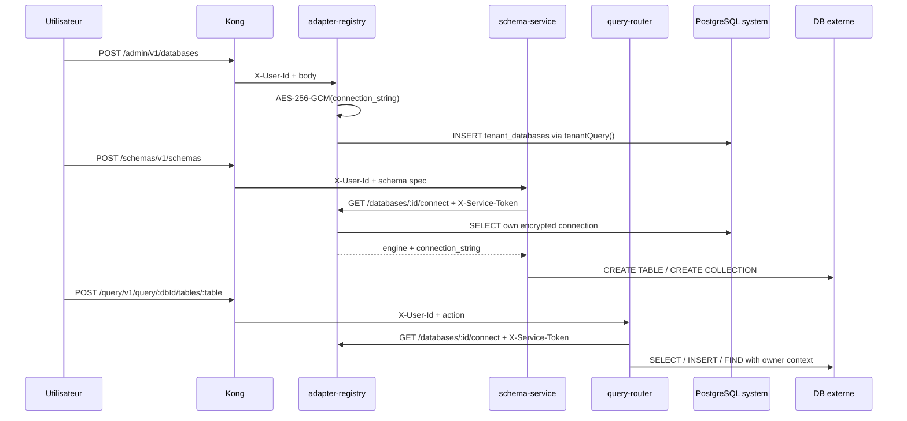

Le contrôleur REST du `query-router` expose seulement deux familles d'actions : exécuter sur une table/collection ou lister les tables/collections disponibles.

```ts
// apps/baas/mini-baas-infra/src/apps/query-router/src/query/query.controller.ts
@ApiTags('query')
@Controller('query')
@UseGuards(AuthGuard)
export class QueryController {
  @Post(':dbId/tables/:table')
  async execute(
    @CurrentUser() user: UserContext,
    @Param('dbId', ParseUUIDPipe) dbId: string,
    @Param('table') table: string,
    @Body() dto: ExecuteQueryDto,
  ) {
    return this.service.executeQuery(dbId, table, user.id, dto);
  }

  @Get(':dbId/tables')
  async listTables(@CurrentUser() user: UserContext, @Param('dbId', ParseUUIDPipe) dbId: string) {
    return this.service.listTables(dbId, user.id);
  }
}
```

Le `query-router` ne connaît jamais directement les secrets de connexion stockés. Il les demande au registre via HTTP interne, avec un token de service.

```ts
// apps/baas/mini-baas-infra/src/apps/query-router/src/query/query.service.ts
private async fetchConnection(dbId: string, userId: string): Promise<AdapterResponse> {
  const url = `${this.registryUrl}/databases/${dbId}/connect`;
  const { data } = await firstValueFrom(
    this.http.get<AdapterResponse>(url, {
      headers: {
        'X-Service-Token': this.serviceToken,
        'X-Tenant-Id': userId,
      },
    }),
  );
  return data;
}
```

Le registre chiffre au moment de l'enregistrement, puis déchiffre seulement pour les appels autorisés.

```ts
// apps/baas/mini-baas-infra/src/apps/adapter-registry/src/crypto/crypto.service.ts
encrypt(plaintext: string): EncryptedPayload {
  const salt = randomBytes(SALT_LENGTH);
  const key = scryptSync(this.masterKey, salt, KEY_LENGTH);
  const iv = randomBytes(IV_LENGTH);

  const cipher = createCipheriv(ALGORITHM, key, iv);
  const encrypted = Buffer.concat([cipher.update(plaintext, 'utf8'), cipher.final()]);
  const tag = cipher.getAuthTag();

  return { encrypted, iv, tag, salt };
}
```

Pour PostgreSQL, `query-router` valide les noms de tables/colonnes, paramètre les valeurs, injecte `owner_id` à l'insert et pose le contexte RLS avant d'exécuter.

```ts
// apps/baas/mini-baas-infra/src/apps/query-router/src/engines/postgresql.engine.ts
const TABLE_REGEX = /^[a-zA-Z_]\w{0,63}$/;
const COLUMN_REGEX = /^[a-zA-Z_]\w*$/;

if (opts.userId) {
  await client.query('BEGIN');
  await client.query(`SET LOCAL app.current_user_id = $1`, [opts.userId]);
}

const enriched = { ...data };
if (userId && !enriched['owner_id']) {
  enriched['owner_id'] = userId;
}
```

Pour MongoDB, le moteur applique le filtre propriétaire, limite les résultats et supprime les constructions dangereuses comme `$where`.

```ts
// query-router — moteur Mongo (legacy) ; l'owner-scoping + le strip d'opérateurs sont aussi portés live par mongo-api/collections.service.ts
private applyOwnerFilter(filter: Record<string, unknown>, userId?: string): Record<string, unknown> {
  if (userId) {
    filter['owner_id'] = userId;
  }
  return filter;
}

private async find(col: Collection, opts: MongoExecuteOptions): Promise<MongoQueryResult> {
  const filter = this.applyOwnerFilter(this.cloneFilter(opts.filter), opts.userId);
  delete filter['$where'];

  const limit = Math.min(opts.limit ?? 100, 100);
  let cursor = col.find(filter).skip(opts.offset ?? 0).limit(limit);
  const sort = this.buildSort(opts.sort);
  if (sort) {
    cursor = cursor.sort(sort);
  }

  const docs = await cursor.toArray();
  return {
    rows: docs.map((d) => this.normalizeDoc(d as Record<string, unknown>)),
    rowCount: docs.length,
  };
}
```

#### d. Extrait 3 : action métier Osionos, créer et modifier une page

Osionos a un backend plus léger, écrit en Node natif dans [bridge-api.mjs](../apps/osionos/app/scripts/bridge-api.mjs). Son rôle est de recevoir une assertion signée depuis Prismatica, créer une session applicative courte, puis servir des routes REST pour les pages. C'est ici que l'on voit le lien réel entre le front riche et le BaaS.

La première barrière est HMAC : Prismatica signe le payload avec un secret partagé, le bridge vérifie le timestamp, la signature et le `jti` pour éviter le rejeu.

```js
// apps/osionos/app/scripts/bridge-api.mjs
export function verifyBridgeRequest({ headers, payload, secret, now = Date.now(), replayStore = new Map() }) {
  const timestampHeader = headers['x-prismatica-bridge-timestamp'];
  const signatureHeader = headers['x-prismatica-bridge-signature'];
  const timestamp = Number(timestampHeader);
  if (!Number.isFinite(timestamp) || Math.abs(now - timestamp) > DEFAULT_TIMESTAMP_SKEW_MS) {
    throw Object.assign(new Error('Bridge assertion timestamp is outside the allowed window.'), { status: 401 });
  }

  const normalizedPayload = validateBridgePayload(payload);
  const expected = bridgeSignature(secret, String(timestampHeader), normalizedPayload);
  if (typeof signatureHeader !== 'string' || !safeCompareHex(expected, signatureHeader)) {
    throw Object.assign(new Error('Bridge signature is invalid.'), { status: 401 });
  }

  if (replayStore.has(normalizedPayload.jti)) {
    throw Object.assign(new Error('Bridge assertion replay rejected.'), { status: 409 });
  }
  replayStore.set(normalizedPayload.jti, { expiresAt: now + DEFAULT_TIMESTAMP_SKEW_MS });
  return normalizedPayload;
}
```

Ensuite, les routes pages restent REST : `GET /api/pages`, `POST /api/pages`, `PATCH /api/pages/:id`, `DELETE /api/pages/:id`. Chaque écriture repasse par `requireWorkspaceAccess()`.

```js
// apps/osionos/app/scripts/bridge-api.mjs
async function handlePageUpdate(url, request, response, config, fetchImpl) {
  const pageId = pageIdFromPath(url.pathname);
  if (!pageId) return false;
  const existing = await fetchPageRow(pageId, config, fetchImpl);
  if (!existing) throw Object.assign(new Error('Page not found.'), { status: 404 });
  await requireWorkspaceAccess(request, existing.workspace_id, 'update', config, fetchImpl);

  const payload = await readJson(request, PAGE_JSON_BODY_LIMIT_BYTES);
  const updateRow = pageUpdateRowFromPayload(payload);
  const rows = await baasRest(config, fetchImpl, `osionos_pages?id=eq.${pageId}`, {
    method: 'PATCH',
    body: updateRow,
    prefer: 'return=representation',
  });

  json(response, 200, pageRowToEntry(Array.isArray(rows) ? rows[0] : rows), config);
  return true;
}
```

### Extraits de code de composants d'accès aux données (DAO)

#### a. Choix techniques, contexte et logique

Dans ce projet, je n'ai pas créé une couche de repositories figés comme dans un back-end CRUD classique. Le besoin était plus large : il fallait parler à PostgreSQL, MongoDB, MinIO, PostgREST et à des bases externes enregistrées dynamiquement. Le rôle de DAO est donc porté par des **services d'accès aux données** et des **engines** :

- `PostgresService` : pool admin + pool tenant avec contexte RLS.
- `MongoService` : client MongoDB partagé, pool, healthcheck.
- `DatabasesService` : registre des bases et chiffrement des connexions.
- `QueryService` : orchestration entre utilisateur, adapter-registry et engine.
- `PostgresqlEngine` / `MongodbEngine` : exécution concrète des opérations.
- `SchemasService` : création des tables/collections à partir d'un schéma unifié.

Ce choix explique aussi pourquoi nous n'avons pas retenu Prisma comme ORM principal. Prisma est excellent quand le modèle relationnel est stable, connu à l'avance et majoritairement PostgreSQL/MySQL. Ici, une partie du produit repose sur des **schémas créés par l'utilisateur**, des **bases externes enregistrées au runtime**, une exécution **PostgreSQL + MongoDB**, et une dépendance forte à la **RLS** et aux variables de session SQL (`SET LOCAL app.current_user_id`). Un client généré statiquement aurait été moins adapté. Le coût de ce choix, c'est qu'on perd une partie du confort type-safe d'un ORM ; on compense par des DTO stricts, des regex de noms d'identifiants, des requêtes paramétrées, des policies SQL et des tests ciblés.

Il faut aussi être précis : les engines **TypeScript** historiques du `query-router` couvrent PostgreSQL et MongoDB. Mais l'exécution multi-moteur réelle est désormais portée par le **plan de données Rust** (`data-plane-router-rust`), vers lequel le `query-router` forwarde par défaut : il route aujourd'hui `postgresql`, `cockroachdb`, `mongodb`, `mysql`, `mariadb`, `redis`, `sqlite`, `mssql` et `http` (cutover live, parité prouvée via `parity-probe.sh`). Ce qui reste honnêtement partiel : la couverture de fonctionnalités varie selon le moteur.

#### b. Extrait 1 : récupération de données owner-scoped

La récupération de documents MongoDB ne dépend pas d'un filtre envoyé par le front. Même si le client envoie un filtre, le service ajoute `owner_id = userId` et retire les champs qui ne doivent pas être contrôlés par le client.

```ts
// apps/baas/mini-baas-infra/src/apps/mongo-api/src/collections/collections.service.ts
async findAll(
  collectionName: string,
  userId: string,
  opts: { limit: number; offset: number; sort?: string; filter?: string },
) {
  const col = this.getCollection(collectionName);
  const query: Record<string, unknown> = { owner_id: userId };

  if (opts.filter) {
    const parsed = JSON.parse(opts.filter) as Record<string, unknown>;
    delete parsed['owner_id'];
    delete parsed['_id'];
    Object.assign(query, parsed);
  }

  let sort: Sort = { created_at: -1 };
  if (opts.sort) {
    const [field, dir] = opts.sort.split(':');
    if (field && dir) {
      sort = { [field]: dir.toLowerCase() === 'asc' ? 1 : -1 };
    }
  }

  const [data, total] = await Promise.all([
    col.find(query).sort(sort).skip(opts.offset).limit(opts.limit).toArray(),
    col.countDocuments(query),
  ]);

  return { data: data.map((d) => this.normalizeDoc(d as Record<string, unknown>)), meta: { total, limit: opts.limit, offset: opts.offset } };
}
```

#### c. Extrait 2 : création d'un schéma utilisable par plusieurs moteurs

`schema-service` est un bon exemple de service métier backend : il ne se contente pas de faire un `CREATE TABLE`. Il vérifie que le moteur demandé correspond à la base enregistrée, crée la structure côté moteur, puis écrit une trace dans `schema_registry`.

```ts
// apps/baas/mini-baas-infra/src/apps/schema-service/src/schemas/schemas.service.ts
async create(userId: string, dto: CreateSchemaDto) {
  const { engine, connection_string } = await this.fetchConnection(dto.database_id, userId);

  if (engine !== dto.engine) {
    throw new BadRequestException(
      `Engine mismatch — database is ${engine} but schema spec says ${dto.engine}`,
    );
  }

  if (engine === 'postgresql') {
    const result = await this.pgEngine.createTable(
      connection_string,
      dto.name,
      dto.columns,
      dto.enable_rls !== false,
    );

    await this.pg.adminQuery(
      `INSERT INTO schema_registry (database_id, name, engine, columns, enable_rls, created_by)
       VALUES ($1, $2, $3, $4::jsonb, $5, $6)
       ON CONFLICT (database_id, name) DO UPDATE SET columns = $4::jsonb, enable_rls = $5`,
      [dto.database_id, dto.name, engine, JSON.stringify(dto.columns), dto.enable_rls !== false, userId],
    );

    return result;
  }
}
```

La partie PostgreSQL ajoute automatiquement `id`, `owner_id`, `created_at`, `updated_at`, puis installe une policy `owner_isolation` si `enable_rls` est actif.

```ts
// apps/baas/mini-baas-infra/src/apps/schema-service/src/engines/postgres-schema.engine.ts
const colDefs: string[] = [
  `id UUID PRIMARY KEY DEFAULT gen_random_uuid()`,
  `owner_id UUID NOT NULL`,
  `created_at TIMESTAMPTZ DEFAULT now()`,
  `updated_at TIMESTAMPTZ DEFAULT now()`,
];

await client.query(`ALTER TABLE public."${tableName}" ENABLE ROW LEVEL SECURITY`);
await client.query(
  `DO $$ BEGIN
     IF NOT EXISTS (SELECT 1 FROM pg_policies WHERE tablename = '${tableName}' AND policyname = 'owner_isolation') THEN
       CREATE POLICY owner_isolation ON public."${tableName}" FOR ALL
         USING (owner_id::text = current_user_id())
         WITH CHECK (owner_id::text = current_user_id());
     END IF;
   END $$`,
);
```

La partie MongoDB crée ou met à jour un validateur JSON Schema et un index utile aux requêtes owner-scoped.

```ts
// apps/baas/mini-baas-infra/src/apps/schema-service/src/engines/mongo-schema.engine.ts
const properties: Record<string, unknown> = {
  owner_id: { bsonType: 'string' },
  created_at: { bsonType: 'date' },
  updated_at: { bsonType: 'date' },
};

if (existing.length) {
  await db.command({ collMod: collectionName, validator, validationLevel: 'strict' });
} else {
  await db.createCollection(collectionName, { validator });
  await db.collection(collectionName).createIndex({ owner_id: 1, created_at: -1 });
}
```

#### d. Préparation au déploiement, orchestration et récupération

Le déploiement est préparé avec Docker Compose et un Dockerfile multi-stage. L'idée n'est pas de construire une image différente à la main pour chaque service NestJS : le même Dockerfile reçoit `ARG APP`, compile seulement l'application demandée, supprime les dépendances de développement, puis exécute le service avec un utilisateur non-root.

```dockerfile
# apps/baas/mini-baas-infra/src/Dockerfile
FROM public.ecr.aws/docker/library/node:${NODE_VERSION}-alpine AS deps
WORKDIR /app
COPY --link package.json package-lock.json ./
RUN --mount=type=cache,target=/root/.npm,sharing=locked \
  npm ci --ignore-scripts --prefer-offline --no-audit --no-fund

FROM deps AS build
ARG APP
COPY --link tsconfig.json tsconfig.build.json nest-cli.json ./
COPY --link libs/ ./libs/
COPY --link apps/${APP}/ ./apps/${APP}/
RUN npx nest build ${APP}

FROM public.ecr.aws/docker/library/node:${NODE_VERSION}-alpine AS runtime
ARG APP
ENV NODE_ENV=production APP_NAME=${APP}
RUN addgroup -S appgroup && adduser -S appuser -G appgroup
USER appuser
CMD ["sh", "-c", "node dist/apps/${APP_NAME}/apps/${APP_NAME}/src/main.js"]
```

Compose orchestre les dépendances avec `depends_on`, `healthcheck`, `restart: unless-stopped`, des volumes persistants, des limites CPU/mémoire et des profils (`data-plane`, `control-plane`, `adapter-plane`, `storage`, `observability`). Exemple avec `query-router` : il ne démarre que si `adapter-registry` et `permission-engine` sont en bonne santé, et il parle aux autres services par DNS Docker.

```yaml
# apps/baas/mini-baas-infra/docker-compose.yml
query-router:
  build:
    context: ./src
    dockerfile: Dockerfile
    args:
      APP: query-router
  environment:
    PORT: 4001
    ADAPTER_REGISTRY_URL: http://adapter-registry-go:3021
    PERMISSION_ENGINE_URL: http://permission-engine:3050
    QUERY_ROUTER_REDIS_URL: redis://redis:6379
    ADAPTER_REGISTRY_SERVICE_TOKEN: ${ADAPTER_REGISTRY_SERVICE_TOKEN}
  depends_on:
    adapter-registry-go:
      condition: service_healthy
    data-plane-router-rust:
      condition: service_healthy
    permission-engine:
      condition: service_healthy
    redis:
      condition: service_started
  networks:
    - mini-baas
  restart: unless-stopped
  healthcheck:
    test: ["CMD-SHELL", "wget -qO- http://localhost:4001/health/live || exit 1"]
```

> Là encore, extrait **représentatif** : le `docker-compose.yml` réel compte aujourd'hui **50 services**. Le registre d'adapters est désormais le service Go `adapter-registry-go:3021`, et le `query-router` dépend aussi du plan de données Rust (`data-plane-router-rust`) vers lequel il forwarde le CRUD multi-moteur.

L'overlay de production [docker-compose.prod.yml](../apps/baas/mini-baas-infra/docker-compose.prod.yml) retire les ports directs des bases (`postgres`, `mongo`, `gotrue`, `postgrest`, `redis`) et garde l'accès via les services prévus. Cela limite la surface d'exposition : en production, la base n'est pas censée être appelée directement depuis l'extérieur.

```yaml
# apps/baas/mini-baas-infra/docker-compose.prod.yml
postgres:
  ports: []
  deploy:
    resources:
      limits:
        memory: 512m
        cpus: '0.50'
    restart_policy:
      condition: on-failure
      delay: 5s
      max_attempts: 3

mongo:
  ports: []
```

Si un serveur applicatif tombe, Compose peut le redémarrer grâce aux healthchecks et aux politiques `restart`. Si `mongo-api` tombe, les documents ne disparaissent pas : ils sont dans le volume `mongo-data`. Si `query-router` tombe, il perd ses caches mémoire, mais les données restent dans PostgreSQL, MongoDB ou la base externe. Si `postgres` redémarre, le volume `postgres-data` conserve les données. Si `realtime-agnostic` redémarre, les prochains changements repartent depuis la base ; la base reste la source de vérité.

Il faut néanmoins être honnête : cette configuration Compose est robuste pour un environnement local, de démonstration ou un petit déploiement, mais ce n'est pas encore une haute disponibilité multi-noeud. Il n'y a pas de failover automatique PostgreSQL multi-réplicas dans ce fichier. Pour une production critique, il faudrait ajouter une stratégie de backup planifiée, un stockage externe, des replicas, une supervision d'alerting et des procédures de restauration testées.

Les scripts de backup/restore existent déjà pour PostgreSQL et MongoDB. Ils montrent la direction opérationnelle : `pg_dump` en format custom pour PostgreSQL, `mongodump` en archive pour MongoDB, puis restauration explicite.

```bash
# apps/baas/mini-baas-infra/docker/services/postgres/tools/backup.sh
BACKUP_FILE="backup_$(date +%Y%m%d).dump"
docker compose exec postgres pg_dump -U postgres -Fc > "${BACKUP_FILE}"

# apps/baas/mini-baas-infra/docker/services/postgres/tools/restore.sh
docker compose exec -T postgres pg_restore -U postgres -d postgres < "${BACKUP_FILE}"

# apps/baas/mini-baas-infra/docker/services/mongo/tools/backup.sh
BACKUP_FILE="mongo_backup_$(date +%Y%m%d).archive"
docker compose exec mongo mongodump --archive > "${BACKUP_FILE}"
```

Les secrets ne sont pas intégrés aux images. Le profil `control-plane` contient Vault, et les scripts d'environnement récupèrent ou génèrent les valeurs nécessaires sans les écrire en clair dans le code source. Le script [ensure-osionos-runtime-secrets.mjs](../apps/baas/scripts/ensure-osionos-runtime-secrets.mjs) génère par exemple les secrets du bridge Osionos en local, tandis que [vault-env.mjs](../apps/baas/scripts/vault-env.mjs) centralise les familles de variables attendues pour les services.

En résumé, le back-end a été pensé comme une plateforme : REST en façade, services spécialisés derrière Kong, bases persistantes, RLS et ownership au plus près des données, secrets chiffrés, déploiement reproductible, et une limite assumée entre ce qui est déjà robuste dans Compose et ce qui demanderait une architecture haute disponibilité complète.

#### e. Le BaaS comme produit : architecture trois plans, coûts mesurés, viabilité

##### L'idée derrière l'architecture

Le BaaS a fini par dépasser son rôle de « back-end d'Osionos » pour devenir un produit en soi, et l'idée structurante est simple : **mettre chaque responsabilité dans le langage qui lui coûte le moins cher**. Le chemin chaud (exécuter une requête) est en **Rust** ; le plan de contrôle (tenants, clés, provisioning, webhooks) est en **Go** ; l'orchestration applicative historique est en **TypeScript/NestJS** — et elle est progressivement retirée. Ce n'est pas un dogme esthétique, c'est un constat **mesuré** ([cost-analysis.md](../apps/baas/wiki/cost-analysis.md), artifacts `footprint-*.json`) :

| Plan | Langage | RAM mesurée par processus |
|---|---|---|
| Plan de données (`data-plane-router-rust`) | Rust | **3,3 MiB** (l'équivalent Node : 127 MiB) |
| Realtime (`realtime-agnostic`) | Rust | ~18 MiB |
| Plan de contrôle (gotrue, adapter-registry, tenant-control…) | Go | 7–59 MiB |
| Orchestration (query-router, permission-engine, log-service…) | Node | **46–84 MiB chacun** |

Le chemin de données qui tournait dans 127 MiB de Node tourne aujourd'hui dans **3,3 MiB de Rust — ~38× plus léger et 5× plus rapide** (requête chaude ~2 ms). Et comme un hébergeur facture la RAM (~5 $/Go/mois chez Fly.io), **chaque MiB économisé est littéralement de l'argent**.

##### La stratégie : mesurer, shadower, ne jamais supprimer sans preuve

Quatre mouvements délibérés, chacun mesuré avant/après — jamais de chiffre sans artifact, jamais de réécriture big-bang :

1. **Réécrire le chemin chaud en Rust, en shadow→parity→cutover.** Le routeur Rust a tourné *à côté* du `query-router` Node, requêtes identiques comparées octet par octet ; la bascule n'a eu lieu qu'après le gate de parité (m36). Gain : −127 MiB par déploiement, latence ÷5, zéro risque de régression pris.
2. **Consolider l'orchestration Node en Go (R2).** Six services Node (~60–84 MiB *chacun*) portés dans **un seul binaire Go** (~24 MiB), soit **−359 MiB** — exactement ce qui fait passer le tier `essential` de ~13 $ à ~6,5 $/mois. Il tourne en *shadow*, fidèle à la discipline.
3. **Construire des éditions plancher.** Le même plan Rust, compilé en statique avec features gatées, donne **`binocle-nano` : un binaire de 5,16 Mo, 2,1 MiB de RAM**, SQLite in-process — CRUD, graph, clés scopées, SSE. Mesuré tête-à-tête contre PocketBase sur la même machine : **inserts 3,8× plus rapides à 1/26ᵉ de la RAM** (et une défaite assumée, documentée : PocketBase garde 1,27× sur le débit de lecture en liste). Coût d'hébergement : **~2 $/mois, < 1 $ à l'arrêt** (scale-to-zero).
4. **Prouver la densité multi-tenant.** Un run réel à **10 000 tenants** a invalidé notre propre hypothèse (les pools allaient bien ; le vrai mur était la vérification de clés Argon2id qui saturait un service plafonné en mémoire). Deux correctifs mesurés : un hash adapté aux clés à haute entropie (chemin froid 263 → 45 ms) et le partage de pools pour les tenants `shared_rls` — l'isolation étant portée par la requête (RLS, owner-scoping), pas par le pool, ce qui a été **prouvé neutre en live sur tous les moteurs** (gate m46 : deux tenants sur un pool partagé, zéro fuite). Résultat : **10 000 tenants → 1 pool, zéro 5xx, p50 3 s → 1,2 s**. Le nombre de pools est désormais indépendant du nombre de tenants — la propriété qui permet d'amortir un nœud à **moins de 1 $/tenant/mois**.

##### Ce que ça coûte, par forme de déploiement

Chaque tier est une forme réelle et reproductible (`make up PACKAGE=<tier>`), chaque chiffre est mesuré en live et gardé par un gate de régression (m32) :

| Forme | RAM mesurée | Coût infra (Fly.io) | Pour quoi |
|---|---|---|---|
| **nano / one** | 2,1 MiB · 1 binaire | **~2 $/mois** (< 1 $ idle) | une app privée, classe PocketBase, sans Docker |
| **basic** | ~460 MiB · 11 services | **~6 $/mois** | CRUD Rust sans Node, SQLite + PostgreSQL |
| **essential** | ~950 MiB · 19 services | ~13 $ → **6,5 $** post-R2 | un produit complet (agrégats, orchestration) |
| **pro** | ~1,4 GiB · 28 services | ~21 $/mois | multi-engine + realtime + storage, < 1 $/tenant amorti |
| **max** | ~3,1 GiB · 41 services | ~41 $/mois | plateforme multi-tenant, analytics, sécurité max |

Les offres elles-mêmes ont été **critiquées puis reconstruites** ([offer-sheet-v2.md](../apps/baas/wiki/offer-sheet-v2.md)) : la v1 avait des rate-limits inventés et un plan gratuit aliasé sur le tier le plus cher ; la v2 dérive chaque rps d'un benchmark de capacité et différencie les tiers par **capacité fonctionnelle**, pas seulement par débit.

##### Alors, un BaaS comme celui-ci est-il viable en production ?

La réponse honnête est : **oui, par formes — et pas encore pour tout.**

**Viable aujourd'hui** : l'app privée mono-utilisateur ou mono-équipe (`nano`/`basic`, la classe PocketBase — et PocketBase fait tourner de vraies productions avec moins que ça) ; le produit unique mono-tenant (`essential`, ~1 Go, backups + RLS + secrets Vault) ; et la densité multi-tenant est **prouvée à 10 000 tenants réels** sur une machine, zéro 5xx. Le chemin de données Rust sert déjà le trafic réel en cutover, parité démontrée. La sécurité est en profondeur (WAF, JWT, RLS au niveau base, chiffrement AES-256-GCM des credentials, secrets hors Git) et chaque affirmation publique cite un artifact reproductible — c'est précisément le niveau d'auditabilité qu'une mise en production exige.

**Pas encore, et c'est documenté** : la haute disponibilité multi-nœud (pas de failover PostgreSQL automatique — un déploiement critique exige des réplicas et des restaurations testées), les traces distribuées (M4), le pinning d'images par digest (`realtime-agnostic:latest` reste une dette de release), et plusieurs composants Go tournent encore en *shadow* — par choix : on ne coupe jamais avant la preuve de parité.

C'est exactement la différence entre « ça tourne » et « c'est un produit » : on sait *ce qui* est prêt, *pour quel usage*, *à quel coût mesuré* — et on sait dire ce qui ne l'est pas encore. Un BaaS auto-hébergé de cette forme est viable en production dès aujourd'hui pour les déploiements mono-tenant et les plateformes multi-tenant de taille moyenne ; la marche restante vers la production critique est identifiée, chiffrée, et sur la roadmap plutôt que sous le tapis.

## CHAPITRE 5. Eléments de sécurité de l'application

La sécurité, c'est probablement la partie du projet où j'ai le plus appris à dire "je sais pas, on va vérifier". Du code qui marche c'est facile — du code sécurisé, ça se vérifie.

L'architecture de sécurité repose sur deux services centraux : **GoTrue** (authentification, hashage bcrypt, émission des JWT) et **Kong** (API gateway, vérification des JWT, contrôle CORS, injection des claims en headers internes). Le flux public prévu passe par WAF puis Kong ; en développement, certains ports locaux restent volontairement exposés pour le debug, et l'overlay de production retire les accès directs aux bases. Ce chapitre détaille comment ces deux services s'assemblent avec les couches applicatives.

### Authentification et gestion des rôles

**Le service d'authentification — GoTrue**

On n'a pas réécrit notre propre serveur d'auth. On a choisi **GoTrue v2.188.1**, le service open-source que Supabase utilise en production. La logique : un service d'auth, c'est un truc où une erreur subtile coûte cher (timing attacks, sessions volées, etc.), alors autant prendre un projet battle-tested plutôt que de faire le malin.

Configuration dans [docker-compose.yml:604-645](../apps/baas/mini-baas-infra/docker-compose.yml#L604-L645) :
- JWT signé en **HS256** (clé symétrique partagée entre GoTrue et Kong)
- Expiration de **3600 secondes** (1 heure) pour les access tokens
- Le `JWT_SECRET` est fourni à GoTrue par l'environnement runtime, généré ou récupéré via le workflow Vault/Makefile — pas en clair dans le code, pas committé. Le script qui décrit ces familles de variables est [vault-env.mjs](../apps/baas/scripts/vault-env.mjs).

**Hashage des mots de passe — bcrypt**

GoTrue utilise **bcrypt** par défaut pour hasher les mots de passe avant insertion dans `auth.users`. C'est le standard de l'industrie, résistant au brute-force grâce au cost factor adaptatif. On n'a pas touché à ça — c'est exactement pour cette raison qu'on a pris GoTrue plutôt que de coder notre propre `hashPassword()` avec un `crypto.pbkdf2()` mal paramétré.

**Le flow login**

Concrètement, quand un utilisateur se connecte :

1. Le front React envoie `email` + `password` à `/api/auth/login` ([useAuth.ts:221-226](../apps/opposite-osiris/src/hooks/useAuth.ts#L221-L226))
2. Le gateway intermédiaire (`auth-gateway.mjs`) valide les champs, puis appelle le SDK BaaS ([auth-gateway.mjs:859-886](../apps/opposite-osiris/scripts/auth-gateway.mjs#L859-L886))
3. Le SDK fait un POST sur GoTrue : `/auth/v1/token?grant_type=password` ([sdk/src/domains/auth.ts:41-50](../apps/baas/sdk/src/domains/auth.ts#L41-L50))
4. GoTrue vérifie le bcrypt, signe un JWT, renvoie `access_token` + `refresh_token`
5. Le `refresh_token` est stocké en cookie **HttpOnly + Secure + SameSite=Lax** ([auth-gateway.mjs:158-160](../apps/opposite-osiris/scripts/auth-gateway.mjs#L158-L160)) — ça, c'est important pour résister au vol par XSS

**Vérification du JWT — Kong au milieu**

Plutôt que chaque microservice vérifie le JWT, c'est **Kong** (l'API gateway) qui le fait une fois pour toutes :

```yaml
# apps/baas/mini-baas-infra/docker/services/kong/conf/kong.yml:15-24
consumers:
  - username: authenticated
    jwt_secrets:
      - key: __GOTRUE_JWT_ISS__
        secret: __JWT_SECRET__
        algorithm: HS256
```

Kong intercepte la requête, valide la signature, vérifie `exp`, puis **décode les claims et les ré-injecte en headers** vers les microservices ([kong.yml:69-101](../apps/baas/mini-baas-infra/docker/services/kong/conf/kong.yml#L69-L101)) :
- `X-User-Id` ← claim `sub`
- `X-User-Email` ← claim `email`
- `X-User-Role` ← claim `role`

Les microservices font confiance à ces headers dans le flux normal parce qu'ils sont derrière Kong sur le réseau Docker. Concrètement : un attaquant ne peut pas envoyer `X-User-Id: 1` directement à `mongo-api` depuis l'hôte, parce que ce port-là n'est pas mappé. Pour les services et bases qui exposent un port local en développement, l'overlay de production réduit cette surface et le contrôle d'accès doit rester porté par Kong, les guards et la base.

**Gestion des rôles — RBAC + ABAC**

Le système de permissions va plus loin qu'un simple RBAC. On a un **ABAC** (Attribute-Based Access Control) qui se superpose aux rôles.

**Les rôles** sont définis en base dans [007_permissions_system.sql:71-77](../apps/baas/mini-baas-infra/scripts/migrations/postgresql/007_permissions_system.sql#L71-L77) :
- `admin` — plateforme complète
- `user` — utilisateur standard (CRUD seulement sur ce qu'il possède)
- `guest` — lecture seule
- `moderator` — modération de contenu
- `service_role` — identité service-to-service interne

**Côté NestJS**, on a un `RolesGuard` qui s'applique après l'`AuthGuard`. Code réel ([roles.guard.ts:35-60](../apps/baas/mini-baas-infra/src/libs/common/src/guards/roles.guard.ts#L35-L60)) :

```ts
@Injectable()
export class RolesGuard implements CanActivate {
  constructor(private readonly reflector: Reflector) {}

  canActivate(context: ExecutionContext): boolean {
    const requiredRoles = this.reflector.getAllAndOverride<string[]>(ROLES_KEY, [
      context.getHandler(),
      context.getClass(),
    ]);
    if (!requiredRoles?.length) return true;

    const req = context.switchToHttp().getRequest<Request>();
    const userRole = req.user?.role;

    if (!userRole || !requiredRoles.includes(userRole)) {
      throw new ForbiddenException(
        `Insufficient permissions — requires one of: ${requiredRoles.join(', ')}`,
      );
    }
    return true;
  }
}
```

Utilisation concrète ([permissions.controller.ts:39-66](../apps/baas/mini-baas-infra/src/apps/permission-engine/src/permissions/permissions.controller.ts#L39-L66)) :

```ts
@Delete('roles/:userId/:roleName')
@UseGuards(RolesGuard)
@Roles('admin', 'service_role')
async revoke(...) { ... }
```

**La partie ABAC — évaluation par attribut, pas par rôle brut**

C'est là que ça devient intéressant à expliquer. Un RBAC classique dit "tu es `member`, tu peux `can_edit`". Un ABAC dit "pour *cette* ressource *précise*, en fonction de *qui* tu es et de *quels attributs* s'appliquent, tu as *tel* niveau de permission". La différence c'est qu'on peut donner `can_view` à un user spécifique sur une page, même si son rôle workspace lui donnerait normalement `can_edit`.

**La règle d'accès** est stockée dans le modèle MongoDB `AccessRule` ([accessRule.model.ts](../apps/osionos/app/src/shared/notion-database-sys/packages/core/src/models/accessRule.model.ts)). Chaque règle a un `target` qui peut être :

```ts
// target.type = 'user'     → règle sur une personne précise
// target.type = 'role'     → règle sur un rôle workspace
// target.type = 'workspace' → règle par défaut pour tout le workspace
// target.type = 'public'   → accès non-authentifié
target: {
  type: 'user' | 'role' | 'workspace' | 'public',
  userId?: ObjectId,   // si type = 'user'
  role?:   string,     // si type = 'role'
}
```

Et le flag `explicit: boolean` qui détermine si la règle **écrase** (true) ou **hérite** (false) des règles plus générales.

**La cascade de résolution** dans [`engine.ts:86-134`](../apps/osionos/app/src/shared/notion-database-sys/packages/core/src/abac/engine.ts#L86-L134) :

```ts
// Toutes les règles applicables : workspace global → page spécifique
const rules = await AccessRuleModel.find({
  workspaceId,
  $and: [
    { $or: [
      { resourceId: null, resourceType: 'workspace' }, // défaut workspace
      { resourceId },                                   // règle sur cette ressource
    ]},
    { $or: [
      { 'target.type': 'workspace' },                  // règle globale
      { 'target.type': 'role',   'target.role': member.role }, // par rôle
      { 'target.type': 'user',   'target.userId': userId },    // par user précis
      { 'target.type': 'public' },
    ]},
  ],
}).sort({ resourceType: 1 }) // workspace < page < database < block
```

Puis dans [`resolver.ts:45-63`](../apps/osionos/app/src/shared/notion-database-sys/packages/core/src/abac/resolver.ts#L45-L63), la résolution des conflits :

```ts
export function resolvePermission(
  rules: Array<{ permission: PermissionLevel; explicit: boolean }>,
): PermissionLevel {
  let effective: PermissionLevel = 'no_access';
  for (const rule of rules) {
    if (rule.explicit) {
      effective = rule.permission;       // explicite → écrase tout
    } else {
      effective = maxPermission(effective, rule.permission); // hérité → prend le plus haut
    }
  }
  return effective;
}
```

**Exemple concret :** un workspace donne `can_edit` aux `member` (règle inherited, resourceType: `workspace`). On peut ensuite poser une règle `explicit: true, can_view, target: {type: 'user', userId: X}` sur une page précise. Résultat : cet utilisateur X, même s'il est `member`, voit la page en lecture seule. C'est ça l'attribut — l'identité et la ressource cible déterminent le droit, pas le seul rôle.

**Les conditions JSONB côté SQL** ajoutent un troisième niveau d'attribut : la politique peut contenir `{"owner_only": true}`, ce qui veut dire que la règle ne s'applique que si l'utilisateur est propriétaire de la ressource. Seed dans la migration ([007_permissions_system.sql:234-258](../apps/baas/mini-baas-infra/scripts/migrations/postgresql/007_permissions_system.sql#L234-L258)) :

```sql
-- Role 'user' : CRUD complet, mais seulement sur ses propres ressources
INSERT INTO public.resource_policies
  (role_id, resource_type, resource_name, actions, conditions, effect, priority)
SELECT r.id, '*', '*', ARRAY['select','insert','update','delete'],
  '{"owner_only": true}'::jsonb,   -- attribut : propriétaire uniquement
  'allow', 0
FROM public.roles r WHERE r.name = 'user';

-- Role 'admin' : même CRUD, sans restriction de propriété
INSERT INTO public.resource_policies (...)
SELECT r.id, '*', '*', ARRAY['select','insert','update','delete'],
  '{}'::jsonb,                      -- pas de condition = accès universel
  'allow', 100                      -- priorité 100 > 0 → gagne sur user
FROM public.roles r WHERE r.name = 'admin';
```

La fonction SQL `has_permission()` ([007_permissions_system.sql:192-222](../apps/baas/mini-baas-infra/scripts/migrations/postgresql/007_permissions_system.sql#L192-L222)) les évalue avec **deny-first** : un `effect = 'deny'` à priorité égale gagne toujours sur un `allow`.

**Row Level Security (RLS)** est activé sur `roles`, `user_roles` et `resource_policies`. Même si une requête SQL passe avec une identité utilisateur standard, PostgreSQL filtre au niveau moteur — double-rideau derrière l'applicatif.

**Côté front** : l'`AbacEngine.check()` fait un `cache-first` avec TTL 5 minutes ([engine.ts:30-40](../apps/osionos/app/src/shared/notion-database-sys/packages/core/src/abac/engine.ts#L30-L40)) — pas besoin de requête à chaque render. Quand les règles changent, `invalidate(resourceId)` purge le cache. Le front ne fait que **cacher ou afficher** des éléments — la décision finale d'accès est toujours côté serveur.

### Validation des entrées et protection contre les injections

**Le principe :** on ne fait jamais confiance aux données qui entrent. Même si c'est notre propre frontend qui les envoie.

**Schémas Zod** — partout où c'est possible, on utilise `zod` pour valider les payloads. Exemple sur les routes de compte ([account.routes.ts:33-55](../apps/osionos/app/src/shared/notion-database-sys/packages/api/src/routes/settings/account.routes.ts#L33-L55)) :

```ts
const passwordSchema = z.string().min(8);
const emailCreateSchema = z.object({
  email: z.string().regex(/^[^\s@]+@[^\s@]+\.[^\s@]+$/),
});
const twoFactorVerifySchema = z.object({
  token: z.string().regex(/^\d{6}$/),
});
```

Et le helper qui les applique uniformément, dans [helpers.ts:70-81](../apps/osionos/app/src/shared/notion-database-sys/packages/api/src/routes/settings/helpers.ts#L70-L81) :

```ts
export function parseBody<TSchema extends ZodType>(
  schema: TSchema, body: unknown, reply: FastifyReply,
): z.infer<TSchema> | undefined {
  const parsed = schema.safeParse(body ?? {});
  if (!parsed.success) {
    sendError(reply, 400, 'VALIDATION_FAILED', 'Invalid request body', parsed.error.issues);
    return undefined;
  }
  return parsed.data;
}
```

Si un champ manque ou est mal typé, on renvoie un `400 VALIDATION_FAILED` avec les détails — la requête n'atteint **jamais** la couche métier.

**Côté NestJS** — pareil mais avec `class-validator`. On a un pipeline de validation global avec une config stricte ([validation.pipe.ts:20-37](../apps/baas/mini-baas-infra/src/libs/common/src/pipes/validation.pipe.ts#L20-L37)) :
- `whitelist: true` — toute propriété non déclarée dans le DTO est **supprimée**
- `forbidNonWhitelisted: true` — pire encore, ça renvoie un 400 si y'a des champs en trop
- `transform: true` — auto-coercion des types (un `"42"` devient un `42` si le DTO le demande)

Ce qui veut dire qu'on ne peut pas injecter un champ `isAdmin: true` en espérant qu'il passe par-dessus le DTO. Il est nettoyé avant même d'arriver au controller.

**Protection contre les injections SQL/NoSQL**

On utilise majoritairement **MongoDB** (via Mongoose et le driver natif), donc pas de SQL string concat à craindre. Mais NoSQL injection existe aussi. Le service `mongo-api` — et, historiquement, le moteur Mongo du `query-router` — valide les noms de collection et supprime les opérateurs dangereux (`$where`, clés préfixées `$`) avant d'exécuter ([collections.service.ts](../apps/baas/mini-baas-infra/src/apps/mongo-api/src/collections/collections.service.ts)) :

```ts
if (!/^[\w-]{1,64}$/.test(collectionName)) throw new Error('Invalid collection name');
delete filter['$where']; // $where permet d'évaluer du JS — supprimé
```

Et dans la couche collections, on strip explicitement les champs sensibles avant insert ([collections.service.ts:24-63](../apps/baas/mini-baas-infra/src/apps/mongo-api/src/collections/collections.service.ts#L24-L63)) :

```ts
const { _id: _, owner_id: __, ...clean } = data;
// on ne laisse jamais le client écrire _id ou owner_id directement
```

**Pour les requêtes PostgreSQL** (côté GoTrue et permissions), tout passe par des requêtes paramétrées — c'est le pattern par défaut de `pg` et de PostgREST. Pas de concaténation de strings.

Sur le rate limiting : Kong l'applique sur les routes publiques critiques ([kong.yml:118-123](../apps/baas/mini-baas-infra/docker/services/kong/conf/kong.yml#L118-L123)) — `/auth/v1` est limité à 300 req/min par IP, `/rest/v1` à 180/min. Ce n'est pas du throttling applicatif fin, mais ça couvre le brute-force de base.

### Protections front-end et API

**CORS — contrôle de l'origine**

Le CORS est configuré au niveau de **Kong**, pas dans chaque microservice (encore un avantage du gateway centralisé). Config dans [kong.track-binocle.yml:24-35](../apps/baas/config/kong.track-binocle.yml#L24-L35) :

```yaml
- name: cors
  config:
    origins:
      - __KONG_CORS_ORIGIN_APP__
      - __KONG_CORS_ORIGIN_PLAYGROUND__
      - __KONG_CORS_ORIGIN_STUDIO__
    methods: [GET, POST, PUT, PATCH, DELETE, OPTIONS]
    credentials: true
    max_age: 3600
```

Les origines sont des **placeholders templated au démarrage** depuis les variables d'environnement — donc en dev on a `https://localhost:5173`, en prod ce serait le vrai domaine. Pas de `*` en prod.

**Comment on défend les routes sensibles**

Côté **back-end** : chaque controller protégé colle un `@UseGuards(AuthGuard)` (et `RolesGuard` si rôle requis). L'`AuthGuard` ([auth.guard.ts](../apps/baas/mini-baas-infra/src/libs/common/src/guards/auth.guard.ts)) lit `X-User-Id` injecté par Kong et hydrate `req.user`. Si le header est absent → 401. Si Kong n'a pas validé le JWT, il n'aurait pas ajouté ce header → c'est une chaîne de confiance contrôlée.

Côté **front-end** : on utilise le store Zustand (`useUserStore`) qui hydrate depuis le serveur au mount de l'`App` ([App.tsx:1-68](../apps/osionos/app/src/app/App.tsx)). Les routes protégées vérifient l'état avant de rendre le contenu, sinon redirect vers le login.

**Où on stocke les tokens — honnêteté complète**

Sur le stockage des tokens, c'est pas parfait :

- Le **refresh token** est en **cookie HttpOnly + Secure + SameSite=Lax** ([auth-gateway.mjs:158-160](../apps/opposite-osiris/scripts/auth-gateway.mjs#L158-L160)). Ça, c'est bien : un script XSS ne peut pas le lire, et il n'est envoyé qu'au domaine d'origine.
- L'**access token**, lui, est manipulé côté client pour signer les requêtes API en `Authorization: Bearer <jwt>` ([client.ts:68](../apps/osionos/app/src/shared/api/client.ts#L68)). Dans la pratique, on le garde en mémoire dans le store Zustand. Ce qui est **stocké en localStorage**, ce sont des métadonnées de contexte (workspaces, comptes actifs) — pas le JWT lui-même : voir [useUserStore.ts:39-41](../apps/osionos/app/src/features/auth/model/useUserStore.ts#L39-L41).

Le compromis : un access token court (1h) limite la fenêtre de risque, et le refresh token en HttpOnly bloque le vol par XSS de la partie qui vraiment compte (la capacité à renouveler la session). C'est un trade-off classique dans l'écosystème SPA — il existe des architectures plus strictes (BFF avec cookie de session), mais c'est raisonnable pour le scope du projet.

### Protections contre XSS et CSRF

**XSS — Cross-Site Scripting**

React, par défaut, **échappe automatiquement** tout ce qu'on rend en JSX (`{userInput}`). C'est la première ligne de défense, et elle est gratuite.

Mais on a un éditeur de blocs riches qui rend du Markdown — donc on génère du HTML à partir de saisie utilisateur. Là, React ne peut plus faire le travail seul. On a écrit notre propre moteur `markengine` qui fait l'échappement lui-même ([renderCore.ts:92-103](../apps/osionos/app/src/shared/lib/markengine/renderCore.ts#L92-L103)) :

```ts
const HTML_ESCAPE_PATTERN = /[&<>"']/g;
const HTML_ESCAPE_MAP: Record<string, string> = {
  "&": "&amp;", "<": "&lt;", ">": "&gt;", '"': "&quot;", "'": "&#39;",
};
export function escapeHtml(value: string): string {
  return value.replaceAll(HTML_ESCAPE_PATTERN, (char) => HTML_ESCAPE_MAP[char]);
}
```

Et — peut-être plus important encore — on a un `sanitizeUrl()` qui rejette les schémas dangereux ([renderCore.ts:109-123](../apps/osionos/app/src/shared/lib/markengine/renderCore.ts#L109-L123)) :

```ts
export function sanitizeUrl(value: string): string {
  const normalized = stripUrlControlAndSpaceChars(trimmed);
  const schemeMatch = /^([a-z][a-z\d+.-]*):/i.exec(normalized);
  if (!schemeMatch) return trimmed;
  const scheme = schemeMatch[1].toLowerCase();
  if (scheme === "http" || scheme === "https" || scheme === "mailto" || scheme === "tel") {
    return trimmed;
  }
  return ""; // tout le reste (javascript:, data:, etc.) est blanchi
}
```

On a même un test qui vérifie que `[bad](javascript:alert(1))` se transforme en `href="#"` sans jamais laisser passer le `javascript:` ([markengine.test.js:85-90](../apps/osionos/app/src/shared/lib/markengine/tests/markengine.test.js#L85-L90)). Ça nous protège contre le payload XSS le plus connu sur les éditeurs Markdown.

**Honnête sur les manques :** on n'a **pas** défini de header `Content-Security-Policy` côté Kong/BaaS. Le site Astro a une CSP déclarée dans son layout, mais la gateway BaaS ne l'impose pas encore globalement. C'est une protection en profondeur à ajouter après audit des origines externes (CDN de fonts, endpoints API, assets) pour écrire une CSP qui ne casse pas la prod.

**CSRF — Cross-Site Request Forgery**

C'est la partie où l'archi protège un peu "naturellement" :

- Toutes les requêtes API sensibles utilisent `Authorization: Bearer <jwt>` — un header **custom** qui n'est jamais envoyé automatiquement par le navigateur. Donc une requête CSRF cross-origin ne peut pas inclure le token. Ça neutralise le vecteur classique du CSRF.
- Le seul cookie qu'on utilise (le refresh token) est **`SameSite=Lax`**, ce qui veut dire qu'il n'est pas envoyé sur les requêtes cross-origin POST (et seulement sur des navigations top-level GET).
- Le CORS strict (origines whitelistées) ajoute une couche supplémentaire : même si quelqu'un essayait, le pré-flight CORS bloquerait.

On n'a pas implémenté de **CSRF tokens** explicites (style synchroniser-token / double-submit-cookie) parce que l'auth Bearer + SameSite couvre déjà le besoin. C'est le compromis standard des SPAs modernes.

### Conformité RGPD

Beaucoup de projets disent "on est RGPD-compliant" sans pouvoir le démontrer. Voici ce qui est **vraiment** implémenté.

**Un service GDPR dédié** dans la BaaS : [`apps/baas/mini-baas-infra/src/apps/gdpr-service/`](../apps/baas/mini-baas-infra/src/apps/gdpr-service/). Il expose trois familles d'endpoints qui correspondent aux droits RGPD principaux.

**Droit à la portabilité (Article 20)** — export complet des données :
- `GET /export` dans [export.controller.ts:26-30](../apps/baas/mini-baas-infra/src/apps/gdpr-service/src/export/export.controller.ts) renvoie un dump structuré (JSON) de toutes les données associées à l'utilisateur.

**Droit à l'effacement (Article 17, "right to be forgotten")** — suppression du compte avec **période de grâce de 30 jours** :
- `POST /account/request-deletion` ([account.routes.ts](../apps/osionos/app/src/shared/notion-database-sys/packages/api/src/routes/settings/account.routes.ts)) marque `pendingDeletionAt = now + 30 days`. L'utilisateur peut annuler pendant 30 jours via `DELETE /account/request-deletion`. Passé ce délai, un job purge effectivement les données.
- C'est important : la suppression immédiate, c'est bien pour la conformité, mais ça génère des regrets et des tickets support. Les 30 jours, c'est un standard chez Google/GitHub aussi.

**Gestion du consentement (Articles 6-7)** — opt-in granulaire pour les traitements non essentiels :
- `/consents` endpoints dans [consent.controller.ts](../apps/baas/mini-baas-infra/src/apps/gdpr-service/src/consent/consent.controller.ts) permettent au user d'accepter/refuser séparément :
  - Cookies analytics (par défaut **désactivés**)
  - Cookies de personnalisation (par défaut **désactivés**)
  - Cookies essentiels (toujours actifs, justifiés par la nécessité technique)
- L'UI correspondante est dans `CookieSettingsModal` de [`SettingsCenter.tsx`](../apps/osionos/app/src/features/settings/SettingsCenter.tsx).

**Limitation du traitement & privacy settings :**
- Toggle "profil découvrable" — un user peut être invisible dans la recherche
- Toggle "historique de vue" — désactivation du tracking de lecture

**Honnête sur ce qu'il manque :**
- On n'a **pas** de cookie banner intrusif au premier chargement. Les préférences se changent dans les Settings. Pour une mise en prod réelle, il faudrait probablement un bandeau de consentement explicite au premier visit (selon la juridiction).
- On n'a pas formalisé de "Privacy Policy" ni de "Cookie Notice" textuels — on a les mécanismes, pas encore les documents légaux qui les accompagnent.


---

**Bilan du chapitre :** on a une auth solide (GoTrue + bcrypt + JWT court + refresh HttpOnly), une autorisation à deux niveaux (RBAC via guards + ABAC via SQL avec deny-first), une validation stricte côté API (Zod + class-validator avec `whitelist`), une protection XSS active dans le moteur Markdown, et des mécanismes RGPD réels (export, deletion à 30j, consentement granulaire). Ce qui reste à faire : CSP globale côté BaaS/Kong et cookie banner au premier chargement.


## CHAPITRE 6. Veille technologique et sécurité

La sécurité web c'est pas un état figé — c'est un flux. Des nouvelles failles sortent chaque semaine. Certaines touchent des bibliothèques qu'on utilise directement. D'autres donnent des patterns qu'on reproduirait sans le savoir si on ne les lisait pas. Ce chapitre documente comment on s'est tenu informé et ce qu'on en a tiré concrètement pour le projet.

### Sources de veille utilisées

**Newsletters et blogs spécialisés**

Les sources qui font vraiment le travail de fond :

- **[PortSwigger Web Security Research](https://portswigger.net/research)** — l'équipe derrière Burp Suite publie des analyses de vulnérabilités web. C'est là que j'ai compris les JWT algorithm confusion attacks (HS256 vs RS256), les prototype pollution, les SSRF. Le contenu est technique, vérifié, avec des PoC.
- **[Scott Helme](https://scotthelme.co.uk)** — spécialiste CSP, HSTS, security headers. Son site `securityheaders.com` permet de tester n'importe quel domaine. C'est lui qui m'a le plus poussé à comprendre pourquoi l'absence de CSP est un vrai problème et pas juste une case à cocher.
- **[Troy Hunt](https://www.troyhunt.com)** et [Have I Been Pwned](https://haveibeenpwned.com) — veille sur les leaks de credentials, les pratiques de hashage. Très utile pour comprendre pourquoi bcrypt (et pas SHA1, pas MD5) est non-négociable.
- **[Hacker News](https://news.ycombinator.com)** — pas uniquement sécurité, mais les incidents majeurs y remontent en quelques heures. C'est souvent là que j'ai vu les premières discussions sur les supply chain attacks npm/pnpm, les GitHub Actions compromises, etc.

**Réseaux sociaux et communautés**

- **Reddit** (`r/netsec`, `r/cybersecurity`) — discussions techniques, retours d'expérience post-incident, analyses de CVE
- **X (Twitter)** — les chercheurs en sécurité (PortSwigger team, des gens comme `@_JohnHammond`, `@NahamSec`, etc.) postent très vite quand quelque chose sort. C'est bruyant, mais utile pour la réactivité
- **LinkedIn** — les incidents d'entreprise remontent rapidement dans les fils de professionnels de la sécu

**Podcasts**

Quelques épisodes écoutés pendant les commutes ou le debug :
- **Darknet Diaries** — cas réels d'incidents de sécurité racontés en détail. Format narratif, mais techniquement solide.
- Quelques épisodes de **Security Now** (Steve Gibson) pour les fondations TLS/crypto

**Sources officielles**

- **[CISA KEV Catalog](https://www.cisa.gov/known-exploited-vulnerabilities-catalog)** — liste des vulnérabilités activement exploitées, mise à jour régulièrement
- **[NIST NVD](https://nvd.nist.gov)** — base de données des CVE avec scoring CVSS
- **[OWASP](https://owasp.org)** — Top 10, cheat sheets (CSRF, SQL injection, Access Control) utilisés comme référence de base tout au long du projet

### Vulnérabilités identifiées dans l'écosystème

Ces incidents ont été lus en temps réel via les sources ci-dessus et ont directement influencé des décisions techniques sur le projet.

**Supply chain npm — Shai-Hulud et l'attaque TanStack**

Les attaques récentes de supply chain npm rappellent que le risque ne vient pas seulement du code que l'on écrit, mais aussi des packages et scripts de build que l'on exécute. Ce projet utilise notamment `@tanstack/react-virtual`, `vite`, `astro`, `playwright` et plusieurs dépendances front lourdes : un lockfile figé, des installs sans scripts quand c'est possible, et des PR de mise à jour reviewables sont donc des protections concrètes, pas du confort.

**GitHub Actions — vol de secrets via `pull_request_target`**

Le pattern "pwn request" : un PR externe déclenche un workflow `pull_request_target` qui a accès aux secrets du repo. L'attaquant exfiltre via des appels réseau dans les logs. Documenté par le GitHub Security Lab ([Preventing pwn requests](https://securitylab.github.com/resources/github-actions-preventing-pwn-requests/)) avec des cas réels. C'est ce type d'incident qui a renforcé le choix de garder les secrets applicatifs hors GitHub Actions quand c'est possible : le workflow collègue s'authentifie à Vault via OIDC, écrit un fichier `.vault/track-binocle-reader.env` temporaire, puis `make all` récupère les `.env` nécessaires sans stocker de token Vault statique dans les secrets GitHub.

**Claude Code — leak via fichier `.map` npm (2026)**

En mars 2026, Anthropic a accidentellement publié un fichier source map de 59.8 MB (`.js.map`) dans le package `@anthropic-ai/claude-code` v2.1.88. Le fichier, destiné au debug interne, exposait ~512 000 lignes de TypeScript. Cause : l'outil de build Bun génère des source maps par défaut, et `.map` n'était pas dans `.npmignore`. ([InfoQ](https://www.infoq.com/news/2026/04/claude-code-source-leak/), [Layer5 blog](https://layer5.io/blog/engineering/the-claude-code-source-leak-512000-lines-a-missing-npmignore-and-the-fastest-growing-repo-in-github-history/))

Ce n'était pas un leak de tokens — aucune donnée sensible d'utilisateur n'était exposée. Mais ça illustre un vecteur classique : un artefact de build qui ne devrait pas être public se retrouve dans un package npm. Sur ce projet, [vite.config.ts](../apps/osionos/app/vite.config.ts) n'active pas explicitement les source maps de production (`build.sourcemap` est absent, et Vite les garde désactivées par défaut en build prod).

**JWT algorithm confusion**

La famille d'attaques où on change l'algorithme d'un JWT de `RS256` à `HS256` et on signe avec la clé publique comme clé HMAC. Documenté en détail par PortSwigger ([algorithm-confusion](https://portswigger.net/web-security/jwt/algorithm-confusion)). On n'est pas exposés puisqu'on utilise HS256 avec un secret symétrique uniquement, mais comprendre ce vecteur a confirmé qu'il ne faut pas laisser le choix de l'algorithme côté client. Dans la config Kong, l'algorithme est **forcé à HS256** ([kong.yml:21](../apps/baas/mini-baas-infra/docker/services/kong/conf/kong.yml#L21)) — pas de négociation.

**ReDoS via regex dans les validateurs**

Zod et d'autres bibliothèques de validation ont eu des issues avec des expressions régulières catastrophiques sur inputs malformés ([OWASP ReDoS](https://owasp.org/www-community/attacks/ReDoS)). On a des regex dans les schémas Zod ([account.routes.ts:45](../apps/osionos/app/src/shared/notion-database-sys/packages/api/src/routes/settings/account.routes.ts#L45)) — rien de complexe, mais c'est un pattern à surveiller.

### Failles potentielles et corrections à apporter

Ce qui a été identifié sur le projet comme dette de sécurité, par ordre de priorité :

**Critique**

- **Rate limiting Kong** — configuré sur les routes publiques critiques via le plugin `rate-limiting` ([kong.yml:118-123](../apps/baas/mini-baas-infra/docker/services/kong/conf/kong.yml#L118-L123)) : 300 req/min sur `/auth/v1`, 180 sur `/rest/v1`, 120 sur le WebSocket realtime. C'est du rate limiting par IP, ce qui couvre le brute-force. Ce qui n'est pas couvert : les attaques distribuées multi-IP (pas de rate limiting par compte utilisateur, pas de blocage progressif type CAPTCHA après N échecs).

**Important**

- **Content-Security-Policy absente côté Kong/BaaS** — le site Astro définit une CSP, mais la gateway BaaS ne pose pas encore de header CSP global. Un XSS qui passerait sur une surface applicative non couverte pourrait donc profiter d'une défense en profondeur insuffisante. Correction : définir une CSP stricte via Kong (`response-transformer` plugin) après audit des origines de scripts/fonts.
- **Pas de cookie banner explicite** — les préférences de consentement existent dans les Settings mais il n'y a pas de mécanisme d'opt-in au premier chargement. Requis dans certaines juridictions RGPD.

**À surveiller**

- **Dépendances npm** — la CI vérifie des installs figés (`npm ci --ignore-scripts`, `pnpm install --frozen-lockfile`) et le repo contient Dependabot + Renovate, mais il manque encore une gate SCA bloquante du type `npm audit --audit-level=high` ou équivalent. Sur un projet avec cette densité de packages, c'est un risque passif.
- **MFA non implémenté** — l'endpoint TOTP renvoie `501 Not Implemented` ([auth-gateway.mjs:1076](../apps/opposite-osiris/scripts/auth-gateway.mjs#L1076)). Pour des comptes admin, l'absence de second facteur est une exposition.
- **Tokens OAuth long-lived** — les tokens Google Calendar/Gmail ont une durée de vie longue et sont stockés côté serveur. Un compromis du stockage les exposerait.

### Conclusion

Faire de la veille sécurité, c'est surtout accepter qu'on code dans un environnement qui change vite. Les outils qu'on utilise (npm, GoTrue, Kong, GitHub Actions) ont tous eu des incidents documentés. Lire ces incidents régulièrement aide à anticiper plutôt qu'à réagir.

Sur ce projet, la veille a eu un impact concret : le choix de Vault pour les secrets, le forçage de l'algorithme JWT côté Kong, et la suppression de `$where` dans le query-router MongoDB sont tous des décisions qui viennent de patterns lus dans des rapports de vulnérabilités réels — pas juste de bonnes pratiques génériques.
## CHAPITRE 7. Conclusion

Avant de refermer ce dossier, je veux prendre un moment pour remercier les gens qui ont compté dans ce projet, et plus largement dans cette année à 42. Ce qu'on a construit ici, ça ne résume pas à du code. C'est des heures de debug à 2h du matin, des choix d'archi qu'on a retournés dans tous les sens, des moments où on ne savait vraiment plus si c'était la bonne direction. Et pourtant on a avancé.

Ce que ce projet m'a appris personnellement, au-delà des technos :

- la **conception d'architectures distribuées** : assembler des services spécialisés (Kong, GoTrue, PostgREST, NestJS, `realtime-agnostic`, Trino) pour que ça tienne ensemble, que ce soit cohérent, sécurisé et maintenable — c'est une façon de penser que je n'avais pas du tout avant ce projet ;
- le **leadership** : manager quatre personnes, coordonner les rôles, arbitrer les priorités quand tout le monde n'est pas dispo au même moment — c'est beaucoup plus compliqué que d'écrire du code, et c'est sans doute ce qui m'a le plus formé ;
- la **qualité logicielle** : j'ai beaucoup appris sur la modélisation de données, sur la sécurité web, et sur ce que ça veut vraiment dire de construire quelque chose qui tient dans le temps et pas juste quelque chose qui tourne.

Un merci tout particulier à Vadim, qui n'a jamais lâché. Ce projet est dur. Il y a des semaines où on ne voit pas où on va. Vadim a été là avec une constance et une rigueur qui ont vraiment compté, et je suis sincèrement fier de ce qu'on a construit ensemble.

Dernière chose, et je veux être honnête là-dessus : le jour de l'examen, le projet sera peut-être encore en chantier. On ne sait pas si on aura sorti la MVP qu'on s'était imaginée au départ. Mais ce que je sais, c'est que ce chemin-là en valait la peine. Peu importe ce que la démo montre ce jour-là.

## Ressources et références

| Catégorie | Ressource | Ce qu'on y apprend |
|---|---|---|
| **Web Standards** | [MDN Web Docs](https://developer.mozilla.org) | Référence sur HTML, CSS, JS, Web APIs — utilisé quotidiennement |
| **Web Standards** | [WebAssembly.org](https://webassembly.org/docs/use-cases/) | Use cases et spec WASM |
| **Web Standards** | [JSON Schema Specification](https://json-schema.org/specification) | Validation de schémas JSON |
| **Web Standards** | [W3C ARIA Patterns – Dialog](https://www.w3.org/WAI/ARIA/apg/patterns/dialog-modal/) | Accessibilité des modales |
| **Web Standards** | [WCAG 2.1 Quick Reference](https://www.w3.org/WAI/WCAG21/quickref/) | Critères d'accessibilité web |
| **Protocoles & RFCs** | [RFC 6455 – WebSocket](https://datatracker.ietf.org/doc/html/rfc6455) | Spec officielle du protocole WebSocket |
| **Protocoles & RFCs** | [RFC 6749 – OAuth 2.0](https://datatracker.ietf.org/doc/html/rfc6749) | Spec officielle OAuth 2.0 |
| **Protocoles & RFCs** | [RFC 8725 – JWT Best Practices](https://datatracker.ietf.org/doc/html/rfc8725) | Bonnes pratiques JWT |
| **Protocoles & RFCs** | [OAuth.net](https://oauth.net/2/) | Ressources et explications OAuth 2.0 |
| **Sécurité** | [OWASP Top 10](https://owasp.org/Top10/) | Les 10 vulnérabilités web les plus critiques |
| **Sécurité** | [OWASP – CSRF Prevention](https://cheatsheetseries.owasp.org/cheatsheets/Cross-Site_Request_Forgery_Prevention_Cheat_Sheet.html) | Prévention des attaques CSRF |
| **Sécurité** | [OWASP – SQL Injection](https://cheatsheetseries.owasp.org/cheatsheets/SQL_Injection_Prevention_Cheat_Sheet.html) | Prévention des injections SQL |
| **Sécurité** | [OWASP – Access Control](https://cheatsheetseries.owasp.org/cheatsheets/Access_Control_Cheat_Sheet.html) | Contrôle d'accès et autorisation |
| **Sécurité** | [NIST NVD](https://nvd.nist.gov) | Base de données des vulnérabilités connues |
| **Sécurité** | [CISA KEV Catalog](https://www.cisa.gov/known-exploited-vulnerabilities-catalog) | Vulnérabilités activement exploitées |
| **Sécurité** | [CIS Benchmarks](https://www.cisecurity.org/cis-benchmarks) | Référentiels de durcissement système |
| **Sécurité** | [NIST SP 800-162](https://csrc.nist.gov/publications/detail/sp/800-162/final) | Guide ABAC – contrôle d'accès basé sur les attributs |
| **Sécurité** | [JWT Handbook – Auth0](https://auth0.com/resources/ebooks/jwt-handbook) | Fonctionnement complet des JWT |
| **Sécurité** | [Firefox NSS Docs](https://firefox-source-docs.mozilla.org/security/nss/index.html) | Bibliothèque crypto Mozilla NSS |
| **Vault / Secrets** | [HashiCorp Vault Docs](https://developer.hashicorp.com/vault/docs) | Documentation officielle Vault |
| **Docker & Infra** | [Docker Docs](https://docs.docker.com/) | Documentation officielle Docker |
| **Docker & Infra** | [Docker Compose](https://docs.docker.com/compose/) | Orchestration multi-conteneurs |
| **Docker & Infra** | [Dockerfile Best Practices](https://docs.docker.com/develop/develop-images/dockerfile_best-practices/) | Écrire des images optimisées |
| **Docker & Infra** | [Docker Security](https://docs.docker.com/develop/security-best-practices/) | Sécuriser ses conteneurs |
| **Docker & Infra** | [Docker Hub](https://hub.docker.com/) | Registre d'images officielles |
| **Kong API Gateway** | [Kong JWT Plugin](https://docs.konghq.com/gateway/latest/kong-plugins/authentication/jwt/) | Auth JWT dans Kong Gateway |
| **Backend / NestJS** | [NestJS Docs](https://docs.nestjs.com/) | Documentation officielle NestJS |
| **Backend / NestJS** | [NestJS Testing](https://docs.nestjs.com/fundamentals/testing) | Tests unitaires et e2e avec NestJS |
| **Backend / NestJS** | [NestJS Courses](https://courses.nestjs.com/) | Cours officiels NestJS |
| **Base de données** | [Prisma Docs](https://www.prisma.io/docs/) | ORM TypeScript – guides et référence API |
| **Base de données** | [PostgreSQL Security](https://www.postgresql.org/support/security/) | Bulletins de sécurité PostgreSQL |
| **Base de données** | [MongoDB Security](https://www.mongodb.com/docs/manual/security/) | Guide de sécurité MongoDB |
| **Frontend / React** | [React.dev](https://react.dev/) | Documentation officielle React |
| **Frontend / React** | [React – Context](https://react.dev/learn/passing-data-deeply-with-context) | Passage de données avec Context |
| **Frontend / React** | [React – createPortal](https://react.dev/reference/react-dom/createPortal) | Rendu hors de l'arbre DOM principal |
| **Frontend / React** | [React – useSyncExternalStore](https://react.dev/reference/react/useSyncExternalStore) | Synchronisation avec des stores externes |
| **Frontend / React** | [Bulletproof React](https://github.com/alan2207/bulletproof-react) | Architecture React scalable et maintenable |
| **État / Zustand** | [Zustand Docs](https://zustand.docs.pmnd.rs/) | State management léger pour React |
| **TypeScript** | [TypeScript Handbook](https://www.typescriptlang.org/docs/handbook/) | Référence officielle TypeScript |
| **TypeScript** | [TypeScript – Narrowing](https://www.typescriptlang.org/docs/handbook/2/narrowing.html) | Type narrowing et discriminated unions |
| **TypeScript** | [TypeScript – Generics](https://www.typescriptlang.org/docs/handbook/2/generics.html) | Comprendre les génériques |
| **TypeScript** | [TypeScript – Utility Types](https://www.typescriptlang.org/docs/handbook/utility-types.html) | Record, Partial, Pick, etc. |
| **TypeScript** | [Total TypeScript](https://www.totaltypescript.com/) | Approfondissement avancé de TypeScript |
| **TypeScript** | [Type Challenges](https://github.com/type-challenges/type-challenges) | Exercices pour maîtriser le système de types |
| **Tests** | [Testing Library](https://testing-library.com/docs/) | Tester l'UI du point de vue de l'utilisateur |
| **Tests** | [Jest – Getting Started](https://jestjs.io/docs/getting-started) | Framework de test JavaScript |
| **Tests** | [Playwright](https://playwright.dev/) | Tests end-to-end multi-navigateurs |
| **Tests** | [Vitest](https://vitest.dev/) | Framework de test rapide pour Vite |
| **Tests** | [Testing Trophy – Kent C. Dodds](https://kentcdodds.com/blog/the-testing-trophy-and-testing-classifications) | Stratégie de tests (unit/integration/e2e) |
| **CSS & Design** | [Tailwind CSS – Reusing Styles](https://tailwindcss.com/docs/reusing-styles) | Éviter la répétition avec Tailwind |
| **CSS & Design** | [Modern CSS](https://moderncss.dev/) | Techniques CSS modernes et accessibles |
| **CSS & Design** | [Every Layout](https://every-layout.dev/) | Layouts CSS robustes sans media queries |
| **CSS & Design** | [CSS Guidelines](https://cssguidelin.es/) | Bonnes pratiques CSS à grande échelle |
| **CSS & Design** | [CSS-in-JS Analysis](https://css-tricks.com/a-thorough-analysis-of-css-in-js/) | Comparatif des approches CSS-in-JS |
| **CSS & Design** | [ITCSS Architecture](https://www.xfive.co/blog/itcss-scalable-maintainable-css-architecture/) | Architecture CSS scalable |
| **Architecture** | [Refactoring Guru – Patterns](https://refactoring.guru/design-patterns/strategy) | Design patterns illustrés (Strategy, Command, Adapter…) |
| **Architecture** | [12 Factor App](https://12factor.net/) | Principes pour des apps cloud-native |
| **Architecture** | [Feature-Sliced Design](https://feature-sliced.design/) | Méthodologie de découpage frontend |
| **Architecture** | [Atomic Design](https://atomicdesign.bradfrost.com/) | Système de composants UI hiérarchique |
| **Architecture** | [Google Eng Practices – Code Review](https://google.github.io/eng-practices/review/) | Guide de code review chez Google |
| **Architecture** | [Clean Architecture – O'Reilly](https://www.oreilly.com/library/view/clean-architecture-a/9780134494272/) | Robert C. Martin – Clean Architecture |
| **Architecture** | [Clean Code – O'Reilly](https://www.oreilly.com/library/view/clean-code-a/9780136083238/) | Robert C. Martin – Clean Code |
| **Build & Monorepo** | [Turborepo Docs](https://turborepo.dev/docs) | Monorepo build system haute performance |
| **Build & Monorepo** | [pnpm Workspaces](https://pnpm.io/workspaces) | Gestion de monorepo avec pnpm |
| **Build & Monorepo** | [Vite Guide](https://vitejs.dev/guide/) | Bundler frontend ultra-rapide |
| **Build & Monorepo** | [Monorepo Tools](https://monorepo.tools/) | Comparatif des outils de monorepo |
| **CI/CD** | [GitHub Actions](https://docs.github.com/en/actions) | Automatisation CI/CD sur GitHub |
| **Git** | [Pro Git Book](https://git-scm.com/book/en/v2) | Référence complète sur Git |
| **Git** | [Conventional Commits](https://www.conventionalcommits.org/) | Convention de messages de commit |
| **Git** | [Keep a Changelog](https://keepachangelog.com/en/1.1.0/) | Format standard pour les changelogs |
| **Git** | [Git Branching Model](https://nvie.com/posts/a-successful-git-branching-model/) | Gitflow – modèle de branches |
| **IA & Prompt Engineering** | [Prompting Guide](https://www.promptingguide.ai/fr) | Guide complet du prompt engineering |
| **IA & Prompt Engineering** | [IBM – Prompt Engineering](https://www.ibm.com/fr-fr/think/prompt-engineering) | Introduction au prompt engineering |
| **IA & Prompt Engineering** | [IBM – Prompt Optimization](https://www.ibm.com/fr-fr/think/topics/prompt-optimization) | Optimisation des prompts |
| **IA & Prompt Engineering** | [Artificial Analysis](https://artificialanalysis.ai/models) | Benchmarks comparatifs des modèles IA |
| **Livres & Apprentissage** | [The Pragmatic Programmer](https://pragprog.com/titles/tpp20/the-pragmatic-programmer-20th-anniversary-edition/) | Livre fondateur sur les pratiques de développement |
| **Livres & Apprentissage** | [Crafting Interpreters](https://craftinginterpreters.com/) | Écrire un interpréteur de A à Z |
| **Livres & Apprentissage** | [Grokking Algorithms – Manning](https://www.manning.com/books/grokking-algorithms) | Algorithmes expliqués visuellement |
| **Livres & Apprentissage** | [TDD – O'Reilly](https://www.oreilly.com/library/view/test-driven-development/0321146530/) | Test-Driven Development par Kent Beck |
| **Livres & Apprentissage** | [Write a Shell in C](https://brennan.io/2015/01/16/write-a-shell-in-c/) | Implémenter un shell POSIX en C |
| **Livres & Apprentissage** | [Rust Book](https://doc.rust-lang.org/std/result/) | Stdlib Rust – gestion des erreurs |
| **Bash & Système** | [GNU Bash Manual](https://www.gnu.org/software/bash/manual/bash.html) | Référence officielle Bash |
| **Bash & Système** | [Bash Strict Mode](https://redsymbol.net/articles/unofficial-bash-strict-mode/) | Écrire des scripts Bash robustes |
| **Bash & Système** | [POSIX Shell Spec](https://pubs.opengroup.org/onlinepubs/9699919799/utilities/V3_chap02.html) | Spécification POSIX du shell |
| **Vidéos / Chaînes** | [Fireship](https://www.youtube.com/@Fireship) | Tech expliqué en 100 secondes |
| **Vidéos / Chaînes** | [t3.gg – Theo](https://www.youtube.com/@t3dotgg) | React, TypeScript, architecture frontend |
| **Vidéos / Chaînes** | [WebDevSimplified](https://www.youtube.com/@WebDevSimplified) | Concepts web expliqués simplement |
| **Vidéos / Chaînes** | [Kevin Powell – CSS](https://www.youtube.com/@KevinPowell) | Maîtriser CSS en profondeur |
| **Vidéos / Chaînes** | [David J. Malan – Vibe Coding Interview](https://www.youtube.com/watch?v=bB2o81DnKHk) | Professeur Harvard sur l'usage de l'IA dans l'apprentissage |
