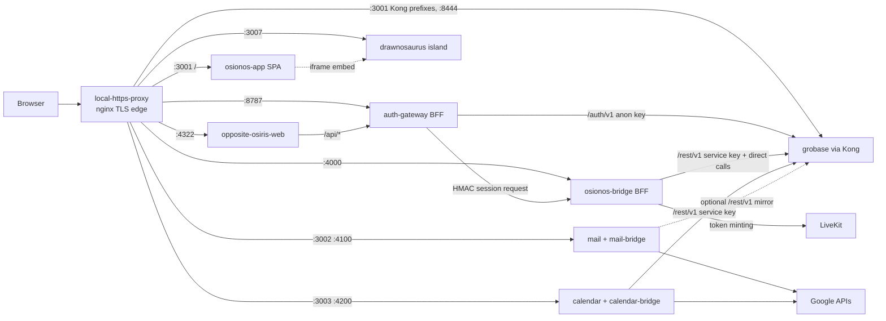
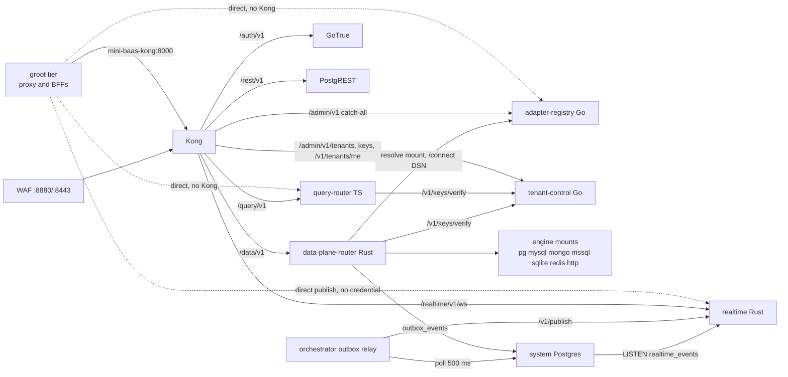
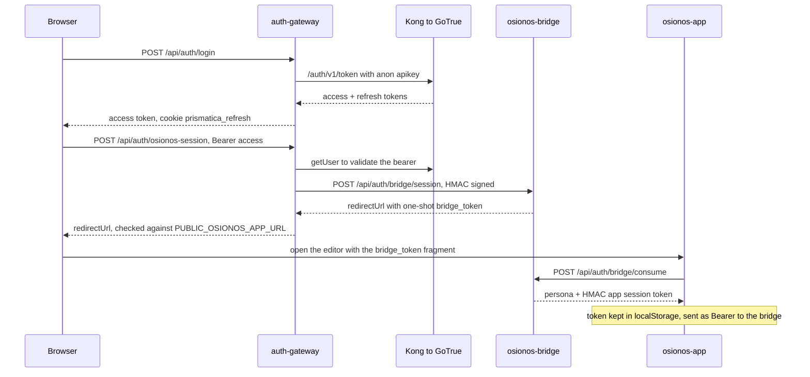
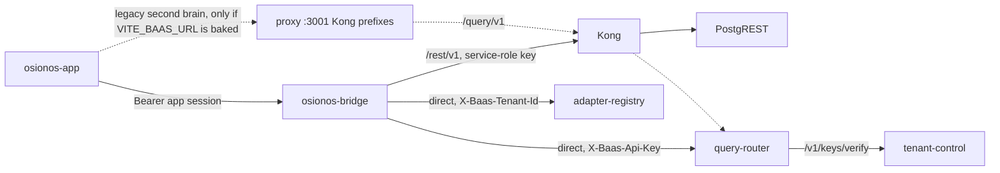
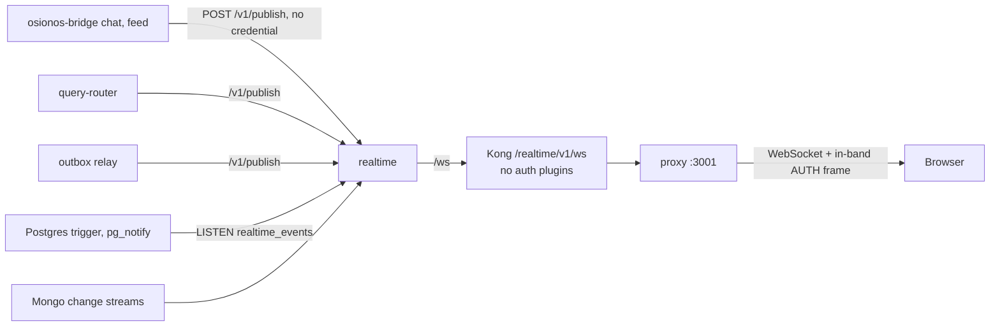

# 00 — Context map: groot around grobase

> Study doc 0 of `wiki/architecture/study/`. Every small doc zooms into one box of these maps.
> Evidence base: groot `v1.0.0-rc5`, grobase pinned at `30b73e4b`, read statically on
> 2026-10-10 (the stack was down, so nothing here was observed at runtime).
> Paths are relative to the groot root; `GBS/` = `apps/grobase/`, `OSI/` = `apps/osionos/app/`.
> Arrows come from code or compose config only. Anything inferred is marked **GUESS**.

## The shape in one paragraph

groot is **hub-and-spoke with a BFF tier**, not one hexagon. A single TLS edge (nginx,
`local-https-proxy`) fronts everything the browser can reach. Each app has a small server of its
own, a **Backend-for-Frontend (BFF)**: `auth-gateway` (opposite-osiris), `osionos-bridge`,
`mail-bridge` and `calendar-bridge`. The BFFs hold the secrets and talk to grobase. **Kong** is
grobase's **north-south gateway**: the BFFs and part of the browser traffic go through it. Inside
the trusted `mini-baas_mini-baas` network, though, the osionos bridge also calls grobase services
**directly by container name** (east-west), skipping Kong. Inside grobase, a Go **control plane**
decides *who you are and where your data lives*, and a Rust **data plane** executes the query. The
data plane is the one place where **ports & adapters** is literal: a file named `ports.rs` defines
the engine port, and each database engine is an adapter. drawnosaurus is an isolated island that
osionos only embeds in an iframe.

## Patterns, named precisely

| Pattern | Where (evidence) | The common alternative it replaces |
|---|---|---|
| Edge reverse proxy + TLS termination | `infrastructure/tls/nginx.conf` (one server block per app port) | Each app serving its own TLS |
| API gateway (Kong, DB-less, declarative) | `GBS/infra/docker/services/kong/conf/kong.yml` (key-auth, jwt, acl, a header-stripping pre-function) | Every service doing its own authn, CORS and rate limiting |
| Backend-for-Frontend, one per app | `apps/opposite-osiris/scripts/auth-gateway.mjs`, `OSI/scripts/bridge-api.mjs`, `apps/{mail,calendar}/bridge/server.mjs` | The browser talking straight to the BaaS with a key in the bundle |
| Control plane / data plane split | Go `tenants/handler.go:84` (`/v1/keys/verify`) ↔ Rust `data-plane-server/src/auth.rs:70-128` | A monolith where the same process authenticates and queries |
| Ports & adapters (hexagonal), data plane only | `GBS/src/data-plane-router/crates/data-plane-core/src/ports.rs:22-36` (`EngineAdapter`, `EnginePool`), `capability.rs` (`EngineCapabilities`) | One ORM or driver hard-wired to one database |
| Transactional outbox + relay; CDC; pub/sub | outbox relay `GBS/src/control-plane/internal/orchestrator/outboxrelay/outboxrelay.go`; PG `LISTEN realtime_events`; Mongo change streams | Writing to the DB and calling the event bus in the same request (dual write) |
| Strangler fig (TS → Rust) | Kong `/query/v1` (TS query-router) next to `/data/v1` (Rust), both live | A big-bang rewrite |
| One-time-token handoff for cross-origin login | `bridge-api.mjs:1153-1195` (`#bridge_token` → `/api/auth/bridge/consume`) | Sharing a cookie across origins |
| Isolated network (bulkhead) | drawnosaurus on `drawnosaurus-internal` (`internal: true`), `docker-compose.yml` | Every container on one flat network |

## Map A — the edge and the BFF tier (grobase as one box)

Read it like this: the browser only ever talks to the proxy (plus LiveKit's media ports). Every
grey-zone secret (the service-role key, Google OAuth clients, the bridge HMAC secret) lives in a
BFF, not in a bundle. drawnosaurus has **no** arrow to grobase.

## Map B — inside grobase

Not drawn on purpose: GoTrue and PostgREST → Postgres (true, but I haven't traced it yet:
`auth-api.yml` is unread), and the TS → Rust forward inside query-router (documented in
`GBS/CLAUDE.md`, not traced in code). Both arrive in docs 5 and 8.

## Flow 1 — login: from the website to an editor session

Evidence: `useAuth.ts:195,245-264`; `auth-gateway.mjs:927,1070-1126,1136-1147`;
`bridge-api.mjs:151-392,1153-1195,3154-3166`; `userStore.helpers.ts:101-130`;
`useUserStore.ts:41-44`. Note that `tenant-control /v1/keys/verify` is **not** in this flow. It
guards API keys on the data path, not user logins.

## Flow 2 — data: an editor read or write

Evidence: `bridge-api.mjs:160-174,481-488,531-584,603-614,1011-1017`;
`baasFetch.ts:24,29-31,67-73`; `baas-client.ts:20-41`; `nginx.conf:103-113`. The dashed path is
dormant in a bare `docker compose` build. **GUESS:** it is live in make-built bundles, because
`app.Dockerfile:64-71` defaults to `https://localhost:3001` and `docker.mk:12` loads `.env.local`.

## Flow 3 — realtime: a change reaches a browser

Evidence: `bridge-social-core.mjs:112-130`; `realtime-gateway/src/rest_api.rs:96-99`;
`kong.yml:257-292`; `liveRealtime.ts:60-87`; `liveRealtimeSocket.ts:14-23,135,160-172`;
`realtime-db-postgres/src/producer/lifecycle.rs:248`; `realtime-db-mongodb/src/producer/lifecycle.rs:36,69-77`.
The browser opens the socket; the arrow points along the event's direction.

## Trade-offs this shape accepts

- **The BFFs are the real authorization point for osionos.** The bridge uses the service-role key
  on every `/rest/v1` call, so Postgres RLS doesn't protect editor data: the bridge's own checks
  do. In exchange, no privileged key reaches the browser and each app can evolve its API freely.
- **Kong guards north-south, not east-west.** Anything on `mini-baas_mini-baas` can reach the
  query-router, adapter-registry and realtime directly. That's simple and fast, but the network is
  part of the trust boundary.
- **Two gateways in front of grobase.** groot's nginx and Kong both do edge work (TLS vs authn).
  The cost is two configs to keep consistent: only :4322 and :443 send security headers today.
- **More processes than a monolith.** Four BFFs plus grobase's planes mean more containers and
  more hops, in exchange for each piece being replaceable on its own.

## Findings from the recon (code wins)

| # | Finding | Owner |
|---|---|---|
| 1 | Kong's `osionos-bridge` route is gone (removed in `de656694`, a security fix). Drift #4 is closed: the bridge is reached only through nginx :4000 | resolved |
| 2 | The bridge's realtime publish carries no credential, and the handler has no auth | grobase: report only |
| 3 | :3001 serves Kong's paths on the app's own origin and sends no security headers | groot |
| 4 | `REALTIME_PUBLISH_URL` includes `/v1/publish` in grobase but not in the bridge | groot (low) |
| 5 | The calendar's `https://localhost:8000` values are display-only or wrong (Kong is plain HTTP there). Drift #5 is closed | groot (low) |
| 6 | `VITE_WHITEBOARD_APP_URL` isn't declared as an `ARG` in `app.Dockerfile`, and the `osio.whiteboard` flag defaults **ON**, not OFF as the compose comment says | groot (docs) |
| 7 | The bridge's in-app login sends a hard-coded Turnstile token (`bridge-api.mjs:3199`). Whether a bypass flag gates it is unchecked | team code: check |
| 8 | Hostnames differ (`kong` vs `mini-baas-kong`, `realtime` vs `mini-baas-realtime`). Resolution depends on network aliases | runtime check |
| 9 | opposite-osiris uses a vendored `@grobase/js`, not the grobase submodule's SDK | drift: unchecked |
| 10 | `apps/graph_render` is now a submodule, at `77b68d9b`. `describe` names an `archive/*` ref, so check that the SHA is reachable from graph_render's develop (T-GR D1) | T-GR |

## Check your understanding

1. The bridge holds the service-role key. What, then, stops user A from reading user B's pages in
   the editor? Where would you look in the code to confirm it?
2. Why does Kong give `/realtime/v1/ws` its own service with no auth plugins, and what replaces
   those plugins for a WebSocket?
3. In Flow 1, why can't the auth-gateway just set a session cookie for the editor, instead of the
   `#bridge_token` handoff?

## Sources

- groot: `docker-compose.yml`, `infrastructure/tls/nginx.conf`,
  `infrastructure/docker/osionos/app.Dockerfile`, `infrastructure/makes/docker.mk`.
- grobase (`30b73e4b`): `CLAUDE.md`, `infra/docker/services/kong/conf/kong.yml`,
  `orchestrators/compose/base/{gateway,control-plane,data-plane}.yml`,
  `src/data-plane-router/crates/*`, `src/control-plane/internal/{tenants,orchestrator}`.
- Apps: `apps/opposite-osiris/scripts/auth-gateway.mjs`, `OSI/scripts/bridge-*.mjs`,
  `OSI/src/...` (cited above), `apps/{mail,calendar}/bridge/server.mjs`.
- Recon: ARCH-0 REPORT (2026-10-10, not in git).

**Next:** doc 1, `local-https-proxy`, the box every arrow starts from.
