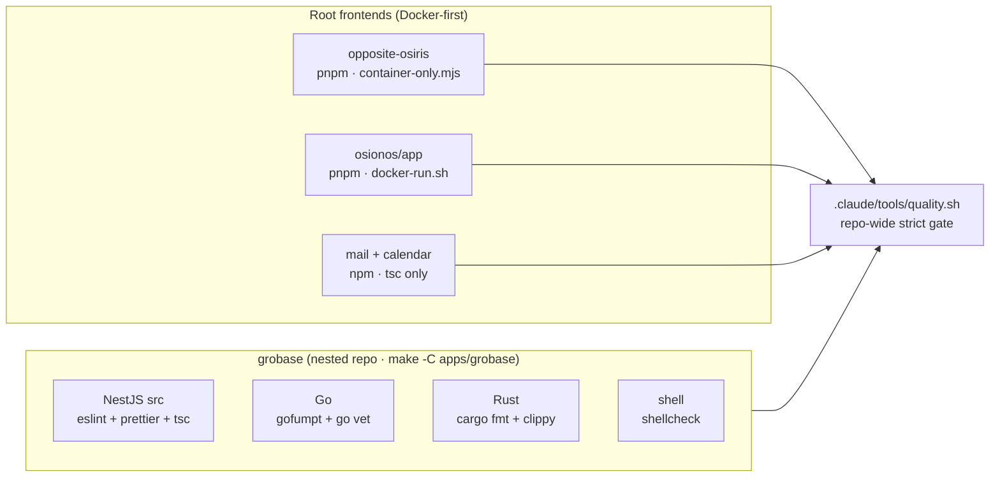

# 01 — Format, Lint & Type-Check

> The static-correctness layer: code formatters, linters, and type-checkers for every app and language in the monorepo. Each runs **inside Docker**, scoped to one app, at the strictest flags that app actually enforces.

**Part of the [tooling wiki](./README.md).** Siblings:
[02 SAST & code quality](./02-sast-and-code-quality.md) ·
[03 supply-chain & secrets](./03-supply-chain-and-secrets.md) ·
[04 DAST & pentest](./04-dast-and-pentest.md) ·
[05 testing frameworks](./05-testing-frameworks.md) ·
[06 web quality & a11y](./06-web-quality-and-accessibility.md) ·
[07 governance & safety scripts](./07-governance-and-safety-scripts.md) ·
[08 orchestration & verification gates](./08-orchestration-and-verification-gates.md)

---

## Two iron rules

### 1. Never run on the host — everything is Docker-first

There is **no host `node` / `npm` / `pnpm` / `go` / `cargo`**. Every formatter, linter, and
type-checker runs inside a container. The repo *enforces* this:

- **opposite-osiris** — `scripts/container-only.mjs` (`apps/opposite-osiris/scripts/container-only.mjs:19`)
  **aborts on the host**; it only dispatches the tool inside the already-running
  `track-binocle-opposite-osiris-1` container.
- **osionos/app** — `scripts/docker-run.sh` (`apps/osionos/app/scripts/docker-run.sh:23`)
  **self-dockerizes**: on the host it spins up an ephemeral `playground` / `browser-tests`
  compose container, then re-execs the same script inside it. No running stack needed.
- **grobase** — every `make -C apps/grobase <target>` shells into an official toolchain image
  (`golang:1.25-bookworm`, the rust toolchain image, `node:20-alpine`).

### 2. Run each app's own scoped lint script — never a bare `eslint .`

A bare `eslint .` / `tsc` from a repo or app root lints build output, `vendor/`, and bundled
Python-venv `.js`. **Always invoke the app's scoped script** (the run commands below). The
per-app config decides the file globs.

### Per-app package-manager split (match the lockfile)

| App / scope | Package manager | Format-lint-types surface |
|---|---|---|
| opposite-osiris | **pnpm** | eslint + stylelint + html-validate + astro check |
| osionos/app | **pnpm** | eslint (`--max-warnings=0`) + two-pass tsc |
| mail | **npm** | `tsc --noEmit` only |
| calendar | **npm** | `tsc --noEmit` only |
| grobase src (NestJS) | **npm** | eslint (type-aware) + prettier + tsc |
| grobase sdks/js | **npm** | tsc |
| grobase sdks/python | **Poetry** | mypy + flake8 + pylint |
| grobase Go / Rust / shell | (in Docker) | gofumpt + go vet · cargo fmt + clippy · shellcheck |

> grobase is a **nested, independent git repo** at `apps/grobase/` with its own CI and
> `apps/grobase/CLAUDE.md`. Its gates live under `apps/grobase/orchestrators/makes/` and are
> invoked via `make -C apps/grobase <target>`.

---

## Coverage matrix by app

| App | Format | Lint | Types |
|---|---|---|---|
| **opposite-osiris** (Astro) | — *(no prettier)* | eslint + stylelint(SCSS) + html-validate(dist HTML) | `astro check` |
| **osionos/app** (React/Vite) | — *(no prettier)* | eslint `--max-warnings=0` | two-pass `tsc --noEmit` |
| **mail** (React/Vite) | — | — *(no eslint)* | `tsc --noEmit` |
| **calendar** (React/Vite) | — | — *(no eslint)* | `tsc --noEmit` |
| **grobase src** (NestJS) | prettier | eslint (type-aware) | `tsc` (strict + noUnused) |
| **grobase sdks/js** | — | — | `tsc -p tsconfig.typecheck.json` |
| **grobase Go** | gofumpt / gofmt | `go vet` + `gofmt -l` | (compiler) |
| **grobase Rust** | `cargo fmt` | `cargo clippy -D warnings` | (compiler) |
| **grobase shell** | — | shellcheck + `bash -n` | — |
| **grobase sdks/python** | — | flake8 + pylint | mypy *(not yet `strict`)* |

---

## opposite-osiris (Astro, pnpm)

All four tools run **inside the running container only** via
`apps/opposite-osiris/scripts/container-only.mjs`.

| Tool | Purpose | Config | Run command | Scope |
|---|---|---|---|---|
| **ESLint** | Lints JS/TS/Astro for correctness + `jsx-a11y` on `.astro` templates | `apps/opposite-osiris/eslint.config.mjs:17`; `package.json` (`scripts.lint`) | `docker exec track-binocle-opposite-osiris-1 sh -lc 'cd /workspace/apps/opposite-osiris && node scripts/container-only.mjs eslint .'` | `.astro/.ts/.js`; ignores `dist/.astro/node_modules/public` |
| **Stylelint** | Lints SCSS for standards compliance | `apps/opposite-osiris/.stylelintrc.json:1`; `package.json` (`scripts.lint:css`) | `docker exec track-binocle-opposite-osiris-1 sh -lc 'cd /workspace/apps/opposite-osiris && node scripts/container-only.mjs stylelint "src/**/*.scss"'` | `src/**/*.scss` (plain `.css` ignored) |
| **html-validate** | Validates **built** HTML output | `apps/opposite-osiris/.htmlvalidate.json:1`; `package.json` (`scripts.lint:html`) | `docker exec track-binocle-opposite-osiris-1 sh -lc 'cd /workspace/apps/opposite-osiris && node scripts/container-only.mjs html-validate "dist/**/*.html"'` | `dist/**/*.html` |
| **astro check** | Type-checks `.astro` + `.ts` (this app's type gate — no separate `tsc`) | `apps/opposite-osiris/tsconfig.json:2`; `package.json` (`scripts.check`) | `docker exec track-binocle-opposite-osiris-1 sh -lc 'cd /workspace/apps/opposite-osiris && node scripts/container-only.mjs astro check'` | opposite-osiris |

**Strictness & gotchas**

- **ESLint flat config**: `@eslint/js` + `typescript-eslint` recommended + `eslint-plugin-astro`
  recommended + astro `jsx-a11y-recommended`. `no-explicit-any` is **OFF**, `no-unused-vars` is
  `'warn'`.
- **GOTCHA — warnings don't fail `npm run lint`**: the script is bare `eslint .` with
  **no `--max-warnings 0`**, so warnings pass despite the QUALITY doc reporting 0/0. The
  repo-wide [`quality.sh`](#repo-wide-strict-gate-qualitysh) gate *does* apply `--max-warnings 0`.
- **Stylelint** extends `stylelint-config-standard-scss`; many naming/notation rules disabled. No
  `--max-warnings` flag.
- **html-validate** extends `html-validate:recommended`; it operates on `dist/`, so it is a
  **post-build gate** — run `astro build` first.
- **astro check** `tsconfig` extends `astro/tsconfigs/strict`, which pulls in `@types/node`.
  **Type timer fields as `ReturnType<typeof setTimeout>`, never `number`** (`setTimeout` resolves
  to the Node `Timeout` overload). Use `is:inline` on JSON-LD/data `<script>` blocks to silence
  hints. `eslint.config.mjs` is excluded from this type-check.

---

## osionos/app (React/Vite, pnpm)

Both tools self-dockerize through `apps/osionos/app/scripts/docker-run.sh` (spins the `playground`
container; **no running stack needed**).

| Tool | Purpose | Config | Run command | Scope |
|---|---|---|---|---|
| **ESLint** | Lints React/TS app + `graph-engine` package for correctness + React-hooks rules | `apps/osionos/app/eslint.config.js:18`; `apps/osionos/app/scripts/docker-run.sh:30` | `cd apps/osionos/app && bash scripts/docker-run.sh lint` (auto-fix: `… lint-fix`) | `src/` and `packages/` only |
| **tsc --noEmit** | Type-checks `graph-engine` package + the app under strict TS | `apps/osionos/app/tsconfig.json:14`; `apps/osionos/app/packages/graph-engine/tsconfig.json:2`; `scripts/docker-run.sh:29` | `cd apps/osionos/app && bash scripts/docker-run.sh typecheck` | `graph-engine` + app |

**Strictness & gotchas**

- **ESLint is STRICT**: exact command is `pnpm exec eslint src/ packages/ --max-warnings=0` — **any
  warning fails**. Scoped to `src/` and `packages/`; ignores `markengine` and the nested
  `notion-database-sys` (which carries its own config at
  `apps/osionos/app/src/shared/notion-database-sys/eslint.config.js`).
- **tsc runs TWO passes**: `pnpm exec tsc -p packages/graph-engine/tsconfig.json --noEmit && pnpm exec tsc --noEmit`.
  `strict:true`, `noImplicitAny:true`, `noEmit:true` (the graph-engine tsconfig extends the app
  tsconfig). The `build` and `quality` docker-run targets also run both passes first.
- **Submodule convention**: branch from `develop`, commit message `updated`, **no co-author
  trailer, no auto-push**.

---

## mail + calendar (React/Vite, npm)

Type-check + build are the **entire** static surface for these two apps — **no eslint / prettier /
stylelint config exists**. Run inside their containers.

| Tool | Purpose | Config | Run command | Scope |
|---|---|---|---|---|
| **tsc --noEmit** | Type-checks the React mail/calendar apps under strict TS (their **only** static gate) | `apps/mail/tsconfig.json:10`; `apps/calendar/tsconfig.json:10`; each `package.json` (`scripts.typecheck`) | `docker exec track-binocle-mail-1 sh -lc 'npm run typecheck'` · `docker exec track-binocle-calendar-1 sh -lc 'npm run typecheck'` | mail (:3002) + calendar (:3003) |

**Strictness:** `typecheck = tsc -p tsconfig.json --noEmit`; `build = tsc -p tsconfig.json && vite build`;
`strict:true`. CLAUDE.md confirms: *"only typecheck and build; no unit suite."*

---

## grobase TypeScript (NestJS src + JS SDK, npm)

grobase is a separate nested repo; gates live under `apps/grobase/orchestrators/makes/`.

| Tool | Purpose | Config | Run command | Scope |
|---|---|---|---|---|
| **ESLint** (NestJS) | Lints control-plane TS with **type-aware** rules | `apps/grobase/src/eslint.config.mjs:42`, `:45`; `apps/grobase/src/package.json:12`; `apps/grobase/orchestrators/makes/100-test.mk:53` | `make -C apps/grobase test-lint-ts` (or full matrix: `make -C apps/grobase test-lint`) | `apps/**/*.ts libs/**/*.ts` |
| **Prettier** (NestJS) | Formats control-plane TS to project style | `apps/grobase/src/.prettierrc:1`; `apps/grobase/orchestrators/makes/prettier.mk:33`, `:50` | `make -C apps/grobase prettier-ts` (write) · `make -C apps/grobase prettiers-check` (verify-only gate) | grobase src TS + compose/config YAML |
| **tsc** (NestJS) | Type-checks control-plane TS under strict flags incl. `noUnusedLocals/Parameters` | `apps/grobase/src/tsconfig.json:14`, `:20`; `apps/grobase/src/package.json:13` | `make -C apps/grobase test-nestjs` (tsc + eslint + jest) | grobase src |
| **tsc** (JS SDK) | Type-checks the generated JS SDK with a dedicated typecheck tsconfig | `apps/grobase/sdks/js/package.json:52` | `docker exec … sh -lc 'cd apps/grobase/sdks/js && npm run typecheck'` (`= tsc -p tsconfig.typecheck.json`) | grobase sdks/js |

**Strictness & gotchas**

- **ESLint (NestJS)** is type-aware (`parserOptions.project = tsconfig.json`):
  `no-explicit-any:'warn'`, `no-floating-promises:'error'`. **GOTCHA**: the `package.json` `lint`
  script **auto-fixes** (`eslint … --fix`) — *not* a pure gate. The CI gate is
  `make -C apps/grobase test-lint-ts`, which runs `npx eslint apps/**/*.ts libs/**/*.ts` (no
  `--fix`, no `--max-warnings`).
- **Prettier** options: `singleQuote`, `trailingComma:all`, `printWidth 100`, `semi`, `tabWidth 2`,
  `endOfLine lf`. **IMPORTANT**: only grobase (and vendored apps) carry a `.prettierrc` —
  opposite-osiris, osionos/app, mail and calendar do **not** use Prettier; their style is owned by
  eslint/stylelint.
- **tsc (NestJS)**: `strict`, `strictNullChecks`, `strictBindCallApply`, `noUnusedLocals`,
  `noUnusedParameters` all on.
- **tsc (JS SDK)**: `build = tsc -p tsconfig.json`; `test = node --test`. No eslint/prettier script
  for the JS SDK.

---

## grobase Go (in `golang:1.25-bookworm`)

| Tool | Purpose | Config | Run command | Scope |
|---|---|---|---|---|
| **gofumpt / gofmt** (format) + **go vet** (lint) | Formats with gofumpt; vets + `gofmt -l` as the gate | `apps/grobase/orchestrators/makes/prettier.mk:22`; `apps/grobase/orchestrators/makes/100-test.mk:48`; `apps/grobase/orchestrators/makes/70-langtiers.mk:136` | `make -C apps/grobase prettier-go` (gofumpt -w) · `make -C apps/grobase test-lint-go` (`go vet ./...` + `gofmt -l` gate) | grobase src/control-plane (Go) |

**Strictness & gotchas**

- Formatter is **gofumpt** (a stricter gofmt superset). The lint gate is `go vet` + `gofmt -l`
  (fails if any file needs formatting, excluding `vendor/`).
- **NO `golangci-lint` config exists anywhere in the repo** (confirmed: no `.golangci.*`). Go
  linting is *actually* `go vet` + `gofmt -l`. The `golangci-lint` row in
  [`quality.sh`](#repo-wide-strict-gate-qualitysh) therefore **SKIPs** here (no binary/config to
  resolve).

---

## grobase Rust (data-plane + realtime workspaces, in the rust toolchain image)

| Tool | Purpose | Config | Run command | Scope |
|---|---|---|---|---|
| **cargo fmt (rustfmt)** | Formats both Rust workspaces | `apps/grobase/orchestrators/makes/prettier.mk:28`, `:52` | `make -C apps/grobase prettier-rust` (`cargo fmt --all`) · `make -C apps/grobase prettiers-check` (`cargo fmt --all --check`) | src/data-plane-router + infra/…/realtime-agnostic |
| **cargo clippy** | Lints the Rust workspaces, warnings-as-errors | `apps/grobase/orchestrators/makes/100-test.mk:44`; `apps/grobase/orchestrators/makes/70-langtiers.mk:75` | `make -C apps/grobase test-lint-rust` (`cargo clippy --workspace --all-targets -- -D warnings`) | data-plane-router (realtime via its own CI) |

**Strictness & gotchas**

- **No `rustfmt.toml`** — rustfmt defaults. **No `clippy.toml`** — clippy defaults.
- **clippy is STRICT**: `-D warnings` — **any clippy warning fails**.
- The vendored `realtime-agnostic` workspace has its own GitHub Actions CI running
  `cargo fmt --all -- --check` and `cargo clippy --all-targets --all-features -- -D warnings`.

---

## grobase shell (ShellCheck)

| Tool | Purpose | Config | Run command | Scope |
|---|---|---|---|---|
| **ShellCheck** | Lints all tracked shell scripts (+ `bash -n` parse check); warnings fail | `apps/grobase/.shellcheckrc`; `apps/grobase/orchestrators/makes/100-test.mk:32` | `make -C apps/grobase test-lint-shell` (or full matrix `make -C apps/grobase test-lint`) | grobase tracked `*.sh` (`git ls-files`) |

**Strictness:** `test-lint-shell` runs `bash -n` on every `*.sh`, then shellcheck if present
(host shellcheck optional — falls back to `bash -n` only). Accepted-style rules are declared in
`.shellcheckrc` **with justification**, not silenced inline. The generic `quality.sh` `g_shellcheck`
gate also covers root-repo shell.

---

## grobase Python SDK (Poetry) & vendor/QA (Ruff)

| Tool | Purpose | Config | Run command | Scope |
|---|---|---|---|---|
| **mypy / flake8 / pylint** | Type-checks + lints the Python SDK | `apps/grobase/sdks/python/pyproject.toml:30`, `:32`, `:39`, `:42` | (via Poetry dev group, in Docker) `mypy .` ; `flake8` ; `pylint` — compile gate: `make -C apps/grobase test-sdk` | grobase sdks/python |
| **Ruff** | Format + lint for the vendored Python QA helper | `vendor/QA/pyproject.toml:30`, `:36`, `:54` | (within vendor/QA, in Docker) `ruff check .` ; `ruff format --check .` | **vendor/QA only** (not a product app) |

**Strictness & gotchas**

- **mypy is NOT yet `strict`** (`pyproject.toml:48` has the `TODO: enable strict` commented out);
  individual checks like `strict_equality` are on. No ruff/black for the SDK. The **active gate is
  the polyglot SDK compile check** (`scripts/verify/m58-sdks-compile.sh`), not these linters
  directly — the generated test stubs are near-empty.
- **Ruff is the ONLY ruff config in the repo** (`line-length 100`, isort in `lint.select`). The
  product apps and the grobase Python SDK do **not** use ruff. The `quality.sh` ruff gate only
  fires where ruff is installed.

---

## Repo-wide strict gate — `quality.sh`

One command that auto-detects languages and runs **format → lint → types** (then sast → audit) at
the **strictest** flags, aggregating PASS/FAIL/SKIP. **Verify-only — never auto-writes.**

| Field | Value |
|---|---|
| **Config** | `.claude/tools/quality.sh`; `.claude/rules/quality-bar.md` |
| **Run** | `.claude/tools/quality.sh` · `.claude/tools/quality.sh --summary` · `.claude/tools/quality.sh --no-audit` (also the `/quality` skill) |
| **Scope** | Whole repo, gated by detected manifests/extensions |

**Strict gate bodies (the format-lint-types layers):** `prettier --check`,
`eslint . --max-warnings 0`, `tsc --noEmit`, `gofumpt`/`gofmt -l`, `golangci-lint run`,
`clippy --all-targets --all-features -- -D warnings`, `rustfmt --check`,
`ruff format --check` / `ruff check`, `shellcheck`.

**Behaviour:** A tool that is not installed records **SKIP** — and *skipped ≠ passed*; it is
uncovered surface. **In this repo specifically**, `golangci-lint` is never configured (Go lint is
really `go vet` + `gofmt`), so that row always SKIPs; Go/Rust strict flags fire only when the
binaries resolve.

> See [07 governance & safety scripts](./07-governance-and-safety-scripts.md) for the full
> `quality.sh` / `preflight.sh` / `watch.sh` order-of-operations
> (`preflight → fix config → build/test under watch → quality.sh`).

---

## Discrepancies to know (verified against real files)

1. **`golangci-lint` is NOT active** — referenced only generically in `quality.sh`; no `.golangci.*`
   exists and no make target invokes it. Go linting = `go vet` + `gofmt -l`.
2. **Ruff is vendored-only** — configured only in `vendor/QA/pyproject.toml`; not used by any
   product app or the grobase Python SDK (which uses flake8/mypy/pylint).
3. **opposite-osiris `npm run lint` does not fail on warnings** — it is bare `eslint .` (no
   `--max-warnings 0`), unlike osionos/app (`--max-warnings=0`, strict). The `quality.sh` generic
   gate *does* enforce `--max-warnings 0`.
4. **grobase `src` `package.json` `lint` auto-fixes** (`eslint … --fix`) — the real gate is
   `make -C apps/grobase test-lint-ts`.
5. **opposite-osiris html-validate is a post-build gate** — it runs against `dist/**/*.html`, so it
   needs a prior `astro build`.

> Adjacent grobase linters in the same `make -C apps/grobase test-lint` matrix but **outside** this
> category — `yamllint` (`.yamllint`), `hadolint` (`.hadolint.yaml`), and a Makefile parse-lint —
> are IaC/governance gates, not format-lint-types of app source.
