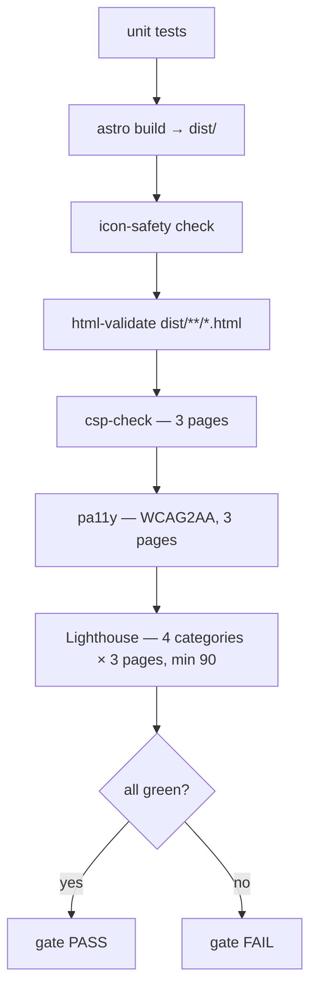

# 06 — Web Quality & Accessibility

> The rendered-output gates: Lighthouse (performance / a11y / best-practices / SEO ≥ 90),
> pa11y (WCAG2AA), `eslint-plugin-jsx-a11y`, `html-validate`, CSP correctness, and the
> osionos color-token guard. These prove the *shipped HTML/CSS/JS* is fast, accessible,
> and policy-compliant — not just that the source type-checks.

Part of the 9-part tooling wiki — see [README.md](./README.md) ·
[01 Format/Lint/Types](./01-format-lint-types.md) ·
[02 SAST & Code Quality](./02-sast-and-code-quality.md) ·
[03 Supply Chain & Secrets](./03-supply-chain-and-secrets.md) ·
[04 DAST & Pentest](./04-dast-and-pentest.md) ·
[05 Testing Frameworks](./05-testing-frameworks.md) ·
**06 Web Quality & A11y** ·
[07 Governance & Safety Scripts](./07-governance-and-safety-scripts.md) ·
[08 Orchestration & Verification Gates](./08-orchestration-and-verification-gates.md).

---

## TL;DR

- **Three homes, one full gate.** Web-quality + a11y tooling lives in *three* places, but
  only **one** is a fully orchestrated gate: the **Grobase marketing site**
  (`apps/grobase/vendor/grobase-website/`, Astro). Its `scripts/audit/run-all.mjs`
  chains unit tests → `astro build` → icon-safety → `html-validate` → `csp-check` → `pa11y`
  → Lighthouse.
- **opposite-osiris** (Astro) carries the same *per-tool* configs, but they run as
  standalone `lint:*` scripts — not an orchestrated audit.
- **osionos** (React/Vite) has Lighthouse scripts + a hand-rolled color-token guard.
- **mail / calendar** have **no** web-quality or a11y tooling (only `typecheck` + `build`
  — see [01](./01-format-lint-types.md)).
- **Lighthouse threshold is ≥ 90 on all 4 categories** (`min=90` default), evaluated on
  **3 pages** (`/`, `/pricing/`, `/security/`).
- ✅ **`make grobase-audit` and `make grobase-e2e` work** via the `grobase-site-audit`
  compose service (`docker-compose.yml:516`); an equivalent manual Docker invocation is
  shown below. (The *sibling* dev-server targets `grobase-up` / `grobase-logs` /
  `grobase-down` are the broken ones — they point at a bake-only `grobase-site` service;
  see [08](./08-orchestration-and-verification-gates.md).)
- ⚠️ **`axe` is NOT an active gate** in this repo (the only `@axe-core` usage is a vendored
  playground test, wired to nothing). Treat it as absent.

---

## The toolset at a glance

| Tool | Purpose | Config (`path:line`) | Run command | Scope |
|------|---------|----------------------|-------------|-------|
| **Lighthouse (grobase site)** | Perf / a11y / best-practices / SEO gate, fail if any category < min | `apps/grobase/vendor/grobase-website/scripts/audit/lighthouse.mjs:12` (categories), `:13` (pages), `:18` (min=90) | `make grobase-audit` / `npm run audit:lh` | Marketing site, 4 categories × 3 pages |
| **pa11y (grobase site)** | Programmatic **WCAG2AA** a11y audit in headless Chromium | `apps/grobase/vendor/grobase-website/scripts/audit/pa11y.config.json:2` (standard=WCAG2AA) | `make grobase-audit` / `npm run audit:a11y` | Marketing site, 3 pages |
| **csp-check (grobase site)** | Proves CSP correctness in a real browser; fails on violations / console errors / weak `<meta>` CSP | `apps/grobase/vendor/grobase-website/scripts/audit/csp-check.mjs:52`, `:57` (rejects `unsafe-inline`) | `make grobase-audit` / `npm run audit:csp` | Marketing site, 3 pages |
| **html-validate** | Static HTML validity + markup-quality lint over built `dist/**/*.html` | `apps/grobase/vendor/grobase-website/.htmlvalidate.json:2`; `apps/opposite-osiris/.htmlvalidate.json:2` | `npm run lint:html` (grobase site) / container-only `html-validate "dist/**/*.html"` (opposite-osiris) | Grobase site **and** opposite-osiris built HTML |
| **stylelint (SCSS)** | CSS/SCSS lint (`stylelint-config-standard-scss`) over authored SCSS | `apps/grobase/vendor/grobase-website/.stylelintrc.json:2`; `apps/opposite-osiris/.stylelintrc.json:2` | `npm run lint:css` (grobase site) / container-only `stylelint "src/**/*.scss"` (opposite-osiris) | Grobase site **and** opposite-osiris `src/**/*.scss` |
| **eslint-plugin-jsx-a11y** (via `eslint-plugin-astro`) | A11y lint of `.astro` templates (`flat/jsx-a11y-recommended`) | `apps/grobase/vendor/grobase-website/eslint.config.mjs:23`, `:37`; `apps/opposite-osiris/eslint.config.mjs:28`, `:45` | `npm run lint` (grobase site) / container-only `eslint .` (opposite-osiris) | `.astro` templates only |
| **Lighthouse (osionos)** | Same 4-category Lighthouse, manual, against a `vite preview` prod build | `apps/osionos/app/scripts/lighthouse.mjs:25` (categories), `:30` (min=90), `:29` (url) | `cd apps/osionos/app && npm run lighthouse -- <url>` | osionos editor (host-only script) |
| **check-style-tokens.sh** (color-token guard) | Forbids raw `#hex` / `rgb()/rgba()` color literals — every color must reference a `var(--osio-*)` token | `apps/osionos/app/scripts/check-style-tokens.sh:29` (regex), `:15` (scan/prune) | `cd apps/osionos/app && bash scripts/check-style-tokens.sh` | osionos `src/**/*.{css,scss}` |

> **Docker-first:** every one of these runs inside a container except the **osionos
> Lighthouse** host script (it uses host `/usr/bin/google-chrome`). The grobase-site
> tooling self-dockerizes via `scripts/container-only.mjs`; opposite-osiris via its own
> `scripts/container-only.mjs`; osionos via `scripts/docker-run.sh`. Never invoke
> `lighthouse`/`pa11y`/`stylelint`/`html-validate`/`eslint` on the host.

---

## Worked example — the Grobase marketing-site quality gate

The Grobase marketing site (`apps/grobase/vendor/grobase-website/`, Astro, **npm**) is the
only place all of these tools run as one orchestrated pipeline. The driver is
`scripts/audit/run-all.mjs`, which executes the gates in this fixed order:



Each stage and where it is defined:

| Stage | What it asserts | Config (`path:line`) |
|-------|-----------------|----------------------|
| `astro build` | Produces the static `dist/` the downstream HTML/CSP gates validate | `run-all.mjs` pipeline (post-build gates operate on `dist/`) |
| `html-validate` | Built HTML is valid markup; `prefer-native-element` is an **error** | `.htmlvalidate.json:2`; invoked at `scripts/audit/run-all.mjs:51` (`dist/**/*.html`) |
| `csp-check` | No `securitypolicyviolation` event, no console error, `<meta>` CSP present, uses `sha256-` hashes, **no `unsafe-inline`** | `scripts/audit/csp-check.mjs:52`, `:57`; invoked at `run-all.mjs:58` |
| `pa11y` | WCAG2AA across all 3 pages | `scripts/audit/pa11y.config.json:2`; invoked at `run-all.mjs:60` |
| Lighthouse | Each of perf / a11y / best-practices / SEO ≥ 90 on each page | `scripts/audit/lighthouse.mjs:12`/`:13`/`:18`; invoked at `run-all.mjs:62` |

### Thresholds (exact)

- **Lighthouse:** `min = 90` (`lighthouse.mjs:18`), applied **identically** to all 4
  categories on **each** of 3 pages. It is a *default*, not a hard pin — override with
  `--min` or `LH_MIN` (`run-all.mjs:62` passes `--min=${LH_MIN ?? 90}`). This is the
  CLAUDE.md "≥ 90 ×4".
- **Categories** (`lighthouse.mjs:12`): `performance`, `accessibility`, `best-practices`,
  `seo`.
- **Pages** (`lighthouse.mjs:13`): `/`, `/pricing/`, `/security/`.
- **pa11y:** `standard = WCAG2AA`, `timeout 60000` (`pa11y.config.json:2`).
- **csp-check:** any CSP violation / console error / weak meta-CSP → fail; `unsafe-inline`
  is rejected outright (`csp-check.mjs:57`).

### How the gate actually executes

All of it runs against `astro preview` on `:4325` inside the Dockerfile `audit` stage.
Chromium is **apk-installed**, never downloaded (`.npmrc` `ignore-scripts` blocks the
puppeteer/lighthouse browser fetch); `CHROME_PATH` / `PUPPETEER_EXECUTABLE_PATH` point at
`/usr/bin/chromium-browser`.

---

## ⚠️ Broken wiring — and the working reproduce

`infrastructure/makes/grobase.mk` (the `grobase-audit` / `grobase-e2e` / `grobase-up` /
`grobase-logs` / `grobase-down` targets) runs
`docker compose --profile grobase ... grobase-site[-audit]` — but **no compose file defines
a `grobase-site` or `grobase-site-audit` service**. The root `docker-compose.yml` has no
such service; only `docker-bake.hcl:83` defines a `grobase-site` **bake** target. So every
`grobase-site` make target is broken in this checkout (independently documented at
`wiki/FAQ/05-securite-rgpd-anssi.md:40`).

The underlying audit **scripts and configs are all real and correct** — only the
make/compose glue is broken. Reproduce the full audit gate directly from the Dockerfile
`audit` stage:

```bash
# Working reproduce of make grobase-audit (runs scripts/audit/run-all.mjs):
cd apps/grobase/vendor/grobase-website \
  && docker build --target audit -t grobase-site-audit:local . \
  && docker run --rm grobase-site-audit:local
```

| Intended target | Status | Real invocation |
|-----------------|--------|-----------------|
| `make grobase-audit` (`infrastructure/makes/grobase.mk:14`) | ⚠️ broken (no compose service) | `docker build --target audit ... && docker run --rm grobase-site-audit:local` |
| `make grobase-e2e` (`infrastructure/makes/grobase.mk:20`) | ⚠️ broken (no compose service) | builds `grobase-site-audit` image then runs `npm run test:e2e` (see [05 Testing](./05-testing-frameworks.md)) |

Single-tool reproduce (inside the audit image / container-only) — each maps to a
`package.json` script: `npm run audit:lh`, `npm run audit:a11y`, `npm run audit:csp`,
`npm run lint:html`, `npm run lint:css`, `npm run lint`.

---

## Per-tool reference

### Lighthouse — grobase marketing site

| Field | Value |
|-------|-------|
| Purpose | Reproducible perf/a11y/best-practices/SEO gate over the prod preview; fails any category < min on any page |
| Config | `apps/grobase/vendor/grobase-website/scripts/audit/lighthouse.mjs:12` (categories), `:13` (pages), `:18` (`min` = `--min`/`LH_MIN`/default 90); devDep `package.json:41` (`lighthouse ^13.3.0`) |
| Run | `make grobase-audit` ⚠️ / `cd apps/grobase/vendor/grobase-website && npm run audit:lh` / Docker reproduce above |
| Threshold | **≥ 90** on all 4 categories × 3 pages (default, overridable via `LH_MIN`) |
| Scope | Marketing site only; runs against `astro preview` on `:4325`; Chromium via apk (`CHROME_PATH=/usr/bin/chromium-browser`) |

### pa11y — grobase marketing site

| Field | Value |
|-------|-------|
| Purpose | Programmatic WCAG2AA a11y audit of the rendered pages in headless Chromium |
| Config | `apps/grobase/vendor/grobase-website/scripts/audit/pa11y.config.json:2` (standard=WCAG2AA, `timeout 60000`); invoked `run-all.mjs:60`; devDep `package.json:42` (`pa11y ^9.1.1`) |
| Run | `make grobase-audit` ⚠️ / `npm run audit:a11y` (standalone hits only `/`) / Docker reproduce |
| Threshold | WCAG2AA — any violation fails |
| Scope | All 3 pages in `run-all.mjs`; the standalone `audit:a11y` script hits only `:4325/` |

> Note: the `run-all.mjs` header comment says "`/` and `/pricing/`", but the code
> (`run-all.mjs:59-61`) iterates **all 3** PAGES.

### csp-check — grobase marketing site

| Field | Value |
|-------|-------|
| Purpose | Proves CSP correctness in a real browser: fails on any `securitypolicyviolation`, any console error, or a `<meta>` CSP that is missing, lacks `sha256-` hashes, or contains `unsafe-inline` |
| Config | `scripts/audit/csp-check.mjs:52` (problem checks), `:57` (rejects `unsafe-inline`); invoked `run-all.mjs:58`; script `package.json:24` (`audit:csp`) |
| Run | `make grobase-audit` ⚠️ / `npm run audit:csp` / Docker reproduce |
| Threshold | Zero violations / zero console errors / strict meta-CSP |
| Scope | 3 pages; uses the puppeteer bundled with pa11y |

> Astro hashes every inline style/script it emits — absence of `sha256-` with inline
> content is treated as a strict-CSP build regression. `frame-ancestors` cannot live in a
> `<meta>` CSP, so the prod nginx image carries the HTTP-header equivalents
> (`Dockerfile:42`, `docker/default.conf`).

### html-validate — grobase site + opposite-osiris

| Field | Value |
|-------|-------|
| Purpose | Static HTML validity + markup-quality lint (`extends html-validate:recommended`) over built `dist/` |
| Config | `apps/grobase/vendor/grobase-website/.htmlvalidate.json:2` (adds `prefer-native-element` as error); `apps/opposite-osiris/.htmlvalidate.json:2` |
| Run | grobase: `npm run lint:html` (part of `run-all.mjs:51`); opposite-osiris: `docker exec track-binocle-opposite-osiris-1 sh -lc 'cd /workspace/apps/opposite-osiris && node scripts/container-only.mjs html-validate "dist/**/*.html"'` |
| Threshold | Recommended ruleset (several rules disabled: `void-style`, `attr-quotes`, `no-redundant-role`, etc.) |
| Scope | Built `dist/**/*.html` — **requires a prior `astro build`** (post-build gate) |

> For grobase it is part of the `run-all.mjs` gate; for opposite-osiris it is a standalone
> `lint:html` script (NOT wired into any make target).

### stylelint (SCSS) — grobase site + opposite-osiris

| Field | Value |
|-------|-------|
| Purpose | CSS/SCSS lint (`extends stylelint-config-standard-scss`) over authored SCSS source |
| Config | `apps/grobase/vendor/grobase-website/.stylelintrc.json:2`; `apps/opposite-osiris/.stylelintrc.json:2` (also a vendored copy at `apps/grobase/vendor/grobase-website/.stylelintrc.json`) |
| Run | grobase: `npm run lint:css`; opposite-osiris: container-only `stylelint "src/**/*.scss"` |
| Threshold | Standard SCSS ruleset; many opinionated rules disabled (`selector-class-pattern`, `color-function-notation`, etc.) — `.css` files ignored |
| Scope | `src/**/*.scss` only |

> This is the **generic** SCSS-quality stylelint, **not** a color-token guard (the
> opinionated color rules are disabled). It is a standalone `lint:css` in both apps, **not**
> part of `run-all.mjs` and **not** wired into any make target. The real color enforcement
> is osionos's `check-style-tokens.sh` (below).

### eslint-plugin-jsx-a11y (via eslint-plugin-astro)

| Field | Value |
|-------|-------|
| Purpose | A11y lint of `.astro` component templates via `astro.configs['flat/jsx-a11y-recommended']` |
| Config | `apps/grobase/vendor/grobase-website/eslint.config.mjs:23`, `:37` (`no-redundant-roles` ul/ol allow); `apps/opposite-osiris/eslint.config.mjs:28`, `:45`; devDeps `eslint-plugin-jsx-a11y ^6.10.2`, `eslint-plugin-astro ^1.7.0` |
| Run | grobase: `npm run lint`; opposite-osiris: container-only `eslint .` |
| Threshold | Recommended jsx-a11y set; both apps escalate `no-redundant-roles` to **error** but allow `role=list` on `ul`/`ol` (Safari/VoiceOver workaround) |
| Scope | `.astro` templates only — React/Vite apps (osionos/mail/calendar) do **not** use jsx-a11y |

> This is the **only a11y gate that runs without a built/served site** — it runs as part of
> normal `npm run lint`. `eslint-plugin-jsx-a11y` is consumed *indirectly* through
> `eslint-plugin-astro`'s flat config, not configured directly. (See [01](./01-format-lint-types.md)
> for the full ESLint matrix.)

### Lighthouse — osionos (manual)

| Field | Value |
|-------|-------|
| Purpose | Same 4-category Lighthouse against an osionos `vite preview` prod build; fails below per-category min |
| Config | `apps/osionos/app/scripts/lighthouse.mjs:25` (categories), `:30` (min=90), `:29` (default url `http://127.0.0.1:4173/`); plus `lighthouse-stateful.mjs` (Web-Vitals via Playwright+CDP) and `lighthouse-categories.mjs` (4-surface matrix, mobile+desktop) |
| Run | `cd apps/osionos/app && npm run lighthouse -- <url>` / `node scripts/lighthouse-categories.mjs http://127.0.0.1:4173` |
| Threshold | `--min=90` default |
| Scope | osionos editor only |

> ⚠️ This is the **one osionos host script** — the only `package.json` script *not*
> self-dockerized (`docker-run.sh` has no `lighthouse` arm). It uses host
> `/usr/bin/google-chrome`, URL `:4173`. **Not** wired into any make target or
> `test:quality` gate — it's a manual perf tool.

### check-style-tokens.sh — color-token guard (osionos)

| Field | Value |
|-------|-------|
| Purpose | Dependency-free guard forbidding raw color literals (`#hex`, `rgb()/rgba()` with numeric channels) — every color must reference a `var(--osio-*)` design token |
| Config | `apps/osionos/app/scripts/check-style-tokens.sh:29` (regex `#[0-9a-fA-F]{3,8}` / `rgba?\([0-9]`), `:15` (scan `src`, prune `src/app/styles` + vendored trees); wired at `scripts/docker-run.sh:42` as the final step of `quality` |
| Run | `cd apps/osionos/app && bash scripts/check-style-tokens.sh` / `bash scripts/docker-run.sh quality` (tsc ×2 + eslint `--max-warnings=0` + this guard) |
| Threshold | Any raw literal → exit 1 (gate fail) |
| Scope | osionos `src/**/*.{css,scss}` excluding `src/app/styles/**` (the canonical token definitions incl. `global.css`) and the vendored `notion-database-sys` + `lib/markengine` trees |

> This **is** the "color-token guard" — a hand-rolled bash grep, deliberately **not**
> stylelint (osionos's locked-down supply chain forbids the dep). Token values live in
> exactly one file (`src/app/styles/global.css`). It is the final step of osionos's real
> `test:quality` gate.

---

## Coverage map — what each app actually has

| App | Stack | Lighthouse | pa11y | csp-check | html-validate | stylelint | jsx-a11y | color-token guard |
|-----|-------|:--:|:--:|:--:|:--:|:--:|:--:|:--:|
| **grobase marketing site** | Astro / npm | ✅ (gate) | ✅ (gate) | ✅ (gate) | ✅ (gate) | ✅ (standalone) | ✅ | — |
| **opposite-osiris** | Astro / pnpm | — ⚠️ | — ⚠️ | — ⚠️ | ✅ (standalone) | ✅ (standalone) | ✅ | — |
| **osionos** | React/Vite / pnpm | ✅ (manual, host) | — | — | — | — | — | ✅ (gate) |
| **mail / calendar** | React/Vite / npm | — | — | — | — | — | — | — |

Only the grobase marketing site runs an **orchestrated** audit (`run-all.mjs`); everywhere
else these are individual scripts.

---

## Gotchas & honest caveats

1. **`make grobase-audit` / `grobase-e2e` are broken** — no compose service backs them. Use
   the `docker build --target audit` reproduce. The audit *scripts/configs* are correct;
   only the make/compose wiring is broken (confirmed at `wiki/FAQ/05-securite-rgpd-anssi.md:40`).
2. **opposite-osiris `audit:a11y` / `audit:csp` / `audit:all` are non-functional** — those
   `package.json` scripts (lines 22–24) reference `apps/opposite-osiris/scripts/audit/`
   which **does not exist** (no `pa11y.config.json`, `csp-check.mjs`, or `run-all.mjs`
   there). What *does* work for opposite-osiris: `check` (astro check), `lint`
   (eslint + jsx-a11y), `lint:css` (stylelint), `lint:html` (html-validate). Its real CSP
   check is `scripts/verify-csp.mjs` via `npm run test:security` — a *security-layer* tool
   (see [04 DAST & Pentest](./04-dast-and-pentest.md)), not the missing `audit:csp`.
   opposite-osiris also declares a `lighthouse` devDep with **no** script referencing it
   (unused).
3. **`axe` is absent.** The only `@axe-core` usage is
   `apps/grobase/vendor/saas/web/test/a11y-axe.mjs` — a vendored playground app's own test,
   wired to no root make target, compose profile, or CI job. Treat axe as **not** part of
   this project's web-quality stack.
4. **Lighthouse ≥ 90 is a default, not a hard pin** — overridable via `--min` / `LH_MIN`.
   Same 90 across all 4 categories on all 3 pages.
5. **html-validate is a post-build gate** — it operates on `dist/`, so it requires a prior
   `astro build`. Source-only runs will find nothing.
6. **stylelint (SCSS) ≠ color-token guard.** The generic stylelint disables color rules;
   the actual color enforcement is osionos's `check-style-tokens.sh`.
7. **Marketing-site identity:** `apps/grobase/vendor/grobase-website/` (remote
   `Univers42/grobase.git`, Astro tree) is distinct from the separate
   `Univers42/grobase-website` product repo.

---

## Where this sits in the gate stack

These run **after** the static gates in [01 Format/Lint/Types](./01-format-lint-types.md)
and complement, not replace, [02 SAST](./02-sast-and-code-quality.md) and
[04 DAST](./04-dast-and-pentest.md). The repo-wide strict harness
(`.claude/tools/quality.sh`, see [07](./07-governance-and-safety-scripts.md)) and the
orchestration/CI gates ([08](./08-orchestration-and-verification-gates.md)) do **not** wire
these web-quality scripts in — they are app-local audit gates invoked via each app's own
self-dockerizing runner.
