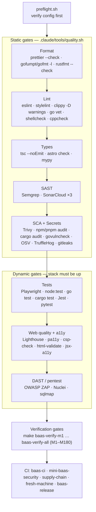

# Tooling Wiki — Master Index

> Every quality, security, and verification tool in the monorepo, what it gates, where it is configured, and the one command that runs it. **All of it runs in Docker.**

---

## Philosophy

There is no host `node`/`npm`/`pnpm`/`go`/`cargo` in this project — **every gate runs inside Docker**, at the **strictest flags** the tool offers (`--max-warnings 0`, `-D warnings`, `tsc --noEmit`, `--check`, `--error-exitcode=1`), and a gate that *didn't run* is treated as uncovered surface, never as a pass. This is the rule, not a guideline: see [`.claude/rules/quality-bar.md`](../../.claude/rules/quality-bar.md) — *"Skipped ≠ passed. A gate that didn't run is uncovered surface."* The canonical all-layer harness is [`.claude/tools/quality.sh`](../../.claude/tools/quality.sh) (surfaced as the `/quality` skill); it auto-detects languages and runs **format → lint → types → SAST → SCA/secrets** (optionally tests) in canonical order, recording PASS / FAIL / **SKIP** — a tool that isn't installed records SKIP, not green. Backend security batteries run through `make baas-security-scan` / `make baas-security-audit` / `make baas-zap`; acceptance gates through `make baas-verify-mNN`.

> **Note on scope.** The backend (**grobase**) is a *nested independent git repo* at `apps/grobase/` with its own CI and `CLAUDE.md`; its gates are invoked with `make -C apps/grobase <target>`. The root pipeline owns only the frontends. See [`08-orchestration-and-verification-gates.md`](./08-orchestration-and-verification-gates.md).

---

## Navigation — the 8 sibling guides

| # | Guide | Covers |
|---|-------|--------|
| 01 | [Format · Lint · Types](./01-format-lint-types.md) | ESLint, Stylelint, html-validate, `astro check`, `tsc`, Prettier, gofumpt/gofmt + go vet, rustfmt, clippy, ShellCheck, mypy/flake8/pylint, Ruff |
| 02 | [SAST & Code Quality](./02-sast-and-code-quality.md) | Semgrep, the three SonarCloud projects, cppcheck, CodeQL (transport-only) |
| 03 | [Supply-chain & Secrets](./03-supply-chain-and-secrets.md) | Trivy, TruffleHog, gitleaks, npm/pnpm audit, cargo audit, govulncheck, OSV-Scanner, Snyk, Checkov, Renovate, minimum-release-age, pnpm overrides |
| 04 | [DAST & Pentest](./04-dast-and-pentest.md) | OWASP ZAP, Nuclei, sqlmap, the `run-audit.sh` orchestrator |
| 05 | [Testing Frameworks](./05-testing-frameworks.md) | Playwright, `node:test`, `go test`, `cargo test`, Jest, pytest, the sim harnesses, `docker-run.sh`, `container-only.mjs` |
| 06 | [Web Quality & Accessibility](./06-web-quality-and-accessibility.md) | Lighthouse, pa11y, csp-check, html-validate, stylelint, jsx-a11y, color-token guard |
| 07 | [Governance & Safety Scripts](./07-governance-and-safety-scripts.md) | preflight, watch, quality, facts, digest, codemap, dupes, untested, lib/common |
| 08 | [Orchestration & Verification Gates](./08-orchestration-and-verification-gates.md) | Make, `make all`, Docker Compose, buildx bake, health gates, M1–M180 verify gates, all CI workflows, Dependabot/Renovate |

---

## Run everything — umbrella commands

| Command | What it runs | Source |
|---------|--------------|--------|
| `.claude/tools/quality.sh` (`--summary` / `--no-audit` / `--with-tests`) | Strict format→lint→types→sast→audit (optionally tests), aggregating PASS/FAIL/SKIP — verify-only | [`.claude/tools/quality.sh`](../../.claude/tools/quality.sh) |
| `/quality` skill | Same harness, surfaced as a command | `.claude/commands/quality.md:14` |
| `.claude/tools/digest.sh` | Start-of-task briefing (facts + preflight + codemap + untested + dupes) | [`.claude/tools/digest.sh`](../../.claude/tools/digest.sh) |
| `make baas-security-scan` | Semgrep (SAST) + npm/pnpm audit + Trivy fs/image + TruffleHog | `infrastructure/makes/baas-verify.mk:246` |
| `make baas-security-audit` | OSV + Trivy/Checkov IaC + Nuclei + sqlmap + web-privacy (live-target gated) | `infrastructure/makes/baas-verify.mk:260` |
| `make baas-zap` | OWASP ZAP baseline DAST (stack must be up; use `BAAS_VERIFY_SAFE_PORTS=1`) | `infrastructure/makes/baas-verify.mk:254` |
| `make -C apps/grobase audit-deps` | cargo audit + govulncheck (Rust + Go SCA) | `apps/grobase/orchestrators/makes/20-stack.mk:150` |
| `make -C apps/grobase test-lint` | Full grobase lint matrix: shell · rust · go · ts · yaml · docker · make | `apps/grobase/orchestrators/makes/100-test.mk` |
| `make -C apps/grobase tests` | Full grobase 14-kind test matrix | `apps/grobase/orchestrators/makes/40-tests.mk` |
| `make baas-verify-m1` … `make baas-verify-all` | Milestone acceptance gates M1–M10 (chain) and M11+ by glob | `infrastructure/makes/baas-verify.mk:132` |
| `make grobase-audit` ⚠ | Lighthouse + pa11y + csp + html-validate (**broken make/compose wiring in this checkout** — see [06](./06-web-quality-and-accessibility.md)) | `infrastructure/makes/grobase.mk:14` |
| `make all` | Whole-machine bring-up → healthcheck → showcase | `infrastructure/makes/pipeline.mk:5` |

---

## THE MASTER MATRIX

Every tool in the catalog, grouped by layer. Config paths and run commands are real (`path:line` / make target). For per-tool gotchas, follow the layer link in each section header.

### Format · Lint · Types → [01](./01-format-lint-types.md)

| Tool | Layer | Purpose | Config | Run command | Scope |
|------|-------|---------|--------|-------------|-------|
| ESLint (opposite-osiris) | lint | JS/TS/Astro correctness + jsx-a11y | `apps/opposite-osiris/eslint.config.mjs:17` | `docker exec track-binocle-opposite-osiris-1 sh -lc 'cd /workspace/apps/opposite-osiris && node scripts/container-only.mjs eslint .'` | opposite-osiris (Astro, pnpm) — **no `--max-warnings 0` in script** |
| ESLint (osionos/app) | lint | React/TS + graph-engine source | `apps/osionos/app/eslint.config.js:18` | `cd apps/osionos/app && bash scripts/docker-run.sh lint` | osionos/app — **STRICT `--max-warnings=0`** |
| ESLint (grobase NestJS) | lint | Control-plane TS, type-aware | `apps/grobase/src/eslint.config.mjs:42` | `make -C apps/grobase test-lint-ts` | grobase backend src (NestJS, npm) |
| Stylelint (opposite-osiris) | lint | SCSS standards | `apps/opposite-osiris/.stylelintrc.json:1` | `docker exec track-binocle-opposite-osiris-1 sh -lc 'cd /workspace/apps/opposite-osiris && node scripts/container-only.mjs stylelint "src/**/*.scss"'` | opposite-osiris SCSS |
| html-validate (opposite-osiris) | lint | Built HTML validity (post-build) | `apps/opposite-osiris/.htmlvalidate.json:1` | `docker exec track-binocle-opposite-osiris-1 sh -lc 'cd /workspace/apps/opposite-osiris && node scripts/container-only.mjs html-validate "dist/**/*.html"'` | opposite-osiris `dist/**` |
| astro check (opposite-osiris) | types | Type-check `.astro` + `.ts` (strict tsconfig) | `apps/opposite-osiris/tsconfig.json:2` | `docker exec track-binocle-opposite-osiris-1 sh -lc 'cd /workspace/apps/opposite-osiris && node scripts/container-only.mjs astro check'` | opposite-osiris |
| tsc --noEmit (osionos/app) | types | Two passes: graph-engine + app, strict | `apps/osionos/app/tsconfig.json:14` | `cd apps/osionos/app && bash scripts/docker-run.sh typecheck` | osionos/app (pnpm) |
| tsc --noEmit (mail + calendar) | types | Strict TS — their only static gate | `apps/mail/tsconfig.json:10`, `apps/calendar/tsconfig.json:10` | `docker exec track-binocle-mail-1 sh -lc 'npm run typecheck'` | mail (:3002) + calendar (:3003) |
| tsc (grobase NestJS) | types | strict + noUnusedLocals/Parameters | `apps/grobase/src/tsconfig.json:14` | `make -C apps/grobase test-nestjs` | grobase backend src |
| tsc (grobase JS SDK) | types | Dedicated typecheck tsconfig | `apps/grobase/sdks/js/package.json:52` | `docker exec ... sh -lc 'cd apps/grobase/sdks/js && npm run typecheck'` | grobase sdks/js |
| Prettier (grobase src) | format | NestJS TS formatting | `apps/grobase/src/.prettierrc:1` | `make -C apps/grobase prettiers-check` | grobase backend src TS (**only grobase uses Prettier**) |
| gofumpt / gofmt + go vet | format/lint | Go format + vet gate | `apps/grobase/orchestrators/makes/100-test.mk:48` | `make -C apps/grobase test-lint-go` | grobase Go control plane (**no golangci-lint config exists**) |
| cargo fmt (rustfmt) | format | Rust data-plane + realtime formatting | `apps/grobase/orchestrators/makes/prettier.mk:28` | `make -C apps/grobase prettier-rust` | grobase Rust workspaces |
| cargo clippy | lint | Rust lint, warnings-as-errors | `apps/grobase/orchestrators/makes/100-test.mk:44` | `make -C apps/grobase test-lint-rust` | grobase Rust — **STRICT `-D warnings`** |
| ShellCheck (grobase) | lint | Shell lint + `bash -n` parse | `apps/grobase/.shellcheckrc` | `make -C apps/grobase test-lint-shell` | grobase tracked `*.sh` |
| mypy / flake8 / pylint | types/lint | Python SDK type-check + lint | `apps/grobase/sdks/python/pyproject.toml:30` | `make -C apps/grobase test-sdk` (compile gate) | grobase sdks/python (mypy strict still TODO) |
| Ruff (vendor/QA) | lint/format | Vendored QA helper only | `vendor/QA/pyproject.toml:30` | `ruff check .` / `ruff format --check .` (in Docker) | vendor/QA only (**not a product app**) |
| quality.sh harness | lint | Repo-wide strict gate aggregator | `.claude/tools/quality.sh` | `.claude/tools/quality.sh` | Whole repo (language-gated) |

### SAST & Code Quality → [02](./02-sast-and-code-quality.md)

| Tool | Layer | Purpose | Config | Run command | Scope |
|------|-------|---------|--------|-------------|-------|
| Semgrep | sast | SAST: OWASP-Top-Ten taint, TS/JS/Node, Dockerfile | `apps/grobase/scripts/security/run-security-scans.sh:81` | `make baas-security-scan SECURITY_ONLY=semgrep` | Whole tree (excludes per `.semgrepignore`) |
| SonarCloud (root) | sast | Bugs, smells, hotspots, duplication (~88k LOC) | `sonar-project.properties:2` | `docker run --rm -e SONAR_TOKEN="$SONAR_TOK" -e SONAR_HOST_URL=https://sonarcloud.io -v "$PWD:/usr/src" sonarsource/sonar-scanner-cli -Dsonar.projectKey=Univers42_ft_transcendence -Dsonar.organization=univers42` | Whole monorepo product code |
| SonarCloud (grobase) | sast | Backend Go/TS/Rust/Py + coverage | `apps/grobase/sonar-project.properties:2` | `make -C apps/grobase sonar-scan` | grobase only — key `Univers42_grobase` |
| SonarCloud (osionos) | sast | osionos React/Vite frontend | `apps/osionos/app/sonar-project.properties:1` | `make -C apps/osionos/app sonar` | osionos — key `Univers42_osionos` |
| cppcheck | lint | C/C++ static analysis (dormant — no first-party C) | `.claude/tools/quality.sh:75` | `bash .claude/tools/quality.sh` | Conditional on `$C=1` detection |
| CodeQL | sast | **Transport only** — `upload-sarif` action, no analyzer | `.github/workflows/mini-baas-security.yml:60` | — | None (engine not run; SARIF upload only) |

### Supply-chain & Secrets → [03](./03-supply-chain-and-secrets.md)

| Tool | Layer | Purpose | Config | Run command | Scope |
|------|-------|---------|--------|-------------|-------|
| Trivy | sca | FS + runtime-image CVEs + IaC misconfig | `apps/grobase/.trivyignore`, `apps/grobase/scripts/security/run-security-scans.sh:173` | `make baas-security-scan SECURITY_ONLY=trivy` | grobase tree + `mini-baas`/`grobase` images |
| TruffleHog | secrets | Verified-only secret scan of git history | `apps/grobase/scripts/security/run-security-scans.sh:280` | `make baas-security-scan SECURITY_ONLY=trufflehog` | grobase git history + working tree |
| gitleaks | secrets | Regex/entropy secret scan (CI-only) | `apps/grobase/.gitleaks.toml` | `gitleaks detect --no-git --source apps/grobase --config apps/grobase/.gitleaks.toml --redact --exit-code 1` | apps/grobase working tree (**no make target**) |
| npm / pnpm audit | sca | Lockfile CVE scan per workspace | `apps/grobase/scripts/security/run-security-scans.sh:128` | `make baas-security-scan SECURITY_ONLY=npm-audit` | grobase src + sdks/js; frontends per-repo |
| cargo audit | sca | Rust RustSec advisory scan | `apps/grobase/scripts/security/audit-deps.sh:59` | `make -C apps/grobase audit-deps` | Rust data-plane (+ realtime in CI) |
| govulncheck | sca | Reachability-based Go vuln scan | `apps/grobase/scripts/security/audit-deps.sh:70` | `make -C apps/grobase audit-deps` | Go control plane |
| OSV-Scanner | sca | OSV.dev multi-ecosystem (⚠ stale paths) | `apps/grobase/scripts/security/audit/osv-scan.sh:41` | `make baas-security-audit AUDIT_ONLY=osv` | grobase lockfiles (likely no-op today) |
| Snyk | sca | SaaS dep + license CVE (CI-only, token-gated) | `.github/workflows/mini-baas-security.yml:111` | `snyk test --all-projects --severity-threshold=high` | CI-only; dormant locally (no token) |
| Checkov | sast | Policy-as-code IaC/Helm/Compose misconfig | `apps/grobase/scripts/security/audit/iac-scan.sh:45` | `make baas-security-audit AUDIT_ONLY=iac` | grobase IaC/Helm/Compose |
| Renovate | governance | Auto dep-update PRs, 3-day release-age hold | `renovate.json:8` | (GitHub app / mend.io bot) | Root repo, npm/pnpm/docker |
| minimum-release-age | governance | Refuse to install too-new packages (7-day) | `apps/osionos/app/.npmrc:1` | (enforced at install time) | osionos/app (full 7-day hold) |
| pnpm overrides (selector+caret) | governance | Force vulnerable transitives to a fixed version | `apps/osionos/app/package.json:89`, `apps/opposite-osiris/package.json:75` | `docker run --rm -v "$PWD:/repo" -w /repo/apps/<app> node:22-alpine sh -lc 'corepack enable && corepack prepare pnpm@11.5.1 --activate && pnpm install --lockfile-only'` | pnpm apps (osionos/app, opposite-osiris) |

### DAST & Pentest → [04](./04-dast-and-pentest.md)

| Tool | Layer | Purpose | Config | Run command | Scope |
|------|-------|---------|--------|-------------|-------|
| OWASP ZAP | dast | Baseline passive scan of WAF/Kong HTTPS edge | `apps/grobase/scripts/verify/zap-baseline.sh:44` | `BAAS_VERIFY_SAFE_PORTS=1 make baas-zap` | Live WAF HTTPS (`https://127.0.0.1:18443`) |
| Nuclei | dast | Template-based DAST of Kong gateway | `apps/grobase/scripts/security/audit/nuclei-scan.sh:92` | `make baas-security-audit AUDIT_ONLY=nuclei` | Live Kong gateway (`http://127.0.0.1:8000`) |
| sqlmap | dast | Automated SQLi pentest of data-plane API | `apps/grobase/scripts/security/audit/sqlmap-scan.sh:112` | `make baas-security-audit AUDIT_ONLY=sqlmap` | Live data-plane query API |
| run-audit.sh orchestrator | dast | Sequences DAST + file-based OSV/IaC, live-gated | `apps/grobase/scripts/security/audit/run-audit.sh:138` | `make baas-security-audit` | Live gateway + site; file-based scanners |

### Testing → [05](./05-testing-frameworks.md)

| Tool | Layer | Purpose | Config | Run command | Scope |
|------|-------|---------|--------|-------------|-------|
| Playwright (osionos e2e) | test | Offline browser e2e of the block editor | `apps/osionos/app/playwright.config.ts:33` | `cd apps/osionos/app && bash scripts/docker-run.sh test-e2e` | osionos editor (`.mjs` specs) |
| Playwright (grobase site) | test | Marketing-site e2e against prod preview | `apps/grobase/vendor/grobase-website/playwright.config.ts:11` | `make grobase-e2e` | grobase marketing site |
| node:test (osionos canvas) | test | Block-model/serialization/tx unit tests | `apps/osionos/app/package.json:14` | `cd apps/osionos/app && bash scripts/docker-run.sh test-canvas` | osionos canvas (`.test.ts`, strip-types) |
| node:test (osionos bridge) | test | Auth-handoff + bridge API tests | `apps/osionos/app/package.json:15` | `cd apps/osionos/app && bash scripts/docker-run.sh test-bridge` | osionos bridge (`.test.mjs`) |
| node:test (grobase JS SDK) | test | `@grobase/js` SDK unit tests | `apps/grobase/sdks/js/package.json:53` | `cd apps/grobase/sdks/js && npm run build && npm test` | grobase sdks/js |
| go test | test | Go control-plane unit/fuzz (vet first, no `-race`) | `apps/grobase/orchestrators/makes/40-tests.mk:36` | `make -C apps/grobase test-go` | grobase Go control plane (92 `*_test.go`) |
| cargo test (data plane) | test | Rust data-plane workspace | `apps/grobase/orchestrators/makes/40-tests.mk:39` | `make -C apps/grobase rust-data-plane-test` | grobase Rust data plane |
| cargo test (realtime) | test | Rust realtime event-bus workspace | `apps/grobase/orchestrators/makes/40-tests.mk:40` | `make -C apps/grobase rust-realtime-test` | grobase realtime workspace |
| Jest (NestJS) | test | NestJS apps/libs unit tests | `apps/grobase/orchestrators/makes/40-tests.mk:41` | `make -C apps/grobase test-nestjs` | grobase NestJS (16 specs) |
| pytest (Python SDK) | test | Python SDK runner (generated stubs are empty) | `apps/grobase/sdks/python/tox.ini:9` | `cd apps/grobase/sdks/python && tox` | grobase sdks/python |
| Playwright sim harnesses | test | Whole-stack org/user-flow simulations | `infrastructure/makes/playground.mk:2` | `make playground` / `make agency-sim` / `make gourmand-sim` | osionos + backend (driver scripts) |
| grobase phase smoke/integration | test | Live-stack phase + milestone integration | `apps/grobase/orchestrators/makes/40-tests.mk:13` | `make -C apps/grobase test-smoke` / `tests` | grobase backend live stack |
| docker-run.sh harness | test | Self-dockerizing osionos build/lint/test entry | `apps/osionos/app/scripts/docker-run.sh:23` | `cd apps/osionos/app && bash scripts/docker-run.sh <cmd>` | osionos (spins ephemeral container) |
| container-only.mjs guard | test | opposite-osiris in-container dispatcher | `apps/opposite-osiris/scripts/container-only.mjs:19` | `docker exec track-binocle-opposite-osiris-1 sh -lc '... node scripts/container-only.mjs <tool>'` | opposite-osiris (**no test framework**) |

### Web Quality & Accessibility → [06](./06-web-quality-and-accessibility.md)

| Tool | Layer | Purpose | Config | Run command | Scope |
|------|-------|---------|--------|-------------|-------|
| Lighthouse (grobase site) | web-quality | Perf/a11y/best-practices/SEO ≥90 ×4 | `apps/grobase/vendor/grobase-website/scripts/audit/lighthouse.mjs:12` | `make grobase-audit` ⚠ broken — `cd apps/grobase/vendor/grobase-website && docker build --target audit -t grobase-site-audit:local . && docker run --rm grobase-site-audit:local` | grobase marketing site (3 pages) |
| pa11y (grobase site) | a11y | WCAG2AA audit in headless Chromium | `apps/grobase/vendor/grobase-website/scripts/audit/pa11y.config.json:2` | `cd apps/grobase/vendor/grobase-website && npm run audit:a11y` | grobase marketing site |
| csp-check (grobase site) | web-quality | CSP correctness (no inline, sha256 hashes) | `apps/grobase/vendor/grobase-website/scripts/audit/csp-check.mjs:52` | `cd apps/grobase/vendor/grobase-website && npm run audit:csp` | grobase marketing site (3 pages) |
| html-validate (web-quality) | web-quality | Built HTML validity over `dist/**` | `apps/grobase/vendor/grobase-website/.htmlvalidate.json:2` | `cd apps/grobase/vendor/grobase-website && npm run lint:html` | grobase site + opposite-osiris |
| stylelint (SCSS) | web-quality | SCSS standards over `src/**/*.scss` | `apps/grobase/vendor/grobase-website/.stylelintrc.json:2` | `cd apps/grobase/vendor/grobase-website && npm run lint:css` | grobase site + opposite-osiris |
| eslint-plugin-jsx-a11y | a11y | `.astro` template a11y lint (via eslint-plugin-astro) | `apps/opposite-osiris/eslint.config.mjs:28` | `docker exec track-binocle-opposite-osiris-1 sh -lc '... node scripts/container-only.mjs eslint .'` | grobase site + opposite-osiris `.astro` |
| Lighthouse (osionos) | web-quality | Perf/a11y against `vite preview` (host script) | `apps/osionos/app/scripts/lighthouse.mjs:25` | `cd apps/osionos/app && npm run lighthouse -- <url>` | osionos (**only host-only script**) |
| check-style-tokens.sh | web-quality | Forbid raw color literals — enforce `var(--osio-*)` | `apps/osionos/app/scripts/check-style-tokens.sh:29` | `cd apps/osionos/app && bash scripts/docker-run.sh quality` | osionos `src/**/*.{css,scss}` |

### Governance & Safety Scripts → [07](./07-governance-and-safety-scripts.md)

| Tool | Layer | Purpose | Config | Run command | Scope |
|------|-------|---------|--------|-------------|-------|
| preflight.sh | governance | Verify env/config BEFORE build (fail fast) | `.claude/tools/preflight.sh:1` | `.claude/tools/preflight.sh` | Repo root (0 ready / 1 missing / 2 arg) |
| watch.sh | governance | Watchdog: hard + idle timeout on any command | `.claude/tools/watch.sh:1` | `.claude/tools/watch.sh --idle 60 -- make build` | Any build/test/install (124 = killed) |
| quality.sh | governance | Strictest all-layer gate, aggregate PASS/FAIL/SKIP | `.claude/tools/quality.sh:1` | `.claude/tools/quality.sh --summary` | All languages auto-detected |
| facts.sh | governance | Cache toolchain facts + detected test frameworks | `.claude/tools/facts.sh:1` | `.claude/tools/facts.sh` | Whole repo (cached to `.claude/cache/`) |
| digest.sh | governance | Start-of-task briefing (composes 5 tools) | `.claude/tools/digest.sh:1` | `.claude/tools/digest.sh` | Whole repo |
| codemap.sh | governance | Queryable source index (lang/loc/symbols/test?) | `.claude/tools/codemap.sh:1` | `.claude/tools/codemap.sh --summary` | Every tracked source file |
| dupes.sh | governance | Find repeated blocks (extraction candidates) | `.claude/tools/dupes.sh:1` | `.claude/tools/dupes.sh --summary` | Every tracked source file |
| untested.sh | governance | List source with no test naming its stem | `.claude/tools/untested.sh:1` | `.claude/tools/untested.sh --summary` | Every tracked source file |
| lib/common.sh | governance | Shared bash library for the governance tools | `.claude/tools/lib/common.sh:1` | `. .claude/tools/lib/common.sh` (sourced) | Sourced by all tools except watch.sh |

### Orchestration & Verification Gates → [08](./08-orchestration-and-verification-gates.md)

| Tool | Layer | Purpose | Config | Run command | Scope |
|------|-------|---------|--------|-------------|-------|
| GNU Make | build | Single coordinator authority (~33 `.mk` fragments) | `Makefile:18-49` | `make help` | Whole monorepo (**no `make quality`**) |
| make all pipeline | ci | From-zero self-provisioning lifecycle | `infrastructure/makes/pipeline.mk:5` | `make all` | Whole machine bring-up |
| Docker Compose (frontends) | build | Root frontend service graph + lean local overlay | `docker-compose.yml`, `docker-compose.local.yml` | `make up` / `docker compose up -d --build <service>` | Root frontends only |
| docker buildx bake | build | Parallel BuildKit frontend image builds | `docker-bake.hcl` | `make compose-build` | Frontend images |
| compose-wait health gate | ci | Poll services healthy/running + init jobs exit-0 | `infrastructure/makes/compose.mk:14` | `make compose-wait` | Root compose services |
| make healthcheck | ci | Probe backend/site/editor/bridge/auth endpoints | `infrastructure/makes/app.mk:53` | `make healthcheck` | Running stack endpoints |
| BaaS verify M1–M10 | ci | Chained milestone acceptance gates | `infrastructure/makes/baas-verify.mk:132` | `make baas-verify-m1` / `make baas-verify-all` | grobase backend |
| BaaS verify M11–M180 | ci | Glob-resolved generic milestone runner | `infrastructure/makes/baas-verify.mk:191` | `make baas-verify-m94` | grobase backend (165 scripts) |
| verify-productization | ci | M11/M12/M18/M19 trust/tenancy/Rust/Go | `infrastructure/makes/baas-verify.mk:227` | `make verify-productization` | grobase planes |
| CI: baas-ci.yml | ci | Go + Rust compile/test + static parity | `.github/workflows/baas-ci.yml:27` | `gh workflow run baas-ci.yml` | apps/grobase |
| CI: mini-baas-security.yml | ci | SAST+SCA+container+secret+DAST battery | `.github/workflows/mini-baas-security.yml:26` | `gh workflow run mini-baas-security.yml` | Repo + grobase |
| CI: supply-chain.yml | ci | Frozen, no-script lockfile installs | `.github/workflows/supply-chain.yml:17` | `gh workflow run supply-chain.yml` | mail, calendar, osionos/app, opposite-osiris |
| CI: fresh-machine.yml | ci | Clean-runner `git clone --recursive` + `make all` | `.github/workflows/fresh-machine.yml:35` | `gh workflow run fresh-machine.yml` | Whole stack end-to-end |
| CI: colleague-docker-pipeline.yml | ci | Full `make all` with Vault-OIDC secrets (⚠ legacy) | `.github/workflows/colleague-docker-pipeline.yml:19` | `gh workflow run colleague-docker-pipeline.yml` | Whole stack (Vault-backed) |
| CI: baas-release.yml | ci | Tag-driven release: gates → bake/push → release | `.github/workflows/baas-release.yml:37` | `git tag baas-v1.0.0 && git push origin baas-v1.0.0` | grobase release artifacts |
| CI: baas-cli-publish.yml | ci | Build/smoke/pack SDK; publish on tag | `.github/workflows/baas-cli-publish.yml:45` | `git tag baas-cli-v0.2.0 && git push origin baas-cli-v0.2.0` | apps/grobase/sdks/js |
| Dependabot | governance | Auto-update GitHub Actions only (weekly) | `.github/dependabot.yml:14` | — | Root repo github-actions |
| Renovate | governance | Auto-update npm/pnpm + docker, dashboard-gated | `renovate.json:1` | — | npm/pnpm + docker managers |

---

## The pipeline, end to end

The canonical order — **fail early, fix cheap** — from static format checks through dynamic pentest and milestone acceptance gates.

---

### Conventions baked into the matrix

- **Container naming:** root frontends are `track-binocle-<service>-1`; the backend is the separate `mini-baas` compose project (`mini-baas-*`).
- **Package managers:** pnpm → opposite-osiris, osionos/app, grobase-website · npm → mail, calendar, grobase src + sdks/js · Poetry → grobase sdks/python.
- **Strictness is asymmetric:** osionos ESLint is `--max-warnings=0` and clippy is `-D warnings`, but opposite-osiris `npm run lint` is bare `eslint .` (warnings don't fail it) — the generic `quality.sh` gate is what enforces `--max-warnings 0` everywhere.
- **Known-broken in this checkout:** `make grobase-audit` / `make grobase-e2e` (no compose service defined — use the Docker `--target audit` reproduce); OSV/IaC audit paths are stale post-flatten. Details in [04](./04-dast-and-pentest.md) and [06](./06-web-quality-and-accessibility.md).
